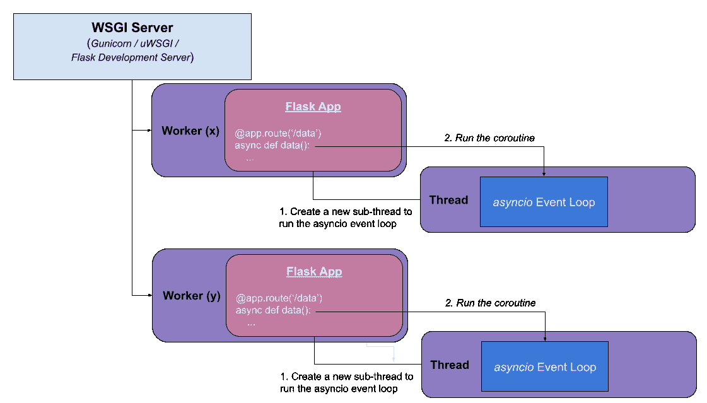
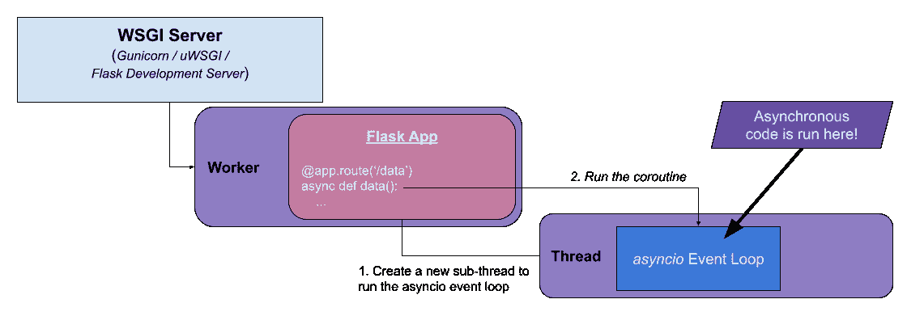
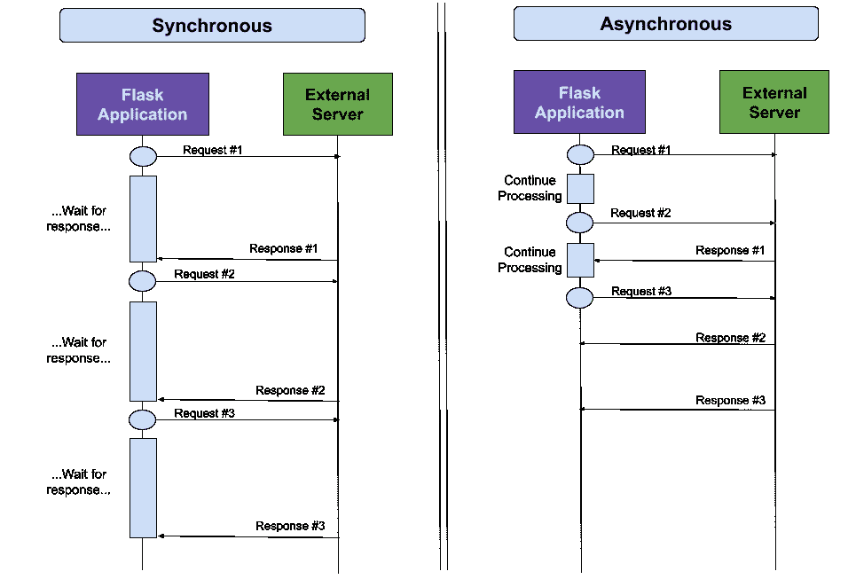
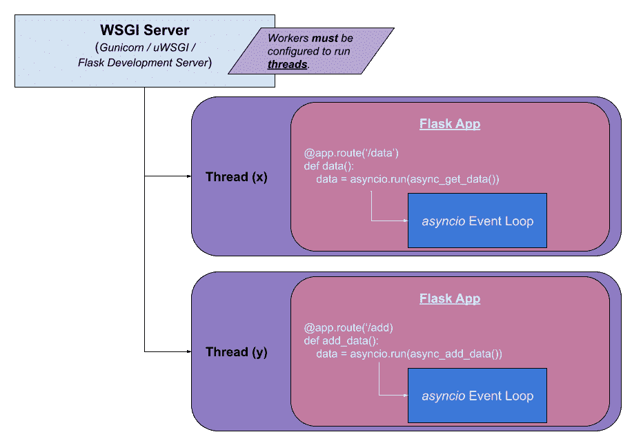

# 烧瓶 2.0 中的异步

> 原文：<https://testdriven.io/blog/flask-async/>

2021 年 5 月 11 日发布的【Flask 2.0，增加了对异步路由、错误处理程序、前后请求函数、拆机回调的内置支持！

本文着眼于 Flask 2.0 的新异步功能，以及如何在 Flask 项目中利用它。

> 本文假设您之前有使用 Flask 的经验。如果您有兴趣了解有关 Flask 的更多信息，请查看我关于如何构建、测试和部署 Flask 应用程序的课程:
> 
> [用 Python 和 Flask 开发 Web 应用](/courses/learn-flask/)

## 烧瓶 2.0 异步

从 Flask 2.0 开始，您可以使用`async` / `await`创建异步路由处理程序:

```py
`import asyncio

async def async_get_data():
    await asyncio.sleep(1)
    return 'Done!'

@app.route("/data")
async def get_data():
    data = await async_get_data()
    return data` 
```

创建异步路由与创建同步路由一样简单:

1.  你只需要通过`pip install "Flask[async]"`安装带有额外`async`的烧瓶。
2.  然后，您可以将关键字`async`添加到您的函数中，并使用`await`。

### 这是如何工作的？

下图说明了如何在 Flask 2.0 中执行异步代码:



为了在 Python 中运行异步代码，需要一个事件循环来运行[协程](https://docs.python.org/3/library/asyncio-task.html#coroutines)。Flask 2.0 负责创建 asyncio 事件循环——通常用`asyncio.run()`完成——以运行协程。

> 如果您有兴趣了解更多关于 Python 中线程、多处理和异步的区别，请查看[用并发、并行和异步加速 Python 的文章](/blog/concurrency-parallelism-asyncio/)。

当处理一个`async` route 函数时，将创建一个新的子线程。在这个子线程中，将执行一个 asyncio 事件循环来运行路由处理程序(协程)。

这个实现利用 Django 使用的`asgiref`库(特别是 [AsyncToSync](https://github.com/django/asgiref/blob/main/asgiref/sync.py#L100) 功能)来运行异步代码。

> 更多实现细节，请参考 Flask 源代码中的 [`async_to_sync()`](https://github.com/pallets/flask/blob/47f0e799db8d8e379a1fd9bf48ce3a8b7d5bfe73/src/flask/app.py#L1586) 。

这个实现的伟大之处在于它允许 Flask 在任何工作类型(线程、gevent、eventlet 等)下运行。).

> 在 Flask 2.0 之前运行异步代码需要在每个路由处理程序中创建一个新的 asyncio 事件循环，这就需要使用基于线程的工作器来运行 Flask 应用程序。更多细节将在本文后面介绍...

此外，异步路由处理程序的使用是**向后兼容的**。您可以在 Flask 应用程序中使用异步和同步路由处理程序的任意组合，而不会影响性能。这允许您在现有的 Flask 项目中立即开始原型化单个异步路由处理程序。

### 为什么不需要 ASGI？

按照设计，Flask 是一个实现 WSGI (Web 服务器网关接口)协议的**同步** web 框架。

> WSGI 是 web 服务器和基于 Python 的 web 应用程序之间的接口。WSGI (Web 服务器网关接口)服务器(如 Gunicorn 或 uWSGI)是 Python web 应用程序所必需的，因为 Web 服务器不能直接与 Python 通信。
> 
> 想了解更多关于 WSGI 的知识吗？
> 
> 看看[‘Python 中的 Gunicorn 是什么？’](https://www.quora.com/What-is-Gunicorn-in-Python/answer/Michael-Herman-3)看看[构建 Python Web 框架](https://testdriven.io/courses/python-web-framework/wsgi/)课程。

在 Flask 中处理请求时，每个请求都在一个 worker 中单独处理。添加到 Flask 2.0 的异步功能总是在被处理的单个请求中:



请记住，尽管异步代码可以在 Flask 中执行，但它是在同步框架的上下文中执行的。换句话说，虽然您可以在单个请求中执行各种异步任务，但是每个异步任务必须在响应被发回之前完成。因此，在有限的情况下，异步路由实际上是有益的。还有其他 Python web 框架支持 [ASGI(异步服务器网关接口)](https://asgi.readthedocs.io/en/latest/)，它支持异步调用栈，因此路由可以并发运行:

## 什么时候应该使用异步？

虽然异步执行往往会主导讨论并成为头条新闻，但它并不是每种情况下的最佳方法。

当这两个条件都满足时，它是受 [I/O 限制的](/blog/python-concurrency-parallelism/#io-bound-operation)操作的理想选择:

1.  有很多手术
2.  每个操作不到几秒钟就能完成

例如:

1.  进行 HTTP 或 API 调用
2.  与数据库交互
3.  使用文件系统

不适合[后台](https://flask.palletsprojects.com/en/2.0.x/async-await/#background-tasks)和长时间运行的任务以及 [cpu 受限的](https://testdriven.io/blog/python-concurrency-parallelism/#cpu-bound-operation)操作，比如:

1.  运行机器学习模型
2.  处理图像或 pdf
3.  执行备份

使用像 [Celery](/courses/flask-celery/) 这样的任务队列来管理单独的长时间运行的任务会更好地实现这样的任务。

### 异步 HTTP 调用

当您需要向外部网站或 API 发出多个 HTTP 请求时，异步方法确实有好处。对于每一个请求，都需要很长时间才能收到响应。这种等待时间会让你的用户觉得你的 web 应用程序运行缓慢。

通过利用`async` / `await`，您可以大大加快流程，而不是一次发出一个外部请求(通过[请求](https://requests.readthedocs.io/)包)。



在同步方法中，进行外部 API 调用(比如 GET ),然后应用程序等待返回响应。获得响应所需的时间称为延迟，它因互联网连接和服务器响应时间而异。在这种情况下，每个请求的延迟可能在 0.2 - 1.5 秒的范围内。

在异步方法中，进行外部 API 调用，然后处理继续进行下一个 API 调用。一旦收到来自外部服务器的响应，就会对其进行处理。这是一种更有效的资源利用方式。

> 一般来说，异步编程非常适合这样的情况，在这种情况下，需要进行多个外部调用，并且需要等待大量的 I/O 响应。

## 异步路由处理器

[aiohttp](https://docs.aiohttp.org/) 是一个使用 asyncio 创建异步 http 客户端和服务器的包。如果您熟悉用于同步执行 http 调用的[请求](https://requests.readthedocs.io/)包，aiohttp 是一个类似的包，它专注于异步 HTTP 调用。

这是一个在烧瓶路线中使用的 aiohttp 的例子:

```py
`urls = ['https://www.kennedyrecipes.com',
        'https://www.kennedyrecipes.com/breakfast/pancakes/',
        'https://www.kennedyrecipes.com/breakfast/honey_bran_muffins/']

# Helper Functions

async def fetch_url(session, url):
    """Fetch the specified URL using the aiohttp session specified."""
    response = await session.get(url)
    return {'url': response.url, 'status': response.status}

# Routes

@app.route('/async_get_urls_v2')
async def async_get_urls_v2():
    """Asynchronously retrieve the list of URLs."""
    async with ClientSession() as session:
        tasks = []
        for url in urls:
            task = asyncio.create_task(fetch_url(session, url))
            tasks.append(task)
        sites = await asyncio.gather(*tasks)

    # Generate the HTML response
    response = '<h1>URLs:</h1>'
    for site in sites:
        response += f"<p>URL: {site['url']} --- Status Code: {site['status']}</p>"

    return response` 
```

> 你可以在 GitLab 上的 [flask-async](https://gitlab.com/patkennedy79/flask-async) repo 中找到这个例子的源代码。

`async_get_urls_v2()`协程使用一种常见的 asyncio 模式:

1.  创建多个异步任务(`asyncio.create_task()`)
2.  并发运行它们(`asyncio.gather()`)

## 测试异步路由

您可以像通常使用 [pytest](https://docs.pytest.org/) 一样测试异步路由处理程序，因为 Flask 处理所有的异步处理:

```py
`@pytest.fixture(scope='module')
def test_client():
    # Create a test client using the Flask application
    with app.test_client() as testing_client:
        yield testing_client  # this is where the testing happens!

def test_async_get_urls_v2(test_client):
    """
 GIVEN a Flask test client
 WHEN the '/async_get_urls_v2' page is requested (GET)
 THEN check that the response is valid
 """
    response = test_client.get('/async_get_urls_v2')
    assert response.status_code == 200
    assert b'URLs' in response.data` 
```

这是使用`test_client` fixture 对来自`/async_get_urls_v2` URL 的有效响应的基本检查。

## 更多异步示例

在 Flask 2.0 中，请求回调也可以是异步的:

```py
`# Helper Functions

async def load_user_from_database():
    """Mimics a long-running operation to load a user from an external database."""
    app.logger.info('Loading user from database...')
    await asyncio.sleep(1)

async def log_request_status():
    """Mimics a long-running operation to log the request status."""
    app.logger.info('Logging status of request...')
    await asyncio.sleep(1)

# Request Callbacks

@app.before_request
async def app_before_request():
    await load_user_from_database()

@app.after_request
async def app_after_request(response):
    await log_request_status()
    return response` 
```

错误处理程序还有:

```py
`# Helper Functions

async def send_error_email(error):
    """Mimics a long-running operation to log the error."""
    app.logger.info('Logging status of error...')
    await asyncio.sleep(1)

# Error Handlers

@app.errorhandler(500)
async def internal_error(error):
    await send_error_email(error)
    return '500 error', 500` 
```

## 烧瓶 1.x 异步

通过使用`asyncio.run()`管理 asyncio 事件循环，您可以在 Flask 1.x 中模拟 Flask 2.0 异步支持:

```py
`# Helper Functions

async def fetch_url(session, url):
    """Fetch the specified URL using the aiohttp session specified."""
    response = await session.get(url)
    return {'url': response.url, 'status': response.status}

async def get_all_urls():
    """Retrieve the list of URLs asynchronously using aiohttp."""
    async with ClientSession() as session:
        tasks = []
        for url in urls:
            task = asyncio.create_task(fetch_url(session, url))
            tasks.append(task)
        results = await asyncio.gather(*tasks)

    return results

# Routes

@app.route('/async_get_urls_v1')
def async_get_urls_v1():
    """Asynchronously retrieve the list of URLs (works in Flask 1.1.x when using threads)."""
    sites = asyncio.run(get_all_urls())

    # Generate the HTML response
    response = '<h1>URLs:</h1>'
    for site in sites:
        response += f"<p>URL: {site['url']} --- Status Code: {site['status']}</p>"
    return response` 
```

`get_all_urls()`协程实现了类似于`async_get_urls_v2()`路由处理程序的功能。

### 这是如何工作的？

为了让 [asyncio 事件循环](https://docs.python.org/3/library/asyncio-task.html#running-an-asyncio-program)在 Flask 1.x 中正确运行，Flask 应用程序必须使用线程运行(Gunicorn、uWSGI 和 Flask 开发服务器的默认工作类型):



当请求被处理时，每个线程将运行 Flask 应用程序的一个实例。在每个线程中，为运行任何异步操作创建一个单独的 asyncio 事件循环。

### 测试协程

您可以使用 [pytest-asyncio](https://github.com/pytest-dev/pytest-asyncio) 来测试异步代码，如下所示:

```py
`@pytest.mark.asyncio
async def test_fetch_url():
    """
 GIVEN an `asyncio` event loop
 WHEN the `fetch_url()` coroutine is called
 THEN check that the response is valid
 """
    async with aiohttp.ClientSession() as session:
        result = await fetch_url(session, 'https://www.kennedyrecipes.com/baked_goods/bagels/')

    assert str(result['url']) == 'https://www.kennedyrecipes.com/baked_goods/bagels/'
    assert int(result['status']) == 200` 
```

这个测试函数使用了`@pytest.mark.asyncio` decorator，它告诉 pytest 使用 asyncio 事件循环将协程作为 asyncio 任务执行。

## 结论

Flask 2.0 中添加的异步支持是一个惊人的特性！然而，只有当异步代码比等效的同步代码更有优势时，才应该使用异步代码。正如您所看到的，异步执行有意义的一个例子是当您必须在一个路由处理程序中进行多个 HTTP 调用时。

--

我使用 Flask 2.0 异步函数(`async_get_urls_v2()`)和等效的同步函数进行了一些计时测试。我给每条路线打了十个电话:

| 类型 | 平均时间(秒) | 平均时间(秒) |
| --- | --- | --- |
| 同步的 | 4.071443 | 3.419016 |
| 异步的 | 0.531841 | 0.406068 |

异步版本大约快 8 倍！因此，如果您必须在一个路由处理程序中进行多个外部 HTTP 调用，那么使用 asyncio 和 aiohttp 增加的复杂性肯定是合理的，因为执行时间显著减少了。

如果你想了解更多关于 Flask 的知识，一定要看看我的课程- [用 Python 和 Flask 开发 Web 应用](/courses/learn-flask/)。