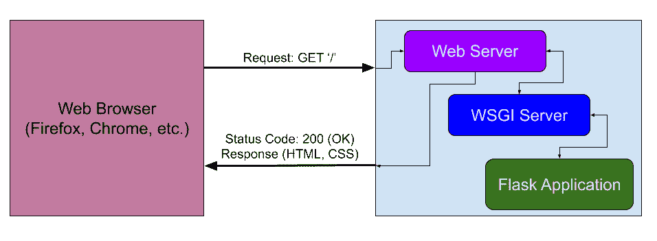
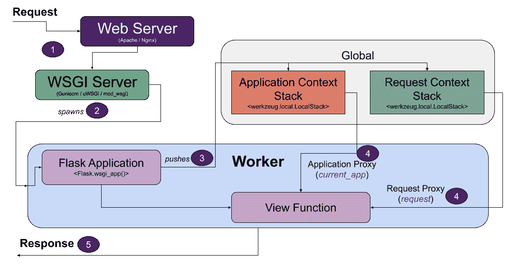
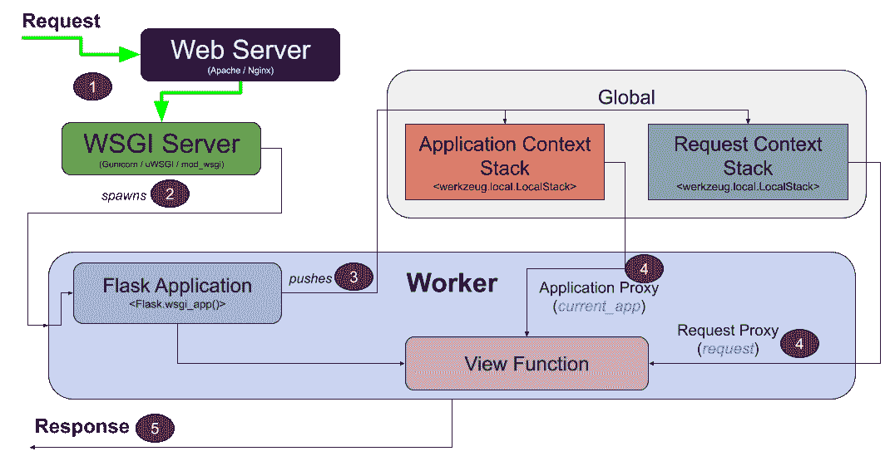
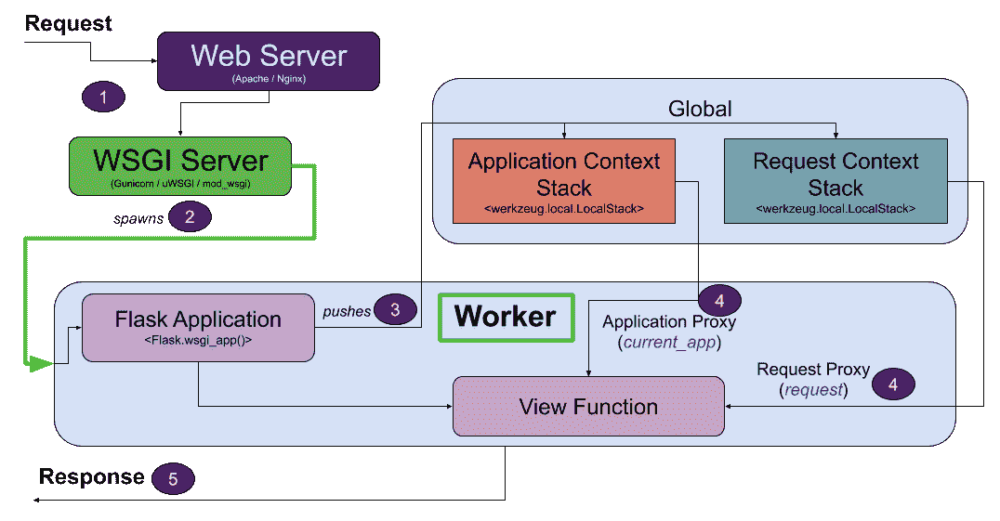
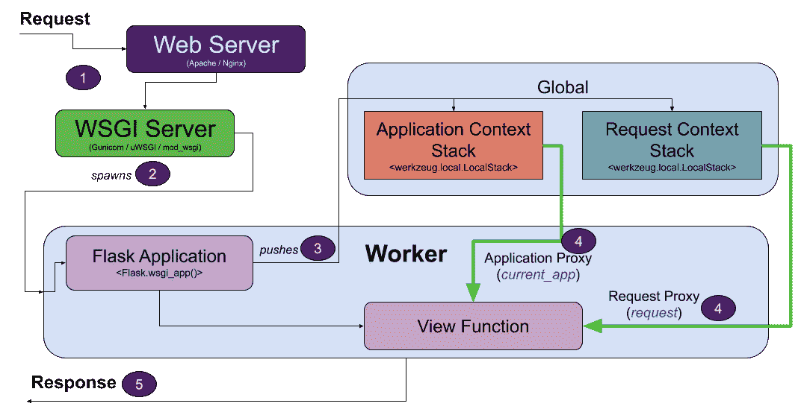
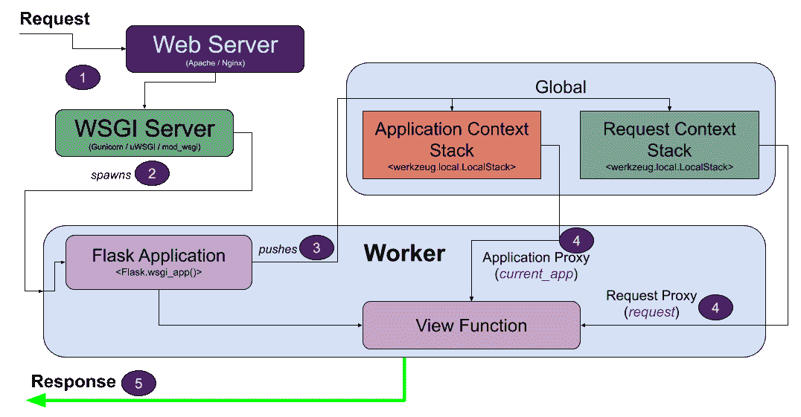
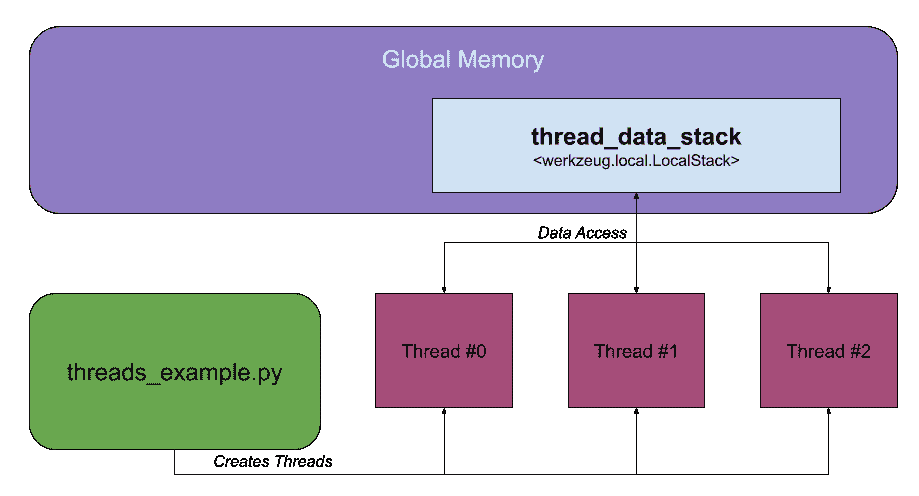

# 深入研究 Flask 的应用程序和请求上下文

> 原文：<https://testdriven.io/blog/flask-contexts-advanced/>

本文探讨了应用程序和请求上下文在 Flask 中是如何工作的。

* * *

这是关于 Flask 上下文的两部分系列的第二部分:

1.  **基础知识** : [理解 Flask 中的应用和请求上下文](/blog/flask-contexts/)
2.  **高级** : [深入探讨 Flask 的应用和需求背景](/blog/flask-contexts-advanced/)(本文！)

虽然您不必从第一篇文章开始，但建议至少回顾一下，为本文提供一点背景知识。

## 目标

在本文结束时，你应该能够解释:

1.  什么是语境
2.  哪些数据存储在应用程序和请求上下文中
3.  在 Flask 中处理请求时，处理应用程序和请求上下文所需的步骤
4.  如何使用应用程序和请求上下文的代理
5.  如何在视图函数中使用`current_app`和`request`代理
6.  什么是局部上下文

## 什么是语境？

为了执行你写的代码，它需要数据来处理。这些数据可以是配置数据、输入数据、来自数据库的数据等等。

[上下文](https://en.wikipedia.org/wiki/Context_(computing))用于跟踪你的代码需要执行的数据。

在 Flask 中，上下文用于提供必要的数据来处理请求和命令行界面(CLI)命令。

> 虽然本文的重点是处理请求，但是所介绍的概念也适用于 CLI 命令。

## 请求处理

让我们从一个高层次的请求是如何处理的开始:



因此，从浏览器向 web 服务器(如 Nginx 或 Apache)发送一个请求，请求一个特定的 URL(上图中的“/”URL)。然后，web 服务器将这个请求路由到 WSGI 服务器进行处理。

> WSGI 代表 web 服务器网关接口，是 web 服务器和基于 Python 的 Web 应用程序之间的接口。这是必需的，因为网络服务器不能直接与 Python 应用程序对话。更多信息，请查看 [WSGI](/courses/python-web-framework/wsgi/) 。

WSGI 服务器告诉 Flask 应用程序处理请求。

Flask 应用程序生成一个响应，该响应被发送回 WSGI 服务器和 web 服务器，并最终返回到 web 浏览器。

这些步骤描述了请求-响应周期，这是如何通过 web 服务器、WSGI 应用服务器和 web 应用程序处理请求的关键功能。

## 烧瓶中的上下文

当接收到请求时，Flask 提供两个上下文:

| 语境 | 描述 | 可用对象 |
| --- | --- | --- |
| [应用](https://flask.palletsprojects.com/en/2.0.x/appcontext/) | 跟踪应用程序级数据(配置变量、记录器、数据库连接) | `current_app`，`g` |
| [请求](https://flask.palletsprojects.com/en/2.0.x/reqcontext/) | 跟踪请求级数据(URL、HTTP 方法、头、请求数据、会话信息) | `request`，`session` |

> 值得注意的是，上述每个对象通常被称为“代理”。这仅仅意味着它们是对象全局风格的代理。我们稍后将对此进行更深入的探讨。

当收到请求时，Flask 处理这些上下文的创建。它们会造成混乱，因为根据应用程序所处的状态，您并不总是能够访问特定的对象。

### 概览图

下图说明了处理请求时如何处理上下文:



该图中有很多内容，因此我们将详细介绍每一步。

### 步骤 1 - Web 和 WSGI 服务器

当 web 服务器收到请求时，一切都开始了:



web 服务器的工作是将传入的 HTTP 请求路由到一个 [WSGI](https://en.wikipedia.org/wiki/Web_Server_Gateway_Interface) 服务器。

Apache 和 [Nginx](https://www.nginx.com) 是两种常见的 web 服务器，而 [Gunicorn](https://gunicorn.org) 、 [uWSGI](https://uwsgi-docs.readthedocs.io/) 和 [mod_wsgi](https://modwsgi.readthedocs.io/) 是流行的 WSGI 服务器。

> 值得注意的是，虽然 [Flask 开发服务器](https://flask.palletsprojects.com/en/2.0.x/server/)是一个 WSGI 服务器，但它并不打算用于生产。

### 第二步-工人

为了处理请求，WSGI 服务器产生一个工作器来处理请求:



工作者可以是线程、进程或协程。例如，如果您使用 Flask Development Server 的默认配置，那么工作线程就是线程。

> 如果您有兴趣了解更多关于 Python 中线程、多处理和异步的区别，请查看[用并发、并行和异步加速 Python 的文章](/blog/concurrency-parallelism-asyncio/)和 Python 中的[并发视频](https://www.youtube.com/watch?v=9zinZmE3Ogk)。

对于这个解释，工作者类型并不重要；关于 worker 的关键点是它一次处理一个请求(因此需要不止一个 worker)。

### 步骤 3 -背景

一旦执行切换到 Flask 应用，Flask 就创建[应用](https://flask.palletsprojects.com/en/2.0.x/appcontext/)和[请求](https://flask.palletsprojects.com/en/2.0.x/reqcontext/)上下文，并将它们推送到各自的堆栈上:


回顾一下，应用程序上下文存储应用程序级别的数据，例如配置变量、数据库连接和记录器。同时，请求上下文存储需要处理的特定于请求的数据，以便生成响应。

这可能令人惊讶，但是两个栈都是作为全局对象实现的(这将在下一节中变得更清楚)。

### 第 4 步-代理

既然 Flask 应用程序已经准备好处理数据(在视图函数中),并且数据已经在应用程序和请求上下文堆栈中准备好了，我们需要一种方法来连接这两个部分...[代理人](https://flask.palletsprojects.com/en/2.0.x/reqcontext/#notes-on-proxies)来救援了！



视图函数使用代理来访问应用程序(存储在应用程序上下文堆栈中)和请求上下文(存储在请求上下文堆栈中):

*   `current_app` -工作者应用程序上下文的代理
*   `request` -工作者请求上下文的代理

乍一看，这个序列可能会令人困惑，因为 view 函数似乎是通过代理访问全局对象(应用程序和请求上下文堆栈)。如果是这样的话，这个操作就会有问题，因为它不是线程安全的。您也可能认为这些堆栈(作为全局对象)可以被任何工作者访问，这是一个安全问题。

不过，这种设计是 Flask 的一大特色...栈被实现为[上下文本地](https://werkzeug.palletsprojects.com/en/2.0.x/local/)对象。

> 关于代理的更多信息，请查看 Flask 文档中关于代理的注释和 T2 的代理模式文章。

#### 上下文局部变量

Python 有一个[线程本地数据](https://docs.python.org/3/library/threading.html#thread-local-data)的概念，用于存储特定于线程的数据，这既是“线程安全的，也是线程唯一的”。换句话说，每个线程都能够以线程安全的方式访问数据，并且数据对于特定的线程总是唯一的。

Flask 实现了类似的行为(上下文局部变量)，但是以一种更通用的方式允许工作线程、进程或协程。

> [Context-locals](https://werkzeug.palletsprojects.com/en/2.0.x/local/) 实际上是在 [Werkzeug](https://werkzeug.palletsprojects.com/en/2.0.x/) 中实现的，它是组成 Flask 的关键包之一。为简单起见，在讨论上下文局部变量时，我们将引用 Flask。

当数据存储在本地上下文对象中时，数据的存储方式只有一个工作线程可以检索。因此，如果两个独立的工作者访问一个上下文本地对象，他们将各自得到自己的特定数据，这些数据对每个工作者来说是唯一的。

> 下一节将给出一个使用上下文本地对象的例子。

总的来说，`current_app`和`request`代理在每个视图函数中都是可用的，它们用于从各自的堆栈中访问上下文，这些堆栈存储为上下文本地对象。

> 在应用程序和请求上下文堆栈的上下文中使用“stack”使得这个概念更加混乱。这些“堆栈”通常只存储一个上下文。
> 
> 使用的数据结构是一个堆栈，因为有非常高级的场景(例如，[内部重定向](https://flask.palletsprojects.com/en/2.0.x/reqcontext/#how-the-context-works))需要不止一个元素。

#### Flask 中代理的好处

如果您要从头开始创建自己的 web 框架，您可以考虑将应用程序和请求上下文传递给每个视图函数，如下所示:

```py
`@app.route('/add_item', methods=['GET', 'POST'])
def add_item(application_context, request_context):  # contexts passed in!
   if request_context.method == 'POST':
       # Save the form data to the database
       ...
       application_context.logger.info(f"Added new item ({ request_context.form['item_name'] })!")
       ...` 
```

事实上，许多 web 框架都是这样工作的(包括 [Django](https://www.djangoproject.com) )。

然而，Flask 提供了`current_app`和`request`代理，它们最终看起来像视图函数的全局变量:

```py
`from flask import current_app, request

@app.route('/add_item', methods=['GET', 'POST'])
def add_item():
   if request.method == 'POST':
       # Save the form data to the database
       ...
       current_app.logger.info(f"Added new item ({ request.form['item_name'] })!")
       ...` 
```

通过使用这种方法，view 函数不需要作为参数传入的上下文；这种方法有助于简化视图函数定义。这可能会造成混乱，因为您并不总是能够访问`current_app`和`request`代理，这取决于您的应用程序所处的状态。

> 提醒:`current_app`和`request`代理实际上不是全局变量；它们指向作为上下文局部变量实现的全局对象，所以代理对于每个工作者来说总是**唯一的**。

### 第五步-清理

生成响应后，请求和应用程序上下文从各自的堆栈中弹出:



这一步清理堆栈。

然后，响应被发送回 web 浏览器，从而完成对该请求的处理。

## 上下文-本地

上下文本地对象是使用[本地](https://werkzeug.palletsprojects.com/en/2.0.x/local/)对象实现的，可以这样创建:

```py
`$ python

>>> from werkzeug.local import Local
>>> data = Local()
>>> data.user = '[[email protected]](/cdn-cgi/l/email-protection)'` 
```

每个上下文(即上一节中讨论的“工人”)都可以访问一个`Local`对象来存储上下文特有的数据。所访问的数据对于上下文是唯一的，并且只能由该上下文访问。

[LocalStack](https://werkzeug.palletsprojects.com/en/2.0.x/local/#werkzeug.local.LocalStack) 对象类似于`Local`对象，但是保留一个对象栈以允许`push()`和`pop()`操作。

在上一节中，我们学习了在 Flask 中处理请求时如何利用应用程序上下文堆栈和请求上下文堆栈。这些堆栈在 Flask 的全局内存中被实现为`LocalStack`对象。

为了帮助巩固上下文局部变量的工作方式，我们来看一个例子，在全局内存中创建一个`LocalStack`对象，然后让三个单独的线程访问它:



下面是这个例子的完整脚本:

```py
`"""
Example script to illustrate how a global `LocalStack` object can be used
when working with multiple threads.
"""
import random
import threading
import time

from werkzeug.local import LocalStack

# Create a global LocalStack object for storing data about each thread
thread_data_stack = LocalStack()

def long_running_function(thread_index: int):
    """Simulates a long-running function by using time.sleep()."""

    thread_data_stack.push({'index': thread_index, 'thread_id': threading.get_native_id()})
    print(f'Starting thread #{thread_index}... {thread_data_stack}')

    time.sleep(random.randrange(1, 11))

    print(f'LocalStack contains: {thread_data_stack.top}')
    print(f'Finished thread #{thread_index}!')
    thread_data_stack.pop()

if __name__ == "__main__":
    threads = []

    # Create and start 3 threads that each run long_running_function()
    for index in range(3):
        thread = threading.Thread(target=long_running_function, args=(index,))
        threads.append(thread)
        thread.start()

    # Wait until each thread terminates before the script exits by
    # 'join'ing each thread
    for thread in threads:
        thread.join()

    print('Done!')` 
```

这个文件创建了一个`LocalStack`对象(`thread_data_stack`)，用于存储将要创建的每个线程的数据。

> `thread_data_stack`模仿 Flask 中的应用上下文栈或请求上下文栈。

`long_running_function`在每个线程中运行:

```py
`def long_running_function(thread_index: int):
    """Simulates a long-running function by using time.sleep()."""

    thread_data_stack.push({'index': thread_index, 'thread_id': threading.get_native_id()})
    print(f'Starting thread #{thread_index}... {thread_data_stack}')

    time.sleep(random.randrange(1, 11))

    print(f'LocalStack contains: {thread_data_stack.top}')
    print(f'Finished thread #{thread_index}!')
    thread_data_stack.pop()` 
```

该函数将关于线程的数据推送到全局内存中的`thread_data_stack`对象:

```py
`thread_data_stack.push({'index': thread_index, 'thread_id': threading.get_native_id()})` 
```

> 这个操作模拟了应用程序或请求上下文被推送到它们各自的堆栈。

在`time.sleep()`功能完成后，来自`thread_data_stack`的数据被访问:

```py
`print(f'LocalStack contains: {thread_data_stack.top}')` 
```

> 这个操作模仿使用`app_context`和`request`代理，因为这些代理访问它们各自栈顶的数据。

函数结束时，数据从`thread_data_stack`弹出:

> 该操作模拟从各自的堆栈中弹出应用程序或请求上下文。

当脚本运行时，它将启动 3 个线程:

```py
`# Create and start 3 threads that each run long_running_function()
for index in range(3):
    thread = threading.Thread(target=long_running_function, args=(index,))
    threads.append(thread)
    thread.start()` 
```

并且`join`每个线程，因此脚本等待直到每个线程完成执行:

```py
`# Wait until each thread terminates before the script exits by
# 'join'ing each thread
for thread in threads:
    thread.join()` 
```

让我们运行这个脚本来看看会发生什么:

```py
`$ python app.py

Starting thread #0... <werkzeug.local.LocalStack object at 0x109cebc40>
Starting thread #1... <werkzeug.local.LocalStack object at 0x109cebc40>
Starting thread #2... <werkzeug.local.LocalStack object at 0x109cebc40>
LocalStack contains: {'index': 0, 'thread_id': 320270}
Finished thread #0!
LocalStack contains: {'index': 1, 'thread_id': 320271}
Finished thread #1!
LocalStack contains: {'index': 2, 'thread_id': 320272}
Finished thread #2!
Done!` 
```

每个线程真正有趣的是它们都指向内存中同一个`LocalStack`对象:

```py
`Starting thread #0... <werkzeug.local.LocalStack object at 0x109cebc40>
Starting thread #1... <werkzeug.local.LocalStack object at 0x109cebc40>
Starting thread #2... <werkzeug.local.LocalStack object at 0x109cebc40>` 
```

当每个线程访问`thread_data_stack`时，这个访问**对于那个线程来说是唯一的**！这就是`LocalStack`(和`Local`)的神奇之处——它们允许上下文特有的访问:

```py
`LocalStack contains: {'index': 0, 'thread_id': 320270}
LocalStack contains: {'index': 1, 'thread_id': 320271}
LocalStack contains: {'index': 2, 'thread_id': 320272}` 
```

> 与典型的全局内存访问不同，对`thread_data_stack`的访问也是线程安全的。

## 结论

Flask 的一个强大(但令人困惑)的方面是如何处理应用程序和请求上下文。希望这篇文章对这个话题有所澄清！

应用程序和请求上下文在处理请求或 CLI 命令时提供必要的数据。确保使用`current_app`和`request`代理来访问应用程序上下文和请求上下文。

想了解更多？看看下面这个来自 FlaskCon 2020 的视频:

> 如果您有兴趣了解有关 Flask 的更多信息，请查看我关于如何构建、测试和部署 Flask 应用程序的课程: