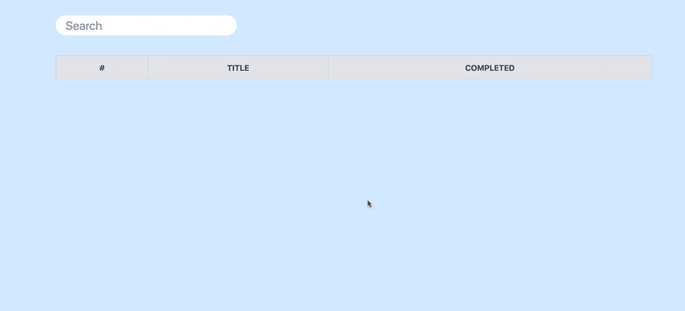

# 使用 Flask、htmx 和 Tailwind CSS 进行快速原型制作

> 原文：<https://testdriven.io/blog/flask-htmx-tailwind/>

在本教程中，你将学习如何用 [htmx](https://htmx.org/) 和 [Tailwind CSS](https://tailwindcss.com/) 设置 Flask。htmx 和 Tailwind 的目标都是简化现代 web 开发，这样您就可以设计和实现交互性，而不会离开 HTML 的舒适和方便。我们还将看看如何使用 [Flask-Assets](https://flask-assets.readthedocs.io/) 在 Flask 应用中捆绑和缩小静态资产。

## htmx

htmx 是一个库，它允许你直接从 HTML 访问现代浏览器特性，如 AJAX、CSS 转换、WebSockets 和服务器发送的事件，而不是使用 JavaScript。它允许您直接在标记中快速构建用户界面。

htmx 扩展了浏览器已经内置的几个特性，比如发出 HTTP 请求和响应事件。例如，您可以使用 HTML 属性在任何 HTML 元素上发送 GET、POST、PUT、PATCH 或 DELETE 请求，而不仅仅是通过`a`和`form`元素发出 GET 和 POST 请求:

```py
`<button hx-delete="/user/1">Delete</button>` 
```

您还可以更新页面的某些部分来创建单页应用程序(SPA):

见 [CodePen](https://codepen.io) 上 Michael Herman ( [@mjhea0](https://codepen.io/mjhea0) )的笔 [RwoJYyx](https://codepen.io/mjhea0/pen/RwoJYyx) 。

[CodePen 链接](https://codepen.io/mjhea0/pen/RwoJYyx)

在浏览器的开发工具中打开网络标签。当点击按钮时，一个 XHR 请求被发送到`https://v2.jokeapi.dev/joke/Any?format=txt&safe-mode`端点。然后，响应被附加到具有输出的`id`的`p`元素。

> 如需更多示例，请查看官方 htmx 文档中的 [UI 示例](https://htmx.org/examples/)页面。

### 利弊

**优点**:

1.  *开发者生产力*:你可以不用接触 JavaScript 就能构建现代化的用户界面。关于这方面的更多信息，请查看[的一个水疗选择](https://htmx.org/essays/spa-alternative/)。
2.  *组合拳*:库本身很小(~10k min.gz'd)，无依赖性，[可扩展](https://htmx.org/extensions/)。

**缺点**:

1.  *库成熟度*:由于库相当新，文档和示例实现很少。
2.  *传输数据的大小*:通常，SPA 框架(如 React 和 Vue)通过在客户机和服务器之间以 JSON 格式来回传递数据来工作。然后，接收到的数据由客户端呈现。另一方面，htmx 从服务器接收呈现的 HTML，并用响应替换目标元素。呈现格式的 HTML 通常比 JSON 响应更大。

## 顺风 CSS

[Tailwind CSS](https://tailwindcss.com/) 是一个“实用优先”的 CSS 框架。它不提供预先构建的组件(像 [Bootstrap](https://getbootstrap.com/) 和[布尔玛](https://bulma.io/)这样的框架专门提供这些组件)，而是以实用程序类的形式提供构建模块，使人们能够快速、轻松地创建布局和设计。

例如，以下面的 HTML 和 CSS 为例:

```py
`<style> .hello  { height:  5px; width:  10px; background:  gray; border-width:  1px; border-radius:  3px; padding:  5px; } </style>

<div class="hello">Hello World</div>` 
```

这可以通过顺风实现，如下所示:

```py
`<div class="h-1 w-2 bg-gray-600 border rounded-sm p-1">Hello World</div>` 
```

查看 [CSS 顺风转换器](https://tailwind-converter.netlify.app/)将原始 CSS 转换为顺风中的等效实用程序类。比较结果。

### 利弊

**优点**:

1.  *高度可定制*:虽然 Tailwind 自带预建类，但是可以使用 *tailwind.config.js* 文件覆盖它们。
2.  *优化*:你可以[配置](https://tailwindcss.com/docs/content-configuration) Tailwind，通过只加载实际使用的类来优化 CSS 输出。
3.  *黑暗模式*:轻松实现[黑暗模式](https://tailwindcss.com/docs/dark-mode)——比如`<div class="bg-white dark:bg-black">`。

**缺点**:

1.  *组件* : Tailwind 不提供任何官方预置的组件，比如按钮、卡片、导航条等等。组件必须从头开始创建。有一些社区驱动的组件资源，例如[顺风 CSS 组件](https://tailwindcomponents.com/)和[顺风工具箱](https://www.tailwindtoolbox.com/)。还有一个强大的组件库，尽管是付费的，由 Tailwind 的开发者开发，名为 [Tailwind UI](https://tailwindui.com/) 。
2.  CSS 是内联的:它将内容和设计结合在一起，增加了页面的大小，使 HTML 变得混乱。

## 烧瓶-资产

Flask-Assets 是一个扩展，用于管理 Flask 应用程序中的静态资产。通过它，您可以为以下各项创建简单的资产管道:

1.  将 [Sass](https://sass-lang.com/) 和 [LESS](http://lesscss.org/) 编译成 CSS 样式表
2.  将多个 CSS 和 JavaScript 文件合并并缩小为一个文件
3.  创建在模板中使用的资产包

接下来，让我们看看如何在 Flask 中使用上述工具！

## 项目设置

首先，为我们的项目创建一个新目录，创建并激活一个新的虚拟环境，并安装 Flask 和 Flask-Assets:

```py
`$ mkdir flask-htmx-tailwind && cd flask-htmx-tailwind
$ python3.10 -m venv venv
$ source venv/bin/activate
(venv)$

(venv)$ pip install Flask==2.1.1 Flask-Assets==2.0` 
```

接下来，让我们安装 [pytailwindcss](https://github.com/timonweb/pytailwindcss) 并下载它的二进制文件:

```py
`(venv)$ pip install pytailwindcss==0.1.4
(venv)$ tailwindcss` 
```

接下来，添加一个 *app.py* 文件:

```py
`# app.py

from flask import Flask
from flask_assets import Bundle, Environment

app = Flask(__name__)

assets = Environment(app)
css = Bundle("src/main.css", output="dist/main.css")

assets.register("css", css)
css.build()` 
```

在导入了[包](https://flask-assets.readthedocs.io/en/latest/#flask_assets.Bundle)和[环境](https://flask-assets.readthedocs.io/en/latest/#flask_assets.Environment)之后，我们创建了一个新的`Environment`，并通过一个`Bundle`向它注册了我们的 CSS 资产。

我们创建的包接受 *src/main.css* 作为输入，当我们运行顺风 CSS CLI 时，它将被处理并输出到 *dist/main.css* 。

> 由于默认情况下，所有 Flask 静态文件都位于“static”文件夹中，因此上述“src”和“dist”文件夹位于“static”文件夹中。

有了这个，让我们设置顺风。

首先创建一个顺风配置文件:

该命令在项目的根目录下创建了一个 *tailwind.config.js* 文件。所有与顺风相关的定制都放在这个文件中。

更新 *tailwind.config.js* 这样:

```py
`module.exports  =  { content:  [ './templates/**/*.html', ], theme:  { extend:  {}, }, plugins:  [], }` 
```

记下[部分的内容](https://tailwindcss.com/docs/content-configuration)。在这里，您可以配置项目 HTML 模板的路径。顺风 CSS 将扫描你的模板，搜索顺风类名。生成的输出 CSS 文件将只包含模板文件中相关类名的 CSS。这有助于保持生成的 CSS 文件较小，因为它们将只包含实际使用的样式。

将以下内容添加到 *static/src/main.css* 中:

```py
`/* static/src/main.css */ @tailwind  base; @tailwind  components; @tailwind  utilities;` 
```

这里，我们定义了来自 Tailwind CSS 的所有`base`、`components`和`utilities`类。

你现在有烧瓶资产和顺风连线。接下来，我们将看看如何提供一个*index.html*文件来看看 CSS 的作用。

## 简单的例子

向 *app.py* 添加运行 Flask development server 的路径和主程序块，如下所示:

```py
`# app.py

from flask import Flask, render_template
from flask_assets import Bundle, Environment

app = Flask(__name__)

assets = Environment(app)
css = Bundle("src/main.css", output="dist/main.css")

assets.register("css", css)
css.build()

@app.route("/")
def homepage():
    return render_template("index.html")

if __name__ == "__main__":
    app.run(debug=True)` 
```

创建一个“模板”文件夹。然后，给它添加一个*base.html*文件:

```py
`<!-- templates/base.html -->

<!DOCTYPE html>
<html lang="en">
  <head>
    <meta charset="UTF-8">
    <meta http-equiv="X-UA-Compatible" content="IE=edge">
    <meta name="viewport" content="width=device-width, initial-scale=1.0">

    
      <link rel="stylesheet" href="{{ ASSET_URL }}">
    

    <title>Flask + htmlx + Tailwind CSS</title>
  </head>
  <body class="bg-blue-100">
    
    
  </body>
</html>` 
```

注意``块。因为我们在应用程序环境中注册了 CSS 包，所以我们可以使用注册的名称`css`来访问它，`{{ ASSET_URL }}`将自动使用路径。

此外，我们通过`bg-blue-100`给 HTML 主体添加了一些颜色，将[背景颜色](https://tailwindcss.com/docs/background-color)改为浅蓝色。

添加*index.html*文件:

```py
`<!-- templates/index.html -->




<h1>Hello World</h1>
` 
```

现在，在项目的根目录下运行以下命令，扫描模板中的类并生成一个 CSS 文件:

```py
`(venv)$ tailwindcss -i ./static/src/main.css -o ./static/dist/main.css --minify` 
```

您应该会在“static”文件夹中看到一个名为“dist”的新目录。

注意生成的 *static/dist/main.css* 文件。

通过`python app.py`启动开发服务器，并在浏览器中导航到 [http://localhost:5000](http://localhost:5000) 以查看结果。

在配置了 Tailwind 之后，让我们将 htmx 添加到组合中，并构建一个在您键入时显示结果的 live search。

## 实时搜索示例

与其从 CDN 中获取 htmx 库，不如下载它并使用 Flask-Assets 进行捆绑。

从[https://unpkg.com/【邮件保护】 /dist/htmx.js](https://unpkg.com/htmx.org@1.7.0/dist/htmx.js) 下载库，保存到“static/src”。

现在，要为我们的 JavaScript 文件创建一个新的包，更新 *app.py* 如下:

```py
`# app.py

from flask import Flask, render_template
from flask_assets import Bundle, Environment

app = Flask(__name__)

assets = Environment(app)
css = Bundle("src/main.css", output="dist/main.css")
js = Bundle("src/*.js", output="dist/main.js") # new

assets.register("css", css)
assets.register("js", js) # new
css.build()
js.build() # new

@app.route("/")
def homepage():
    return render_template("index.html")

if __name__ == "__main__":
    app.run(debug=True)` 
```

这里，我们创建了一个名为`js`的新包，它输出到 *static/dist/main.js* 。由于我们在这里没有使用任何过滤器，源文件和目标文件将是相同的。

接下来，将新资产添加到我们的*base.html*文件中:

```py
`<!-- templates/base.html -->

<!DOCTYPE html>
<html lang="en">
  <head>
    <meta charset="UTF-8">
    <meta http-equiv="X-UA-Compatible" content="IE=edge">
    <meta name="viewport" content="width=device-width, initial-scale=1.0">

    
      <link rel="stylesheet" href="{{ ASSET_URL }}">
    

    <!-- new -->
    
      <script type="text/javascript" src="{{ ASSET_URL }}"></script>
    

    <title>Flask + htmlx + Tailwind CSS</title>
  </head>
  <body class="bg-blue-100">
    
    
  </body>
</html>` 
```

为了让我们有一些数据可以处理，将[https://github . com/testdrivenio/flask-htmx-tailwind/blob/master/todo . py](https://github.com/testdrivenio/flask-htmx-tailwind/blob/master/todo.py)保存到一个名为 *todo.py* 的新文件中。

我们将添加基于每个待办事项标题的搜索功能。

更新*index.html*文件是这样的:

```py
`<!-- templates/index.html -->




<div class="w-small w-2/3 mx-auto py-10 text-gray-600">
  <input
    type="text"
    name="search"
    hx-post="/search"
    hx-trigger="keyup changed delay:250ms"
    hx-indicator=".htmx-indicator"
    hx-target="#todo-results"
    placeholder="Search"
    class="bg-white h-10 px-5 pr-10 rounded-full text-2xl focus:outline-none"
  >
  <span class="htmx-indicator">Searching...</span>
</div>

<table class="border-collapse w-small w-2/3 mx-auto">
  <thead>
    <tr>
      <th class="p-3 font-bold uppercase bg-gray-200 text-gray-600 border border-gray-300 hidden lg:table-cell">#</th>
      <th class="p-3 font-bold uppercase bg-gray-200 text-gray-600 border border-gray-300 hidden lg:table-cell">Title</th>
      <th class="p-3 font-bold uppercase bg-gray-200 text-gray-600 border border-gray-300 hidden lg:table-cell">Completed</th>
    </tr>
  </thead>
  <tbody id="todo-results">
    
  </tbody>
</table>
` 
```

让我们花点时间来看看从 htmx 定义的属性:

```py
`<input
  type="text"
  name="search"
  hx-post="/search"
  hx-trigger="keyup changed delay:250ms"
  hx-indicator=".htmx-indicator"
  hx-target="#todo-results"
  placeholder="Search"
  class="bg-white h-10 px-5 pr-10 rounded-full text-2xl focus:outline-none"
>` 
```

1.  输入向`/search`端点发送一个 POST 请求。
2.  该请求通过延迟 250 毫秒的[击键事件](https://developer.mozilla.org/en-US/docs/Web/API/Document/keyup_event)触发。因此，如果在上一次按键之后 250 毫秒之前输入了新的按键事件，则不会触发请求。
3.  来自请求的 HTML 响应显示在`#todo-results`元素中。
4.  我们还有一个指示器，它是一个加载元素，在发送请求后出现，在响应返回后消失。

添加*模板/todo.html* 文件:

```py
`<!-- templates/todo.html -->


  
    <tr class="bg-white lg:hover:bg-gray-100 flex lg:table-row flex-row lg:flex-row flex-wrap lg:flex-no-wrap mb-10 lg:mb-0">
      <td class="w-full lg:w-auto p-3 text-gray-800 text-center border border-b block lg:table-cell relative lg:static">{{todo.id}}</td>
      <td class="w-full lg:w-auto p-3 text-gray-800 text-center border border-b block lg:table-cell relative lg:static">{{todo.title}}</td>
      <td class="w-full lg:w-auto p-3 text-gray-800 text-center border border-b block lg:table-cell relative lg:static">
        
          <span class="rounded bg-green-400 py-1 px-3 text-xs font-bold">Yes</span>
        
          <span class="rounded bg-red-400 py-1 px-3 text-xs font-bold">No</span>
        
      </td>
    </tr>
  
` 
```

该文件呈现了与我们的搜索查询相匹配的待办事项。

最后，将路由处理程序添加到 *app.py* :

```py
`@app.route("/search", methods=["POST"])
def search_todo():
    search_term = request.form.get("search")

    if not len(search_term):
        return render_template("todo.html", todos=[])

    res_todos = []
    for todo in todos:
        if search_term in todo["title"]:
            res_todos.append(todo)

    return render_template("todo.html", todos=res_todos)` 
```

`/search`端点搜索 todos，并呈现带有所有结果的*todo.html*模板。

更新顶部的导入:

```py
`from flask import Flask, render_template, request
from flask_assets import Bundle, Environment

from todo import todos` 
```

接下来，更新输出 CSS 文件:

```py
`(venv)$ tailwindcss -i ./static/src/main.css -o ./static/dist/main.css --minify` 
```

使用`python app.py`运行应用程序，并再次导航到 [http://localhost:5000](http://localhost:5000) 进行测试:



## 结论

在本教程中，我们学习了如何:

*   设置 Flask-Assets、htmx 和 Tailwind CSS
*   使用 Flask、Tailwind CSS 和 htmx 构建一个实时搜索应用程序

htmx 可以在不重新加载页面的情况下呈现元素。最重要的是，您无需编写任何 JavaScript 就可以实现这一点。虽然这减少了客户端所需的工作量，但从服务器发送的数据可能会更多，因为它发送的是渲染的 HTML。

像这样提供部分 HTML 模板在 21 世纪初很流行。htmx 为这种方法提供了一种现代的变形。总的来说，由于 React 和 Vue 等框架的复杂性，提供部分模板再次变得流行起来。您还可以将 WebSockets 添加到组合中，以交付实时更改。著名的 [Phoenix LiveView](https://hexdocs.pm/phoenix_live_view/Phoenix.LiveView.html) 也使用了同样的方法。你可以在[阅读更多关于 HTML over WebSockets 的内容，Web 软件的未来是 HTML-Over Web sockets](https://alistapart.com/article/the-future-of-web-software-is-html-over-websockets/)和 [HTML Over WebSockets](/blog/html-over-websockets/) 。

图书馆还年轻，但未来看起来很光明。

Tailwind 是一个强大的 CSS 框架，专注于开发人员的生产力。虽然这个教程没有涉及到，但是 Tailwind 是高度可定制的。查看以下资源了解更多信息:

使用 Flask 时，一定要将 htmx 和 Tailwind 与 Flask-Assets 结合使用，以简化静态资产管理。

**寻找挑战？**

1.  分别用 [cssmin](https://webassets.readthedocs.io/en/latest/builtin_filters.html#cssmin) 和 [jsmin](https://webassets.readthedocs.io/en/latest/builtin_filters.html#jsmin) 缩小 CSS 和 JavaScript 输出文件
2.  为不同的环境和蓝图创建不同的资产包
3.  查看可用于 Flask-Assets 的[包含的过滤器](https://webassets.readthedocs.io/en/latest/builtin_filters.html)

完整的代码可以在 [flask-htmx-tailwind](https://github.com/testdrivenio/flask-htmx-tailwind) 存储库中找到。