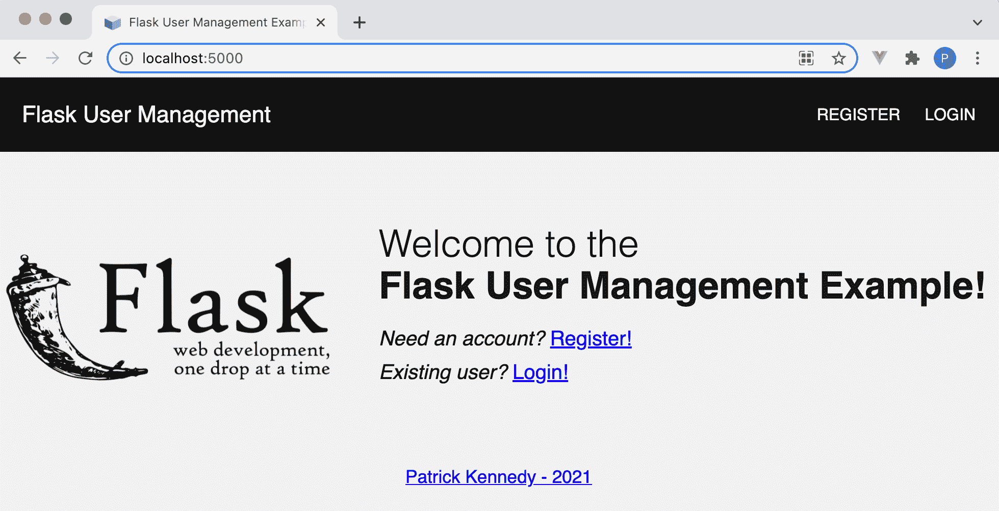

# 使用 Pytest 测试烧瓶应用

> 原文：<https://testdriven.io/blog/flask-pytest/>

这篇文章是用 [pytest](https://docs.pytest.org/en/latest/) 测试烧瓶应用的指南。

我们将首先看看为什么测试对于创建可维护的软件很重要，以及在测试时应该关注什么。然后，我们将详细介绍如何:

*   使用 pytest 创建并运行烧瓶特定的单元和功能测试
*   利用夹具来初始化测试功能的状态
*   使用 coverage.py 检查测试的覆盖率

> 本文中测试的 Flask 应用程序的源代码(以及详细的安装说明)可以在 GitLab 上的[https://git lab . com/patkennedy 79/Flask _ user _ management _ example](https://gitlab.com/patkennedy79/flask_user_management_example)中找到。

## 目标

完成本文后，您将能够:

1.  解释在 Flask 应用程序中测试什么
2.  描述 pytest 和 unittest 之间的区别
3.  用 pytest 编写烧瓶特定的单元和功能测试函数
4.  使用 pytest 运行测试
5.  创建用于初始化测试功能状态的夹具
6.  用 coverage.py 确定测试的代码覆盖率

## 为什么要写测试？

总的来说，测试有助于确保你的应用程序能像最终用户期望的那样工作。

具有高测试覆盖率的软件项目从来都不是完美的，但是它是软件质量的一个很好的初始指示器。此外，可测试的代码通常是一个好的软件架构的标志，这就是高级开发人员在整个开发生命周期中考虑测试的原因。

测试可以分为三个层次:

*   单位
*   功能(或集成)
*   端到端

单元测试测试独立于依赖项的单个代码单元的功能。它们是防止代码库中出现错误和不一致的第一道防线。他们从程序员的角度出发，从内到外进行测试。

功能测试对软件产品的多个组件进行测试，以确保这些组件能够正常工作。通常，这些测试关注用户将要使用的功能。他们从最终用户的角度，由外向内进行测试。

单元测试和功能测试都是[测试驱动开发(TDD)](/test-driven-development/) 过程的基础部分。

测试提高了代码的可维护性。

可维护性是指对您的代码进行错误修复或增强，或者对将来某个时候需要更新您的代码的其他开发人员进行修复或增强。

测试应该与[持续集成](https://en.wikipedia.org/wiki/Continuous_integration) (CI)过程相结合，以确保您的测试不断地被执行，最好是在每次提交到您的存储库时。一套可靠的测试对于在开发过程的早期**快速捕捉缺陷至关重要，在**最终用户在生产中遇到它们之前。

## 考什么？

你应该测试什么？

同样，单元测试应该集中在孤立地测试小的代码单元。

例如，在 Flask 应用程序中，您可以使用单元测试来测试:

1.  数据库模型(通常在 *models.py* 中定义)
2.  视图函数调用的实用函数

同时，功能测试应该关注视图功能是如何操作的。

例如:

1.  名义条件(GET、POST 等。)用于查看功能
2.  对于视图函数，可以正确处理无效的 HTTP 方法
3.  向视图函数传递了无效数据

关注终端用户将与之交互的测试场景。你的产品的用户体验是最重要的！

## pytestvs.unittest

pytest 是 Python 的一个测试框架，用于编写、组织和运行测试用例。在建立了基本的测试结构之后，pytest 使得编写测试变得非常容易，并且为运行测试提供了很大的灵活性。pytest 满足良好测试环境的关键方面:

*   编写测试很有趣
*   通过使用助手函数(fixtures ),可以快速编写测试
*   可以用一个命令来执行测试
*   测试运行迅速

> pytest 太不可思议了！我强烈推荐使用它来测试任何用 Python 编写的应用程序或脚本。
> 
> 如果你真的对学习 pytest 的各个方面感兴趣，我强烈推荐 Brian Okken 写的《用 pytest 进行 Python 测试》。

Python 有一个名为 [unittest](https://docs.python.org/3/library/unittest.html) 的内置测试框架，这也是测试的一个很好的选择。unittest 模块的灵感来自于 [xUnit](https://en.wikipedia.org/wiki/XUnit) 测试框架。

它提供了以下内容:

*   用于构建单元测试的工具，包括一整套用于执行检查的`assert`语句
*   用于开发单元测试和单元测试套件的结构
*   用于执行测试的测试运行器

pytest 和 unittest 的主要区别是:

| 特征 | pytest | unittest |
| --- | --- | --- |
| 装置 | 第三方库 | 核心标准库的一部分 |
| 测试设置和拆卸 | 固定装置 | `setUp()`和`tearDown()`方法 |
| 断言格式 | 内置断言 | `assert*`风格[方法](https://docs.python.org/3/library/unittest.html#unittest.TestCase.assertEqual) |
| 结构 | 功能的 | 面向对象 |

这两种框架都适合测试 Flask 项目。但是，我更喜欢 pytest，因为它:

1.  需要更少的样板代码，因此您的测试套件将更具可读性。
2.  支持简单的`assert`语句，与 unittest 中的`assertSomething`方法——如`assertEquals`、`assertTrue`和`assertContains`——相比，它可读性更好，也更容易记住。
3.  更新更频繁，因为它不是 Python 标准库的一部分。
4.  简化测试状态的设置和拆除。
5.  使用功能方法。
6.  支撑[夹具](https://docs.pytest.org/en/latest/how-to/fixtures.html)。

## 测试

### 项目结构

我喜欢将所有的测试用例组织在一个单独的“tests”文件夹中，与应用程序文件在同一层。

此外，我非常喜欢通过将单元测试和功能测试作为单独的子文件夹来区分它们。这种结构为您提供了只运行单元测试(或者只运行功能测试)的灵活性。

下面是“测试”目录的结构示例:

```
`└── tests
    ├── conftest.py
    ├── functional
    │   ├── __init__.py
    │   ├── test_stocks.py
    │   └── test_users.py
    └── unit
        ├── __init__.py
        └── test_models.py` 
```

下面是“tests”文件夹如何适应一个典型的带有[蓝图](https://flask.palletsprojects.com/en/2.0.x/blueprints/)的 Flask 项目:

```
`├── app.py
├── project
│   ├── __init__.py
│   ├── models.py
│   └── ...blueprint folders...
├── requirements.txt
├── tests
│   ├── conftest.py
│   ├── functional
│   │   ├── __init__.py
│   │   ├── test_stocks.py
│   │   └── test_users.py
│   └── unit
│       ├── __init__.py
│       └── test_models.py
└── venv` 
```

### 单元测试示例

我们要编写的第一个测试是针对[*project/models . py*](https://gitlab.com/patkennedy79/flask_user_management_example/-/blob/main/project/models.py)的单元测试，它包含数据库的 [SQLAlchemy](https://www.sqlalchemy.org) 接口。

> 该测试不访问底层数据库；它只检查 SQLAlchemy 使用的接口类。

由于这个测试是单元测试，所以应该在[*tests/unit/test _ models . py*](https://gitlab.com/patkennedy79/flask_user_management_example/-/blob/main/tests/unit/test_models.py)中实现:

```
`from project.models import User

def test_new_user():
    """
 GIVEN a User model
 WHEN a new User is created
 THEN check the email, hashed_password, and role fields are defined correctly
 """
    user = User('[[email protected]](/cdn-cgi/l/email-protection)', 'FlaskIsAwesome')
    assert user.email == '[[email protected]](/cdn-cgi/l/email-protection)'
    assert user.hashed_password != 'FlaskIsAwesome'
    assert user.role == 'user'` 
```

让我们仔细看看这个测试。

导入之后，我们从测试内容的描述开始:

```
`"""
GIVEN a User model
WHEN a new User is created
THEN check the email, hashed_password, and role fields are defined correctly
"""` 
```

> 为什么一个测试函数要包含这么多的注释？
> 
> 我发现测试是项目中最难维护的方面之一。通常，测试套件的代码(包括注释的级别)远没有被测试代码的质量高。
> 
> 一个用于描述每个测试功能的公共结构有助于可维护性，它使某人(另一个开发人员，您未来的自己)更容易快速理解每个测试的目的。
> 
> 通常的做法是使用 GIVEN-WHEN-THEN 结构:
> 
> *   假设-测试的初始条件是什么？
> *   什么时候发生了什么需要测试？
> *   那么，预期的反应是什么？
> 
> 更多信息，请查看马丁·福勒的文章 [GivenWhenThen](https://martinfowler.com/bliki/GivenWhenThen.html) 和布莱恩·奥肯的书 [Python 测试与 pytest](https://pragprog.com/titles/bopytest2/python-testing-with-pytest-second-edition/) 。

接下来，我们进行实际测试:

在用构造函数的有效参数创建一个新的`user`之后，检查`user`的属性以确保它被正确创建。

### 功能测试示例

我们要编写的第二个测试是对 [*项目/食谱/路线. py*](https://gitlab.com/patkennedy79/flask_user_management_example/-/blob/main/project/recipes/routes.py) 的功能测试，它包含了对`recipes`蓝图的查看功能。

由于这个测试是一个功能测试，所以应该在[*tests/functional/test _ recipes . py*](https://gitlab.com/patkennedy79/flask_user_management_example/-/blob/main/tests/functional/test_recipes.py)中实现:

```
`from project import create_app

def test_home_page():
    """
 GIVEN a Flask application configured for testing
 WHEN the '/' page is requested (GET)
 THEN check that the response is valid
 """
    flask_app = create_app('flask_test.cfg')

    # Create a test client using the Flask application configured for testing
    with flask_app.test_client() as test_client:
        response = test_client.get('/')
        assert response.status_code == 200
        assert b"Welcome to the" in response.data
        assert b"Flask User Management Example!" in response.data
        assert b"Need an account?" in response.data
        assert b"Existing user?" in response.data` 
```

这个项目使用[应用程序工厂模式](https://flask.palletsprojects.com/en/2.0.x/patterns/appfactories/)来创建 Flask 应用程序。因此，首先需要导入`create_app()`函数:

```
`from project import create_app` 
```

测试函数`test_home_page()`以测试内容的给定时间描述开始。接下来，创建一个 Flask 应用程序(`flask_app`):

```
`flask_app = create_app('flask_test.cfg')` 
```

为了创建合适的测试环境，Flask 提供了一个 [test_client](https://flask.palletsprojects.com/en/2.0.x/api/#flask.Flask.test_client) 助手。这将创建一个 Flask 应用程序的测试版本，我们用它来对“/”URL 进行 GET 调用。然后，我们检查返回的状态代码是否正常(200)以及响应是否包含以下字符串:

*   欢迎使用 Flask 用户管理示例！
*   需要账户吗？
*   现有用户？

这些检查与我们希望用户在导航到“/”URL 时看到的内容相匹配:



非正常功能测试的一个示例是在访问“/”URL 时使用无效的 HTTP 方法(POST ):

```
`def test_home_page_post():
    """
 GIVEN a Flask application configured for testing
 WHEN the '/' page is is posted to (POST)
 THEN check that a '405' status code is returned
 """
    flask_app = create_app('flask_test.cfg')

    # Create a test client using the Flask application configured for testing
    with flask_app.test_client() as test_client:
        response = test_client.post('/')
        assert response.status_code == 405
        assert b"Flask User Management Example!" not in response.data` 
```

该测试检查对“/”URL 的 POST 请求是否会导致返回错误代码 405(不允许使用方法)。

花点时间回顾一下这两个功能测试...您是否在这两个测试函数之间看到了一些重复的代码？你是否看到了很多初始化测试函数所需状态的代码？我们可以使用夹具来解决这些问题。

## 固定装置

为了以可预测和可重复的方式运行测试，fixture 将测试初始化到一个已知的状态。

### xUnit

编写和执行测试的经典方法遵循 [xUnit](https://en.wikipedia.org/wiki/XUnit) 类型的测试框架，其中每个测试运行如下:

1.  `SetUp()`
2.  ...运行测试用例...
3.  `TearDown()`

`SetUp()`和`TearDown()`方法总是为测试套件中的每个单元测试运行。这种方法导致测试套件中的每个测试都处于相同的初始状态，这没有提供太多的灵活性。

### 固定装置的优点

测试夹具方法比传统的安装/拆卸方法提供了更大的灵活性。

> pytest-flask 通过提供一套用于测试 flask 应用程序的通用夹具来方便测试 Flask 应用程序。这个库在本教程中没有用到，因为我想向**展示**如何创建支持测试 Flask 应用的夹具。

首先，fixtures 被定义为函数(应该有一个描述性的名称来描述它们的用途)。

第二，可以运行多个 fixtures 来设置测试功能的初始状态。事实上，固定物甚至可以调用其他固定物！因此，您可以将它们组合在一起以创建所需的状态。

最后，设备可以在不同的范围内运行:

*   `function` -每个测试功能运行一次(默认范围)
*   `class` -每个测试类运行一次
*   `module` -每个模块运行一次(例如，一个测试文件)
*   `session` -每个会话运行一次

例如，如果您有一个模块范围的 fixture，那么在模块中的测试函数运行之前，该 fixture 将运行一次(且仅运行一次)。

> 夹具应该在[*tests/conftest . py*](https://gitlab.com/patkennedy79/flask_user_management_example/-/blob/main/tests/conftest.py)中创建。

### 单元测试示例

为了帮助测试 [*项目/models.py*](https://gitlab.com/patkennedy79/flask_user_management_example/-/blob/main/project/models.py) 中的`User`类，我们可以向[*tests/conftest . py*](https://gitlab.com/patkennedy79/flask_user_management_example/-/blob/main/tests/conftest.py#L6)添加一个 fixture，用于创建一个`User`对象进行测试:

```
`from project.models import User

@pytest.fixture(scope='module')
def new_user():
    user = User('[[email protected]](/cdn-cgi/l/email-protection)', 'FlaskIsAwesome')
    return user` 
```

`@pytest.fixture`装饰器指定这个函数是一个具有`module`级作用域的 fixture。换句话说，这个夹具将被称为每个测试模块一个。

这个 fixture，`new_user`，使用构造函数的有效参数创建了一个`User`的实例。`user`然后被传递给测试函数(`return user`)。

我们可以通过使用[*tests/unit/test _ models . py*](https://gitlab.com/patkennedy79/flask_user_management_example/-/blob/main/tests/unit/test_models.py#L22)中的`new_user` fixture 来简化前面的`test_new_user()`测试函数:

```
`def test_new_user_with_fixture(new_user):
    """
 GIVEN a User model
 WHEN a new User is created
 THEN check the email, hashed_password, authenticated, and role fields are defined correctly
 """
    assert new_user.email == '[[email protected]](/cdn-cgi/l/email-protection)'
    assert new_user.hashed_password != 'FlaskIsAwesome'
    assert new_user.role == 'user'` 
```

通过使用 fixture，测试函数被简化为针对`User`对象执行检查的`assert`语句。

### 功能测试示例

#### 固定装置

为了帮助测试 Flask 项目中的所有视图函数，可以在[*tests/conftest . py*](https://gitlab.com/patkennedy79/flask_user_management_example/-/blob/main/tests/conftest.py#L12)中创建一个 fixture:

```
`from project import create_app

@pytest.fixture(scope='module')
def test_client():
    flask_app = create_app('flask_test.cfg')

    # Create a test client using the Flask application configured for testing
    with flask_app.test_client() as testing_client:
        # Establish an application context
        with flask_app.app_context():
            yield testing_client  # this is where the testing happens!` 
```

这个 fixture 使用上下文管理器创建测试客户机:

```
`with flask_app.test_client() as testing_client:` 
```

接下来，应用程序上下文被推送到堆栈上，供测试函数使用:

```
`with flask_app.app_context():
    yield testing_client  # this is where the testing happens!` 
```

> 要了解 Flask 中应用程序上下文的更多信息，请参考以下博客文章:

`yield testing_client`语句意味着执行被传递给测试函数。

#### 使用夹具

我们可以用[*tests/functional/test _ recipes . py*](https://gitlab.com/patkennedy79/flask_user_management_example/-/blob/main/tests/functional/test_recipes.py#L43)中的`test_client` fixture 来简化之前的功能测试:

```
`def test_home_page_with_fixture(test_client):
    """
 GIVEN a Flask application configured for testing
 WHEN the '/' page is requested (GET)
 THEN check that the response is valid
 """
    response = test_client.get('/')
    assert response.status_code == 200
    assert b"Welcome to the" in response.data
    assert b"Flask User Management Example!" in response.data
    assert b"Need an account?" in response.data
    assert b"Existing user?" in response.data

def test_home_page_post_with_fixture(test_client):
    """
 GIVEN a Flask application
 WHEN the '/' page is is posted to (POST)
 THEN check that a '405' status code is returned
 """
    response = test_client.post('/')
    assert response.status_code == 405
    assert b"Flask User Management Example!" not in response.data` 
```

您是否注意到许多重复的代码都不见了？通过利用`test_client` fixture，每个测试函数都被简化为 HTTP 调用(GET 或 POST)和检查响应的断言。

我真的发现使用 fixture 有助于将测试功能集中在实际的测试上，因为测试初始化是在 fixture 中处理的。

### 运行测试

要运行测试，导航到 Flask 项目的顶层文件夹，并通过 Python 解释器运行 pytest:

```
`(venv)$ python -m pytest
============================= test session starts ==============================

tests/functional/test_recipes.py ....                                    [ 30%]
tests/functional/test_users.py .....                                     [ 69%]
tests/unit/test_models.py ....                                           [100%]

============================== 13 passed in 0.46s ==============================` 
```

> 为什么要通过 Python 解释器运行 pytest？
> 
> 主要优点是当前目录(例如，Flask 项目的顶层文件夹)被添加到系统路径中。这避免了 pytest 找不到源代码的任何问题。

pytest 将递归地搜索您的项目结构，找到以`test_*.py`开头的 Python 文件，然后在这些文件中运行以`test_`开头的函数。不需要配置来识别测试文件的位置！

要查看已运行测试的更多详细信息:

```
`(venv)$ python -m pytest -v
============================= test session starts ==============================

tests/functional/test_recipes.py::test_home_page PASSED                  [  7%]
tests/functional/test_recipes.py::test_home_page_post PASSED             [ 15%]
tests/functional/test_recipes.py::test_home_page_with_fixture PASSED     [ 23%]
tests/functional/test_recipes.py::test_home_page_post_with_fixture PASSED [ 30%]
tests/functional/test_users.py::test_login_page PASSED                   [ 38%]
tests/functional/test_users.py::test_valid_login_logout PASSED           [ 46%]
tests/functional/test_users.py::test_invalid_login PASSED                [ 53%]
tests/functional/test_users.py::test_valid_registration PASSED           [ 61%]
tests/functional/test_users.py::test_invalid_registration PASSED         [ 69%]
tests/unit/test_models.py::test_new_user PASSED                          [ 76%]
tests/unit/test_models.py::test_new_user_with_fixture PASSED             [ 84%]
tests/unit/test_models.py::test_setting_password PASSED                  [ 92%]
tests/unit/test_models.py::test_user_id PASSED                           [100%]

============================== 13 passed in 0.62s ==============================` 
```

如果您只想运行特定类型的测试:

*   `python -m pytest tests/unit/`
*   `python -m pytest tests/functional/`

### 运行中的装置

为了真正了解什么时候运行`test_client()` fixture，pytest 可以提供 fixture 和 test 的调用结构，并带有`--setup-show`参数:

```
`(venv)$ python -m pytest --setup-show tests/functional/test_recipes.py
====================================== test session starts =====================================

tests/functional/test_recipes.py
  ...
  SETUP    M test_client
      functional/test_recipes.py::test_home_page_with_fixture (fixtures used: test_client).
      functional/test_recipes.py::test_home_page_post_with_fixture (fixtures used: test_client).
  TEARDOWN M test_client

======================================= 4 passed in 0.18s ======================================` 
```

`test_client` fixture 有一个“模块”范围，所以它在*tests/functional/test _ recipes . py*中的两个 *_with_fixture* 测试之前执行。

如果您将`test_client`夹具的范围更改为“功能”范围:

```
`@pytest.fixture(scope='function')` 
```

然后`test_client`夹具将在两个 *_with_fixture* 测试之前运行:

```
`(venv)$ python -m pytest --setup-show tests/functional/test_recipes.py
======================================= test session starts ======================================

tests/functional/test_recipes.py
        ...
        SETUP    F test_client
        functional/test_recipes.py::test_home_page_with_fixture (fixtures used: test_client).
        TEARDOWN F test_client
        SETUP    F test_client
        functional/test_recipes.py::test_home_page_post_with_fixture (fixtures used: test_client).
        TEARDOWN F test_client

======================================== 4 passed in 0.21s =======================================` 
```

因为我们希望`test_client` fixture 在这个模块中只运行一次，所以将作用域恢复为“module”。

## 代码覆盖率

在开发测试时，最好能了解实际测试了多少源代码。这个概念被称为[代码覆盖率](https://en.wikipedia.org/wiki/Code_coverage)。

> 我需要非常明确的是，拥有一组覆盖 100%源代码的测试并不意味着代码得到了正确的测试。
> 
> 这个标准意味着有大量的测试，并且在开发测试上投入了大量的精力。测试的质量仍然需要通过代码检查来检查。
> 
> 也就是说，另一个极端，这是一个最小集合(或者没有！)的测试，要糟糕得多！

有两个优秀的包可以用来确定代码覆盖率: [coverage.py](https://coverage.readthedocs.io) 和 [pytest-cov](https://pytest-cov.readthedocs.io/en/latest/) 。

> 我推荐使用 pytest-cov，因为它与 pytest 无缝集成。它构建在来自 Ned Batchelder 的 coverage.py 之上，这是 Python 代码覆盖率的标准。

在检查代码覆盖率时运行 pytest 需要使用`--cov`参数来指示要检查哪个 Python 包(Flask 项目结构中的`project`)的覆盖率:

```
`(venv)$ python -m pytest --cov=project
============================= test session starts ==============================

tests/functional/test_recipes.py ....                                    [ 30%]
tests/functional/test_users.py .....                                     [ 69%]
tests/unit/test_models.py ....                                           [100%]

---------- coverage: platform darwin, python 3.8.5-final-0 -----------
Name                          Stmts   Miss  Cover
-------------------------------------------------
project/__init__.py              27      0   100%
project/models.py                32      2    94%
project/recipes/__init__.py       3      0   100%
project/recipes/routes.py         5      0   100%
project/users/__init__.py         3      0   100%
project/users/forms.py           18      1    94%
project/users/routes.py          50      4    92%
-------------------------------------------------
TOTAL                           138      7    95%

============================== 13 passed in 0.86s ==============================` 
```

即使在检查代码覆盖率时，参数仍然可以传递给 pytest:

```
`(venv)$ python -m pytest --setup-show --cov=project` 
```

## 结论

这篇文章作为测试烧瓶应用程序的指南，重点关注:

*   为什么您应该编写测试
*   你应该测试什么
*   如何编写单元和功能测试
*   如何使用 pytest 运行测试
*   如何创建夹具来初始化测试功能的状态

> 如果您有兴趣了解有关 Flask 的更多信息，请查看我关于如何构建、测试和部署 Flask 应用程序的课程:
> 
> [用 Python 和 Flask 开发 Web 应用](/courses/learn-flask/)