# 部署 Flask 应用程序进行渲染

> 原文：<https://testdriven.io/blog/flask-render-deployment/>

本教程演示了如何在 [Render](https://render.com) 上将带有 PostgreSQL 数据库的 Flask 应用程序部署到生产环境中。

本教程中使用的技术:

1.  [Flask](https://flask.palletsprojects.com) - Python web 框架
2.  用于与关系数据库接口的 Python 包
3.  [PostgreSQL](https://www.postgresql.org) -关系数据库
4.  [Gunicorn](https://gunicorn.org) - Python WSGI HTTP 服务器
5.  [渲染](https://render.com) -虚拟主机服务

## 目标

本教程结束时，您将能够:

1.  解释如何将 Flask 应用从部署过渡到生产
2.  描述 Flask 应用程序如何在 Render 上运行
3.  部署 Flask 应用程序进行渲染
4.  配置 Flask 应用程序以在渲染时与 PostgreSQL 数据库通信

## 为什么渲染？

Render 是一个易于使用的[平台即服务](https://en.wikipedia.org/wiki/Platform_as_a_service) (PaaS)解决方案，非常适合托管 Flask 应用。

此外，他们有一个免费层，允许您轻松测试他们的平台。此外，他们有[价格合理的选项](https://render.com/pricing)来托管应用和数据库。

> 由于 Heroku 将于 2022 年 11 月 28 日停止它的自由层，我摆弄了一些 [Heroku 的替代品](/blog/heroku-alternatives/)，发现 Render 是最好的。Render 的开发者体验很好，设置 web 服务和数据库的配置步骤非常直观。

### 自由层限制

在渲染时使用自由层服务有一些限制:

1.  PostgreSQL 数据库的 90 天限制
2.  更慢的构建和部署时间
3.  “Web 服务”没有外壳访问权限

较慢的构建和部署时间是意料之中的，因为您正在与其他用户共享资源。

> 值得注意的是，付费计划中 web 服务的构建和部署时间很快。

## 烧瓶生产设置

### 发展中的烧瓶

在项目的开发阶段，[开发服务器](https://flask.palletsprojects.com/en/2.2.x/server/)通常用于本地运行应用程序:

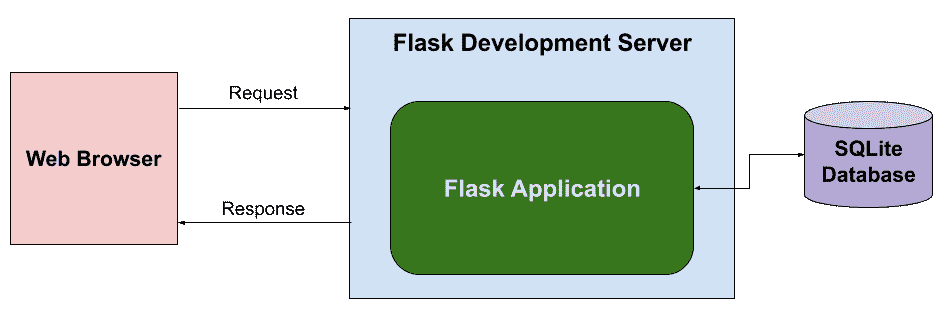

Flask development 服务器运行时使用:

```py
`$ flask --app app --debug run` 
```

其中`--app`指定 Flask app 的文件( *app.py* )，而`--debug`启用调试模式(交互式调试器和代码更改时自动重新加载)。

您可以在选择的浏览器中导航至`http://127.0.0.1:5000/`来查看应用程序。

### 生产中的烧瓶

在开发 Flask 应用程序的某个时候，您会希望将 it 应用程序部署到生产环境中，以便其他人可以访问它。

Flask 开发服务器非常适合在本地提供 Flask 应用程序。顾名思义,“开发”服务器并不是用于生产的[。相反，你应该使用](https://flask.palletsprojects.com/en/2.2.x/deploying/) [Gunicorn](https://gunicorn.org) ，一个生产级的 WSGI web 应用服务器。

> WSGI 代表 web 服务器网关接口，是 web 服务器和 web 应用程序之间的接口，因为 Web 服务器不能直接与 Python 应用程序对话。更多信息，请查看 [WSGI](/courses/python-web-framework/wsgi/) 。

下图说明了如何使用 Render 将 Flask 应用程序部署到生产环境中:


当部署渲染时，一个“ [Web 服务](https://render.com/docs/web-services)将运行 WSGI 服务器(Gunicorn)和 Flask 应用程序。Render 提供 web 服务器，将 HTTP 流量路由到 Gunicorn。此外，“ [PostgreSQL 服务](https://render.com/docs/databases)将运行 PostgreSQL 数据库，Flask 应用程序将与该数据库进行交互。

### 先决条件

从本地计算机上运行的 Flask 应用程序转移到部署它进行渲染时，有几个注意事项...

#### 格尼科恩

在您的虚拟环境中，安装 Gunicorn:

```py
`# pip
(venv)$ pip install gunicorn
(venv)$ pip freeze > requirements.txt` 
```

> 你可以随意把 virtualenv 和 pip 换成诗歌[或](https://python-poetry.org) [Pipenv](https://github.com/pypa/pipenv) 。更多信息，请查看[现代 Python 环境](/blog/python-environments/)。

如果您使用 pip，请确保将 Python 包依赖关系保存在一个 *requirements.txt* 文件中，因为该文件应该在渲染的“构建”步骤中使用。

#### 一种数据库系统

对于小型项目和开发工作来说，SQLite 是一个非常好的数据库。然而，一旦您过渡到生产，您将希望使用生产级的关系数据库，比如 [PostgreSQL](https://www.postgresql.org) 。

幸运的是，Flask-SQLAlchemy 使得用 PostgreSQL 替换 SQLite 变得很容易。

首先，与 PostgreSQL 数据库交互需要两个 Python 包:

```py
`(venv)$ pip install psycopg2-binary
(venv)$ pip freeze > requirements.txt` 
```

[psycopg2](https://www.psycopg.org/) 是 Python 的 PostgreSQL 数据库适配器。

此外，您需要确保您的 Flask 应用程序利用环境变量(如`DATABASE_URL`)来确定数据库的 URI:

```py
`class Config(object):
    ...
    # Since SQLAlchemy 1.4.x has removed support for the 'postgres://' URI scheme,
    # update the URI to the postgres database to use the supported 'postgresql://' scheme
    if os.getenv('DATABASE_URL'):
        SQLALCHEMY_DATABASE_URI = os.getenv('DATABASE_URL').replace("postgres://", "postgresql://", 1)
    else:
        SQLALCHEMY_DATABASE_URI = f"sqlite:///{os.path.join(BASEDIR, 'instance', 'app.db')}"
    ...` 
```

要进行的一个关键转换是更新 PostgreSQL 数据库的 URI，以使用受支持的`postgresql://`方案，而不是`postgres://` URI。

> 你可以在这里看到完整的例子[。](https://gitlab.com/patkennedy79/flask_user_management_example/-/blob/2be600d0bfd5a28957b4961bcb2a6607a9c07b08/config.py)

#### 记录

在 Render 上运行 Flask 应用程序时，控制台日志将显示来自 Gunicorn logger 的所有日志消息，但不会显示来自 Flask 应用程序的消息。

但是，Flask 应用程序可以配置为利用 Gunicorn 记录器:

```py
`if app.config['LOG_WITH_GUNICORN']:
    gunicorn_error_logger = logging.getLogger('gunicorn.error')
    app.logger.handlers.extend(gunicorn_error_logger.handlers)
    app.logger.setLevel(logging.DEBUG)
else:
    ... standard logging configuration ...` 
```

> 你可以在这里看到完整的例子[。](https://gitlab.com/patkennedy79/flask_user_management_example/-/blob/2be600d0bfd5a28957b4961bcb2a6607a9c07b08/project/__init__.py#L84)

#### 数据库初始化

本节仅适用于在 Render 上使用免费层“Web 服务”的情况。

通常，在首次初始化 Flask 应用程序时，应该创建一个 CLI 命令来初始化数据库:

```py
`@app.cli.command('init_db')
def initialize_database():
    """Initialize the database."""
    db.drop_all()
    db.create_all()
    echo('Initialized the database!')` 
```

但是，Render 上的免费层“Web 服务”不支持访问控制台来运行此 CLI 命令。

因此，这个问题的解决方案是在创建 Flask 应用程序时检查数据库是否需要初始化:

```py
`# Check if the database needs to be initialized
engine = sa.create_engine(app.config['SQLALCHEMY_DATABASE_URI'])
inspector = sa.inspect(engine)
if not inspector.has_table("users"):
    with app.app_context():
        db.drop_all()
        db.create_all()
        app.logger.info('Initialized the database!')
else:
    app.logger.info('Database already contains the users table.')` 
```

假设应用程序工厂函数用于创建 Flask 应用程序，在 Flask 应用程序被实例化和初始化之后，这段代码可以放在应用程序工厂函数中。

> 你可以在这里看到完整的例子[。](https://gitlab.com/patkennedy79/flask_user_management_example/-/blob/2be600d0bfd5a28957b4961bcb2a6607a9c07b08/project/__init__.py#L42)

## 渲染部署步骤

### 网络服务

首先用 [Render](https://render.com) 创建一个新账户(如果你没有的话)。然后，导航到您的[仪表板](https://dashboard.render.com)，点击“新建+”按钮，并选择“Web 服务”。

将您的渲染帐户连接到 GitLab 或 GitHub 帐户。连接后，选择要部署的存储库:

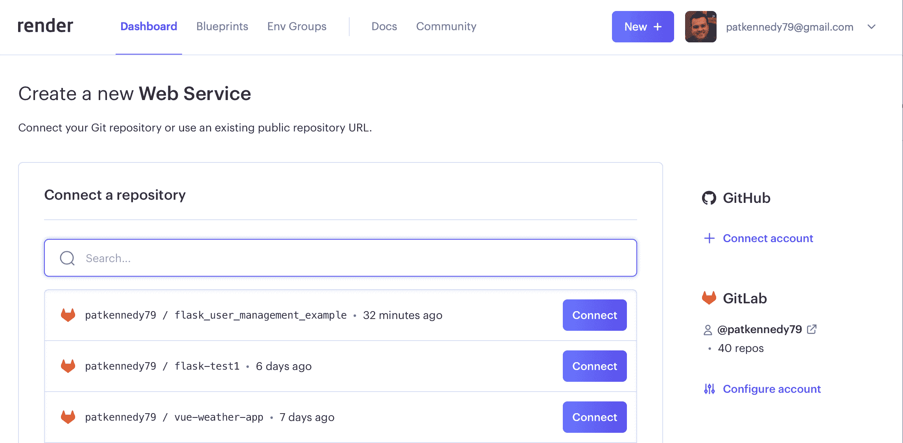

填写部署 Web 服务的配置:

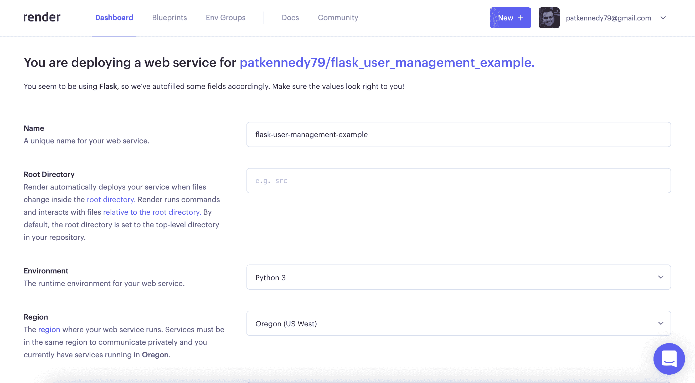

字段:

1.  名称-为应用程序选择一个唯一的名称，因为这将用于 URL
2.  [根目录](https://render.com/docs/monorepo-support#root-directory) -服务的根目录(默认为顶级目录)；所有生成命令都将基于此根目录运行
3.  环境-选择“Python 3”
4.  地区-选择离你最近的地区

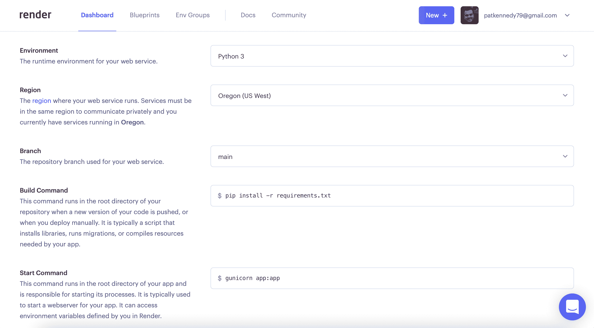

更多字段:

1.  分支——从您的 git 存储库中选择要部署的分支，通常是“main”或“master”
2.  构建命令——让您的应用程序为生产做好准备的命令，例如安装必要的 Python 包——例如`pip install -r requirements.txt`、`poetry build`等。
3.  启动命令-使用默认值`gunicorn app:app`或使用`gunicorn --workers=2 --log-level=info app:app`指定工作人员数量和日志级别

选择要使用的计划。

接下来，您可以通过环境变量设置要使用的特定 Python 版本。要设置环境变量，请单击“高级”按钮。然后，添加一个名为“PYTHON_VERSION”的环境变量，为您的应用程序指定 PYTHON 版本，例如“3.10.7”。

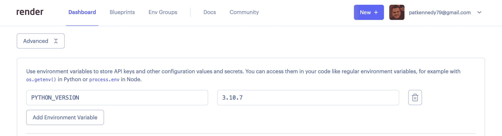

> “PYTHON_VERSION”环境变量[必须包括](https://render.com/docs/python-version)主要版本、次要版本和补丁版本，因此“3.10.7”有效，而“3.10”无效。

最后，点击页面底部的“创建 Web 服务”。

然后你会看到所有来自 *requirements.txt* 的 Python 包都被安装了:


构建成功并部署后，您将看到类似于以下内容的内容:

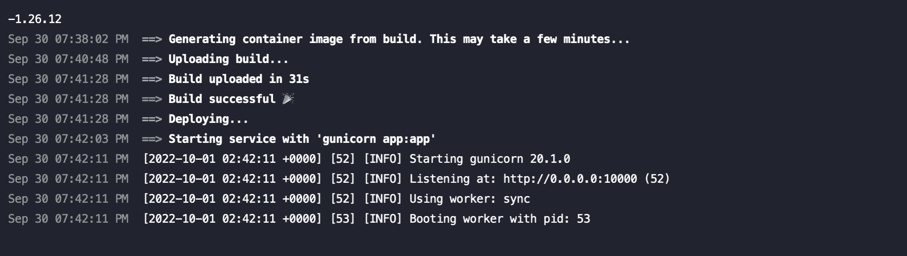

您可以点击“Logs”选项卡查看 Gunicorn 是否已启动并运行:

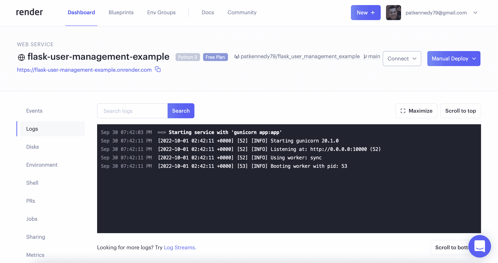

此时，您可以导航到应用程序的主页。请记住，我们仍然需要设置 PostgreSQL！

### PostgreSQL 服务

要配置 PostgreSQL，在您的[仪表板](https://dashboard.render.com)上，再次点击“New +”按钮并选择“PostgreSQL”。

#### 配置

接下来，填写用于部署 PostgreSQL 数据库的配置:

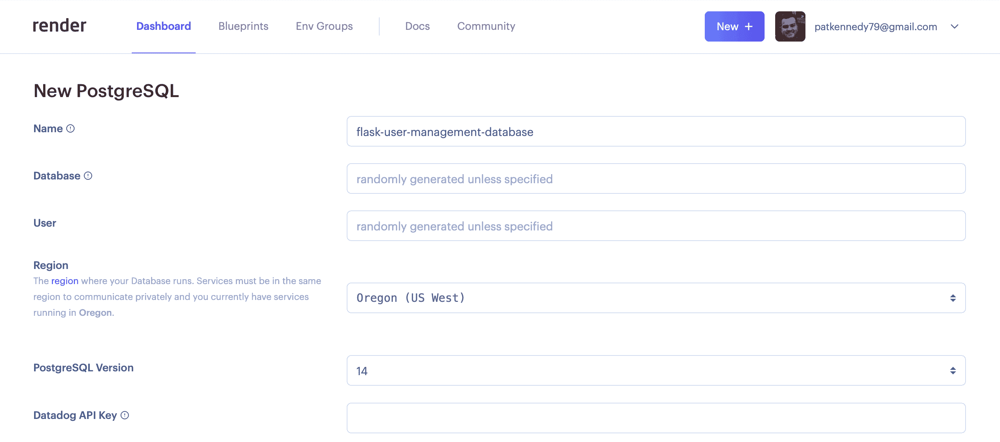

字段:

1.  名称-为数据库输入一个友好的(唯一的)名称，该名称将用于在渲染面板中标识该数据库
2.  数据库-输入一个[‘数据库名’](https://www.postgresql.org/docs/current/app-psql.html)或留空以随机生成
3.  用户——输入一个用户名或留空，以自动生成为`<Name>_user`
4.  地区-选择离你最近的地区
5.  PostgreSQL 版本-为您的应用程序选择所需的 PostgreSQL 版本(“14”是默认值)

选择要使用的计划。

> 空闲层数据库将在 90 天后销毁。记住这一点。这个计划仍然是一个很好的实验选择。

点击页面底部的“创建数据库”。

数据库创建完成后，您将看到“状态”更新为“可用”:

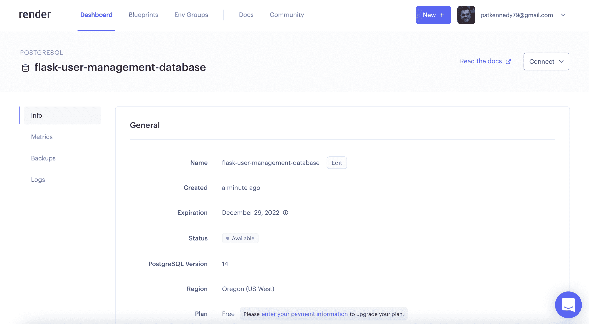

此时，您需要向下滚动到“连接”部分，并复制“内部数据库 URL”:

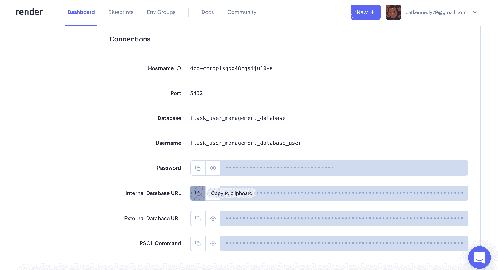

#### 更新环境变量

现在，您需要将数据库 URL 设置为一个环境变量，以便您的应用程序可以使用它。

在[仪表板](https://dashboard.render.com)中，选择您刚刚创建的“Web 服务”,然后单击“环境”选项卡。

您应该看到“PYTHON_VERSION”环境变量，这是我们之前设置的。使用“内部数据库 URL”添加“DATABASE_URL”环境变量。根据您如何配置 Flask 应用程序，您可能需要添加额外的环境变量，如“SECRET_KEY”。

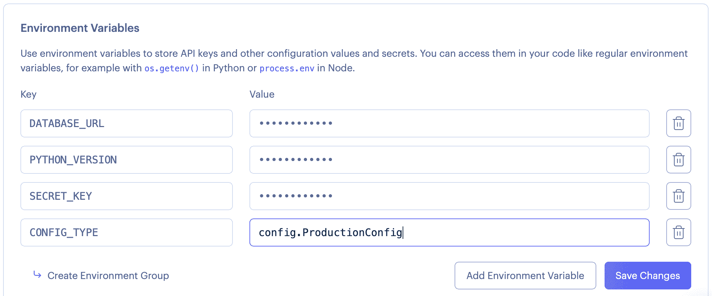

通过单击“事件”选项卡检查部署状态:

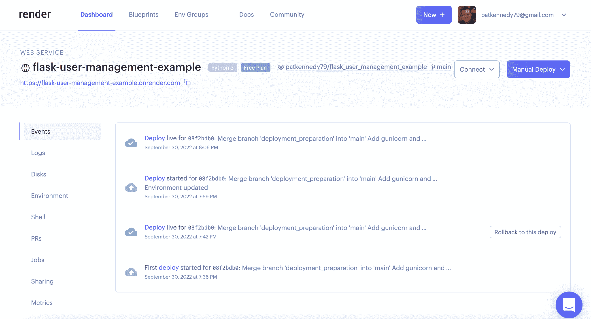

一旦应用了所有配置更改并更新了服务，您将看到“部署”是活动的。

> 你可以在[https://flask-user-management-app.onrender.com](https://flask-user-management-app.onrender.com)找到我在本教程中使用的 Flask 应用程序。

## 结论

本教程提供了使用 Render 将带有 PostgreSQL 数据库的 Flask 应用程序部署到生产环境的演练。

Render 为 Flask 应用程序提供了优秀的托管解决方案。部署应用程序是一种很好的体验，免费层非常适合尝试部署。

> 如果你有兴趣了解更多关于 Flask 的知识，请查看我的课程，学习如何构建、测试和部署 Flask 应用程序: