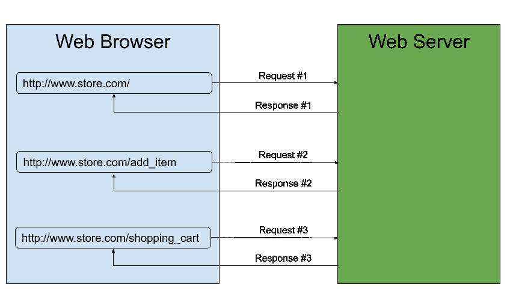
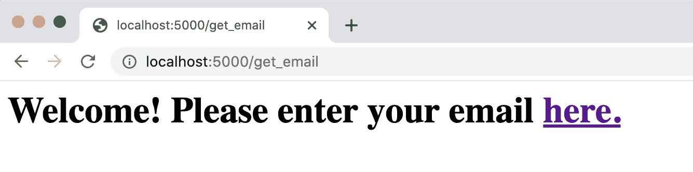
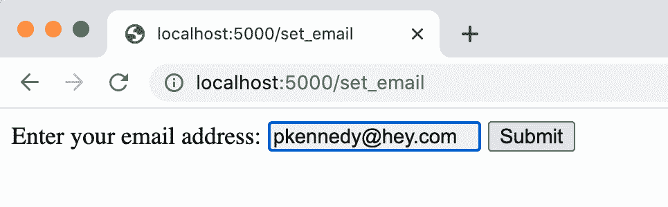
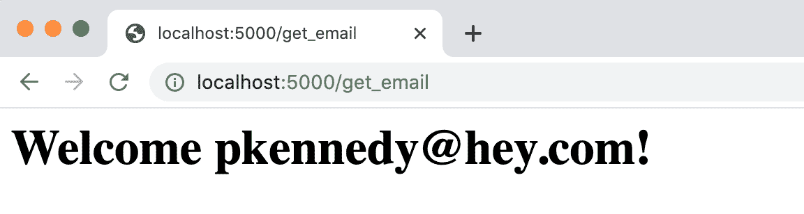
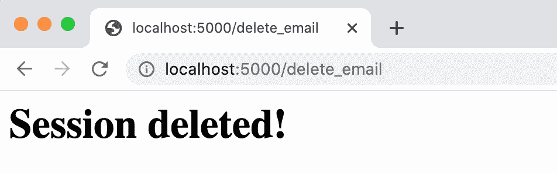
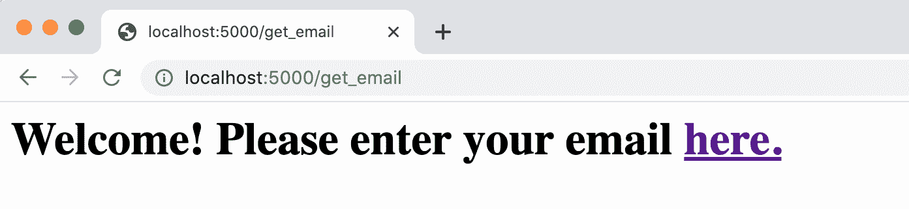

# 烧瓶中的会话

> 原文：<https://testdriven.io/blog/flask-sessions/>

这篇文章介绍了会话在 Flask 中是如何工作的。

本文是关于如何在 Flask 中使用会话的两部分系列文章的一部分:

1.  客户端:[烧瓶中的会话](/blog/flask-sessions/) ( *本文！*)
2.  服务器端:[带有 Redis 的 Flask 中的服务器端会话](/blog/flask-server-side-sessions)

> 本文假设您之前有使用 Flask 的经验。如果您有兴趣了解有关 Flask 的更多信息，请查看我关于如何构建、测试和部署 Flask 应用程序的课程:
> 
> [用 Python 和 Flask 开发 Web 应用](/courses/learn-flask/)

## 会议

由于 HTTP 是一个无状态协议，每个请求都不知道以前执行过的任何请求:



虽然这极大地简化了客户端/服务器通信，但是当用户与应用程序本身交互时，web 应用程序通常需要一种方法来存储每个请求之间的数据。

例如，在电子商务网站上，您通常会将用户添加到购物车中的商品存储到数据库中，这样一旦他们完成购物，就可以查看他们的购物车来购买这些商品。不过，这个在数据库中存储项目的工作流只对经过身份验证的用户有效。因此，您需要一种方法在请求之间为未经身份验证的用户存储特定于用户的数据。

这就是会话发挥作用的地方。

一个[会话](https://en.wikipedia.org/wiki/Session_(computer_science))用于在用户与 web 应用程序交互时，跨不同请求存储与用户相关的信息。因此，在上面的例子中，购物车商品将被添加到用户的会话中。

为会话存储的数据应被视为临时数据，因为会话最终会过期。为了永久存储数据，你需要利用数据库。

> 计算机存储在这里是一个很好的类比:计算机上的临时项目存储在 RAM(随机存取存储器)中，很像会话，而永久项目存储在硬盘上，很像数据库。

存储在会话中的数据示例:

*   用户购物车中的商品
*   无论用户是否登录
*   首选项(语言、货币、明暗模式)

存储在数据库中的数据示例:

*   用户凭据(电子邮件、用户名、哈希密码、电子邮件确认布尔值)
*   用户输入的数据(股票数据、食谱、博客文章)

在 Flask 中，您可以在会话期间存储特定于用户的信息。保存数据以供整个会话使用允许 web 应用程序在多次请求中保持数据的持久性，例如，当用户访问 web 应用程序中的不同页面时。

## 烧瓶中的会话

web 开发中通常使用两种类型的会话:

1.  **客户端** -会话存储在客户端的浏览器 cookies 中
2.  **服务器端** -会话存储在服务器端(通常会创建一个会话标识符并存储在客户端的浏览器 cookies 中)

> [Cookies](https://en.wikipedia.org/wiki/HTTP_cookie) 是网络浏览器存储在你电脑上的小块数据，其初衷是在浏览不同网站时记住状态信息。

Flask 使用客户端方法。

**优点**:

*   验证和创建会话速度很快(无数据存储)
*   易于扩展(无需跨 web 服务器复制会话数据)

**缺点**:

*   敏感数据不能存储在会话数据中，因为它存储在 web 浏览器中
*   会话数据受限于 cookie 的大小(通常为 4 KB)
*   Flask 应用程序不能立即撤销会话

为了跨多个请求存储数据，Flask 利用加密签名的 cookies(存储在 web 浏览器上)来存储会话数据。这个 cookie 和每个请求一起被发送到服务器端的 Flask 应用程序，并在那里被解码。

因为会话数据存储在加密签名的 cookies 中(不是*加密的*！)，会话不应用于存储任何敏感信息。永远不要在会话数据中包含密码或个人信息。

> 如果你更喜欢使用服务器端会话，可以查看一下 [Flask-Session](https://flask-session.readthedocs.io/en/latest/) 包以及 Flask with Redis 文章中的[服务器端会话。](/blog/flask-server-side-sessions)

## Flask 中的会话示例

下面的 *app.py* 文件说明了会话在 Flask 中的工作方式:

```py
`from flask import Flask, render_template_string, request, session, redirect, url_for

# Create the Flask application
app = Flask(__name__)

# Details on the Secret Key: https://flask.palletsprojects.com/en/1.1.x/config/#SECRET_KEY
# NOTE: The secret key is used to cryptographically-sign the cookies used for storing
#       the session data.
app.secret_key = 'BAD_SECRET_KEY'

@app.route('/set_email', methods=['GET', 'POST'])
def set_email():
    if request.method == 'POST':
        # Save the form data to the session object
        session['email'] = request.form['email_address']
        return redirect(url_for('get_email'))

    return """
 <form method="post">
 <label for="email">Enter your email address:</label>
 <input type="email" id="email" name="email_address" required />
 <button type="submit">Submit</button
 </form>
 """

@app.route('/get_email')
def get_email():
    return render_template_string("""
 
 <h1>Welcome {{ session['email'] }}!</h1>
 
 <h1>Welcome! Please enter your email <a href="{{ url_for('set_email') }}">here.</a></h1>
 
 """)

@app.route('/delete_email')
def delete_email():
    # Clear the email stored in the session object
    session.pop('email', default=None)
    return '<h1>Session deleted!</h1>'

if __name__ == '__main__':
    app.run()` 
```

要运行此示例，首先创建并激活一个新的虚拟环境:

```py
`$ mkdir flask-session
$ cd flask-session
$ python3 -m venv venv
$ source venv/bin/activate` 
```

安装烧瓶:

```py
`(venv)$ pip install Flask` 
```

将上述代码保存到一个 *app.py* 文件中。然后，启动 Flask 开发服务器:

```py
`(venv)$ export FLASK_APP=app.py
(venv)$ export FLASK_ENV=development
(venv)$ python -m flask run` 
```

现在，使用您最喜欢的网络浏览器导航到[http://localhost:5000/get _ email](http://localhost:5000/get_email):



### 设置会话数据

在本例中，`set_email`视图函数在提交表单时处理电子邮件:

```py
`@app.route('/set_email', methods=['GET', 'POST'])
def set_email():
    if request.method == 'POST':
        # Save the form data to the session object
        session['email'] = request.form['email_address']
        return redirect(url_for('get_email'))

    return """
 <form method="post">
 <label for="email">Enter your email address:</label>
 <input type="email" id="email" name="email_address" required />
 <button type="submit">Submit</button
 </form>
 """` 
```

这个视图函数支持 GET 和 POST HTTP 方法。当使用 GET 方法时，会返回一个 HTML 表单供您输入电子邮件地址:



当您使用您的电子邮件地址提交表单时(通过 POST 方法)，电子邮件将保存在`session`对象中:

```py
`# Save the form data to the session object
session['email'] = request.form['email_address']` 
```

请在[http://localhost:5000/set _ email](http://localhost:5000/set_email)中输入您的电子邮件，然后提交表单。

### 访问会话数据

当电子邮件没有存储在会话中时，`get_email`视图功能利用 Jinja 模板引擎显示存储在`session`对象中的电子邮件地址或者到`set_email()`视图功能的链接:

```py
`@app.route('/get_email')
def get_email():
    return render_template_string("""
 
 <h1>Welcome {{ session['email'] }}!</h1>
 
 <h1>Welcome! Please enter your email <a href="{{ url_for('set_email') }}">here.</a></h1>
 
 """)` 
```

`session`对象可以在模板文件中使用！

输入您的电子邮件地址后，当您导航到[http://localhost:5000/get _ email](http://localhost:5000/get_email)URL 时，您的电子邮件将显示:



### 删除会话数据

存储在`session`对象中的电子邮件地址可以通过`delete_email`查看功能删除:

```py
`@app.route('/delete_email')
def delete_email():
    # Clear the email stored in the session object
    session.pop('email', default=None)
    return '<h1>Session deleted!</h1>'` 
```

这个视图函数从`session`对象中获取`email`元素。`pop`方法将返回弹出的值，因此在`session`对象中没有定义元素的情况下，提供默认值是一个好的做法。

当您导航到“[http://localhost:5000/delete _ email](http://localhost:5000/delete_email)URL”时，您将看到:



由于电子邮件地址不再存储在`session`对象中，当您导航到[http://localhost:5000/get _ email](http://localhost:5000/get_email)URL 时，将再次要求您输入您的电子邮件地址:



### 会话唯一性

为了演示每个用户的会话数据是如何不同的，请在[http://localhost:5000/set _ email](http://localhost:5000/set_email)再次输入您的电子邮件地址。然后，在不同的浏览器(或当前浏览器中的私人/匿名窗口)中，导航至[http://localhost:5000/set _ email](http://localhost:5000/set_email)并输入不同的电子邮件地址。在你被重定向到[http://localhost:5000/get _ email](http://localhost:5000/get_email)之后，你希望看到什么？

由于使用了不同的网络浏览器，这被认为是 Flask 应用程序的不同用户。因此，将有一个唯一的`session`用于该用户。

## 附加注释

### Cookie 大小

Cookies 是小块数据(通常为 4KB)。

如果在`session`对象中存储大量数据时遇到意外问题，请对照 web 浏览器支持的大小，检查您的响应中 cookies 的大小。由于 Flask 序列化了存储在`session`对象中的数据，并将其存储在一个 cookie 中，因此可能会出现整个 cookie 未被保存的问题。

### 检测会话数据的更改

基于底层数据类型( [Werkzeug。CallbackDict](https://github.com/pallets/werkzeug/blob/master/src/werkzeug/datastructures.py#L2172) )的对象，它不会自动检测可变数据类型(列表、字典、集合等)的变化。).示例:

```py
`session['shopping_cart'] = []
...
# Since a mutable data type (list) is being modified, this change
# is not automatically detected by the session object
session['shopping_cart'].append('bike')

# Therefore, mark the session object as modified
session.modified = True` 
```

### 会话寿命

默认情况下，`session`对象保持不动，直到浏览器关闭。但是，如果您想要更改`session`对象的生命周期，请在创建 Flask `app`之后定义[PERMANENT _ SESSION _ LIFETIME](https://flask.palletsprojects.com/en/1.1.x/config/#PERMANENT_SESSION_LIFETIME)配置变量:

```py
`import datetime

app.config['PERMANENT_SESSION_LIFETIME'] = timedelta(minutes=1)` 
```

当设置`session`中的数据时，指定会话应该是永久的(时间将基于`PERMANENT_SESSION_LIFETIME`):

```py
`# Save the form data to the session object
session['email'] = request.form['email_address']
session.permanent = True` 
```

## 结论

本文展示了会话如何在 Flask 中工作，并查看了一个在会话对象中存储用户电子邮件地址的示例。

如果你想了解更多关于 Flask 中的会话，一定要看看我的课程- [用 Python 和 Flask 开发 Web 应用](/courses/learn-flask/)。