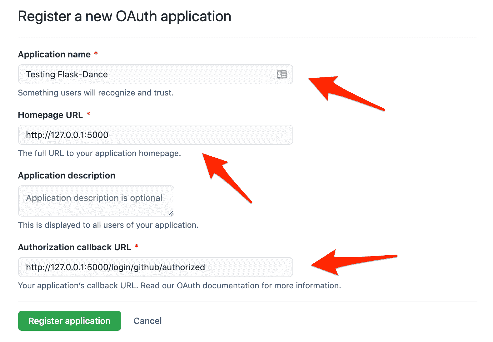
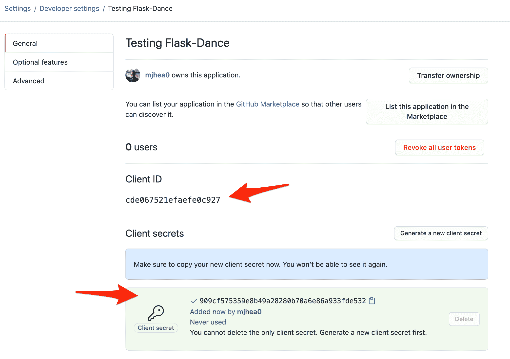

# 向 Flask 添加社会身份验证

> 原文：<https://testdriven.io/blog/flask-social-auth/>

在本教程中，我们将看看如何使用 GitHub 和 Twitter 向 Flask 应用程序添加 social auth。

> 社交认证(也称为社交登录或社交登录)是基于第三方服务对用户进行认证的过程，而不依赖于您自己的认证服务。例如，你在许多网站上看到的“用谷歌登录”按钮就是社交认证的最好例子。Google 对用户进行身份验证，并向应用程序提供一个令牌来管理用户的会话。

使用社交认证有其优势。您不需要为 web 应用程序设置 auth，因为它是由第三方 [OAuth 提供者](https://en.wikipedia.org/wiki/List_of_OAuth_providers)处理的。此外，由于像谷歌、脸书和 GitHub 这样的提供商执行广泛的检查来防止对其服务的未经授权的访问，利用社交认证而不是滚动您自己的认证机制可以提高您的应用程序的安全性。

除了 Flask，我们还将使用 [Flask-Dance](https://flask-dance.readthedocs.io/en/latest/) 来启用社交认证， [Flask-Login](https://flask-login.readthedocs.io/) 用于登录和注销用户并管理会话，以及 [Flask-SQLAlchemy](https://flask-sqlalchemy.palletsprojects.com/en/3.0.x/) 用于与数据库交互以存储用户相关数据。

## 为什么要使用社交认证？

你为什么想要利用社交认证而不是自己的认证呢？

#### 赞成的意见

1.  无需启动您自己的身份认证工作流程。
2.  提高安全性。第三方认证提供商，如谷歌、脸书等。，高度重视安全性。使用这样的服务可以提高您自己的应用程序的安全性。
3.  您可以从身份验证提供程序自动检索用户名、电子邮件和其他数据。这通过消除这一步骤(手动询问他们)改善了注册体验。

#### 骗局

1.  您的应用程序现在依赖于您控制之外的另一个应用程序。如果第三方应用关闭，用户将无法注册或登录。
2.  人们往往会忽略身份验证提供者请求的权限。一些应用程序甚至可能访问不需要的数据。
3.  在您配置的提供商中没有帐户的用户将无法访问您的应用程序。最好的方法是同时实现这两者——即用户名和密码以及社交认证——并让用户选择。

## OAuth

社交认证通常是通过 OAuth 来实现的，OAuth 是一种开放的标准认证协议，由第三方认证提供商来验证用户的身份。

最常见的流程(或授权)是[授权码](https://oauth.net/2/grant-types/authorization-code/):

1.  用户试图使用第三方身份验证提供商的帐户登录您的应用程序。
2.  它们被重定向到身份验证提供者进行验证。
3.  验证后，它们会通过授权码重定向回你的应用。
4.  然后，您需要使用访问令牌的授权代码向 auth provider 发出请求。
5.  在提供商验证授权码之后，他们发送回访问令牌。
6.  然后用户登录，这样他们就可以访问受保护的资源。
7.  然后，可以使用访问令牌从身份验证提供者获取数据。

> 有关 OAuth 的更多信息，请查看[OAuth 2 的介绍](https://www.digitalocean.com/community/tutorials/an-introduction-to-oauth-2)。

让我们看一个使用 GitHub 的流程的快速示例:

```
`"""
Import necessary modules.
 - `os` to read env variable
 - `requests` to make GET/POST requests
 - `parse_qs` to parse the response
"""
import os
import requests
from urllib.parse import parse_qs

"""
Define the GITHUB_ID and GITHUB_SECRET environment variables
along with the endpoints.
"""
CLIENT_ID = os.getenv("GITHUB_ID")
CLIENT_SECRET = os.getenv("GITHUB_SECRET")
AUTHORIZATION_ENDPOINT = f"https://github.com/login/oauth/authorize?response_type=code&client_id={os.getenv('GITHUB_ID')}"
TOKEN_ENDPOINT = "https://github.com/login/oauth/access_token"
USER_ENDPOINT = "https://api.github.com/user"

"""
1\. Log in via the browser using the 'Authorization URL' outputted in the terminal.
 (If you're already logged in to GitHub, either log out or test in an incognito/private browser window.)
2\. Once logged in, the page will redirect. Grab the code from the redirect URL.
3\. Paste the code in the terminal.
"""
print(f"Authorization URL: {AUTHORIZATION_ENDPOINT}")
code = input("Enter the code: ")

"""
Using the authorization code, we can request an access token.
"""
# Once we get the code, we sent the code to the access token
# endpoint(along with id and secret). The response contains
# the access_token and we parse is using parse_qs
res = requests.post(
    TOKEN_ENDPOINT,
    data=dict(
        client_id=os.getenv("GITHUB_ID"),
        client_secret=os.getenv("GITHUB_SECRET"),
        code=code,
    ),
)
res = parse_qs(res.content.decode("utf-8"))
token = res["access_token"][0]

"""
Finally, we can use the access token to obtain information about the user.
"""
user_data = requests.get(USER_ENDPOINT, headers=dict(Authorization=f"token {token}"))
username = user_data.json()["login"]
print(f"You are {username} on GitHub")` 
```

为了进行测试，将这段代码保存到一个名为 *oauth.py* 的文件中。请务必查看评论。

接下来，您需要创建一个 OAuth 应用程序，并从 GitHub 获取 OAuth 密钥。

登录你的 GitHub 账户，然后导航到[https://github.com/settings/applications/new](https://github.com/settings/applications/new)创建一个新的 [OAuth 应用](https://docs.github.com/en/free-pro-team@latest/developers/apps/authorizing-oauth-apps):

```
`Application name: Testing Flask-Dance
Homepage URL: http://127.0.0.1:5000
Callback URL: http://127.0.0.1:5000/login/github/authorized` 
```



点击“注册申请”。你将被重定向至你的应用。记下客户端 ID 和客户端密码:



> 如果没有生成客户端密码，请点按“生成新的客户端密码”。

将生成的客户端 ID 和客户端密码设置为环境变量:

```
`$ export GITHUB_ID=<your-github-id>
$ export GITHUB_SECRET=<your-github-secret>
# for windows machine, use `set` instead of `export`` 
```

安装[请求](https://requests.readthedocs.io/en/master/)库，然后运行脚本:

```
`$ pip install requests
$ python oauth.py` 
```

您应该看到:

```
`Authorization URL: https://github.com/login/oauth/authorize?response_type=code&client_id=cde067521efaefe0c927
Enter the code:` 
```

导航到该 URL。授权应用程序。然后，从重定向 URL 获取代码。例如:

```
`http://127.0.0.1:5000/login/github/authorized?code=5e54f2d755e450a64af3` 
```

将代码添加回终端窗口:

```
`Authorization URL: https://github.com/login/oauth/authorize?response_type=code&client_id=cde067521efaefe0c927
Enter the code: 5e54f2d755e450a64af3` 
```

您应该会看到您的 GitHub 用户名输出如下:

至此，让我们看看如何向 Flask 应用程序添加社交认证。

## 烧瓶舞

OAuthLib 是一个流行的、维护良好的 Python 库，它实现了 OAuth。虽然你可以单独使用这个库，但是在本教程中，我们将使用[烧瓶舞](https://flask-dance.readthedocs.io/en/latest/)。Flask-Dance 是一个构建在 OAuthLib 之上的库，专门为 Flask 设计。它有一个简单的 API，可以让你快速添加社交认证到 Flask 应用程序中。它也是为 Flask 设计的 OAuth 库中最受欢迎的。

继续创建新的 Flask 应用程序，激活虚拟环境，并安装所需的依赖项:

```
`$ mkdir flask-social-auth && cd flask-social-auth
$ python3.11 -m venv .venv
$ source .venv/bin/activate
(.venv)$ pip install Flask==2.2.2 Flask-Dance==6.2.0 python-dotenv==0.21.0` 
```

接下来，创建一个 *main.py* 文件:

```
`# main.py

from flask import Flask, jsonify

app = Flask(__name__)

@app.route("/ping")
def ping():
    return jsonify(ping="pong")

if __name__ == "__main__":
    app.run(debug=True)` 
```

运行服务器:

导航到[http://127 . 0 . 0 . 1:5000/ping](http://127.0.0.1:5000/ping)。您应该看到:

## GitHub 提供商

继续将您之前创建的 GitHub 客户端 ID 和客户端密码保存到一个新的*。env* 文件:

```
`GITHUB_ID=<YOUR_ID_HERE>
GITHUB_SECRET=<YOUR_SECRET_HERE>

OAUTHLIB_INSECURE_TRANSPORT=1` 
```

注意事项:

1.  由于我们安装了 [python-dotenv](https://github.com/theskumar/python-dotenv) ，Flask 会[自动](https://flask.palletsprojects.com/en/2.2.x/cli/#environment-variables-from-dotenv)设置来自*的环境变量。env* 文件。
2.  [OAUTHLIB _ unsecure _ TRANSPORT = 1](https://oauthlib.readthedocs.io/en/latest/oauth2/security.html#envvar-OAUTHLIB_INSECURE_TRANSPORT)用于测试目的，因为 OAUTHLIB 默认需要 HTTPS。

Flask-Dance 为每个供应商提供 Flask [蓝图](https://flask-dance.readthedocs.io/en/latest/concepts.html#blueprints)。让我们在 *app/oauth.py* 中为 GitHub 提供者创建一个:

```
`# app/oauth.py

import os

from flask_dance.contrib.github import make_github_blueprint

github_blueprint = make_github_blueprint(
    client_id=os.getenv("GITHUB_ID"),
    client_secret=os.getenv("GITHUB_SECRET"),
)` 
```

在 *main.py* 中导入并注册蓝图，并连接新路线:

```
`# main.py

from flask import Flask, jsonify, redirect, url_for
from flask_dance.contrib.github import github

from app.oauth import github_blueprint

app = Flask(__name__)
app.secret_key = "supersecretkey"
app.register_blueprint(github_blueprint, url_prefix="/login")

@app.route("/ping")
def ping():
    return jsonify(ping="pong")

@app.route("/github")
def login():
    if not github.authorized:
        return redirect(url_for("github.login"))
    res = github.get("/user")

    return f"You are @{res.json()['login']} on GitHub"

if __name__ == "__main__":
    app.run(debug=True)` 
```

如果用户还没有登录，`/github`路由重定向到 GitHub 进行验证。登录后，它会显示用户名。

通过运行`python main.py`启动应用程序，导航到[http://127 . 0 . 0 . 1:5000/github](http://127.0.0.1:5000/github)，测试应用程序。在 GitHub 上验证后，你会被重定向回来。您应该会看到类似如下的内容:

```
`You  are  @mjhea0  on  GitHub` 
```

## 用户管理

接下来，让我们连接用于管理用户会话的 [Flask-Login](https://flask-login.readthedocs.io/) 和用于添加 SQLAlchemy 支持的 [Flask-SQLAlchemy](https://flask-sqlalchemy.palletsprojects.com/en/3.0.x/) ，以便在数据库中存储用户相关数据。

安装依赖项:

```
`(.venv)$ pip install Flask-Login==0.6.2 Flask-SQLAlchemy==3.0.2 SQLAlchemy-Utils==0.38.3` 
```

### 模型

创建模型以在名为 *app/models.py* 的新文件中存储用户和 OAuth 信息:

```
`# app/models.py

from flask_sqlalchemy import SQLAlchemy
from flask_login import UserMixin, LoginManager
from flask_dance.consumer.storage.sqla import OAuthConsumerMixin

db = SQLAlchemy()

class User(UserMixin, db.Model):
    id = db.Column(db.Integer, primary_key=True)
    username = db.Column(db.String(250), unique=True)

class OAuth(OAuthConsumerMixin, db.Model):
    user_id = db.Column(db.Integer, db.ForeignKey(User.id))
    user = db.relationship(User)

login_manager = LoginManager()

@login_manager.user_loader
def load_user(user_id):
    return User.query.get(user_id)` 
```

注意事项:

1.  Flask-Dance 的 [OAuthConsumerMixin](https://flask-dance.readthedocs.io/en/v6.2.0/storages.html#sqlalchemy) 将自动添加必要的字段来存储 OAuth 信息。
2.  来自 Flask-Login 的 [LoginManager](https://flask-login.readthedocs.io/en/latest/#flask_login.LoginManager) 将从`user`表中获取用户。

这将创建两个表，`user`和`flask_dance_oauth`:

```
`# user table

name          type
--------  ------------
id        INTEGER
username  VARCHAR(250)

# flask_dance_oauth table

name        type
----------  -----------
id          INTEGER
provider    VARCHAR(50)
created_at  DATETIME
token       TEXT
user_id     INTEGER` 
```

### GitHub 蓝图

接下来，修改之前创建的 GitHub 蓝图，添加`OAuth`表作为存储:

```
`# app/oauth.py

import os

from flask_login import current_user
from flask_dance.contrib.github import make_github_blueprint
from flask_dance.consumer.storage.sqla import SQLAlchemyStorage

from app.models import OAuth, db

github_blueprint = make_github_blueprint(
    client_id=os.getenv("GITHUB_ID"),
    client_secret=os.getenv("GITHUB_SECRET"),
    storage=SQLAlchemyStorage(
        OAuth,
        db.session,
        user=current_user,
        user_required=False,
    ),
)` 
```

在这里，我们通过了:

1.  `storage`为 SQLAlchemy [存储](https://flask-dance.readthedocs.io/en/latest/storages.html)与`OAuth`型号
2.  `db.session`，这是一个`sqlalchemy.session`
3.  用户作为`current_user`从 Flask 登录

### 端点

接下来，让我们在 *main.py* - `login`、`logout`和`homepage`中定义适当的端点:

```
`# main.py

from flask import Flask, jsonify, redirect, render_template, url_for
from flask_dance.contrib.github import github
from flask_login import logout_user, login_required

from app.models import db, login_manager
from app.oauth import github_blueprint

app = Flask(__name__)
app.secret_key = "supersecretkey"
app.config["SQLALCHEMY_DATABASE_URI"] = "sqlite:///./users.db"
app.register_blueprint(github_blueprint, url_prefix="/login")

db.init_app(app)
login_manager.init_app(app)

with app.app_context():
    db.create_all()

@app.route("/ping")
def ping():
    return jsonify(ping="pong")

@app.route("/")
def homepage():
    return render_template("index.html")

@app.route("/github")
def login():
    if not github.authorized:
        return redirect(url_for("github.login"))
    res = github.get("/user")
    username = res.json()["login"]
    return f"You are @{username} on GitHub"

@app.route("/logout")
@login_required
def logout():
    logout_user()
    return redirect(url_for("homepage"))

if __name__ == "__main__":
    app.run(debug=True)` 
```

这里，我们初始化了之前在 *models.py* 中定义的`db`和`login_manager`。

`homepage`视图呈现了*index.html*模板，我们稍后将添加该模板。接下来，`login`视图使用 GitHub 进行认证，并返回用户名。`logout`路径将用户注销。

现在所有的路由都已经设置好了，但是我们还没有让用户登录。为此，我们将使用烧瓶[信号](https://flask.palletsprojects.com/en/2.2.x/signals/)。

### 信号

当某些预定义的事件发生时，信号允许您执行操作。在我们的例子中，当 GitHub 认证成功时，我们将让用户登录。

Signals 需要 [Binker](https://pypi.org/project/blinker/) 才能工作，所以现在就开始安装吧:

```
`(.venv)$ pip install blinker==1.5` 
```

向 *app/oauth.py* 添加新的助手:

```
`# app/oauth.py

import os

from flask_login import current_user, login_user
from flask_dance.consumer import oauth_authorized
from flask_dance.contrib.github import github, make_github_blueprint
from flask_dance.consumer.storage.sqla import SQLAlchemyStorage
from sqlalchemy.orm.exc import NoResultFound

from app.models import db, OAuth, User

github_blueprint = make_github_blueprint(
    client_id=os.getenv("GITHUB_ID"),
    client_secret=os.getenv("GITHUB_SECRET"),
    storage=SQLAlchemyStorage(
        OAuth,
        db.session,
        user=current_user,
        user_required=False,
    ),
)

@oauth_authorized.connect_via(github_blueprint)
def github_logged_in(blueprint, token):
    info = github.get("/user")
    if info.ok:
        account_info = info.json()
        username = account_info["login"]

        query = User.query.filter_by(username=username)
        try:
            user = query.one()
        except NoResultFound:
            user = User(username=username)
            db.session.add(user)
            db.session.commit()
        login_user(user)` 
```

当用户通过`github_blueprint`连接时，`github_logged_in`功能被执行。它接受两个参数:蓝图和令牌(来自 GitHub)。然后，我们从提供商那里获取用户名，并执行以下两个操作之一:

1.  如果用户名已经出现在表中，我们让用户登录
2.  如果没有，我们创建一个新用户，然后让该用户登录

### 模板

最后，让我们添加模板:

```
`(.venv)$ mkdir templates && cd templates
(.venv)$ touch _base.html
(.venv)$ touch index.html` 
```

*_base.html* 模板包含总体布局:

```
`<!-- templates/_base.html -->

<!DOCTYPE html>
<html lang="en">
  <head>
    <meta charset="UTF-8" />
    <link
      href="https://cdn.jsdelivr.net/npm/[[email protected]](/cdn-cgi/l/email-protection)/dist/css/bootstrap.min.css"
      rel="stylesheet"
    />
    <link
      rel="stylesheet"
      href="https://stackpath.bootstrapcdn.com/font-awesome/4.7.0/css/font-awesome.min.css"
    />
    <meta name="viewport" content="width=device-width, initial-scale=1.0" />
    <title>Flask Social Login</title>
  </head>
  <body style="padding-top: 10%;">
     
  </body>
</html>` 
```

接下来，给*index.html*添加一个“用 GitHub 登录”按钮:

```
`<!-- templates/index.html -->




  <div style="text-align:center;">
    
      <h1>You are logged in as {{current_user.username}}</h1>
      <br><br>
      <a href="{{url_for('logout')}}" class="btn btn-danger">Logout</a>
    
      <!-- GitHub button starts here -->
      <a href="{{url_for('login')}}"  class="btn btn-secondary">
        <i class="fa fa-github fa-fw"></i>
        <span>Login with GitHub</span>
      </a>
      <!-- GitHub button ends here -->
    
  </div>
` 
```

完成后，启动应用程序并导航至 [http://127.0.0.1:5000](http://127.0.0.1:5000) 。测试验证流。

项目结构:

```
`├── .env
├── app
│   ├── __init__.py
│   ├── models.py
│   └── oauth.py
├── main.py
└── templates
    ├── _base.html
    └── index.html` 
```

现在您已经知道了连接新的 OAuth 提供者以及配置 Flask-Login 的步骤，您应该能够相当容易地设置新的提供者。

例如，Twitter 的步骤如下:

1.  在 Twitter 上创建 OAuth 应用程序
2.  在 *app/oauth.py* 中配置 [Twitter 蓝图](https://github.com/singingwolfboy/flask-dance-twitter)
3.  在 *main.py* 中设置重定向到 Twitter 登录的路由
4.  在 *main.py* 中为 Twitter 登录(`@app.route("/twitter")`)创建一个新的端点
5.  当用户通过 twitter ( `@oauth_authorized.connect_via(twitter_blueprint)`)在 *app/oauth.py* 中授权时，创建一个新的 Flask 信号来登录
6.  更新*模板/index.html* 模板

自己试试这个。

## 结论

本教程详细介绍了如何使用 Flask-Dance 向 Flask 应用程序添加社交认证。在配置完 GitHub 和 Twitter 之后，您现在应该对如何连接新的社交认证提供商有了很好的理解:

1.  通过创建 OAuth 应用程序来获取每个提供者的令牌
2.  建立数据库模型来存储用户和 OAuth 数据
3.  为每个提供者创建蓝图，并将创建的 OAuth 模型添加为存储
4.  添加向提供商验证的路由
5.  添加一个信号，以便用户在通过身份验证后登录

寻找额外的挑战？

1.  找出如何将多个社交媒体登录链接到单个帐户(因此，如果用户使用不同的社交媒体帐户登录，而不是在`user`表中创建新行，新的社交媒体帐户将链接到现有用户)。
2.  通过指定 OAuth 作用域，从社交提供商处获取有关用户的附加信息(例如，电子邮件、语言、国家/地区)。

从 GitHub 上的 [flask-social-auth](https://github.com/testdrivenio/flask-social-auth) 库获取代码。