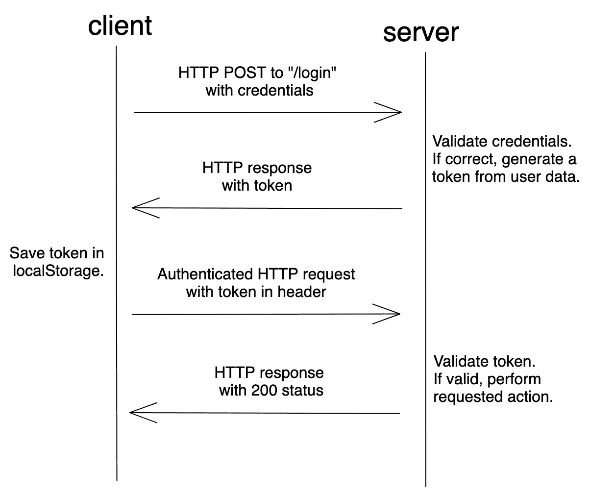
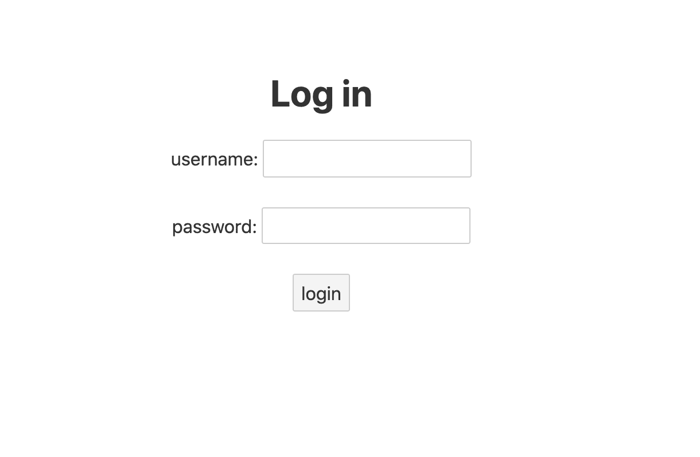
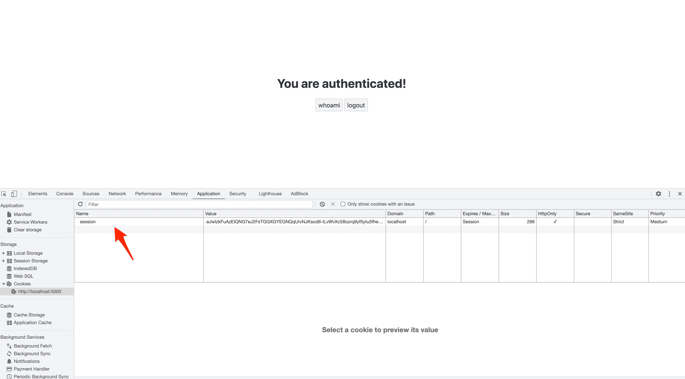
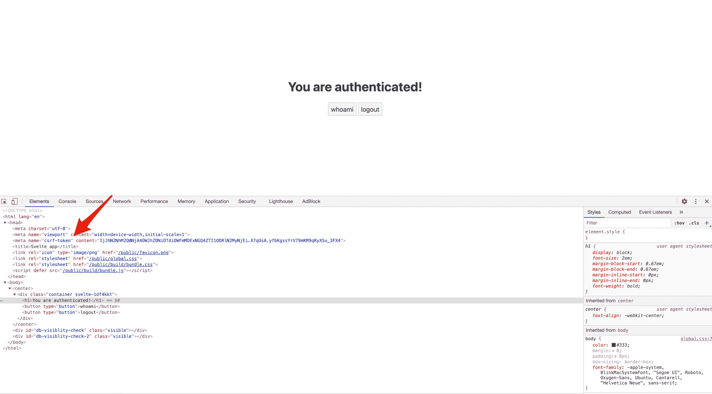
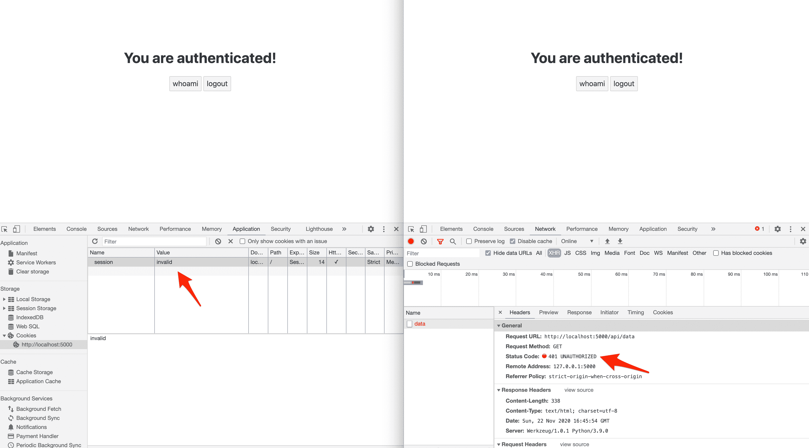
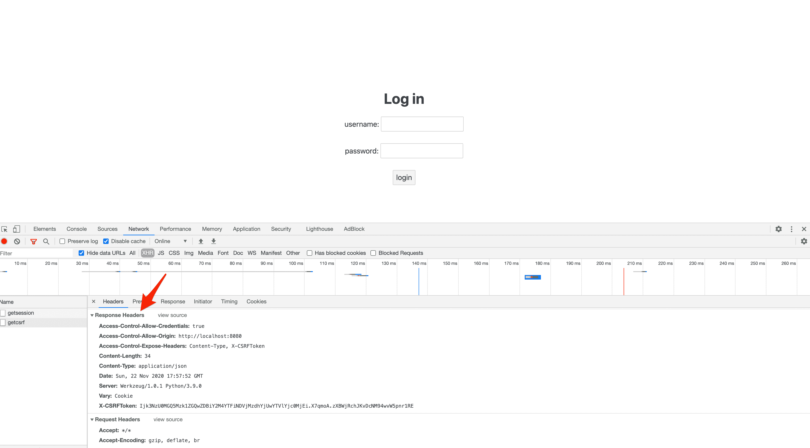

# 使用 Flask 为单页应用程序进行基于会话的身份验证

> 原文：<https://testdriven.io/blog/flask-spa-auth/>

在本文中，我们将看看如何使用基于会话的认证来认证[单页面应用程序](https://en.wikipedia.org/wiki/Single-page_application) (SPAs)。我们将使用 [Flask](https://flask.palletsprojects.com/) 作为我们的后端，使用 [Flask-Login](https://flask-login.readthedocs.io/) 来管理会话。前端将使用 [Svelte](https://svelte.dev/) 构建，这是一个 JavaScript 前端框架，旨在构建丰富的用户界面。

> 随意更换成不同的工具，如 Angular，Vue 或 React。

## 会话与基于令牌的身份验证

### 它们是什么？

使用基于会话的身份验证，会生成一个会话，并将 ID 存储在 cookie 中。

登录后，服务器会验证凭据。如果有效，它生成一个会话，存储它，然后将会话 id 发送回浏览器。浏览器将会话 ID 存储为 cookie，每当向服务器发出请求时，就会发送该 cookie。


基于会话的身份验证是有状态的。每次客户端向服务器发出请求时，服务器都必须在内存中定位会话，以便将会话 ID 绑定到相关用户。

另一方面，与基于会话的身份验证相比，基于令牌的身份验证相对较新。随着水疗和 RESTful APIs 的兴起，它获得了牵引力。

使用基于令牌的身份验证，在登录后，服务器验证凭据，如果有效，则创建一个签名的令牌并发送回浏览器。大多数情况下，令牌存储在 localStorage 中。然后，当向服务器发出请求时，客户端会将令牌添加到报头中。假设请求来自授权来源，服务器解码令牌并检查其有效性。



令牌是对用户信息进行编码的字符串。

例如:

```
`// token header { "alg":  "HS256", "typ":  "JWT" } // token payload { "sub":  "1234567890", "name":  "John Doe", "iat":  1516239022 }` 
```

令牌可以被验证和信任，因为它是使用秘密密钥或公钥/私钥对进行数字签名的。最常见的令牌类型是 [JSON Web 令牌](https://jwt.io/) (JWT)。

由于令牌包含服务器验证用户身份所需的所有信息，因此基于令牌的身份验证是无状态的。

> 有关会话和令牌的更多信息，请查看 Stack Exchange 中的[会话认证与令牌认证](https://security.stackexchange.com/questions/81756/session-authentication-vs-token-authentication)。

### 安全漏洞

如前所述，基于会话的身份验证在 cookie 中维护客户端的状态。虽然 JWT 可以存储在 localStorage 或 cookie 中，但是大多数基于令牌的 auth 实现都将 JWT 存储在 localStorage 中。这两种方法都存在潜在的安全问题:

CSRF 是一种针对 web 应用程序的攻击，攻击者试图欺骗经过身份验证的用户执行恶意操作。大多数 CSRF 攻击的目标是使用基于 cookie 的身份验证的 web 应用程序，因为 web 浏览器包括与每个请求的特定域相关联的所有 cookie。因此，当发出恶意请求时，攻击者可以很容易地利用存储的 cookies。

> 要了解更多关于 CSRF 和如何在烧瓶中预防它，请查看烧瓶中的 [CSRF 保护](/blog/csrf-flask/)文章。

XSS 攻击是一种注入类型，恶意脚本被注入客户端，通常是为了绕过浏览器的同源策略。在 localStorage 中存储令牌的 Web 应用程序容易受到 XSS 攻击。打开浏览器并导航到任何站点。在开发者工具中打开控制台，输入`JSON.stringify(localStorage)`。按回车键。这应该以 JSON 序列化的形式打印 localStorage 元素。脚本访问 localStorage 就是这么容易。

> 关于在哪里存储 jwt 的更多信息，请查看[在哪里存储 jwt——cookie 与 HTML5 Web 存储](https://stormpath.com/blog/where-to-store-your-jwts-cookies-vs-html5-web-storage)。

## 设置基于会话的身份验证

本质上有三种不同的方法将 Flask 与前端框架结合起来:

1.  通过 Jinja 模板提供框架
2.  在同一个域上独立于 Flask 提供框架
3.  在不同的域上独立于 Flask 提供框架

> 同样，你也可以随意选择苗条的前脸，比如，有棱角的，反应的，或者 Vue。

## 从长颈瓶供应的前端

使用这种方法，我们将构建前端，并用 Flask 提供生成的*index.html*文件。

假设您已经安装了[节点](https://nodejs.org/en/download/package-manager/)和 [npm](https://www.npmjs.com/get-npm) ，通过[瘦项目模板](https://github.com/sveltejs/template)创建一个新项目:

```
`$ npx degit sveltejs/template flask-spa-jinja
$ cd flask-spa-jinja` 
```

安装依赖项:

创建一个名为 *app.py* 的文件来保存 flask 应用程序:

安装烧瓶、烧瓶登录和[烧瓶 WTF](https://flask-wtf.readthedocs.io/) :

```
`$ python3.10 -m venv env
$ source env/bin/activate
$ pip install Flask==2.2.2 Flask-Login==0.6.2 Flask-WTF==1.0.1` 
```

添加一个“templates”文件夹，并将 *public/index.html* 文件移动到其中。您的项目结构现在应该如下所示:

```
`├── .gitignore
├── README.md
├── app.py
├── package-lock.json
├── package.json
├── public
│   ├── favicon.png
│   └── global.css
├── rollup.config.js
├── scripts
│   └── setupTypeScript.js
├── src
│   ├── App.svelte
│   └── main.js
└── templates
    └── index.html` 
```

### 烧瓶后端

该应用程序有以下路线:

1.  `/`上菜*index.html*文件
2.  `/api/login`让用户登录并生成会话
3.  `/api/data`获取已验证用户的用户数据
4.  `/api/getsession`检查会话是否存在
5.  `/api/logout`注销用户

在这里抓取完整代码[并将其添加到 *app.py* 文件中。](https://github.com/testdrivenio/flask-cookie-spa/blob/master/flask-spa-jinja/app.py)

记下`/`路线的处理程序:

```
`@app.route("/", defaults={"path": ""})
@app.route("/<path:path>")
def home(path):
    return render_template("index.html")` 
```

因为 Flask 最终提供 SPA，所以 CSRF cookie 将被自动设置。

转到配置:

```
`app.config.update(
    DEBUG=True,
    SECRET_KEY="secret_sauce",
    SESSION_COOKIE_HTTPONLY=True,
    REMEMBER_COOKIE_HTTPONLY=True,
    SESSION_COOKIE_SAMESITE="Strict",
)` 
```

设置为`True`的`HttpOnly`标志阻止任何客户端使用会话 cookie:

```
`SESSION_COOKIE_HTTPONLY=True,
REMEMBER_COOKIE_HTTPONLY=True,` 
```

我们还通过将`SESSION_COOKIE_SAMESITE`设置为`Strict`来防止任何外部请求发送 cookies。

有关这些配置选项的更多信息，请查看 Flask 文档中的 [Set-Cookie 选项](https://flask.palletsprojects.com/en/2.2.x/security/#set-cookie-options)。

> 确保将`SESSION_COOKIE_SECURE`和`REMEMBER_COOKIE_SECURE`设置为`True`，以将 cookies 限制为仅用于生产的 HTTPS 流量。

更新 *templates/index.html* ，通过`url_for`加载静态文件:

```
`<!DOCTYPE html>
<html lang="en">
<head>
  <meta charset='utf-8'>
  <meta name='viewport' content='width=device-width,initial-scale=1'>
  <meta name="csrf-token" content="{{ csrf_token() }}" />

  <title>Svelte app</title>

  <link rel='icon' type='image/png' href="{{url_for('static', filename='favicon.png')}}">
  <link rel='stylesheet' href="{{url_for('static', filename='global.css') }}">
  <link rel='stylesheet' href="{{url_for('static', filename='build/bundle.css') }}">

  <script defer src="{{url_for('static', filename='build/bundle.js') }}"></script>
</head>

<body>
</body>
</html>` 
```

`csrf-token` meta 标签保存由 Flask 应用程序生成的 CSRF 令牌。

### 纤细的前端

前端将有一个单独的组件，显示一个登录表单(当用户未经身份验证时)或一个简单的“您已通过身份验证！”消息(当用户通过身份验证时)。

在这里抓取完整代码[并将其添加到 *src/App.svelte* 文件中。](https://github.com/testdrivenio/flask-spa-auth/blob/master/flask-spa-jinja/src/App.svelte)

记下每个`fetch`请求的`credentials: "same-origin"`。如果 URL 和调用脚本在同一个源上，这将发送 cookies。

例如:

```
`const  whoami  =  ()  =>  { fetch("/api/data",  { method:  "GET", headers:  { "Content-Type":  "application/json", "X-CSRFToken":  csrf, }, credentials:  "same-origin", }) .then((res)  =>  res.json()) .then((data)  =>  { console.log(data); alert(`Welcome, ${data.username}!`); }) .catch((err)  =>  { console.log(err); }); };` 
```

CSRF 代币来自哪里？

我们将它添加到了 *templates/index.html* 中的 meta 标签中:

```
`<meta name="csrf-token" content="{{ csrf_token() }}" />` 
```

然后，当`App`组件挂载时，我们将 CSRF 令牌分配给`csrf`变量:

```
`let  csrf  =  document.getElementsByName("csrf-token")[0].content;` 
```

接下来，更新 *src/main.js* :

```
`import  App  from  './App.svelte'; const  app  =  new  App({ target:  document.body, }); export  default  app;` 
```

当应用程序被编译时，来自 *App.svelte* 文件的代码被分成 JavaScript 和 CSS 文件。这些文件然后被注入到 *src/index.html* ，这是我们的 SPA。在这种情况下，我们创建了一个新的应用程序，并使用`target: document.body`将其加载到整个 HTML 主体中。

### 试验

就是这样！我们准备好测试了。

创建一个新的构建，然后运行 Flask:

```
`$ npm run build
$ python app.py` 
```

导航到 [http://localhost:5000](http://localhost:5000) 。您应该会看到登录表单:



您可以使用以下方式登录:

*   用户名:`test`
*   密码:`test`

登录后，您可以从控制台看到会话 cookie，并在 HTML 源代码中看到 CSRF 令牌的值:





如果会话 cookie 无效会发生什么？



你可以在这里找到这种方法的最终代码。

## 单独提供前端服务(同一域)

使用这种方法，我们将构建前端，并在同一个域上独立于 Flask 应用程序提供它。我们将使用 Docker 和 Nginx 在本地同一域上提供这两个应用程序。

这种方法与 Jinja 方法的最大区别是，您必须发出初始请求来获得 CSRF 令牌，因为它不会自动设置。

首先创建一个项目目录:

```
`$ mkdir flask-spa-same-origin && cd flask-spa-same-origin` 
```

现在，为后端创建一个文件夹:

```
`$ mkdir backend && cd backend` 
```

创建一个名为 *app.py* 的文件来保存 flask 应用程序:

添加一个 *requirements.txt* 文件来安装 Flask、Flask-Login 和 Flask-WTF:

```
`Flask==2.2.2
Flask-Login==0.6.2
Flask-WTF==1.0.1` 
```

回到项目根，假设您已经安装了[节点](https://nodejs.org/en/download/package-manager/)和 [npm](https://www.npmjs.com/get-npm) ，通过[瘦项目模板](https://github.com/sveltejs/template)创建一个新项目:

```
`$ npx degit sveltejs/template frontend
$ cd frontend` 
```

安装依赖项:

您的项目结构现在应该如下所示:

```
`├── backend
│   ├── app.py
│   └── requirements.txt
└── frontend
    ├── .gitignore
    ├── README.md
    ├── package-lock.json
    ├── package.json
    ├── public
    │   ├── favicon.png
    │   ├── global.css
    │   └── index.html
    ├── rollup.config.js
    ├── scripts
    │   └── setupTypeScript.js
    └── src
        ├── App.svelte
        └── main.js` 
```

### 烧瓶后端

该应用程序有以下路线:

1.  `/api/ping`进行快速的理智检查
2.  `/api/getcsrf`在响应头中返回一个 CSRF 令牌
3.  `/api/login`让用户登录并生成会话
4.  `/api/data`获取已验证用户的用户数据
5.  `/api/getsession`检查会话是否存在
6.  `/api/logout`注销用户

在这里抓取完整代码[并将其添加到*后端/app.py* 文件中。](https://github.com/testdrivenio/flask-cookie-spa/blob/master/flask-spa-same-origin/backend/app.py)

注意到:

```
`@app.route("/api/getcsrf", methods=["GET"])
def get_csrf():
    token = generate_csrf()
    response = jsonify({"detail": "CSRF cookie set"})
    response.headers.set("X-CSRFToken", token)
    return response` 
```

这里，我们创建了一个 CSRF 令牌，并将其设置在响应头中。

### 纤细的前端

该组件将再次为未经身份验证的用户显示一个登录表单，或者显示一个简单的“您已通过身份验证！”针对已验证用户的消息。

在这里抓取完整代码[并将其添加到 *frontend/src/App.svelte* 文件中。](https://github.com/testdrivenio/flask-spa-auth/blob/master/flask-spa-same-origin/frontend/src/App.svelte)

由于后端和前端是分离的，我们必须通过`/api/getcsrf`端点从后端手动获取令牌，并将其存储在内存中:

```
`const  csrf  =  ()  =>  { fetch("/api/getcsrf",  { credentials:  "same-origin", }) .then((res)  =>  { csrfToken  =  res.headers.get(["X-CSRFToken"]); // console.log(csrfToken); }) .catch((err)  =>  { console.log(err); }); }` 
```

这个函数在组件挂载后被调用。

接下来，更新 *frontend/src/main.js* :

```
`import  App  from  './App.svelte'; const  app  =  new  App({ target:  document.body, }); export  default  app;` 
```

### 码头工人

接下来，让我们对两个应用程序进行 Dockerize。

#### 前端和后端

*前端/Dockerfile* :

```
`# pull the official base image
FROM  node:lts-alpine

# set working directory
WORKDIR  /usr/src/app

# add `/usr/src/app/node_modules/.bin` to $PATH
ENV  PATH /usr/src/app/node_modules/.bin:$PATH
ENV  HOST=0.0.0.0

# install and cache app dependencies
COPY  package.json .
COPY  package-lock.json .
RUN  npm ci
RUN  npm install [[email protected]](/cdn-cgi/l/email-protection) -g --silent

# start app
CMD  ["npm",  "run",  "dev"]` 
```

*后端/Dockerfile* :

```
`# pull the official base image
FROM  python:3.10-slim-buster

# set the working directory
WORKDIR  /usr/src/app

# set environment variables
ENV  PYTHONDONTWRITEBYTECODE 1
ENV  PYTHONUNBUFFERED 1

# install dependencies
RUN  pip install --upgrade pip
COPY  ./requirements.txt .
RUN  pip install -r requirements.txt

# add app
COPY  . .

# start app
CMD  ["python",  "app.py"]` 
```

向项目根目录添加一个 *docker-compose.yml* 文件，将两个应用程序绑定在一起:

```
`version:  "3.8" services: backend: build:  ./backend volumes: -  ./backend:/usr/src/app expose: -  5000 frontend: stdin_open:  true build:  ./frontend volumes: -  ./frontend:/usr/src/app -  /usr/src/app/node_modules expose: -  8080 depends_on: -  backend` 
```

#### Nginx

为了在同一个域上运行这两个应用程序，让我们为 Nginx 添加一个作为反向代理的容器。在项目根目录下创建一个名为“nginx”的新文件夹。

*nginx/Dockerfile* :

```
`FROM  nginx:latest
COPY  ./nginx.conf /etc/nginx/nginx.conf` 
```

同样添加一个 *nginx/nginx.conf* 配置文件。你可以在这里找到它的代码。

注意两个[位置](https://nginx.org/en/docs/http/ngx_http_core_module.html#location)块:

```
`location  /api  { proxy_pass  http://backend:5000; ... } location  /  { proxy_pass  http://frontend:8080; ... }` 
```

对`/`的请求将被转发到`http://frontend:8080` ( `frontend`是 Docker 合成文件中的服务名)，而对`/api`的请求将被转发到`http://backend:5000` ( `backend`是 Docker 合成文件中的服务名)。

将服务添加到 *docker_compose.yml* 文件中:

```
`version:  "3.8" services: backend: build:  ./backend volumes: -  ./backend:/usr/src/app expose: -  5000 frontend: stdin_open:  true build:  ./frontend volumes: -  ./frontend:/usr/src/app -  /usr/src/app/node_modules expose: -  8080 depends_on: -  backend reverse_proxy: build:  ./nginx ports: -  81:80 depends_on: -  backend -  frontend` 
```

您的项目结构现在应该如下所示:

```
`├── backend
│   ├── Dockerfile
│   ├── app.py
│   └── requirements.txt
├── docker-compose.yml
├── frontend
│   ├── .gitignore
│   ├── Dockerfile
│   ├── README.md
│   ├── package-lock.json
│   ├── package.json
│   ├── public
│   │   ├── favicon.png
│   │   ├── global.css
│   │   └── index.html
│   ├── rollup.config.js
│   ├── scripts
│   │   └── setupTypeScript.js
│   └── src
│       ├── App.svelte
│       └── main.js
└── nginx
    ├── Dockerfile
    └── nginx.conf` 
```

### 试验

构建映像并运行容器:

```
`$ docker-compose up -d --build` 
```

导航到 [http://localhost:81](http://localhost:81) 。您应该会看到登录表单。

登录方式:

*   用户名:`test`
*   密码:`test`

您可以在这里找到这种方法的最终代码[。](https://github.com/testdrivenio/flask-spa-auth/tree/master/flask-spa-same-origin)

## 单独提供前端服务(跨域)

使用这种方法，我们将构建前端，并在不同的域上独立于 Flask 应用程序提供它。我们将不得不通过使用 [Flask-CORS](https://flask-cors.readthedocs.io/) 允许来自前端的跨域请求来稍微放松安全性。

首先创建一个项目目录:

```
`$ mkdir flask-spa-cross-origin && cd flask-spa-cross-origin` 
```

现在，为后端创建一个文件夹:

```
`$ mkdir backend && cd backend` 
```

创建一个名为 *app.py* 的文件来保存 flask 应用程序:

安装烧瓶、烧瓶登录、烧瓶 WTF 和烧瓶 CORS:

```
`$ python3.9 -m venv env
$ source env/bin/activate
$ pip install Flask==2.2.2 Flask-Login==0.6.2 Flask-WTF==1.0.1 Flask-Cors==3.0.10` 
```

回到项目根，假设您已经安装了[节点](https://nodejs.org/en/download/package-manager/)和 [npm](https://www.npmjs.com/get-npm) ，通过[瘦项目模板](https://github.com/sveltejs/template)创建一个新项目:

```
`$ npx degit sveltejs/template frontend
$ cd frontend` 
```

安装依赖项:

您的项目结构现在应该如下所示:

```
`├── backend
│   └── app.py
└── frontend
    ├── .gitignore
    ├── README.md
    ├── package-lock.json
    ├── package.json
    ├── public
    │   ├── favicon.png
    │   ├── global.css
    │   └── index.html
    ├── rollup.config.js
    ├── scripts
    │   └── setupTypeScript.js
    └── src
        ├── App.svelte
        └── main.js` 
```

### 烧瓶后端

该应用程序有以下路线:

1.  `/api/ping`进行快速的理智检查
2.  `/api/getcsrf`在响应头中返回一个 CSRF 令牌
3.  `/api/login`让用户登录并生成会话
4.  `/api/data`获取已验证用户的用户数据
5.  `/api/getsession`检查会话是否存在
6.  `/api/logout`注销用户

在这里抓取完整代码[并将其添加到*后端/app.py* 文件中。](https://github.com/testdrivenio/flask-cookie-spa/blob/master/flask-spa-cross-origin/backend/app.py)

要启用 CORS，我们必须配置服务器返回适当的头:

```
`cors = CORS(
    app,
    resources={r"*": {"origins": "http://localhost:8080"}},
    expose_headers=["Content-Type", "X-CSRFToken"],
    supports_credentials=True,
)` 
```

注意事项:

1.  `resources={r"*": {"origins": "http://localhost:8080"}}`启用来自`http://localhost:8080`的所有路由和 HTTP 方法的跨域请求。
2.  `expose_headers=["Content-Type", "X-CSRFToken"]`表示可以露出`Content-Type`和`X-CSRFToken`接头。
3.  `supports_credentials=True`允许跨域发送 cookies。

标题:

```
`Access-Control-Allow-Origin: http://localhost:8080
Access-Control-Expose-Headers: Content-Type, X-CSRFToken
Access-Control-Allow-Credentials: true` 
```

你有没有注意到`SESSION_COOKIE_SAMESITE`被设置为`Lax`？

```
`SESSION_COOKIE_SAMESITE="Lax",` 
```

如果我们让它保持为`Strict`，就不会从前端发送 cookies。顾名思义，`Lax`稍微放松了安全性，因此对于大多数请求，cookies 将跨域发送。

查看 Flask 文档中的 [Set-Cookie 选项](https://flask.palletsprojects.com/en/2.2.x/security/#set-cookie-options)以了解更多相关信息。

### 纤细的前端

在这里抓取完整代码[并将其添加到 *frontend/src/App.svelte* 文件中。](https://github.com/testdrivenio/flask-spa-auth/blob/master/flask-spa-cross-origin/frontend/src/App.svelte)

这里与相同域方法的唯一变化是将`credentials: "same-origin"`改为`credentials: "include"`,这样即使请求 URL 在不同的域上，cookies 仍然会被发送。

接下来，更新 *frontend/src/main.js* :

```
`import  App  from  './App.svelte'; const  app  =  new  App({ target:  document.body, }); export  default  app;` 
```

### 试验

旋转烧瓶应用程序:

然后，在不同的终端窗口中，运行 Svelte:

导航到 [http://localhost:8080](http://localhost:8080) 。您应该会看到登录表单。

登录方式:

*   用户名:`test`
*   密码:`test`



如果会话 cookie 无效会发生什么？

你可以在这里找到这种方法的最终代码。

## 结论

本文详细介绍了如何为单页面应用程序设置基于会话的身份验证。无论您使用会话 cookie 还是令牌，当客户端是浏览器时，最好使用 cookie 进行身份验证。虽然最好从同一个域提供这两个应用程序，但您可以通过放宽跨域安全设置，在不同的域上提供它们。

我们研究了三种不同的方法来将 Flask 与具有基于会话的授权的前端框架相结合:

| 方法 | 前端 | 后端 |
| --- | --- | --- |
| 从长颈瓶供应的前端 | 从 meta 标签中获取 CSRF 令牌，并在获取请求中使用`credentials: "same-origin"`。 | 将`SESSION_COOKIE_HTTPONLY`和`REMEMBER_COOKIE_HTTPONLY`设置为`True`，将`SESSION_COOKIE_SAMESITE`设置为`"Strict"`。 |
| 单独提供前端服务(同一域) | 获取 CSRF 令牌并在获取请求中使用`credentials: "same-origin"`。 | 添加一个路由处理程序，用于生成在响应头中设置的 CSRF 令牌。将`SESSION_COOKIE_HTTPONLY`和`REMEMBER_COOKIE_HTTPONLY`设置为`True`，将`SESSION_COOKIE_SAMESITE`设置为`"Strict"`。 |
| 单独提供前端服务(跨域) | 获取 CSRF 令牌并在获取请求中使用`credentials: "include"`。 | 启用 CORS 并添加路由处理程序，以生成在响应标头中设置的 CSRF 令牌。将`SESSION_COOKIE_HTTPONLY`和`REMEMBER_COOKIE_HTTPONLY`设置为`True`，将`SESSION_COOKIE_SAMESITE`设置为`"Lax"`。 |

从 [flask-spa-auth](https://github.com/testdrivenio/flask-spa-auth) repo 中获取代码。