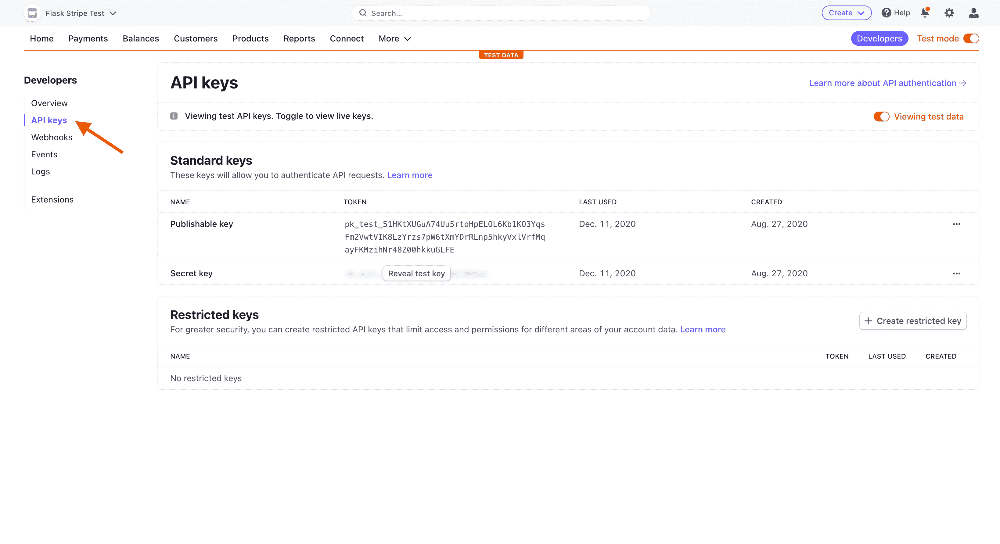
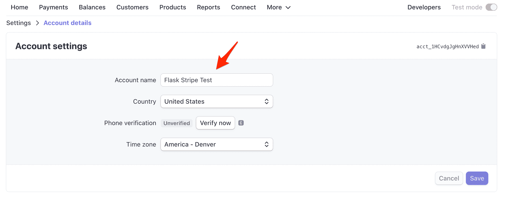
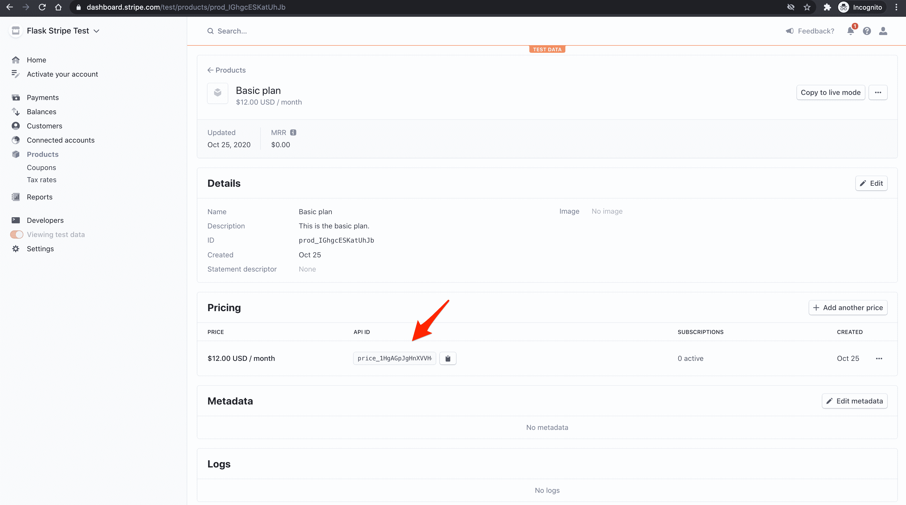
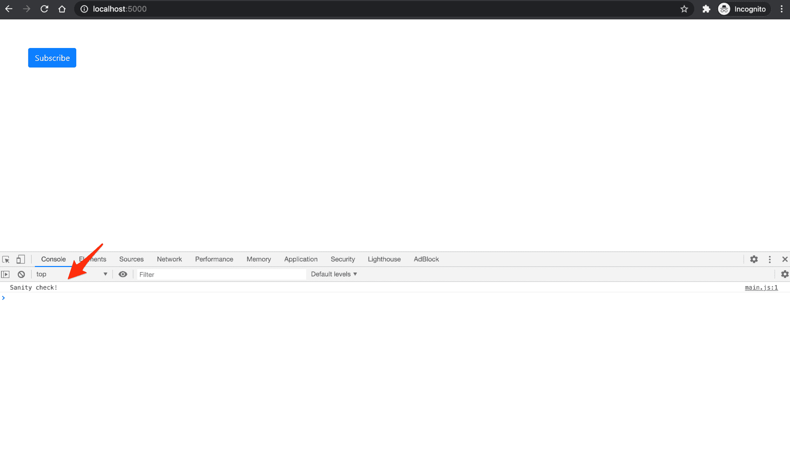
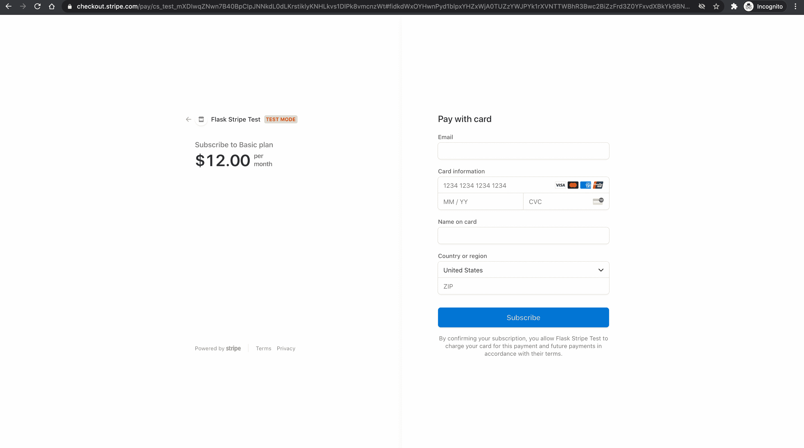
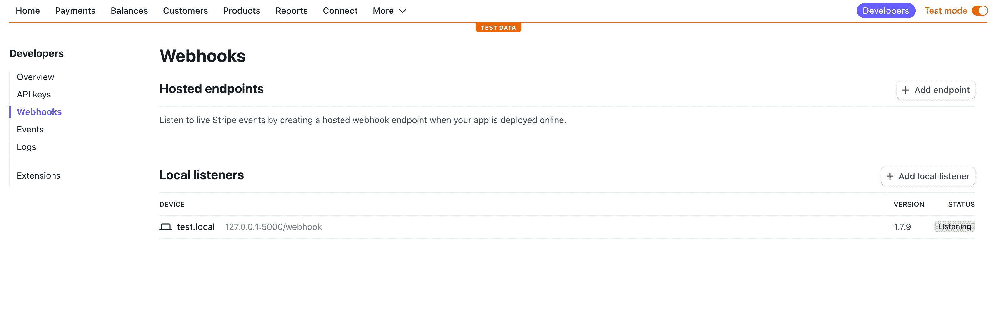
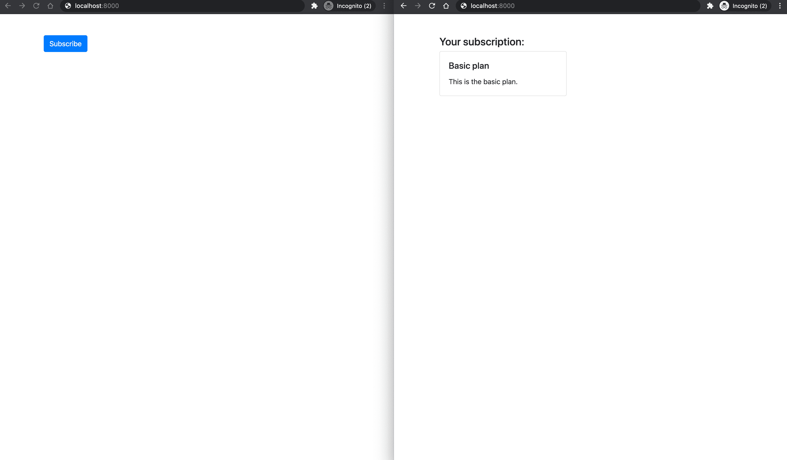

# 烧瓶条纹订阅

> 原文：<https://testdriven.io/blog/flask-stripe-subscriptions/>

本教程介绍如何使用 Flask 和 [Stripe](https://stripe.com/) 设置和收取每月定期订阅费用。

> 需要接受一次性付款？查看[烧瓶条纹教程](/blog/flask-stripe-tutorial/)。

## 条带订阅支付选项

有多种方法可以实现和处理条带订阅，但最常见的两种方法是:

1.  [固定价格订阅](https://stripe.com/docs/billing/subscriptions/fixed-price)
2.  [未来付款](https://stripe.com/docs/payments/save-and-reuse#checkout)

在这两种情况下，您都可以使用 [Stripe Checkout](https://stripe.com/payments/checkout) (这是一个 Stripe 托管的 Checkout 页面)或 [Stripe Elements](https://stripe.com/payments/elements) (这是一组用于构建支付表单的定制 UI 组件)。如果您不介意将您的用户重定向到 Stripe 托管的页面，并希望 Stripe 为您处理大部分支付流程(例如，创建客户和支付意向等)，请使用 Stripe Checkout。)，否则使用条纹元素。

固定价格方法更容易建立，但是你不能完全控制计费周期和支付。通过使用这种方法，Stripe 将在成功结账后的每个结算周期自动开始向您的客户收费。

固定价格步骤:

1.  将用户重定向至条带检验(使用`mode=subscription`)
2.  创建一个监听`checkout.session.completed`的网络钩子
3.  调用 webhook 后，将相关数据保存到数据库中

未来付款方式更难设置，但这种方式可以让您完全控制订阅。您提前收集客户详细信息和付款信息，并在未来某个日期向客户收费。这种方法还允许您同步计费周期，以便您可以在同一天向所有客户收费。

未来付款步骤:

1.  将用户重定向到条带结帐(使用`mode=setup`)以收集支付信息
2.  创建一个监听`checkout.session.completed`的网络钩子
3.  调用 webhook 后，将相关数据保存到数据库中
4.  从那里，您可以在将来使用[付款意向 API](https://stripe.com/docs/payments/payment-intents) 对付款方式收费

在本教程中，我们将使用带条纹结帐的固定价格方法。

## 计费周期

在开始之前，值得注意的是 Stripe 没有默认的计费频率。每个条带订阅的记账日期由以下两个因素决定:

1.  计费周期锚点(订阅创建的时间戳)
2.  重复间隔(每天、每月、每年等。)

例如，每月订阅设置为在每月 2 日循环的客户将始终在 2 日计费。

如果一个月没有锚定日，订阅将在该月的最后一天计费。例如，从 1 月 31 日开始的订阅在 2 月 28 日(或闰年的 2 月 29 日)计费，然后是 3 月 31 日、4 月 30 日等等。

> 要了解有关计费周期的更多信息，请参考 Stripe 文档中的[设置订阅计费周期日期](https://stripe.com/docs/billing/subscriptions/billing-cycle)页面。

## 项目设置

让我们首先为我们的项目创建一个新目录。在该目录中，我们将创建并激活一个新的虚拟环境，并安装 Flask。

```py
`$ mkdir flask-stripe-subscriptions && cd flask-stripe-subscriptions
$ python3.10 -m venv env
$ source env/bin/activate
(env)$ pip install flask` 
```

> 你可以随意把 virtualenv 和 Pip 换成诗歌[或](https://python-poetry.org) [Pipenv](https://github.com/pypa/pipenv) 。

接下来，创建名为 app.py 的文件，并添加基本“Hello World”应用程序的代码:

```py
`# app.py

from flask import Flask, jsonify

app = Flask(__name__)

@app.route("/hello")
def hello_world():
    return jsonify("hello, world!")

if __name__ == "__main__":
    app.run()` 
```

启动服务器:

```py
`(env)$ FLASK_ENV=development python app.py` 
```

导航到[http://localhost:5000/hello](http://localhost:5000/hello)，您应该会看到`hello, world!`消息。

## 添加条纹

准备好基础项目后，让我们添加 Stripe。安装最新版本:

```py
`(env)$ pip install stripe` 
```

接下来，[注册一个 Stipe 账户的](https://dashboard.stripe.com/register)(如果你还没有注册的话)并导航到[仪表板](https://dashboard.stripe.com/test/dashboard)。单击“Developers ”,然后从左侧栏的列表中单击“API keys ”:



每个条带帐户有四个 [API 密钥](https://stripe.com/docs/keys):两个用于测试，两个用于生产。每一对都有一个“秘密密钥”和一个“可公开密钥”。不要向任何人透露密钥；可发布的密钥将被嵌入到任何人都可以看到的页面上的 JavaScript 中。

目前右上角的“查看测试数据”开关表示我们正在使用测试键。这就是我们想要的。

将您的[测试 API 键](https://stripe.com/docs/keys#test-live-modes)存储为环境变量，如下所示:

```py
`(env)$ export STRIPE_PUBLISHABLE_KEY=<YOUR_STRIPE_PUBLISHABLE_KEY>
(env)$ export STRIPE_SECRET_KEY=<YOUR_STRIPE_SECRET_KEY>` 
```

接下来，将条带密钥添加到您的应用程序中:

```py
`# app.py

import os

import stripe
from flask import Flask, jsonify

app = Flask(__name__)

stripe_keys = {
    "secret_key": os.environ["STRIPE_SECRET_KEY"],
    "publishable_key": os.environ["STRIPE_PUBLISHABLE_KEY"],
}

stripe.api_key = stripe_keys["secret_key"]

@app.route("/hello")
def hello_world():
    return jsonify("hello, world!")

if __name__ == "__main__":
    app.run()` 
```

最后，在[https://dashboard.stripe.com/settings/account](https://dashboard.stripe.com/settings/account)的“账户设置”中指定一个“账户名称”。



## 创造产品

接下来，让我们创建一个要销售的订阅产品。

单击“产品”，然后单击“添加产品”。

添加产品名称和描述，输入价格，然后选择“重复”:


点击“保存产品”。

接下来，获取价格的 API ID:



将 ID 保存为环境变量，如下所示:

```py
`(env)$ export STRIPE_PRICE_ID=<YOUR_PRICE_API_ID>` 
```

接下来，像这样将它添加到`stripe_keys`字典中:

```py
`# app.py

stripe_keys = {
    "secret_key": os.environ["STRIPE_SECRET_KEY"],
    "publishable_key": os.environ["STRIPE_PUBLISHABLE_KEY"],
    "price_id": os.environ["STRIPE_PRICE_ID"],  # new
}` 
```

## 证明

为了在将来将您的用户与 Stripe 客户相关联并实现订阅管理，您可能需要在允许客户订阅服务之前强制执行用户身份验证。Flask-Login 或 [Flask-HTTPAuth](https://github.com/miguelgrinberg/flask-httpauth) 是你可以用来管理这个的两个扩展。

> 查看这个资源，获得 Flask 的 auth 相关扩展的完整列表。

除了身份验证之外，您还需要在与客户相关的数据库中存储一些信息。你的模型看起来会像这样:

```py
`class User(db.Model):
    id = db.Column(db.Integer, primary_key=True, autoincrement=True)
    email = db.Column(db.String(128), nullable=False, unique=True)
    password = db.Column(db.String(200), nullable=False)
    created_on = db.Column(db.DateTime, default=func.now(), nullable=False)

class StripeCustomer(db.Model):
    id = db.Column(db.Integer, primary_key=True, autoincrement=True)
    user_id = database.Column(database.Integer, database.ForeignKey('users.id'))
    stripeCustomerId = db.Column(db.String(255), nullable=False)
    stripeSubscriptionId = db.Column(db.String(255), nullable=False)` 
```

如果你愿意，现在就开始设置吧。

## 获取可发布密钥

### JavaScript 静态文件

创建一个名为“static”的新文件夹，然后向该文件夹添加一个名为 *main.js* 的新文件:

```py
`(env)$ mkdir static
(env)$ touch static/main.js` 
```

向新的 *main.js* 文件添加快速健全检查:

```py
`// static/main.js console.log("Sanity check!");` 
```

接下来，向 *app.py* 注册一条新路线，该路线提供了【index.html】模板*:*

```py
`# app.py

@app.route("/")
def index():
    # you should force the user to log in/sign up
    return render_template("index.html")` 
```

不要忘记像这样在文件的顶部导入`render_template`:

```py
`from flask import Flask, jsonify, render_template` 
```

对于模板，在项目根目录下创建一个名为“templates”的新文件夹。在该文件夹中，创建一个名为*index.html*的新文件，并将以下内容放入其中:

```py
`<!-- templates/index.html -->

<!DOCTYPE html>
<html lang="en">
  <head>
    <meta charset="utf-8">
    <meta name="viewport" content="width=device-width, initial-scale=1">
    <title>Flask + Stripe Subscriptions</title>
    <script src="https://code.jquery.com/jquery-3.5.1.min.js" crossorigin="anonymous"></script>
    <link rel="stylesheet" href="https://stackpath.bootstrapcdn.com/bootstrap/4.5.2/css/bootstrap.min.css" crossorigin="anonymous">
    <script src="https://stackpath.bootstrapcdn.com/bootstrap/4.5.2/js/bootstrap.min.js" crossorigin="anonymous"></script>
    <script src="{{ url_for('static', filename='main.js') }}"></script>
  </head>
  <body>
    <div class="container mt-5">
      <button type="submit" class="btn btn-primary" id="submitBtn">Subscribe</button>
    </div>
  </body>
</html>` 
```

再次运行服务器:

```py
`(env)$ FLASK_ENV=development python app.py` 
```

导航到 [http://localhost:5000/](http://localhost:5000/) ，打开 JavaScript 控制台。您应该会看到控制台内部的健全性检查。



### 途径

接下来，向 *app.py* 添加一个新的路由来处理 AJAX 请求:

```py
`# app.py

@app.route("/config")
def get_publishable_key():
    stripe_config = {"publicKey": stripe_keys["publishable_key"]}
    return jsonify(stripe_config)` 
```

### AJAX 请求

接下来，使用[获取 API](https://developer.mozilla.org/en-US/docs/Web/API/Fetch_API) 向 *static/main.js* 中的新`/config`端点发出 AJAX 请求:

```py
`// static/main.js console.log("Sanity check!"); // new // Get Stripe publishable key fetch("/config") .then((result)  =>  {  return  result.json();  }) .then((data)  =>  { // Initialize Stripe.js const  stripe  =  Stripe(data.publicKey); });` 
```

来自`fetch`请求的响应是一个[可读流](https://developer.mozilla.org/en-US/docs/Web/API/ReadableStream)。`result.json()`返回一个承诺，我们将它解析为一个 JavaScript 对象——即`data`。然后我们使用点符号来访问`publicKey`以获得可发布的密钥。

将 [Stripe.js](https://stripe.com/docs/js) 包含在 *templates/index.html* 中，就像这样:

```py
`<!-- templates/index.html -->

<!DOCTYPE html>
<html lang="en">
  <head>
    <meta charset="utf-8">
    <meta name="viewport" content="width=device-width, initial-scale=1">
    <title>Flask + Stripe Subscriptions</title>
    <script src="https://js.stripe.com/v3/"></script>  <!-- new -->
    <script src="https://code.jquery.com/jquery-3.5.1.min.js" crossorigin="anonymous"></script>
    <link rel="stylesheet" href="https://stackpath.bootstrapcdn.com/bootstrap/4.5.2/css/bootstrap.min.css" crossorigin="anonymous">
    <script src="https://stackpath.bootstrapcdn.com/bootstrap/4.5.2/js/bootstrap.min.js" crossorigin="anonymous"></script>
    <script src="{{ url_for('static', filename='main.js') }}"></script>
  </head>
  <body>
    <div class="container mt-5">
      <button type="submit" class="btn btn-primary" id="submitBtn">Subscribe</button>
    </div>
  </body>
</html>` 
```

现在，在页面加载之后，将调用`/config`，它将使用 Stripe publish key 进行响应。然后，我们将使用这个键创建 Stripe.js 的新实例。

## 创建签出会话

接下来，我们需要将一个事件处理程序附加到按钮的 click 事件，该事件将向服务器发送另一个 AJAX 请求，以生成一个新的结帐会话 ID。

### 途径

首先，添加新路由:

```py
`# app.py

@app.route("/create-checkout-session")
def create_checkout_session():
    domain_url = "http://localhost:5000/"
    stripe.api_key = stripe_keys["secret_key"]

    try:
        checkout_session = stripe.checkout.Session.create(
            # you should get the user id here and pass it along as 'client_reference_id'
            #
            # this will allow you to associate the Stripe session with
            # the user saved in your database
            #
            # example: client_reference_id=user.id,
            success_url=domain_url + "success?session_id={CHECKOUT_SESSION_ID}",
            cancel_url=domain_url + "cancel",
            payment_method_types=["card"],
            mode="subscription",
            line_items=[
                {
                    "price": stripe_keys["price_id"],
                    "quantity": 1,
                }
            ]
        )
        return jsonify({"sessionId": checkout_session["id"]})
    except Exception as e:
        return jsonify(error=str(e)), 403` 
```

完整的文件现在应该如下所示:

```py
`# app.py

import os

import stripe
from flask import Flask, jsonify, render_template

app = Flask(__name__)

stripe_keys = {
    "secret_key": os.environ["STRIPE_SECRET_KEY"],
    "publishable_key": os.environ["STRIPE_PUBLISHABLE_KEY"],
    "price_id": os.environ["STRIPE_PRICE_ID"],
}

stripe.api_key = stripe_keys["secret_key"]

@app.route("/hello")
def hello_world():
    return jsonify("hello, world!")

@app.route("/")
def index():
    # you should force the user to log in/sign up
    return render_template("index.html")

@app.route("/config")
def get_publishable_key():
    stripe_config = {"publicKey": stripe_keys["publishable_key"]}
    return jsonify(stripe_config)

@app.route("/create-checkout-session")
def create_checkout_session():
    domain_url = "http://localhost:5000/"
    stripe.api_key = stripe_keys["secret_key"]

    try:
        checkout_session = stripe.checkout.Session.create(
            # you should get the user id here and pass it along as 'client_reference_id'
            #
            # this will allow you to associate the Stripe session with
            # the user saved in your database
            #
            # example: client_reference_id=user.id,
            success_url=domain_url + "success?session_id={CHECKOUT_SESSION_ID}",
            cancel_url=domain_url + "cancel",
            payment_method_types=["card"],
            mode="subscription",
            line_items=[
                {
                    "price": stripe_keys["price_id"],
                    "quantity": 1,
                }
            ]
        )
        return jsonify({"sessionId": checkout_session["id"]})
    except Exception as e:
        return jsonify(error=str(e)), 403

if __name__ == "__main__":
    app.run()` 
```

### AJAX 请求

将事件处理程序和后续 AJAX 请求添加到 *static/main.js* :

```py
`// static/main.js console.log("Sanity check!"); // Get Stripe publishable key fetch("/config") .then((result)  =>  {  return  result.json();  }) .then((data)  =>  { // Initialize Stripe.js const  stripe  =  Stripe(data.publicKey); // new // Event handler document.querySelector("#submitBtn").addEventListener("click",  ()  =>  { // Get Checkout Session ID fetch("/create-checkout-session") .then((result)  =>  {  return  result.json();  }) .then((data)  =>  { console.log(data); // Redirect to Stripe Checkout return  stripe.redirectToCheckout({sessionId:  data.sessionId}) }) .then((res)  =>  { console.log(res); }); }); });` 
```

在这里，在解析了`result.json()`承诺之后，我们调用了 [redirectToCheckout](https://stripe.com/docs/js/checkout/redirect_to_checkout) ,其中的结帐会话 ID 来自解析的承诺。

导航到 [http://localhost:5000/](http://localhost:5000/) 。点击按钮后，您将被重定向到一个 Stripe Checkout 实例(一个 Stripe 托管页面，用于安全收集支付信息),其中包含订阅信息:



我们可以使用 Stripe 提供的几个[测试卡号](https://stripe.com/docs/testing#cards)中的一个来测试表单。还是用`4242 4242 4242 4242`吧。请确保到期日期在未来。为 CVC 添加任意 3 个数字，为邮政编码添加任意 5 个数字。输入任何电子邮件地址和名称。如果一切顺利，付款应该被处理，您应该订阅，但重定向将失败，因为我们还没有设置`/success/` URL。

## 用户重定向

接下来，我们将创建成功和取消视图，并在结帐后将用户重定向到适当的页面。

路线:

```py
`# app.py

@app.route("/success")
def success():
    return render_template("success.html")

@app.route("/cancel")
def cancelled():
    return render_template("cancel.html")` 
```

创建*success.html*和*cancel.html*模板。

成功:

```py
`<!-- templates/success.html -->

<!DOCTYPE html>
<html lang="en">
  <head>
    <meta charset="utf-8">
    <meta name="viewport" content="width=device-width, initial-scale=1">
    <title>Flask + Stripe Subscriptions</title>
    <script src="https://code.jquery.com/jquery-3.5.1.min.js" crossorigin="anonymous"></script>
    <link rel="stylesheet" href="https://stackpath.bootstrapcdn.com/bootstrap/4.5.2/css/bootstrap.min.css" crossorigin="anonymous">
    <script src="https://stackpath.bootstrapcdn.com/bootstrap/4.5.2/js/bootstrap.min.js" crossorigin="anonymous"></script>
  </head>
  <body>
    <div class="container mt-5">
      <p>You have successfully subscribed!</p>
    </div>
  </body>
</html>` 
```

取消:

```py
`<!-- templates/cancel.html -->

<!DOCTYPE html>
<html lang="en">
  <head>
    <meta charset="utf-8">
    <meta name="viewport" content="width=device-width, initial-scale=1">
    <title>Flask + Stripe Subscriptions</title>
    <script src="https://code.jquery.com/jquery-3.5.1.min.js" crossorigin="anonymous"></script>
    <link rel="stylesheet" href="https://stackpath.bootstrapcdn.com/bootstrap/4.5.2/css/bootstrap.min.css" crossorigin="anonymous">
    <script src="https://stackpath.bootstrapcdn.com/bootstrap/4.5.2/js/bootstrap.min.js" crossorigin="anonymous"></script>
  </head>
  <body>
    <div class="container mt-5">
      <p>You have cancelled the checkout.</p>
    </div>
  </body>
</html>` 
```

如果支付成功，用户将被重定向到`/success`，如果支付失败，用户将被重定向到`cancel/`。测试一下。

## 条纹网钩

我们的应用程序在这一点上运行良好，但我们仍然不能以编程方式确认付款。将来，当客户成功订阅时，我们还需要将相关信息保存到数据库中。我们已经在用户结帐后将他们重定向到成功页面，但是我们不能只依赖那个页面，因为付款确认是异步发生的。

> 一般来说，在条带和编程中有两种类型的事件。同步事件，具有即时的效果和结果(例如，创建一个客户)，异步事件，没有即时的结果(例如，确认付款)。因为支付确认是异步完成的，用户可能会在他们的支付被确认之前*和*我们收到他们的资金之前*被重定向到成功页面。*

当付款通过时，最简单的通知方法之一是使用回调或所谓的 Stripe webhook。我们需要在应用程序中创建一个简单的端点，每当事件发生时(例如，当用户订阅时)，Stripe 将调用这个端点。通过使用 webhooks，我们可以绝对肯定支付成功。

为了使用 webhooks，我们需要:

1.  设置 webhook 端点
2.  使用[条带 CLI](https://stripe.com/docs/stripe-cli) 测试端点
3.  用条带注册端点

### 端点

创建一个名为`stripe_webhook`的新路由，它将在每次有人订阅时打印一条消息。

> 如果添加了身份验证，应该在`StripeCustomer`表中创建一条记录，而不是打印一条消息。

```py
`# app.py

@app.route("/webhook", methods=["POST"])
def stripe_webhook():
    payload = request.get_data(as_text=True)
    sig_header = request.headers.get("Stripe-Signature")

    try:
        event = stripe.Webhook.construct_event(
            payload, sig_header, stripe_keys["endpoint_secret"]
        )

    except ValueError as e:
        # Invalid payload
        return "Invalid payload", 400
    except stripe.error.SignatureVerificationError as e:
        # Invalid signature
        return "Invalid signature", 400

    # Handle the checkout.session.completed event
    if event["type"] == "checkout.session.completed":
        session = event["data"]["object"]

        # Fulfill the purchase...
        handle_checkout_session(session)

    return "Success", 200

def handle_checkout_session(session):
    # here you should fetch the details from the session and save the relevant information
    # to the database (e.g. associate the user with their subscription)
    print("Subscription was successful.")` 
```

不要忘记像这样在文件的顶部导入`request`:

```py
`from flask import Flask, jsonify, render_template, request` 
```

`stripe_webhook`现在作为我们的 webhook 端点。这里，我们只寻找每当结帐成功时调用的`checkout.session.completed`事件，但是您可以对其他[条带事件](https://stripe.com/docs/api/events)使用相同的模式。

### 测试 webhook

我们将使用 [Stripe CLI](https://stripe.com/docs/stripe-cli) 来测试 webhook。

一旦[下载并安装了](https://stripe.com/docs/stripe-cli#install)，在新的终端窗口中运行以下命令，登录到您的 Stripe 帐户:

此命令应生成一个配对代码:

```py
`Your pairing code is: peach-loves-classy-cozy
This pairing code verifies your authentication with Stripe.
Press Enter to open the browser (^C to quit)` 
```

通过按 Enter，CLI 将打开您的默认 web 浏览器，并请求访问您的帐户信息的权限。请继续并允许访问。回到您的终端，您应该看到类似于以下内容的内容:

```py
`> Done! The Stripe CLI is configured for Flask Test with account id acct_<ACCOUNT_ID>

Please note: this key will expire after 90 days, at which point you'll need to re-authenticate.` 
```

接下来，我们可以开始侦听条带事件，并使用以下命令将它们转发到我们的端点:

```py
`$ stripe listen --forward-to localhost:5000/webhook` 
```

这也将生成一个 webhook 签名密码:

```py
`> Ready! Your webhook signing secret is whsec_xxxxxxxxxxxxxxxxxxxxxxxxxxxxxx (^C to quit)` 
```

为了初始化端点，设置一个新的环境变量:

```py
`(env)$ export STRIPE_ENDPOINT_SECRET=<YOUR_STRIPE_ENDPOINT_SECRET>` 
```

接下来，像这样将它添加到`stripe_keys`字典中:

```py
`# app.py

stripe_keys = {
    "secret_key": os.environ["STRIPE_SECRET_KEY"],
    "publishable_key": os.environ["STRIPE_PUBLISHABLE_KEY"],
    "price_id": os.environ["STRIPE_PRICE_ID"],
    "endpoint_secret": os.environ["STRIPE_ENDPOINT_SECRET"],  # new
}` 
```

Stripe 现在会将事件转发到我们的端点。要测试，通过`4242 4242 4242 4242`运行另一个测试支付。在您的终端中，您应该会看到`Subscription was successful.`消息。

一旦完成，停止`stripe listen --forward-to localhost:5000/webhook`过程。

### 注册端点

最后，在部署你的应用程序后，你可以在 Stripe 仪表板中注册端点，在[开发者> Webhooks](https://dashboard.stripe.com/test/webhooks) 下。这将生成一个 webhook 签名密码，用于您的生产应用程序。

例如:



## 获取订阅数据

如果您添加了身份验证，您可能希望获取用户的订阅数据并显示给他们。

例如:

```py
`@app.route("/")
@login_required  # force the user to log in/sign up
def index():
    # check if a record exists for them in the StripeCustomer table
    customer = StripeCustomer.query.filter_by(user_id=current_user.id).first()

    # if record exists, add the subscription info to the render_template method
    if customer:
        subscription = stripe.Subscription.retrieve(customer.stripeSubscriptionId)
        product = stripe.Product.retrieve(subscription.plan.product)
        context = {
            "subscription": subscription,
            "product": product,
        }
        return render_template("index.html", **context)

    return render_template("index.html")` 
```

这里，如果存在一个`StripeCustomer`，我们使用`subscriptionId`从 Stripe API 获取客户的订阅和产品信息。

接下来，修改*index.html*模板以向订阅用户显示当前计划:

```py
`<!-- templates/index.html -->

<!DOCTYPE html>
<html lang="en">
  <head>
    <meta charset="utf-8">
    <meta name="viewport" content="width=device-width, initial-scale=1">
    <title>Flask + Stripe Subscriptions</title>
    <script src="https://js.stripe.com/v3/"></script>
    <script src="https://code.jquery.com/jquery-3.5.1.min.js" crossorigin="anonymous"></script>
    <link rel="stylesheet" href="https://stackpath.bootstrapcdn.com/bootstrap/4.5.2/css/bootstrap.min.css" crossorigin="anonymous">
    <script src="https://stackpath.bootstrapcdn.com/bootstrap/4.5.2/js/bootstrap.min.js" crossorigin="anonymous"></script>
    <script src="{{ url_for('static', filename='main.js') }}"></script>
  </head>
  <body>
    <div class="container mt-5">
      
        <h4>Your subscription:</h4>
        <div class="card" style="width: 18rem;">
          <div class="card-body">
            <h5 class="card-title">{{ product.name }}</h5>
            <p class="card-text">
              {{ product.description }}
            </p>
          </div>
        </div>
      
        <button type="submit" class="btn btn-primary" id="submitBtn">Subscribe</button>
      
    </div>
  </body>
</html>` 
```

我们的订阅客户现在将看到他们当前的订阅计划，而其他人仍将看到订阅按钮:



### 限制用户访问

如果您想要将对特定视图的访问限制为只有订阅的用户，那么您可以像我们在上一步中所做的那样获取订阅，并检查`subscription.status == "active"`。通过执行这项检查，您将确保订阅仍然有效，这意味着它已经支付，并没有被取消。

> 其他可能的[订阅状态](https://stripe.com/docs/billing/subscriptions/overview#subscription-statuses)有`incomplete`、`incomplete_expired`、`trialing`、`active`、`past_due`、`canceled`或`unpaid`。

## 结论

我们已经成功地创建了一个 Flask web 应用程序，允许用户订阅我们的服务。客户也将每月自动付费。

这只是最基本的。您仍然需要:

*   实现用户认证，限制部分路由
*   创建保存用户订阅的数据库
*   允许用户管理/取消其当前计划
*   处理未来的付款失败

从 GitHub 上的[flask-stripe-subscriptions](https://github.com/duplxey/flask-stripe-subscriptions)repo 中获取代码。