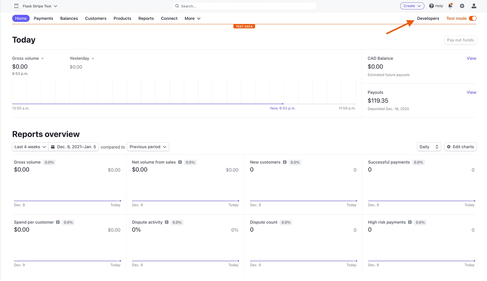
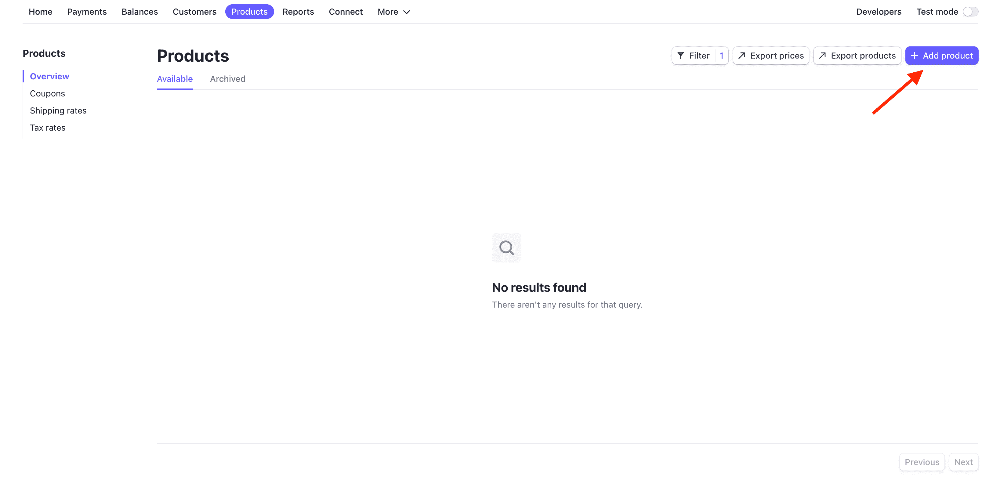
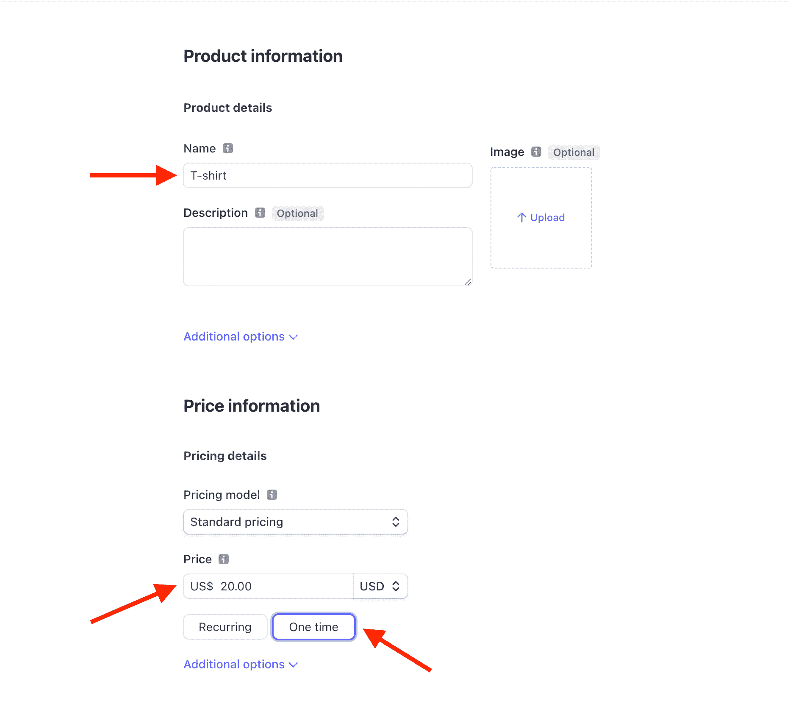
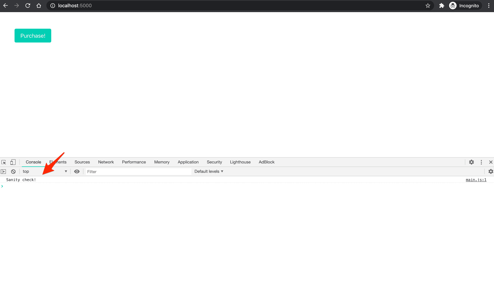
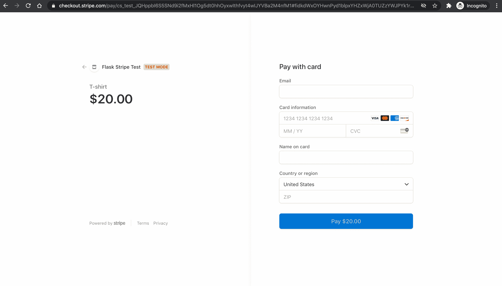
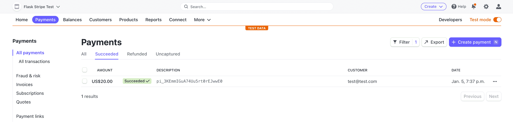

# 烧瓶条纹教程

> 原文：<https://testdriven.io/blog/flask-stripe-tutorial/>

本教程展示了如何将 [Stripe](https://stripe.com/) 添加到 Flask 应用程序中，以接受一次性付款。

> 需要处理订阅付款？查看[烧瓶条纹订阅](/blog/flask-stripe-subscriptions/)。

## 条纹支付策略

Stripe 目前有三种接受一次性付款的策略:

1.  [收费 API](https://stripe.com/docs/payments/charges-api) (遗留)
2.  [条纹检测](https://stripe.com/payments/checkout)(本教程的重点)
3.  [支付意向 API](https://stripe.com/docs/payments/payment-intents) (通常与[条纹元素](https://stripe.com/payments/elements)相结合)

你应该使用哪种策略？

1.  如果您想快速启动并运行，请使用条带检出。如果您已经使用了 Checkout 的旧的[模态版本](/static/images/blog/django/django-stripe/legacy_stripe_checkout.png)，并且正在寻找一种类似的方法，那么这是一条可行之路。它提供了许多开箱即用的强大功能，支持多种语言，甚至可以用于[定期支付](https://stripe.com/docs/payments/checkout/set-up-a-subscription)。最重要的是，Checkout 为您管理整个付款过程，因此您甚至无需添加任何表单就可以开始接受付款！
2.  如果您希望为最终用户定制付款体验，请使用付款意向 API(以及元素)。

> 收费 API 呢？
> 
> 1.  虽然您仍然可以使用 Charges API，但是如果您是 Stripe 的新手，请不要使用它，因为它不支持最新的银行法规(如 [SCA](https://stripe.com/docs/strong-customer-authentication) )。如果使用的话，你会看到很高的下降率。如需了解更多信息，请查看官方 Stripe 文档中的[费用与付款意向 API](https://stripe.com/docs/payments/payment-intents/migration/charges)页面。
> 2.  还在用收费 API？如果你的大多数客户都在美国或加拿大，你还不需要迁移。查看[结帐迁移指南](https://stripe.com/docs/payments/checkout/migration)指南了解更多信息。

## 初始设置

第一步是设置一个基本的 Python 环境并安装 Flask。

创建一个新的项目文件夹，创建并激活一个虚拟环境，并安装 Flask:

```
`$ mkdir flask-stripe-checkout && cd flask-stripe-checkout
$ python3.10 -m venv env
$ source env/bin/activate
(env)$ pip install flask` 
```

> 你可以随意把 virtualenv 和 Pip 换成诗歌[或](https://python-poetry.org) [Pipenv](https://github.com/pypa/pipenv) 。更多信息，请查看[现代 Python 环境](/blog/python-environments/)。

接下来，创建一个名为 *app.py* 的文件，并添加一个基本的“Hello World”应用程序的代码:

```
`# app.py

from flask import Flask, jsonify

app = Flask(__name__)

@app.route("/hello")
def hello_world():
    return jsonify("hello, world!")

if __name__ == "__main__":
    app.run()` 
```

启动服务器:

```
`(env)$ FLASK_ENV=development python app.py` 
```

你应该在你的浏览器中看到`"hello, world!"`在[http://127 . 0 . 0 . 1:5000/hello](http://127.0.0.1:5000/hello)。

## 添加条纹

条纹时间到了。从安装开始:

```
`(env)$ pip install stripe` 
```

接下来，[注册一个新的 Stripe 账户](https://dashboard.stripe.com/register)(如果你还没有的话)，然后导航到[仪表盘](https://dashboard.stripe.com/test/dashboard)。点击“开发者”:



然后在左侧栏中点击“API keys”:


每个 Stripe 帐户有四个 [API 密钥](https://stripe.com/docs/keys):两个用于测试，两个用于生产。每一对都有一个“秘密密钥”和一个“可公开密钥”。不要向任何人透露密钥；可发布的密钥将被嵌入到任何人都可以看到的页面上的 JavaScript 中。

目前右上角的“查看测试数据”开关表示我们正在使用测试键。这就是我们想要的。

将您的[测试 API 键](https://stripe.com/docs/keys#test-live-modes)存储为环境变量，如下所示:

```
`(env)$ export STRIPE_PUBLISHABLE_KEY=<YOUR_STRIPE_PUBLISHABLE_KEY>
(env)$ export STRIPE_SECRET_KEY=<YOUR_STRIPE_SECRET_KEY>` 
```

接下来，将条带密钥添加到您的应用程序中:

```
`# app.py

import os

import stripe
from flask import Flask, jsonify

app = Flask(__name__)

stripe_keys = {
    "secret_key": os.environ["STRIPE_SECRET_KEY"],
    "publishable_key": os.environ["STRIPE_PUBLISHABLE_KEY"],
}

stripe.api_key = stripe_keys["secret_key"]

@app.route("/hello")
def hello_world():
    return jsonify("hello, world!")

if __name__ == "__main__":
    app.run()` 
```

最后，您需要在[https://dashboard.stripe.com/settings/account](https://dashboard.stripe.com/settings/account)的“帐户设置”中指定一个“帐户名称”:


## 创造产品

接下来，我们需要创造一个产品来销售。

单击顶部导航栏中的“产品”，然后单击“添加产品”:



添加产品名称，输入价格，然后选择“一次性”:



点击“保存产品”。

有了 API 密钥和产品设置，我们现在可以开始添加 [Stripe Checkout](https://stripe.com/checkout) 来处理支付。

## 工作流程

在用户点击购买按钮后，我们需要做以下事情:

1.  获取可发布密钥

    *   从客户端向服务器发送 AJAX 请求，请求可发布的密钥
    *   用键回应
    *   使用键创建 Stripe.js 的新实例
2.  创建签出会话

    *   向服务器发送另一个 AJAX 请求，请求一个新的结帐会话 ID
    *   生成新的签出会话并发回 ID
    *   重定向到用户完成购买的结帐页面
3.  适当地重定向用户

    *   成功付款后重定向到成功页面
    *   取消付款后重定向到取消页面
4.  用条纹网钩确认付款

    *   设置 webhook 端点
    *   使用条带 CLI 测试端点
    *   用条带注册端点

## 获取可发布密钥

### JavaScript 静态文件

让我们首先创建一个新的静态文件来保存我们所有的 JavaScript。

添加一个名为“static”的新文件夹，然后向该文件夹添加一个名为 *main.js* 的新文件:

```
`// static/main.js console.log("Sanity check!");` 
```

接下来，向 *app.py* 添加一条新路线，该路线提供了一个【index.html】模板*:*

```
`# app.py

@app.route("/")
def index():
    return render_template("index.html")` 
```

确保也导入`render_template`:

```
`from flask import Flask, jsonify, render_template` 
```

对于模板，首先添加一个名为“templates”的新文件夹，然后添加一个名为*base.html*的基础模板，其中包含了提供 *main.js* 静态文件的脚本标签:

```
`<!-- templates/base.html -->

<!DOCTYPE html>
<html>
  <head>
    <meta charset="utf-8">
    <meta name="viewport" content="width=device-width, initial-scale=1">
    <title>Flask + Stripe Checkout</title>
    <link rel="stylesheet" href="https://cdn.jsdelivr.net/npm/[[email protected]](/cdn-cgi/l/email-protection)/css/bulma.min.css">
    <script src="{{ url_for('static', filename='main.js') }}"></script>
    <script defer src="https://use.fontawesome.com/releases/v5.14.0/js/all.js"></script>
  </head>
  <body>
    
  </body>
</html>` 
```

接下来，向名为*index.html*的新模板添加一个支付按钮:

```
`<!-- templates/index.html -->




  <section class="section">
    <div class="container">
      <button class="button is-primary" id="submitBtn">Purchase!</button>
    </div>
  </section>
` 
```

再次运行开发服务器:

```
`(env)$ FLASK_ENV=development python app.py` 
```

导航到 [http://127.0.0.1:5000](http://127.0.0.1:5000) ，打开 JavaScript 控制台。您应该看到健全性检查:



### 途径

接下来，向 *app.py* 添加一个新的路由来处理 AJAX 请求:

```
`# app.py

@app.route("/config")
def get_publishable_key():
    stripe_config = {"publicKey": stripe_keys["publishable_key"]}
    return jsonify(stripe_config)` 
```

### AJAX 请求

接下来，使用[获取 API](https://developer.mozilla.org/en-US/docs/Web/API/Fetch_API) 向 *static/main.js* 中的新`/config`端点发出 AJAX 请求:

```
`// static/main.js console.log("Sanity check!"); // new // Get Stripe publishable key fetch("/config") .then((result)  =>  {  return  result.json();  }) .then((data)  =>  { // Initialize Stripe.js const  stripe  =  Stripe(data.publicKey); });` 
```

来自`fetch`请求的响应是一个[可读流](https://developer.mozilla.org/en-US/docs/Web/API/ReadableStream)。`result.json()`返回一个承诺，我们将它解析为一个 JavaScript 对象——即`data`。然后我们使用点符号来访问`publicKey`以获得可发布的密钥。

将 [Stripe.js](https://stripe.com/docs/js) 包含在 *templates/base.html* 中，就像这样:

```
`<!-- templates/base.html -->

<!DOCTYPE html>
<html>
  <head>
    <meta charset="utf-8">
    <meta name="viewport" content="width=device-width, initial-scale=1">
    <title>Flask + Stripe Checkout</title>
    <link rel="stylesheet" href="https://cdn.jsdelivr.net/npm/[[email protected]](/cdn-cgi/l/email-protection)/css/bulma.min.css">
    <script src="https://js.stripe.com/v3/"></script>  <!-- new -->
    <script src="{{ url_for('static', filename='main.js') }}"></script>
    <script defer src="https://use.fontawesome.com/releases/v5.14.0/js/all.js"></script>
  </head>
  <body>
    
  </body>
</html>` 
```

现在，在页面加载之后，将调用`/config`，它将使用 Stripe publish key 进行响应。然后，我们将使用这个键创建 Stripe.js 的新实例。

工作流程:

1.  ~~获取可发布密钥~~

    *   ~~从客户端向服务器发送 AJAX 请求，请求可发布密钥~~
    *   ~~用~~键响应
    *   ~~使用键创建 Stripe.js 的新实例~~
2.  创建签出会话

    *   向服务器发送另一个 AJAX 请求，请求一个新的结帐会话 ID
    *   生成新的签出会话并发回 ID
    *   重定向到用户完成购买的结帐页面
3.  适当地重定向用户

    *   成功付款后重定向到成功页面
    *   取消付款后重定向到取消页面
4.  用条纹网钩确认付款

    *   设置 webhook 端点
    *   使用条带 CLI 测试端点
    *   用条带注册端点

## 创建签出会话

接下来，我们需要将一个事件处理程序附加到按钮的 click 事件，该事件将向服务器发送另一个 AJAX 请求，以生成一个新的结帐会话 ID。

### 途径

首先，添加新路由:

```
`# app.py

@app.route("/create-checkout-session")
def create_checkout_session():
    domain_url = "http://127.0.0.1:5000/"
    stripe.api_key = stripe_keys["secret_key"]

    try:
        # Create new Checkout Session for the order
        # Other optional params include:
        # [billing_address_collection] - to display billing address details on the page
        # [customer] - if you have an existing Stripe Customer ID
        # [payment_intent_data] - capture the payment later
        # [customer_email] - prefill the email input in the form
        # For full details see https://stripe.com/docs/api/checkout/sessions/create

        # ?session_id={CHECKOUT_SESSION_ID} means the redirect will have the session ID set as a query param
        checkout_session = stripe.checkout.Session.create(
            success_url=domain_url + "success?session_id={CHECKOUT_SESSION_ID}",
            cancel_url=domain_url + "cancelled",
            payment_method_types=["card"],
            mode="payment",
            line_items=[
                {
                    "name": "T-shirt",
                    "quantity": 1,
                    "currency": "usd",
                    "amount": "2000",
                }
            ]
        )
        return jsonify({"sessionId": checkout_session["id"]})
    except Exception as e:
        return jsonify(error=str(e)), 403` 
```

在这里，我们-

1.  定义了一个`domain_url`(用于重定向)
2.  将条带密钥分配给`stripe.api_key`(因此当我们请求创建新的结帐会话时，它将被自动发送)
3.  创建了签出会话
4.  在响应中发回了 ID

注意使用了`domain_url`的`success_url`和`cancel_url`。在成功支付或取消的情况下，用户将分别被重定向回这些 URL。我们将很快设立`/success`和`/cancelled`路线。

### AJAX 请求

将事件处理程序和后续 AJAX 请求添加到 *static/main.js* :

```
`// static/main.js console.log("Sanity check!"); // Get Stripe publishable key fetch("/config") .then((result)  =>  {  return  result.json();  }) .then((data)  =>  { // Initialize Stripe.js const  stripe  =  Stripe(data.publicKey); // new // Event handler document.querySelector("#submitBtn").addEventListener("click",  ()  =>  { // Get Checkout Session ID fetch("/create-checkout-session") .then((result)  =>  {  return  result.json();  }) .then((data)  =>  { console.log(data); // Redirect to Stripe Checkout return  stripe.redirectToCheckout({sessionId:  data.sessionId}) }) .then((res)  =>  { console.log(res); }); }); });` 
```

这里，在解析了`result.json()`承诺之后，我们调用了 [redirectToCheckout](https://stripe.com/docs/js/checkout/redirect_to_checkout) 方法，该方法带有来自已解析承诺的结帐会话 ID。

导航到 [http://127.0.0.1:5000](http://127.0.0.1:5000) 。点击按钮后，您将被重定向到 Stripe Checkout 实例(一个 Stripe 托管页面，用于安全收集支付信息),其中包含 t 恤产品信息:



我们可以使用 Stripe 提供的几个[测试卡号](https://stripe.com/docs/testing#cards)中的一个来测试表单。还是用`4242 4242 4242 4242`吧。

*   电子邮件:有效的电子邮件
*   卡号:`4242 4242 4242 4242`
*   到期日:未来的任何日期
*   CVC:任何三个数字
*   名称:任何东西
*   邮政编码:任意五个数字

如果一切顺利，付款应该被处理，但重定向将失败，因为我们还没有设置`/success` URL。

工作流程:

1.  ~~获取可发布密钥~~

    *   ~~从客户端向服务器发送 AJAX 请求，请求可发布密钥~~
    *   ~~用~~键响应
    *   ~~使用键创建 Stripe.js 的新实例~~
2.  ~~创建结账会话~~

    *   ~~向服务器发送另一个 AJAX 请求，请求一个新的结帐会话 ID~~
    *   ~~生成新的结账会话并发回 ID~~
    *   ~~重定向到用户完成购买的结账页面~~
3.  适当地重定向用户

    *   成功付款后重定向到成功页面
    *   取消付款后重定向到取消页面
4.  用条纹网钩确认付款

    *   设置 webhook 端点
    *   使用条带 CLI 测试端点
    *   用条带注册端点

## 适当地重定向用户

最后，让我们连接用于处理成功和取消重定向的模板和路由。

成功模板:

```
`<!-- templates/success.html -->




  <section class="section">
    <div class="container">
      <p>Your payment succeeded.</p>
    </div>
  </section>
` 
```

已取消的模板:

```
`<!-- templates/cancelled.html -->




  <section class="section">
    <div class="container">
      <p>Your payment was cancelled.</p>
    </div>
  </section>
` 
```

路线:

```
`# app.py

@app.route("/success")
def success():
    return render_template("success.html")

@app.route("/cancelled")
def cancelled():
    return render_template("cancelled.html")` 
```

回到 [http://127.0.0.1:5000](http://127.0.0.1:5000) ，点击支付按钮，再次使用信用卡号`4242 4242 4242 4242`以及其余的虚拟信用卡信息。提交付款。你应该被重定向回[http://127 . 0 . 0 . 1:5000/success](http://127.0.0.1:5000/success)。

要确认实际收费，请点击 Stripe 仪表盘上的“支付”返回:



回顾一下，我们使用密钥在服务器上创建一个惟一的签出会话 ID。这个 ID 随后被用来创建一个结帐实例，最终用户在点击支付按钮后被重定向到这个实例。收费发生后，他们会被重定向回成功页面。

一定要测试出一个被取消的付款。

工作流程:

1.  ~~获取可发布密钥~~

    *   ~~从客户端向服务器发送 AJAX 请求，请求可发布密钥~~
    *   ~~用~~键响应
    *   ~~使用键创建 Stripe.js 的新实例~~
2.  ~~创建结账会话~~

    *   ~~向服务器发送另一个 AJAX 请求，请求一个新的结帐会话 ID~~
    *   ~~生成新的结账会话并发回 ID~~
    *   ~~重定向到用户完成购买的结账页面~~
3.  ~~适当地重定向用户~~

    *   ~~支付成功后重定向至成功页面~~
    *   ~~取消付款后重定向至取消页面~~
4.  用条纹网钩确认付款

    *   设置 webhook 端点
    *   使用条带 CLI 测试端点
    *   用条带注册端点

## 用条纹网钩确认付款

我们的应用程序在这一点上工作得很好，但我们仍然不能以编程方式确认支付，或者在支付成功时运行一些代码。我们已经在用户结帐后将他们重定向到成功页面，但是我们不能只依赖那个页面，因为付款确认是异步发生的。

> Stripe 和一般编程中有两种类型的事件:同步事件，具有即时效果和结果(例如，创建一个客户)，异步事件，没有即时结果(例如，确认付款)。因为支付确认是异步完成的，用户可能会在他们的支付被确认之前*和*我们收到他们的资金之前*被重定向到成功页面。*

当支付完成时，获得通知的最简单的方法之一是使用回调或所谓的 [Stripe webhook](https://stripe.com/docs/webhooks) 。我们需要在应用程序中创建一个简单的端点，每当事件发生时(例如，当用户购买 T 恤衫时)，Stripe 就会调用这个端点。通过使用 webhooks，我们可以绝对肯定支付成功。

为了使用 webhooks，我们需要:

1.  设置 webhook 端点
2.  使用[条带 CLI](https://stripe.com/docs/stripe-cli) 测试端点
3.  用条带注册端点

> 这一部分由尼克·托马兹奇撰写。

### 端点

创建一个名为`stripe_webhook`的新路径，它会在每次支付成功时打印一条消息:

```
`# app.py

@app.route("/webhook", methods=["POST"])
def stripe_webhook():
    payload = request.get_data(as_text=True)
    sig_header = request.headers.get("Stripe-Signature")

    try:
        event = stripe.Webhook.construct_event(
            payload, sig_header, stripe_keys["endpoint_secret"]
        )

    except ValueError as e:
        # Invalid payload
        return "Invalid payload", 400
    except stripe.error.SignatureVerificationError as e:
        # Invalid signature
        return "Invalid signature", 400

    # Handle the checkout.session.completed event
    if event["type"] == "checkout.session.completed":
        print("Payment was successful.")
        # TODO: run some custom code here

    return "Success", 200` 
```

`stripe_webhook`现在作为我们的 webhook 端点。这里，我们只寻找每当结帐成功时调用的`checkout.session.completed`事件，但是您可以对其他[条带事件](https://stripe.com/docs/api/events)使用相同的模式。

确保将`request`导入添加到顶部:

```
`from flask import Flask, jsonify, render_template, request` 
```

### 测试 webhook

我们将使用 [Stripe CLI](https://stripe.com/docs/stripe-cli) 来测试 webhook。

一旦[下载并安装了](https://stripe.com/docs/stripe-cli#install)，在新的终端窗口中运行以下命令，登录到您的 Stripe 帐户:

此命令应生成一个配对代码:

```
`Your pairing code is: peach-loves-classy-cozy
This pairing code verifies your authentication with Stripe.
Press Enter to open the browser (^C to quit)` 
```

通过按 Enter，CLI 将打开您的默认 web 浏览器，并请求访问您的帐户信息的权限。请继续并允许访问。回到您的终端，您应该看到类似于以下内容的内容:

```
`> Done! The Stripe CLI is configured for Flask Stripe Test with account id acct_<ACCOUNT_ID>

Please note: this key will expire after 90 days, at which point you'll need to re-authenticate.` 
```

接下来，我们可以开始侦听条带事件，并使用以下命令将它们转发到我们的端点:

```
`$ stripe listen --forward-to 127.0.0.1:5000/webhook` 
```

这也将生成一个 webhook 签名密码:

```
`> Ready! Your webhook signing secret is whsec_xxxxxxxxxxxxxxxxxxxxxxxxxxxxxx (^C to quit)` 
```

为了初始化端点，将密码保存为另一个环境变量，如下所示:

```
`(env)$ export STRIPE_ENDPOINT_SECRET=<YOUR_STRIPE_ENDPOINT_SECRET>` 
```

接下来，像这样将它添加到`stripe_keys`字典中:

```
`# app.py

stripe_keys = {
    "secret_key": os.environ["STRIPE_SECRET_KEY"],
    "publishable_key": os.environ["STRIPE_PUBLISHABLE_KEY"],
    "endpoint_secret": os.environ["STRIPE_ENDPOINT_SECRET"], # new
}` 
```

Stripe 现在会将事件转发到我们的端点。要测试，通过`4242 4242 4242 4242`运行另一个测试支付。在您的终端中，您应该会看到`Payment was successful.`消息。

一旦完成，停止`stripe listen --forward-to 127.0.0.1:5000/webhook`过程。

> 如果您想识别进行购买的用户，可以使用 [client_reference_id](https://stripe.com/docs/api/checkout/sessions/object) 将某种用户标识符附加到条带会话。
> 
> 例如:
> 
> ```
> @app.route("/create-checkout-session")
> def create_checkout_session():
>     domain_url = "http://127.0.0.1:5000/"
>     stripe.api_key = stripe_keys["secret_key"]
>     try:
>         checkout_session = stripe.checkout.Session.create(
>             # new
>             client_reference_id=current_user.id if current_user.is_authenticated else None,
>             success_url=domain_url + "success?session_id={CHECKOUT_SESSION_ID}",
>             cancel_url=domain_url + "cancelled",
>             payment_method_types=["card"],
>             mode="payment",
>             line_items=[
>                 {
>                     "name": "T-shirt",
>                     "quantity": 1,
>                     "currency": "usd",
>                     "amount": "2000",
>                 }
>             ]
>         )
>         return jsonify({"sessionId": checkout_session["id"]})
>     except Exception as e:
>         return jsonify(error=str(e)), 403 
> ```

### 注册端点

最后，在部署你的应用程序后，你可以在 Stripe 仪表板中注册端点，在[开发者> Webhooks](https://dashboard.stripe.com/test/webhooks) 下。这将生成一个 webhook 签名密码，用于您的生产应用程序。

例如:


工作流程:

1.  ~~获取可发布密钥~~

    *   ~~从客户端向服务器发送 AJAX 请求，请求可发布密钥~~
    *   ~~用~~键响应
    *   ~~使用键创建 Stripe.js 的新实例~~
2.  ~~创建结账会话~~

    *   ~~向服务器发送另一个 AJAX 请求，请求一个新的结帐会话 ID~~
    *   ~~生成新的结账会话并发回 ID~~
    *   ~~重定向到用户完成购买的结账页面~~
3.  ~~适当地重定向用户~~

    *   ~~支付成功后重定向至成功页面~~
    *   ~~取消付款后重定向至取消页面~~
4.  ~~用条纹网钩确认付款~~

    *   ~~设置 webhook 端点~~
    *   ~~使用条带 CLI 测试端点~~
    *   ~~用条带注册端点~~

## 后续步骤

在生产中，你需要有 HTTPS，这样你的连接是安全的。您可能还想将`domain_url`存储为一个环境变量。最后，在创建结帐会话之前，最好确认在`/create-checkout-session`路线中使用了正确的产品和价格。为此，您可以:

1.  将您的每个产品添加到数据库中。
2.  然后，当您动态创建产品页面时，将产品数据库 ID 和价格存储在 purchase 按钮的数据属性中。
3.  更新`/create-checkout-session`路由以仅允许 POST 请求。
4.  更新 JavaScript 事件监听器，从数据属性中获取产品信息，并将它们与 AJAX POST 请求一起发送到`/create-checkout-session`路由。
5.  在创建结帐会话之前，解析路由处理程序中的 JSON 有效负载，并确认产品存在且价格正确。

干杯！

--

从 GitHub 上的[flask-strip-check out](https://github.com/testdrivenio/flask-stripe-checkout)repo 中抓取代码。