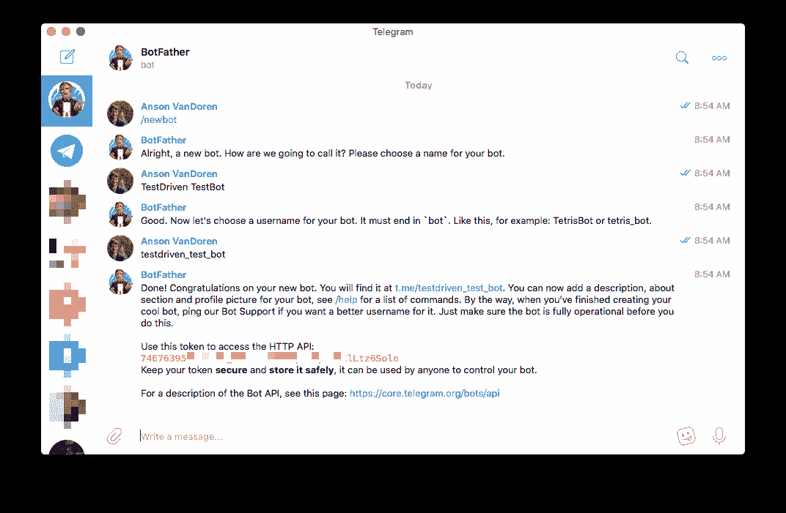
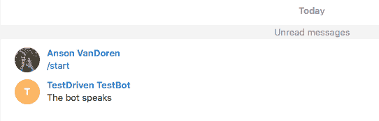
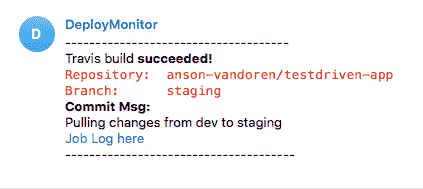

# 从 Travis CI 获取电报通知

> 原文：<https://testdriven.io/blog/getting-telegram-notifications-from-travis-ci/>

我最近在 [TestDriven.io](https://testdriven.io/) 上完成了关于 Docker、Flask 和 React 的[微服务课程，在课程进行到一半时，我开始有点不耐烦 Travis CI 花了多长时间来完成我的构建，以便我可以将新的 Docker 映像推送到 AWS 并继续下一步。当构建完成时，我需要一个通知，这样我就可以离开去做别的事情，而不是盯着构建日志等待它完成。Travis 自带了几个通知选项，但我想通过](https://testdriven.io/courses/microservices-with-docker-flask-and-react/)[电报](https://telegram.org)获得通知，这是不支持的，所以我决定推出自己的通知。

## 设置电报机器人

Telegram 提供了一个创建看起来相对容易使用的机器人的 API，所以我开始研究官方文档。第一步是创建一个专用的机器人，这实际上是通过 Telegram 应用程序本身，通过与“[机器人父亲](https://telegram.me/botfather)”进行交互来完成的。如果你一直跟着，我会假设你已经有一个电报帐户，所以点击 BotFather 链接应该会在你的聊天客户端打开一个新的对话。在那里，您可以键入`/start`来获得可能的命令列表。

键入`/newbot`将开始这个过程，首先要求显示名称(当从您的机器人获得消息时，您将看到这个名称)，然后是用户名。对于这个例子，我选择“TestDriven TestBot”作为显示名称，选择“testdriven_test_bot”作为用户名。请注意，您的用户名必须以“bot”的某种变体结尾，正如文档和 BotFather 所概述的那样。一旦完成，BotFather 会给你一个到你的新机器人的链接，以及一个 API 令牌(在这篇文章的其余部分我将把它称为`<TOKEN>`)，你会想把它保存在某个地方。



首先，这个机器人根本不做什么。在我点击对话链接之前，我从终端使用 [HTTPie](https://httpie.org/) 检查了状态(你可以使用 curl，或者浏览器，或者你喜欢的任何东西...我只是更喜欢 HTTPie 的格式化输出):

```
`# curl https://api.telegram.org/bot<TOKEN>/getUpdates
$ http https://api.telegram.org/bot<TOKEN>/getUpdates
HTTP/1.1 200 OK
Access-Control-Allow-Methods: GET, POST, OPTIONS
Access-Control-Allow-Origin: *
Access-Control-Expose-Headers: Content-Length,Content-Type,Date,Server,Connection
Connection: keep-alive
Content-Length: 23
Content-Type: application/json
Date: Thu, 28 Feb 2019 17:06:45 GMT
Server: nginx/1.12.2
Strict-Transport-Security: max-age=31536000; includeSubDomains; preload

{
    "ok": true,
    "result": []
}` 
```

> 如果你跟着做，一定要把`<TOKEN>`替换成你自己机器人的令牌，注意是`bot<TOKEN>`，而不仅仅是`<TOKEN>`。

上面的状态显示机器人还活着，但是没有任何当前对话。我点击了僵尸父亲消息中的链接([t.me/testdriven_test_bot](https://t.me/testdriven_test_bot))并开始了对话，然后再次检查了状态:

```
`# curl https://api.telegram.org/bot<TOKEN>/getUpdates
$ http https://api.telegram.org/bot<TOKEN>/getUpdates
HTTP/1.1 200 OK
...
{
    "ok": true,
    "result": [
        {
            "message": {
                "chat": {
                    "first_name": "Anson",
                    "id": 488404184,
                    "last_name": "VanDoren",
                },
                ...
        }
    ]
}` 
```

我刚刚开始的对话现在出现了，我需要对话 id(在本例中为`488404184`),下面我称之为`<CHAT_ID>`。现在我有了令牌和聊天 id，我将测试发送一条消息:

```
`# curl -s -X POST https://api.telegram.org/bot<TOKEN>/sendMessage \
#            -d chat_id=<CHAT_ID> \
#            -d text="The bot speaks"
$ http POST https://api.telegram.org/bot<TOKEN>/sendMessage \
       chat_id=<CHAT_ID> \
       text="The bot speaks"
HTTP/1.1 200 OK
...
{
    "ok": true,
    "result": {
        "chat": {
            "first_name": "Anson",
            "id": 488404184,
            "last_name": "VanDoren",
        },
        "date": 1551374658,
        "from": {
            "first_name": "TestDriven TestBot",
            "id": 746763956,
            "is_bot": true,
            "username": "testdriven_test_bot"
        },
        "message_id": 2,
        "text": "The bot speaks"
    }
}` 
```

看起来 API 很高兴，我也可以在我的 Telegram 客户端中看到发送的消息:



到目前为止，一切看起来都很好，所以现在是时候将它集成到 Travis 中了。

## 设置 Travis 环境变量

为了让 Travis 在构建完成时给我发送消息，我需要让它知道我的 Telegram API 令牌和聊天 ID。我不想在我的 *.travis.yml* 文件或我提交给公共回购的任何其他文件中包含任何一个，所以有两个选择，要么在构建脚本中加密它们，要么将它们设置为 travis 环境变量。关于这两个选项的更多信息可以在 [Travis 文档](https://docs.travis-ci.com/user/environment-variables/)中找到，但是因为我可以对所有的构建/阶段/版本使用相同的脚本，所以我选择了环境变量。

为了创建环境变量，我导航到我的 repo，点击“更多选项>设置”，然后向下滚动到“环境变量”部分。我添加了两个变量，`TELEGRAM_CHAT_ID`和`TELEGRAM_TOKEN`。这是我在上面使用的两个相同的变量，但是为了避免 Travis 设置中的歧义，我对它们进行了重命名。


## 修改构建脚本

接下来，我在我的 *.travis.yml* 文件中添加了一个`after_script`步骤。我可以很容易地直接在构建脚本文件本身中完成一个简单的通知，但是我想添加一些额外的细节。因此，我选择编写一个单独的 shell 脚本来封装它，然后在我的构建配置文件中引用该脚本:

```
`after_script: -  bash ./telegram_notification.sh` 
```

## 编写通知脚本

在我的项目根目录中，我创建了一个名为`telegram_notification.sh`的 bash 脚本:

```
`#!/bin/sh

# Get the token from Travis environment vars and build the bot URL:
BOT_URL="https://api.telegram.org/bot${TELEGRAM_TOKEN}/sendMessage"

# Set formatting for the message. Can be either "Markdown" or "HTML"
PARSE_MODE="Markdown"

# Use built-in Travis variables to check if all previous steps passed:
if [ $TRAVIS_TEST_RESULT -ne 0 ]; then
    build_status="failed"
else
    build_status="succeeded"
fi

# Define send message function. parse_mode can be changed to
# HTML, depending on how you want to format your message:
send_msg () {
    curl -s -X POST ${BOT_URL} -d chat_id=$TELEGRAM_CHAT_ID \
        -d text="$1" -d parse_mode=${PARSE_MODE}
}

# Send message to the bot with some pertinent details about the job
# Note that for Markdown, you need to escape any backtick (inline-code)
# characters, since they're reserved in bash
send_msg "
-------------------------------------
Travis build *${build_status}!*
\`Repository: ${TRAVIS_REPO_SLUG}\`
\`Branch: ${TRAVIS_BRANCH}\`
*Commit Msg:*
${TRAVIS_COMMIT_MESSAGE} [Job Log here](${TRAVIS_JOB_WEB_URL})
--------------------------------------
"` 
```

## 测试它

将您的更改提交到 *.travis.yml* 和新的 *telegram_notification.sh* 文件，推送到 Github，等待 travis 完成构建。



这就够了！您可以修改消息以适应您的需要和口味，Travis 有相当多的内置环境变量，如果您愿意，您可以将它们放入您的通知脚本中。为了方便起见，上面的脚本也可以作为 [GitHub gist](https://gist.github.com/anson-vandoren/1456275851ff8ec23daba164fed15f61#file-telegram_notification-sh) 使用。

一旦你建立并运行了你的机器人，将它混合到其他项目中也是非常容易的。我在跨几种不同的语言、框架和平台的几个不同的部署脚本中使用同一个 bot。在任何可以发出 HTTP 请求的地方，都可以通过 bot 触发通知！