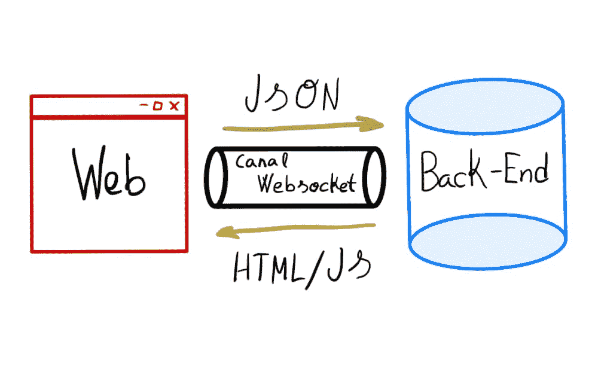
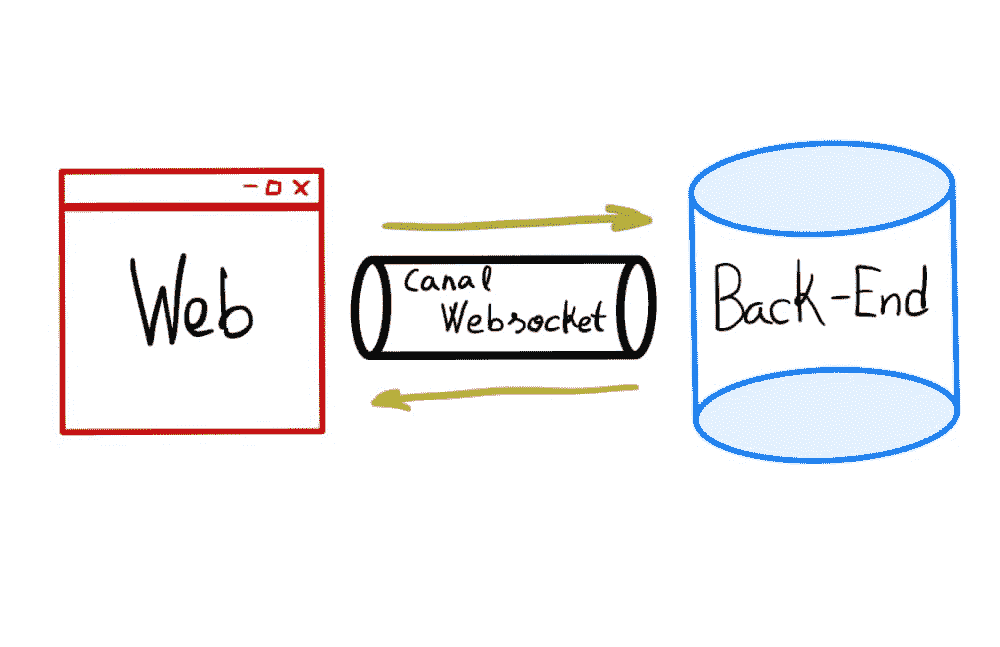
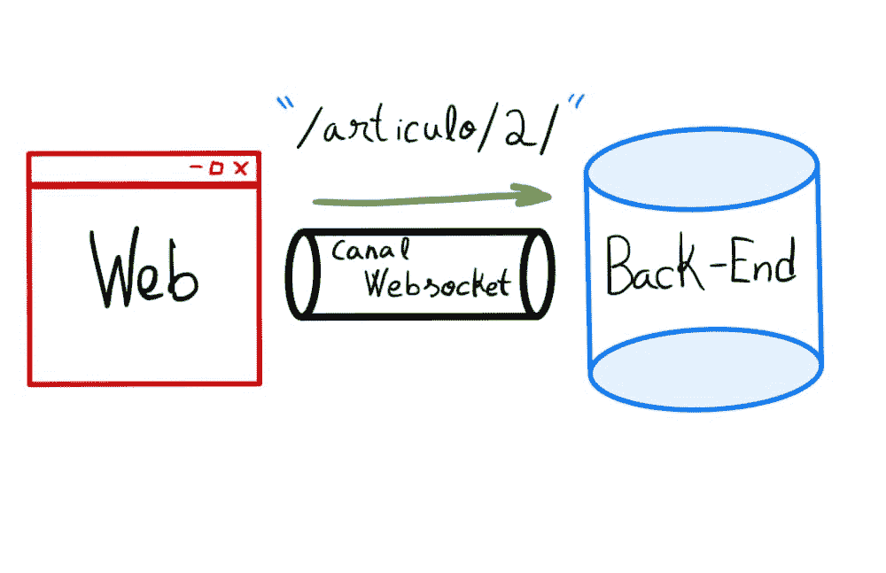
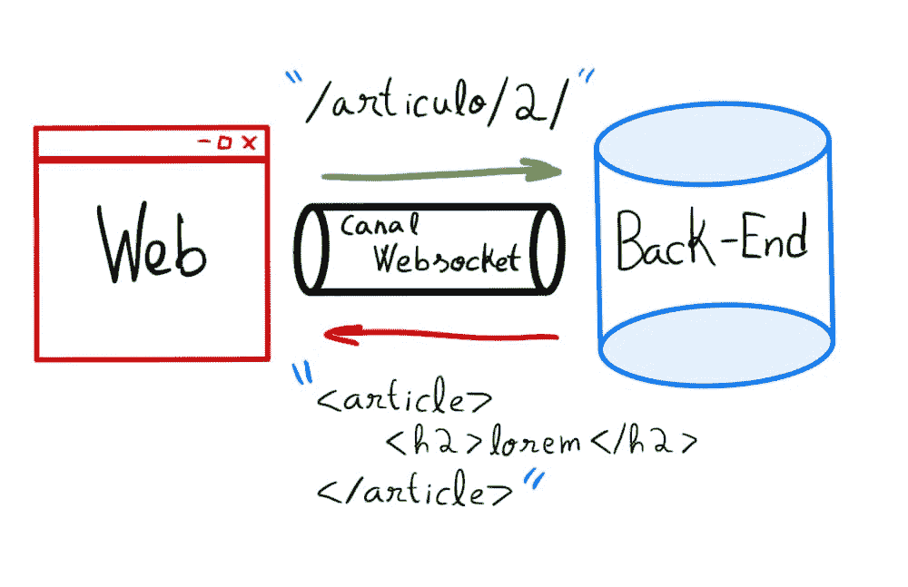

# 网络套接字上的超文本标记语言

> 原文：<https://testdriven.io/blog/html-over-websockets/>

本文着眼于实现单页面应用程序(SPA)的新方法——基于 WebSockets 的 HTML。

> 本文由[原文](https://programadorwebvalencia.com/html-sobre-websockets/)西班牙语版本翻译改编而成。

## 这是什么？

实现单页面应用程序(SPA)的传统方法是在后端和前端之间划分职责:

*   后端通过 JSON RESTful API 提供信息
*   前端通过 API 调用从后端异步获取数据

不幸的是，这种模式成本很高，需要两个专门的开发人员配置文件，并且由于您必须开发和维护两个不同的应用程序(通常使用两种不同的语言)，因此会减慢发布周期。这也使得快速原型制作和 SEO 变得困难。自 21 世纪初以来，这种模式一直占据主导地位。为了交付具有桌面应用外观和感觉的 web 应用，这是我们必须付出的代价。然而，这种情况正在开始改变，因为许多团队认识到收益不会超过成本，并且正在尝试交付 SPA 的新模式。一种开始流行的模式是通过 WebSocket 提供 HTML 而不是 JSON。

## 它是如何工作的？

[Chris MC cord](http://chrismccord.com/),[Phoenix](https://www.phoenixframework.org/)([Elixir](https://elixir-lang.org/)生态系统中最受欢迎的框架)的创建者，在 [ElixirConf 2019](https://www.youtube.com/watch?v=txk4WAlabvI) 上展示了一项名为 [LiveView](https://hexdocs.pm/phoenix_live_view/Phoenix.LiveView.html) 的技术，该技术通过 WebSockets 提供 HTML 服务。不久之后，他[演示了](https://www.phoenixframework.org/blog/build-a-real-time-twitter-clone-in-15-minutes-with-live-view-and-phoenix-1-5)如何在不使用 React、Angular 或 Vue 等客户端 JavaScript 框架的情况下，用 LiveView 在 15 分钟内构建一个实时 Twitter 克隆。他展示了从后端框架交付一个流畅的实时 UI 是可能的。这启发了其他开发人员使用其他语言和 web 框架创建自己的实现。

McCord 的解决方案是通过 WebSockets 将 HTML 而不是 JSON 发送到前端。这种方法不仅简化了开发，而且性能也得到了很好的提升，因为呈现逻辑由后端处理，前端不需要发出任何新的 HTTP 请求来获取新数据。

### 传统方法

同样，使用这种方法，浏览器首先从前端发出一个 HTTP 请求，获得一个带有原始的、预处理过的信息的 JSON 响应。然后前端负责处理信息并创建相应的 HTML。

### 基于 WebSockets 方法的 HTML

使用这种方法，浏览器或服务器可以开始工作，因为 WebSockets 提供双向通信。

### 例子

让我们看一个显示博客文章的快速例子。

1.  **连接**:我们从一个连接开始。WebSockets 支持客户端和服务器之间的双向通信，您只需建立一次。

    

2.  **组件请求**:客户端请求与`/article/2`路线相关联的特定文章的内容。

    

3.  **后端逻辑**:服务器为模板生成相关的 HTML、CSS、JavaScript，使用模板系统(比如 Jinja)，通过 WebSocket 通道返回模板片段。

    

4.  **更新 DOM** :最后前端用模板片段更新 DOM，显示博客文章。

## Django 演示

我用 [Django](https://www.djangoproject.com/) 创建了一个 HTML over WebSockets 方法的原型，它使用 [Django 通道](https://channels.readthedocs.io/en/stable/)来支持 WebSocket。这个应用程序本身相当简单。它只是一个有文章和评论的博客。也就是说，这是一个完整的 SPA，所以页面更改不需要页面刷新。

你可以在这里看到 WebSockets 的威力:

你可以在 [GitHub](https://github.com/tanrax/demo-HTML-over-WebSockets-in-Django) 上找到代码。

## 优点和缺点

好处:

1.  HTML 呈现/处理只发生在后端
2.  实时
3.  WebSockets 协议比 HTTP 快
4.  使用[慢速连接](https://browsee.io/blog/websocket-vs-http-calls-performance-study/)工作
5.  几乎不用任何 JavaScript 就能创建一个 SPA
6.  简单的搜索引擎优化

缺点:

1.  服务器需要更多的资源，因为您必须为每个客户端打开一个 WebSocket
2.  新生的生态系统——很少的框架、教程和文档

## 资源

您可以从以下资源开始:

1.  Web 软件的未来是 HTML-over-WebSockets
2.  [凤凰城现场直播](https://hexdocs.pm/phoenix_live_view/Phoenix.LiveView.html)
3.  Hotwire -通过网络发送 HTML 来构建现代网络应用
4.  反应器-Django 的实时视图库
5.  [sock puppet](https://github.com/jonathan-s/django-sockpuppet)——使用您已经了解并喜爱的 Django 工具构建反应式应用程序
6.  [Action Cable](https://guides.rubyonrails.org/action_cable_overview.html)——将 WebSockets 与你的 Ruby 和 Rails 应用程序的其余部分无缝集成
7.  用 Ruby 和 Rails 构建快速、可靠的实时应用

## 结论

虽然这种方法仍然很新，但值得一看。采用在增长，每个月都有越来越多的工具和例子出现。就我个人而言，我对它如此鲜为人知感到惊讶。我想这与 JavaScript 生态系统的强大有很大关系。