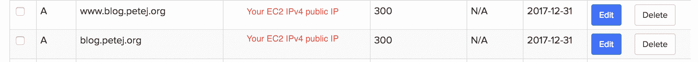

# 从 Heroku 迁移到 AWS

> 原文：<https://testdriven.io/blog/migrating-from-heroku-to-aws/>

在本教程中，我抓住了两个主要目标:

1.  给我的个人应用一个更专业的 UX
2.  将我的总体托管成本降低 50%

我一直在使用 Heroku 的[免费层](https://www.heroku.com/pricing)来提供演示应用和创建沙盒教程。这是一个很好的服务，易于使用且免费，但它在初始页面加载时会有很长的滞后时间(大约 7 秒)。以任何人的标准来看，这都是一段很长的时间。根据 akamai.com[和 kissmetrics](https://blog.kissmetrics.com/loading-time/?wide=1) 的说法，7 秒的加载时间，超过 25%的用户会在你的第一个 div 出现之前就放弃你的页面。我不想简单地升级到 Heroku 的付费等级，我想探索我的选择，并在这个过程中学习一些有用的技能。

更重要的是，我还有一个关于 [Ghost](https://ghost.org/) 的托管博客。这是一个非常好的平台，但是有点贵。幸运的是，他们提供了他们的开源软件，并提供了一个很好的使用 Node 和 MySQL 的教程。你只需要一个地方来托管它。

通过与我的托管博客分道扬镳，从一台服务器上提供多种资源，我可以为我的个人应用程序提供更好的 UX，同时节省一些钱。这篇文章组织了网上一些最好的教程来快速安全地完成这项工作。

这需要几种不同的技术协同工作来实现目标:

| 技术 | 目的 |
| --- | --- |
| EC2 | 提供廉价、可靠的云计算能力 |
| 人的本质 | 处理我们程序运行的操作系统 |
| 码头工人 | 隔离层提供一致的执行环境 |
| Nginx | 以可靠和安全的方式处理请求 |
| Certbot | 提供 SSL/HTTPS 安全的 web 应用程序，进而提高 SSO(搜索引擎优化) |
| 《人鬼情未了》 | 提供一个具有 GUI 和持久性的简单博客 |
| 反应 | 允许快速、可组合的 web 应用程序 |

### 目标

*   主办个人项目，投资组合网站，博客->便宜，没有加载滞后时间
*   熟悉 Nginx
*   服务 HTTPS 加密网站
*   Dockerize 反应

### 使用的技术

*   亚马逊 EC2
*   人的本质
*   Nginx
*   反应
*   让我们加密和认证(SSL)
*   码头工人
*   Ghost 博客平台

### 外卖食品

完成本教程后，您将能够:

*   设置 EC2 实例
*   设置 Nginx
*   用子域配置您的 DNS
*   在 EC2 实例上设置 Ghost 博客平台
*   对静态 React 应用程序进行 Dockerize
*   为静态站点服务
*   用加密和证书来配置 SSL

### 财务状况

**当前托管解决方案(无延迟时间)**

**自托管选项**

因此，对于一个托管解决方案，对于一个博客和一个应用程序，我每月将支付 26 美元，每个新应用程序每月将增加 7 美元。每年，每个额外的应用程序需要 312 美元+84 美元。通过这篇文章中概述的一些跑腿工作，我以每月不到 10 美元的费用托管了多个应用程序和一个博客。

我决定采用 AWS 解决方案。虽然它更贵，但它是一种超级受欢迎的企业技术，我想更加熟悉它。

### 谢谢

非常感谢所有参考资料的作者。这篇文章的大部分内容由链接和证明效果良好的资源片段组成，并包含了为满足我的需要而需要的细微修改。

也谢谢你的阅读。我们开始吧！

## EC2 设置

下面是如何创建一个新的 EC2 实例。

*资源*:【https://www.nginx.com/blog/setting-up-nginx】T2

您真正需要的是上面的教程，以便设置 EC2 实例和安装 Nginx。自从 Nginx 在 Ghost 博客平台安装期间安装后，我就停止了 EC2 的创建。

## 弹性 IP

*资源*:[https://docs . AWS . Amazon . com/AWS ec2/latest/user guide/elastic-IP-addresses-EIP . html](https://docs.aws.amazon.com/AWSEC2/latest/UserGuide/elastic-ip-addresses-eip.html)

接下来，您将把 DNS(域名系统)指向 EC2 实例的公共 IP 地址。这意味着您不希望它因为任何原因而改变(例如，停止和启动实例)。有两种方法可以实现这一点:

1.  激活 AWS 账户中的[默认 VPC](https://docs.aws.amazon.com/AmazonVPC/latest/UserGuide/default-vpc.html) (虚拟私有云)
2.  分配一个[弹性 IP 地址](https://docs.aws.amazon.com/AWSEC2/latest/UserGuide/elastic-ip-addresses-eip.html)

这两个选项都提供了一个免费的静态 IP 地址。在本教程中，我使用了弹性 IP 来实现这个目标，因为在设置好服务器之后，添加到服务器上真的很简单。

按照上述资源中的步骤创建一个弹性 IP 地址，并将其与您的 EC2 实例相关联。

## SSH 密钥

*资源*:[https://www . digital ocean . com/community/tutorials/initial-server-setup-with-Ubuntu-16-04](https://www.digitalocean.com/community/tutorials/initial-server-setup-with-ubuntu-16-04)

我跟随这个教程到了 T...非常有效。您将使用自己的 SSH 密钥设置自己的超级用户，并创建一个防火墙来限制传入流量，只允许 SSH。

一分钟后，您将为请求打开 HTTP 和 HTTPS。

## DNS 配置

我用 Name.com 的作为我的 DNS 主机，因为他们有一个不错的用户界面，并且在丹佛(我居住的地方)本地。我已经拥有了`petej.org`，并且一直指向一个 [github pages](https://pages.github.com/) 托管的静态站点。我决定为博客建立一个子域-[blog.petej.org](https://blog.petej.org)-使用 **A 记录**指向我的 EC2 实例的公共 IP 地址。我创建了两个 *A 记录*，一个处理`www`前缀，另一个处理空 URL:



现在通过命令行，使用`dig`实用程序来检查新的 A 记录是否正在工作。这可以从本地机器或 EC2 实例完成:

```
`$ dig A blog.petej.org

; <<>> DiG 9.9.7-P3 <<>> A blog.petej.org
;; global options: +cmd
;; Got answer:
;; ->>HEADER<<- opcode: QUERY, status: NOERROR, id: 44050
;; flags: qr rd ra; QUERY: 1, ANSWER: 1, AUTHORITY: 0, ADDITIONAL: 1

;; OPT PSEUDOSECTION:
; EDNS: version: 0, flags:; udp: 512
;; QUESTION SECTION:
;blog.petej.org.            IN  A

;; ANSWER SECTION:
blog.petej.org.     300 IN  A   35.153.44.46

;; Query time: 76 msec
;; SERVER: 75.75.75.75#53(75.75.75.75)
;; WHEN: Sat Jan 27 10:13:50 MST 2018
;; MSG SIZE  rcvd: 59` 
```

> **注意**:*A 记录*几乎立即生效，但可能需要一个小时来解决以前使用该 URL 时产生的缓存问题。所以，如果你已经设置好了域名，这可能需要一点时间。

Nice:域名- > √。现在您需要让 EC2 实例提供一些内容！

## Ghost 博客平台

*资源*:【https://docs.ghost.org/install/ubuntu/】T2

又一个很棒的教程。我一路跟着它，它是金色的。有些步骤我们已经在上面介绍过了，比如设置 Ubuntu 实例的最佳实践，所以你可以跳过这些步骤。确保从*更新包*部分开始(在*服务器设置*下)。

> **注意:**严格按照这个顺序进行设置。第一次，我忽略了为 MySQL 数据库设置用户，最后不得不从机器上移除 Ghost，重新安装，然后从头开始。

在逐步完成 Ghost 安装过程后，您现在应该有一个在您的域名下运行的博客了——在浏览器中查看一下吧！

## 中途回顾

你完成了什么？

*   Ubuntu 服务器启动并运行
*   SSH 访问我们的服务器
*   安装了 Ghost 平台
*   Nginx 处理传入流量
*   自主持博客，up！

### 那么下一步是什么？

您现在将:

1.  安装 git 并设置对 GitHub 帐户的 SSH 访问
2.  对静态 React 应用程序进行 Dockerize
3.  在 EC2 实例上设置 Docker
4.  配置 Nginx 反向代理层，将流量路由到 React 应用程序
5.  将 SSL 证书与您的博客和 react 应用程序相关联，以便可以在 HTTPS 提供这些证书

向前...

## 必须有饭桶

在 EC2 实例上安装 git:

```
`$ sudo apt-get install git` 
```

专门为 GitHub 访问创建一个新的 SSH 密钥:[https://help . GitHub . com/articles/generating-a-new-SSH-key-and-add-it-to-the-SSH-agent](https://help.github.com/articles/generating-a-new-ssh-key-and-adding-it-to-the-ssh-agent)

因为你之前为 Ubuntu 服务器设置了用户，所以*/根目录*和你的 *~目录*(用户的主目录)是不一样的。考虑到这一点，在`ssh-add`步骤中改为这样做:

```
`cp /root/.ssh/id_rsa ~/.ssh/id_rsa
cd ~/.ssh
ssh-add` 
```

复制输出并将其作为一个新的 SSH 密钥添加到 GitHub 中，详见下面的链接。

从**开始第二步**->[https://help . github . com/articles/add-a-new-ssh-key-to-your-github-account](https://help.github.com/articles/adding-a-new-ssh-key-to-your-github-account)

您已经设置好`git`。克隆，然后提交一个 repo，以确保一切都连接正确。

## 静态反应应用程序

*资源*:[https://medium . com/ai2-blog/dockerizing-a-react-application-3563688 a 2378](https://medium.com/ai2-blog/dockerizing-a-react-application-3563688a2378)

一旦你用 Docker 在本地运行了 React 应用程序，将图片上传到 Docker Hub :

你需要一个 Docker Hub 账户->[https://hub.docker.com](https://hub.docker.com)

```
`$ docker login
Username:
Password:` 
```

```
`$ docker tag <image-name> <username>/<image-name>:<tag-name>
$ docker push <username>/<image-name>` 
```

这需要一段时间。大约 5 分钟。咖啡时间...

我们回来了。继续登录 GitHub，确保你的图片已经上传。

现在回到您的 EC2 实例。嘘它。

安装 docker:

```
`$ sudo apt install docker.io` 
```

在本地拉下您最近上传的 Docker 图像:

```
`$ sudo docker pull <username>/<image-name>` 
```

获取图像 id 并使用它启动应用程序:

```
`$ sudo docker images
# Copy the image ID
$ sudo docker run -d -it -p 5000:5000 <image-id>` 
```

既然 React 应用程序已经运行，那么让我们通过设置 Nginx 配置来公开它。

## React 应用程序的 Nginx 设置

*资源*:[https://www . digital ocean . com/community/tutorials/how-to-install-nginx-on-Ubuntu-16-04](https://www.digitalocean.com/community/tutorials/how-to-install-nginx-on-ubuntu-16-04)

> **注意**:我没有像教程建议的那样使用*/etc/nginx/sites-available/default*，而是专门为 URL 制作了一个> *文件，完全不用理会默认文件。*

我们还需要建立一个符号链接:

```
`$ sudo ln -s /etc/nginx/sites-available/circle-grid.petej.org.conf /etc/nginx/sites-enabled/` 
```

> **注意**:为什么是符号链接？如你所见，如果你在 */etc/nginx/nginx.conf* 中查找，只有 */sites-enabled* 中的文件被考虑在内。符号链接将通过在 *sites_available* 文件中表示这个文件，使它能够被 Nginx 发现，来为我们处理这个问题。如果您以前使用过 Apache，您将会熟悉这种模式。您也可以像删除文件一样删除符号链接:`rm ./path/to/symlink`。

关于“符号链接”的更多信息:[http://man pages . Ubuntu . com/man pages/xenial/en/man 7/symlink . 7 . html](http://manpages.ubuntu.com/manpages/xenial/en/man7/symlink.7.html)

## 让我们用 Certbot 加密

*资源*:[https://www . digital ocean . com/community/tutorials/how-to-secure-nginx-with-let-s-encrypt-on-Ubuntu-16-04](https://www.digitalocean.com/community/tutorials/how-to-secure-nginx-with-let-s-encrypt-on-ubuntu-16-04)

现在，要确保 Certbot 配置了一个 cron 作业来自动续订您的证书，请运行以下命令:

如果有一个 *certbot* 文件在里面，你就可以开始了。

如果没有，请按照下列步骤操作:

1.  手动测试续订流程:

    `$ sudo certbot renew --dry-run`

2.  如果成功，则:

    `$ nano /etc/cron.d/certbot`

3.  将这一行添加到文件中:

    `0 */12 * * * root test -x /usr/bin/certbot -a \! -d /run/systemd/system && perl -e 'sleep int(rand(3600))' && certbot -q renew`

4.  省省吧，都搞定了。

现在，您已经将任务配置为每 12 小时运行一次，该任务将升级任何在 30 天内过期的证书。

## 结论

您现在应该能够:

*   设置 EC2 实例
*   设置 Nginx
*   用子域配置您的 DNS
*   搭建一个幽灵博客平台
*   将 React 应用程序归档
*   提供一个静态 React 应用程序
*   配置 SSL ->让我们加密和认证

我希望这是一个有用的链接和教程集合，可以帮助你使用个人应用服务器。如有任何问题或意见，请随时联系我。

**感谢阅读**。