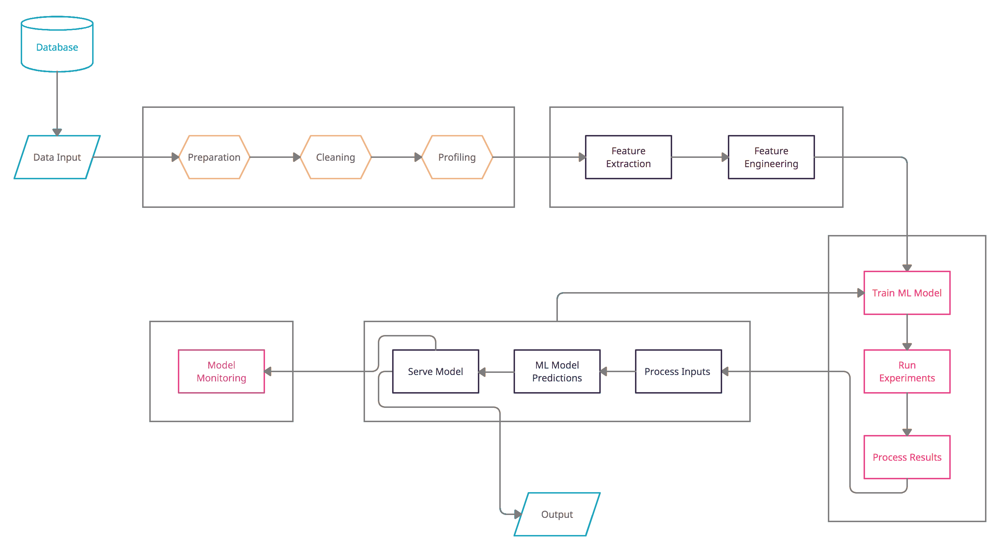

# MLOps 工具包

> 原文：<https://testdriven.io/blog/mlops/>

与通用应用编程相比，机器学习(ML)是一个相对较新的工作领域。现在，硬件和软件都存在，以支持大规模的 ML 项目，使公司更好地做出决策，技术领域已经出现了 ML 的工具和解决方案。这就产生了一个新的领域，叫做 MLOps。正如机器学习可靠性工程简介中所述，MLOps 将 DevOps 中的最佳实践——协作、版本控制、自动化测试、合规性、安全性和 CI/CD——应用于生产 ML。

考虑到这一点，在本文中，我们将回顾您开始 ML 开发所需的主要工具和技术，特别关注 MLOps 以及 MLOps 如何对[高效地生产 ML 模型](https://stackoverflow.blog/2020/10/12/how-to-put-machine-learning-models-into-production/)至关重要。

## ml 生命周期

尽管 MLOps 领域出现的时间不长，但是由于 ML 生命周期的复杂性，MLOps 的技术前景是广阔的。在本文中，我们将讨论 ML 开发中的以下主题:

1.  数据和特征管理
    *   数据存储
    *   数据准备
    *   数据探索
    *   专题报道
2.  模型开发
    *   模型注册表
    *   模型训练和验证
    *   版本控制
3.  操作化
    *   自动化测试
    *   持续集成、部署和培训(CI/CD/CT)
    *   模型服务基础设施
    *   可解释性
    *   再现性
4.  监视
    *   业务绩效监控
    *   模型监控
    *   技术/系统监控
    *   发信号
    *   自动再培训

记住这些主题，典型的 ML 生命周期由以下阶段、子阶段和组件组成:

> 请记住，上面介绍的 ML 生命周期是期望的生命周期。由于 MLOps 还不是一个成熟的领域，因此许多列出的组件在大多数生命周期中都没有使用。公司在构建和扩展他们的 ML 产品时，应该致力于完善他们的 ML 生命周期。

让我们更详细地看看每个阶段和组件以及相关的 MLOps 工具。

## 数据和特征管理

### 数据存储

ML 工程师消耗来自数据库、仓库和湖泊的数据。他们还直接使用来自第三方工具、API、电子表格、文本文件等等的数据。ML 工作通常包括在清理、旋转、丰富等之后存储多个版本的数据。为了保存 ML 开发过程中的中间步骤生成的数据，您可以使用下面列出的一个或多个数据存储:

| 数据存储 | 目的 | 例子 |
| --- | --- | --- |
| [数据库](https://db-engines.com/en/ranking) | 存储事务性和非事务性非分析性数据 | [关系型](https://db-engines.com/en/ranking/relational+dbms) ( [MySQL](https://www.mysql.com/) ， [Oracle](https://www.oracle.com/database/) ， [PostgreSQL](https://www.postgresql.org/) ， [MS SQL Server](https://hub.docker.com/_/microsoft-mssql-server) )，[非关系型](https://db-engines.com/en/ranking/key-value+store) ( [MongoDB](https://www.mongodb.com/cloud/atlas) ， [InfluxDB](https://www.influxdata.com/) ， [Cassandra](https://cassandra.apache.org/) ， [Elasticsearch](https://www.elastic.co/elasticsearch/) ， [CosmosDB](https://azure.microsoft.com/pricing/details/cosmos-db/) ，[nep](https://docs.aws.amazon.com/neptune/latest/userguide/intro.html) |
| [数据仓库](https://fivetran.com/blog/warehouse-benchmark) | 存储 [OLAP](https://www.ibm.com/cloud/learn/olap) 的分析数据 | [红移](https://aws.amazon.com/redshift/)，[雪花](https://www.snowflake.com/)，[火弩箭](https://www.firebolt.io/)， [Azure SQL DW](https://azure.microsoft.com/en-us/get-started/synapse-analytics/) ， [Teradata](https://www.teradata.co.uk/) |
| [数据湖](https://www.talend.com/resources/data-lake-vs-data-warehouse/) | 存储各种数据以供发现和下游交付 | [Azure Blob Storage](https://azure.microsoft.com/pricing/details/storage/blobs/) ，[亚马逊 S3](https://aws.amazon.com/s3/) |
| [流媒体](https://www.confluent.io/learn/data-streaming/) | 临时存储实时数据供消费者使用(发布/订阅，MQ) | [卡夫卡](https://kafka.apache.org/)， [AWS Kinesis](https://aws.amazon.com/kinesis/) ， [SQS](https://aws.amazon.com/sqs/) ， [RabbitMQ](https://www.rabbitmq.com/) ， [ZeroMQ](https://zeromq.org/) |
| [第三方集成](https://hbr.org/sponsored/2019/04/how-third-party-information-can-enhance-data-analytics) | 业务不可或缺的 SaaS 软件产品 | [Salesforce](https://www.salesforce.com/) ， [Pipedrive](https://www.pipedrive.com/) ， [SurveyMonkey](https://www.surveymonkey.com/) ， [Google Forms](https://www.google.com/forms/about/) |
| [API](https://ssbipolar.com/2020/08/05/dataflows-and-api-data-sources/) | 作为 API 公开的基于数据的服务或 SaaS 软件产品 | [谷歌地图 API](https://developers.google.com/maps/apis-by-platform) ，[比特币基地 API](https://developers.coinbase.com/) ，[雅虎财经 API](https://python-yahoofinance.readthedocs.io/en/latest/api.html) |
| 电子表格和平面文件 | 广泛使用的文件格式，因为易于操作和采用 | [微软 Excel](https://www.microsoft.com/microsoft-365/excel) ，[谷歌工作表](https://www.google.com/sheets/about/) |

### 数据准备

一旦收集了数据，下一步就是为消费做准备。这一步包括必要的数据重组、格式化和清理。接下来是勘探和分析，以及提高数据质量。有些工作可以完全手动完成，但其余的可以自动完成并内置到 ML 管道中。

### 数据探索

要连接到前面提到的数据源，您需要一种 ML 编程语言、一个编写程序的好的代码编辑器(或 IDE)以及专门为处理大量 ML 数据而构建的工具。有了它们，在开始开发 ML 模型时，您可以开始探索数据、编写 SQL 查询和构建 PySpark 转换。

| 资源类型 | 目的 | 例子 |
| --- | --- | --- |
| 语言 | 编写 ML 代码的框架 | [Python](https://www.python.org/) ， [Julia](https://julialang.org/) ， [R](https://www.r-project.org/) ， [Scala](https://www.scala-lang.org/) ， [Java](https://www.java.com/en/) |
| 5 月 | 集成开发环境丰富了工具、快捷方式和集成，有助于更快地编写和调试代码 | [VSCode](https://code.visualstudio.com/) ， [Atom](https://atom.io/) ， [Zeppelin](https://zeppelin.apache.org/) ， [Jupyter](https://jupyter.org/) ， [Databricks](https://docs.databricks.com/notebooks/index.html) ， [Floyd](https://www.floydhub.com/) ， [SageMaker](https://aws.amazon.com/sagemaker/) |
| 包转发率 | 利用分布式计算能力的大规模并行处理系统 | [Hadoop](https://hadoop.apache.org/) ， [Spark](https://spark.apache.org/) |
| 云平台 | AWS 和 GCP 等主要云提供商以及 DataRobot 等小众厂商为 ML 提供的基于云的产品 | [BigML](https://bigml.com/) ， [Azure ML](https://docs.microsoft.com/en-us/azure/machine-learning/overview-what-is-azure-ml) ，[大台库](https://www.dataiku.com/)， [H20](https://www.h2o.ai/) ， [DataRobot](https://www.datarobot.com/) |

使用这些工具中的两个或更多的组合，您将处于开始编写 ML 模型的最佳位置。我们将在这里讨论在哪里存储您准备输入到您的模型中的数据，以及您的 ML 模型的实际代码。

### 专题报道

在清理、准备和分析数据之后，您可以开始构建一个[特征库](https://www.tecton.ai/blog/what-is-a-feature-store/)，它是一个用于创建和训练 ML 模型的数据属性集合(通常是表格形式)。它可以在数据库、数据仓库、对象存储、本地实例等等中创建。

## 模型开发

### 模型注册表

创建 ML 模型是一个渐进的过程。核心思想是不断改进模型，这就是为什么 MLOps 增加了另一个关键的连续性支柱，称为[持续培训(CT)](https://cloud.google.com/solutions/machine-learning/mlops-continuous-delivery-and-automation-pipelines-in-machine-learning) 。除了持续集成(CI)和持续部署(CD)，持续培训是 ML 开发生命周期的核心。为了维护模型血统、源代码版本和注释，您可以使用模型注册中心。

模型注册中心由前面提到的所有信息和给定模型可用的所有其他信息组成。你可以使用像 [MLFlow model registry](https://www.mlflow.org/docs/latest/model-registry.html) 或者 [SageMaker model registry](https://docs.aws.amazon.com/sagemaker/latest/dg/model-registry.html) 这样的工具来存储关于你的模型的信息。

在 ML 流水线的每一步，一个组件做出决策；这些决定被传递到管道的下一步。ML 元数据存储帮助您存储和检索关于管道中不同步骤的元数据。元数据可以帮助您追溯所做的决策、所使用的超参数以及用于训练模型的数据。你可以使用像谷歌的 ML 元数据(MLMD)和 T2 的元数据(T3)组件这样的工具和库作为元数据存储。

### 模型训练和验证

您可以使用一个或多个数据探索部分的资源来定型和验证模型。例如，如果您选择用 Python 编写代码，您可以访问特定的 Python 库进行训练和验证，比如 TensorFlow、PyTorch、Theano、PySpark 等。

| 库名 | 因...闻名 | 语言 |
| --- | --- | --- |
| [TensorFlow](https://www.tensorflow.org/tutorials) | 大规模 ML 和神经网络部署 | Python，Java，JavaScript |
| [PySpark/Spark](https://datacamp-community-prod.s3.amazonaws.com/65076e3c-9df1-40d5-a0c2-36294d9a3ca9) | 大规模类似 SQL 的数据分析 | Python，Scala |
| [Keras](https://datacamp-community-prod.s3.amazonaws.com/94fc681d-5422-40cb-a129-2218e9522f17) | 深度学习，神经网络 | 计算机编程语言 |
| [Scikit-Learn](https://datacamp-community-prod.s3.amazonaws.com/5433fa18-9f43-44cc-b228-74672efcd116) | Python 的通用 ML 库 | 计算机编程语言 |
| [Brain.js](https://blog.logrocket.com/best-javascript-machine-learning-libraries-in-2021/) | 用于 ML 和神经网络的 JavaScript 库 | Java Script 语言 |
| mllib | 在 Spark 上运行 | Python，Scala |
| [OpenCV](https://opencv.org/) | 专门研究计算机视觉的 ML 和 AI 库 | Java、Python |

### 版本控制

源代码版本管理是任何软件开发中最关键的领域之一。它使团队能够在相同的代码上工作，因此每个人都可以同时对进度做出贡献。几十年前，Subversion、Mercurial 和 CVS 是主要的版本控制系统。现在，Git 是版本控制的事实上的标准。Git 是开源软件(OSS ),可以安装在服务器上。你也可以选择使用[一个基于云的服务](https://www.git-tower.com/blog/git-hosting-services-compared/)。以下是一些主要的问题:

#### ML 的专用源代码控制

您可能还想看看[数据版本控制](https://dvc.org/) (DVC)，这是另一个用于源代码控制的开源软件工具，专门为数据科学和 ML 项目开发。DVC 是 Git 兼容的，通过使用基于 DAG 的格式对完整的 ML 项目进行端到端的版本控制来支持 ML 开发。如果底层数据在 DAG 中的特定步骤之前没有变化，这有助于防止重复的数据处理。

虽然 Git 是为版本化应用程序代码而编写的，但它并不意味着存储 ML 模型使用的大量数据或支持 ML 管道。DVC 试图解决这两个问题。DVC 对存储层是不可知的，可以用于任何源代码控制服务，如 GitHub、GitLab 等。

## 操作化

### 自动化测试

正如在[机器学习可靠性工程介绍](/blog/machine-learning-reliability-engineering/)中提到的，有两种方法来测试 ML 模型:

1.  测试模型的**编码逻辑**
2.  测试模型的**输出/精度**

前者或多或少类似于测试软件应用程序，你应该以同样的方式自动化。然而，后者涉及测试模型置信度、重要模型度量的性能等。ML 测试通常以混合的方式进行，其中一些测试是自动化的，是流水线的一部分，而其他的则完全是手工的。

基于 ML 发展的阶段，测试可以分为两种不同的类型——培训前和培训后。

训练前测试不需要训练参数。这些测试可以检查(a)模型输出是否位于特定的预期范围内，以及(b)ML 模型的形状是否与数据集对齐。您可以手动执行其中的许多测试。

训练后的测试更有影响力，也更有意义，因为它们是在经过训练的模型工件上运行的，这意味着 ML 模型在运行测试之前已经完成了它的工作。这让我们对模型的行为有了更深入的了解。

测试是开发过程中不可或缺的一部分。您可以在 ML 开发工作流程的不同阶段进行不同类型的测试。下面列出了一些可能的测试:

| 测试类型 | 在哪里测试 | 目的 |
| --- | --- | --- |
| 单元测试 | 当地发展环境 | 即时反馈 |
| 集成测试 | 当地发展环境 | 捕捉再衰退 |
| 单元和集成测试 | 较低的非生产环境 | 代码升级 |
| 模型验证测试 | 较低的非生产环境 | 部分验证测试 |
| 端到端测试 | 非生产环境 | 系统健全性 |
| 模型验证测试 | 非生产环境 | 完成验证测试 |
| 端到端测试 | 生产前环境 | 系统健全，生产就绪 |
| 模型验证测试 | 生产前环境 | 完整的验证测试，准确性 |
| 模糊测试 | 生产前环境 | 系统可靠性 |
| A/B 测试 | 生产前环境 | 模型比较 |
| 监视 | 生产前和生产环境 | 实时反馈 |

### 持续集成、部署和培训(CI/CD/CT)

不像在软件应用程序中，应用程序生成的数据与应用程序工件分离，在 ML 开发中，训练数据在概念上是模型工件的一部分。没有训练，你不能测试模型的有效性或模型的良好性。这就是为什么通常的 CI/CD 过程在 ML 开发中通过添加另一个组成部分——持续培训而得到增强。代码集成和部署之后总是要进行培训。一旦模型被训练，循环继续。

### 模型服务基础设施

在创建您的 ML 模型之后，您必须决定在哪里部署您的模型——例如，您将使用哪个平台来服务您的 ML 模型。许多选项可用于从您的本地服务器提供模型。本地服务器可能适用于某些用例。对其他人来说，大规模管理可能会变得极其昂贵和困难。或者，你可以[使用一个或多个基于云的平台，比如 AWS、Azure 和 GCP，来服务你的模型](https://bugra.github.io/posts/2020/5/25/how-to-serve-model/)。

无论您使用本地服务器、云平台还是混合方法，您仍然可以选择将您的模型作为可执行文件直接部署到您的实例或容器中。存在许多试图解决端到端 ML 模型服务问题的 PaaS 产品。这通常是 ML 模型管道的最后一步。在此之后，像模型监控这样的部署后活动仍然存在。

一些常见的部署选项包括:

| 部署方式 | 部署在哪里 |
| --- | --- |
| 、[、](https://cloud.google.com/community/tutorials/kubernetes-ml-ops)、[、](https://knative.dev/)、[、](https://www.kubeflow.org/)、[【kfserving】](https://github.com/kubeflow/kfserving)、[【ml】、](https://angelml.ai/) | 任何地方 |
| [AWS Lambda](https://aws.amazon.com/blogs/compute/pay-as-you-go-machine-learning-inference-with-aws-lambda/) ， [AWS SageMaker](https://docs.aws.amazon.com/sagemaker/latest/dg/whatis.html) ， [AWS ECS](https://aws.amazon.com/blogs/machine-learning/deploy-deep-learning-models-on-amazon-ecs/) ， [AWS 弹性接口](https://aws.amazon.com/blogs/machine-learning/model-serving-with-amazon-elastic-inference/) | 自动警报系统 |
| [Azure 功能](https://docs.microsoft.com/en-us/azure/machine-learning/how-to-deploy-functions)， [Azure 容器实例](https://docs.microsoft.com/en-us/azure/machine-learning/v1/how-to-deploy-azure-container-instance) | 蔚蓝的 |
| [谷歌云运行](https://cloud.google.com/ai-platform/prediction/docs/deploying-models) | 谷歌 |

## 监视

监控模型涉及三个方面:

1.  **技术/系统**监控查看模型基础设施是否正常运行，以及模型是否得到正确服务。这包括通过跟踪服务级别指标来处理服务级别协议，并由[机器学习可靠性工程师](/blog/machine-learning-reliability-engineering/)来处理。
2.  **模型**监控同时通过其输出监控模型，将输出与实际输入数据进行比较。模型监控是通过检查假阳性和假阴性、精确度、召回率、F1 分数、R 平方、偏差等等来不断验证预测的准确性。
3.  有了**业务绩效**监控，一切都归结于模型是否对业务有帮助。你应该能够监控由不同团队运行的实验的影响。您应该监控在一个版本中推进的模型变更的影响，并将它们与先前的结果进行比较。

在高度发达的 MLOps 工作流程中，监控应该是主动的，而不是被动的。您不仅应该为基础设施相关的指标定义服务级别目标，还应该为模型相关的指标定义服务级别目标。对这些指标的严格监控意味着定义服务级别目标，并跟踪服务级别指标是否违反服务级别协议。这样做使您能够不断地调整和改进模型。这是 ML 工作流难题的最后一步。开发周期从这里开始重复。

### 发信号

现代系统如此复杂，以至于手动监控毫无意义。你需要软件来判断其他软件是否运行正常。您应该定义监控数据的规则，而不是手动浏览应用程序日志、决策树和建议日志。这些规则基于服务级别目标和服务级别协议。当违反规则条件时，您可以设置触发器。例如:

1.  向 PagerDuty 之类的寻呼机应用程序发送推送通知。
2.  在 Slack、Microsoft Teams 等协作通信工具中发送警报。
3.  发送电子邮件或短信。

发送警报的渠道取决于您用于管理生产问题的应用程序和流程。警报需要小心处理；否则，发送太多警报会让你的生活变得一团糟。穿过噪音很有挑战性。为了让你的警报系统正常工作，你需要做出有意识的、深思熟虑的选择。

### 自动再培训

ML 模型只有不断地被训练和再训练才能保持相关性。当有新的真实数据输入系统时，可以进行训练和再训练，并根据真实输出测试模型的预测。监控为警报引擎提供信息，但您也可以配置监控系统来为模型本身提供信息，从而在整个 ML 生命周期中创建一个反馈循环。这是 ML 模型可以得到的最有价值的反馈，因为反馈是在生产部署之后得到的。

根据数据模型的实现或项目的架构，许多新的范例，如 [AutoML](https://en.wikipedia.org/wiki/Automated_machine_learning) ，AutoAI，自调优系统变得非常重要。您可以从众多工具中选择一个适合您的需求，并找到一种有效的方法来重新训练您的模型。请记住，重新培训不会导致代码变化；它只向 ML 模型本身提供新的生产数据和 ML 的模型输出。

## 结论

本文研究了 MLOps 如何融入 ML 生命周期。我们还研究了在开发、部署和服务 ML 模型时需要了解和使用的各种工具。

> 更多工具和框架，请查看[牛逼的生产机器学习](https://github.com/EthicalML/awesome-production-machine-learning) repo。

在评估 MLOps 工具时，请记住大多数工具相对较新，因此几乎不存在端到端工作流。正因为如此，不要定居在单一平台。确保工具可以根据您的需求移入和移出。