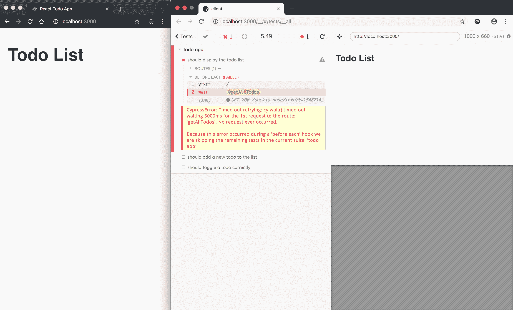
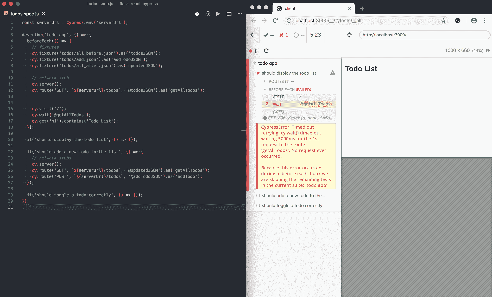
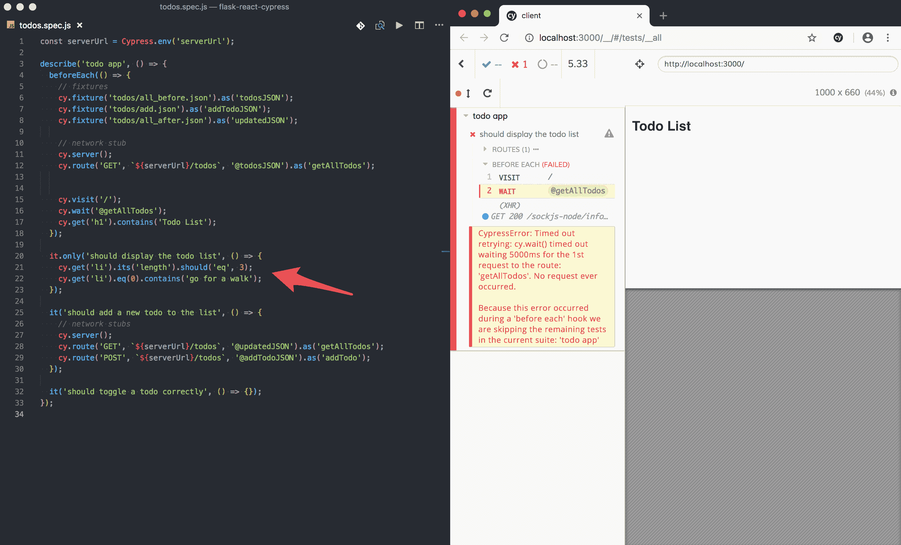
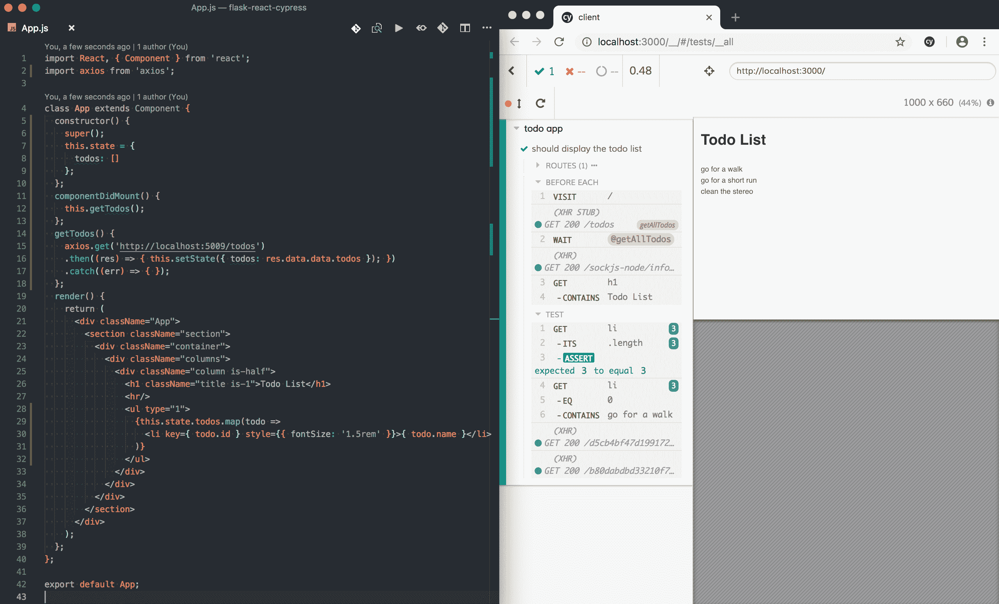
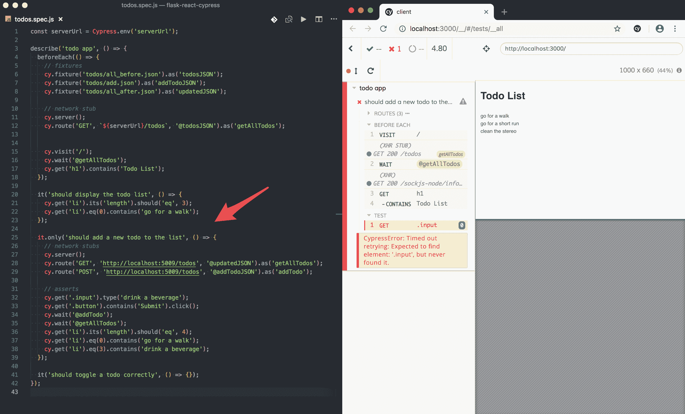
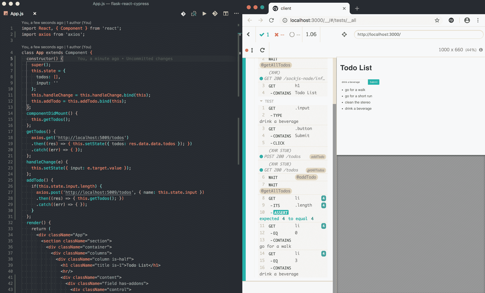
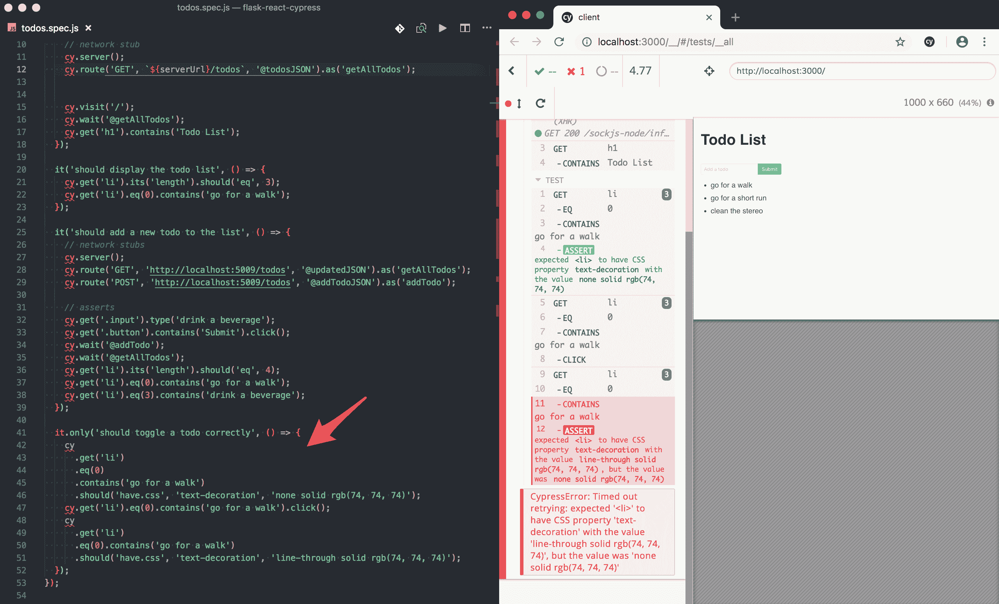
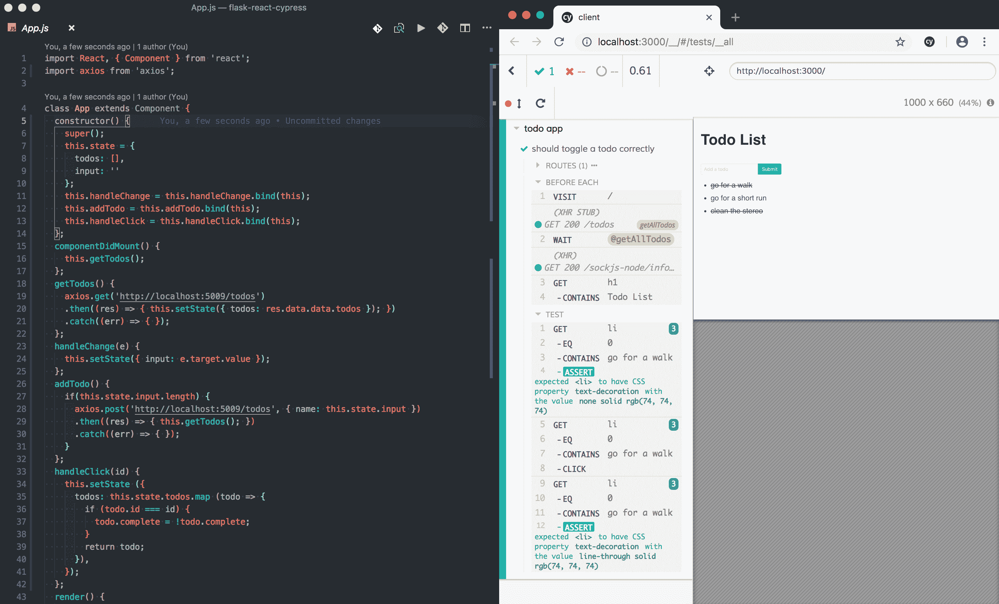
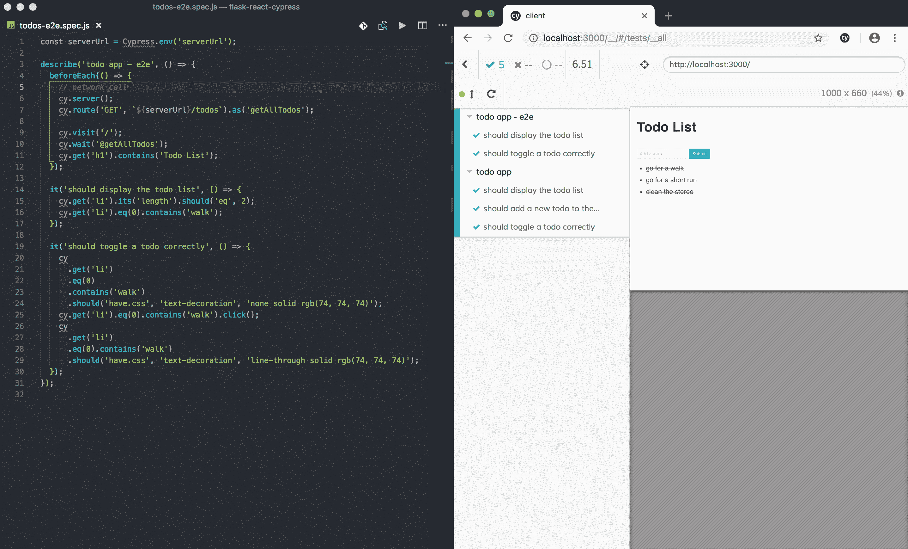

# 使用 Cypress 进行现代前端测试

> 原文：<https://testdriven.io/blog/modern-frontend-testing-with-cypress/>

Cypress 是一个现代的 web 自动化测试框架，旨在简化浏览器测试。虽然它以 Selenium 替代品而闻名，但它不仅仅是一个端到端的测试自动化工具。Cypress 是一个开发工具，是开发人员主动使用的，而不是专注于事后测试的非技术 QA 团队。

这篇文章着眼于当你用 Flask 和 React 构建一个应用程序时，如何将 Cypress 引入到你的测试驱动开发工作流中。

## 示例应用程序

我们将使用 Flask 和 React 构建一个基本的 todo 应用程序，基于以下用户案例:

1.  作为用户，我可以看到列表中的所有待办事项
2.  作为用户，我可以在列表中添加新的待办事项
3.  作为用户，我可以切换每个待办事项的完成状态

假设我们只关注客户端。换句话说，我们需要创建一个 React todo 应用程序，它通过 AJAX 与 Flask 后端交互，以获取和添加 todo。如果您想继续编码，克隆出 [flask-react-cypress](https://github.com/testdrivenio/flask-react-cypress) repo，然后将 [v1](https://github.com/testdrivenio/flask-react-cypress/releases/tag/v1) 标记签出到主分支:

```
`$ git clone https://github.com/testdrivenio/flask-react-cypress --branch v1 --single-branch
$ cd flask-react-cypress
$ git checkout tags/v1 -b master` 
```

## 工作流程

这个工作流程关注于集成测试，其中开发和测试使用类似 TDD 的方法同时进行:

1.  将用户故事、需求和验收标准转化为部分测试规范
2.  添加设备并切断网络呼叫
3.  运行 Cypress GUI，并在代码编辑器旁边打开它
4.  使用[。只需要](https://docs.cypress.io/guides/core-concepts/writing-and-organizing-tests.html#Excluding-and-Including-Tests)关注和迭代单个测试
5.  确保测试失败
6.  编码直到测试通过(红色、绿色、重构)
7.  重复前面的三个步骤，直到所有测试都是绿色的
8.  可选:通过删除网络存根将集成测试转换为端到端测试

想看看这个工作流程的运行情况吗？查看[我的 Cypress 工作流程](https://www.youtube.com/watch?v=5sXulBZe25Q)视频。

## 初始设置

步骤:

1.  将用户故事、需求和验收标准转化为部分测试规范
2.  添加设备并切断网络呼叫
3.  运行 Cypress GUI，并在代码编辑器旁边打开它

### 创建部分测试规格

将部分测试规范添加到名为*client/cypress/integration/todos . spec . js*的新文件中:

```
`describe('todo app',  ()  =>  { beforeEach(()  =>  { cy.visit('/'); cy.get('h1').contains('Todo List'); }); it('should display the todo list',  ()  =>  {}); it('should add a new todo to the list',  ()  =>  {}); it('should toggle a todo correctly',  ()  =>  {}); });` 
```

然后，在一个`env`键下添加`baseUrl`和`serverUrl`——服务器端 Flask 应用程序的 URL 这样它就可以作为一个环境变量被 *client/cypress.json* 访问:

```
`{ "baseUrl":  "http://localhost:3000", "env":  { "serverUrl":  "http://localhost:5009" } }` 
```

### 添加装置

在我们处理请求之前，让我们添加 fixture 文件，这些文件将用于模拟从以下服务器端端点返回的数据:

1.  获取-/待办事项-获取所有待办事项
2.  发布/待办事项-添加待办事项

*client/cypress/fixtures/todos/all _ before . JSON*:

```
`{ "data":  { "todos":  [ { "complete":  false, "created_date":  "Mon, 28 Jan 2019 15:32:28 GMT", "id":  1, "name":  "go for a walk" }, { "complete":  false, "created_date":  "Mon, 28 Jan 2019 15:32:28 GMT", "id":  2, "name":  "go for a short run" }, { "complete":  true, "created_date":  "Mon, 28 Jan 2019 15:32:28 GMT", "id":  3, "name":  "clean the stereo" } ] }, "status":  "success" }` 
```

*client/cypress/fixtures/todos/add . JSON*:

```
`{ "name":  "make coffee" }` 
```

这个最后的 fixture 是为了在添加一个新的 todo 后获取所有的 todo。

*client/cypress/fixtures/todos/all _ after . JSON*:

```
`{ "data":  { "todos":  [ { "complete":  false, "created_date":  "Mon, 28 Jan 2019 15:32:28 GMT", "id":  1, "name":  "go for a walk" }, { "complete":  false, "created_date":  "Mon, 28 Jan 2019 15:32:28 GMT", "id":  2, "name":  "go for a short run" }, { "complete":  true, "created_date":  "Mon, 28 Jan 2019 15:32:28 GMT", "id":  3, "name":  "clean the stereo" }, { "complete":  false, "created_date":  "Mon, 28 Jan 2019 17:22:35 GMT", "id":  4, "name":  "drink a beverage" } ] }, "status":  "success" }` 
```

然后，将[夹具](https://docs.cypress.io/guides/guides/network-requests.html#Fixtures)添加到测试规范中的`beforeEach`中:

```
`beforeEach(()  =>  { // fixtures cy.fixture('todos/all_before.json').as('todosJSON'); cy.fixture('todos/add.json').as('addTodoJSON'); cy.fixture('todos/all_after.json').as('updatedJSON'); cy.visit('/'); cy.get('h1').contains('Todo List'); });` 
```

### 存根网络呼叫

再次更新`beforeEach`，添加一个[存根](https://docs.cypress.io/guides/guides/network-requests.html#Stubbing)和一个显式[等待](https://docs.cypress.io/guides/guides/network-requests.html#Waiting):

```
`beforeEach(()  =>  { // fixtures cy.fixture('todos/all_before.json').as('todosJSON'); cy.fixture('todos/add.json').as('addTodoJSON'); cy.fixture('todos/all_after.json').as('updatedJSON'); // network stub cy.server(); cy.route('GET',  `${serverUrl}/todos`,  '@todosJSON').as('getAllTodos'); cy.visit('/'); cy.wait('@getAllTodos'); cy.get('h1').contains('Todo List'); });` 
```

将环境变量`serverUrl`的值赋给一个变量:

```
`const  serverUrl  =  Cypress.env('serverUrl');` 
```

向`should add a new todo to the list`测试添加存根:

```
`it('should add a new todo to the list',  ()  =>  { // network stubs cy.server(); cy.route('GET',  `${serverUrl}/todos`,  '@updatedJSON').as('getAllTodos'); cy.route('POST',  `${serverUrl}/todos`,  '@addTodoJSON').as('addTodo'); });` 
```

### 开放的柏树

在一个终端窗口中运行 React 应用:

```
`$ cd client
$ npm install
$ npm start` 
```

然后，在不同的窗口中打开 Cypress GUI:

```
`$ cd client
$ ./node_modules/.bin/cypress open` 
```





## 发展

步骤:

1.  使用[。只需要](https://docs.cypress.io/guides/core-concepts/writing-and-organizing-tests.html#Excluding-and-Including-Tests)关注和迭代单个测试
2.  确保测试失败
3.  编码直到测试通过(红色、绿色、重构)
4.  重复前面的三个步骤，直到所有测试都是绿色的

### 显示所有待办事项

更新测试:

```
`it.only('should display the todo list',  ()  =>  { cy.get('li').its('length').should('eq',  3); cy.get('li').eq(0).contains('go for a walk'); });` 
```



然后，更新`App`组件:

```
`import React, { Component } from 'react';
import axios from 'axios';

class App extends Component {
  constructor() {
    super();
    this.state = {
      todos: []
    };
  };
  componentDidMount() {
    this.getTodos();
  };
  getTodos() {
    axios.get('http://localhost:5009/todos')
    .then((res) => { this.setState({ todos: res.data.data.todos }); })
    .catch((err) => { });
  };
  render() {
    return (
      <div className="App">
        <section className="section">
          <div className="container">
            <div className="columns">
              <div className="column is-half">
                <h1 className="title is-1">Todo List</h1>
                <hr/>
                <ul type="1">
                  {this.state.todos.map(todo =>
                    <li key={ todo.id } style={{ fontSize: '1.5rem' }}>{ todo.name }</li>
                  )}
                </ul>
              </div>
            </div>
          </div>
        </section>
      </div>
    );
  };
};

export default App;` 
```

在`componentDidMount`中，一个 AJAX 请求被发送到服务器端以获取所有的 todos。当响应返回时，在成功处理程序中调用`setState`，该处理程序重新呈现组件，显示 todo 列表。

测试现在应该通过了:



### 添加待办事项

从通过的测试中删除`.only`，并更新下一个测试:

```
`it.only('should add a new todo to the list',  ()  =>  { // network stubs cy.server(); cy.route('GET',  'http://localhost:5009/todos',  '@updatedJSON').as('getAllTodos'); cy.route('POST',  'http://localhost:5009/todos',  '@addTodoJSON').as('addTodo'); // asserts cy.get('.input').type('drink a beverage'); cy.get('.button').contains('Submit').click(); cy.wait('@addTodo'); cy.wait('@getAllTodos'); cy.get('li').its('length').should('eq',  4); cy.get('li').eq(0).contains('go for a walk'); cy.get('li').eq(3).contains('drink a beverage'); });` 
```



再次更新组件:

```
`import React, { Component } from 'react';
import axios from 'axios';

class App extends Component {
  constructor() {
    super();
    this.state = {
      todos: [],
      input: ''
    };
    this.handleChange = this.handleChange.bind(this);
    this.addTodo = this.addTodo.bind(this);
  };
  componentDidMount() {
    this.getTodos();
  };
  getTodos() {
    axios.get('http://localhost:5009/todos')
    .then((res) => { this.setState({ todos: res.data.data.todos }); })
    .catch((err) => { });
  };
  handleChange(e) {
    this.setState({ input: e.target.value });
  };
  addTodo() {
    if(this.state.input.length) {
      axios.post('http://localhost:5009/todos', { name: this.state.input })
      .then((res) => { this.getTodos(); })
      .catch((err) => { });
    }
  };
  render() {
    return (
      <div className="App">
        <section className="section">
          <div className="container">
            <div className="columns">
              <div className="column is-half">
                <h1 className="title is-1">Todo List</h1>
                <hr/>
                <div className="content">
                  <div className="field has-addons">
                    <div className="control">
                      <input
                        className="input"
                        type="text"
                        placeholder="Add a todo"
                        onChange={ this.handleChange }
                      />
                    </div>
                    <div className="control" onClick={ this.addTodo }>
                      <button className="button is-info">Submit</button>
                    </div>
                  </div>
                  <ul type="1">
                    {this.state.todos.map(todo =>
                      <li key={ todo.id } style={{ fontSize: '1.5rem' }}>{ todo.name }</li>
                    )}
                  </ul>
                </div>
              </div>
            </div>
          </div>
        </section>
      </div>
    );
  };
};

export default App;` 
```

现在可以通过输入字段添加待办事项。每当输入值改变时，触发`onChange`事件，更新状态。单击 submit 按钮后，AJAX POST 请求和输入字段中的值一起被发送到服务器。当返回成功的响应时，todo 列表被更新。



### 切换完成状态

测试:

```
`it.only('should toggle a todo correctly',  ()  =>  { cy .get('li') .eq(0) .contains('go for a walk') .should('have.css',  'text-decoration',  'none solid rgb(74, 74, 74)'); cy.get('li').eq(0).contains('go for a walk').click(); cy .get('li') .eq(0).contains('go for a walk') .should('have.css',  'text-decoration',  'line-through solid rgb(74, 74, 74)'); });` 
```



组件:

```
`import React, { Component } from 'react';
import axios from 'axios';

class App extends Component {
  constructor() {
    super();
    this.state = {
      todos: [],
      input: ''
    };
    this.handleChange = this.handleChange.bind(this);
    this.addTodo = this.addTodo.bind(this);
    this.handleClick = this.handleClick.bind(this);
  };
  componentDidMount() {
    this.getTodos();
  };
  getTodos() {
    axios.get('http://localhost:5009/todos')
    .then((res) => { this.setState({ todos: res.data.data.todos }); })
    .catch((err) => { });
  };
  handleChange(e) {
    this.setState({ input: e.target.value });
  };
  addTodo() {
    if(this.state.input.length) {
      axios.post('http://localhost:5009/todos', { name: this.state.input })
      .then((res) => { this.getTodos(); })
      .catch((err) => { });
    }
  };
  handleClick(id) {
    this.setState ({
      todos: this.state.todos.map (todo => {
        if (todo.id === id) {
          todo.complete = !todo.complete;
        }
        return todo;
      }),
    });
  };
  render() {
    return (
      <div className="App">
        <section className="section">
          <div className="container">
            <div className="columns">
              <div className="column is-half">
                <h1 className="title is-1">Todo List</h1>
                <hr/>
                <div className="content">
                  <div className="field has-addons">
                    <div className="control">
                      <input
                        className="input"
                        type="text"
                        placeholder="Add a todo"
                        onChange={ this.handleChange }
                      />
                    </div>
                    <div className="control" onClick={ this.addTodo }>
                      <button className="button is-info">Submit</button>
                    </div>
                  </div>
                  <ul type="1">
                    {this.state.todos.map(todo =>
                      <li
                        key={ todo.id }
                        style={{
                          textDecoration: todo.complete ? 'line-through' : 'none',
                          fontSize: '1.5rem',
                        }}
                        onClick={() => this.handleClick(todo.id)}
                      >
                        { todo.name }
                      </li>
                    )}
                  </ul>
                </div>
              </div>
            </div>
          </div>
        </section>
      </div>
    );
  };
};

export default App;` 
```

当 todo `li`被点击时，`handleClick`被触发，然后切换`todo.complete`布尔值的值。如果布尔值为`true`，那么待办事项的`text-direction`将被设置为`line-through`。



从最终测试中移除`.only`。

## 端到端测试

最后，让我们通过移除网络存根和设备，将集成测试转换为端到端测试。我们也会做一些重构。

*client/cypress/integration/todos-e2e . spec . js*:

```
`const  serverUrl  =  Cypress.env('serverUrl'); describe('todo app - e2e',  ()  =>  { beforeEach(()  =>  { // network call cy.server(); cy.route('GET',  `${serverUrl}/todos`).as('getAllTodos'); cy.visit('/'); cy.wait('@getAllTodos'); cy.get('h1').contains('Todo List'); }); it('should display the todo list',  ()  =>  { cy.get('li').its('length').should('eq',  2); cy.get('li').eq(0).contains('walk'); }); it('should toggle a todo correctly',  ()  =>  { cy .get('li') .eq(0) .contains('walk') .should('have.css',  'text-decoration',  'none solid rgb(74, 74, 74)'); cy.get('li').eq(0).contains('walk').click(); cy .get('li') .eq(0).contains('walk') .should('have.css',  'text-decoration',  'line-through solid rgb(74, 74, 74)'); }); });` 
```

在运行这些之前，您需要启动服务器端的 Flask 应用程序和 Postgres，并创建和播种数据库:

```
`$ cd server
$ docker-compose up -d --build
$ docker-compose exec web python manage.py recreate_db
$ docker-compose exec web python manage.py seed_db` 
```



现在，由于完整的端到端测试需要运行 Flask 应用程序，您可能不希望在开发时在本地运行它们。要忽略它们，将`ignoreTestFiles` [配置变量](https://docs.cypress.io/guides/references/configuration.html#Global)添加到 *cypress.json* 文件中:

```
`{ "baseUrl":  "http://localhost:3000", "env":  { "serverUrl":  "http://localhost:5009" }, "ignoreTestFiles":  "*e2e*" }` 
```

然后，您可以通过使用不同的配置文件在其他环境中运行它们。

## 结论

Cypress 是一个强大的工具，它使设置、编写、运行和调试测试变得容易。希望这篇文章向您展示了将 Cypress 整合到您的开发工作流中是多么容易。

资源:

1.  [最终代码](https://github.com/testdrivenio/flask-react-cypress)
2.  [我的柏树工作流程](https://www.youtube.com/watch?v=5sXulBZe25Q)视频
3.  [柏树助你获得更好的睡眠](https://mherman.org/presentations/cypress/)幻灯片
4.  [滑下测试金字塔](https://www.cypress.io/blog/2018/04/02/sliding-down-the-testing-pyramid)博文