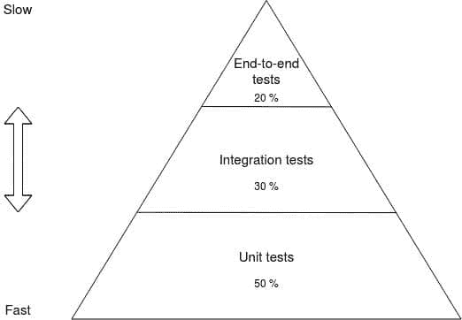

# Python 中的现代测试驱动开发

> 原文：<https://testdriven.io/blog/modern-tdd/>

测试产品级代码很难。有时候，在特性开发过程中，它会占用你几乎所有的时间。更重要的是，即使你有 100%的覆盖率并且测试是绿色的，你仍然不能确信新的特性将在生产中正常工作。

本指南将带你通过使用[测试驱动开发](/test-driven-development/) (TDD)来开发应用程序。我们将看看您应该如何测试以及测试什么。我们将使用 [pytest](https://docs.pytest.org/) 进行测试，使用 [pydantic](https://pydantic-docs.helpmanual.io/) 验证数据并减少所需的测试数量，使用 [Flask](https://flask.palletsprojects.com/) 通过 RESTful API 为我们的客户提供接口。最后，您将拥有一个可以用于任何 Python 项目的可靠模式，这样您就可以相信通过测试实际上意味着软件可以工作。

> [完整 Python](/guides/complete-python/) 指南:
> 
> 1.  [现代 Python 环境——依赖性和工作空间管理](/blog/python-environments/)
> 2.  [Python 中的测试](/blog/testing-python/)
> 3.  [Python 中的现代测试驱动开发](/blog/modern-tdd/)(本文！)
> 4.  [Python 代码质量](/blog/python-code-quality/)
> 5.  [Python 类型检查](/blog/python-type-checking/)
> 6.  [记录 Python 代码和项目](/blog/documenting-python/)
> 7.  [Python 项目工作流程](/blog/python-project-workflow/)

## 目标

完成本文后，您将能够:

1.  解释你应该如何测试你的软件
2.  配置 pytest 并为测试设置一个项目结构
3.  用迂腐定义数据库模型
4.  使用 pytest fixtures 来管理测试状态和执行副作用
5.  根据 JSON 模式定义验证 JSON 响应
6.  用命令(修改状态，有副作用)和查询(只读，无副作用)组织数据库操作
7.  使用 pytest 编写单元、集成和端到端测试
8.  解释为什么将测试工作集中在测试行为上而不是实现细节上很重要

## 我应该如何测试我的软件？

软件开发人员往往对测试非常固执己见。正因为如此，他们对测试的重要性和如何进行测试有不同的看法。也就是说，让我们看看三条指导方针,(希望)大多数开发人员都会同意，它们将帮助您编写有价值的测试:

1.  测试应该告诉你被测单元的预期行为。因此，建议保持简短和切题。[给定，WHEN，THEN](https://martinfowler.com/bliki/GivenWhenThen.html) 结构可以对此有所帮助:

    *   假设-测试的初始条件是什么？
    *   什么时候发生了什么需要测试？
    *   那么，预期的反应是什么？

    因此，您应该为测试准备好环境，执行行为，并在最后检查输出是否符合预期。

2.  每个行为都应该测试一次——而且只能测试一次。多次测试相同的行为并不意味着你的软件更有可能工作。测试也需要维护。如果你对你的代码库做了一个小的改变，然后二十个测试中断了，你怎么知道哪个功能中断了？当只有一个测试失败时，找到 bug 就容易多了。

3.  每个测试必须独立于其他测试。否则，您将很难维护和运行测试套件。

> 这位导游也固执己见。不要把任何东西当成圣杯或银弹。欢迎在 Twitter ( [@jangiacomelli](https://twitter.com/jangiacomelli) )上联系，讨论与本指南相关的任何事情。

## 基本设置

就这样，让我们把手弄脏。您已经准备好了解所有这些在现实世界中意味着什么。pytest 最简单的测试如下所示:

```py
`def another_sum(a, b):
    return a + b

def test_another_sum():
    assert another_sum(3, 2) == 5` 
```

这个例子你可能已经见过至少一次了。首先，你永远不会在你的代码库中编写测试，所以让我们把它分成两个文件和包。

为此项目创建一个新目录，并移入其中:

```py
`$ mkdir testing_project
$ cd testing_project` 
```

接下来，创建(并激活)一个虚拟环境。

> 关于管理依赖关系和虚拟环境的更多信息，请查看[现代 Python 环境](/blog/python-environments/)。

第三，安装 pytest:

```py
`(venv)$ pip install pytest` 
```

之后，创建一个名为“sum”的新文件夹。添加一个 *__init__。py* 到新文件夹，把它变成一个包，连同一个*的另一个 _sum.py* 文件:

```py
`def another_sum(a, b):
    return a + b` 
```

添加另一个名为“tests”的文件夹，并添加以下文件和文件夹:

```py
`└── tests
    ├── __init__.py
    └── test_sum
        ├── __init__.py
        └── test_another_sum.py` 
```

您现在应该已经:

```py
`├── sum
│   ├── __init__.py
│   └── another_sum.py
└── tests
    ├── __init__.py
    └── test_sum
        ├── __init__.py
        └── test_another_sum.py` 
```

在 *test_another_sum.py* 中添加:

```py
`from sum.another_sum import another_sum

def test_another_sum():
    assert another_sum(3, 2) == 5` 
```

接下来，在“测试”文件夹中添加一个空的 *conftest.py* 文件，用于存储 pytest [夹具](https://docs.pytest.org/en/stable/fixture.html)。

最后，添加一个*pytest . ini*——一个 py test 配置文件——到“tests”文件夹，这个文件夹也可以是空的。

完整的项目结构现在应该看起来像这样:

```py
`├── sum
│   ├── __init__.py
│   └── another_sum.py
└── tests
    ├── __init__.py
    ├── conftest.py
    ├── pytest.ini
    └── test_sum
        ├── __init__.py
        └── test_another_sum.py` 
```

将您的测试放在一个包中可以让您:

1.  在所有测试中重用 pytest 配置
2.  在所有测试中重用夹具
3.  简化测试的运行

您可以使用以下命令运行所有测试:

```py
`(venv)$ python -m pytest tests` 
```

您应该会看到测试的结果，在本例中是针对`test_another_sum`:

```py
`============================== test session starts ==============================
platform darwin -- Python 3.10.1, pytest-7.0.1, pluggy-1.0.0
rootdir: /testing_project/tests, configfile: pytest.ini
collected 1 item

tests/test_sum.py/test_another_sum.py .                                 [100%]

=============================== 1 passed in 0.01s ===============================` 
```

## 真实应用

既然您已经对如何设置和构建测试有了基本的概念，让我们构建一个简单的博客应用程序。我们将使用 TDD 来构建它，以查看实际测试。我们将使用 [Flask](https://flask.palletsprojects.com/) 作为我们的 web 框架，为了专注于测试，我们将使用 [SQLite](https://sqlite.org/) 作为我们的数据库。

我们的应用程序将有以下要求:

*   可以创建文章
*   文章可以拿来
*   文章可以列出来

首先，让我们创建一个新项目:

```py
`$ mkdir blog_app
$ cd blog_app` 
```

其次，创建(并激活)一个虚拟环境。

第三，安装 pytest 和 [pydantic](https://pydantic-docs.helpmanual.io/) ，一个数据解析和验证库:

```py
`(venv)$ pip install pytest && pip install "pydantic[email]"` 
```

> `pip install "pydantic[email]"`安装 pydantic 和[电子邮件验证器](https://github.com/JoshData/python-email-validator)，用于验证电子邮件地址。

接下来，创建以下文件和文件夹:

```py
`blog_app
    ├── blog
    │   ├── __init__.py
    │   ├── app.py
    │   └── models.py
    └── tests
        ├── __init__.py
        ├── conftest.py
        └── pytest.ini` 
```

将以下代码添加到 *models.py* 中，用 pydantic 定义一个新的`Article`模型:

```py
`import os
import sqlite3
import uuid
from typing import List

from pydantic import BaseModel, EmailStr, Field

class NotFound(Exception):
    pass

class Article(BaseModel):
    id: str = Field(default_factory=lambda: str(uuid.uuid4()))
    author: EmailStr
    title: str
    content: str

    @classmethod
    def get_by_id(cls, article_id: str):
        con = sqlite3.connect(os.getenv("DATABASE_NAME", "database.db"))
        con.row_factory = sqlite3.Row

        cur = con.cursor()
        cur.execute("SELECT * FROM articles WHERE id=?", (article_id,))

        record = cur.fetchone()

        if record is None:
            raise NotFound

        article = cls(**record)  # Row can be unpacked as dict
        con.close()

        return article

    @classmethod
    def get_by_title(cls, title: str):
        con = sqlite3.connect(os.getenv("DATABASE_NAME", "database.db"))
        con.row_factory = sqlite3.Row

        cur = con.cursor()
        cur.execute("SELECT * FROM articles WHERE title = ?", (title,))

        record = cur.fetchone()

        if record is None:
            raise NotFound

        article = cls(**record)  # Row can be unpacked as dict
        con.close()

        return article

    @classmethod
    def list(cls) -> List["Article"]:
        con = sqlite3.connect(os.getenv("DATABASE_NAME", "database.db"))
        con.row_factory = sqlite3.Row

        cur = con.cursor()
        cur.execute("SELECT * FROM articles")

        records = cur.fetchall()
        articles = [cls(**record) for record in records]
        con.close()

        return articles

    def save(self) -> "Article":
        with sqlite3.connect(os.getenv("DATABASE_NAME", "database.db")) as con:
            cur = con.cursor()
            cur.execute(
                "INSERT INTO articles (id,author,title,content) VALUES(?, ?, ?, ?)",
                (self.id, self.author, self.title, self.content)
            )
            con.commit()

        return self

    @classmethod
    def create_table(cls, database_name="database.db"):
        conn = sqlite3.connect(database_name)

        conn.execute(
            "CREATE TABLE IF NOT EXISTS articles (id TEXT, author TEXT, title TEXT, content TEXT)"
        )
        conn.close()` 
```

这是一个[活动记录](https://en.wikipedia.org/wiki/Active_record_pattern)样式的模型，它提供了存储、获取单篇文章和列出所有文章的方法。

> 您可能想知道为什么我们没有编写测试来覆盖这个模型。我们很快就会知道为什么。

### 创建新文章

接下来，我们来看看我们的业务逻辑。我们将编写一些助手命令和查询来将我们的逻辑从模型和 API 中分离出来。因为我们使用 pydantic，所以我们可以很容易地基于我们的模型验证数据。

在“tests”文件夹中创建一个“test_article”包。然后，向其中添加一个名为 *test_commands.py* 的文件。

```py
`blog_app
    ├── blog
    │   ├── __init__.py
    │   ├── app.py
    │   └── models.py
    └── tests
        ├── __init__.py
        ├── conftest.py
        ├── pytest.ini
        └── test_article
            ├── __init__.py
            └── test_commands.py` 
```

将以下测试添加到 *test_commands.py* 中:

```py
`import pytest

from blog.models import Article
from blog.commands import CreateArticleCommand, AlreadyExists

def test_create_article():
    """
 GIVEN CreateArticleCommand with valid author, title, and content properties
 WHEN the execute method is called
 THEN a new Article must exist in the database with the same attributes
 """
    cmd = CreateArticleCommand(
        author="[[email protected]](/cdn-cgi/l/email-protection)",
        title="New Article",
        content="Super awesome article"
    )

    article = cmd.execute()

    db_article = Article.get_by_id(article.id)

    assert db_article.id == article.id
    assert db_article.author == article.author
    assert db_article.title == article.title
    assert db_article.content == article.content

def test_create_article_already_exists():
    """
 GIVEN CreateArticleCommand with a title of some article in database
 WHEN the execute method is called
 THEN the AlreadyExists exception must be raised
 """

    Article(
        author="[[email protected]](/cdn-cgi/l/email-protection)",
        title="New Article",
        content="Super extra awesome article"
    ).save()

    cmd = CreateArticleCommand(
        author="[[email protected]](/cdn-cgi/l/email-protection)",
        title="New Article",
        content="Super awesome article"
    )

    with pytest.raises(AlreadyExists):
        cmd.execute()` 
```

这些测试涵盖以下业务用例:

*   应该为有效数据创建文章
*   文章标题必须是唯一的

从您的项目目录运行测试，查看它们是否失败:

```py
`(venv)$ python -m pytest tests` 
```

现在我们可以执行我们的命令了。

将一个 *commands.py* 文件添加到“博客”文件夹中:

```py
`from pydantic import BaseModel, EmailStr

from blog.models import Article, NotFound

class AlreadyExists(Exception):
    pass

class CreateArticleCommand(BaseModel):
    author: EmailStr
    title: str
    content: str

    def execute(self) -> Article:
        try:
            Article.get_by_title(self.title)
            raise AlreadyExists
        except NotFound:
            pass

        article = Article(
            author=self.author,
            title=self.title,
            content=self.content
        ).save()

        return article` 
```

## 测试夹具

我们可以使用 [pytest fixtures](https://docs.pytest.org/en/stable/fixture.html) 在每次测试后清空数据库，并在每次测试前创建一个新的。Fixtures 是用`@pytest.fixture`装饰器装饰的函数。它们通常位于 *conftest.py* 中，但是也可以添加到实际的测试文件中。默认情况下，这些功能会在每次测试前执行。

一种选择是在测试中使用它们的返回值。例如:

```py
`import random
import pytest

@pytest.fixture
def random_name():
    names = ["John", "Jane", "Marry"]
    return random.choice(names)

def test_fixture_usage(random_name):
    assert random_name` 
```

因此，要在测试中使用从 fixture 返回的值，您只需要将 fixture 函数的名称作为参数添加到测试函数中。

另一个选择是执行一个副作用，比如创建一个数据库或者模仿一个模块。

您也可以使用`yield`而不是`return`在测试前和测试后运行夹具的一部分。例如:

```py
`@pytest.fixture
def some_fixture():
    # do something before your test
    yield # test runs here
    # do something after your test` 
```

现在，将下面的 fixture 添加到 *conftest.py* 中，这将在每次测试之前创建一个新的数据库，并在测试之后删除它:

```py
`import os
import tempfile

import pytest

from blog.models import Article

@pytest.fixture(autouse=True)
def database():
    _, file_name = tempfile.mkstemp()
    os.environ["DATABASE_NAME"] = file_name
    Article.create_table(database_name=file_name)
    yield
    os.unlink(file_name)` 
```

将`autouse`标志设置为`True`,以便在测试套件中的每个测试之前(和之后)默认自动使用。因为我们使用数据库进行*所有的*测试，所以使用这个标志是有意义的。这样，您就不必显式地将设备名称作为参数添加到每个测试中。

> 如果您碰巧不需要访问数据库进行测试，您可以使用测试标记禁用`autouse`。你可以在这里看到这个[的例子。](https://stackoverflow.com/a/38763328/6555866)

再次运行测试:

```py
`(venv)$ python -m pytest tests` 
```

他们应该通过。

如您所见，我们的测试只测试了`CreateArticleCommand`命令。我们不测试实际的`Article`模型，因为它不负责业务逻辑。我们知道该命令按预期工作。因此，没有必要编写任何额外的测试。

### 列出所有文章

下一个要求是列出所有文章。我们在这里将使用查询而不是命令，因此将名为 *test_queries.py* 的新文件添加到“test_article”文件夹中:

```py
`from blog.models import Article
from blog.queries import ListArticlesQuery

def test_list_articles():
    """
 GIVEN 2 articles stored in the database
 WHEN the execute method is called
 THEN it should return 2 articles
 """
    Article(
        author="[[email protected]](/cdn-cgi/l/email-protection)",
        title="New Article",
        content="Super extra awesome article"
    ).save()
    Article(
        author="[[email protected]](/cdn-cgi/l/email-protection)",
        title="Another Article",
        content="Super awesome article"
    ).save()

    query = ListArticlesQuery()

    assert len(query.execute()) == 2` 
```

运行测试:

```py
`(venv)$ python -m pytest tests` 
```

他们应该失败。

将一个 *queries.py* 文件添加到“博客”文件夹中:

```py
`blog_app
    ├── blog
    │   ├── __init__.py
    │   ├── app.py
    │   ├── commands.py
    │   ├── models.py
    │   └── queries.py
    └── tests
        ├── __init__.py
        ├── conftest.py
        ├── pytest.ini
        └── test_article
            ├── __init__.py
            ├── test_commands.py
            └── test_queries.py` 
```

现在我们可以实现我们的查询了:

```py
`from typing import List

from pydantic import BaseModel

from blog.models import Article

class ListArticlesQuery(BaseModel):

    def execute(self) -> List[Article]:
        articles = Article.list()

        return articles` 
```

尽管这里没有参数，但为了一致性，我们继承了`BaseModel`。

再次运行测试:

```py
`(venv)$ python -m pytest tests` 
```

他们现在应该通过了。

### 按 ID 获取文章

通过 ID 获取一篇文章的方法与列出所有文章的方法类似。为`GetArticleByIDQuery`添加一个新的测试到 *test_queries.py* 。：

```py
`from blog.models import Article
from blog.queries import ListArticlesQuery, GetArticleByIDQuery

def test_list_articles():
    """
 GIVEN 2 articles stored in the database
 WHEN the execute method is called
 THEN it should return 2 articles
 """
    Article(
        author="[[email protected]](/cdn-cgi/l/email-protection)",
        title="New Article",
        content="Super extra awesome article"
    ).save()
    Article(
        author="[[email protected]](/cdn-cgi/l/email-protection)",
        title="Another Article",
        content="Super awesome article"
    ).save()

    query = ListArticlesQuery()

    assert len(query.execute()) == 2

def test_get_article_by_id():
    """
 GIVEN ID of article stored in the database
 WHEN the execute method is called on GetArticleByIDQuery with an ID
 THEN it should return the article with the same ID
 """
    article = Article(
        author="[[email protected]](/cdn-cgi/l/email-protection)",
        title="New Article",
        content="Super extra awesome article"
    ).save()

    query = GetArticleByIDQuery(
        id=article.id
    )

    assert query.execute().id == article.id` 
```

运行测试以确保它们失败:

```py
`(venv)$ python -m pytest tests` 
```

接下来，将`GetArticleByIDQuery`添加到 *queries.py* :

```py
`from typing import List

from pydantic import BaseModel

from blog.models import Article

class ListArticlesQuery(BaseModel):

    def execute(self) -> List[Article]:
        articles = Article.list()

        return articles

class GetArticleByIDQuery(BaseModel):
    id: str

    def execute(self) -> Article:
        article = Article.get_by_id(self.id)

        return article` 
```

测试现在应该通过了:

```py
`(venv)$ python -m pytest tests` 
```

很好。我们已经满足了上述所有要求:

*   可以创建文章
*   文章可以拿来
*   文章可以列出来

它们都覆盖着测试。因为我们在运行时使用 pydantic 进行数据验证，所以我们不需要很多测试来涵盖业务逻辑，因为我们不需要编写验证数据的测试。如果`author`不是有效的电子邮件，pydantic 将引发一个错误。所需要做的就是将`author`属性设置为`EmailStr`类型。我们也不需要测试它，因为 pydantic 的维护者已经在测试它了。

这样，我们就可以通过一个 Flask RESTful API 向外界公开这个功能了。

## 用烧瓶暴露 API

我们将介绍满足这一要求的三个端点:

1.  `/create-article/` -创建新文章
2.  `/article-list/` -检索所有文章
3.  `/article/<article_id>/` -取一件物品

首先，在“test_article”中创建一个名为“schemas”的文件夹，并向其中添加两个 JSON 模式， *Article.json* 和 *ArticleList.json* 。

*文章. json* :

```py
`{ "$schema":  "http://json-schema.org/draft-07/schema#", "title":  "Article", "type":  "object", "properties":  { "id":  { "type":  "string" }, "author":  { "type":  "string" }, "title":  { "type":  "string" }, "content":  { "type":  "string" } }, "required":  ["id",  "author",  "title",  "content"] }` 
```

*ArticleList.json* :

```py
`{ "$schema":  "http://json-schema.org/draft-07/schema#", "title":  "ArticleList", "type":  "array", "items":  {"$ref":  "file:Article.json"} }` 
```

[JSON 模式](https://json-schema.org/)用于定义来自 API 端点的响应。在继续之前，安装 [jsonschema](https://github.com/Julian/jsonschema) Python 库，它将用于根据定义的模式验证 JSON 有效负载，并安装 Flask:

```py
`(venv)$ pip install jsonschema Flask` 
```

接下来，让我们为我们的 API 编写集成测试。

将名为 *test_app.py* 的新文件添加到“test_article”中:

```py
`import json
import pathlib

import pytest
from jsonschema import validate, RefResolver

from blog.app import app
from blog.models import Article

@pytest.fixture
def client():
    app.config["TESTING"] = True

    with app.test_client() as client:
        yield client

def validate_payload(payload, schema_name):
    """
 Validate payload with selected schema
 """
    schemas_dir = str(
        f"{pathlib.Path(__file__).parent.absolute()}/schemas"
    )
    schema = json.loads(pathlib.Path(f"{schemas_dir}/{schema_name}").read_text())
    validate(
        payload,
        schema,
        resolver=RefResolver(
            "file://" + str(pathlib.Path(f"{schemas_dir}/{schema_name}").absolute()),
            schema  # it's used to resolve the file inside schemas correctly
        )
    )

def test_create_article(client):
    """
 GIVEN request data for new article
 WHEN endpoint /create-article/ is called
 THEN it should return Article in json format that matches the schema
 """
    data = {
        'author': "[[email protected]](/cdn-cgi/l/email-protection)",
        "title": "New Article",
        "content": "Some extra awesome content"
    }
    response = client.post(
        "/create-article/",
        data=json.dumps(
            data
        ),
        content_type="application/json",
    )

    validate_payload(response.json, "Article.json")

def test_get_article(client):
    """
 GIVEN ID of article stored in the database
 WHEN endpoint /article/<id-of-article>/ is called
 THEN it should return Article in json format that matches the schema
 """
    article = Article(
        author="[[email protected]](/cdn-cgi/l/email-protection)",
        title="New Article",
        content="Super extra awesome article"
    ).save()
    response = client.get(
        f"/article/{article.id}/",
        content_type="application/json",
    )

    validate_payload(response.json, "Article.json")

def test_list_articles(client):
    """
 GIVEN articles stored in the database
 WHEN endpoint /article-list/ is called
 THEN it should return list of Article in json format that matches the schema
 """
    Article(
        author="[[email protected]](/cdn-cgi/l/email-protection)",
        title="New Article",
        content="Super extra awesome article"
    ).save()
    response = client.get(
        "/article-list/",
        content_type="application/json",
    )

    validate_payload(response.json, "ArticleList.json")` 
```

那么，这里发生了什么？

1.  首先，我们将 Flask 测试客户机定义为一个 fixture，以便它可以在测试中使用。
2.  接下来，我们添加了一个验证有效负载的函数。它需要两个参数:
    1.  `payload` -来自 API 的 JSON 响应
    2.  `schema_name`—“模式”目录中模式文件的名称
3.  最后，有三个测试，每个端点一个。在每个测试中，都有一个对 API 的调用和对返回的有效负载的验证

运行测试以确保它们在这一点上失败:

```py
`(venv)$ python -m pytest tests` 
```

现在我们可以编写 API 了。

更新 *app.py* 这样:

```py
`from flask import Flask, jsonify, request

from blog.commands import CreateArticleCommand
from blog.queries import GetArticleByIDQuery, ListArticlesQuery

app = Flask(__name__)

@app.route("/create-article/", methods=["POST"])
def create_article():
    cmd = CreateArticleCommand(
        **request.json
    )
    return jsonify(cmd.execute().dict())

@app.route("/article/<article_id>/", methods=["GET"])
def get_article(article_id):
    query = GetArticleByIDQuery(
        id=article_id
    )
    return jsonify(query.execute().dict())

@app.route("/article-list/", methods=["GET"])
def list_articles():
    query = ListArticlesQuery()
    records = [record.dict() for record in query.execute()]
    return jsonify(records)

if __name__ == "__main__":
    app.run()` 
```

我们的路由处理器非常简单，因为所有的逻辑都被命令和查询覆盖了。具有副作用的可用操作(如突变)由命令表示——例如，创建一篇新文章。另一方面，没有副作用的动作，那些只是读取当前状态的动作，被查询所覆盖。

> 本文中使用的命令和查询模式是 [CQRS](https://www.martinfowler.com/bliki/CQRS.html) 模式的简化版本。我们把 CQRS 和克鲁德结合在一起。
> 
> 上面的`.dict()`方法是由 pydantic 的`BaseModel`提供的，我们所有的模型都继承了它。

测试应该通过:

```py
`(venv)$ python -m pytest tests` 
```

我们已经讨论了快乐之路的场景。在现实世界中，我们必须预料到客户不会总是像预期的那样使用 API。例如，当一个创建文章的请求在没有`title`的情况下发出时，`CreateArticleCommand`命令将引发一个`ValidationError`，这将导致一个内部服务器错误和一个 HTTP 状态 500。这是我们想要避免的事情。因此，我们需要处理这样的错误，优雅地通知用户错误的请求。

让我们编写测试来涵盖这样的情况。将以下内容添加到 *test_app.py* :

```py
`@pytest.mark.parametrize(
    "data",
    [
        {
            "author": "John Doe",
            "title": "New Article",
            "content": "Some extra awesome content"
        },
        {
            "author": "John Doe",
            "title": "New Article",
        },
        {
            "author": "John Doe",
            "title": None,
            "content": "Some extra awesome content"
        }
    ]
)
def test_create_article_bad_request(client, data):
    """
 GIVEN request data with invalid values or missing attributes
 WHEN endpoint /create-article/ is called
 THEN it should return status 400
 """
    response = client.post(
        "/create-article/",
        data=json.dumps(
            data
        ),
        content_type="application/json",
    )

    assert response.status_code == 400
    assert response.json is not None` 
```

我们使用 pytest 的[参数化](https://docs.pytest.org/en/stable/parametrize.html#pytest-mark-parametrize-parametrizing-test-functions)选项，这简化了将多个输入传递给单个测试的过程。

此时测试应该会失败，因为我们还没有处理`ValidationError`:

```py
`(venv)$ python -m pytest tests` 
```

因此，让我们在 *app.py* 中为 Flask 应用程序添加一个错误处理程序:

```py
`from pydantic import ValidationError

# Other code ...

app = Flask(__name__)

@app.errorhandler(ValidationError)
def handle_validation_exception(error):
    response = jsonify(error.errors())
    response.status_code = 400
    return response

# Other code ...` 
```

`ValidationError`有一个`errors`方法，该方法返回每个字段的所有错误列表，这些错误要么是缺失的，要么是传递了一个没有通过验证的值。我们可以简单地在主体中返回它，并将响应的状态设置为 400。

既然错误得到了适当的处理，所有测试都应该通过:

```py
`(venv)$ python -m pytest tests` 
```

## 代码覆盖率

现在，我们的应用程序已经测试完毕，是时候检查代码覆盖率了。因此，让我们为覆盖率安装一个名为 [pytest-cov](https://pytest-cov.readthedocs.io/en/latest/) 的 pytest 插件:

```py
`(venv)$ pip install pytest-cov` 
```

安装插件后，我们可以像这样检查我们的博客应用程序的代码覆盖率:

```py
`(venv)$ python -m pytest tests --cov=blog` 
```

您应该会看到类似如下的内容:

```py
`---------- coverage: platform darwin, python 3.10.1-final-0 ----------
Name               Stmts   Miss  Cover
--------------------------------------
blog/__init__.py       0      0   100%
blog/app.py           25      1    96%
blog/commands.py      16      0   100%
blog/models.py        57      1    98%
blog/queries.py       12      0   100%
--------------------------------------
TOTAL                110      2    98%` 
```

98%的覆盖率够好吗？可能是吧。尽管如此，记住一件事:高覆盖率固然很好，但是测试的质量更重要。如果只有 70%或更少的代码被覆盖，你应该考虑增加覆盖率。但是编写从 98%到 100%的测试通常是没有意义的。(同样，测试需要维护，就像您的业务逻辑一样！)

## 端到端测试

在这一点上，我们有一个经过全面测试的工作 API。我们现在可以看看如何编写一些端到端(e2e)测试。因为我们有一个简单的 API，所以我们可以编写一个 e2e 测试来涵盖以下场景:

1.  创建新文章
2.  列出文章
3.  从列表中获取第一篇文章

首先，安装[请求](https://requests.readthedocs.io/en/master/)库:

```py
`(venv)$ pip install requests` 
```

其次，向 *test_app.py* 添加一个新的测试:

```py
`import requests
# other code ...

@pytest.mark.e2e
def test_create_list_get(client):
    requests.post(
        "http://localhost:5000/create-article/",
        json={
            "author": "[[email protected]](/cdn-cgi/l/email-protection)",
            "title": "New Article",
            "content": "Some extra awesome content"
        }
    )
    response = requests.get(
        "http://localhost:5000/article-list/",
    )

    articles = response.json()

    response = requests.get(
        f"http://localhost:5000/article/{articles[0]['id']}/",
    )

    assert response.status_code == 200` 
```

在运行这个测试之前，我们需要做两件事...

首先，通过将以下代码添加到 *pytest.ini* 中，向 pytest 注册一个名为`e2e`的[标记](https://docs.pytest.org/en/stable/how-to/mark.html#registering-marks):

```py
`[pytest] markers  = e2e: marks tests as e2e (deselect with '-m "not e2e"')` 
```

pytest 标记用于排除某些测试的运行，或者包括与其位置无关的选定测试。

要仅运行 e2e 测试，请运行:

```py
`(venv)$ python -m pytest tests -m 'e2e'` 
```

运行除 *e2e* 之外的所有测试:

```py
`(venv)$ python -m pytest tests -m 'not e2e'` 
```

> e2e 测试的运行成本更高，而且需要启动并运行应用程序，所以你可能不想一直运行它们。

由于我们的 e2e 测试击中了一个现场服务器，我们需要旋转应用程序。在新的终端窗口中导航到项目，激活虚拟环境，然后运行应用程序:

```py
`(venv)$ FLASK_APP=blog/app.py python -m flask run` 
```

现在我们可以运行我们的 e2e 测试:

```py
`(venv)$ python -m pytest tests -m 'e2e'` 
```

您应该会看到一个 500 错误。为什么？单元测试没有通过吗？是的。问题是我们没有创建数据库表。我们在测试中使用了夹具来完成这项工作。所以让我们创建一个表和一个数据库。

向“博客”文件夹添加一个 *init_db.py* 文件:

```py
`if __name__ == "__main__":
    from blog.models import Article
    Article.create_table()` 
```

运行新脚本并再次启动服务器:

```py
`(venv)$ python blog/init_db.py
(venv)$ FLASK_APP=blog/app.py python -m flask run` 
```

> 如果您在运行 *init_db.py* 时遇到任何问题，您可能需要设置 Python 路径:`export PYTHONPATH=$PYTHONPATH:$PWD`。

测试现在应该通过了:

```py
`(venv)$ python -m pytest tests -m 'e2e'` 
```

## 测试金字塔

我们从单元测试(测试命令和查询)开始，然后是集成测试(测试 API 端点)，最后是 e2e 测试。在简单的应用程序中，就像在这个例子中，您可能会以类似数量的单元测试和集成测试结束。一般来说，越复杂，就单元、集成和 e2e 测试之间的关系而言，你越应该看到一个金字塔形状。这就是“测试金字塔”这个术语的由来。

[测试金字塔](https://martinfowler.com/articles/practical-test-pyramid.html)是一个可以帮助开发者创建高质量软件的框架。



使用测试金字塔作为指导，您通常希望测试套件中 50%的测试是单元测试，30%是集成测试，20%是 e2e 测试。

定义:

*   单元测试——测试单个代码单元
*   集成测试——多个单元一起工作的测试
*   e2e——在一个类似生产的服务器上测试整个应用程序

你在金字塔中的位置越高，你的测试就越脆弱，越不可预测。更重要的是，e2e 测试是迄今为止运行最慢的，所以即使它们可以让你确信你的应用程序正在做你所期望的事情，你也不应该像单元测试或集成测试那样多。

## 什么是单位？

集成和 e2e 测试看起来很简单。关于单元测试有更多的讨论，因为你首先必须定义“单元”实际上是什么。大多数测试教程都展示了一个测试单个函数或方法的单元测试示例。生产代码从来没有这么简单。

首先，在定义一个单元是什么之前，让我们看看测试的意义是什么，应该测试什么。

### 为什么要测试？

我们编写测试的目的是:

1.  确保我们的代码按预期运行
2.  保护我们的软件不受退化的影响

尽管如此，当反馈周期太长时，开发人员往往会开始更多地考虑要编写的测试类型，因为时间是软件开发中的一个主要约束。这就是为什么我们希望有比其他类型的测试更多的单元测试。我们希望尽快找到并修复缺陷。

### 考什么？

现在你知道了*为什么*我们应该测试，我们现在必须看看*我们应该测试什么*。

我们应该测试我们软件的行为。(而且，是的:这仍然适用于 TDD，而不仅仅是 [BDD](https://en.wikipedia.org/wiki/Behavior-driven_development) 。)这是因为您不应该在每次代码库发生变化时都必须改变您的测试。

回想一下真实世界应用程序的例子。从测试的角度来看，我们不关心文章存储在哪里。它可以是一个文本文件，一些其他的关系数据库，或者一个键/值存储——这没关系。同样，我们的应用程序有以下要求:

*   可以创建文章
*   文章可以拿来
*   文章可以列出来

只要这些需求不变，存储介质的变化就不会破坏我们的测试。类似地，我们知道只要那些测试通过，我们就知道我们的软件满足那些需求——所以它在工作。

### 那么什么是单位呢？

每个函数/方法在技术上是一个单元，但是我们仍然不应该测试它们中的每一个。相反，应该将精力集中在测试模块/包中公开的函数和方法上。

在我们的例子中，这些是`execute`方法。我们不期望直接从 Flask API 调用`Article`模型，所以不要花太多精力(如果有的话)测试它。更准确地说，在我们的例子中，应该被测试的“单元”是来自命令和查询的`execute`方法。如果某个方法不打算从我们软件的其他部分或最终用户直接调用，那么它可能是实现细节。因此，我们的测试抵制对实现细节的重构，这是优秀测试的品质之一。

例如，如果我们将`get_by_id`和`get_by_title`的逻辑包装在一个叫做`_get_by_attribute`的“受保护”方法中，我们的测试仍然应该通过:

```py
`# other code ...

class Article(BaseModel):
    id: str = Field(default_factory=lambda: str(uuid.uuid4()))
    author: EmailStr
    title: str
    content: str

    @classmethod
    def get_by_id(cls, article_id: str):
        return cls._get_by_attribute("SELECT * FROM articles WHERE id=?", (article_id,))

    @classmethod
    def get_by_title(cls, title: str):
        return cls._get_by_attribute("SELECT * FROM articles WHERE title = ?", (title,))

    @classmethod
    def _get_by_attribute(cls, sql_query: str, sql_query_values: tuple):
        con = sqlite3.connect(os.getenv("DATABASE_NAME", "database.db"))
        con.row_factory = sqlite3.Row

        cur = con.cursor()
        cur.execute(sql_query, sql_query_values)

        record = cur.fetchone()

        if record is None:
            raise NotFound

        article = cls(**record)  # Row can be unpacked as dict
        con.close()

        return article

# other code ..` 
```

另一方面，如果你在`Article`内部做了一个突破性的改变，测试将会失败。这正是我们想要的。在这种情况下，我们既可以恢复重大变更，也可以在命令或查询中适应它。

因为有一件事我们正在努力:通过测试意味着工作软件。

## 什么时候应该使用模拟？

我们在测试中没有使用任何模拟，因为我们不需要它们。模仿模块或包中的方法或类会产生无法抵抗重构的测试，因为它们与实现细节相关联。这种测试经常出错，而且维护成本很高。另一方面，当速度成为问题时，模仿外部资源是有意义的(调用外部 API、发送电子邮件、长时间运行的异步进程等)。).

例如，我们可以单独测试`Article`模型，并在我们对`CreateArticleCommand`的测试中模拟它，如下所示:

```py
`def test_create_article(monkeypatch):
    """
 GIVEN CreateArticleCommand with valid properties author, title and content
 WHEN the execute method is called
 THEN a new Article must exist in the database with same attributes
 """
    article = Article(
        author="[[email protected]](/cdn-cgi/l/email-protection)",
        title="New Article",
        content="Super awesome article"
    )
    monkeypatch.setattr(
        Article,
        "save",
        lambda self: article
    )
    cmd = CreateArticleCommand(
        author="[[email protected]](/cdn-cgi/l/email-protection)",
        title="New Article",
        content="Super awesome article"
    )

    db_article = cmd.execute()

    assert db_article.id == article.id
    assert db_article.author == article.author
    assert db_article.title == article.title
    assert db_article.content == article.content` 
```

是的，这样做很好，但是我们现在有更多的测试要维护——也就是说，之前的所有测试加上`Article`中方法的所有新测试。除此之外，`test_create_article`现在唯一测试的就是`save`返回的文章和`execute`返回的文章是一样的。当我们打破`Article`内部的东西时，这个测试仍然会通过，因为我们嘲笑它。这是我们想要避免的事情:我们想要测试软件行为，以确保它按预期工作。在这种情况下，行为被破坏，但我们的测试不会显示这一点。

## 外卖食品

1.  没有唯一正确的方法来测试你的软件。尽管如此，当逻辑不与数据库耦合时，测试逻辑会更容易。您可以使用带有命令和查询的活动记录模式(CQRS)来帮助解决这个问题。
2.  关注代码的商业价值。
3.  不要测试方法只是为了说它们被测试过。你需要工作的软件，而不是经过测试的方法。TDD 只是一种工具，可以更快、更可靠地交付更好的软件。代码覆盖率也是如此:尽量保持高覆盖率，但不要为了 100%的覆盖率而增加测试。
4.  一个测试只有当它保护你不回归，允许你重构，并且提供你快速的反馈时才有价值。因此，您应该努力使您的测试看起来像一个金字塔形状(50%单元，30%集成，20% e2e)。虽然，在简单的应用程序中，它可能看起来更像一所房子(40%的单元，40%的集成，20%的 e2e)，这很好。
5.  你越快发现回归，你就能越快拦截和纠正它们。你越快纠正它们，开发周期就越短。为了加速反馈，你可以在开发过程中使用 pytest 标记来排除 e2e 和其他缓慢的测试。您可以减少运行它们的频率。
6.  只有在必要的时候才使用模拟(比如第三方 HTTP APIs)。它们使您的测试设置更加复杂，并且总体上降低了您的测试对重构的抵抗力。此外，它们可能导致假阳性。
7.  再说一次，你的测试是一种负担而不是资产；他们应该涵盖你的软件的行为，但不要过度测试。

## 结论

这里有很多东西需要消化。请记住，这些只是用来展示想法的例子。你可以将同样的想法用于[领域驱动设计](https://martinfowler.com/bliki/DomainDrivenDesign.html)(DDD)(BDD)，以及许多其他方法。请记住，测试应该像对待任何其他代码一样对待:它们是负债而不是资产。编写测试来保护你的软件不受 bug 的影响，但是不要让它浪费你的时间。

### 想了解更多？

> [完整 Python](/guides/complete-python/) 指南:
> 
> 1.  [现代 Python 环境——依赖性和工作空间管理](/blog/python-environments/)
> 2.  [Python 中的测试](/blog/testing-python/)
> 3.  [Python 中的现代测试驱动开发](/blog/modern-tdd/)(本文！)
> 4.  [Python 代码质量](/blog/python-code-quality/)
> 5.  [Python 类型检查](/blog/python-type-checking/)
> 6.  [记录 Python 代码和项目](/blog/documenting-python/)
> 7.  [Python 项目工作流程](/blog/python-project-workflow/)