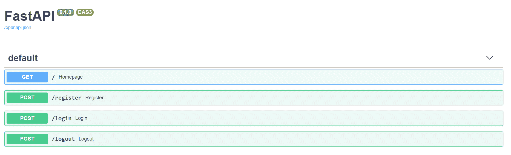
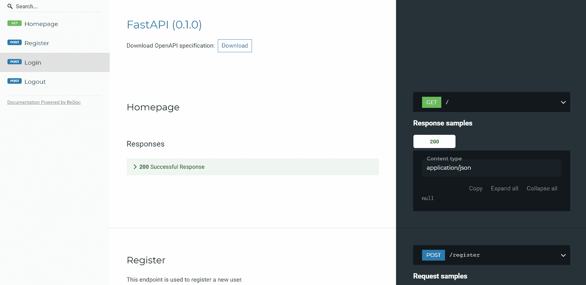
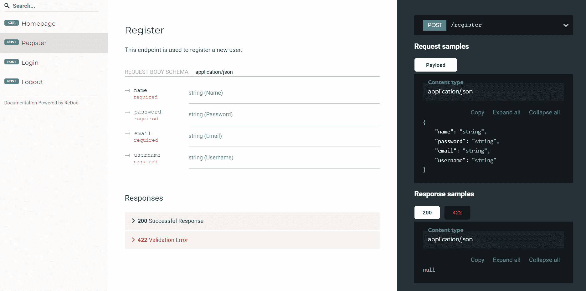

# 从 Flask 转移到 FastAPI

> 原文：<https://testdriven.io/blog/moving-from-flask-to-fastapi/>

Python 是最流行的编程语言之一。从脚本到 API 开发再到机器学习——Python 都有足迹。它的受欢迎程度是由它对开发人员体验的关注和它提供的工具推动的。web 框架 Flask 就是这样一个工具，在机器学习社区中很流行。它也广泛用于 API 开发。但是一个新的框架正在崛起: [FastAPI](https://fastapi.tiangolo.com/) 。与 Flask 不同，FastAPI 是一个 ASGI(异步服务器网关接口)框架。与 Go 和 NodeJS 一样，FastAPI 是最快的基于 Python 的 web 框架之一。

这篇文章的目标读者是那些对从 Flask 迁移到 FastAPI 感兴趣的人，文章比较和对比了 Flask 和 FastAPI 中的常见模式。

## FastAPI vs Flask

FastAPI 构建时考虑了这三个主要问题:

1.  速度
2.  开发者体验
3.  开放标准

你可以把 FastAPI 看作是将 [Starlette](https://www.starlette.io/) 、 [Pydantic](https://pydantic-docs.helpmanual.io/) 、 [OpenAPI](https://github.com/OAI/OpenAPI-Specification) 和 [JSON 模式](https://json-schema.org/)结合在一起的粘合剂。

*   在底层，FastAPI 使用 Pydantic 进行数据验证，使用 Starlette 进行工具验证，这使得它比 Flask 快得多，在 Node 或 Go 中提供了与高速 web APIs 相当的性能。
*   starlette+[uvicon](https://www.uvicorn.org/)提供异步请求能力，这是 Flask 所缺乏的。
*   使用 Pydantic 和[类型提示](https://docs.python.org/3/library/typing.html)，您可以获得一个良好的自动完成编辑器体验。您还可以获得数据验证、序列化和反序列化(用于构建 API)，以及自动文档(通过 JSON Schema 和 OpenAPI)。

也就是说，Flask 的使用范围更广，所以它经过了考验，并且有更大的社区支持它。由于这两个框架都是可扩展的，Flask 是明显的赢家，因为它有巨大的插件生态系统。

建议:

*   如果您对上述三个问题有共鸣，厌倦了 Flask 扩展的过多选择，希望利用异步请求，或者只想建立一个 RESTful API，请使用 FastAPI。
*   如果您对 FastAPI 的成熟度不满意，需要使用服务器端模板构建一个全栈应用程序，或者离不开一些社区维护的 Flask 扩展，请使用 Flask。

## 入门指南

### 装置

像任何其他 Python 包一样，安装相当简单。

**烧瓶**

```py
`pip install flask

# or
poetry add flask
pipenv install flask
conda install flask` 
```

**FastAPI**

```py
`pip install fastapi uvicorn

# or
poetry add fastapi uvicorn
pipenv install fastapi uvicorn
conda install fastapi uvicorn -c conda-forge` 
```

> 与 Flask 不同，FastAPI 没有内置的开发服务器，所以需要一个像[uvicon](https://www.uvicorn.org/)或 [Daphne](https://github.com/django/daphne) 这样的 [ASGI](https://asgi.readthedocs.io/en/latest/) 服务器。

### “Hello World”应用程序

**烧瓶**

```py
`# flask_code.py

from flask import Flask

app = Flask(__name__)

@app.route("/")
def home():
    return {"Hello": "World"}

if __name__ == "__main__":
    app.run()` 
```

**FastAPI**

```py
`# fastapi_code.py

import uvicorn
from fastapi import FastAPI

app = FastAPI()

@app.get("/")
def home():
    return {"Hello": "World"}

if __name__ == "__main__":
    uvicorn.run("fastapi_code:app")` 
```

像`reload=True`这样的参数可以传递到`uvicorn.run()`中，以便为开发启用热重装。

或者，您可以直接从终端启动服务器:

```py
`uvicorn run fastapi_code:app` 
```

对于热重装:

```py
`uvicorn run fastapi_code:app --reload` 
```

### 配置

Flask 和 FastAPI 都提供了许多选项来处理不同环境的不同配置。两者都支持以下模式:

1.  环境变量
2.  配置文件
3.  实例文件夹
4.  类和继承

有关更多信息，请参考各自的文档:

**烧瓶**

```py
`import os
from flask import Flask

class Config(object):
    MESSAGE = os.environ.get("MESSAGE")

app = Flask(__name__)
app.config.from_object(Config)

@app.route("/settings")
def get_settings():
    return { "message": app.config["MESSAGE"] }

if __name__ == "__main__":
    app.run()` 
```

现在，在运行服务器之前，设置适当的环境变量:

```py
`export MESSAGE="hello, world"` 
```

**FastAPI**

```py
`import uvicorn
from fastapi import FastAPI
from pydantic import BaseSettings

class Settings(BaseSettings):
    message: str

settings = Settings()
app = FastAPI()

@app.get("/settings")
def get_settings():
    return { "message": settings.message }

if __name__ == "__main__":
    uvicorn.run("fastapi_code:app")` 
```

同样，在运行服务器之前，设置适当的环境变量:

```py
`export MESSAGE="hello, world"` 
```

## 路线、模板和视图

### HTTP 方法

**烧瓶**

```py
`from flask import request

@app.route("/", methods=["GET", "POST"])
def home():
    # handle POST
    if request.method == "POST":
        return {"Hello": "POST"}
    # handle GET
    return {"Hello": "GET"}` 
```

**FastAPI**

```py
`@app.get("/")
def home():
    return {"Hello": "GET"}

@app.post("/")
def home_post():
    return {"Hello": "POST"}` 
```

FastAPI 为每个方法提供了单独的装饰器:

```py
`@app.get("/")
@app.post("/")
@app.delete("/")
@app.patch("/")` 
```

### URL 参数

通过管理状态的 URL(如`/employee/1`)传递信息:

**烧瓶**

```py
`@app.route("/employee/<int:id>")
def home():
    return {"id": id}` 
```

**FastAPI**

```py
`@app.get("/employee/{id}")
def home(id: int):
    return {"id": id}` 
```

URL 参数的指定类似于 f 字符串表达式。此外，您可以利用类型提示。这里，我们在运行时告诉 Pydantic，`id`的类型是`int`。在开发中，这也可以导致更好的代码完成。

### 查询参数

与 URL 参数一样，查询参数(如`/employee?department=sales`)也可以用于管理状态(通常用于过滤或排序):

**烧瓶**

```py
`from flask import request

@app.route("/employee")
def home():
    department = request.args.get("department")
    return {"department": department}` 
```

**FastAPI**

```py
`@app.get("/employee")
def home(department: str):
    return {"department": department}` 
```

### 模板

**烧瓶**

```py
`from flask import render_template

@app.route("/")
def home():
    return render_template("index.html")` 
```

默认情况下，Flask 在“templates”文件夹中查找模板。

**FastAPI**

你需要安装 [Jinja](https://jinja.palletsprojects.com/) :

实施:

```py
`from fastapi import Request
from fastapi.templating import Jinja2Templates
from fastapi.responses import HTMLResponse

app = FastAPI()

templates = Jinja2Templates(directory="templates")

@app.get("/", response_class=HTMLResponse)
def home(request: Request):
    return templates.TemplateResponse("index.html", {"request": request})` 
```

对于 FastAPI，您需要显式定义“templates”文件夹。然后，对于每个响应，需要提供请求上下文。

### 静态文件

**烧瓶**

默认情况下，Flask 从“static”文件夹中提供静态文件。

**FastAPI**

在 FastAPI 中，您需要为静态文件挂载一个文件夹:

```py
`from fastapi.staticfiles import StaticFiles

app = FastAPI()

app.mount("/static", StaticFiles(directory="static"), name="static")` 
```

### 异步任务

**烧瓶**

从 [Flask 2.0](https://palletsprojects.com/blog/flask-2-0-released/) 开始，您可以使用`async` / `await`创建异步路由处理程序:

```py
`@app.route("/")
async def home():
    result = await some_async_task()
    return result` 
```

> 有关 Flask 中异步视图的更多信息，请查看 Flask 2.0 中的异步文章。

flask 中的异步也可以通过使用线程(并发)或多处理(并行)来实现，或者通过像 [Celery](https://flask.palletsprojects.com/en/2.0.x/patterns/celery/) 或 [RQ](https://python-rq.org/) 这样的工具来实现:

1.  [烧瓶和芹菜的异步任务](/blog/flask-and-celery/)
2.  [带 Flask 和 Redis 队列的异步任务](/blog/asynchronous-tasks-with-flask-and-redis-queue/)

**FastAPI**

FastAPI 极大地简化了异步任务，因为它本身支持 asyncio。要使用，只需在视图函数中添加关键字`async`:

```py
`@app.get("/")
async def home():
    result = await some_async_task()
    return result` 
```

FastAPI 还有一个[后台任务](https://fastapi.tiangolo.com/tutorial/background-tasks/)特性，可以用来定义在返回响应后运行的后台任务。这对于不需要在发送回响应之前完成的操作非常有用。

```py
`from fastapi import BackgroundTasks

def process_file(filename: str):
    # process file :: takes minimum 3 secs (just an example)
    pass

@app.post("/upload/{filename}")
async def upload_and_process(filename: str, background_tasks: BackgroundTasks):
    background_tasks.add_task(process_file, filename)
    return {"message": "processing file"}` 
```

在这里，响应会立即发送，而不会让用户等待文件处理完成。

当您需要执行繁重的后台计算时，或者如果您需要一个任务队列来管理任务和工作者时，您可能希望使用 Celery 而不是`BackgroundTasks`。更多信息，请参考【FastAPI 和 Celery 的异步任务。

### 依赖注入

**烧瓶**

尽管您可以实现自己的依赖注入解决方案，但 Flask 在默认情况下并没有真正的一流支持。相反，你会想要使用一个像[烧瓶注射器](https://github.com/alecthomas/flask_injector)的外部包。

**FastAPI**

另一方面，FastAPI 有一个强大的[解决方案](https://fastapi.tiangolo.com/tutorial/dependencies/#dependencies-first-steps)来处理依赖注入。

例如:

```py
`from databases import Database
from fastapi import Depends
from starlette.requests import Request

from db_helpers import get_all_data
def get_db(request: Request):
    return request.app.state._db

@app.get("/data")
def get_data(db: Database = Depends(get_db)):
    return get_all_data(db)` 
```

因此，`get_db`将在应用程序的启动事件处理程序中获取对数据库连接创建的引用。[依赖](https://fastapi.tiangolo.com/tutorial/dependencies/)然后用于向 FastAPI 指示该路线“依赖于`get_db`。因此，它应该在路由处理程序中的代码之前执行，并且结果应该“注入”到路由本身中。

### 数据有效性

**烧瓶**

Flask 没有任何内部数据验证支持。您可以通过 [Flask-Pydantic](https://github.com/bauerji/flask_pydantic) 使用强大的 Pydantic 包进行数据验证。

**FastAPI**

FastAPI 如此强大的原因之一是它支持 Pydantic。

```py
`from pydantic import BaseModel

app = FastAPI()

class Request(BaseModel):
    username: str
    password: str

@app.post("/login")
async def login(req: Request):
    if req.username == "testdriven.io" and req.password == "testdriven.io":
        return {"message": "success"}
    return {"message": "Authentication Failed"}` 
```

这里，我们接受模型`Request`的输入。有效负载必须包含用户名和密码。

```py
`# correct payload format
✗ curl -X POST 'localhost:8000/login' \
    --header 'Content-Type: application/json' \
    --data-raw '{\"username\": \"testdriven.io\",\"password\":\"testdriven.io\"}'

{"message":"success"}

# incorrect payload format
✗ curl -X POST 'localhost:8000/login' \
    --header 'Content-Type: application/json' \
    --data-raw '{\"username\": \"testdriven.io\",\"passwords\":\"testdriven.io\"}'

{"detail":[{"loc":["body","password"],"msg":"field required","type":"value_error.missing"}]}` 
```

记下这个请求。我们将`passwords`作为键而不是`password`传入。Pydantic 模型自动告诉用户缺少`password`字段。

### 序列化和反序列化

**烧瓶**

最简单的序列化方法是使用 [jsonify](https://flask.palletsprojects.com/en/2.0.x/api/#flask.json.jsonify) :

```py
`from flask import jsonify
from data import get_data_as_dict

@app.route("/")
def send_data():
    return jsonify(get_data_as_dict)` 
```

对于复杂的对象，Flask 开发者经常使用 [Flask-Marshmallow](https://flask-marshmallow.readthedocs.io/en/latest/) 。

**FastAPI**

FastAPI 自动序列化任何返回的`dict`。对于更复杂和结构化的数据，使用 Pydantic:

```py
`from pydantic import BaseModel

app = FastAPI()

class Request(BaseModel):
    username: str
    email: str
    password: str

class Response(BaseModel):
    username: str
    email: str

@app.post("/login", response_model=Response)
async def login(req: Request):
    if req.username == "testdriven.io" and req.password == "testdriven.io":
        return req
    return {"message": "Authentication Failed"}` 
```

这里，我们添加了一个有三个输入的`Request`模型:用户名、电子邮件和密码。我们还定义了一个只有用户名和电子邮件的`Response`模型。输入`Request`模型处理反序列化，而输出`Response`模型处理对象序列化。然后，响应模型通过 [response_model](https://fastapi.tiangolo.com/tutorial/response-model/) 参数传递给装饰器。

现在，如果我们将请求本身作为响应返回，`Pydantic`将省略`password`，因为我们定义的响应模型不包含密码字段。

示例:

```py
`# output
✗ curl -X POST 'localhost:8000/login' \
    --header 'Content-Type: application/json' \
    --data-raw '{\"username\":\"testdriven.io\",\"email\":\"[[email protected]](/cdn-cgi/l/email-protection)\",\"password\":\"testdriven.io\"}'

{"username":"testdriven.io","email":"[[email protected]](/cdn-cgi/l/email-protection)"}` 
```

### 中间件

中间件用于在视图功能处理请求之前对每个请求应用逻辑。

**烧瓶**

```py
`class middleware:
    def __init__(self, app) -> None:
        self.app = app

    def __call__(self, environ, start_response):
        start = time.time()
        response = self.app(environ, start_response)
        end = time.time() - start
        print(f"request processed in {end} s")
        return response

app = Flask(__name__)
app.wsgi_app = middleware(app.wsgi_app)` 
```

**FastAPI**

```py
`from fastapi import Request

@app.middleware("http")
async def add_process_time_header(request: Request, call_next):
    start_time = time.time()
    response = await call_next(request)
    process_time = time.time() - start_time
    print(f"request processed in {process_time} s")
    return response` 
```

`@app.middleware("http")`装饰器是[在 FastAPI 中创建](https://fastapi.tiangolo.com/tutorial/middleware/#create-a-middleware)中间件所必须的。上述中间件计算处理一个请求所花费的时间。在 view 函数处理完请求后，计算总处理时间并作为响应头发送回去。

```py
`# flask output(logs)
request processed in 0.0010077953338623047 s
127.0.0.1 - - [22/Sep/2020 18:56:21] "GET / HTTP/1.1" 200 -

# fastapi output(logs)
request processed in 0.0009925365447998047 s
INFO:     127.0.0.1:51123 - "GET / HTTP/1.1" 200 OK` 
```

## 模块性

随着一个应用程序的增长，在某个时候你会想要将相似的视图、模板、静态文件和模型组合在一起，以帮助将应用程序分解成更小的组件。

**烧瓶**

在 Flask 中，[蓝图](https://flask.palletsprojects.com/en/2.0.x/blueprints/)用于模块化:

```py
`# blueprints/product/views.py
from flask import Blueprint

product = Blueprint("product", __name__)

@product.route("/product1")
    ...` 
```

```py
`# main.py

from blueprints.product.views import product

app.register_blueprint(product)` 
```

**FastAPI**

同时，使用 FastAPI，通过一个 [APIRouter](https://fastapi.tiangolo.com/tutorial/bigger-applications/#apirouter) 实现模块化:

```py
`# routers/product/views.py
from fastapi import APIRouter

product = APIRouter()

@product.get("/product1")
    ...` 
```

```py
`# main.py

from routers.product.views import product

app.include_router(product)` 
```

## 附加功能

### 自动文档

**烧瓶**

Flask 不会自动创建现成的 API 文档。然而，有几个扩展可以处理这个问题，比如 [flask-swagger](https://github.com/gangverk/flask-swagger) 和 [Flask RESTX](https://github.com/python-restx/flask-restx) ，但是它们需要额外的设置。

**FastAPI**

FastAPI 默认支持 OpenAPI 以及 [Swagger UI](https://swagger.io/tools/swagger-ui/) 和 [ReDoc](https://github.com/Redocly/redoc) 。这意味着每一个端点都是从与该端点相关联的元数据中自动记录的。



All the registered endpoints are listed here



Alternative documentation



### 管理应用程序

**烧瓶**

Flask 有一个广泛使用的第三方管理包，叫做 [Flask-Admin](https://github.com/flask-admin/flask-admin) ，用于快速对你的模型执行 CRUD 操作。

**FastAPI**

在撰写本文时，有两个流行的 FastAPI 扩展:

1.  FastAPI Admin -功能管理面板，提供一个用户界面，用于对数据执行 CRUD 操作。
2.  [SQLAlchemy Admin](https://github.com/aminalaee/sqladmin)-FastAPI/Starlette 的管理面板，用于 SQLAlchemy 模型。

### 证明

**烧瓶**

虽然 Flask 没有原生解决方案，但有几个第三方扩展可用。

**FastAPI**

FastAPI 通过`fastapi.security`包本地支持许多安全和认证工具。通过几行代码，您可以将基本的 HTTP 身份验证添加到您的应用程序中:

```py
`import secrets

from fastapi import Depends, FastAPI, HTTPException, status
from fastapi.security import HTTPBasic, HTTPBasicCredentials

app = FastAPI()

security = HTTPBasic()

def get_current_username(credentials: HTTPBasicCredentials = Depends(security)):
    correct_username = secrets.compare_digest(credentials.username, "stanleyjobson")
    correct_password = secrets.compare_digest(credentials.password, "swordfish")
    if not (correct_username and correct_password):
        raise HTTPException(status_code=status.HTTP_401_UNAUTHORIZED)
    return credentials.username

@app.get("/whoami")
def who_ami_i(username: str = Depends(get_current_username)):
    return {"username": username}` 
```

FastAPI 通过 [OpenAPI 标准](https://swagger.io/docs/specification/authentication/)实现 [OAuth2](https://en.wikipedia.org/wiki/OAuth#OAuth_2.0_2) 和 [OpenID Connect](https://en.wikipedia.org/wiki/OpenID_Connect) 。

有关更多信息，请查看官方文档中的以下资源:

1.  [安全介绍](https://fastapi.tiangolo.com/tutorial/security/)
2.  [高级安全性](https://fastapi.tiangolo.com/advanced/security/)

**附加资源**

1.  [Web 认证方法对比](/blog/web-authentication-methods/)
2.  [向 Flask 添加社会认证](/blog/flask-social-auth/)
3.  [使用 Flask 对单页应用进行基于会话的授权](/blog/flask-spa-auth/)
4.  [通过基于 JWT 令牌的认证保护 FastAPI】](/blog/fastapi-jwt-auth/)

### 克-奥二氏分级量表

CORS(跨来源资源共享)中间件检查请求是否来自允许的来源。如果是，请求将被传递到下一个中间件或视图功能。如果不是，它会拒绝请求，并向调用者返回一个错误响应。

**烧瓶**

Flask 需要一个名为 [Flask-CORS](https://github.com/corydolphin/flask-cors) 的外部包来支持 CORS:

基本实现:

```py
`from flask_cors import CORS

app = Flask(__name__)

CORS(app)` 
```

**FastAPI**

FastAPI 本机支持 CORS:

```py
`from fastapi.middleware.cors import CORSMiddleware

app = FastAPI()

origins = ["*"]

app.add_middleware(CORSMiddleware, allow_origins=origins)` 
```

## 测试

**烧瓶**

```py
`import pytest
from flask import Flask

app = Flask(__name__)

@app.route("/")
def home():
    return {"message": "OK"}

def test_hello():
    res = app.test_client().get("/")

    assert res.status_code == 200
    assert res.data == b'{"message":"OK"}\n'` 
```

**FastAPI**

```py
`from fastapi import FastAPI
from fastapi.testclient import TestClient

app = FastAPI()

@app.get("/")
async def home():
    return {"message": "OK"}

client = TestClient(app)

def test_home():
    res = client.get("/")

    assert res.status_code == 200
    assert res.json() == {"message": "OK"}` 
```

FastAPI 提供了一个[测试客户端](https://fastapi.tiangolo.com/tutorial/testing/#using-testclient)。有了它，你可以直接用 FastAPI 运行`pytest`。欲了解更多信息，请查阅官方文件中的[测试](https://fastapi.tiangolo.com/tutorial/testing/)指南。

## 部署

### 生产服务器

**烧瓶**

Flask 默认运行一个开发 [WSGI](https://en.wikipedia.org/wiki/Web_Server_Gateway_Interface) (Web 服务器网关接口)应用服务器。对于生产，你需要使用生产级的 WSGI 应用服务器，比如 [Gunicorn](https://gunicorn.org) 、 [uWSGI](https://uwsgi-docs.readthedocs.io/) 或 [mod_wsgi](https://modwsgi.readthedocs.io/)

安装 Gunicorn:

启动服务器:

```py
`# main.py
# app = Flask(__name__)

gunicorn main:app` 
```

**FastAPI**

由于 FastAPI 没有开发服务器，您将使用 Uvicorn(或 Daphne)进行开发和生产。

安装 Uvicorn:

启动服务器:

```py
`# main.py
# app = FastAPI()

uvicorn main:app` 
```

您可能希望使用 Gunicorn 来管理 uvicon，以便利用并发性(通过 uvicon)和并行性(通过 Gunicorn workers):

```py
`# main.py
# app = FastAPI()

gunicorn -w 3 -k uvicorn.workers.UvicornWorker main:app` 
```

### 码头工人

**烧瓶**

```py
`FROM  python3.10-slim

WORKDIR  /app

COPY  requirements.txt .

RUN  pip install -r requirements.txt

COPY  . .

EXPOSE  5000

CMD  ["gunicorn",  "main:app"]` 
```

这是 Flask 最简单的 docker 文件之一。要了解如何为生产进行全面配置，请查看带有 Postgres、Gunicorn 和 Nginx 的[Dockerizing Flask](/blog/dockerizing-flask-with-postgres-gunicorn-and-nginx/)教程。

**FastAPI**

```py
`FROM  python3.10-slim

WORKDIR  /app

COPY  requirements.txt .

RUN  pip install -r requirements.txt

COPY  . .

EXPOSE  8000

CMD  ["uvicorn",  "main:app"]` 
```

同样，这是一个非常简单的配置。FastAPI 作者提供了几个生产就绪的 docker 文件。更多信息，请查看官方 FastAPI 文档以及[dockering FastAPI with Postgres、Uvicorn 和 Traefik](/blog/fastapi-docker-traefik/) 教程。

## 结论

退一步说，Django 和 Flask 是两个最流行的基于 Python 的 web 框架(FastAPI 是第三流行的)。然而，他们(姜戈和弗拉斯克)有着非常不同的哲学。Flask 相对于 Django 的优势在于 Flask 是一个微框架。程序结构由程序员决定，并不强制执行。开发人员可以添加第三方扩展来改进他们认为合适的代码。也就是说，通常情况下，随着代码库的增长，几乎所有的 web 应用程序都需要一些通用的特性。这些特性与框架的紧密集成大大减少了最终开发人员需要自己创建和维护的代码。

本文中的代码示例传达了同样的意思。换句话说，FastAPI 包含了许多必需的特性。它还遵循严格的标准，使您的代码易于生产和维护。FastAPI 也是有据可查的。

虽然 FastAPI 可能不像 Flask 那样久经考验，但越来越多的开发人员正转向它来提供机器学习模型或开发 RESTful API。切换到 FastAPI 是一个可靠的选择。

### 官方文件

### 额外资源