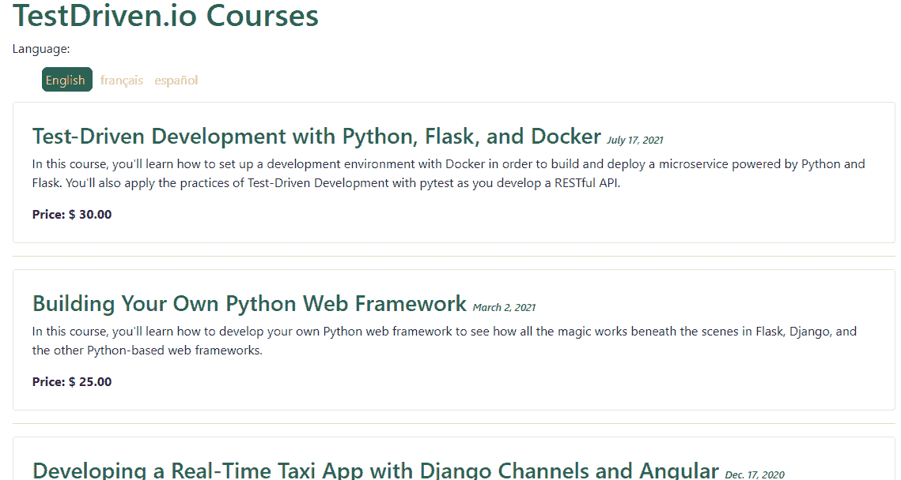
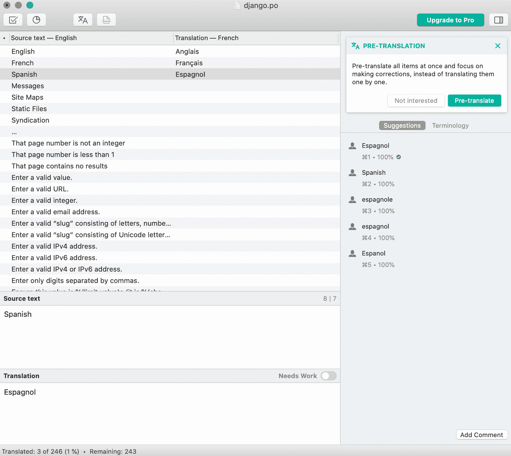
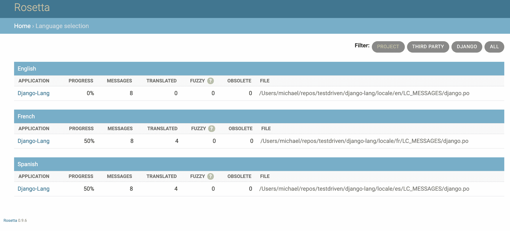
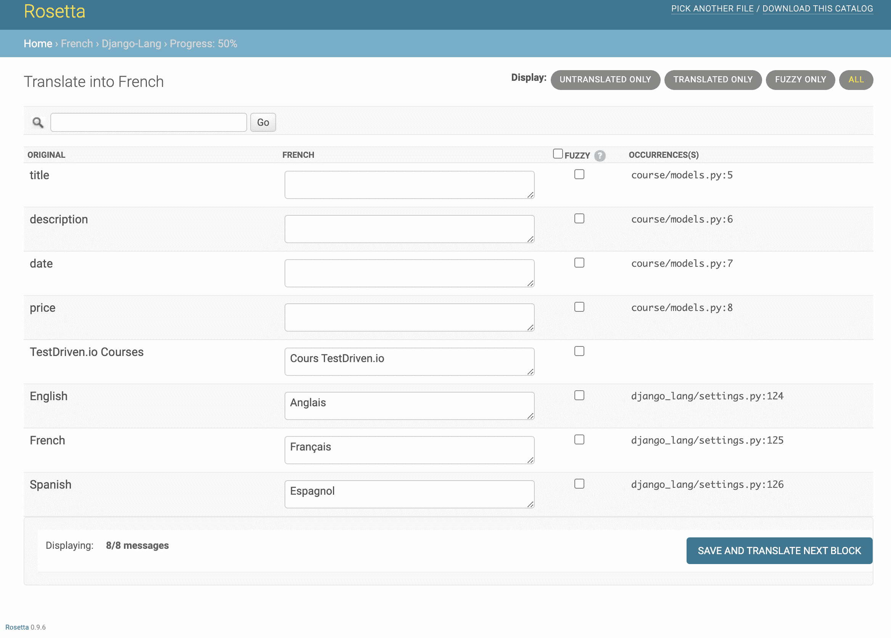
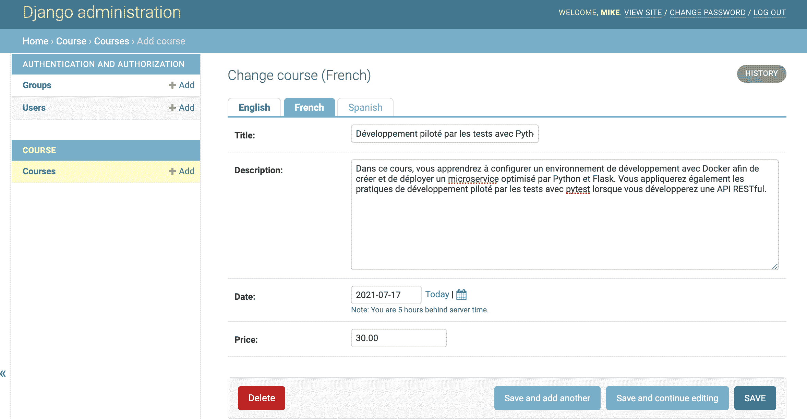
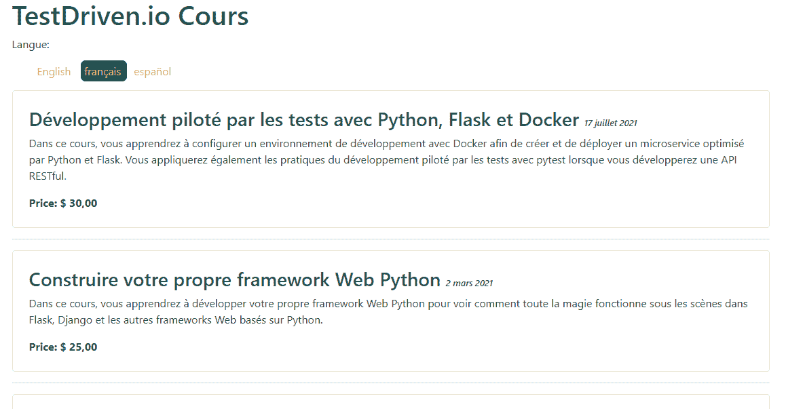

# 支持 Django 的多种语言

> 原文：<https://testdriven.io/blog/multiple-languages-in-django/>

Django 提供了现成的多语言支持。事实上，《姜戈》被翻译成 100 多种语言。本教程着眼于如何在 Django 项目中添加多语言支持。

## 目标

学完本教程后，您应该能够:

1.  解释国际化和本地化的区别
2.  向 URL 添加语言前缀
3.  翻译模板
4.  允许用户在语言之间切换
5.  翻译模型
6.  添加区域设置支持

## 项目设置

下面是对您将要构建的应用程序的快速浏览:



这看起来可能很简单，但是它会让你适应向 Django 添加国际化。

首先，从 [django-lang](https://github.com/Samuel-2626/django-lang) repo 中克隆出 [base](https://github.com/Samuel-2626/django-lang/tree/base) 分支:

```py
`$ git clone https://github.com/Samuel-2626/django-lang --branch base --single-branch
$ cd django-lang` 
```

接下来，创建并激活虚拟环境，安装项目的依赖项，应用迁移，并创建超级用户:

```py
`$ python3.9 -m venv env
$ source env/bin/activate

(env)$ pip install -r requirements.txt
(env)$ python manage.py makemigrations
(env)$ python manage.py migrate
(env)$ python manage.py createsuperuser` 
```

> 你可以随意把 virtualenv 和 Pip 换成诗歌[或](https://python-poetry.org) [Pipenv](https://github.com/pypa/pipenv) 。更多信息，请查看[现代 Python 环境](/blog/python-environments/)。

注意 *course/models.py* 中的`Course`型号:

```py
`from django.db import models

class Course(models.Model):
    title = models.CharField(max_length=90)
    description = models.TextField()
    date = models.DateField()
    price = models.DecimalField(max_digits=10, decimal_places=2)

    def __str__(self):
        return self.title` 
```

运行以下管理命令，向数据库添加一些数据:

```py
`$ python manage.py add_courses` 
```

在下一节中，我们将简要地看一下国际化和本地化。

## 国际化与本地化

国际化和本地化是一个硬币的两面。总之，它们允许您将 web 应用程序的内容交付给不同的地区。

*   **国际化**，用 i18n (18 是 I 和 n 之间的字母数)表示，是开发应用程序以供不同地区使用的过程。这个过程通常由开发人员处理。
*   **本地化**，用 l10n 表示(10 是 l 和 n 之间的字母数)，另一方面是将你的应用程序翻译成特定语言和地区的过程。这一般由翻译来处理。

> 更多信息，请查看 W3C 的[本地化与国际化](https://www.w3.org/International/questions/qa-i18n)。

回想一下，Django 通过其国际化框架已经被翻译成超过 [100](https://docs.djangoproject.com/en/3.2/internals/contributing/) 种语言:

通过国际化框架，我们可以在 Python 代码和模板中轻松标记要翻译的字符串。它利用 GNU [gettext](https://www.gnu.org/software/gettext/) 工具包来生成和管理一个纯文本文件，该文件代表一种被称为[消息文件](https://docs.djangoproject.com/en/3.2/topics/i18n/#term-message-file)的语言。消息文件以*结尾。po* 作为其延伸。翻译完成后，会为每种语言生成另一个文件，以*结束。mo* 扩展。这就是所谓的编译翻译。

让我们从安装 [gettext](https://www.gnu.org/software/gettext/) 工具包开始。

在 macOS 上，建议使用[自制](https://brew.sh/):

```py
`$ brew install gettext
$ brew link --force gettext` 
```

对于大多数 Linux 发行版，它是预安装的。最后，对于 Windows，安装步骤可以在[这里](https://docs.djangoproject.com/en/3.2/topics/i18n/translation/#gettext-on-windows)找到。

在下一节中，我们将为国际化和本地化准备 Django 项目。

## Django 的国际化框架

Django 在 *settings.py* 文件中提供了一些默认的国际化设置:

```py
`# Internationalization
# https://docs.djangoproject.com/en/3.1/topics/i18n/

LANGUAGE_CODE = 'en-us'

TIME_ZONE = 'UTC'

USE_I18N = True

USE_L10N = True

USE_TZ = True` 
```

第一个设置是`LANGUAGE_CODE`。默认情况下，它设置为美国英语(en-us)。这是一个特定于语言环境的名称。让我们将其更新为一个通用名称，英语(en)。

> 更多信息见[语言标识符列表](http://www.i18nguy.com/unicode/language-identifiers.html)。

为了使 [LANGUAGE_CODE](https://docs.djangoproject.com/en/3.2/ref/settings/#std:setting-LANGUAGE_CODE) 生效， [USE_I18N](https://docs.djangoproject.com/en/3.2/ref/settings/#std:setting-USE_I18N) 必须为`True`，这将启用 Django 的翻译系统。

记下其余的设置:

```py
`TIME_ZONE = 'UTC'

USE_L10N = True

USE_TZ = True` 
```

注意事项:

1.  ' UTC '是默认的[时区](https://docs.djangoproject.com/en/3.2/ref/settings/#std:setting-TIME_ZONE)。
2.  由于 [USE_L10N](https://docs.djangoproject.com/en/3.2/ref/settings/#std:setting-USE_L10N) 被设置为`True`，Django 将使用当前地区的格式显示数字和日期。
3.  最后，当[使用 _TZ](https://docs.djangoproject.com/en/3.2/ref/settings/#std:setting-USE_TZ) 为`True`时，日期时间将是时区敏感的。

让我们添加一些附加设置来补充现有设置:

```py
`from django.utils.translation import gettext_lazy as _

LANGUAGES = (
    ('en', _('English')),
    ('fr', _('French')),
    ('es', _('Spanish')),
)` 
```

这里发生了什么事？

1.  我们指定了希望项目可用的语言。如果没有指定，Django 会认为我们的项目应该可以使用所有支持的语言。
2.  该[语言](https://docs.djangoproject.com/en/3.2/ref/settings/#languages)设置由语言代码和语言名称组成。回想一下，语言代码可以是特定于地区的，如“en-gb”，也可以是通用的，如“en”。
3.  此外，`gettext_lazy`用于翻译语言名称，而不是`gettext`以防止循环导入。当你在全局范围内时，你应该*几乎*总是使用 [gettext_lazy](https://docs.djangoproject.com/en/3.2/topics/i18n/translation/#lazy-translations) 。

将`django.middleware.locale.LocaleMiddleware`添加到`MIDDLEWARE`设置列表中。这个中间件应该在`SessionMiddleware`之后，因为`LocaleMiddleware`需要使用会话数据。它也应该放在`CommonMiddleware`之前，因为`CommonMiddleware`需要活动语言来解析被请求的 URL。因此，顺序非常重要。

```py
`MIDDLEWARE = [
    'django.middleware.security.SecurityMiddleware',
    'django.contrib.sessions.middleware.SessionMiddleware',
    'django.middleware.locale.LocaleMiddleware', # new
    'django.middleware.common.CommonMiddleware',
    'django.middleware.csrf.CsrfViewMiddleware',
    'django.contrib.auth.middleware.AuthenticationMiddleware',
    'django.contrib.messages.middleware.MessageMiddleware',
    'django.middleware.clickjacking.XFrameOptionsMiddleware',
]` 
```

该中间件用于根据请求数据确定当前语言。

为您的应用程序添加消息文件将驻留的区域设置路径目录:

```py
`LOCALE_PATHS = [
    BASE_DIR / 'locale/',
]` 
```

Django 查看翻译文件的 [LOCALE_PATHS](https://docs.djangoproject.com/en/3.2/ref/settings/#std:setting-LOCALE_PATHS) 设置。请记住，最先出现的区域设置路径具有最高的优先级。

您需要在根项目中创建“locale”目录，并为每种语言添加一个新文件夹:

```py
`locale
├── en
├── es
└── fr` 
```

打开 shell 并从项目目录运行以下命令来创建一个*。每种语言的 po* 消息文件:

```py
`(env)$ django-admin makemessages --all --ignore=env` 
```

您现在应该已经:

```py
`locale
├── en
│   └── LC_MESSAGES
│       └── django.po
├── es
│   └── LC_MESSAGES
│       └── django.po
└── fr
    └── LC_MESSAGES
        └── django.po` 
```

记下其中一个*。po* 消息文件:

1.  `msgid`:表示源代码中出现的翻译字符串。
2.  `msgstr`:表示语言翻译，默认为空。您必须为任何给定的字符串提供实际的翻译。

目前，只有我们的 *settings.py* 文件中的`LANGUAGES`被标记为待翻译。因此，对于“fr”和“es”目录下的每个`msgstr`,分别手动输入该单词的法语或西班牙语等价物。你可以编辑*。来自常规代码编辑器的 po* 文件；但是，建议使用专门为*设计的编辑器。po* 喜欢 [Poedit](https://poedit.net/) 。

对于本教程，请进行以下更改:

```py
`# locale/fr/LC_MESSAGES/django.po

msgid "English"
msgstr "Anglais"

msgid "French"
msgstr "Français"

msgid "Spanish"
msgstr "Espagnol"

# locale/es/LC_MESSAGES/django.po

msgid "English"
msgstr "Inglés"

msgid "French"
msgstr "Francés"

msgid "Spanish"
msgstr "Español"` 
```

Poedit 示例:



接下来，让我们通过运行以下命令来编译消息:

```py
`(env)$ django-admin compilemessages --ignore=env` 
```

一个*。已经为每种语言生成了 mo* 编译消息文件；

```py
`locale
├── en
│   └── LC_MESSAGES
│       ├── django.mo
│       └── django.po
├── es
│   └── LC_MESSAGES
│       ├── django.mo
│       └── django.po
└── fr
    └── LC_MESSAGES
        ├── django.mo
        └── django.po` 
```

--

这一节到此为止！

到目前为止，您已经介绍了很多，在继续介绍其他概念之前，让我们回顾一下。回想一下，本教程的目标是教您如何在 Django 项目中添加多语言支持。在第一部分中，您设置了项目并查看了您将要构建的内容。然后，您学习了国际化和本地化之间的区别，以及 Django 国际化框架是如何工作的。最后，我们将项目配置为允许多语言支持，并看到了它的实际应用:

1.  为我们的 Django 项目增加了国际化
2.  设置我们希望项目可用的语言
3.  通过`gettext_lazy`生成消息文件
4.  手动添加翻译
5.  编译了翻译

## 翻译模板、模型和表单

您可以通过使用`gettext`或`gettext_lazy`函数将模型字段名称和表单标记为翻译来翻译它们:

像这样编辑 *course/models.py* 文件:

```py
`from django.db import models
from django.utils.translation import gettext_lazy as _

class Course(models.Model):
    title = models.CharField(_('title'), max_length=90)
    description = models.TextField(_('description'))
    date = models.DateField(_('date'))
    price = models.DecimalField(_('price'), max_digits=10, decimal_places=2)

    def __str__(self):
        return self.title` 
```

```py
`(env)$ django-admin makemessages --all --ignore=env` 
```

随意手动或使用 Poedit 界面更新法语和西班牙语的`msgstr`翻译，然后编译消息

```py
`(env)$ django-admin compilemessages --ignore=env` 
```

我们也可以通过添加标签来为表单做这件事。

例如:

```py
`from django import forms
from django.utils.translation import gettext_lazy as _

class ExampleForm(forms.Form):
    first_name = forms.CharField(label=_('first name'))` 
```

为了翻译我们的模板，Django 提供了``和``模板标签来翻译字符串。你必须在 HTML 文件的顶部添加``来使用翻译模板标签。

``模板标签允许你标记一个要翻译的文字。Django 只是在内部对给定的文本执行`gettext`函数。

``标签对于简单的翻译字符串很有用，但是它不能处理包含变量的翻译内容。

另一方面，``模板标签允许您标记包含文字和变量的内容。

更新*course/templates/index . html*文件中的以下元素以查看其运行情况:

```py
`<h1></h1>` 
```

不要忘记在文件的顶部添加``。

```py
`(env)$ django-admin makemessages --all --ignore=env` 
```

更新以下`msgstr`翻译:

```py
`# locale/fr/LC_MESSAGES/django.po

msgid "TestDriven.io Courses"
msgstr "Cours TestDriven.io"

# locale/es/LC_MESSAGES/django.po

msgid "TestDriven.io Courses"
msgstr "Cursos de TestDriven.io"` 
```

编译消息:

```py
`(env)$ django-admin compilemessages --ignore=env` 
```

## 使用 Rosetta 翻译接口

我们将使用名为 [Rosetta](https://github.com/mbi/django-rosetta) 的第三方库，使用与 Django 管理站点相同的界面来编辑翻译。编辑*很容易。po* 文件，它会自动为您更新编译好的翻译文件。

Rosetta 已经作为依赖项的一部分安装；因此，您只需将它添加到您已安装的应用程序中:

```py
`INSTALLED_APPS = [
    'django.contrib.admin',
    'django.contrib.auth',
    'django.contrib.contenttypes',
    'django.contrib.sessions',
    'django.contrib.messages',
    'django.contrib.staticfiles',
    'course.apps.CourseConfig',
    'rosetta',  # NEW
]` 
```

您还需要将 Rosetta 的 URL 添加到主 URL 配置中的 *django_lang/urls.py* :

```py
`urlpatterns = [
    path('admin/', admin.site.urls),
    path('rosetta/', include('rosetta.urls')),  # NEW
    path('', include('course.urls')),
]` 
```

创建并应用迁移，然后运行服务器:

```py
`(env)$ python manage.py makemigrations
(env)$ python manage.py migrate
(env)$ python manage.py runserver` 
```

确保您以管理员身份登录，然后在浏览器中导航至[http://127 . 0 . 0 . 1:8000/Rosetta/](http://127.0.0.1:8000/rosetta/):



在项目下，单击每个应用程序以编辑翻译。



编辑完翻译后，点击“保存并翻译下一个模块”按钮，将翻译保存到各自的*中。po* 文件。Rosetta 然后会编译消息文件，所以不需要手动运行`django-admin compilemessages --ignore=env`命令。

> 请注意，在生产环境中添加新的翻译后，您必须在运行`django-admin compilemessages --ignore=env`命令或使用 Rosetta 保存翻译后重新加载您的服务器，以使更改生效。

## 向 URL 添加语言前缀

使用 Django 的国际化框架，您可以在不同的 URL 扩展下提供每种语言版本。例如，你网站的英文版可以放在`/en/`下，法文版放在`/fr/`下，等等。这种方法使网站针对搜索引擎进行了优化，因为每个 URL 都将针对每种语言进行索引，这反过来将对每种语言进行更好的排名。为此，Django 国际化框架需要从请求的 URL 中识别当前语言；因此，`LocalMiddleware`需要添加到您项目的`MIDDLEWARE`设置中，我们已经完成了。

接下来，将`i18n_patterns`函数添加到 *django_lang/urls.py* :

```py
`from django.conf.urls.i18n import i18n_patterns
from django.contrib import admin
from django.urls import path, include
from django.utils.translation import gettext_lazy as _

urlpatterns = i18n_patterns(
    path(_('admin/'), admin.site.urls),
    path('rosetta/', include('rosetta.urls')),
    path('', include('course.urls')),
)` 
```

再次运行开发服务器，并在浏览器中导航到 [http://127.0.0.1:8000/](http://127.0.0.1:8000/) 。您将被重定向到所请求的 URL，并带有相应的语言前缀。看看你浏览器里的网址；它现在应该看起来像[http://127 . 0 . 0 . 1:8000/en/](http://127.0.0.1:8000/en/)。

> 将请求的 URL 从`en`更改为`fr`或`es`。标题应该改变。

## 用 django-parler 翻译模型

Django 的国际化框架不支持开箱即用的模型翻译，所以我们将使用名为 [django-parler](https://github.com/django-parler/django-parler) 的第三方库。有许多[插件](https://djangopackages.org/grids/g/model-translation/)执行这个功能；不过，这是比较受欢迎的一种。

它是如何工作的？

django-parler 将为每个包含翻译的模型创建一个单独的数据库表。此表包括所有已翻译的字段。它还有一个外键来链接到原始对象。

django-parler 已经作为依赖项的一部分安装，所以只需将其添加到您已安装的应用程序中:

```py
`INSTALLED_APPS = [
    'django.contrib.admin',
    'django.contrib.auth',
    'django.contrib.contenttypes',
    'django.contrib.sessions',
    'django.contrib.messages',
    'django.contrib.staticfiles',
    'course.apps.CourseConfig',
    'rosetta',
    'parler',  # NEW
]` 
```

另外，将以下代码添加到您的设置中:

```py
`PARLER_LANGUAGES = {
    None: (
        {'code': 'en',}, # English
        {'code': 'fr',}, # French
        {'code': 'es',}, # Spanish
    ),
    'default': {
        'fallbacks': ['en'],
        'hide_untranslated': False,
    }
}` 
```

在这里，您为 django-parler 定义了可用的语言(英语、法语、西班牙语)。您还指定英语为默认语言，并指出 django-parler 不应该[隐藏未翻译的内容](https://django-parler.readthedocs.io/en/stable/configuration.html#parler-languages)。

**知道什么？**

1.  django-parler 提供了一个`TranslatableModel`模型类和一个`TranslatedFields`包装器来翻译模型字段。
2.  django-parler 通过为每个可翻译模型生成另一个模型来管理翻译。

> 注意，因为 Django 使用单独的表进行翻译，所以有些 Django 特性是不能使用的。此外，该迁移将删除数据库中以前的记录。

再次更新 *course/models.py* 如下所示:

```py
`from django.db import models
from parler.models import TranslatableModel, TranslatedFields

class Course(TranslatableModel):
    translations = TranslatedFields(
        title=models.CharField(max_length=90),
        description=models.TextField(),
        date=models.DateField(),
        price=models.DecimalField(max_digits=10, decimal_places=2),
    )

    def __str__(self):
        return self.title` 
```

接下来，创建迁移:

```py
`(env)$ python manage.py makemigrations` 
```

继续之前，替换新创建的迁移文件中的以下行:

```py
`bases=(parler.models.TranslatedFieldsModelMixin, models.Model),` 
```

用下面的一个:

```py
`bases = (parler.models.TranslatableModel, models.Model)` 
```

> 在 django-parler 中发现了一个我们刚刚解决的小问题。不这样做将会阻止迁移的应用。

接下来，应用迁移:

```py
`(env)$ python manage.py migrate` 
```

django_parler 的一个令人惊叹的特性是它可以与 django 管理站点顺利集成。它包含一个`TranslatableAdmin`类，覆盖了 Django 提供的用于管理翻译的`ModelAdmin`类。

编辑 *course/admin.py* 如下:

```py
`from django.contrib import admin
from parler.admin import TranslatableAdmin

from .models import Course

admin.site.register(Course, TranslatableAdmin)` 
```

运行以下管理命令，再次向数据库添加一些数据:

```py
`(env)$ python manage.py add_courses` 
```

运行服务器，然后在浏览器中导航到[http://127 . 0 . 0 . 1:8000/admin/](http://127.0.0.1:8000/admin/)。选择其中一门课程。对于每门课程，每种语言都有一个单独的字段。



> 请注意，对于 django-parler 可以为我们实现的功能，我们仅仅触及了皮毛。请参考[文档](https://django-parler.readthedocs.io/en/stable/index.html)了解更多信息。

## 允许用户切换语言

在这一节中，我们将展示如何允许用户在我们的主页上切换语言。

更新*index.html*文件是这样的:

```py
`

<!DOCTYPE html>
<html lang="en">
  <head>
    <meta charset="UTF-8" />
    <meta http-equiv="X-UA-Compatible" content="IE=edge" />
    <meta name="viewport" content="width=device-width, initial-scale=1.0" />
    <link
      href="https://cdn.jsdelivr.net/npm/[[email protected]](/cdn-cgi/l/email-protection)/dist/css/bootstrap.min.css"
      rel="stylesheet"
      integrity="sha384-EVSTQN3/azprG1Anm3QDgpJLIm9Nao0Yz1ztcQTwFspd3yD65VohhpuuCOmLASjC"
      crossorigin="anonymous"
    />
    <title>TestDriven.io</title>
      <style> h1,  h3  { color:  #266150; } li  { display:  inline; text-decoration:  none; padding:  5px; } a  { text-decoration:  none; color:  #DDAF94; } a:hover  { color:  #4F4846; } .active  { background-color:  #266150; padding:  5px; text-align:  right; border-radius:  7px; } </style>
  </head>
  <body>
    <div class="container">
      <h1></h1>

      
      
      
      <div class="languages">
        <p>:</p>
        <ul class="languages">
          
            <li>
              <a href="/{{ language.code }}/"
                 class="active">
                {{ language.name_local }}
              </a>
            </li>
          
        </ul>
      </div>

      
        <div class="card p-4">
          <h3>
            {{ course.title }}
            <em style="font-size: small">{{ course.date }}</em>
          </h3>
          <p>{{ course.description }}</p>
          <strong>Price: $ {{ course.price }}</strong>
        </div>
        <hr />
      
        <p>Database is empty</p>
      

    </div>
  </body>
</html>` 
```

这里发生了什么事？

我们:

1.  使用``加载国际化标签。
2.  使用``标签检索当前语言。
3.  还通过``模板标签获得了在`LANGUAGES`设置中定义的可用语言。
4.  然后使用``标签来启用语言属性。
5.  构建了一个 HTML 列表来显示所有可用的语言，并向当前活动的语言添加了一个 active class 属性来突出显示活动的语言。

在您的浏览器中导航到 [http://127.0.0.1:8000/](http://127.0.0.1:8000/) 以查看更改。在多种语言之间切换，并注意每种语言的 URL 前缀是如何变化的。

## 添加区域设置支持

还记得我们如何将`USE_L10N`设置为`True`吗？这样，每当 Django 在模板中输出一个值时，它都会尝试使用特定于地区的格式。因此，根据用户的区域设置，日期、时间和数字将采用不同的格式。

在浏览器中导航回 [http://127.0.0.1:8000/](http://127.0.0.1:8000/) 以查看更改，您会注意到日期格式发生了变化。十进制数字在英文版的网站上显示，小数点位置用点分隔，而在西班牙文和法文版的网站上，则用逗号分隔。这是由于每种语言的地区格式不同。



## 结论

在本教程中，您了解了国际化和本地化，以及如何通过 Django 的国际化框架为国际化配置 Django 项目。我们还使用 Rosetta 来简化消息文件的更新和编译，使用 django-parler 来翻译我们的模型。

从 GitHub 上的 django-lang repo 获取完整的代码。