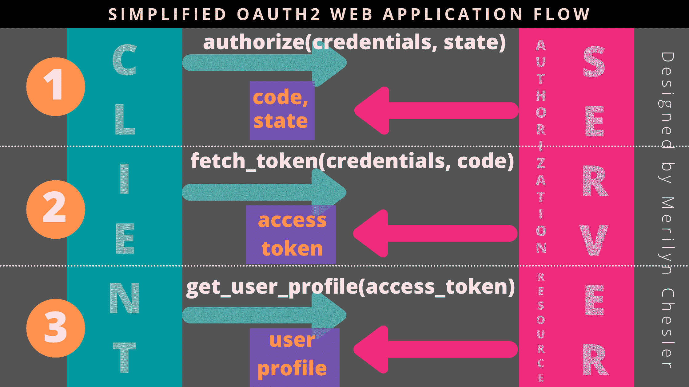
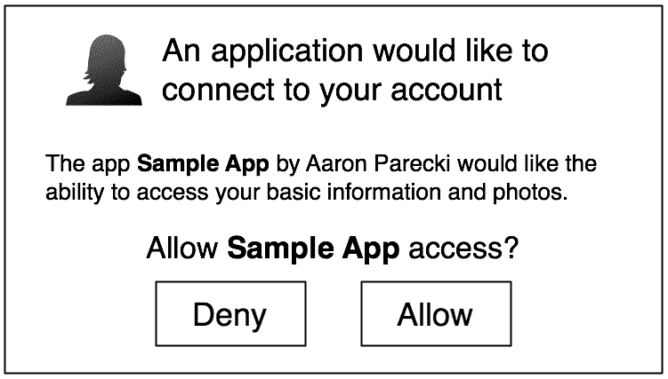
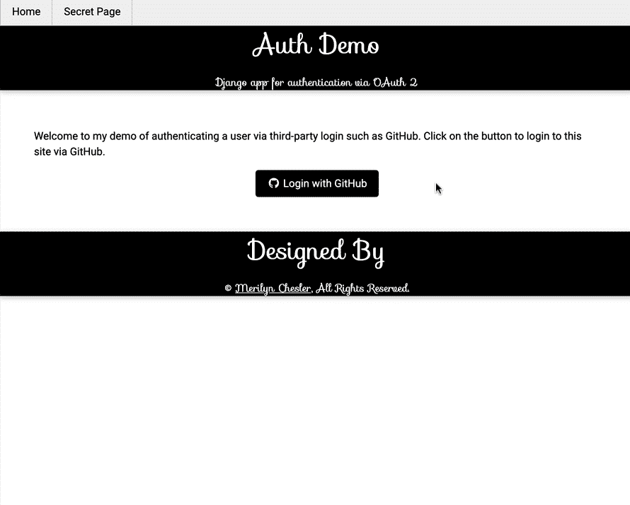

# Python 中的 OAuth2

> 原文：<https://testdriven.io/blog/oauth-python/>

在本文中，我们将首先看看什么是 [OAuth](https://oauth.net/) 。然后，我们将使用 [OAuthLib](https://github.com/oauthlib/oauthlib) 和[请求](https://requests.readthedocs.io/)库来实现 [OAuth2](https://oauth.net/2/) 。

## 目标

完成本文后，您将能够:

1.  解释什么是 OAuth 和 OAuth2，以及如何使用它们
2.  描述 web 客户端和服务器之间的 OAuth2 流
3.  通过 Web 应用程序流实现 OAuth2(也称为授权码授予)

## OAuth 是什么？

OAuth 是一个安全的开放协议，用于在不相关的服务之间授权用户。换句话说，它使一个服务能够访问托管在其他服务上的资源，而不必共享用户凭证，如用户名和密码。

这都是关于授权的:

1.  一个服务(客户端)代表用户从另一个服务(资源服务器)访问资源。
2.  用户不必与客户端共享他们的凭证。

参与方:

1.  **资源所有者/用户** -允许访问由第三方提供商托管的受保护资源的人
2.  **客户端** -代表用户访问由第三方提供商托管的资源的 web 应用程序
3.  **授权服务器** -客户端联系的第三方服务器，显示提示用户授权客户端代表用户行事
4.  **资源服务器** -托管用户受保护资源的第三方服务器

> 授权服务器和资源服务器可以是同一个实体。

OAuth2 是 OAuth 协议的最新版本，由谷歌、Spotify、Trello 和 Vimeo 等[服务](https://en.wikipedia.org/wiki/List_of_OAuth_providers)使用。

## OAuth2 Web 应用程序流

OAuth2 协议可用于不同类型的应用程序，但它最常用于 web、移动和桌面应用程序。本节将介绍 OAuth2 在 web 应用程序中的部署，也称为 [Web 应用程序流](https://aaronparecki.com/oauth-2-simplified/#web-server-apps)(或[授权码授予](https://oauth.net/2/grant-types/authorization-code/))。

下图显示了一个简化的 Web 应用程序流程:



这个流程基本上是客户机(web 应用程序)和服务器(OAuth2 提供者)之间的通信和信息交换，它由三个步骤组成:

1.  批准
2.  获取访问令牌
3.  获取用户信息

在实现这个流程之前，web 开发人员通常必须向 OAuth2 提供者注册他们的 web 应用程序，并提供以下信息:

*   应用程序的名称
*   托管应用程序的位置
*   URI 端点(也称为重定向 URI 或回叫 URL)

注册后，OAuth2 提供商将向注册人提供以下信息:

*   **客户端 ID** -唯一标识 web 应用程序的公共凭证，类似于用户名
*   **客户端秘密** -传递给服务器的私有凭证，类似于密码
*   **授权服务器 URL** -客户端请求授权的 URL
*   **访问令牌 URL** -客户端用授权码交换访问令牌的 URL
*   **资源服务器 URL** -客户端使用访问令牌访问受保护资源的 URL，该令牌也可以与授权服务器相同

我们现在将更深入地研究 Web 应用程序流中涉及的三个步骤。

> 请注意，术语“客户端”将与“web 应用程序”互换使用。

### 第一步:授权

第一步 authorize 通常在登录过程开始时调用。在此步骤中，web 应用程序向用户请求权限，以授权访问他们在第三方 OAuth2 提供商处托管的帐户。

#### 客户端-请求权限

首先，web 应用程序使用以下信息构建一个 URL:

*   **响应类型** -告知授权服务器使用哪个流程或[授予](https://oauth.net/2/grant-types/)(网络应用流程使用`code`
*   **客户端 ID** -标识网络应用
*   **重定向 URI** -将用户重定向回哪里
*   **Scope** -指定 web 应用程序希望访问用户配置文件的哪一部分
*   **State** -是 web 应用程序提供的随机生成的字符串，授权服务器将简单地将该字符串传递回去，以便 web 应用程序可以验证该字符串以减少欺诈

以下是一个示例 URL:

```
`https://api.authorization-server.com/authorize
  ?response_type=code
  &client_id=123
  &redirect_uri=https://your-web-app.com/redirect
  &scope=photos
  &state=1234-zyxa-9134-wpst` 
```

然后，用户被重定向到该 URL，授权服务器将提示他们是否要授权该应用程序的请求:



#### 授权服务器-重定向回

在用户授权 web 应用程序访问其第三方帐户后，授权服务器将通过包含以下信息的重定向 URL 将用户重定向回 web 应用程序:

*   **Code**——web 应用程序期望从服务器获得的短期授权代码
*   **状态**——先前从客户端传递的状态凭证

下面是一个重定向 URL 示例:

```
`https://your-web-app.com/redirect
  ?code=123456
  &state=1234-zyxa-9134-wpst` 
```

在这一步中，web 应用程序应该验证状态值是否与之前发送给授权服务器的值相匹配。这样做将有助于防止黑客的任何恶意企图和 CSRF 的攻击。

### 步骤 2:获取访问令牌

第二步是用授权码交换访问令牌。

#### 客户交换

web 应用程序向授权服务器的令牌端点发送一个 HTTP POST 请求，包含以下内容:

*   **授权类型**——再次告诉授权服务器使用哪个流或授权(使用`authorization_code`用于 Web 应用程序流)
*   **代码**-web 应用从授权服务器接收的授权代码
*   **重定向 URI** -将用户重定向回哪里
*   **客户端 ID** -与授权步骤中使用的客户端标识符相同
*   **客户端密码** -注册期间由 OAuth2 提供者提供的密码等价物

下面是一个请求 URL 示例:

```
`https://api.authorization-server.com/token
  grant_type=authorization_code
  &code=123456
  &redirect_uri=https://your-web-app.com/redirect
  &client_id=123
  &client_secret=456` 
```

#### 授权服务器-授权令牌

令牌端点将验证请求中的所有参数，确保代码没有过期，并且客户端 ID 和密码匹配。如果一切正常，它将生成一个访问令牌并在响应中返回它！

假设授权码有效，授权服务器将生成一个访问令牌，并将其返回给客户端。

例如:

```
`{ "access_token":  "KtsgPkCR7Y9b8F3fHo8MKg83ECKbJq31clcB", "expires_in":  3600, "token_type":  "bearer" }` 
```

附加的[属性](https://www.oauth.com/oauth2-servers/access-tokens/access-token-response/)(如`scope`和`refresh_token`)可能会在响应中返回，这取决于 OAuth2 提供者。

### 步骤 3:获取用户信息

最后，web 应用程序可以使用访问令牌代表用户访问受保护的资源。

#### 客户端请求资源

web 应用程序通常使用以下凭证向资源服务器发送 HTTP GET 请求，这些凭证在 [HTTP Authorization header](https://developer.mozilla.org/en-US/docs/Web/HTTP/Headers/Authorization) 中带有访问令牌。

例如:

```
`GET /user HTTP/1.1
Host: api.resource-server.com
Authorization: Bearer access_token` 
```

头类型(上例中的`Bearer`)根据 OAuth2 提供者的不同而不同。

#### 资源服务器-发送资源

资源服务器(有时与授权服务器相同)验证访问令牌。如果有效，资源服务器发送回请求的数据。

例如:

```
`{ "name":  "Aaron Smith", "bio":  "Software Engineer", "avatar_url":  "http://api.resource-server.com/image/aaron_smith" }` 
```

## 履行

OAuthLib 是一个流行的 Python 框架，它实现了 OAuth1 和 OAuth2 的通用的、符合规范的和全面的接口。 [Requests](https://github.com/psf/requests) 是一个流行的 Python HTTP 库，它使得发送 HTTP/1.1 请求变得相当简单。它们可以一起用于实现 OAuth2 Web 应用程序流。

### 第一步:授权

OAuthLib 提供了一个 [WebApplicationClient](https://oauthlib.readthedocs.io/en/latest/oauth2/clients/webapplicationclient.html#webapplicationclient) 类来实现上面描述的 Web 应用程序流。在向 OAuth2 提供者注册并获得客户机 ID 之后，在 web 应用程序中创建一个新的`WebApplicationClient`实例。

例如:

```
`from oauthlib.oauth2 import WebApplicationClient

client_id = 'xxxxx'
client = WebApplicationClient(client_id)` 
```

为了方便 Web 应用程序流中的授权步骤，`WebApplicationClient`类提供了一个 [prepare_request_uri()](https://oauthlib.readthedocs.io/en/latest/oauth2/clients/webapplicationclient.html#oauthlib.oauth2.WebApplicationClient.parse_request_uri_response) 方法，该方法采用授权服务器 URL 及其相应的凭证来形成一个完整的 URL。

例如:

```
`authorization_url = 'https://api.authorization-server.com/authorize'

url = client.prepare_request_uri(
  authorization_url,
  redirect_uri = 'https://your-web-app.com/redirect',
  scope = ['read:user'],
  state = 'D8VAo311AAl_49LAtM51HA'
)` 
```

打印时，`url`将返回:

```
`https://api.authorization-server.com/authorize
  ?response_type=code
  &client_id=xxxxx
  &redirect_uri=https://your-web-app.com/redirect
  &scope=read:user
  &state=D8VAo311AAl_49LAtM51HA` 
```

web 应用程序可以将用户重定向到该 URL。此时，授权服务器将显示一个提示，要求用户授权该请求。

### 步骤 2:获取访问令牌

同样，在这个步骤中，在用户批准请求后，他们会被重定向回客户端，并得到一个包含授权代码和状态的响应。

在提取并验证状态值的准确性之后，web 应用程序可以利用`WebApplicationClient`的 [prepare_request_body()](https://oauthlib.readthedocs.io/en/latest/oauth2/clients/webapplicationclient.html#oauthlib.oauth2.WebApplicationClient.prepare_request_body) 方法来构造从授权服务器获取访问令牌所需的 URL。

例如:

```
`data = client.prepare_request_body(
  code = 'yyyyyyy',
  redirect_uri = 'https://your-web-app.com/redirect',
  client_id = 'xxxxx',
  client_secret = 'zzzzzzz'
)` 
```

打印时，`data`将返回:

```
`grant_type=authorization_code
  &client_id=xxxxx
  &client_secret=zzzzzzz
  &code=yyyyyyy
  &redirect_uri=https//your-web-app.com/redirect` 
```

注意，`grant_type=authorization_code`的键值对被`prepare_request_body()`方便地前置。

此时，我们可以利用请求库向 OAuth2 提供者提供的令牌 URL 发送一个 HTTP POST 请求。

例如:

```
`token_url = 'https://api.authorization-server.com/token'
response = requests.post(token_url, data=data)` 
```

OAuthLib 的`WebApplicationClient`类还提供了一个[parse _ request _ body _ response()](https://oauthlib.readthedocs.io/en/latest/_modules/oauthlib/oauth2/rfc6749/clients/base.html#Client.parse_request_body_response)方法来帮助我们将响应数据作为 Python 字典进行管理。例如，我们可以将`response.text`传递给这个方法，它会将字典保存在`client.token`中:

```
`client.parse_request_body_response(response.text)` 
```

`client.token`的值可能如下所示:

```
`{
   'access_token': 'KtsgPkCR7Y9b8F3fHo8MKg83ECKbJq31clcB',
   'scope': ['read:user'],
   'expires_at': 1619473575.641959,
   'expires_in': 3599,
   'token_type': 'bearer'
}` 
```

### 步骤 3:获取用户信息

Web 应用程序流的最后一步是从资源服务器检索所需的受保护资源。我们需要准备一个具有正确类型和值的 HTTP 授权头。根据 OAuth2 提供者的实现，授权头类型可以是`Token`或`Bearer`。我们可以使用请求库中的`get()`方法向资源服务器发送一个带有正确格式的`Authorization`头的 HTTP GET 请求。

例如:

```
`header = {
    'Authorization': 'Bearer {}'.format(client.token['access_token'])
}

response = requests.get('https://api.resource-server.com/user', headers=header)` 
```

通过`response.json()`，JSON 格式的响应可能如下所示:

```
`{ "name":  "Aaron Smith", "bio":  "Software Engineer", "avatar_url":  "http://api.resource-server.com/user/images/aaron_smith/" }` 
```

## 例子

在这个使用 GitHub 作为 OAuth2 提供者的 [Django 应用程序](https://aws.djangodemo.com/auth)中可以找到一个使用 OAuthLib 和请求的 OAuth2 实现的真实例子。你可以在这里探索它的实现[。](https://github.com/mchesler613/OAuth2-Integration-with-OAuthlib-and-GitHub)



要了解更多关于将 OAuth2 集成到您的 web 应用程序中的信息，请访问以下链接:

## 结论

OAuth2 集成可能首先显得具有挑战性，但是本文以及使用友好的库(如 OAuthLib 和 Requests)将帮助您巩固对 OAuth2 的理解。尝试使用 GitHub 作为第一个提供者来实现一个简单的例子。慢慢地，但肯定地，当你添加更多的提供者到你的清单中时，你会在这方面做得更好。