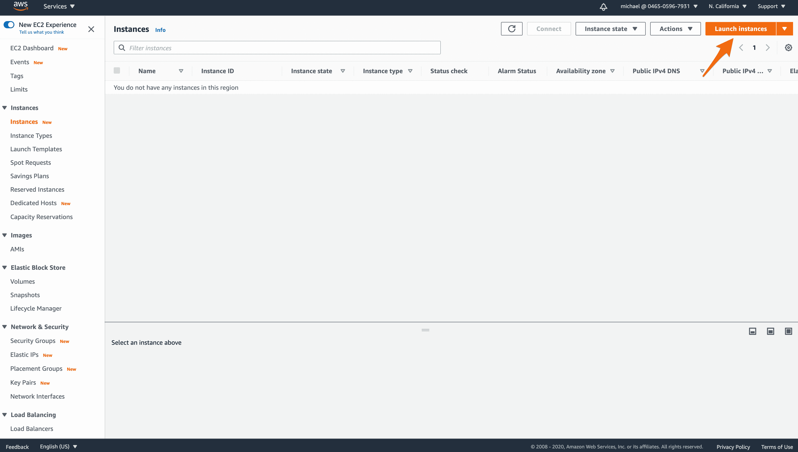
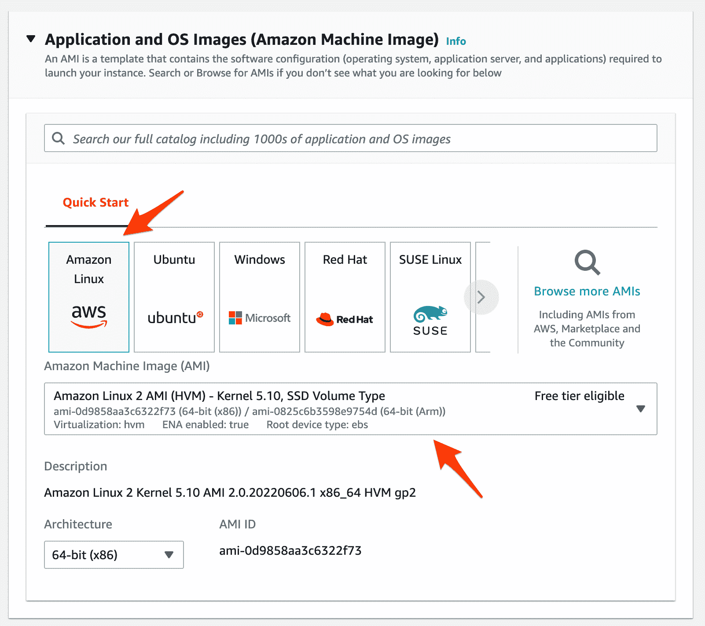
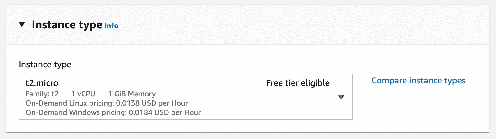
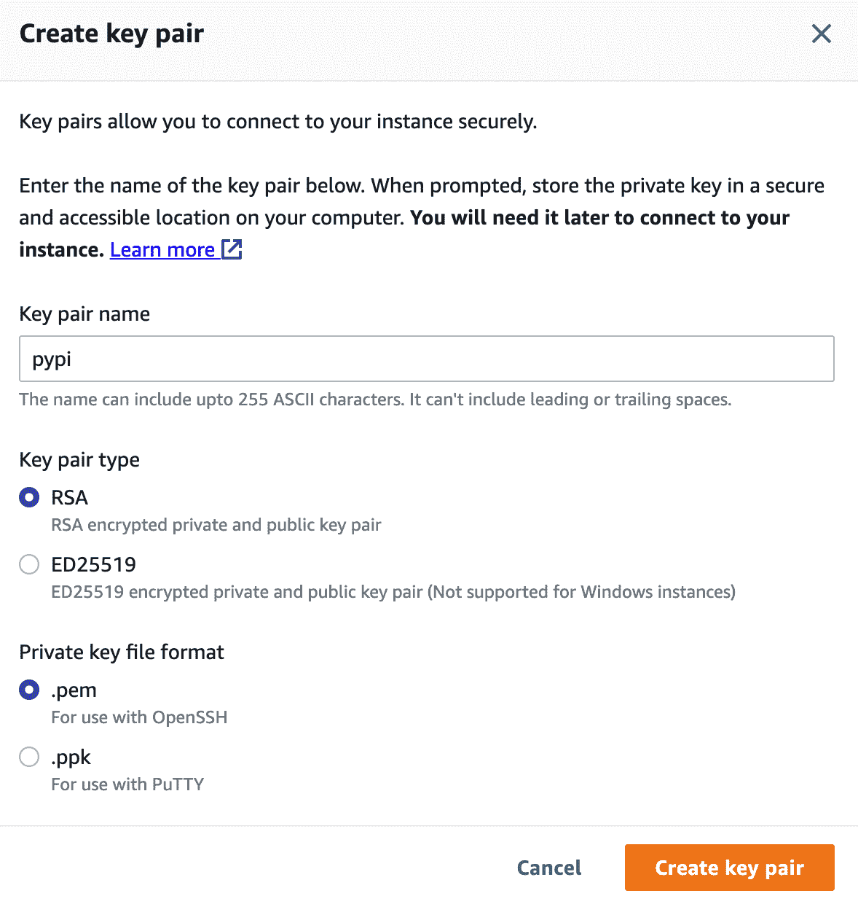
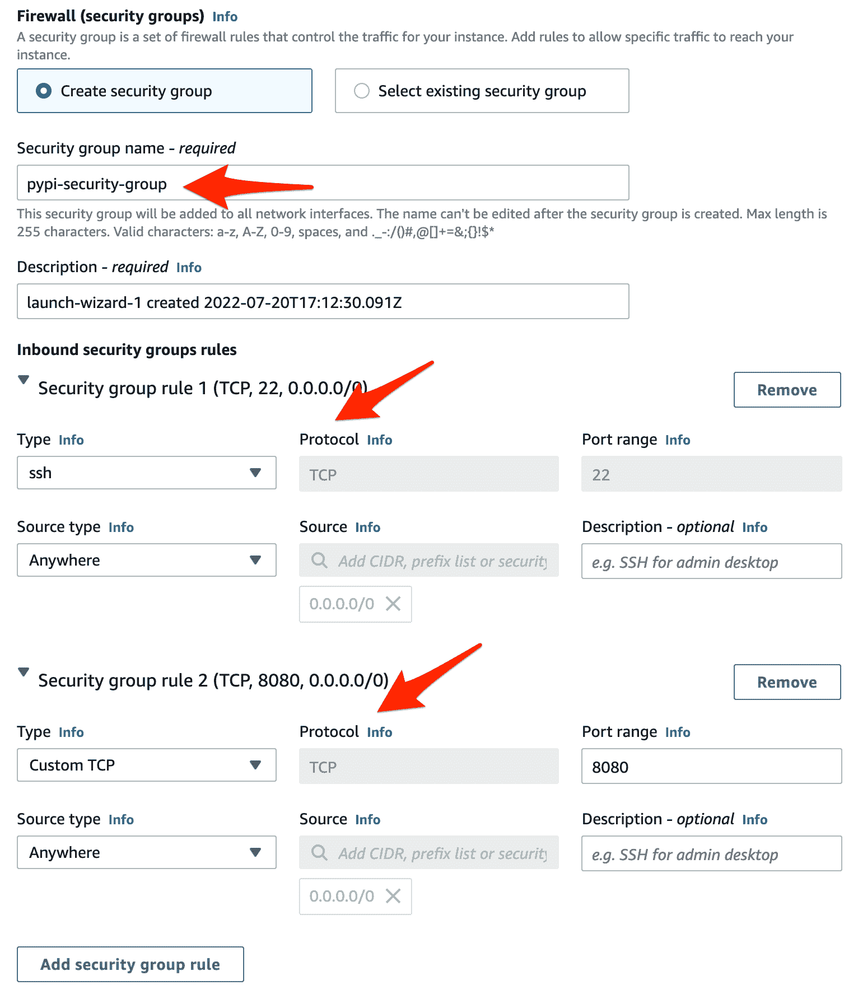
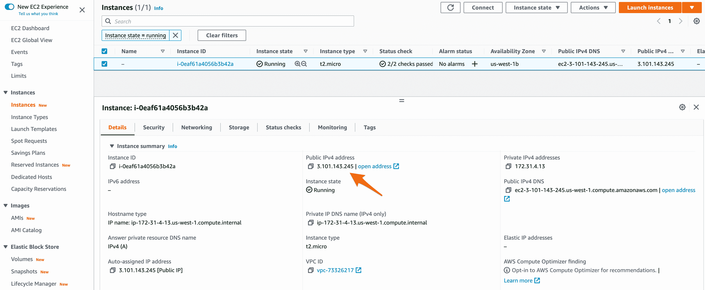
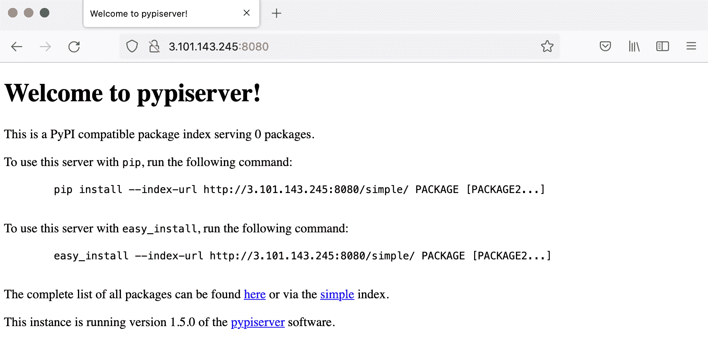

# 设置私有 PyPI 服务器

> 原文：<https://testdriven.io/blog/private-pypi/>

在本教程中，我们将看看如何使用 [pypiserver](https://github.com/pypiserver/pypiserver) 、一个 [PyPI](https://pypi.org/) 兼容服务器和 Docker 来建立你自己的私有 PyPI 服务器。我们将在 AWS EC2 实例上托管服务器。

## AWS 设置

让我们首先设置一个 EC2 实例，它将用于托管您的 PyPI 服务器。

首先，你需要[注册](https://portal.aws.amazon.com/billing/signup)一个 [AWS](https://aws.amazon.com/) 账户(如果你还没有的话)。

> 设置您的第一个 AWS 帐户？
> 
> 创建一个非根 IAM 用户是一个好主意，具有“管理员访问”和“计费”策略，并通过 CloudWatch 发出计费警报，以便在您的 AWS 使用成本超过一定金额时提醒您。有关更多信息，请查看[锁定您的 AWS 帐户 Root 用户访问密钥](https://docs.aws.amazon.com/IAM/latest/UserGuide/best-practices.html#lock-away-credentials)和[分别创建计费警报](https://docs.aws.amazon.com/awsaccountbilling/latest/aboutv2/tracking-free-tier-usage.html)。

### EC2

登录 [AWS 控制台](https://console.aws.amazon.com/console/home)，导航到 [EC2 控制台](https://console.aws.amazon.com/ec2/v2/home)，点击左侧边栏的“实例”。然后，单击“启动实例”按钮:



接下来，坚持使用基本的亚马逊 Linux AMI:



使用一个`t2.micro` [实例类型](https://aws.amazon.com/ec2/instance-types/):



创建一个新的[密钥对](https://docs.aws.amazon.com/AWSEC2/latest/UserGuide/ec2-key-pairs.html)，这样就可以通过 SSH 连接到实例。保存这个*。pem* 文件放在安全的地方。



> 在 Mac 或 Linux 机器上？建议保存*。pem* 文件保存到“/用户/$用户/”。ssh "目录。一定要设置适当的权限，例如`chmod 400 ~/.ssh/pypi.pem`。

在“网络设置”下，我们将坚持使用默认的 VPC，以保持本教程的简单，但可以随时更新。

接下来，创建一个名为`pypi-security-group`的新安全组(类似于防火墙)，确保至少打开端口 22(用于 SSH)和 8080(用于 HTTP 流量)。



单击“启动实例”创建新实例。在“启动状态”页面上，单击“查看所有实例”。然后，在主实例页面上，获取新创建的实例的公共 IP:



### 码头工人

实例启动并运行后，我们现在可以在其上安装 Docker 了。

使用您的密钥对 SSH 到实例中，如下所示:

首先安装并启动 Docker 的最新版本和 Docker Compose 的 2.7.0 版本:

```py
`[ec2-user]$ sudo yum update -y
[ec2-user]$ sudo yum install -y docker
[ec2-user]$ sudo service docker start

[ec2-user]$ sudo curl -L "https://github.com/docker/compose/releases/download/v2.7.0/docker-compose-$(uname -s)-$(uname -m)" -o /usr/local/bin/docker-compose
[ec2-user]$ sudo chmod +x /usr/local/bin/docker-compose

[ec2-user]$ docker --version
Docker version 20.10.13, build a224086

[ec2-user]$ docker-compose --version
Docker Compose version v2.7.0` 
```

将`ec2-user`添加到`docker`组，这样您就可以执行 Docker 命令，而不必使用`sudo`:

```py
`[ec2-user]$ sudo usermod -a -G docker ec2-user` 
```

为了使更改生效，您需要退出 SSH 会话并重新登录。

## pypi 设置

如果您还没有这样做，请 SSH 回到实例中。

首先为 PyPI 服务器创建一个新的项目目录:

```py
`[ec2-user]$ mkdir /home/ec2-user/pypi
[ec2-user]$ cd /home/ec2-user/pypi` 
```

添加 a *坞站-复合. yml* 文件:

```py
`version:  '3.7' services: pypi-server: image:  pypiserver/pypiserver:latest ports: -  8080:8080 volumes: -  type:  volume source:  pypi-server target:  /data/packages command:  -P . -a . /data/packages restart:  always volumes: pypi-server:` 
```

注意事项:

1.  我们定义了一个名为`pypi-server`的服务，它使用了 [pypiserver](https://hub.docker.com/r/pypiserver/pypiserver) Docker 映像。
2.  我们还定义了一个名为`pypi-server`的命名卷，它映射到容器中的“/data/packages”文件夹。如果容器由于某种原因关闭，卷和上传的 PyPI 包将会持续存在。
3.  `-P . -a .`允许未经授权的访问，而`/data/packages`表示将从容器中的“/data/packages”文件夹提供包。

继续旋转容器:

```py
`[ec2-user]$ docker-compose up -d --build` 
```

完成后，获取实例 IP，并在浏览器中导航到`http://<PUBLIC-IP-ADDRESS>:8080`。您应该会看到类似如下的内容:



## 上传和下载(无授权)

如果您还没有想要用来测试您的 PyPI 服务器的包，那么继续克隆 [private-pypi](https://github.com/testdrivenio/private-pypi) repo。

转到“sample-package”文件夹，创建并激活一个虚拟环境，然后压缩该包:

安装[捆绳](https://twine.readthedocs.io/):

然后，将包上传到您的 PyPI 服务器:

```py
`$  twine  upload  --repository-url  http://<PUBLIC-IP-ADDRESS>:8080  dist/* # example: # twine upload --repository-url http://3.101.143.245:8080 dist/*` 
```

系统将提示您输入用户名和密码。因为我们目前允许未经授权的访问，所以现在让它们都保持空白。如果一切顺利，您应该会看到如下内容:

```py
`Uploading distributions to http://3.101.143.245:8080
Enter your username:
Enter your password:
Uploading muddy_wave-0.1.tar.gz
100%|█████████████████████████████████████████████| 3.64k/3.64k [00:00<00:00, 30.6kB/s]` 
```

要安装您的软件包，请运行:

```py
`$ pip install --index-url http://<PUBLIC-IP-ADDRESS>:8080 muddy_wave --trusted-host <PUBLIC-IP-ADDRESS>

# example:
# pip install --index-url http://3.101.143.245:8080 muddy_wave --trusted-host 3.101.143.245` 
```

您应该会看到类似这样的内容:

```py
`Looking in indexes: http://3.101.143.245:8080
Collecting muddy_wave
  Downloading http://3.101.143.245:8080/packages/muddy_wave-0.1.tar.gz (1.0 kB)
Using legacy 'setup.py install' for muddy-wave, since package 'wheel' is not installed.
Installing collected packages: muddy-wave
    Running setup.py install for muddy-wave ... done
Successfully installed muddy-wave-0.1` 
```

您可以在 shell 中测试包:

```py
`>>> import muddy_wave
>>> muddy_wave.hello_world()
hello, world!` 
```

您还应该能够在浏览器中查看`http://<PUBLIC-IP-ADDRESS>:8080/packages/`的包。

至此，让我们看看如何添加身份验证。

## 证明

对于 auth，我们将使用带有 [htpasswd](https://github.com/pypiserver/pypiserver#apache-like-authentication-htpasswd) 的基本认证。

SSH 回到实例，并通过 [httpd-tools](https://www.mankier.com/package/httpd-tools) 安装 htpasswd:

```py
`[ec2-user]$ sudo yum install -y httpd-tools` 
```

创建一个“授权”文件夹:

```py
`[ec2-user]$ mkdir /home/ec2-user/pypi/auth
[ec2-user]$ cd /home/ec2-user/pypi/auth` 
```

现在，创建您的第一个用户:

```py
`[ec2-user]$ htpasswd -sc .htpasswd <SOME-USERNAME>` 
```

> 使用`htpasswd -s .htpasswd <SOME-USERNAME>`添加其他用户。

接下来，更新 Docker 合成文件，如下所示:

```py
`version:  '3.7' services: pypi-server: image:  pypiserver/pypiserver:latest ports: -  8080:8080 volumes: -  type:  bind source:  /home/ec2-user/pypi/auth target:  /data/auth -  type:  volume source:  pypi-server target:  /data/packages command:  -P /data/auth/.htpasswd -a update,download,list /data/packages restart:  always volumes: pypi-server:` 
```

注意事项:

1.  我们定义了一个绑定挂载来挂载“/home/ec2-user/pypi/auth”文件夹(其中的*)。htpasswd* 文件驻留)到容器内的“/data/auth”。
2.  我们还更新了命令，使 */data/auth/。htpasswd* 用作密码文件(`-P /data/auth/.htpasswd`)，更新、下载和列表命令需要认证(`-a update,download,list`)。

更新容器:

```py
`[ec2-user]$ cd /home/ec2-user/pypi
[ec2-user]$ docker-compose up -d --build` 
```

要进行测试，请导航至`http://<PUBLIC-IP-ADDRESS>:8080/packages/`。应该会提示您输入用户名和密码。

## 上传和下载(带授权)

要上传，请在 *sample-package/setup.py* 中插入版本:

```py
`from setuptools import setup

setup(
    name='muddy_wave',
    packages=['muddy_wave'],
    description='Hello, world!',
    version='0.2',  # updated
    url='http://github.com/testdrivenio/private-pypi/sample-package',
    author='Michael Herman',
    author_email='[[email protected]](/cdn-cgi/l/email-protection)',
    keywords=['pip', 'pypi']
)` 
```

删除与以前版本相关联的文件和文件夹:

```py
`$ rm -rf build dist muddy_wave.egg-info .eggs` 
```

创建新版本:

上传包:

```py
`$  twine  upload  --repository-url  http://<PUBLIC-IP-ADDRESS>:8080  dist/* # example: # twine upload --repository-url http://3.101.143.245:8080 dist/*` 
```

确保在提示时输入您的用户名和密码。

如果您不想每次都添加 URL 或者输入您的用户名和密码，那么将 PyPI 服务器的配置添加到您的[中。pypirc](https://packaging.python.org/specifications/pypirc/) 文件，它应该位于您的主目录中——例如 *~/。pypirc* 。

例如:

```py
`[distutils] index-servers= pypi aws [pypi] username: michael password: supersecret [aws] repository: http://3.101.143.245:8080 username: michael password: supersecret` 
```

要上传，请运行:

```py
`$ twine upload --repository aws dist/*` 
```

要安装新版本，请运行:

```py
`$ pip install --index-url http://<PUBLIC-IP-ADDRESS>:8080 muddy_wave==0.2 --trusted-host <PUBLIC-IP-ADDRESS>

# example:
# pip install --index-url http://3.101.143.245:8080 muddy_wave==0.2 --trusted-host 3.101.143.245` 
```

系统将提示您输入用户名和密码:

```py
`Looking in indexes: http://3.101.143.245:8080
User for 3.101.143.245:8080: michael
Password:
Collecting muddy_wave==0.2
  Downloading http://3.101.143.245:8080/packages/muddy_wave-0.2.tar.gz (1.0 kB)
Using legacy 'setup.py install' for muddy-wave, since package 'wheel' is not installed.
Installing collected packages: muddy-wave
  Attempting uninstall: muddy-wave
    Found existing installation: muddy-wave 0.1
    Uninstalling muddy-wave-0.1:
      Successfully uninstalled muddy-wave-0.1
    Running setup.py install for muddy-wave ... done
Successfully installed muddy-wave-0.2` 
```

如果您不想每次都添加`--index-url http://3.101.143.245:8080`和`-trusted-host 3.101.143.245`，那么可以将 PyPI 服务器的配置添加到您的 [pip.conf](https://pip.pypa.io/en/stable/user_guide/#config-file) 文件中，该文件也应该位于您的主目录中——例如， *~/。pip/pip.conf* 。

例如:

```py
`[global] extra-index-url  =  http://3.101.143.245:8080 trusted-host  =  3.101.143.245` 
```

现在，要安装，运行:

```py
`$ pip install muddy_wave==0.2` 
```

输出:

```py
`Looking in indexes: https://pypi.org/simple, http://3.101.143.245:8080
User for 3.101.143.245:8080: mjhea0
Password:
Collecting muddy_wave==0.2
  Downloading http://3.101.143.245:8080/packages/muddy_wave-0.2.tar.gz (1.0 kB)
Using legacy 'setup.py install' for muddy-wave, since package 'wheel' is not installed.
Installing collected packages: muddy-wave
  Attempting uninstall: muddy-wave
    Found existing installation: muddy-wave 0.3
    Uninstalling muddy-wave-0.3:
      Successfully uninstalled muddy-wave-0.3
    Running setup.py install for muddy-wave ... done
Successfully installed muddy-wave-0.2` 
```

## 支持 HTTPS

建议配置 HTTPS，因为用户名和密码是通过 HTTP 明文发送的。有许多不同的方法可以实现这一点。几个例子:

第三种方法是最简单的。您需要用[证书管理器](https://aws.amazon.com/certificate-manager/)设置一个 SSL 证书，用[应用负载平衡器](https://aws.amazon.com/elasticloadbalancing/)创建一个 HTTPS 监听器，然后通过[目标组](https://docs.aws.amazon.com/elasticloadbalancing/latest/application/load-balancer-target-groups.html)将 443 流量代理到实例上的 HTTP 端口 80。