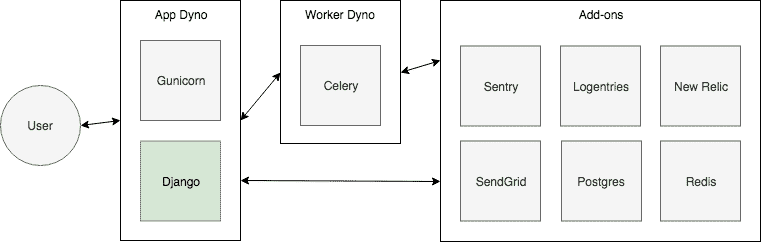

# 在 Heroku 部署 Django 生产

> 原文：<https://testdriven.io/blog/production-django-deployments-on-heroku/>

我们使用 Heroku 来托管 [TestDriven.io](https://testdriven.io/) 学习平台，以便我们可以专注于应用程序开发，而不是配置 web 服务器、安装 Linux 包、设置负载平衡器以及传统服务器上基础架构管理的所有其他工作。

本文旨在简化在 Heroku 上部署、维护和扩展生产级 Django 应用程序的过程。

我们还将回顾一些简化部署过程的技巧和诀窍。最后，您会发现一份用于将新应用部署到生产环境的生产清单。

## Heroku

为什么是 Heroku？像姜戈一样，Heroku 信奉“包含电池”的哲学。这是一个固执己见的环境，但也是一个您不必管理的环境——因此您可以专注于应用程序开发，而不是支持它的环境。

如果你使用自己的基础设施或基础设施即服务(IaaS)解决方案，例如 [DigitalOcean Droplets](https://m.do.co/c/d8f211a4b4c2) 、[亚马逊 EC2](https://aws.amazon.com/ec2/) 、[谷歌计算引擎](https://cloud.google.com/compute/)，你必须雇用一名系统管理/开发运维工程师或自己承担这一角色。前者要花钱，而后者会降低你的速度。Heroku 的托管成本可能会高于 IaaS 解决方案，但您将节省资金，因为您不需要雇用人员来管理基础架构，并且您可以更快地运行应用程序，这是最终最重要的。

小贴士:

1.  确保你使用的 Heroku 是最新的 Heroku 栈。
2.  使用 [uWSGI](https://uwsgi-docs.readthedocs.io) 或 [Gunicorn](https://gunicorn.org/) 作为你的[生产 WSGI 服务器](https://docs.djangoproject.com/en/3.1/howto/deployment/wsgi/)。哪一个都可以。如果您不知道为什么您更喜欢一个 WSGI 服务器而不是另一个，这并不重要。以后再切换也不难。
3.  使用 [Celery](https://docs.celeryq.dev/en/stable/) 或 [RQ](http://python-rq.org/) 以及 [Heroku Redis](https://elements.heroku.com/addons/heroku-redis) 插件，在 web 应用程序之外异步运行长时间运行或 CPU 密集型流程，如电子邮件交付或 PDF 报告生成。作为参考，我们使用 [Django-RQ](https://github.com/rq/django-rq) 。
4.  运行至少两个 web 和后台进程以实现[冗余](https://devcenter.heroku.com/articles/production-check#dyno-redundancy)。
5.  使用 [SSL](https://https.cio.gov/everything/) 。
6.  遵循[十二因素 App](https://12factor.net/) 方法。
7.  添加[缓存](/blog/django-caching/)。

## 数据库ˌ资料库

小贴士:

1.  使用 Heroku [标准](https://devcenter.heroku.com/articles/heroku-postgres-plans#standard-tier)(或更高)层 [Postgres](https://elements.heroku.com/addons/heroku-postgresql) 数据库。回顾每层的磁盘空间、内存和并发连接限制，以及 Django 文章中的[并发和数据库连接。](https://devcenter.heroku.com/articles/python-concurrency-and-database-connections)
2.  通过 [Heroku PGBackups](https://devcenter.heroku.com/articles/heroku-postgres-backups#scheduling-backups) 安排生产数据库的每日备份。
3.  通过不时压缩或重置迁移，保持迁移的整洁和可管理性。

## 持续集成和交付

Heroku 运行时是无状态和不可变的，这有助于实现连续交付。在每次应用程序部署时，都会构建、配置一个新的虚拟机，并将其投入生产。

正因为如此，你无需担心:

1.  当 Heroku 通过一个 [Dyno 管理器](https://devcenter.heroku.com/articles/dynos#the-dyno-manager)为你处理时，使用一个进程管理器来支持你的服务。
2.  配置用于更新和重新启动应用程序的部署机制。

Heroku 与许多持续集成(CI)服务合作，如 [Circle](https://circleci.com/) 和 [Travis](https://travis-ci.org/) ，他们也提供自己的 CI 解决方案- [Heroku CI](https://www.heroku.com/continuous-integration) 。

小贴士:

1.  设置自动部署。由于人为错误，手动部署容易出错。
2.  在您的生产 CI 构建中运行 [Django 部署清单](https://docs.djangoproject.com/en/3.1/howto/deployment/checklist/) ( `manage.py check --deploy`)。
3.  在 [TestDriven.io](https://testdriven.io/) 中，我们使用了一种形式的 [GitOps](https://www.weave.works/blog/what-is-gitops-really) ，其中应用程序的状态始终保存在 git 中，对试运行和生产环境的更改仅发生在 CI 中。考虑使用这种方法来帮助加速开发并引入稳定的回滚系统。
4.  定期部署，在开发人员有空的预定时间部署，以防出现问题。
5.  使用 release 标签，这样你就能确切地知道哪个版本的代码正在生产中运行——也就是`git tag -a "$ENVIRONMENT/${VERSION}"`。

小贴士:

1.  对静态文件使用[whiten noise](http://whitenoise.evans.io)然后在它前面扔一个 CDN，像 [Cloudflare](https://cloudflare.com/) 或者 [CloudFront](https://aws.amazon.com/cloudfront/) 。
2.  对于用户上传的媒体文件，使用 [S3 和 django-storages](/blog/storing-django-static-and-media-files-on-amazon-s3/) 。

## 环境

小贴士:

1.  对于暂存，使用不同的 Heroku 应用程序。确保在不使用时打开[维护模式](https://devcenter.heroku.com/articles/maintenance-mode),这样谷歌爬虫就不会无意中发现它。

## 测试

编写测试。测试是一种保护措施，因此您不会意外地更改应用程序的功能。从您的测试套件中本地捕获 bug 比在生产环境中由客户捕获要好得多。

小贴士:

1.  忽略传统的测试金字塔。花一半的时间写 Django 单元测试(同时用 [pytest](https://docs.pytest.org) 和[假设](https://hypothesis.works))。另一半时间用 [Cypress](https://www.cypress.io/) 编写基于浏览器的集成和端到端测试。与 Selenium 相比，Cypress 测试更容易编写和维护。我们建议将 Cypress 整合到您的日常 TDD 工作流程中。查看[现代前端测试和 Cypress](https://testdriven.io/blog/modern-frontend-testing-with-cypress/) 了解更多信息。

## 监控和记录

监控和日志记录是应用可靠性的重要组成部分，使其更容易:

1.  在早期阶段发现错误。
2.  了解你的应用是如何工作的。
3.  分析性能。
4.  确定您的应用程序是否正常运行。

您的日志应该总是有时间戳和日志级别。它们也应该是人类可读且易于解析的。

在监控方面，设置警报来帮助减少和抢先停机。设置通知，以便您可以在客户开始抱怨之前解决问题和瓶颈。

如你所见，Heroku 通过[附加](https://elements.heroku.com/addons)系统提供了许多服务。这个系统是你从 Heroku 获得的强大工具之一。您可以随意使用数百个服务，只需几分钟即可完成配置，其中许多服务对于日志记录、监控和错误跟踪非常有用。

小贴士:

1.  Heroku 只保留最近的 1500 行合并日志，这只是几秒钟的日志。因此，您需要将日志发送到一个远程日志服务，比如 [Logentries](https://elements.heroku.com/addons/logentries) ，以聚合您的所有日志。
2.  使用 [Scout](https://elements.heroku.com/addons/scout) 进行应用程序性能监控，以便跟踪性能问题。
3.  使用 [Sentry](https://elements.heroku.com/addons/sentry) 进行异常监控，以便在应用程序出现错误时获得通知。
4.  您可以直接从 Heroku 的[应用程序指标](https://devcenter.heroku.com/articles/metrics)仪表板监控内存使用和 CPU 负载等基本情况。
5.  使用 [Uptime Robot](https://uptimerobot.com/) ，它没有 Heroku 附加组件，以确保您的网站正常运行。

## 安全性

说到安全，人一般是最薄弱的环节。您的开发团队应该知道一些更常见的安全漏洞。[工程师安全培训](https://sudo.pagerduty.com/for_engineers/)和 Heroku 的[安全](https://devcenter.heroku.com/categories/security)指南以及以下 [OWASP](https://www.owasp.org) 备忘单都是很好的起点:

1.  [跨站点请求伪造(CSRF)防范](https://github.com/OWASP/CheatSheetSeries/blob/master/cheatsheets/Cross-Site_Request_Forgery_Prevention_Cheat_Sheet.md)
2.  [XSS(跨站脚本)防范](https://github.com/OWASP/CheatSheetSeries/blob/master/cheatsheets/Cross_Site_Scripting_Prevention_Cheat_Sheet.md)
3.  [基于 DOM 的 XSS 预防](https://github.com/OWASP/CheatSheetSeries/blob/master/cheatsheets/DOM_based_XSS_Prevention_Cheat_Sheet.md)
4.  [内容安全策略](https://github.com/OWASP/CheatSheetSeries/blob/master/cheatsheets/Content_Security_Policy_Cheat_Sheet.md)

小贴士:

1.  使用 [Snyk](https://elements.heroku.com/addons/snyk) 保持您的依赖关系最新。
2.  引入节流机制，如 [Django Ratelimit](https://django-ratelimit.readthedocs.io) ，以限制 DDoS 攻击的影响。
3.  将应用程序的配置与代码分开，以防止敏感凭据被签入源代码管理。
4.  监控和记录可疑行为，例如来自特定来源的多次失败登录尝试和异常流量峰值。查看用于实时安全监控的[加急 WAF](https://elements.heroku.com/addons/expeditedwaf) 附件。
5.  使用 [Bandit](https://bandit.readthedocs.io) 检查您的 Python 代码中的常见安全问题。
6.  部署完成后，在[Pony check](https://www.ponycheckup.com/)通过自动安全检查运行您的站点。
7.  [验证上传文件内容类型和大小](https://www.djangosnippets.org/snippets/1303/)。

## 结论

希望本文提供了一些有用的信息，有助于简化在 Heroku 上部署和维护 Django 生产应用程序的过程。

记住:Web 开发是复杂的，因为所有的移动部分都是复杂的。您可以通过以下方式应对这一问题:

1.  把问题分解成小的、容易理解的子问题。理想情况下，您可以将这些子问题转化为已经解决的问题。
2.  通过使用 Django 和 Heroku 来完全去除碎片——这两者都使得开发和部署安全、可伸缩和可维护的 web 应用程序变得更加容易，因为它们包含了稳定性和“包含电池”的理念。

好奇 Heroku 的完整架构是什么样子？

一旦配置好 Celery 和 Gunicorn，您就可以将大部分时间(如果不是全部的话)集中在开发应用程序上——其他一切都是附加的。

推荐资源:

1.  [如何部署软件](https://zachholman.com/posts/deploying-software)
2.  [关于 Web 应用部署的思考](https://web.archive.org/web/20201112025258/https://omniti.com/seeds/thoughts-on-web-application-deployment.html)

## 生产清单

向 Heroku 部署新的 Django 应用程序？查看以下清单以获取帮助。确保在整个过程中记录部署工作流。

### 部署前

**前端**:

1.  拼写检查 Django 模板。
2.  设置收藏夹图标。
3.  [自定义](https://docs.djangoproject.com/en/3.1/howto/deployment/checklist/#customize-the-default-error-views)默认错误视图。
4.  添加一个 [robots.txt](https://www.cloudflare.com/learning/bots/what-is-robots.txt/) 文件。
5.  [创建](https://docs.djangoproject.com/en/3.1/ref/contrib/sitemaps/)一个 sitemap.xml 文件。
6.  [压缩优化](https://images.guide/)所有图像。
7.  设置[谷歌分析](https://analytics.google.com/analytics/web)。
8.  配置 SSL。
9.  为前端资产配置 CDN 提供商，如 [Cloudflare](https://www.cloudflare.com/) 。

姜戈:

1.  匿名化生产 Django 管理 URL。
2.  可选地添加 [django-cors-headers](https://github.com/adamchainz/django-cors-headers) 应用程序，将跨源资源共享(cors)头添加到响应中。
3.  考虑使用 [ATOMIC_REQUESTS](https://docs.djangoproject.com/en/3.1/topics/db/transactions/#tying-transactions-to-http-requests) 。
4.  为生产配置以下 [Django 设置](https://docs.djangoproject.com/en/3.1/topics/settings/):

**持续集成**:

1.  设置 CI 服务。
2.  根据生产设置运行`python manage.py check --deploy`。
3.  配置要运行的任何其他 linters 和/或代码分析工具。
4.  测试 CI 流程。
5.  配置自动部署。

英雄:

1.  确保使用最新的 [Heroku 栈](https://devcenter.heroku.com/articles/stack)和 Python 版本。
2.  配置 [Postgres](https://elements.heroku.com/addons/heroku-postgresql) 和 [Redis](https://elements.heroku.com/addons/heroku-redis) 附加组件。
3.  设置数据库[备份](https://devcenter.heroku.com/articles/heroku-postgres-backups)。
4.  配置剩余的 Heroku 插件——即[日志条目](https://elements.heroku.com/addons/logentries)、[侦察兵](https://elements.heroku.com/addons/scout)、[哨兵](https://elements.heroku.com/addons/sentry)和[发送网格](https://elements.heroku.com/addons/sendgrid)。
5.  设置环境变量。
6.  为冗余设置至少两个 web 和工作进程。

### 部署后

**前端**:

1.  运行 [Mozilla Observatory](https://observatory.mozilla.org/) 、 [Google PageSpeed](https://developers.google.com/speed/pagespeed/) 、 [Google Mobile-Friendly](https://search.google.com/test/mobile-friendly) 、 [webhint](https://webhint.io/) 和 [Netsparker 安全标题](https://securityheaders.com/)扫描。
2.  使用 [WAVE 工具](http://wave.webaim.org/)来测试你的页面是否符合可访问性标准。
3.  查看[前端清单](https://github.com/thedaviddias/Front-End-Checklist)。
4.  运行一个 [SSL 服务器测试](https://www.ssllabs.com/ssltest/index.html)。
5.  运行自动化测试(如果有的话),或者从浏览器手动测试你的应用。
6.  验证 301 重定向配置是否正确。
7.  设置[谷歌标签管理器](https://tagmanager.google.com/)。
8.  配置[正常运行时间机器人](https://uptimerobot.com/)。

干杯！