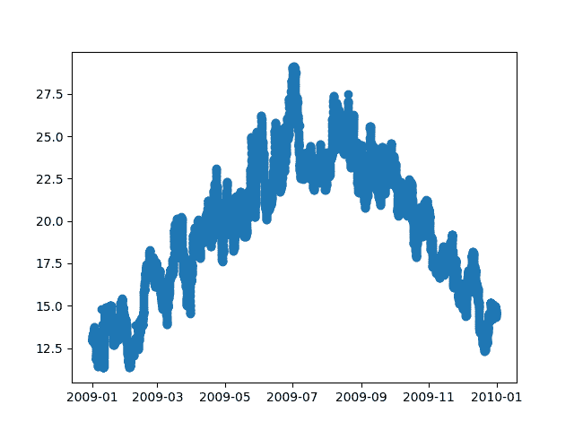
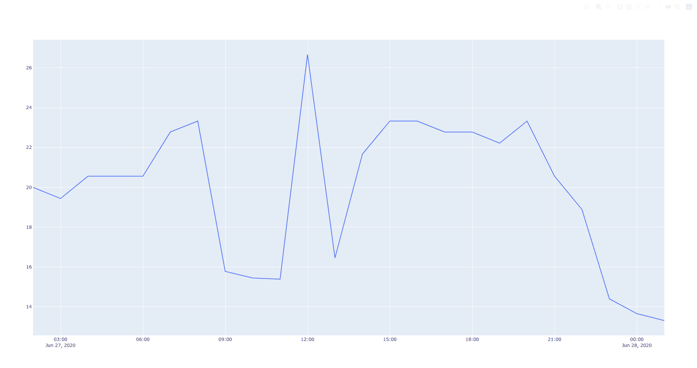

# Python 依赖注入

> 原文：<https://testdriven.io/blog/python-dependency-injection/>

编写干净、可维护的代码是一项具有挑战性的任务。幸运的是，有许多模式、技术和可重用的解决方案可以让我们更容易地完成这项任务。依赖注入是这些技术中的一种，用于编写松散耦合但高度内聚的代码。

在本文中，我们将向您展示如何在开发绘制历史天气数据的应用程序时实现依赖注入。使用测试驱动开发开发初始应用程序后，您将使用依赖注入来分解应用程序的各个部分，使其更易于测试、扩展和维护。

到本文结束时，您应该能够解释什么是依赖注入，并使用测试驱动开发(TDD)在 Python 中实现它。

## 什么是依赖注入？

在软件工程中，[依赖注入](https://en.wikipedia.org/wiki/Dependency_injection)是一种一个对象接收它所依赖的其他对象的技术。

1.  它被引入来管理一个人的代码库的复杂性。
2.  它有助于简化测试、扩展代码和维护。
3.  大多数允许将对象和函数作为参数传递的语言都支持它。不过，在 Java 和 C#中，你会听到更多关于依赖注入的内容，因为它很难实现。另一方面，由于 Python 的动态类型化和它的[鸭子类型化](https://en.wikipedia.org/wiki/Duck_typing)系统，它很容易实现，因此不太引人注意。Django、Django REST 框架和 FastAPI 都利用了依赖注入。

好处:

1.  方法更容易测试
2.  依赖性更容易被模仿
3.  每当我们扩展应用程序时，测试不必改变
4.  扩展应用程序更容易
5.  维护应用程序更容易

> 更多内容，请参考马丁·福勒的 T2 形式的依赖注入文章。

要了解它的实际应用，让我们看几个真实的例子。

## 绘制历史天气数据

场景:

1.  您已经决定构建一个应用程序，用于根据天气历史数据绘制图表。
2.  你已经下载了伦敦 2009 年每小时的温度数据。
3.  你的目标是绘制数据图，看看温度是如何随时间变化的。

### 基本思想

首先，创建(并激活)一个虚拟环境。然后，安装 [pytest](https://docs.pytest.org/) 和 [Matplotlib](https://matplotlib.org/) :

```py
`(venv)$ pip install pytest matplotlib` 
```

用两种方法开始一个类似乎是合理的:

1.  `read` -从 CSV 读取数据
2.  `draw` -画一个情节

### 从 CSV 读取数据

因为我们需要从 CSV 文件中读取历史天气数据，所以`read`方法应该满足以下标准:

*   给定一个`App`类
*   当用 CSV 文件名调用`read`方法时
*   然后来自 CSV 的数据应该返回到一个字典中，其中*键*是 ISO 8601 格式的日期时间字符串(`'%Y-%m-%dT%H:%M:%S.%f'`)，而*值*是当时测量的温度

创建一个名为 *test_app.py* 的文件:

```py
`import datetime
from pathlib import Path

from app import App

BASE_DIR = Path(__file__).resolve(strict=True).parent

def test_read():
    app = App()
    for key, value in app.read(file_name=Path(BASE_DIR).joinpath('london.csv')).items():
        assert datetime.datetime.fromisoformat(key)
        assert value - 0 == value` 
```

因此，该测试检查:

1.  每个键都是一个 ISO 8601 格式的日期时间字符串(使用`datetime`包中的`fromisoformat`函数)
2.  每个值都是数字(使用数字的属性`x - 0 = x`)

> Python 3.7 中添加了来自`datetime`包的`fromisoformat`方法。参考官方 Python [文档](https://docs.python.org/3.8/library/datetime.html#datetime.datetime.fromisoformat)了解更多信息。

运行测试以确保失败:

```py
`(venv)$ python -m pytest .` 
```

您应该看到:

```py
`E   ModuleNotFoundError: No module named 'app'` 
```

现在要实现`read`方法，为了让测试通过，添加名为 *app.py* 的新文件:

```py
`import csv
import datetime
from pathlib import Path

BASE_DIR = Path(__file__).resolve(strict=True).parent

class App:

    def read(self, file_name):
        temperatures_by_hour = {}
        with open(Path(BASE_DIR).joinpath(file_name), 'r') as file:
            reader = csv.reader(file)
            next(reader)  # Skip header row.
            for row in reader:
                hour = datetime.datetime.strptime(row[0], '%d/%m/%Y %H:%M').isoformat()
                temperature = float(row[2])
                temperatures_by_hour[hour] = temperature

        return temperatures_by_hour` 
```

这里，我们添加了一个带有`read`方法的`App`类，该方法将文件名作为参数。在打开和读取 CSV 的内容之后，适当的键(日期)和值(温度)被添加到最终返回的字典中。

假设您已经下载了作为 *london.csv* 的[天气数据](https://www.urban-climate.net/content/images/Southwark_Files/Weather_Data_2009.csv)，测试现在应该通过了:

```py
`(venv)$ python -m pytest .

================================ test session starts ====================================
platform darwin -- Python 3.10.0, pytest-6.2.5, py-1.11.0, pluggy-1.0.0
rootdir: /Users/michael.herman/repos/testdriven/dependency-injection-python/app
collected 1 item

test_app.py .                                                                 [100%]

================================= 1 passed in 0.11s =====================================` 
```

### 绘制情节

接下来，`draw`方法应满足以下标准:

*   给定一个`App`类
*   当使用字典调用`draw`方法时，其中*键*是 ISO 8601 格式的日期时间字符串(`'%Y-%m-%dT%H:%M:%S.%f'`),而*值*是当时测量的温度
*   然后将数据绘制成线图，X 轴表示时间，Y 轴表示温度

为此向 *test_app.py* 添加一个测试:

```py
`def test_draw(monkeypatch):
    plot_date_mock = MagicMock()
    show_mock = MagicMock()
    monkeypatch.setattr(matplotlib.pyplot, 'plot_date', plot_date_mock)
    monkeypatch.setattr(matplotlib.pyplot, 'show', show_mock)

    app = App()
    hour = datetime.datetime.now().isoformat()
    temperature = 14.52
    app.draw({hour: temperature})

    _, called_temperatures = plot_date_mock.call_args[0]
    assert called_temperatures == [temperature]  # check that plot_date was called with temperatures as second arg
    show_mock.assert_called()  # check that show is called` 
```

像这样更新导入:

```py
`import datetime
from pathlib import Path
from unittest.mock import MagicMock

import matplotlib.pyplot

from app import App` 
```

由于我们不想在测试运行期间显示实际的图表，我们使用了`monkeypatch`来模拟`matplotlib`中的`plot_date`函数。然后，用单一温度调用待测方法。最后，我们检查了`plot_date`是否被正确调用(X 和 Y 轴)以及`show`是否被调用。

> 你可以在这里阅读更多关于用 pytest [打猴子补丁的内容，在这里](https://www.patricksoftwareblog.com/monkeypatching-with-pytest/)阅读更多关于嘲笑[的内容。](https://realpython.com/python-mock-library/)

让我们转到方法实现:

1.  它接受一个参数`temperatures_by_hour`，该参数应该是与`read`方法的输出具有相同结构的字典。
2.  它必须将这个字典转换成可以在绘图中使用的两个向量:日期和温度。
3.  应该使用`matplotlib.dates.date2num`将日期转换成数字，以便在绘图中使用。

```py
`def draw(self, temperatures_by_hour):
    dates = []
    temperatures = []

    for date, temperature in temperatures_by_hour.items():
        dates.append(datetime.datetime.fromisoformat(date))
        temperatures.append(temperature)

    dates = matplotlib.dates.date2num(dates)
    matplotlib.pyplot.plot_date(dates, temperatures, linestyle='-')
    matplotlib.pyplot.show()` 
```

进口:

```py
`import csv
import datetime
from pathlib import Path

import matplotlib.dates
import matplotlib.pyplot` 
```

测试现在应该通过了:

```py
`(venv)$ python -m pytest .

================================ test session starts ====================================
platform darwin -- Python 3.10.0, pytest-6.2.5, py-1.11.0, pluggy-1.0.0
rootdir: /Users/michael/repos/testdriven/python-dependency-injection
collected 2 items

test_app.py ..                                                                [100%]

================================= 2 passed in 0.37s =====================================` 
```

*app.py* :

```py
`import csv
import datetime
from pathlib import Path

import matplotlib.dates
import matplotlib.pyplot

BASE_DIR = Path(__file__).resolve(strict=True).parent

class App:

    def read(self, file_name):
        temperatures_by_hour = {}
        with open(Path(BASE_DIR).joinpath(file_name), 'r') as file:
            reader = csv.reader(file)
            next(reader)  # Skip header row.
            for row in reader:
                hour = datetime.datetime.strptime(row[0], '%d/%m/%Y %H:%M').isoformat()
                temperature = float(row[2])
                temperatures_by_hour[hour] = temperature

        return temperatures_by_hour

    def draw(self, temperatures_by_hour):
        dates = []
        temperatures = []

        for date, temperature in temperatures_by_hour.items():
            dates.append(datetime.datetime.fromisoformat(date))
            temperatures.append(temperature)

        dates = matplotlib.dates.date2num(dates)
        matplotlib.pyplot.plot_date(dates, temperatures, linestyle='-')
        matplotlib.pyplot.show()` 
```

*test_app.py* :

```py
`import datetime
from pathlib import Path
from unittest.mock import MagicMock

import matplotlib.pyplot

from app import App

BASE_DIR = Path(__file__).resolve(strict=True).parent

def test_read():
    app = App()
    for key, value in app.read(file_name=Path(BASE_DIR).joinpath('london.csv')).items():
        assert datetime.datetime.fromisoformat(key)
        assert value - 0 == value

def test_draw(monkeypatch):
    plot_date_mock = MagicMock()
    show_mock = MagicMock()
    monkeypatch.setattr(matplotlib.pyplot, 'plot_date', plot_date_mock)
    monkeypatch.setattr(matplotlib.pyplot, 'show', show_mock)

    app = App()
    hour = datetime.datetime.now().isoformat()
    temperature = 14.52
    app.draw({hour: temperature})

    _, called_temperatures = plot_date_mock.call_args[0]
    assert called_temperatures == [temperature]  # check that plot_date was called with temperatures as second arg
    show_mock.assert_called()  # check that show is called` 
```

### 运行应用程序

您已经具备了运行应用程序所需的一切，可以从选定的 CSV 文件中按小时绘制温度图。

让我们使我们的应用程序可以运行。

打开 *app.py* 并在底部添加以下代码片段:

```py
`if __name__ == '__main__':
    import sys
    file_name = sys.argv[1]
    app = App()
    temperatures_by_hour = app.read(file_name)
    app.draw(temperatures_by_hour)` 
```

当 *app.py* 运行时，它首先从分配给`file_name`的命令行参数中读取 CSV 文件，然后绘制图形。

运行应用程序:

```py
`(venv)$ python app.py london.csv` 
```

你应该会看到这样一个情节:



> 如果遇到`Matplotlib is currently using agg, which is a non-GUI backend, so cannot show the figure.`，查[这个栈溢出答案](https://stackoverflow.com/a/60205612/6555866)。

## 解耦数据源

好吧。我们完成了应用程序绘制历史天气数据的初始迭代。它像预期的那样工作，我们很高兴使用它。也就是说，它与 CSV 紧密相关。如果您想使用不同的数据格式呢？比如来自 API 的 JSON 负载。这就是依赖注入发挥作用的地方。

让我们把阅读部分从我们的主 app 中分离出来。

首先，创建名为*test _ urban _ climate _ CSV . py*的新文件:

```py
`import datetime
from pathlib import Path

from app import App
from urban_climate_csv import DataSource

BASE_DIR = Path(__file__).resolve(strict=True).parent

def test_read():
    app = App()
    for key, value in app.read(file_name=Path(BASE_DIR).joinpath('london.csv')).items():
        assert datetime.datetime.fromisoformat(key)
        assert value - 0 == value` 
```

这里的测试与我们在 *test_app.py* 中对`test_read`的测试相同。

其次，添加一个名为 *urban_climate_csv.py* 的新文件。在该文件中，用一个`read`方法创建一个名为`DataSource`的类:

```py
`import csv
import datetime
from pathlib import Path

BASE_DIR = Path(__file__).resolve(strict=True).parent

class DataSource:

    def read(self, **kwargs):
        temperatures_by_hour = {}
        with open(Path(BASE_DIR).joinpath(kwargs['file_name']), 'r') as file:
            reader = csv.reader(file)
            next(reader)  # Skip header row.
            for row in reader:
                hour = datetime.datetime.strptime(row[0], '%d/%m/%Y %H:%M').isoformat()
                temperature = float(row[2])
                temperatures_by_hour[hour] = temperature

        return temperatures_by_hour` 
```

这与我们最初的应用程序中的`read`方法相同，但有一点不同:我们使用`kwargs`是因为我们希望所有的数据源都有相同的接口。因此，我们可以根据数据源添加新的阅读器。

例如:

```py
`from open_weather_csv import DataSource
from open_weather_json import DataSource
from open_weather_api import DataSource

csv_reader = DataSource()
reader.read(file_name='foo.csv')

json_reader = DataSource()
reader.read(file_name='foo.json')

api_reader = DataSource()
reader.read(url='https://foo.bar')` 
```

测试现在应该通过了:

```py
`(venv)$ python -m pytest .

================================ test session starts ====================================
platform darwin -- Python 3.10.0, pytest-6.2.5, py-1.11.0, pluggy-1.0.0
rootdir: /Users/michael/repos/testdriven/python-dependency-injection
collected 2 items

test_app.py ..                                                                [ 66%]
test_urban_climate_csv.py .                                                   [100%]

================================= 3 passed in 0.48s =====================================` 
```

现在，我们需要更新我们的`App`类。

首先，更新 *test_app.py* 中`read`的测试:

```py
`def test_read():
    hour = datetime.datetime.now().isoformat()
    temperature = 14.52
    temperature_by_hour = {hour: temperature}

    data_source = MagicMock()
    data_source.read.return_value = temperature_by_hour
    app = App(
        data_source=data_source
    )
    assert app.read(file_name='something.csv') == temperature_by_hour` 
```

那么是什么改变了呢？我们将`data_source`注入到我们的`App`中。这简化了测试，因为`read`方法只有一个任务:从数据源返回结果。这是依赖注入的第一个好处的例子:**测试更容易，因为我们可以注入底层的依赖**。

也更新对`draw`的测试。同样，我们需要将数据源注入到`App`中，它可以是具有预期接口的“任何东西”——所以 *MagicMock* 会做:

```py
`def test_draw(monkeypatch):
    plot_date_mock = MagicMock()
    show_mock = MagicMock()
    monkeypatch.setattr(matplotlib.pyplot, 'plot_date', plot_date_mock)
    monkeypatch.setattr(matplotlib.pyplot, 'show', show_mock)

    app = App(MagicMock())
    hour = datetime.datetime.now().isoformat()
    temperature = 14.52
    app.draw({hour: temperature})

    _, called_temperatures = plot_date_mock.call_args[0]
    assert called_temperatures == [temperature]  # check that plot_date was called with temperatures as second arg
    show_mock.assert_called()  # check that show is called` 
```

同样更新`App`类:

```py
`import datetime

import matplotlib.dates
import matplotlib.pyplot

class App:

    def __init__(self, data_source):
        self.data_source = data_source

    def read(self, **kwargs):
        return self.data_source.read(**kwargs)

    def draw(self, temperatures_by_hour):
        dates = []
        temperatures = []

        for date, temperature in temperatures_by_hour.items():
            dates.append(datetime.datetime.fromisoformat(date))
            temperatures.append(temperature)

        dates = matplotlib.dates.date2num(dates)
        matplotlib.pyplot.plot_date(dates, temperatures, linestyle='-')
        matplotlib.pyplot.show(block=True)` 
```

首先，我们添加了一个`__init__`方法，以便可以注入数据源。其次，我们更新了`read`方法以使用`self.data_source`和`**kwargs`。看看这个界面简单了多少。`App`不再伴随着数据的读取了。

最后，我们需要在实例创建时将我们的数据源注入到`App`中。

```py
`if __name__ == '__main__':
    import sys
    from urban_climate_csv import DataSource
    file_name = sys.argv[1]
    app = App(DataSource())
    temperatures_by_hour = app.read(file_name=file_name)
    app.draw(temperatures_by_hour)` 
```

再次运行你的应用程序，以确保它仍按预期运行:

```py
`(venv)$ python app.py london.csv` 
```

更新*test _ urban _ climate _ CSV . py*中的`test_read`:

```py
`import datetime

from urban_climate_csv import DataSource

def test_read():
    reader = DataSource()
    for key, value in reader.read(file_name='london.csv').items():
        assert datetime.datetime.fromisoformat(key)
        assert value - 0 == value` 
```

测试通过了吗？

```py
`(venv)$ python -m pytest .

================================ test session starts ====================================
platform darwin -- Python 3.10.0, pytest-6.2.5, py-1.11.0, pluggy-1.0.0
rootdir: /Users/michael/repos/testdriven/python-dependency-injection
collected 2 items

test_app.py ..                                                                [ 66%]
test_urban_climate_csv.py .                                                   [100%]

================================= 3 passed in 0.40s =====================================` 
```

## 添加新的数据源

既然我们已经将`App`从数据源中分离出来，我们可以很容易地添加一个新的数据源。

让我们使用来自 [OpenWeather API](https://openweathermap.org/api/one-call-api) 的数据。继续从 API 下载预先下载的响应:[这里](https://gist.githubusercontent.com/mjhea0/3cfc517f0b02dafb78eec9c921a049da/raw/1bcb225a254fefa6d7658225a55bb7071fb24516/moscow.json)。另存为 *moscow.json* 。

> 如果你愿意，可以随意注册 OpenWeather API 并获取不同城市的历史数据。

添加一个名为*test _ open _ weather _ JSON . py*的新文件，并为一个`read`方法编写一个测试:

```py
`import datetime

from open_weather_json import DataSource

def test_read():
    reader = DataSource()
    for key, value in reader.read(file_name='moscow.json').items():
        assert datetime.datetime.fromisoformat(key)
        assert value - 0 == value` 
```

由于我们使用相同的接口来应用依赖注入，这个测试看起来应该非常类似于 *test_urban_climate_csv* 中的`test_read`。

在静态类型的语言中，像 Java 和 C#，所有的数据源都应该实现相同的接口——即`IDataSource`。多亏了 Python 中的 [duck typing](https://realpython.com/lessons/duck-typing/) ，我们可以实现同名的方法，这些方法为我们的每个数据源采用相同的参数(`**kwargs`):

```py
`def read(self, **kwargs):
    return self.data_source.read(**kwargs)` 
```

接下来，让我们继续实施。

添加名为 *open_weather_json.py* 的新文件。：

```py
`import json
import datetime

class DataSource:

    def read(self, **kwargs):
        temperatures_by_hour = {}
        with open(kwargs['file_name'], 'r') as file:
            json_data = json.load(file)['hourly']
            for row in json_data:
                hour = datetime.datetime.fromtimestamp(row['dt']).isoformat()
                temperature = float(row['temp'])
                temperatures_by_hour[hour] = temperature

        return temperatures_by_hour` 
```

所以，我们使用了`json`模块来读取和加载一个 JSON 文件。然后，我们以与之前类似的方式提取数据。这次我们使用了`fromtimestamp`函数，因为测量时间是以 Unix 时间戳格式编写的。

测试应该会通过。

接下来，更新 *app.py* 来使用这个数据源:

```py
`if __name__ == '__main__':
    import sys
    from open_weather_json import DataSource
    file_name = sys.argv[1]
    app = App(DataSource())
    temperatures_by_hour = app.read(file_name=file_name)
    app.draw(temperatures_by_hour)` 
```

在这里，我们只是更改了导入。

使用 *moscow.json* 作为参数再次运行您的应用程序:

```py
`(venv)$ python app.py moscow.json` 
```

您应该会看到一个包含来自所选 JSON 文件的数据的图。

这是依赖注入的第二个好处的例子:**扩展代码要简单得多**。

我们可以看到:

1.  现有的测试没有改变
2.  为新数据源编写测试很简单
3.  为新数据源实现一个接口也相当简单(您只需要知道数据的形状)
4.  我们不需要对`App`类做任何修改

因此，我们现在可以用简单且可预测的步骤来扩展代码库，而不必接触已经编写好的测试或更改主应用程序。那是强大的。现在，您可以让开发人员专注于添加新的数据源，而无需了解主应用程序的上下文。也就是说，如果你需要一个新的开发人员，他需要了解整个项目的背景，由于分离，他们可能需要更长的时间来适应。

## 分离绘图库

接下来，让我们将绘图部分从应用程序中分离出来，这样我们可以更容易地添加新的绘图库。因为这将是一个类似于数据源解耦的过程，所以在阅读本节的其余部分之前，请自己考虑一下这些步骤。

看看 *test_app.py* 中的`draw`方法的测试:

```py
`def test_draw(monkeypatch):
    plot_date_mock = MagicMock()
    show_mock = MagicMock()
    monkeypatch.setattr(matplotlib.pyplot, 'plot_date', plot_date_mock)
    monkeypatch.setattr(matplotlib.pyplot, 'show', show_mock)

    app = App(MagicMock())
    hour = datetime.datetime.now().isoformat()
    temperature = 14.52
    app.draw({hour: temperature})

    _, called_temperatures = plot_date_mock.call_args[0]
    assert called_temperatures == [temperature]  # check that plot_date was called with temperatures as second arg
    show_mock.assert_called()  # check that show is called` 
```

正如我们所见，它与 Matplotlib 相结合。对绘图库的更改将需要对测试进行更改。这是你真正想要避免的事情。

那么，我们该如何改善这一点呢？

让我们将应用程序的绘图部分提取到它自己的类中，就像我们读取数据源一样。

添加一个名为 *test_matplotlib_plot.py* 的新文件:

```py
`import datetime
from unittest.mock import MagicMock

import matplotlib.pyplot

from matplotlib_plot import Plot

def test_draw(monkeypatch):
    plot_date_mock = MagicMock()
    show_mock = MagicMock()
    monkeypatch.setattr(matplotlib.pyplot, 'plot_date', plot_date_mock)
    monkeypatch.setattr(matplotlib.pyplot, 'show', show_mock)

    plot = Plot()
    hours = [datetime.datetime.now()]
    temperatures = [14.52]
    plot.draw(hours,  temperatures)

    _, called_temperatures = plot_date_mock.call_args[0]
    assert called_temperatures == temperatures  # check that plot_date was called with temperatures as second arg
    show_mock.assert_called()  # check that show is called` 
```

为了实现`Plot`类，添加一个名为 *matplotlib_plot.py* 的新文件:

```py
`import matplotlib.dates
import matplotlib.pyplot

class Plot:

    def draw(self, hours, temperatures):

        hours = matplotlib.dates.date2num(hours)
        matplotlib.pyplot.plot_date(hours, temperatures, linestyle='-')
        matplotlib.pyplot.show(block=True)` 
```

这里，`draw`方法有两个参数:

1.  `hours` -日期时间对象的列表
2.  `temperatures` -一列数字

这是我们未来所有`Plot`类的界面外观。因此，在这种情况下，只要这个接口和底层的`matplotlib`方法保持不变，我们的测试就会保持不变。

运行测试:

```py
`(venv)$ python -m pytest .

================================ test session starts ====================================
platform darwin -- Python 3.10.0, pytest-6.2.5, py-1.11.0, pluggy-1.0.0
rootdir: /Users/michael/repos/testdriven/python-dependency-injection
collected 2 items

test_app.py ..                                                                [ 40%]
test_matplotlib_plot.py .                                                     [ 60%]
test_open_weather_json.py .                                                   [ 80%]
test_urban_climate_csv.py .                                                   [100%]

================================= 5 passed in 0.38s =====================================` 
```

接下来，我们来更新一下`App`类。

首先，像这样更新 *test_app.py* :

```py
`import datetime
from unittest.mock import MagicMock

from app import App

def test_read():
    hour = datetime.datetime.now().isoformat()
    temperature = 14.52
    temperature_by_hour = {hour: temperature}

    data_source = MagicMock()
    data_source.read.return_value = temperature_by_hour
    app = App(
        data_source=data_source,
        plot=MagicMock()
    )
    assert app.read(file_name='something.csv') == temperature_by_hour

def test_draw():
    plot_mock = MagicMock()
    app = App(
        data_source=MagicMock,
        plot=plot_mock
    )
    hour = datetime.datetime.now()
    iso_hour = hour.isoformat()
    temperature = 14.52
    temperature_by_hour = {iso_hour: temperature}

    app.draw(temperature_by_hour)
    plot_mock.draw.assert_called_with([hour], [temperature])` 
```

由于`test_draw`不再与 Matplotlib 耦合，我们在调用`draw`方法之前将 plot 注入到`App`。只要注入的`Plot`接口符合预期，测试就应该通过。因此，我们可以在测试中使用`MagicMock`。然后我们检查了是否如预期的那样调用了`draw`方法。我们还把剧情注入了`test_read`。仅此而已。

更新`App`类:

```py
`import datetime

class App:

    def __init__(self, data_source, plot):
        self.data_source = data_source
        self.plot = plot

    def read(self, **kwargs):
        return self.data_source.read(**kwargs)

    def draw(self, temperatures_by_hour):
        dates = []
        temperatures = []

        for date, temperature in temperatures_by_hour.items():
            dates.append(datetime.datetime.fromisoformat(date))
            temperatures.append(temperature)

        self.plot.draw(dates, temperatures)` 
```

重构后的`draw`方法现在简单多了。它只是:

1.  将字典转换成两个列表
2.  将 ISO 日期字符串转换为 datetime 对象
3.  调用`Plot`实例的`draw`方法

测试:

```py
`(venv)$ python -m pytest .

================================ test session starts ====================================
platform darwin -- Python 3.10.0, pytest-6.2.5, py-1.11.0, pluggy-1.0.0
rootdir: /Users/michael/repos/testdriven/python-dependency-injection
collected 2 items

test_app.py ..                                                                [ 40%]
test_matplotlib_plot.py .                                                     [ 60%]
test_open_weather_json.py .                                                   [ 80%]
test_urban_climate_csv.py .                                                   [100%]

================================= 5 passed in 0.39s =====================================` 
```

更新再次运行应用程序的代码片段:

```py
`if __name__ == '__main__':
    import sys
    from open_weather_json import DataSource
    from matplotlib_plot import Plot
    file_name = sys.argv[1]
    app = App(DataSource(), Plot())
    temperatures_by_hour = app.read(file_name=file_name)
    app.draw(temperatures_by_hour)` 
```

我们为`Plot`添加了一个新的导入，并将其注入到`App`中。

再次运行你的应用程序，查看它是否仍在工作:

```py
`(venv)$ python app.py moscow.json` 
```

## 添加 Plotly

开始安装 [Plotly](https://github.com/plotly/plotly.py) :

```py
`(venv)$ pip install plotly` 
```

接下来，向名为 *test_plotly_plot.py* 的新字段添加一个新测试:

```py
`import datetime
from unittest.mock import MagicMock

import plotly.graph_objects

from plotly_plot import Plot

def test_draw(monkeypatch):
    figure_mock = MagicMock()
    monkeypatch.setattr(plotly.graph_objects, 'Figure', figure_mock)
    scatter_mock = MagicMock()
    monkeypatch.setattr(plotly.graph_objects, 'Scatter', scatter_mock)

    plot = Plot()
    hours = [datetime.datetime.now()]
    temperatures = [14.52]
    plot.draw(hours,  temperatures)

    call_kwargs = scatter_mock.call_args[1]
    assert call_kwargs['y'] == temperatures  # check that plot_date was called with temperatures as second arg
    figure_mock().show.assert_called()  # check that show is called` 
```

和 matplotlib `Plot`测试基本相同。主要的变化是如何模仿 Plotly 的对象和方法。

其次，添加名为 *plotly_plot.py* 的文件:

```py
`import plotly.graph_objects

class Plot:

    def draw(self, hours, temperatures):

        fig = plotly.graph_objects.Figure(
            data=[plotly.graph_objects.Scatter(x=hours, y=temperatures)]
        )
        fig.show()` 
```

这里，我们用`plotly`画了一个带日期的图。就是这样。

测试应该通过:

```py
`(venv)$ python -m pytest .

================================ test session starts ====================================
platform darwin -- Python 3.10.0, pytest-6.2.5, py-1.11.0, pluggy-1.0.0
rootdir: /Users/michael/repos/testdriven/python-dependency-injection
collected 6 items

test_app.py ..                                                                [ 33%]
test_matplotlib_plot.py .                                                     [ 50%]
test_open_weather_json.py .                                                   [ 66%]
test_plotly_plot.py .                                                         [ 83%]
test_urban_climate_csv.py .                                                   [100%]

================================= 6 passed in 0.46s =====================================` 
```

更新运行片段以使用`plotly`:

```py
`if __name__ == '__main__':
    import sys
    from open_weather_json import DataSource
    from plotly_plot import Plot
    file_name = sys.argv[1]
    app = App(DataSource(), Plot())
    temperatures_by_hour = app.read(file_name=file_name)
    app.draw(temperatures_by_hour)` 
```

使用 *moscow.json* 运行您的应用程序，在浏览器中查看新的地块:

```py
`(venv)$ python app.py moscow.json` 
```



## 添加配置

此时，我们可以轻松地在应用程序中添加和使用不同的数据源和绘图库。我们的测试不再与实现相结合。也就是说，我们仍然需要对代码进行编辑，以添加新的数据源或绘图库:

```py
`if __name__ == '__main__':
    import sys
    from open_weather_json import DataSource
    from plotly_plot import Plot
    file_name = sys.argv[1]
    app = App(DataSource(), Plot())
    temperatures_by_hour = app.read(file_name=file_name)
    app.draw(temperatures_by_hour)` 
```

尽管它只是一小段代码，但我们可以将依赖注入向前推进一步，不再需要修改代码。相反，我们将使用一个配置文件来选择数据源和绘图库。

我们将使用一个简单的 JSON 对象来配置应用程序:

```py
`{ "data_source":  { "name":  "urban_climate_csv" }, "plot":  { "name":  "plotly_plot" } }` 
```

将它添加到一个名为 *config.json* 的新文件中。

向 *test_app.py* 添加新的测试:

```py
`def test_configure():
    app = App.configure(
        'config.json'
    )

    assert isinstance(app, App)` 
```

这里，我们检查了从`configure`方法返回的`App`的实例。该方法将读取配置文件并加载选中的`DataSource`和`Plot`。

将`configure`添加到`App`类:

```py
`import datetime
import json

class App:

    ...

    @classmethod
    def configure(cls, filename):
        with open(filename) as file:
            config = json.load(file)

        data_source = __import__(config['data_source']['name']).DataSource()

        plot = __import__(config['plot']['name']).Plot()

        return cls(data_source, plot)

if __name__ == '__main__':
    import sys
    from open_weather_json import DataSource
    from plotly_plot import Plot
    file_name = sys.argv[1]
    app = App(DataSource(), Plot())
    temperatures_by_hour = app.read(file_name=file_name)
    app.draw(temperatures_by_hour)` 
```

因此，在加载 JSON 文件之后，我们从配置文件中定义的相应模块中导入了`DataSource`和`Plot`。

`__import__`用于动态导入模块。例如，将`config['data_source']['name']`设置为`urban_climate_csv`相当于:

```py
`import urban_climate_csv

data_source = urban_climate_csv.DataSource()` 
```

运行测试:

```py
`(venv)$ python -m pytest .

================================ test session starts ====================================
platform darwin -- Python 3.10.0, pytest-6.2.5, py-1.11.0, pluggy-1.0.0
rootdir: /Users/michael/repos/testdriven/python-dependency-injection
collected 6 items

test_app.py ...                                                               [ 42%]
test_matplotlib_plot.py .                                                     [ 57%]
test_open_weather_json.py .                                                   [ 71%]
test_plotly_plot.py .                                                         [ 85%]
test_urban_climate_csv.py .                                                   [100%]

================================= 6 passed in 0.46s =====================================` 
```

最后，更新 *app.py* 中的代码片段以使用新添加的方法:

```py
`if __name__ == '__main__':
    import sys
    config_file = sys.argv[1]
    file_name = sys.argv[2]
    app = App.configure(config_file)
    temperatures_by_hour = app.read(file_name=file_name)
    app.draw(temperatures_by_hour)` 
```

消除导入后，您可以快速地将一个数据源或绘图库替换为另一个。

再次运行您的应用程序:

```py
`(venv)$ python app.py config.json london.csv` 
```

更新配置以使用`open_weather_json`作为数据源:

```py
`{
  "data_source": {
    "name": "open_weather_json"
  },
  "plot": {
    "name": "plotly_plot"
  }
}` 
```

运行应用程序:

```py
`(venv)$ python app.py config.json moscow.json` 
```

## 不同的观点

主`App`类最初是一个无所不知的对象，负责从 CSV 读取数据并绘制图形。我们使用依赖注入来分离读取和绘制功能。`App`类现在是一个容器，它有一个简单的接口来连接读取和绘制部分。实际的读取和绘制逻辑在专门的类中处理，这些类只负责一件事。

好处:

1.  方法更容易测试
2.  依赖性更容易被模仿
3.  每当我们扩展应用程序时，测试不必改变
4.  扩展应用程序更容易
5.  维护应用程序更容易

我们做了什么特别的事吗？不完全是。除了软件工程之外，依赖注入背后的思想在工程界非常普遍。

例如，建造房屋外墙的木匠通常会为窗户和门留出空槽，以便专门从事窗户和门安装的人可以安装它们。当房子完工，业主搬进来的时候，他们需要拆掉房子的一半，仅仅是为了改变一个现有的窗户吗？不。他们可以修理坏了的窗户。只要窗口具有相同的界面(例如，宽度、高度、深度等)。)，他们可以安装和使用它们。他们能在安装之前打开窗户吗？当然了。他们能在安装之前测试窗户是否被打破吗？是的。这也是依赖注入的一种形式。

在软件工程中看到和使用依赖注入可能不太自然，但它和其他工程专业一样有效。

## 后续步骤

想要更多吗？

1.  扩展应用程序以获取名为`open_weather_api`的新数据源。这个源获取一个城市，进行 API 调用，然后以正确的形式为`draw`方法返回数据。
2.  添加[散景](https://docs.bokeh.org/)进行绘图。

## 结论

本文展示了如何在真实的应用程序中实现依赖注入。

尽管依赖注入是一种强大的技术，但它并不是银弹。再想想房子的类比:房子的外壳和门窗是松散耦合的。帐篷也是如此吗？不。如果帐篷的门损坏得无法修复，你可能会想买一个新帐篷，而不是试图修复损坏的门。因此，你不能将依赖注入分离并应用到所有的事情上。事实上，如果做得太早，它会把你拖入过早优化的地狱。虽然它更容易维护，但是对于项目的新手来说，它有更多的表面区域，解耦的代码可能更难理解。

所以在你跳进去之前，问问你自己:

1.  我的代码是“帐篷”还是“房子”？
2.  在这个特定领域使用依赖注入的好处(和坏处)是什么？
3.  我该如何向一个项目新人解释？

如果你能轻松回答这些问题，而且利大于弊，那就去做吧。否则目前可能不适合使用。

编码快乐！