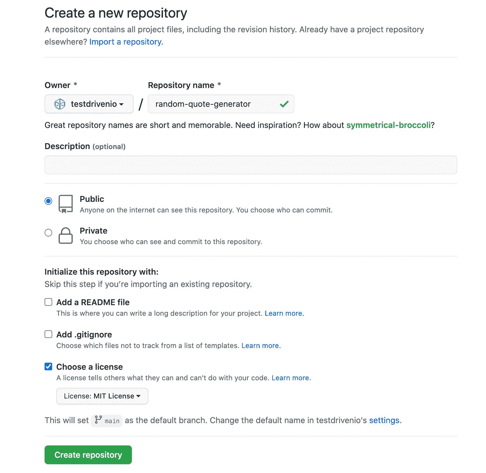
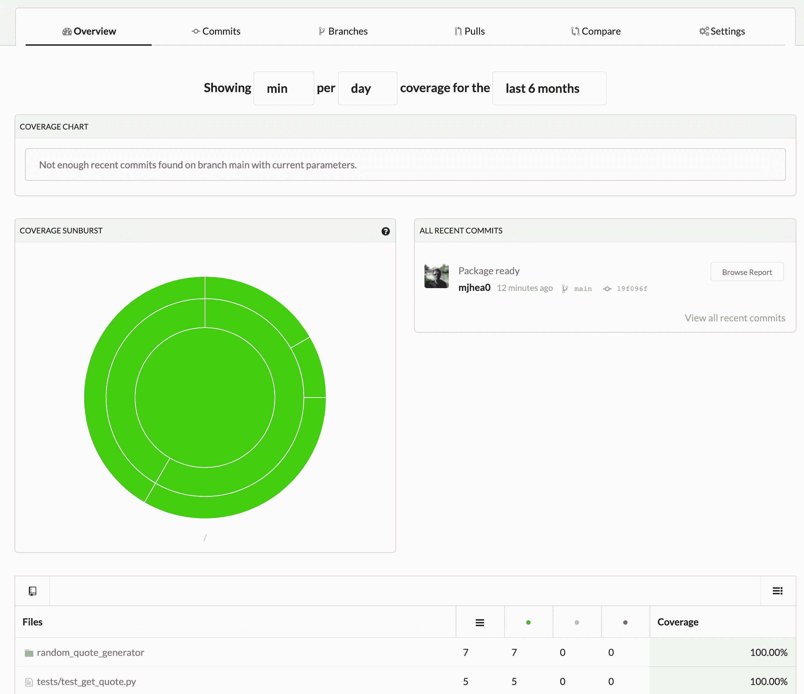
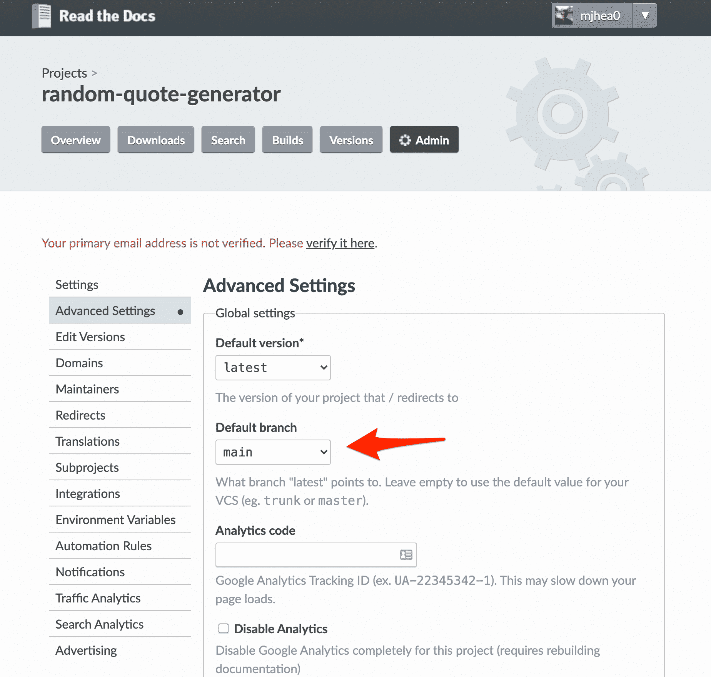
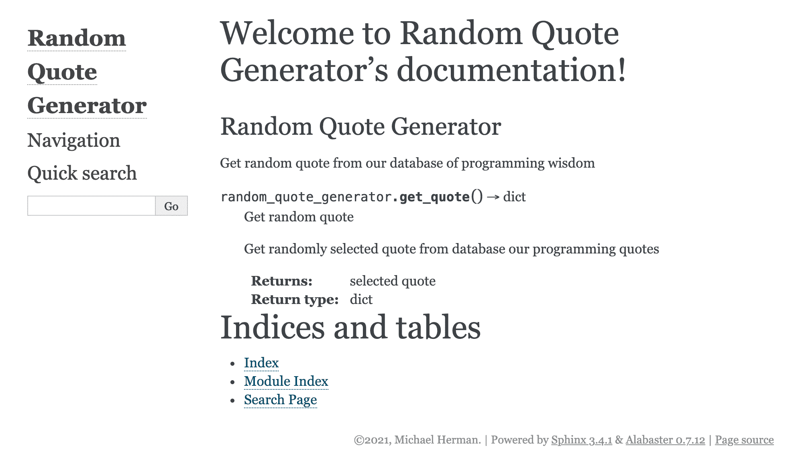
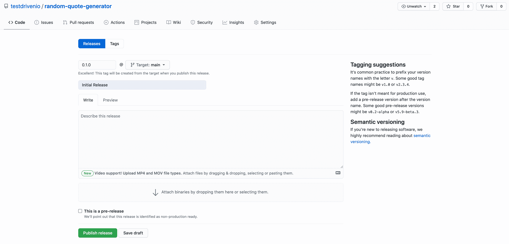

# Python 项目工作流

> 原文：<https://testdriven.io/blog/python-project-workflow/>

到目前为止，在这个系列中，我们已经介绍了:

1.  [现代 Python 环境——依赖性和工作空间管理](/blog/python-environments/)
2.  [Python 中的测试](/blog/testing-python/)
3.  [Python 中的现代测试驱动开发](/blog/modern-tdd/)
4.  [Python 代码质量](/blog/python-code-quality/)
5.  [Python 类型检查](/blog/python-type-checking/)
6.  [记录 Python 代码和项目](/blog/documenting-python/)

在本文中，当您从头到尾开发一个项目时，您将把所有东西粘在一起。开发基本项目后，您将:

1.  用 [GitHub 动作](https://github.com/features/actions)连接 CI/CD
2.  用 [CodeCov](http://codecov.io/) 配置覆盖报告
3.  将包发布到 [PyPi](https://pypi.org/) 并将文档发布到[阅读文档](https://readthedocs.org/)
4.  通过 GitHub 动作更新 PyPI 并阅读文档

> 您可以随意将 GitHub 操作替换为类似的 CI/CD 工具，如 [GitLab CI](https://about.gitlab.com/stages-devops-lifecycle/continuous-integration/) 、 [Bitbucket Pipelines](https://bitbucket.org/product/features/pipelines) 或 [CircleCI](https://circleci.com/) 。

## 项目设置

让我们构建一个随机报价生成器，从一组报价中返回随机选择的报价。

### 初始化项目

首先，让我们为我们的项目创建一个新文件夹:

```py
`$ mkdir random-quote-generator
$ cd random-quote-generator` 
```

用[诗歌](https://python-poetry.org)初始化项目:

```py
`$ poetry init

Package name [random_quote_generator]:
Version [0.1.0]:
Description []:
Author [Your name <[[email protected]](/cdn-cgi/l/email-protection)>, n to skip]:
License []:
Compatible Python versions [^3.10]:

Would you like to define your main dependencies interactively? (yes/no) [yes] no
Would you like to define your development dependencies interactively? (yes/no) [yes] no
Do you confirm generation? (yes/no) [yes]` 
```

> 关于诗歌的更多内容，请查看[现代 Python 环境——依赖性和工作空间管理](/blog/python-environments/)文章。

您的项目名称必须是唯一的，因为您将把它上传到 [PyPI](https://pypi.org/) 。因此，为了避免名称冲突，在 *pyproject.toml* 中为包名添加一个唯一的字符串。

例如:

```py
`[tool.poetry] name  =  "random-quote-generator-9308" version  =  "0.1.0" description  =  "" authors  =  ["Michael Herman <[[email protected]](/cdn-cgi/l/email-protection)>"] [tool.poetry.dependencies] python  =  "^3.10" [tool.poetry.dev-dependencies] [build-system] requires  =  ["poetry-core>=1.0.0"] build-backend  =  "poetry.core.masonry.api"` 
```

在 [GitHub](https://github.com/new) 上创建一个新的资源库:



接下来，初始化项目中的 git 存储库:

```py
`$ git init
$ git add pyproject.toml
$ git commit -m "first commit"
$ git branch -M main
$ git remote add origin [[email protected]](/cdn-cgi/l/email-protection):<your-github-username>/random-quote-generator.git
$ git fetch
$ git branch --set-upstream-to=origin/main main
$ git pull origin main --rebase
$ git push -u origin main` 
```

基本设置完成后，让我们继续添加以下开发依赖项:

> 查看 [Python 代码质量](/blog/python-code-quality/)一文，了解关于这些依赖性的详细信息。

安装:

```py
`$ poetry add --dev pytest pytest-cov black isort flake8 bandit safety` 
```

将新的*poem . lock*文件以及更新后的 *pyproject.toml* 文件添加到 git:

```py
`$ git add poetry.lock pyproject.toml` 
```

### 构建项目

之后，创建一个名为“random_quote_generator”的新文件夹。在该文件夹中，添加一个 *__init__。py* 文件，所以它被当作一个模块，还有一个 *quotes.py* 文件。

```py
`random-quote-generator
├── poetry.lock
├── pyproject.toml
└── random_quote_generator
    ├── __init__.py
    └── quotes.py` 
```

在 *quotes.py* 中，添加:

```py
`quotes = [
    {
        "quote": "A long descriptive name is better than a short "
        "enigmatic name. A long descriptive name is better "
        "than a long descriptive comment.",
        "author": "Robert C. Martin",
    },
    {
        "quote": "You should name a variable using the same "
        "care with which you name a first-born child.",
        "author": "Robert C. Martin",
    },
    {
        "quote": "Any fool can write code that a computer "
        "can understand. Good programmers write code"
        " that humans can understand.",
        "author": "Martin Fowler",
    },
]` 
```

那里没什么特别的。只是一个字典列表，每个引用一个。接下来，在项目根目录下创建一个名为“tests”的新文件夹，并添加以下文件:

```py
`tests
├── __init__.py
└── test_get_quote.py` 
```

*test_get_quote.py* :

```py
`from random_quote_generator import get_quote
from random_quote_generator.quotes import quotes

def test_get_quote():
    """
 GIVEN
 WHEN get_quote is called
 THEN random quote from quotes is returned
 """

    quote = get_quote()

    assert quote in quotes` 
```

运行测试:

```py
`$ poetry run python -m pytest tests` 
```

它应该会失败:

```py
`E   ImportError: cannot import name 'get_quote' from 'random_quote_generator'` 
```

接下来，向“random_quote_generator”添加一个名为 *get_quote.py* 的新文件:

```py
`import random

from random_quote_generator.quotes import quotes

def get_quote() -> dict:
    """
 Get random quote

 Get randomly selected quote from database our programming quotes

 :return: selected quote
 :rtype: dict
 """

    return quotes[random.randint(0, len(quotes) - 1)]` 
```

因此，通过生成一个随机整数来选择一个报价，该整数的值为 0 到最后一个索引之间的 random.randint。

在*random _ quote _ generator/_ _ init _ 中导出函数。py* :

```py
`"""
Random Quote Generator
======================

Get random quote from our database of programming wisdom
"""
from .get_quote import get_quote

__all__ = ["get_quote"]` 
```

该函数被导入并在`__all__`属性中列出，该属性是模块的公共对象列表。换句话说，当有人使用`from random_quote_generator import *`时，只会导入`__all__`中列出的名字。

测试现在应该通过了:

```py
`$ poetry run python -m pytest tests` 
```

创建一个*。gitignore 项目根目录中的*文件:

将“random_quote_generator”和“tests”文件夹与*一起添加到 git 中。gitignore* 文件:

```py
`$ git add random_quote_generator/ tests/ .gitignore` 
```

就是这样。包裹已准备好交付。

### 记录项目

我们的软件包工作，但我们的用户将不得不检查它的源代码，看看如何使用它。我们已经包含了 docstrings，因此我们可以使用 [Sphinx](https://www.sphinx-doc.org/en/master/) 轻松创建独立的项目文档。

> 如果您不熟悉作为独立资源的 docstrings 或文档，请阅读[文档化 Python 代码和项目](/blog/documenting-python/#sphinx)文章。

假设您已经安装了 Sphinx，运行下面的命令在项目根目录中为 Sphinx 搭建文件和文件夹:

你将被提升一些问题:

```py
`> Separate source and build directories (y/n) [n]: n
> Project name: Random Quote Generator
> Author name(s): Your Name
> Project release []: 0.1.0
> Project language [en]: en` 
```

接下来，让我们更新项目配置。打开 *docs/conf.py* 并替换它:

```py
`# import os
# import sys
# sys.path.insert(0, os.path.abspath('.'))` 
```

有了这个:

```py
`import os
import sys
sys.path.insert(0, os.path.abspath('..'))` 
```

现在， [autodoc](https://www.sphinx-doc.org/en/master/usage/quickstart.html#autodoc) ，用于从 docstrings 中拉入文档，会在“docs”的父文件夹中搜索模块。

将下列扩展名添加到扩展名列表中:

```py
`extensions = [
    'sphinx.ext.autodoc',
]` 
```

更新 *docs/index.rst* 如下:

```py
`.. Random Quote Generator documentation master file, created by
 sphinx-quickstart on Mon Dec 21 22:27:23 2020.
 You can adapt this file completely to your liking, but it should at least
 contain the root `toctree` directive.

Welcome to Random Quote Generator's documentation!
==================================================

.. automodule:: random_quote_generator
    :members:

Indices and tables
==================

* :ref:`genindex`
* :ref:`modindex`
* :ref:`search`` 
```

这个文件应该从 Flake8 中排除，我们将很快添加它。因此，在项目根目录下创建一个 *.flake8* 文件:

```py
`[flake8] exclude  = docs/conf.py,` 
```

将“docs”文件夹和 *.flake8* 添加到 git:

## GitHub 操作

接下来，让我们用 [GitHub 动作](https://github.com/features/actions)连接 CI 管道。

将以下文件和文件夹添加到项目根目录中:

```py
`.github
└── workflows
    └── branch.yaml` 
```

在 *branch.yaml* 中，添加:

```py
`name:  Push on:  [push] jobs: test: strategy: fail-fast:  false matrix: python-version:  ['3.10'] poetry-version:  ['1.1.13'] os:  [ubuntu-latest] runs-on:  ${{ matrix.os }} steps: -  uses:  actions/[[email protected]](/cdn-cgi/l/email-protection) -  uses:  actions/[[email protected]](/cdn-cgi/l/email-protection) with: python-version:  ${{ matrix.python-version }} -  name:  Run image uses:  abatilo/[[email protected]](/cdn-cgi/l/email-protection) with: poetry-version:  ${{ matrix.poetry-version }} -  name:  Install dependencies run:  poetry install -  name:  Run tests run:  poetry run pytest --cov=./ --cov-report=xml -  name:  Upload coverage to Codecov uses:  codecov/[[email protected]](/cdn-cgi/l/email-protection) code-quality: strategy: fail-fast:  false matrix: python-version:  ['3.10'] poetry-version:  ['1.1.13'] os:  [ubuntu-latest] runs-on:  ${{ matrix.os }} steps: -  uses:  actions/[[email protected]](/cdn-cgi/l/email-protection) -  uses:  actions/[[email protected]](/cdn-cgi/l/email-protection) with: python-version:  ${{ matrix.python-version }} -  name:  Run image uses:  abatilo/[[email protected]](/cdn-cgi/l/email-protection) with: poetry-version:  ${{ matrix.poetry-version }} -  name:  Install dependencies run:  poetry install -  name:  Run black run:  poetry run black . --check -  name:  Run isort run:  poetry run isort . --check-only --profile black -  name:  Run flake8 run:  poetry run flake8 . -  name:  Run bandit run:  poetry run bandit . -  name:  Run saftey run:  poetry run safety check` 
```

这种配置:

*   在每个分支的每次推送时运行- `on: [push]`
*   运行在最新版本的 Ubuntu - `ubuntu-latest`
*   使用 Python 3.10 - `python-version: [3.10]`，`python-version: ${{ matrix.python-version }}`
*   1.1.13 -使用诗歌版本`poetry-version: [1.1.13]`，`poetry-version: ${{ matrix.poetry-version }}`

定义了两个作业:`test`和`code-quality`。顾名思义，测试在测试作业中运行，而我们的代码质量检查在代码质量作业中运行。

现在，每次推送 GitHub 库时，测试和代码质量工作都会运行。

添加”。github "到 git:

运行所有代码质量检查:

```py
`$ poetry run black .
$ poetry run isort . --profile black
$ poetry run flake8 .
$ poetry run bandit .
$ poetry run safety check` 
```

确保添加任何可能已经更改为 git 的文件。然后，将您的更改提交并推送到 GitHub:

```py
`$ git add docs/ random_quote_generator/ tests/
$ git commit -m 'Package ready'
$ git push -u origin main` 
```

您应该在 GitHub 存储库的“Actions”选项卡上看到您的工作流正在运行。在继续前进之前确保它通过。

## CodeCov

接下来，我们将配置 [CodeCov](http://codecov.io/) 来跟踪代码覆盖率。导航到 http://codecov.io/的，用你的 GitHub 账号登录，找到你的库。

> 查看[快速入门](https://docs.codecov.io/docs/quick-start)指南，获得使用 CodeCov 的帮助。

再次运行 GitHub 操作工作流程。完成后，您应该能够在 CodeCov:



现在，每次您的工作流运行时，都会生成一个覆盖报告并上传到 CodeCov。您可以分析分支、提交和拉请求的覆盖率的变化，重点关注覆盖率随时间的增加和减少。

## 阅读文件

我们将使用[Read Docs](https://readthedocs.org)来存放我们的文档。导航到 https://readthedocs.org 的，使用你的 GitHub 账户登录。

> 如果您刚刚注册，请确保在继续之前验证您的电子邮件地址。

接下来，点击“导入项目”。之后，刷新您的项目并添加随机报价生成器项目。打开项目并导航到“Admin”部分。然后，在“高级设置”下，将默认分支设置为`main`。不要忘记保存您的更改。



阅读文档并构建文档需要几分钟时间。一旦完成，您应该能够在`https://your-project-slug-on-readthedocs.readthedocs.io`查看您的项目文档。



默认情况下，文档将在每次推送到`main`分支时重新构建。这样，剩下的唯一事情就是将您的包发布到 PyPI。

## 好吧

最后，为了使项目“可安装 pip ”,我们将把它发布到 [PyPI](https://pypi.org/) 。

首先将以下部分添加到 *pyproject.toml* 中，以便将“random_quote_generator”模块包含在 PyPI 的发行版中:

```py
`packages  =  [ {  include  =  "random_quote_generator"  }, ]` 
```

示例文件:

```py
`[tool.poetry] name  =  "random-quote-generator-93618" packages  =  [ {  include  =  "random_quote_generator"  }, ] version  =  "0.1.0" description  =  "" authors  =  ["Amir Tadrisi <[[email protected]](/cdn-cgi/l/email-protection)>"] [tool.poetry.dependencies] python  =  "^3.10" [tool.poetry.dev-dependencies] pytest  =  "^7.1.2" pytest-cov  =  "^3.0.0" black  =  "^22.3.0" isort  =  "^5.10.1" flake8  =  "^4.0.1" bandit  =  "^1.7.4" safety  =  "^1.10.3" [build-system] requires  =  ["poetry-core>=1.0.0"] build-backend  =  "poetry.core.masonry.api"` 
```

添加一个名为 *release.yaml* 的新文件到”。github/工作流”:

```py
`name:  Release on: release: types: -  created jobs: publish: strategy: fail-fast:  false matrix: python-version:  ['3.10'] poetry-version:  ['1.1.13'] os:  [ubuntu-latest] runs-on:  ${{ matrix.os }} steps: -  uses:  actions/[[email protected]](/cdn-cgi/l/email-protection) -  uses:  actions/[[email protected]](/cdn-cgi/l/email-protection) with: python-version:  ${{ matrix.python-version }} -  name:  Run image uses:  abatilo/[[email protected]](/cdn-cgi/l/email-protection) with: poetry-version:  ${{ matrix.poetry-version }} -  name:  Publish env: PYPI_TOKEN:  ${{ secrets.PYPI_TOKEN }} run:  | poetry config pypi-token.pypi $PYPI_TOKEN poetry publish --build` 
```

因此，当一个新的[版本](https://docs.github.com/en/free-pro-team@latest/github/administering-a-repository/managing-releases-in-a-repository)被创建时，这个包将被发布到 PyPI。

接下来，我们需要创建一个 PyPI 令牌。如果你还没有的话，在 PyPI 上创建一个账户。然后，一旦登录，点击“帐户设置”并添加一个新的 API 令牌。复制令牌。现在您需要将它添加到您的 GitHub 库的秘密中。在回购中，单击“设置”选项卡，然后单击“秘密”并选择“操作”。使用`PYPI_TOKEN`作为秘密名称，使用令牌值作为秘密值。

现在您已经准备好创建您的第一个版本了。

将 *release.yaml* 文件以及更新后的 *pyproject.toml* 文件添加到 git，提交并推送:

```py
`$ git add .github/workflows/release.yaml pyproject.toml
$ git commit -m 'Ready for first release'
$ git push -u origin main` 
```

要创建新版本，请导航至`https://github.com/<username>/<project-name>/releases/`。单击“创建新版本”。输入`0.1.0`作为标签，输入`Initial Release`作为标题。



这将在 GitHub 操作上触发一个新的工作流。一旦完成，您应该会在 PyPI 上看到您的包。

现在您应该能够从 PyPI 安装和使用您的包了:

```py
`>>> from random_quote_generator import get_quote
>>>
>>> print(get_quote())
{'quote': 'Any fool can write code that a computer can understand. Good programmers write code that humans can understand.', 'author': 'Martin Fowler'}` 
```

## 结论

我们为发布到 PyPI 的 Python 包设置了一个简单的 CI/CD 管道。通过测试和代码质量来检查每个分支上的代码。您可以在 CodeCov 中检查代码覆盖率。在发布时，新版本被部署到 PyPI，文档被更新。这可以大大简化你的生活。

像这样的自动化管道有助于确保您的工作流程日复一日保持一致。尽管如此，你仍然应该关心你的团队的工作文化。测试在推送时运行，但它们必须存在。如果您没有任何测试要运行，自动化测试运行不会有太大帮助。自动化也不会对您的变更大小产生太大的影响。尽量保持小规模，经常合并到`main`。伴随着测试驱动开发(TDD)和 CI/CD 管道的小变化会对你所交付的软件的质量产生巨大的影响。只是不要忘记，它总是以团队文化开始和结束。

> [完整 Python](/guides/complete-python/) 指南:
> 
> 1.  [现代 Python 环境——依赖性和工作空间管理](/blog/python-environments/)
> 2.  [Python 中的测试](/blog/testing-python/)
> 3.  [Python 中的现代测试驱动开发](/blog/modern-tdd/)
> 4.  [Python 代码质量](/blog/python-code-quality/)
> 5.  [Python 类型检查](/blog/python-type-checking/)
> 6.  [记录 Python 代码和项目](/blog/documenting-python/)
> 7.  [Python 项目工作流程](/blog/python-project-workflow/)(本文！)