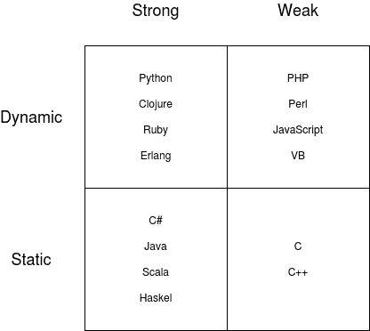

# Python 类型检查

> 原文：<https://testdriven.io/blog/python-type-checking/>

什么是类型检查？我们为什么需要它？静态和运行时类型检查有什么区别？

Python 是一种[强类型](https://en.wikipedia.org/wiki/Strong_and_weak_typing)、[动态](https://en.wikipedia.org/wiki/Dynamic_programming_language)编程语言。由于它是动态类型的，类型是动态推断的，所以您可以直接设置变量值，而不像在静态类型编程语言(如 Java)中那样定义变量类型。



> 强的和动态的意味着类型在运行时被推断，但是你不能混合类型。比如`a = 1 + '0'`在 Python 中会引发一个错误。另一方面，JavaScript 是弱的和动态的，所以类型是在运行时推断的，并且您可以混合使用类型。例如，`a = 1 + '0'`会将`a`设置为`10`。

虽然动态类型带来了灵活性，但它并不总是令人满意的。因此，最近有很多人尝试将静态类型推理引入动态语言。

在这篇文章中，我们将看看什么是类型提示，以及它们如何给你带来好处。我们还将深入探讨如何使用 Python 的类型系统通过 mypy 进行静态类型检查，通过 pydantic、marshmallow 和 typeguard 进行运行时类型检查。

> [完整 Python](/guides/complete-python/) 指南:
> 
> 1.  [现代 Python 环境——依赖性和工作空间管理](/blog/python-environments/)
> 2.  [Python 中的测试](/blog/testing-python/)
> 3.  [Python 中的现代测试驱动开发](/blog/modern-tdd/)
> 4.  [Python 代码质量](/blog/python-code-quality/)
> 5.  [Python 类型检查](/blog/python-type-checking/)(本文！)
> 6.  [记录 Python 代码和项目](/blog/documenting-python/)
> 7.  [Python 项目工作流程](/blog/python-project-workflow/)

有许多工具使用类型提示进行静态和运行时类型检查。

### 静态打字

1.  [mypy](https://github.com/python/mypy)
2.  [柴堆](https://pyre-check.org/)
3.  [版权](https://github.com/Microsoft/pyright)
4.  [pytype](https://github.com/google/pytype)
5.  [pyanalyze](https://github.com/quora/pyanalyze)

### 运行时类型检查/数据验证

1.  [棉花糖](https://marshmallow.readthedocs.io/en/stable/)
2.  [pydantic](https://github.com/samuelcolvin/pydantic)
3.  [打字警卫](https://github.com/agronholm/typeguard)
4.  [典型](https://github.com/seandstewart/typical/)
5.  [pytypes](https://github.com/Stewori/pytypes)

### 特定项目

1.  [pydantic-django](https://pypi.org/project/pydantic-django/)
2.  [django-stubs](https://pypi.org/project/django-stubs/)
3.  [型长江](https://github.com/typeddjango)
4.  [烧瓶-pydantic](https://pypi.org/project/Flask-Pydantic/)
5.  [烧瓶-棉花糖](https://flask-marshmallow.readthedocs.io/en/latest/)
6.  [fastapi](https://fastapi.tiangolo.com/) (pydantic 内置——耶！)

> 查看[牛逼的 Python Typing](https://github.com/typeddjango/awesome-python-typing) 获得完整的工具列表。

## 类型提示

Python 3.5 版中添加了类型提示。

它们允许开发人员在 Python 代码中注释变量、函数参数和函数返回值的预期类型。虽然 Python 解释器并不强制执行这种类型——同样，Python 是一种动态类型语言——但它们确实提供了许多好处。首先，使用类型提示，您可以更好地表达您的代码正在做什么以及如何使用它的意图。更好的理解导致更少的错误。

例如，假设您有以下函数来计算日平均温度:

```
`def daily_average(temperatures):
    return sum(temperatures) / len(temperatures)` 
```

只要您像这样提供一个温度列表，该函数就会按预期工作，并返回预期的结果:

```
`average_temperature = daily_average([22.8, 19.6, 25.9])
print(average_temperature)  # => 22.76666666666667` 
```

如果用字典调用函数，其中键是测量的时间戳，值是温度，会发生什么？

```
`average_temperature = daily_average({1599125906: 22.8, 1599125706: 19.6, 1599126006: 25.9})
print(average_temperature)  # => 1599125872.6666667` 
```

本质上，这个函数现在返回*键的总和/键的数量*，这显然是错误的。由于函数调用没有引发错误，这可能会被检测到，特别是如果最终用户提供了温度。

为了避免这种混淆，可以通过注释参数和返回值来添加类型提示:

```
`def daily_average(temperatures: list[float]) -> float:
    return sum(temperatures) / len(temperatures)` 
```

现在函数定义告诉我们:

1.  `temperatures`应该是一个浮动列表:`temperatures: list[float]`
2.  该函数应该返回一个浮点数:`-> float`

```
`print(daily_average.__annotations__)
# {'temperatures': list[float], 'return': <class 'float'>}` 
```

类型提示启用静态类型检查工具。代码编辑器和 ide 也使用它们，根据类型提示，当特定函数或方法的使用不符合预期时，它们会发出警告，并提供强大的自动完成功能。

所以，类型提示实际上只是“提示”。换句话说，它们不像静态类型语言中的类型定义那样严格。也就是说，即使它们相当灵活，它们仍然通过更清楚地表达意图来帮助提高代码质量。除此之外，你可以使用许多工具从中获益更多。

### 类型批注与类型提示

类型注释只是注释函数输入、函数输出和变量的语法:

```
`def sum_xy(x: 'an integer', y: 'another integer') -> int:
    return x + y

print(sum_xy.__annotations__)
# {'x': 'an integer', 'y': 'another integer', 'return': <class 'int'}` 
```

类型提示建立在注释之上，使它们更有用。提示和注释经常互换使用，但它们是不同的。

### Python 的类型模块

您可能想知道为什么有时会看到这样的代码:

```
`from typing import List

def daily_average(temperatures: List[float]) -> float:
    return sum(temperatures) / len(temperatures)` 
```

它使用内置的`float`来定义函数返回类型，但是`List`是从[类型化](https://docs.python.org/3/library/typing.html)模块中导入的。

在 [Python 3.9](/blog/python39/) 之前，Python 解释器不支持使用内置参数进行类型提示。

例如，可以使用 list 作为类型提示，如下所示:

```
`def daily_average(temperatures: list) -> float:
    return sum(temperatures) / len(temperatures)` 
```

但是如果没有类型模块，就不可能定义列表元素的预期类型(`list[float]`)。对于字典和其他序列和复杂类型也是如此:

```
`from typing import Tuple, Dict

def generate_map(points: Tuple[float, float]) -> Dict[str, int]:
    return map(points)` 
```

除此之外，打字模块允许你定义[新类型](https://docs.python.org/3.7/library/typing.html#newtype)、[类型别名](https://docs.python.org/3.7/library/typing.html#type-aliases)、[类型任意](https://docs.python.org/3.7/library/typing.html#typing.Any)等许多事情。

例如，您可能希望允许多种类型。为此，您可以使用 [Union](https://docs.python.org/3.7/library/typing.html#typing.Union) :

```
`from typing import Union

def sum_ab(a: Union[int, float], b: Union[int, float]) -> Union[int, float]:
    return a + b` 
```

从 Python 3.9 开始，您可以像这样使用内置函数:

```
`def sort_names(names: list[str]) -> list[str]:
    return sorted(names)` 
```

## 用 mypy 进行静态类型检查

mypy 是一个在编译时进行类型检查的工具。

您可以像安装任何其他 Python 包一样安装它:

要检查 Python 模块，您可以像这样运行它:

```
`$ python -m mypy my_module.py` 
```

所以，让我们再来看一下`daily_average`的例子:

```
`def daily_average(temperatures):
    return sum(temperatures) / len(temperatures)

average_temperature = daily_average(
    {1599125906: 22.8, 1599125706: 19.6, 1599126006: 25.9}
)` 
```

当使用 mypy 对此类代码进行类型检查时，不会报告任何错误，因为该函数不使用类型提示:

```
`Success: no issues found in 1 source file` 
```

在以下位置添加类型提示:

```
`def daily_average(temperatures: list[float]) -> float:
    return sum(temperatures) / len(temperatures)

average_temperature = daily_average(
    {1599125906: 22.8, 1599125706: 19.6, 1599126006: 25.9}
)` 
```

再次运行 mypy:

```
`$ python -m mypy my_module.py` 
```

您应该看到:

```
`my_module.py:6: error: Argument 1 to "daily_average" has incompatible
type "Dict[int, float]"; expected "List[float]"  [arg-type]

Found 1 error in 1 file (checked 1 source file)` 
```

mypy 识别出函数调用不正确。它报告了文件名、行号和错误描述。将类型提示与 mypy 结合使用有助于减少因误用函数、方法和类而导致的错误。这导致了更快的反馈循环。您不需要运行所有的测试，甚至不需要部署整个应用程序。这种错误会立即通知您。

在合并或部署代码之前，将 mypy 添加到 CI 管道中来检查类型也是一个好主意。有关这方面的更多信息，请查看 [Python 代码质量](/blog/python-code-quality/)一文。

尽管就代码质量而言这是一个很大的改进，但静态类型检查并不在运行时强制类型，因为您的程序正在运行。这就是为什么我们也有运行时类型检查器，我们将在接下来看到。

> *mypy* 附带了 [typeshed](https://github.com/python/typeshed) ，其中包含 Python 标准库的外部类型注释和 Python 内置以及第三方包。
> 
> *mypy* 检查 Python 程序，基本没有运行时开销。虽然它检查类型，鸭式打字仍然发生。因此，它不能用于编译 CPython 扩展。

## 运行时类型检查

### 迂腐的

静态类型检查器在处理来自应用程序用户等外部来源的数据时没有帮助。这就是运行时类型检查器发挥作用的地方。一个这样的工具是 [pydantic](https://pydantic-docs.helpmanual.io/) ，用于验证数据。当提供的数据与用类型提示定义的类型不匹配时，它会引发验证错误。

> pydantic 使用[类型转换](https://pydantic-docs.helpmanual.io/usage/models/#data-conversion)来转换输入数据，以强制其符合预期的类型。

其实用起来挺简单的。例如，让我们用几个属性定义一个`Song`类:

```
`from datetime import date

from pydantic import BaseModel

class Song(BaseModel):
    id: int
    name: str
    release: date
    genres: list[str]` 
```

现在，当我们用有效数据初始化一个新的`Song`时，一切都按预期工作:

```
`song = Song(
    id=101,
    name='Bohemian Rhapsody',
    release='1975-10-31',
    genres=[
        'Hard Rock',
        'Progressive Rock'
    ]
)
print(song)
# id=101 name='Bohemian Rhapsody' release=datetime.date(1975, 10, 31)
# genres=['Hard Rock', 'Progressive Rock']` 
```

然而，当我们试图用无效数据(`'1975-31-31'`)初始化新的`Song`时，会产生一个`ValidationError`:

```
`song = Song(
    id=101,
    name='Bohemian Rhapsody',
    release='1975-31-31',
    genres=[
        'Hard Rock',
        'Progressive Rock'
    ]
)
print(song)
# pydantic.error_wrappers.ValidationError: 1 validation error for Song
# release
#   invalid date format (type=value_error.date)` 
```

使用 pydantic，我们可以确保在我们的应用程序中只使用与定义的类型相匹配的数据。这不仅会导致更少的错误，而且您需要编写更少的测试。通过使用像 pydantic 这样的工具，我们不需要为用户发送完全错误的数据的情况编写测试。它由 pydantic 处理——引发了一个`ValidationError`。例如， [FastAPI](https://fastapi.tiangolo.com/tutorial/body/) 用 pydantic 验证 HTTP 请求和响应主体:

```
`from fastapi import FastAPI
from pydantic import BaseModel

app = FastAPI()

class Item(BaseModel):
    name: str
    price: float

@app.post("/items/", response_model=Item)
async def create_item(item: Item):
    return item` 
```

`create_item`处理程序需要一个带有`name`(字符串)和`price`(浮点)的有效载荷。响应对象应该看起来相同。现在，如果所提供的有效负载有问题，就会立即出现错误。延迟引发会使调试和确定错误类型的数据的来源变得更加困难。另外，因为它是由 pydantic 处理的，所以您可以保持您的路由处理程序干净。

除了利用类型提示进行数据验证之外，您还可以添加自定义验证器来确保数据的正确性。为属性添加自定义验证相当容易。例如，为了防止在`Song`类中出现风格重复，您可以像这样添加验证:

```
`from datetime import date

from pydantic import BaseModel, validator

class Song(BaseModel):
    id: int
    name: str
    release: date
    genres: list[str]

    @validator('genres')
    def no_duplicates_in_genre(cls, v):
        if len(set(v)) != len(v):
            raise ValueError(
                'No duplicates allowed in genre.'
            )
        return v

song = Song(
    id=101,
    name='Bohemian Rhapsody',
    release='1975-10-31',
    genres=[
        'Hard Rock',
        'Progressive Rock',
        'Progressive Rock',
    ]
)
print(song)
# pydantic.error_wrappers.ValidationError: 1 validation error for Song
# genre
#   No duplicates allowed in genre. (type=value_error)` 
```

因此，验证方法`no_duplicates_in_genre`必须用`validator`修饰，它将属性名作为参数。验证方法必须是类方法，因为验证发生在创建实例之前。对于没有通过验证的数据，它应该引发一个标准的 Python `ValueError`。

您还可以使用验证器方法在验证发生之前更改值。为此，将`pre=True`和`always=True`添加到`validator`装饰器中:

```
`@validator('genres', pre=True, always=True)` 
```

例如，您可以将流派转换为小写，如下所示:

```
`from datetime import date

from pydantic import BaseModel, validator

class Song(BaseModel):
    id: int
    name: str
    release: date
    genres: list[str]

    @validator('genres', pre=True, always=True)
    def to_lower_case(cls, v):
        return [genre.lower() for genre in v]

    @validator('genres')
    def no_duplicates_in_genre(cls, v):
        if len(set(v)) != len(v):
            raise ValueError(
                'No duplicates allowed in genre.'
            )
        return v

song = Song(
    id=101,
    name='Bohemian Rhapsody',
    release='1975-10-31',
    genres=[
        'Hard Rock',
        'PrOgReSsIvE ROCK',
        'Progressive Rock',
    ]
)
print(song)
# pydantic.error_wrappers.ValidationError: 1 validation error for Song
# genre
#   No duplicates allowed in genre. (type=value_error)` 
```

`to_lower_case`将`genres`列表中的每个元素转换成小写。因为`pre`被设置为`True`，所以这个方法在 pydantic 验证类型之前被调用。所有泛型都被转换成小写，然后用`no_duplicates_in_genre`进行验证。

pydantic 还提供了更严格的类型，如`PositiveInt`和`EmailStr`，以使您的验证更好。查看文档中的[字段类型](https://pydantic-docs.helpmanual.io/usage/types/)，了解更多相关信息。

### 棉花糖

另一个值得一提的工具是 [marshmallow](https://marshmallow.readthedocs.io/en/stable/) ，它有助于验证复杂数据，并从/向本机 Python 类型加载/转储数据。安装与任何其他 Python 包一样:

```
`$ pip install marshmallow` 
```

像 pydantic 一样，您可以向类添加类型验证:

```
`from marshmallow import Schema, fields, post_load

class Song:
    def __init__(
            self,
            id,
            name,
            release,
            genres
    ):
        self.id = id
        self.name = name
        self.release = release
        self.genres = genres

    def __repr__(self):
        return (
            f'<Song(id={self.id}, name={self.name}), '
            f'release={self.release.isoformat()}, genres={self.genres}>'
        )

class SongSchema(Schema):
    id = fields.Int()
    name = fields.Str()
    release = fields.Date()
    genres = fields.List(fields.String())

    @post_load
    def make_song(self, data, **kwargs):
        return Song(**data)

external_data = {
    'id': 101,
    'name': 'Bohemian Rhapsody',
    'release': '1975-10-31',
    'genres': ['Hard Rock', 'Progressive Rock']
}

song = SongSchema().load(external_data)
print(song)
# <Song(id=101, name=Bohemian Rhapsody), release=1975-10-31, genres=['Hard Rock', 'Progressive Rock']>` 
```

与 pydantic 不同，marshmallow 不使用类型转换，所以需要分别定义模式和类。例如，`external_data`中的发布日期必须是 ISO 字符串。它不适用于`datetime`对象。

要将数据反序列化到一个`Song`对象中，需要向模式中添加一个用`@post_load` decorator 修饰的方法:

```
`class SongSchema(Schema):
    id = fields.Int()
    name = fields.Str()
    release = fields.Date()
    genres = fields.List(fields.String(), validate=no_duplicates)

    @post_load
    def make_song(self, data, **kwargs):
        return Song(**data)` 
```

该模式验证数据，如果所有字段都有效，它通过用验证过的数据调用`make_song`来创建该类的一个实例。

像 pydantic 一样，您可以为模式中的每个属性添加自定义验证。例如，您可以防止重复，如下所示:

```
`import datetime

from marshmallow import Schema, fields, post_load, ValidationError

class Song:
    def __init__(
            self,
            id,
            name,
            release,
            genres
    ):
        self.id = id
        self.name = name
        self.release = release
        self.genres = genres

    def __repr__(self):
        return (
            f'<Song(id={self.id}, name={self.name}), '
            f'release={self.release.isoformat()}, genres={self.genres}>'
        )

def no_duplicates(genres):
    if isinstance(genres, list):
        genres = [
            genre.lower()
            for genre in genres
            if isinstance(genre, str)
        ]

        if len(set(genres)) != len(genres):
            raise ValidationError(
                'No duplicates allowed in genres.'
            )

class SongSchema(Schema):
    id = fields.Int()
    name = fields.Str()
    release = fields.Date()
    genres = fields.List(fields.String(), validate=no_duplicates)

    @post_load
    def make_song(self, data, **kwargs):
        return Song(**data)

external_data = {
    'id': 101,
    'name': 'Bohemian Rhapsody',
    'release': '1975-10-31',
    'genres': ['Hard Rock', 'Progressive Rock', 'ProgressivE Rock']
}

song = SongSchema().load(external_data)
print(song)
# marshmallow.exceptions.ValidationError:
# {'genres': ['No duplicates allowed in genres.']}` 
```

如您所见，您可以使用 pydantic 或 marshmallow 来确保数据在应用程序运行时具有正确的类型。挑一个更符合你风格的。

### 打字警卫

pydantic 和 marshmallow 专注于数据验证和序列化，而 [typeguard](https://github.com/agronholm/typeguard) 专注于在调用函数时检查类型。mypy 只做静态类型检查，而 typeguard 在程序运行时强制执行类型。

让我们来看看和之前一样的例子——一个`Song`类。这次我们用类型提示参数定义它的`__init__`方法:

```
`from datetime import date

from typeguard import typechecked

@typechecked
class Song:

    def __init__(
            self,
            id: int,
            name: str,
            release: date,
            genres: list[str]

    ) -> None:
        self.id = id
        self.name = name
        self.release = release
        self.genres = genres

song = Song(
    id=101,
    name='Bohemian Rhapsody',
    release=date(1975, 10, 31),
    genres={
        'Hard Rock',
        'Progressive Rock',
    }
)
print(song)
# TypeError: type of argument "genres" must be a list; got set instead` 
```

当您想在运行时执行类型检查时，`typechecked` decorator 可以用于类和函数。运行这段代码将引发一个`TypeError`,因为流派是一个集合而不是一个列表。您可以类似地对函数使用装饰器，如下所示:

```
`from typeguard import typechecked

@typechecked
def sum_ab(a: int, b: int) -> int:
    return a + b` 
```

它还附带了一个 pytest 插件。要在运行测试时检查包`my_package`的类型，您可以运行以下命令:

```
`$ python -m pytest --typeguard-packages=my_package` 
```

当用 pytest 运行时，你不需要使用`@typechecked`装饰器。因此，您可以修饰您的函数和类，以便在运行时或仅在测试运行时强制类型。无论哪种方式，typeguard 都可以成为您的应用程序的强大安全网，以确保它按预期运行。

## 迂腐的烧瓶

因此，让我们将所有这些放在一个 web 应用程序中。如上所述，FastAPI 默认使用 pydantic。尽管 Flask 没有对 pydantic 的内置支持，但我们可以使用绑定将它添加到我们的 API 中。因此，让我们创建一个新的 Flask 项目来看看它的运行情况。

首先，创建一个新文件夹:

```
`$ mkdir flask_example
$ cd flask_example` 
```

接下来，用诗歌初始化您的项目:

```
`$ poetry init
Package name [flask_example]:
Version [0.1.0]:
Description []:
Author [Your name <[[email protected]](/cdn-cgi/l/email-protection)>, n to skip]:
License []:
Compatible Python versions [^3.7]:  >3.7

Would you like to define your main dependencies interactively? (yes/no) [yes] no
Would you like to define your development dependencies interactively? (yes/no) [yes] no
Do you confirm generation? (yes/no) [yes]` 
```

之后，加入烧瓶、 [Flask-Pydantic](https://pypi.org/project/Flask-Pydantic/) 和 pytest:

```
`$ poetry add flask Flask-Pydantic
$ poetry add --dev pytest` 
```

创建一个名为 *test_app.py* 的文件来保存我们的测试:

```
`import json

import pytest

from app import app

@pytest.fixture
def client():
    app.config["TESTING"] = True

    with app.test_client() as client:
        yield client

def test_create_todo(client):
    response = client.post(
        "/todos/",
        data=json.dumps(
            {
                'title': 'Wash the dishes',
                'done': False,
                'deadline': '2020-12-12'
            }
        ),
        content_type='application/json'
    )

    assert response.status_code == 201

def test_create_todo_bad_request(client):
    response = client.post(
        "/todos/",
        data=json.dumps(
            {
                'title': 'Wash the dishes',
                'done': False,
                'deadline': 'WHENEVER'
            }
        ),
        content_type='application/json'
    )

    assert response.status_code == 400` 
```

这里，我们有两个创建新 todos 的测试。当一切正常时，检查是否返回状态 201。另一个检查当提供的数据不符合预期时是否返回状态 400。

接下来，为 Flask 应用程序添加一个名为 *app.py* 的文件:

```
`import datetime

from flask import Flask, request
from flask_pydantic import validate
from pydantic import BaseModel

app = Flask(__name__)

class CreateTodo(BaseModel):
    title: str
    done: bool
    deadline: datetime.date

class Todo(BaseModel):
    title: str
    done: bool
    deadline: datetime.date
    created_at: datetime.datetime

@app.route("/todos/", methods=['POST'])
@validate(body=CreateTodo)
def todos():
    todo = Todo(
        title=request.body_params.title,
        done=request.body_params.done,
        deadline=request.body_params.deadline,
        created_at=datetime.datetime.now()
    )

    return todo, 201

if __name__ == "__main__":
    app.run()` 
```

我们已经定义了一个创建 todos 的端点，以及一个名为`CreateTodo`的请求模式和一个名为`Todo`的响应模式。现在，当数据被发送到与请求模式不匹配的 API 时，将返回一个状态 400，在主体中包含验证错误。您现在可以运行测试来检查您的 API 是否确实如所描述的那样运行:

## 跑步型跳棋

现在你已经知道了工具，下一个问题是:什么时候应该使用它们？

与代码质量工具非常相似，您通常会运行类型检查器:

1.  编码时(在 ide 或代码编辑器中)
2.  提交时(使用预提交挂钩)
3.  当代码签入源代码管理时(通过 CI 管道)
4.  程序运行期间(运行时检查器)

### 在您的 ide 或代码编辑器中

最好尽早并经常检查可能对质量有负面影响的问题。因此，建议在开发过程中静态检查您的代码。许多流行的 ide 都内置了 mypy 或类似 mypy 的静态类型检查器。对于那些没有，可能有一个插件可用。这样的插件会实时警告你类型冲突和潜在的编程错误。

资源:

1.  [在 PyCharm 中添加类型提示](https://www.jetbrains.com/help/pycharm/type-hinting-in-product.html#adding-type-hints)
2.  [在 Visual Studio 代码中键入提示](https://docs.microsoft.com/en-us/visualstudio/python/editing-python-code-in-visual-studio?view=vs-2019#type-hints)
3.  [崇高文字包查找器](https://packagecontrol.io/)
4.  [Atom 包](https://atom.io/packages)

### 提交前挂钩

由于您在编码时不可避免地会遗漏一些警告，所以在提交时用预提交 git 挂钩检查静态类型问题是一个好的实践。这样，您可以避免提交无法通过 CI 管道内部类型检查的代码。

推荐使用[预提交框架](https://pre-commit.com/)来管理 git 挂钩。

安装后，添加一个名为。将 pre-commit-config.yaml 提交到项目。要运行 mypy，请添加以下配置:

```
`repos: -  repo:  https://github.com/pre-commit/mirrors-mypy rev:  'v0.790' hooks: -  id:  mypy` 
```

最后，要设置 git 挂钩脚本:

```
`(venv)$ pre-commit install` 
```

现在，每次运行`git commit` mypy 都会在实际提交之前运行。如果有任何问题，提交将被中止。

### CI 管道

在 CI 管道中运行静态类型检查是有意义的，这样可以防止类型问题合并到代码库中。这可能是运行 mypy 或其他静态类型检查器的最重要的时候。

> 使用 mypy 运行静态类型检查时可能会遇到问题，尤其是在使用没有类型提示的第三方库时。这可能是许多人避免在 CI 管道中运行 mypy 检查的主要原因。

### 在程序运行期间

所有以前运行的时间都是在程序实际运行之前。这是静态类型检查器的工作。对于动态类型检查器，你需要一个运行程序。如前所述，使用它们将需要更少的测试，产生更少的错误，并帮助您尽早发现错误。您可以使用它们进行数据验证(使用 pydantic 和 marshmallow)以及在程序运行期间强制类型(使用 typeguard)。

## 结论

当代码库很小的时候，类型检查可能看起来没有必要，但是代码库越大，类型检查就越重要。这是保护我们免受容易预防的错误的又一层保护。虽然类型提示不是由解释器强制执行的，但它有助于更好地表达变量、函数或类的意图。大多数现代 ide 和代码编辑器都提供插件，根据类型提示通知开发人员类型不匹配的情况。为了实施它们，我们可以将 mypy 包含到我们的工作流中，静态地检查方法的使用是否与它们的类型提示相匹配。虽然静态分析可以改进您的代码，但是您必须考虑到我们的软件正在与外部世界进行通信。因此，鼓励添加运行时类型的检查器，如 pydantic 或 marshmallow。它们有助于验证用户输入，并在可能的最早阶段引发错误。你越快发现错误，就越容易改正并继续前进。

> [完整 Python](/guides/complete-python/) 指南:
> 
> 1.  [现代 Python 环境——依赖性和工作空间管理](/blog/python-environments/)
> 2.  [Python 中的测试](/blog/testing-python/)
> 3.  [Python 中的现代测试驱动开发](/blog/modern-tdd/)
> 4.  [Python 代码质量](/blog/python-code-quality/)
> 5.  [Python 类型检查](/blog/python-type-checking/)(本文！)
> 6.  [记录 Python 代码和项目](/blog/documenting-python/)
> 7.  [Python 项目工作流程](/blog/python-project-workflow/)