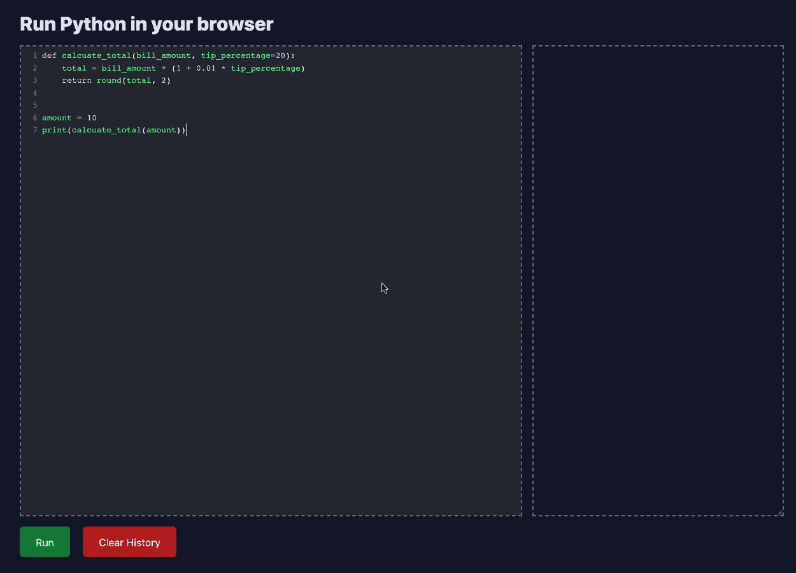

# 使用 WebAssembly 在浏览器中运行 Python

> 原文：<https://testdriven.io/blog/python-webassembly/>

Python 社区长期以来一直在讨论让 Python 成为现代 web 浏览器中的一等公民的最佳方式。最大的挑战是 web 浏览器实际上只支持一种编程语言:JavaScript。然而，随着网络技术的进步，我们已经将越来越多的应用程序推向网络，如游戏、科学可视化以及音频和视频编辑软件。这意味着我们给网络带来了繁重的计算——这不是 JavaScript 的设计初衷。所有这些挑战都提出了对一种能够提供快速、可移植、紧凑和安全执行的低级 web 语言的需求。因此，主要浏览器供应商致力于这一想法，并在 2017 年向世界推出了 [WebAssembly](https://dl.acm.org/doi/10.1145/3062341.3062363) 。

在本教程中，我们将了解 WebAssembly 如何帮助您在浏览器中运行 Python 代码。

> 明确地说，JavaScript 本身就是一种强大的编程语言。只是不适合某些事情。关于这方面的更多信息，请查看 ASM 的[。JS to WebAssembly](https://brendaneich.com/2015/06/from-asm-js-to-webassembly/) 作者 Brendan Eich，JavaScript 的创造者。

## 我们正在建造的东西

假设你想教一门 Python 课程。为了使您的课程更有趣，每节课之后，您都要为学生准备一个练习，这样他们就可以练习他们所学的内容。

这里的问题是，学生需要通过安装特定版本的 Python、创建和激活虚拟环境以及安装所有必要的包来准备开发环境。这会耗费大量的时间和精力。因为每台机器都不一样，所以很难提供准确的说明。

虽然您可以创建一个后端来运行 Docker 容器或 AWS Lambda 函数中提交的代码，但您选择保持堆栈简单，并在课程内容中添加一个 Python 编辑器，该编辑器可以在客户端、web 浏览器中运行 Python 代码，并向用户显示结果。这正是您将在本教程中构建的内容:



点击查看现场演示[。你也可以在 wasmeditor.com 的](https://python-browser-editor.onrender.com/)[看到它的 React 版本。](https://wasmeditor.com/)

## web 程序集

根据 Mozilla 开发者网络(MDN)文档的定义， [WebAssembly](https://developer.mozilla.org/en-US/docs/WebAssembly/Concepts#what_is_webassembly) (WASM)是:

一种新型代码，可以在现代网络浏览器中运行，并提供了新的功能和主要的性能提升。它主要不是用来手工编写的，而是被设计成 C、C++、Rust 等源语言的有效编译目标。

因此，WASM 让我们在浏览器中运行用不同语言编写的代码(不仅仅是 JavaScript ),这样做有以下好处:

1.  它快速、高效、便携。
2.  它是安全的，因为代码是在安全的沙盒执行环境中运行的。
3.  它可以在客户端运行。

因此，在我们上面的例子中，我们不需要担心用户是否在我们的服务器上运行代码，我们也不需要担心成千上万的学生尝试练习代码，因为代码执行发生在客户端，在 web 浏览器中。

WebAssembly 并不是为了杀死 JavaScript 而设计的。它是 JavaScript 的补充。当 JavaScript 不是合适的工具时，可以使用它，比如游戏、图像识别和图像/视频编辑等等。

> 请参见来自 WebAssembly.org[的](https://webassembly.org/docs/use-cases/)[用例](https://webassembly.org/docs/use-cases/)了解更多关于何时您可能想要利用 WebAssembly 的信息。

## Pyodide

本教程使用 [Pyodide](https://pyodide.org/) 库来运行 Python 代码，该代码将 CPython 解释器编译成 WebAssembly，并在浏览器的 JavaScript 环境中运行二进制文件。它附带了许多预装的 Python [包](https://github.com/pyodide/pyodide/tree/main/packages)。你也可以使用[micro tip](https://pyodide.org/en/stable/usage/api/micropip-api.html)来使用更多默认不提供的软件包。

### 你好世界

使用以下代码创建一个新的 HTML 文件:

```
`<head>
  <script src="https://cdn.jsdelivr.net/pyodide/v0.20.0/full/pyodide.js"></script>
  <script> async  function  main()  { let  pyodide  =  await  loadPyodide({ indexURL  :  "https://cdn.jsdelivr.net/pyodide/v0.20.0/full/" }); console.log(pyodide.runPython("print('Hello, world from the browser!')")); }; main(); </script>
</head>` 
```

在浏览器中打开文件。然后，在您浏览器的[开发工具](https://developer.mozilla.org/en-US/docs/Learn/Common_questions/What_are_browser_developer_tools)的控制台中，您应该执行如下操作:

```
`Loading distutils
Loading distutils from https://cdn.jsdelivr.net/pyodide/v0.20.0/full/distutils.js
Loaded distutils
Python initialization complete
Hello, world from the browser!` 
```

如您所见，最后一行是浏览器中 Python 代码执行的结果。

让我们快速看一下上面的代码:

1.  首先，你可以使用 [CDN](https://pyodide.org/en/stable/usage/downloading-and-deploying.html#cdn) 或者直接从 [GitHub 版本](https://pyodide.org/en/stable/usage/downloading-and-deploying.html#github-releases)下载并安装 Pyodide。
2.  [loadPyodide](https://pyodide.org/en/stable/usage/api/js-api.html#globalThis.loadPyodide) 加载并初始化 Pyodide wasm 模块。
3.  [pyodide.runPython](https://pyodide.org/en/stable/usage/api/js-api.html#pyodide.runPython) 以 Python 代码为字符串，返回代码的结果。

### 优点

在前面的例子中，您看到了安装 Pyodide 并开始使用它是多么容易。你只需要从 CDN 导入 [pyodide.js](https://pyodide.org/en/stable/usage/downloading-and-deploying.html) 并通过`loadPyodide`初始化即可。之后，您可以使用`pyodide.runPython("Your Python Code Here")`在浏览器中运行您的 Python 代码。

当你第一次下载 Pyodide 时，下载量很大，因为你下载的是完整的 CPython 解释器，但是你的浏览器会缓存它，你不需要再次下载。

还有一个很大的、活跃的社区在研究 Pyodide:

1.  [脓皮病路线图](https://pyodide.org/en/stable/project/roadmap.html#)
2.  [GitHub 上的未决问题](https://github.com/pyodide/pyodide/issues)
3.  [Gitter 社区](https://gitter.im/pyodide/community)

### 脓毒性限制

第一次加载 Pyodide 需要四五秒钟(取决于你的连接),因为你需要下载大约 10MB。此外，Pyodide 代码的运行速度比原生 Python 慢 3 到 5 倍。

### 其他选项

通常，如果您想在浏览器中运行 Python，有两种方法可用:

1.  使用 transpiler 将 Python 转换为 JavaScript。 [Brython](https://brython.info/) 、 [Transcrypt](https://www.transcrypt.org/) 、 [Skulpt](https://skulpt.org/) 都采用这种方式。
2.  转换 Python 运行时以便在浏览器中使用。Pyodide 和 [PyPy.js](https://pypyjs.org/) 使用这种方法。

选项一和选项二的一个主要区别是，选项一中提到的库不支持 Python 包。也就是说，它们的下载大小比选项二中的库要小得多，因此速度更快。

我们在本教程中使用 Pyodide，因为它的语法更简单，并且支持 Python 包。如果您对其他选项感兴趣，请随意查看它们的文档。

## Python 代码编辑器

在本节中，我们将创建一个简单的 Python 编辑器，它可以使用以下代码在浏览器中运行代码:

1.  [Pyodide](https://pyodide.org/)
2.  [代码镜像](https://codemirror.net/)
3.  [烧瓶](https://flask.palletsprojects.com/)

创建新项目:

```
`$ mkdir python_editor_wasm
$ cd python_editor_wasm` 
```

创建并激活虚拟环境:

```
`$ python3.10 -m venv env
$ source env/bin/activate
(env)$` 
```

安装烧瓶:

在项目的根目录下创建一个名为 *app.py* 的文件，并添加以下代码:

```
`from flask import Flask, render_template

app = Flask(__name__)

@app.route('/')
def index():
    return render_template('index.html')

if __name__ == '__main__':
    app.run(debug=True)` 
```

在我们项目的根目录下创建一个“模板”文件夹，并在它下面添加*index.html*文件。

*模板/索引. html* :

```
`<!doctype html>
<html class="h-full bg-slate-900">
<head>
  <meta charset="UTF-8">
  <meta name="viewport" content="width=device-width, initial-scale=1.0">
  <!-- install tailwindcss from cdn, don't do this for production application -->
  <script src="https://cdn.tailwindcss.com"></script>
  <!-- install pyodide version 0.20.0 -->
  <script src="https://cdn.jsdelivr.net/pyodide/v0.20.0/full/pyodide.js"></script>
  <!-- import codemirror stylings -->
  <link rel="stylesheet" href="https://cdnjs.cloudflare.com/ajax/libs/codemirror/5.48.4/codemirror.min.css" />
  <!-- install codemirror.js version /5.63.3 from cdn -->
  <script src="https://cdnjs.cloudflare.com/ajax/libs/codemirror/5.63.3/codemirror.min.js"
  integrity="sha512-XMlgZzPyVXf1I/wbGnofk1Hfdx+zAWyZjh6c21yGo/k1zNC4Ve6xcQnTDTCHrjFGsOrVicJsBURLYktVEu/8vQ=="
  crossorigin="anonymous" referrerpolicy="no-referrer"></script>
  <!-- install codemirror python language support -->
  <script src="https://cdnjs.cloudflare.com/ajax/libs/codemirror/5.63.3/mode/python/python.min.js"
  integrity="sha512-/mavDpedrvPG/0Grj2Ughxte/fsm42ZmZWWpHz1jCbzd5ECv8CB7PomGtw0NAnhHmE/lkDFkRMupjoohbKNA1Q=="
  crossorigin="anonymous" referrerpolicy="no-referrer"></script>
  <!-- import codemirror dracula theme styles from cdn -->
  <link rel="stylesheet" href="https://cdnjs.cloudflare.com/ajax/libs/codemirror/5.63.3/theme/dracula.css"/>
  <style> /* set codemirror ide height to 100% of the textarea */ .CodeMirror  { height:  100%; } </style>
</head>
<body class="h-full overflow-hidden max-w-7xl mx-auto px-4 sm:px-6 lg:px-8 mt-8">
  <p class="text-slate-200 text-3xl my-4 font-extrabold mx-2 pt-8">Run Python in your browser</p>
  <div class="h-3/4 flex flex-row">
    <div class="grid w-2/3 border-dashed border-2 border-slate-500 mx-2">
      <!-- our code editor, where codemirror renders it's editor -->
      <textarea id="code" name="code" class="h-full"></textarea>
    </div>
    <div class="grid w-1/3 border-dashed border-2 border-slate-500 mx-2">
      <!-- output section where we show the stdout of the python code execution -->
      <textarea readonly class="p-8 text-slate-200 bg-slate-900" id="output" name="output"></textarea>
    </div>
  </div>
  <!-- run button to pass the code to pyodide.runPython() -->
  <button onclick="evaluatePython()" type="button" class="mx-2 my-4 h-12 px-6 py-3 border border-transparent text-base font-medium rounded-md shadow-sm bg-green-700 hover:bg-green-900 focus:outline-none focus:ring-2 focus:ring-offset-2 focus:ring-green-700 text-slate-300">Run</button>
  <!-- clean the output section -->
  <button onclick="clearHistory()" type="button" class="mx-2 my-4 h-12 px-6 py-3 border border-transparent text-base font-medium rounded-md shadow-sm bg-red-700 hover:bg-red-900 focus:outline-none focus:ring-2 focus:ring-offset-2 focus:ring-red-700 text-slate-300">Clear History</button>
  <script src="/static/js/main.js"></script>
</body>
</html>` 
```

在*index.html*文件的头部，我们导入了用于样式的 Tailwind CSS、Pyodide.js 版本`0.20.0`，以及 CodeMirror 及其依赖项。

UI 有三个重要的组件:

1.  **编辑器**:用户可以在这里编写 Python 代码。这是一个带有`code`的`id`的`textarea` HTML 元素。当我们初始化`codemirror`时，我们让它知道我们想要使用这个元素作为代码编辑器。
2.  **输出**:显示代码的输出。这是一个带有`output`的`id`的`textarea`元素。Pyodide 执行 Python 代码时，会将结果输出到这个元素。我们也在这个元素中显示了一个错误消息。
3.  **运行按钮**:当用户点击这个按钮时，我们获取编辑器元素的值，并将其作为字符串传递给`pyodide.runPython`。当`pyodide.runPython`返回结果时，我们在输出元素中显示它。

现在在项目的根目录下，创建“static/js”文件夹。然后，在“js”文件夹下，创建一个名为 *main.js* 的新文件。

*static/js/main.js* :

```
`// find the output element const  output  =  document.getElementById("output"); // initialize codemirror and pass configuration to support Python and the dracula theme const  editor  =  CodeMirror.fromTextArea( document.getElementById("code"),  { mode:  { name:  "python", version:  3, singleLineStringErrors:  false, }, theme:  "dracula", lineNumbers:  true, indentUnit:  4, matchBrackets:  true, } ); // set the initial value of the editor editor.setValue("print('Hello world')"); output.value  =  "Initializing...\n"; // add pyodide returned value to the output function  addToOutput(stdout)  { output.value  +=  ">>> "  +  "\n"  +  stdout  +  "\n"; } // clean the output section function  clearHistory()  { output.value  =  ""; } // init pyodide and show sys.version when it's loaded successfully async  function  main()  { let  pyodide  =  await  loadPyodide({ indexURL:  "https://cdn.jsdelivr.net/pyodide/v0.20.0/full/", }); output.value  =  pyodide.runPython(`
 import sys
 sys.version
 `); output.value  +=  "\n"  +  "Python Ready !"  +  "\n"; return  pyodide; } // run the main function let  pyodideReadyPromise  =  main(); // pass the editor value to the pyodide.runPython function and show the result in the output section async  function  evaluatePython()  { let  pyodide  =  await  pyodideReadyPromise; try  { pyodide.runPython(`
 import io
 sys.stdout = io.StringIO()
 `); let  result  =  pyodide.runPython(editor.getValue()); let  stdout  =  pyodide.runPython("sys.stdout.getvalue()"); addToOutput(stdout); }  catch  (err)  { addToOutput(err); } }` 
```

在此，我们:

1.  初始化 CodeMirror，支持 [Python](https://codemirror.net/mode/python/) 和[吸血鬼主题](https://en.wikipedia.org/wiki/Dracula_(color_scheme))。
2.  已初始化 Pyodide。
3.  添加了一个名为`evaluatePython`的函数，当用户点击`Run`按钮时执行。它将`code`元素的值传递给`pyodide.runPython`，并通过`addToOutput`在`output`元素中显示结果。
4.  添加了一个名为`clearHistory`的函数，当用户点击`Clear History`按钮时，该函数清除`output`元素。

要在本地运行 Flask development server，请运行:

服务器现在应该运行在端口 5000 上。在浏览器中导航到 [http://127.0.0.1:5000](http://127.0.0.1:5000) 来测试代码编辑器。

## 结论

在本教程中，我们仅仅触及了 Pyodide 和 WebAssembly 的冰山一角。我们看到了如何使用 WebAssembly 在浏览器中运行 Python 代码，但是 WebAssembly 通常涵盖更广泛的用例。

我们的部署平台比以往更加多样化，我们根本负担不起不断为多个平台重写软件的时间和金钱。WebAssembly 可以影响客户端 web 开发、服务器端开发、游戏、教育、云计算、移动平台、物联网、无服务器等等。

WebAssembly 的目标是交付快速、安全、可移植和紧凑的软件。

在这里可以找到代码 repo [。](https://github.com/amirtds/python_editor_wasm)