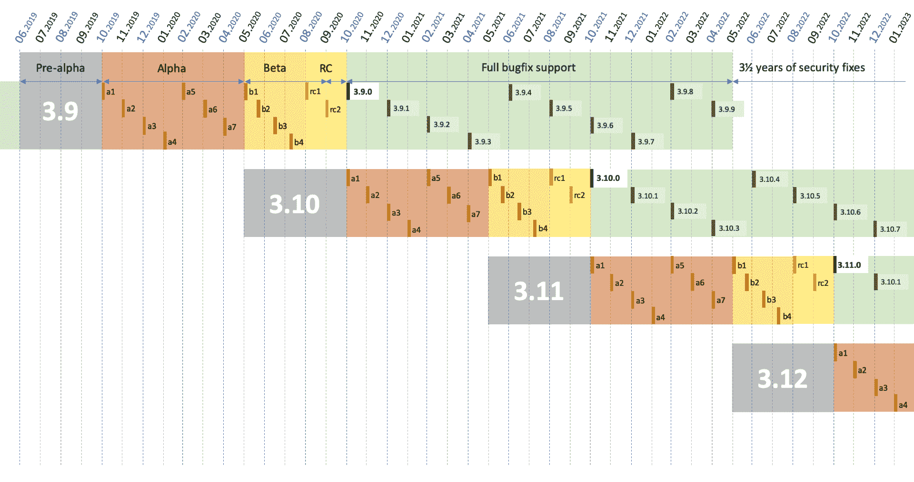

# Python 3.9:新特性

> 原文：<https://testdriven.io/blog/python39/>

Python 3.9 于 2020 年 10 月 5 日发布，没有带来任何重大的新特性，但仍然有一些重大的变化，特别是在语言的开发和发布方面。

## 开发周期

这是来自新发布理念的第一个 Python 版本，其中主要发布每 12 个月(10 月)而不是每 18 个月进行一次。随着发布越来越频繁，变化应该越来越小——这正是我们在 Python 3.9 中看到的。

所有新版本都有 1.5 年的全面支持和 3.5 年的安全修复。

[](/static/images/blog/python39/python_releases.png)

更多信息:[https://www.python.org/dev/peps/pep-0602/](https://www.python.org/dev/peps/pep-0602/)

## 词典联盟

### 合并词典

我们现在有一个用于执行字典联合的合并操作符:`|`。它的工作方式与`a.update(b)`或`{**a, **b}`相同，只有一点不同:它适用于`dict`子类的任何实例。

> 如果你有 Docker，你可以通过`docker run -it --rm python:3.9`快速构建一个 Python 3.9 shell 来使用本文中的例子。

您可以像这样合并两个字典:

```
`user = {'name': 'John', 'surname': 'Doe'}
address = {'street': 'Awesome street 42', 'city': 'Huge city', 'post': '420000'}

user_with_address = user | address

print(user_with_address)
# {'name': 'John', 'surname': 'Doe', 'street': 'Awesome street 42', 'city': 'Huge city', 'post': '420000'}` 
```

现在，我们有了一个新的字典叫做`user_with_address`，它是`user`和`address`的结合。

如果字典中有重复的键，那么输出将显示第二个(最右边的)键-值对:

```
`user_1 = {'name': 'John', 'surname': 'Doe'}
user_2 = {'name': 'Joe', 'surname': 'Doe'}

users = user_1 | user_2
print(users)
# {'name': 'Joe', 'surname': 'Doe'}` 
```

> 运算符的意思是并集，而不是或。它不做任何位运算，也不充当逻辑运算符。它用于创建两个字典的并集。因为它看起来类似于其他语言中的 or 条件，所以您可能希望在代码评审期间仔细检查它是如何使用的。

### 更新词典

至于更新，现在有了操作符`|=`。这在适当的地方工作。

您可以用第二个字典中的键和值更新第一个字典，如下所示:

```
`grades = {'John': 'A', 'Marry': 'B+'}
grades_second_try = {'Marry': 'A', 'Jane': 'C-', 'James': 'B'}

grades |= grades_second_try

print(grades)
# {'John': 'A', 'Marry': 'A', 'Jane': 'C-', 'James': 'B'}` 
```

它适用于任何带有`keys`和`__getitem__`的对象或者带有键值对的可迭代对象:

```
`# example 1
grades = {'John': 'A', 'Marry': 'B+'}
grades_second_try = [('Marry', 'A'), ('Jane', 'C-'), ('James', 'B')]
grades |= grades_second_try
print(grades)
# {'John': 'A', 'Marry': 'A', 'Jane': 'C-', 'James': 'B'}

# example 2
x = {0: 0, 1: 1}
y = ((i, i**2) for i in range(2,6))
x |= y
print(x)
{0: 0, 1: 1, 2: 4, 3: 9, 4: 16, 5: 25}

# example 3
x | y
Traceback (most recent call last):
  File "<stdin>", line 1, in <module>
TypeError: unsupported operand type(s) for |: 'dict' and 'generator'` 
```

更多信息:[https://www.python.org/dev/peps/pep-0584/](https://www.python.org/dev/peps/pep-0584/)

## 生成随机字节

[random](https://docs.python.org/3/library/random.html) 库现在可以用来通过 [randbytes](https://docs.python.org/3/library/random.html#random.randbytes) 生成随机字节。

例如，要生成十个随机字节:

```
`import random

print(random.Random().randbytes(10))
b'CO\x0e\x0e~\x12\x0c\xa4\xa0p'` 
```

更多信息:[https://bugs.python.org/issue40286](https://bugs.python.org/issue40286)

## 字符串方法

向`str`对象添加了两个方法:

1.  [删除前缀](https://docs.python.org/3/library/stdtypes.html#str.removeprefix)
2.  [removesuffix](https://docs.python.org/3/library/stdtypes.html#str.removesuffix)

### 移除前缀

第一种方法从另一个字符串的开头删除输入的字符串。

例如:

```
`file_name = 'DOCUMENT_001.pdf'

print(file_name.removeprefix('DOCUMENT_'))
#  001.pdf` 
```

如果字符串不是以输入字符串开头，将返回原始字符串的副本:

```
`file_name = 'DOCUMENT_001.pdf'

print(file_name.removeprefix('DOC_'))
# DOCUMENT_001.pdf` 
```

### 删除后缀

类似地，我们可以用第二种方法从选中的字符串中删除后缀。

要从文件名中删除文件扩展名`.pdf`:

```
`file_name = 'DOCUMENT_001.pdf'

print(file_name.removesuffix('.pdf'))
# DOCUMENT_001

file_name = 'DOCUMENT_001.pdf'

print(file_name.removesuffix('.csv'))
# DOCUMENT_001.pdf` 
```

更多信息:[https://www.python.org/dev/peps/pep-0616/](https://www.python.org/dev/peps/pep-0616/)

## IANA 时区支持

添加了 [zoneinfo](https://docs.python.org/3/library/zoneinfo.html) 模块来支持 IANA 时区数据库。

例如，要创建支持时区的时间戳，可以向 datetime 方法添加`tz`或`tzinfo`参数:

```
`import datetime
from zoneinfo import ZoneInfo

datetime.datetime(2020, 10, 7, 1, tzinfo=ZoneInfo('America/Los_Angeles'))
# datetime.datetime(2020, 10, 7, 1, 0, tzinfo=zoneinfo.ZoneInfo(key='America/Los_Angeles'))` 
```

您也可以轻松地在时区之间转换:

```
`import datetime
from zoneinfo import ZoneInfo

start = datetime.datetime(2020, 10, 7, 1, tzinfo=ZoneInfo('America/Los_Angeles'))
start.astimezone(ZoneInfo('Europe/London'))
datetime.datetime(2020, 10, 7, 9, 0, tzinfo=zoneinfo.ZoneInfo(key='Europe/London'))` 
```

更多信息:[https://www.python.org/dev/peps/pep-0615/](https://www.python.org/dev/peps/pep-0615/)

## 泛型类型批注

从现在开始，您可以对类型注释使用泛型类型。您可以使用`list`或`dict`内置集合类型作为泛型类型，而不必使用`typing.List`或`typing.Dict`

```
`def sort_names(names: list[str]):
    return sorted(names)` 
```

> Python 是动态类型化的，类型是动态推断的。由于这并不总是可取的，类型提示可以用来指定类型。这是在 Python 3.5 中引入的。能够将内置集合类型用作泛型类型极大地简化了类型提示。

更多信息:[https://www.python.org/dev/peps/pep-0585/](https://www.python.org/dev/peps/pep-0585/)

## 取消并行期货

一个名为`cancel_futures`的新参数被添加到`concurrent.futures.Executor.shutdown()`中。当设置为`True`时，取消所有未开始运行的未决期货。在 3.9 版本之前，进程会在关闭执行器之前等待它们完成。

更多信息:[https://bugs.python.org/issue30966](https://bugs.python.org/issue30966)

## 导入错误

在以前的版本中，`__import__`和`importlib.util.resolve_name()`在相对导入通过其顶层包时引发`ValueError`。现在您将得到一个`ImportError`，它更好地描述了正在处理的情况。

更多信息:[https://bugs.python.org/issue37444](https://bugs.python.org/issue37444)

## 字符串替换修复

修复了空字符串替换的问题。

在以前的版本中:

```
`"".replace("", "prefix", 1)
# ''` 
```

从现在开始:

```
`"".replace("", "prefix", 1)
# 'prefix'` 
```

更多信息:[https://bugs.python.org/issue28029](https://bugs.python.org/issue28029)

## 新解析器

引入了一个新的更加灵活的基于 [PEG](https://en.wikipedia.org/wiki/Parsing_expression_grammar) (解析表达式语法)的解析器。虽然您可能不会注意到，但这是 Python 这个版本最显著的变化。

基于 PEG 的解析器的[性能](https://www.python.org/dev/peps/pep-0617/#performance)可与旧的 [LL(1)](https://en.wikipedia.org/wiki/LL_parser) (从左到右解析器)相媲美，但它更灵活的形式主义应该更容易设计新的语言特性。

更多信息:[https://www.python.org/dev/peps/pep-0617](https://www.python.org/dev/peps/pep-0617)

## 表演

最后，Python 3.8 中引入的 [vectorcall](https://www.python.org/dev/peps/pep-0590/) 协议现在已经扩展到了几个内置的，包括 range、tuple、set、frozenset、list 和 dict。简而言之，vectorcall 通过减少为调用创建的临时对象的数量来减少开销，从而使许多常见的函数调用变得更快。

更多信息:[https://docs . python . org/3.9/c-API/call . html # the-vector call-protocol](https://docs.python.org/3.9/c-api/call.html#the-vectorcall-protocol)

## 结论

这篇文章仅仅触及了语言的主要变化。完整的变更列表可以在[这里](https://docs.python.org/3.9/whatsnew/3.9.html)找到。

编码快乐！