# 并行运行 Cypress 测试

> 原文：<https://testdriven.io/blog/running-cypress-tests-in-parallel/>

在接下来的教程中，我们将带您了解如何配置 [Cypress](https://www.cypress.io/) 来与 [CircleCI](https://circleci.com/) 并行运行测试。

> 想看看最终项目的运行情况吗？查看[视频](https://www.youtube.com/watch?v=0eSET5MdcYs)。

## 项目设置

让我们从建立一个基本的 Cypress 项目开始:

```
`$ mkdir cypress-parallel && cd cypress-parallel
$ npm init -y
$ npm install cypress --save-dev
$ ./node_modules/.bin/cypress open` 
```

这将创建一个新的项目文件夹，添加一个 *package.json* 文件，安装 Cypress，打开 Cypress GUI，并构建出以下文件和文件夹:

```
`├── cypress
│   ├── fixtures
│   │   └── example.json
│   ├── integration
│   │   └── examples
│   │       ├── actions.spec.js
│   │       ├── aliasing.spec.js
│   │       ├── assertions.spec.js
│   │       ├── connectors.spec.js
│   │       ├── cookies.spec.js
│   │       ├── cypress_api.spec.js
│   │       ├── files.spec.js
│   │       ├── local_storage.spec.js
│   │       ├── location.spec.js
│   │       ├── misc.spec.js
│   │       ├── navigation.spec.js
│   │       ├── network_requests.spec.js
│   │       ├── querying.spec.js
│   │       ├── spies_stubs_clocks.spec.js
│   │       ├── traversal.spec.js
│   │       ├── utilities.spec.js
│   │       ├── viewport.spec.js
│   │       ├── waiting.spec.js
│   │       └── window.spec.js
│   ├── plugins
│   │   └── index.js
│   └── support
│       ├── commands.js
│       └── index.js
└─── cypress.json` 
```

关上柏圭。然后，删除“cypress/integration/examples”文件夹，并添加四个样本规范文件:

*sample1.spec.js*

```
`describe('Cypress parallel run example - 1',  ()  =>  { it('should display the title',  ()  =>  { cy.visit(`https://mherman.org`); cy.get('a').contains('Michael Herman'); }); });` 
```

*sample2.spec.js*

```
`describe('Cypress parallel run example - 2',  ()  =>  { it('should display the blog link',  ()  =>  { cy.visit(`https://mherman.org`); cy.get('a').contains('Blog'); }); });` 
```

*sample3.spec.js*

```
`describe('Cypress parallel run example - 3',  ()  =>  { it('should display the about link',  ()  =>  { cy.visit(`https://mherman.org`); cy.get('a').contains('About'); }); });` 
```

*sample4.spec.js*

```
`describe('Cypress parallel run example - 4',  ()  =>  { it('should display the rss link',  ()  =>  { cy.visit(`https://mherman.org`); cy.get('a').contains('RSS'); }); });` 
```

您的项目现在应该具有以下结构:

```
`├── cypress
│   ├── fixtures
│   │   └── example.json
│   ├── integration
│   │   ├── sample1.spec.js
│   │   ├── sample2.spec.js
│   │   ├── sample3.spec.js
│   │   └── sample4.spec.js
│   ├── plugins
│   │   └── index.js
│   └── support
│       ├── commands.js
│       └── index.js
├── cypress.json
├── package-lock.json
└── package.json` 
```

确保在继续之前通过测试:

```
`$ ./node_modules/.bin/cypress run

      Spec                                                Tests  Passing  Failing  Pending  Skipped
  ┌────────────────────────────────────────────────────────────────────────────────────────────────┐
  │ ✔ sample1.spec.js                           00:02        1        1        -        -        - │
  ├────────────────────────────────────────────────────────────────────────────────────────────────┤
  │ ✔ sample2.spec.js                           00:01        1        1        -        -        - │
  ├────────────────────────────────────────────────────────────────────────────────────────────────┤
  │ ✔ sample3.spec.js                           00:02        1        1        -        -        - │
  ├────────────────────────────────────────────────────────────────────────────────────────────────┤
  │ ✔ sample4.spec.js                           00:01        1        1        -        -        - │
  └────────────────────────────────────────────────────────────────────────────────────────────────┘
    All specs passed!                           00:08        4        4        -        -        -` 
```

一旦完成，添加一个*。gitignore* 文件:

```
`node_modules/
cypress/videos/
cypress/screenshots/` 
```

在 GitHub 上创建一个名为 *cypress-parallel* 的新存储库，在本地初始化一个新的 git repo，然后将代码提交到 GitHub。

## CircleCI 设置

如果你还没有一个 [CircleCI](https://circleci.com/) 账户，就注册吧。然后，在 CircleCI 上添加*柏树平行*作为新项目。

> 查看[入门](https://circleci.com/docs/2.0/getting-started/#section=getting-started)指南，了解如何在 CircleCI 上设置和使用项目。

向名为“”的文件夹中添加一个新文件。circleci”，然后向该文件夹添加一个名为 *config.yml* 的新文件:

```
`version:  2 jobs: build: working_directory:  ~/tmp docker: -  image:  'cypress/base:10' environment: TERM:  xterm steps: -  checkout -  run:  pwd -  run:  ls -  restore_cache: keys: -  'v2-deps-{{  .Branch  }}-{{  checksum  "package-lock.json"  }}' -  'v2-deps-{{  .Branch  }}-' -  v2-deps- -  run:  npm ci -  save_cache: key:  'v2-deps-{{  .Branch  }}-{{  checksum  "package-lock.json"  }}' paths: -  ~/.npm -  ~/.cache -  persist_to_workspace: root:  ~/ paths: -  .cache -  tmp test: working_directory:  ~/tmp docker: -  image:  'cypress/base:10' environment: TERM:  xterm steps: -  attach_workspace: at:  ~/ -  run:  ls -la cypress -  run:  ls -la cypress/integration -  run: name:  Running cypress tests command:  $(npm bin)/cypress run -  store_artifacts: path:  cypress/videos -  store_artifacts: path:  cypress/screenshots workflows: version:  2 build_and_test: jobs: -  build -  test: requires: -  build` 
```

这里，我们配置了两个作业，`build`和`test`。`build`作业安装 Cypress，测试在`test`作业中运行。这两个任务都在 Docker 内部运行，并从 [cypress/base](https://hub.docker.com/r/cypress/base) 映像扩展而来。

> 有关 CircleCI 配置的更多信息，请查看[配置介绍](https://circleci.com/docs/2.0/config-intro/#section=configuration)指南。

提交并推送您的代码以触发新的构建。确保两个工作都通过。您应该能够在`test`任务的“工件”选项卡中看到 Cypress 录制的视频:

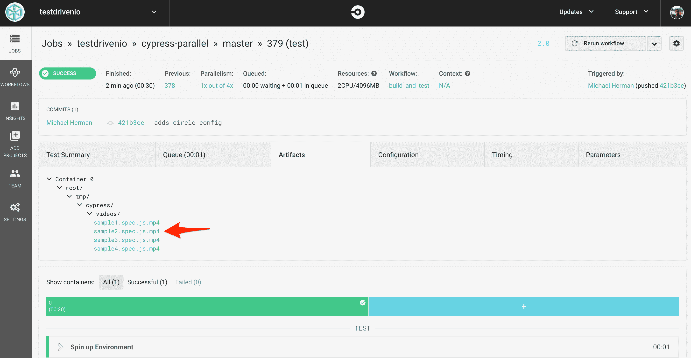

这样，让我们看看如何使用配置文件分割测试，这样 Cypress 测试可以在[并行](https://circleci.com/docs/2.0/parallelism-faster-jobs/)中运行。

## 平行

我们将从手动拆分它们开始。像这样更新配置文件:

```
`version:  2 jobs: build: working_directory:  ~/tmp docker: -  image:  'cypress/base:10' environment: TERM:  xterm steps: -  checkout -  run:  pwd -  run:  ls -  restore_cache: keys: -  'v2-deps-{{  .Branch  }}-{{  checksum  "package-lock.json"  }}' -  'v2-deps-{{  .Branch  }}-' -  v2-deps- -  run:  npm ci -  save_cache: key:  'v2-deps-{{  .Branch  }}-{{  checksum  "package-lock.json"  }}' paths: -  ~/.npm -  ~/.cache -  persist_to_workspace: root:  ~/ paths: -  .cache -  tmp test1: working_directory:  ~/tmp docker: -  image:  'cypress/base:10' environment: TERM:  xterm steps: -  attach_workspace: at:  ~/ -  run:  ls -la cypress -  run:  ls -la cypress/integration -  run: name:  Running cypress tests 1 command:  $(npm bin)/cypress run --spec cypress/integration/sample1.spec.js -  store_artifacts: path:  cypress/videos -  store_artifacts: path:  cypress/screenshots test2: working_directory:  ~/tmp docker: -  image:  'cypress/base:10' environment: TERM:  xterm steps: -  attach_workspace: at:  ~/ -  run:  ls -la cypress -  run:  ls -la cypress/integration -  run: name:  Running cypress tests 2 command:  $(npm bin)/cypress run --spec cypress/integration/sample2.spec.js -  store_artifacts: path:  cypress/videos -  store_artifacts: path:  cypress/screenshots test3: working_directory:  ~/tmp docker: -  image:  'cypress/base:10' environment: TERM:  xterm steps: -  attach_workspace: at:  ~/ -  run:  ls -la cypress -  run:  ls -la cypress/integration -  run: name:  Running cypress tests 3 command:  $(npm bin)/cypress run --spec cypress/integration/sample3.spec.js -  store_artifacts: path:  cypress/videos -  store_artifacts: path:  cypress/screenshots test4: working_directory:  ~/tmp docker: -  image:  'cypress/base:10' environment: TERM:  xterm steps: -  attach_workspace: at:  ~/ -  run:  ls -la cypress -  run:  ls -la cypress/integration -  run: name:  Running cypress tests 4 command:  $(npm bin)/cypress run --spec cypress/integration/sample4.spec.js -  store_artifacts: path:  cypress/videos -  store_artifacts: path:  cypress/screenshots workflows: version:  2 build_and_test: jobs: -  build -  test1: requires: -  build -  test2: requires: -  build -  test3: requires: -  build -  test4: requires: -  build` 
```

因此，我们创建了四个测试作业，每个作业将在 CircleCI 上的不同机器上运行单个 spec 文件。提交你的代码并上传到 GitHub。这一次，一旦`build`作业完成，您应该会看到每个测试作业同时运行:

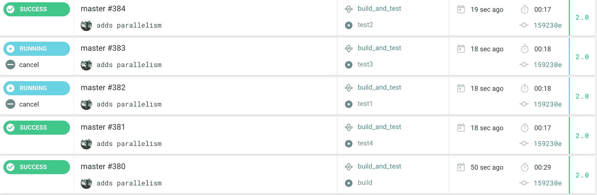

接下来，让我们看看如何动态生成配置文件。

## 生成 CircleCI 配置

在项目根目录中创建一个“lib”文件夹，然后将以下文件添加到该文件夹中:

1.  *circle.json*
2.  *generate-circle-config . js*

将`build`作业的配置添加到 *circle.json* :

```
`{ "version":  2, "jobs":  { "build":  { "working_directory":  "~/tmp", "docker":  [ { "image":  "cypress/base:10", "environment":  { "TERM":  "xterm" } } ], "steps":  [ "checkout", { "run":  "pwd" }, { "run":  "ls" }, { "restore_cache":  { "keys":  [ "v2-deps-{{ .Branch }}-{{ checksum \"package-lock.json\" }}", "v2-deps-{{ .Branch }}-", "v2-deps-" ] } }, { "run":  "npm ci" }, { "save_cache":  { "key":  "v2-deps-{{ .Branch }}-{{ checksum \"package-lock.json\" }}", "paths":  [ "~/.npm", "~/.cache" ] } }, { "persist_to_workspace":  { "root":  "~/", "paths":  [ ".cache", "tmp" ] } } ] } }, "workflows":  { "version":  2, "build_and_test":  { "jobs":  [ "build" ] } } }` 
```

本质上，我们将使用这个配置作为基础，动态地向其中添加测试作业，然后在 YAML 保存最终的配置文件。

将代码添加到*generate-circle-config . js*中:

1.  从“cypress/integration”目录中获取等级库文件的名称
2.  将 *circle.json* 文件作为对象读取
3.  将测试作业添加到对象
4.  将对象转换为 YAML，并作为*写入磁盘。circleci/config.yml*

代码:

```
`const  path  =  require('path'); const  fs  =  require('fs'); const  yaml  =  require('write-yaml'); /*
 helpers
*/ function  createJSON(fileArray,  data)  { for  (const  [index,  value]  of  fileArray.entries())  { data.jobs[`test${index  +  1}`]  =  { working_directory:  '~/tmp', docker:  [ { image:  'cypress/base:10', environment:  { TERM:  'xterm', }, }, ], steps:  [ { attach_workspace:  { at:  '~/', }, }, { run:  'ls -la cypress', }, { run:  'ls -la cypress/integration', }, { run:  { name:  `Running cypress tests ${index  +  1}`, command:  `$(npm bin)/cypress run --spec cypress/integration/${value}`, }, }, { store_artifacts:  { path:  'cypress/videos', }, }, { store_artifacts:  { path:  'cypress/screenshots', }, }, ], }; data.workflows.build_and_test.jobs.push({ [`test${index  +  1}`]:  { requires:  [ 'build', ], }, }); } return  data; } function  writeFile(data)  { yaml(path.join(__dirname,  '..',  '.circleci',  'config.yml'),  data,  (err)  =>  { if  (err)  { console.log(err); }  else  { console.log('Success!'); } }); } /*
 main
*/ // get spec files as an array const  files  =  fs.readdirSync(path.join(__dirname,  '..',  'cypress',  'integration')).filter(fn  =>  fn.endsWith('.spec.js')); // read circle.json const  circleConfigJSON  =  require(path.join(__dirname,  'circle.json')); // add cypress specs to object as test jobs const  data  =  createJSON(files,  circleConfigJSON); // write file to disc writeFile(data);` 
```

自己回顾(并重构)这一点。

安装 [write-yaml](https://www.npmjs.com/package/write-yaml) 然后生成新的配置文件:

```
`$ npm install write-yaml --save-dev
$ node lib/generate-circle-config.js` 
```

再次提交您的代码，并将其推送到 GitHub 以触发新的构建。同样，四个测试任务应该在`build`任务完成后并行运行。

## 摩卡真棒

接下来，让我们添加 [mochawesome](https://github.com/adamgruber/mochawesome) 作为 Cypress [自定义报告器](https://docs.cypress.io/guides/tooling/reporters.html#Custom-Reporters)，这样我们就可以在所有测试任务运行完毕后生成一个漂亮的报告。

安装:

```
`$ npm install mochawesome mocha --save-dev` 
```

更新*generate-circle-config . js*中`createJSON`函数的以下`run`步骤:

```
`run:  { name:  `Running cypress tests ${index  +  1}`, command:  `$(npm bin)/cypress run --spec cypress/integration/${value} --reporter mochawesome --reporter-options "reportFilename=test${index  +  1}"`, },` 
```

然后，添加一个新步骤，将生成的报告作为一个[工件](https://circleci.com/docs/2.0/artifacts/)存储到`createJSON`:

```
`{ store_artifacts:  { path:  'mochawesome-report', }, },` 
```

`createJSON`现在应该是这样的:

```
`function  createJSON(fileArray,  data)  { for  (const  [index,  value]  of  fileArray.entries())  { data.jobs[`test${index  +  1}`]  =  { working_directory:  '~/tmp', docker:  [ { image:  'cypress/base:10', environment:  { TERM:  'xterm', }, }, ], steps:  [ { attach_workspace:  { at:  '~/', }, }, { run:  'ls -la cypress', }, { run:  'ls -la cypress/integration', }, { run:  { name:  `Running cypress tests ${index  +  1}`, command:  `$(npm bin)/cypress run --spec cypress/integration/${value} --reporter mochawesome --reporter-options "reportFilename=test${index  +  1}"`, }, }, { store_artifacts:  { path:  'cypress/videos', }, }, { store_artifacts:  { path:  'cypress/screenshots', }, }, { store_artifacts:  { path:  'mochawesome-report', }, }, ], }; data.workflows.build_and_test.jobs.push({ [`test${index  +  1}`]:  { requires:  [ 'build', ], }, }); } return  data; }` 
```

现在，每个测试运行将生成一个具有唯一名称的 mochawesome 报告。试试看。生成新的配置。提交并推送您的代码。每个测试作业都应该在“工件”选项卡中存储一份生成的 mochawesome 报告的副本:


实际的报告应该是这样的:

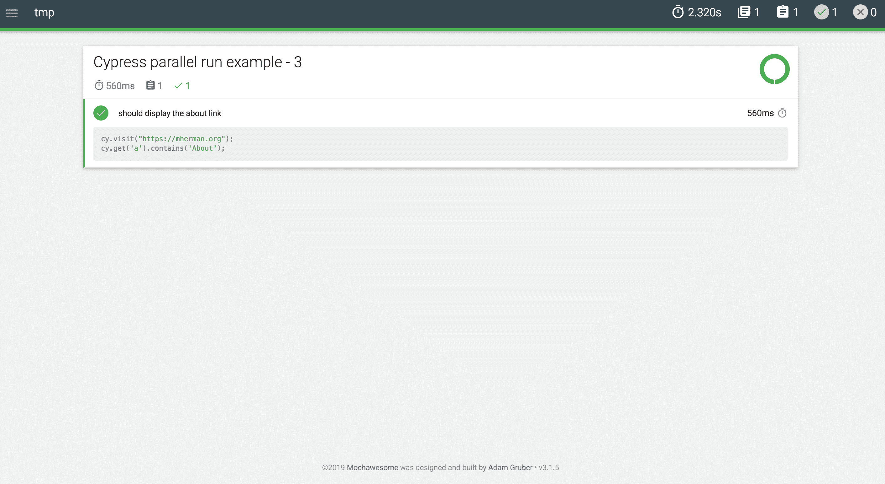

## 合并报告

下一步是将单独的报告合并成一个报告。首先向`createJSON`函数添加一个新步骤，将生成的报告存储在[工作区](https://circleci.com/docs/2.0/configuration-reference/#persist_to_workspace)中:

```
`{ persist_to_workspace:  { root:  'mochawesome-report', paths:  [ `test${index  +  1}.json`, `test${index  +  1}.html`, ], }, },` 
```

此外，向 *lib/circle.json* 添加一个名为`combine_reports`的新作业，它附加工作区，然后运行一个`ls`命令来显示目录的内容:

```
`"combine_reports":  { "working_directory":  "~/tmp", "docker":  [ { "image":  "cypress/base:10", "environment":  { "TERM":  "xterm" } } ], "steps":  [ { "attach_workspace":  { "at":  "/tmp/mochawesome-report" } }, { "run":  "ls /tmp/mochawesome-report" } ] }` 
```

> `ls`的目的是确保我们正确地持久化和附加工作空间。换句话说，在运行时，您应该看到“/tmp/mochawesome-report”目录中的所有报告。

因为这个作业依赖于测试作业，所以再次更新`createJSON`,就像这样:

```
`function  createJSON(fileArray,  data)  { const  jobs  =  []; for  (const  [index,  value]  of  fileArray.entries())  { jobs.push(`test${index  +  1}`); data.jobs[`test${index  +  1}`]  =  { working_directory:  '~/tmp', docker:  [ { image:  'cypress/base:10', environment:  { TERM:  'xterm', }, }, ], steps:  [ { attach_workspace:  { at:  '~/', }, }, { run:  'ls -la cypress', }, { run:  'ls -la cypress/integration', }, { run:  { name:  `Running cypress tests ${index  +  1}`, command:  `$(npm bin)/cypress run --spec cypress/integration/${value} --reporter mochawesome --reporter-options "reportFilename=test${index  +  1}"`, }, }, { store_artifacts:  { path:  'cypress/videos', }, }, { store_artifacts:  { path:  'cypress/screenshots', }, }, { store_artifacts:  { path:  'mochawesome-report', }, }, { persist_to_workspace:  { root:  'mochawesome-report', paths:  [ `test${index  +  1}.json`, `test${index  +  1}.html`, ], }, }, ], }; data.workflows.build_and_test.jobs.push({ [`test${index  +  1}`]:  { requires:  [ 'build', ], }, }); } data.workflows.build_and_test.jobs.push({ combine_reports:  { 'requires':  jobs, }, }); return  data; }` 
```

生成配置:

```
`$ node lib/generate-circle-config.js` 
```

配置文件现在应该看起来像这样:

```
`version:  2 jobs: build: working_directory:  ~/tmp docker: -  image:  'cypress/base:10' environment: TERM:  xterm steps: -  checkout -  run:  pwd -  run:  ls -  restore_cache: keys: -  'v2-deps-{{  .Branch  }}-{{  checksum  "package-lock.json"  }}' -  'v2-deps-{{  .Branch  }}-' -  v2-deps- -  run:  npm ci -  save_cache: key:  'v2-deps-{{  .Branch  }}-{{  checksum  "package-lock.json"  }}' paths: -  ~/.npm -  ~/.cache -  persist_to_workspace: root:  ~/ paths: -  .cache -  tmp combine_reports: working_directory:  ~/tmp docker: -  image:  'cypress/base:10' environment: TERM:  xterm steps: -  attach_workspace: at:  /tmp/mochawesome-report -  run:  ls /tmp/mochawesome-report test1: working_directory:  ~/tmp docker: -  image:  'cypress/base:10' environment: TERM:  xterm steps: -  attach_workspace: at:  ~/ -  run:  ls -la cypress -  run:  ls -la cypress/integration -  run: name:  Running cypress tests 1 command:  >- $(npm bin)/cypress run --spec cypress/integration/sample1.spec.js --reporter mochawesome --reporter-options "reportFilename=test1" -  store_artifacts: path:  cypress/videos -  store_artifacts: path:  cypress/screenshots -  store_artifacts: path:  mochawesome-report -  persist_to_workspace: root:  mochawesome-report paths: -  test1.json -  test1.html test2: working_directory:  ~/tmp docker: -  image:  'cypress/base:10' environment: TERM:  xterm steps: -  attach_workspace: at:  ~/ -  run:  ls -la cypress -  run:  ls -la cypress/integration -  run: name:  Running cypress tests 2 command:  >- $(npm bin)/cypress run --spec cypress/integration/sample2.spec.js --reporter mochawesome --reporter-options "reportFilename=test2" -  store_artifacts: path:  cypress/videos -  store_artifacts: path:  cypress/screenshots -  store_artifacts: path:  mochawesome-report -  persist_to_workspace: root:  mochawesome-report paths: -  test2.json -  test2.html test3: working_directory:  ~/tmp docker: -  image:  'cypress/base:10' environment: TERM:  xterm steps: -  attach_workspace: at:  ~/ -  run:  ls -la cypress -  run:  ls -la cypress/integration -  run: name:  Running cypress tests 3 command:  >- $(npm bin)/cypress run --spec cypress/integration/sample3.spec.js --reporter mochawesome --reporter-options "reportFilename=test3" -  store_artifacts: path:  cypress/videos -  store_artifacts: path:  cypress/screenshots -  store_artifacts: path:  mochawesome-report -  persist_to_workspace: root:  mochawesome-report paths: -  test3.json -  test3.html test4: working_directory:  ~/tmp docker: -  image:  'cypress/base:10' environment: TERM:  xterm steps: -  attach_workspace: at:  ~/ -  run:  ls -la cypress -  run:  ls -la cypress/integration -  run: name:  Running cypress tests 4 command:  >- $(npm bin)/cypress run --spec cypress/integration/sample4.spec.js --reporter mochawesome --reporter-options "reportFilename=test4" -  store_artifacts: path:  cypress/videos -  store_artifacts: path:  cypress/screenshots -  store_artifacts: path:  mochawesome-report -  persist_to_workspace: root:  mochawesome-report paths: -  test4.json -  test4.html workflows: version:  2 build_and_test: jobs: -  build -  test1: requires: -  build -  test2: requires: -  build -  test3: requires: -  build -  test4: requires: -  build -  combine_reports: requires: -  test1 -  test2 -  test3 -  test4` 
```

再次提交并推送到 GitHub。确保`combine_reports`运行到最后:

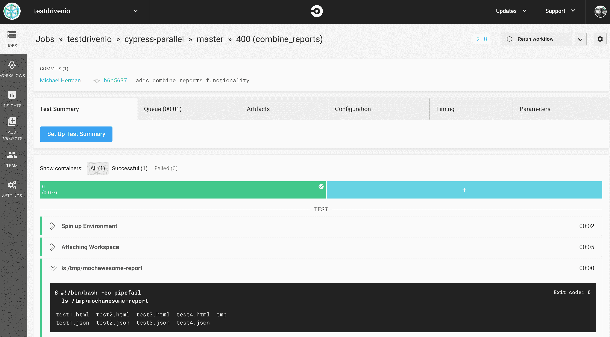

接下来，添加一个脚本来合并报告:

```
`const  fs  =  require('fs'); const  path  =  require('path'); const  shell  =  require('shelljs'); const  uuidv1  =  require('uuid/v1'); function  getFiles(dir,  ext,  fileList  =  [])  { const  files  =  fs.readdirSync(dir); files.forEach((file)  =>  { const  filePath  =  `${dir}/${file}`; if  (fs.statSync(filePath).isDirectory())  { getFiles(filePath,  fileList); }  else  if  (path.extname(file)  ===  ext)  { fileList.push(filePath); } }); return  fileList; } function  traverseAndModifyTimedOut(target,  deep)  { if  (target['tests']  &&  target['tests'].length)  { target['tests'].forEach(test  =>  { test.timedOut  =  false; }); } if  (target['suites'])  { target['suites'].forEach(suite  =>  { traverseAndModifyTimedOut(suite,  deep  +  1); }) } } function  combineMochaAwesomeReports()  { const  reportDir  =  path.join('/',  'tmp',  'mochawesome-report'); const  reports  =  getFiles(reportDir,  '.json',  []); const  suites  =  []; let  totalSuites  =  0; let  totalTests  =  0; let  totalPasses  =  0; let  totalFailures  =  0; let  totalPending  =  0; let  startTime; let  endTime; let  totalskipped  =  0; reports.forEach((report,  idx)  =>  { const  rawdata  =  fs.readFileSync(report); const  parsedData  =  JSON.parse(rawdata); if  (idx  ===  0)  {  startTime  =  parsedData.stats.start;  } if  (idx  ===  (reports.length  -  1))  {  endTime  =  parsedData.stats.end;  } totalSuites  +=  parseInt(parsedData.stats.suites,  10); totalskipped  +=  parseInt(parsedData.stats.skipped,  10); totalPasses  +=  parseInt(parsedData.stats.passes,  10); totalFailures  +=  parseInt(parsedData.stats.failures,  10); totalPending  +=  parseInt(parsedData.stats.pending,  10); totalTests  +=  parseInt(parsedData.stats.tests,  10); if  (parsedData  &&  parsedData.suites  &&  parsedData.suites.suites)  { parsedData.suites.suites.forEach(suite  =>  { suites.push(suite) }) } }); return  { totalSuites, totalTests, totalPasses, totalFailures, totalPending, startTime, endTime, totalskipped, suites, }; } function  getPercentClass(pct)  { if  (pct  <=  50)  { return  'danger'; }  else  if  (pct  >  50  &&  pct  <  80)  { return  'warning'; } return  'success'; } function  writeReport(obj,  uuid)  { const  sampleFile  =  path.join(__dirname,  'sample.json'); const  outFile  =  path.join(__dirname,  '..',  `${uuid}.json`); fs.readFile(sampleFile,  'utf8',  (err,  data)  =>  { if  (err)  throw  err; const  parsedSampleFile  =  JSON.parse(data); const  stats  =  parsedSampleFile.stats; stats.suites  =  obj.totalSuites; stats.tests  =  obj.totalTests; stats.passes  =  obj.totalPasses; stats.failures  =  obj.totalFailures; stats.pending  =  obj.totalPending; stats.start  =  obj.startTime; stats.end  =  obj.endTime; stats.duration  =  new  Date(obj.endTime)  -  new  Date(obj.startTime); stats.testsRegistered  =  obj.totalTests  -  obj.totalPending; stats.passPercent  =  Math.round((stats.passes  /  (stats.tests  -  stats.pending))  *  1000)  /  10; stats.pendingPercent  =  Math.round((stats.pending  /  stats.testsRegistered)  *  1000)  /10; stats.skipped  =  obj.totalskipped; stats.hasSkipped  =  obj.totalskipped  >  0; stats.passPercentClass  =  getPercentClass(stats.passPercent); stats.pendingPercentClass  =  getPercentClass(stats.pendingPercent); obj.suites.forEach(suit  =>  { traverseAndModifyTimedOut(suit,  0); }); parsedSampleFile.suites.suites  =  obj.suites; parsedSampleFile.suites.uuid  =  uuid; fs.writeFile(outFile,  JSON.stringify(parsedSampleFile),  {  flag:  'wx'  },  (error)  =>  { if  (error)  throw  error; }); }); } const  data  =  combineMochaAwesomeReports(); const  uuid  =  uuidv1(); writeReport(data,  uuid); shell.exec(`./node_modules/.bin/marge ${uuid}.json --reportDir mochareports --reportTitle ${uuid}`,  (code,  stdout,  stderr)  =>  { if  (stderr)  { console.log(stderr); }  else  { console.log('Success!'); } });` 
```

将此保存为“lib”中的 *combine.js* 。

这个脚本将收集所有的 mochawesome JSON 文件(包含每个 mochawesome 报告的原始 JSON 输出)，合并它们，并生成一个新的 mochawesome 报告。

> 如果感兴趣的话，可以返回到 CircleCI，在一个测试作业的“Artifacts”选项卡中查看一个生成的 mochawesome JSON 文件。

安装依赖项:

```
`$ npm install shelljs uuid --save-dev` 
```

将 *sample.json* 添加到“lib”目录中:

```
`{ "stats":  { "suites":  0, "tests":  0, "passes":  0, "pending":  0, "failures":  0, "start":  "", "end":  "", "duration":  0, "testsRegistered":  0, "passPercent":  0, "pendingPercent":  0, "other":  0, "hasOther":  false, "skipped":  0, "hasSkipped":  false, "passPercentClass":  "success", "pendingPercentClass":  "success" }, "suites":  { "uuid":  "", "title":  "", "fullFile":  "", "file":  "", "beforeHooks":  [], "afterHooks":  [], "tests":  [], "suites":  [], "passes":  [], "failures":  [], "pending":  [], "skipped":  [], "duration":  0, "root":  true, "rootEmpty":  true, "_timeout":  2000 }, "copyrightYear":  2019 }` 
```

更新 *circle.json* 中的`combine_reports`以运行 *combine.js* 脚本，然后将新报告保存为工件:

```
`"combine_reports":  { "working_directory":  "~/tmp", "docker":  [ { "image":  "cypress/base:10", "environment":  { "TERM":  "xterm" } } ], "steps":  [ "checkout", { "attach_workspace":  { "at":  "~/" } }, { "attach_workspace":  { "at":  "/tmp/mochawesome-report" } }, { "run":  "ls /tmp/mochawesome-report" }, { "run":  "node ./lib/combine.js" }, { "store_artifacts":  { "path":  "mochareports" } } ] }` 
```

为了测试，生成新的配置，提交并推送您的代码。所有作业都应该通过，您应该会看到合并的最终报告。

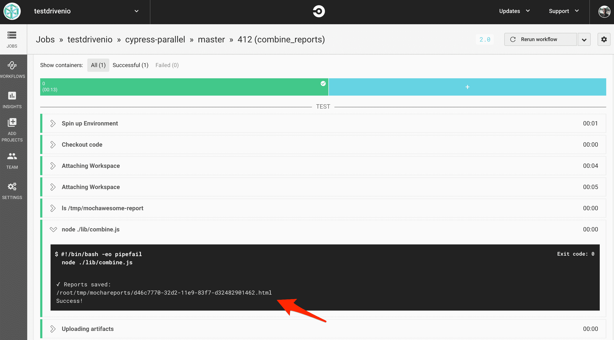

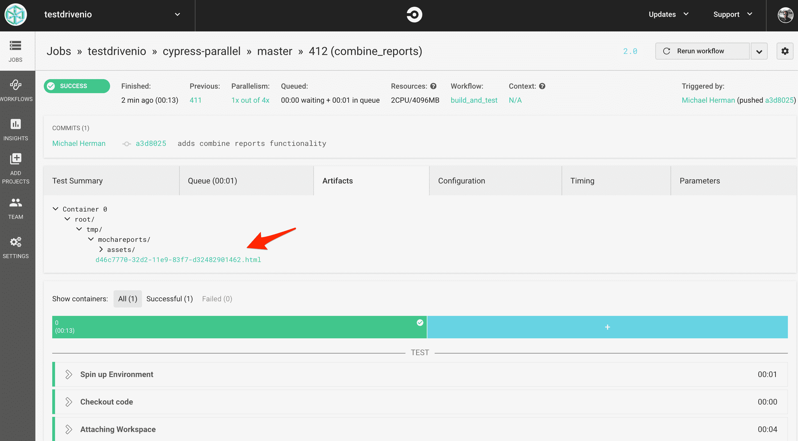

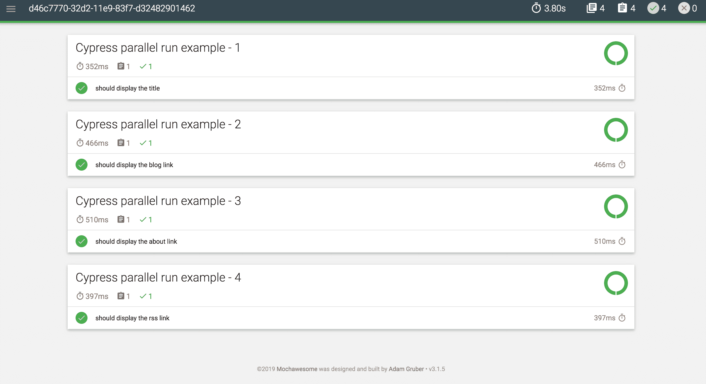

## 处理测试失败

如果测试失败会发生什么？

将 *sample2.spec.js* 中的`cy.get('a').contains('Blog');`改为`cy.get('a').contains('Not Real');`:

```
`describe('Cypress parallel run example - 2',  ()  =>  { it('should display the blog link',  ()  =>  { cy.visit(`https://mherman.org`); cy.get('a').contains('Not Real'); }); });` 
```

提交并推送您的代码。由于`combine_reports`任务依赖于测试任务，如果其中任何一个测试任务失败，它就不会运行。

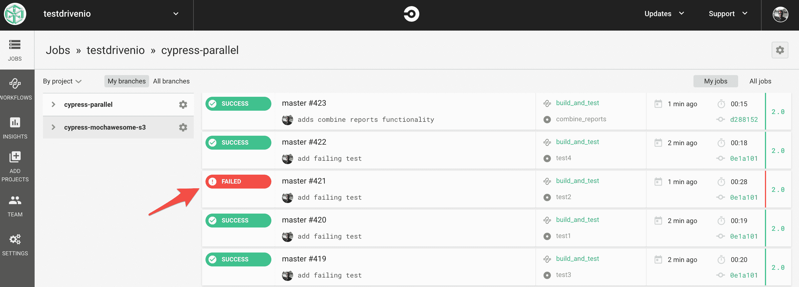

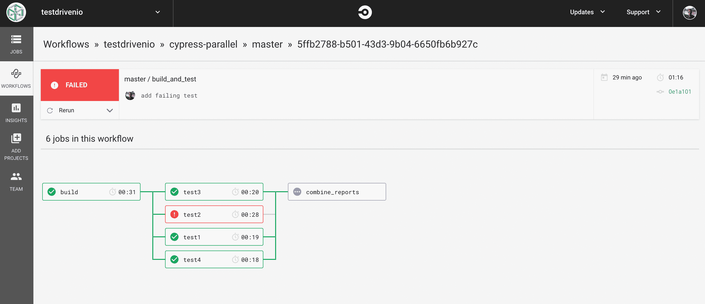

那么，即使工作流中的前一个作业失败，如何让`combine_reports`作业运行呢？

不幸的是，CircleCI 目前不支持这一功能。更多信息请参见本[讨论](https://discuss.circleci.com/t/continue-running-other-jobs-after-required-job-fails/24334)。因为我们实际上只关心 mochawesome JSON 报告，所以您可以通过取消测试作业的退出代码来解决这个问题。测试作业仍然会运行并生成 mochawesome 报告——不管底层测试是通过还是失败，它们都会通过。

在`createJSON`中再次更新以下`run`:

```
`run:  { name:  `Running cypress tests ${index  +  1}`, command:  `if $(npm bin)/cypress run --spec cypress/integration/${value} --reporter mochawesome --reporter-options "reportFilename=test${index  +  1}"; then echo 'pass'; else echo 'fail'; fi`, },` 
```

> 单行 bash if/else 有点难读。请自行重构。

有用吗？生成新的配置文件，提交并推送您的代码。所有的测试工作都应该通过，最终的 mochawesome 报告应该显示失败的规范。

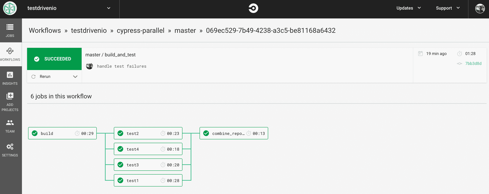

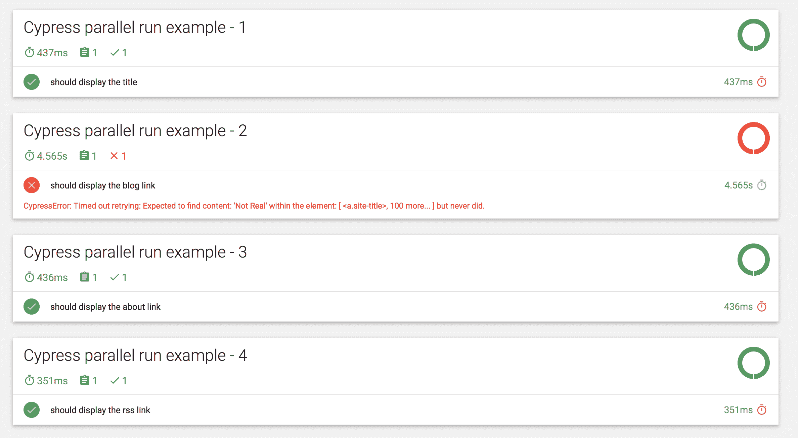

最后一件事:如果一个任务失败了，我们可能仍然会让整个构建失败。实现这个的最快方法是在 *combine.js* 中的`shell.exec`回调中:

```
`shell.exec(`./node_modules/.bin/marge ${uuid}.json --reportDir mochareports --reportTitle ${uuid}`,  (code,  stdout,  stderr)  =>  { if  (stderr)  { console.log(stderr); }  else  { console.log('Success!'); if  (data.totalFailures  >  0)  { process.exit(1); }  else  { process.exit(0); } } });` 
```

测试一下。然后，尝试测试一些其他场景，比如跳过一个测试或者添加四个以上的规范文件。

## 结论

本教程着眼于如何在 CircleCI 上并行运行 Cypress 测试，而不使用 Cypress [record](https://docs.cypress.io/guides/dashboard/runs/) 特性。值得注意的是，您可以使用任何提供并行性的 CI 服务来实现完全相同的工作流，例如 [GitLab CI](https://about.gitlab.com/product/continuous-integration/) 、 [Travis](https://travis-ci.com/) 和 [Semaphore](https://semaphoreci.com) ，以及您自己的定制 CI 平台 Jenkins 或 [Concourse](https://concourse-ci.org/) 。如果您的 CI 服务不提供并行性，那么您可以使用 Docker 并行运行作业。请联系我们了解更多详情。

寻找一些挑战？

1.  创建一个 Slack bot，在测试运行完成时通知一个频道，并添加一个链接到 mochawesome 报告以及任何失败测试规范的截图或视频
2.  将最终报告上传到 S3 桶(见 [cypress-mochawesome-s3](https://github.com/testdrivenio/cypress-mochawesome-s3) )
3.  通过将测试结果存储在数据库中，跟踪一段时间内失败测试的数量
4.  将整个测试套件作为一项夜间工作运行多次，然后只在测试失败 X 次时指出测试是否失败——这将有助于暴露不可靠的测试，并消除不必要的开发人员干预

从赛普拉斯平行的回购协议中获取最终代码。干杯！