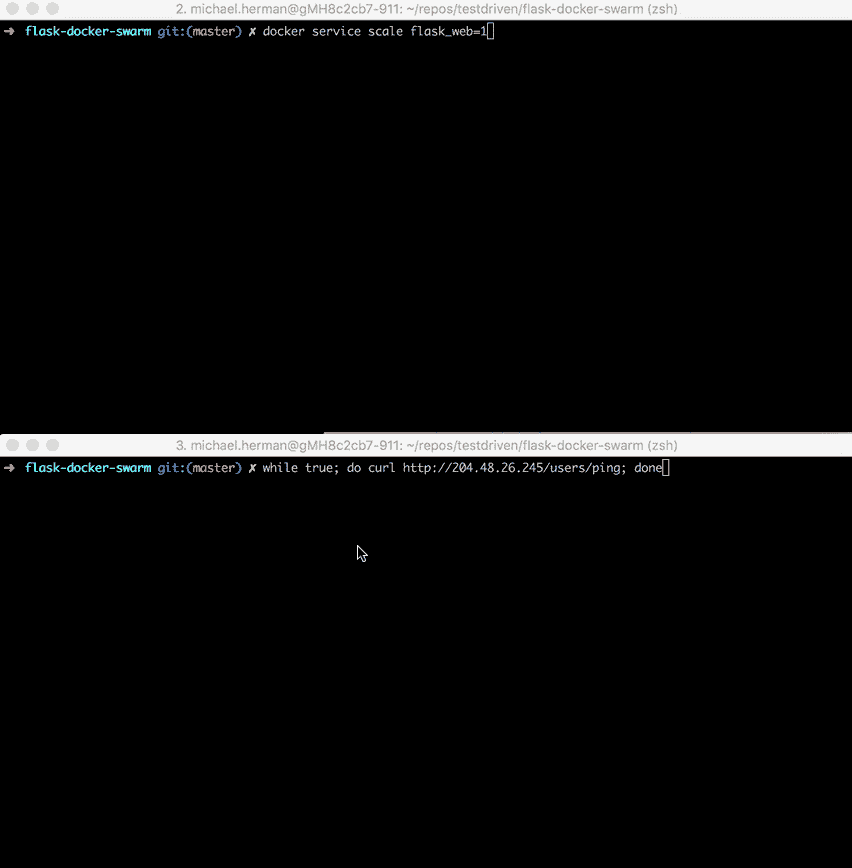
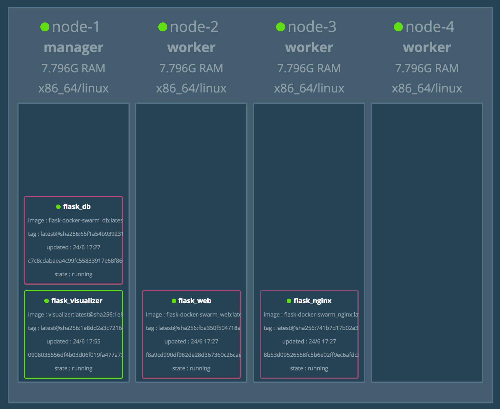
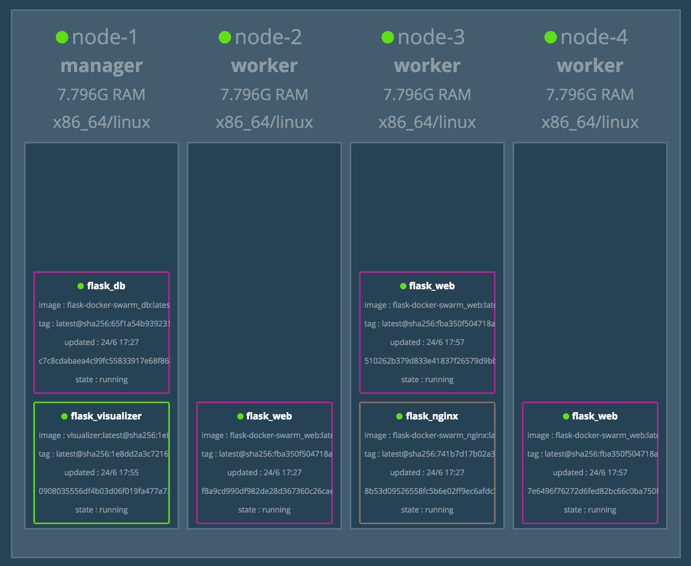
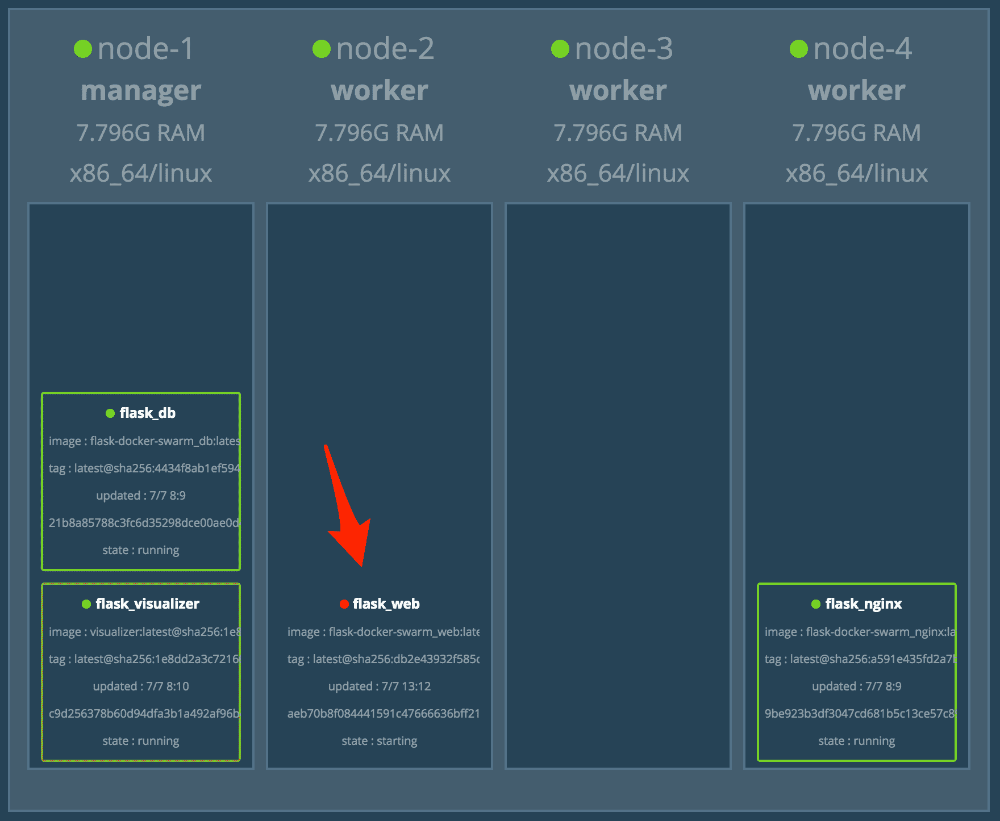

# 在 Docker Swarm 上运行烧瓶

> 原文：<https://testdriven.io/blog/running-flask-on-docker-swarm/>

让我们看看如何在 [DigitalOcean](https://m.do.co/c/d8f211a4b4c2) 上启动 Docker Swarm 集群，然后配置一个由 Flask 和 Postgres 提供支持的微服务，在其上运行。

> 这是一个中级教程。它假设你有 Flask、Docker 和容器编排的基本工作知识。有关这些工具和主题的更多信息，请查看以下课程:
> 
> 1.  [使用 Python、Flask 和 Docker 进行测试驱动开发](https://testdriven.io/courses/tdd-flask/)
> 2.  [展开烧瓶，对 AWS ECS 进行微服务反应](https://testdriven.io/courses/aws-flask-react/)

*Docker 依赖:*

*   文档编号 v19.03.9
*   坞站-复合 v1.27.4
*   对接机 v0.16.2

## 目标

本教程结束时，您将能够...

1.  解释什么是容器编排，以及为什么需要使用编排工具
2.  讨论使用 Docker Swarm 优于其他编排工具(如 Kubernetes 和弹性容器服务(ECS ))的利弊
3.  使用 Docker Compose 在本地构建基于 Flask 的微服务
4.  构建 Docker 映像，并将它们上传到 Docker Hub 映像注册中心
5.  使用 Docker 机器在 DigitalOcean 上配置主机
6.  配置一个 Docker 群集群在数字海洋上运行
7.  在 Docker Swarm 上运行 Flask、Nginx 和 Postgres
8.  使用循环算法在群集上路由流量
9.  用 Docker Swarm Visualizer 监控集群
10.  使用 Docker Secrets 管理 Docker Swarm 中的敏感信息
11.  配置运行状况检查，以便在将服务添加到群集之前检查其状态
12.  访问运行在集群上的服务的日志

## 什么是容器编排？

当您从在单台机器上部署容器转移到在多台机器上部署容器时，您将需要一个编排工具来管理(并自动化)容器在整个系统中的安排、协调和可用性。

这就是 [Docker Swarm](https://docs.docker.com/engine/swarm/) (或“Swarm mode”)与许多其他编排工具相适应的地方——如 [Kubernetes](https://kubernetes.io/) 、 [ECS](https://aws.amazon.com/ecs/) 、 [Mesos](https://mesos.apache.org/) 和 [Nomad](https://www.nomadproject.io/) 。

你应该用哪一个？

*   如果您需要管理大型、复杂的集群，请使用 Kubernetes
*   如果您刚刚起步和/或需要管理中小型集群，请使用 *Docker Swarm*
*   如果您已经在使用一些 AWS 服务，请使用 *ECS*

| 工具 | 赞成的意见 | 骗局 |
| --- | --- | --- |
| 库伯内特斯 | 大型社区，灵活，大多数功能，时尚 | 复杂的设置、高学习曲线、hip |
| 码头工人群 | 易于设置，非常适合小型集群 | 受 Docker API 的限制 |
| 精英公司 | 全面管理的服务，与 AWS 集成 | 供应商锁定 |

市场上还有许多基于 Kubernetes 的托管服务:

1.  [谷歌 Kubernetes 引擎](https://cloud.google.com/kubernetes-engine/) (GKE)
2.  [弹性集装箱服务](https://aws.amazon.com/eks/) (EKS)
3.  Azure Kubernetes 服务公司

> 更多信息，请查看[选择正确的容器化和集群管理工具](https://blog.kublr.com/choosing-the-right-containerization-and-cluster-management-tool-fdfcec5700df)博文。

## 项目设置

从[烧瓶-docker-swarm](https://github.com/testdrivenio/flask-docker-swarm) repo 中克隆出[碱基](https://github.com/testdrivenio/flask-docker-swarm/tree/base)分支；

```py
`$ git clone https://github.com/testdrivenio/flask-docker-swarm --branch base --single-branch
$ cd flask-docker-swarm` 
```

构建映像并在本地旋转容器:

```py
`$ docker-compose up -d --build` 
```

创建并植入数据库`users`表:

```py
`$ docker-compose run web python manage.py recreate_db
$ docker-compose run web python manage.py seed_db` 
```

在您选择的浏览器中测试以下 URL。

[http://localhost/ping](http://localhost/ping) :

```py
`{ "container_id":  "3c9dc22aa37a", "message":  "pong!", "status":  "success" }` 
```

> `container_id`是运行应用程序的 Docker 容器的 ID:
> 
> ```py
> $ docker ps --filter name=flask-docker-swarm_web --format "{{.ID}}"
> 3c9dc22aa37a 
> ```

[http://localhost/users](http://localhost/users) :

```py
`{ "container_id":  "3c9dc22aa37a", "status":  "success", "users":  [{ "active":  true, "admin":  false, "email":  "[[email protected]](/cdn-cgi/l/email-protection)", "id":  1, "username":  "michael" }] }` 
```

在继续之前，快速浏览一下代码:

```py
`├── README.md
├── docker-compose.yml
└── services
    ├── db
    │   ├── Dockerfile
    │   └── create.sql
    ├── nginx
    │   ├── Dockerfile
    │   └── prod.conf
    └── web
        ├── Dockerfile
        ├── manage.py
        ├── project
        │   ├── __init__.py
        │   ├── api
        │   │   ├── main.py
        │   │   ├── models.py
        │   │   └── users.py
        │   └── config.py
        └── requirements.txt` 
```

## 坞站集线器

由于 Docker Swarm 使用多个 Docker 引擎，我们需要使用一个 Docker 映像注册表来将我们的三个映像分发到每个引擎。本教程使用 [Docker Hub](https://hub.docker.com/) image registry，但也可以随意使用不同的注册表服务或[在 Swarm 中运行](https://docs.docker.com/registry/deploying/)你自己的私有注册表。

在 Docker Hub 上创建一个帐户(如果您还没有)，然后登录:

构建、标记和推送图像到 Docker Hub:

```py
`$ docker build -t mjhea0/flask-docker-swarm_web:latest -f ./services/web/Dockerfile ./services/web
$ docker push mjhea0/flask-docker-swarm_web:latest

$ docker build -t mjhea0/flask-docker-swarm_db:latest -f ./services/db/Dockerfile ./services/db
$ docker push mjhea0/flask-docker-swarm_db:latest

$ docker build -t mjhea0/flask-docker-swarm_nginx:latest -f ./services/nginx/Dockerfile ./services/nginx
$ docker push mjhea0/flask-docker-swarm_nginx:latest` 
```

> 确保用 Docker Hub 上的名称空间替换`mjhea0`。

## 撰写文件

接下来，让我们建立一个新的 Docker 组合文件，用于 Docker Swarm:

```py
`version:  '3.8' services: web: image:  mjhea0/flask-docker-swarm_web:latest deploy: replicas:  1 restart_policy: condition:  on-failure placement: constraints:  [node.role == worker] expose: -  5000 environment: -  FLASK_ENV=production -  APP_SETTINGS=project.config.ProductionConfig -  DB_USER=postgres -  DB_PASSWORD=postgres -  SECRET_CODE=myprecious depends_on: -  db networks: -  app db: image:  mjhea0/flask-docker-swarm_db:latest deploy: replicas:  1 restart_policy: condition:  on-failure placement: constraints:  [node.role == manager] volumes: -  data-volume:/var/lib/postgresql/data expose: -  5432 environment: -  POSTGRES_USER=postgres -  POSTGRES_PASSWORD=postgres networks: -  app nginx: image:  mjhea0/flask-docker-swarm_nginx:latest deploy: replicas:  1 restart_policy: condition:  on-failure placement: constraints:  [node.role == worker] ports: -  80:80 depends_on: -  web networks: -  app networks: app: driver:  overlay volumes: data-volume: driver:  local` 
```

在项目根目录下将该文件另存为 *docker-compose-swarm.yml* 。请注意两个合成文件之间的差异:

1.  *Image* :我们现在使用一个图像来设置上下文，而不是引用本地构建目录。
2.  *Deploy* :我们增加了一个 [deploy](https://github.com/compose-spec/compose-spec/blob/master/deploy.md) 关键字来配置每个服务的[副本](https://github.com/compose-spec/compose-spec/blob/master/deploy.md#replicas)、[重启策略](https://github.com/compose-spec/compose-spec/blob/master/deploy.md#restart_policy)和[放置约束](https://github.com/compose-spec/compose-spec/blob/master/deploy.md#placement)的数量。参考官方[文档](https://docs.docker.com/compose/compose-file/)获取更多关于为 Docker Swarm 设置合成文件的信息。
3.  *网络*:我们现在使用一个[覆盖](https://docs.docker.com/network/overlay/)网络来连接每个主机上的多个 Docker 引擎，并实现群服务之间的通信。

## 码头工人群

[注册](https://m.do.co/c/d8f211a4b4c2)一个数字海洋账户(如果你还没有的话)，然后[生成](https://docs.digitalocean.com/reference/api/create-personal-access-token/)一个访问令牌，这样你就可以访问数字海洋 API 了。

将令牌添加到您的环境中:

```py
`$ export DIGITAL_OCEAN_ACCESS_TOKEN=[your_digital_ocean_token]` 
```

旋转四个数字海洋液滴:

```py
`$ for i in 1 2 3 4; do
    docker-machine create \
      --driver digitalocean \
      --digitalocean-access-token $DIGITAL_OCEAN_ACCESS_TOKEN \
      --engine-install-url "https://releases.rancher.com/install-docker/19.03.9.sh" \
      node-$i;
  done` 
```

> 需要`--engine-install-url`，因为在撰写本文时，Docker v20.10.0 [无法与 Docker Machine](https://github.com/docker/machine/issues/4858) 一起使用。

这需要几分钟时间。一旦完成，在`node-1`初始化[群模式](https://docs.docker.com/engine/swarm/):

```py
`$ docker-machine ssh node-1 -- docker swarm init --advertise-addr $(docker-machine ip node-1)` 
```

从上一个命令的输出中获取 join 令牌，然后将剩余的节点作为 workers 添加到群中:

```py
`$ for i in 2 3 4; do
    docker-machine ssh node-$i \
      -- docker swarm join --token YOUR_JOIN_TOKEN;
done` 
```

将 Docker 守护进程指向`node-1`并部署堆栈:

```py
`$ eval $(docker-machine env node-1)
$ docker stack deploy --compose-file=docker-compose-swarm.yml flask` 
```

列出堆栈中的服务:

```py
`$ docker stack ps -f "desired-state=running" flask` 
```

您应该会看到类似如下的内容:

```py
`ID              NAME            IMAGE                                    NODE         DESIRED STATE       CURRENT STATE
uz84le3651f8    flask_nginx.1   mjhea0/flask-docker-swarm_nginx:latest   node-3       Running             Running 23 seconds ago
nv365bhsoek1    flask_web.1     mjhea0/flask-docker-swarm_web:latest     node-2       Running             Running 32 seconds ago
uyl11jk2h71d    flask_db.1      mjhea0/flask-docker-swarm_db:latest      node-1       Running             Running 38 seconds ago` 
```

现在，为了根据`web`服务中提供的模式更新数据库，我们首先需要将 Docker 守护进程指向运行`flask_web`的节点:

```py
`$ NODE=$(docker service ps -f "desired-state=running" --format "{{.Node}}" flask_web)
$ eval $(docker-machine env $NODE)` 
```

将`flask_web`的容器 ID 分配给一个变量:

```py
`$ CONTAINER_ID=$(docker ps --filter name=flask_web --format "{{.ID}}")` 
```

创建数据库表并应用种子:

```py
`$ docker container exec -it $CONTAINER_ID python manage.py recreate_db
$ docker container exec -it $CONTAINER_ID python manage.py seed_db` 
```

最后，将 Docker 守护进程指向`node-1`，并检索与运行`flask_nginx`的机器相关联的 IP:

```py
`$ eval $(docker-machine env node-1)
$ docker-machine ip $(docker service ps -f "desired-state=running" --format "{{.Node}}" flask_nginx)` 
```

测试端点:

1.  [http://YOUR _ MACHINE _ IP/ping](http://YOUR_MACHINE_IP/ping)
2.  [http://你的机器 IP/用户](http://YOUR_MACHINE_IP/users)

让我们向集群添加另一个 web 应用程序:

```py
`$ docker service scale flask_web=2

flask_web scaled to 2
overall progress: 2 out of 2 tasks
1/2: running   [==================================================>]
2/2: running   [==================================================>]
verify: Service converged` 
```

确认服务确实可以扩展:

```py
`$ docker stack ps -f "desired-state=running" flask

ID              NAME            IMAGE                                    NODE         DESIRED STATE       CURRENT STATE
uz84le3651f8    flask_nginx.1   mjhea0/flask-docker-swarm_nginx:latest   node-3       Running             Running 7 minutes ago
nv365bhsoek1    flask_web.1     mjhea0/flask-docker-swarm_web:latest     node-2       Running             Running 7 minutes ago
uyl11jk2h71d    flask_db.1      mjhea0/flask-docker-swarm_db:latest      node-1       Running             Running 7 minutes ago
n8ld0xkm3pd0    flask_web.2     mjhea0/flask-docker-swarm_web:latest     node-4       Running             Running 7 seconds ago` 
```

向服务提出一些请求:

```py
`$ for ((i=1;i<=10;i++)); do curl http://YOUR_MACHINE_IP/ping; done` 
```

您应该看到不同的`container_id`被返回，表明请求通过两个副本之间的循环算法被适当地路由:

```py
`{"container_id":"3e984eb707ea","message":"pong!","status":"success"}
{"container_id":"e47de2a13a2e","message":"pong!","status":"success"}
{"container_id":"3e984eb707ea","message":"pong!","status":"success"}
{"container_id":"e47de2a13a2e","message":"pong!","status":"success"}
{"container_id":"3e984eb707ea","message":"pong!","status":"success"}
{"container_id":"e47de2a13a2e","message":"pong!","status":"success"}
{"container_id":"3e984eb707ea","message":"pong!","status":"success"}
{"container_id":"e47de2a13a2e","message":"pong!","status":"success"}
{"container_id":"3e984eb707ea","message":"pong!","status":"success"}
{"container_id":"e47de2a13a2e","message":"pong!","status":"success"}` 
```

如果我们在流量到达集群时进行扩展，会发生什么情况？



流量被适当地重新路由。再试一次，但这次要横向扩展。

## Docker 群体可视化工具

Docker Swarm Visualizer 是一款开源工具，用于监控 Docker Swarm 集群。

将服务添加到 *docker-compose-swarm.yml* :

```py
`visualizer: image:  dockersamples/visualizer:latest ports: -  8080:8080 volumes: -  "/var/run/docker.sock:/var/run/docker.sock" deploy: placement: constraints:  [node.role == manager] networks: -  app` 
```

将 Docker 守护进程指向`node-1`并更新堆栈:

```py
`$ eval $(docker-machine env node-1)
$ docker stack deploy --compose-file=docker-compose-swarm.yml flask` 
```

可视化工具可能需要一两分钟才能启动。导航至[http://YOUR _ MACHINE _ IP:8080](http://YOUR_MACHINE_IP:8080)查看仪表板:



再添加两个`flask_web`的副本:

```py
`$ docker service scale flask_web=3` 
```



## 码头工人的秘密

[Docker Secrets](https://docs.docker.com/engine/swarm/secrets/) 是一款专门为 Docker Swarm 设计的秘密管理工具。有了它，你可以轻松地分发敏感信息(如用户名和密码，SSH 密钥，SSL 证书，API 令牌等。)跨集群。

Docker 可以从自己的数据库([外部](https://github.com/compose-spec/compose-spec/blob/master/spec.md#secrets-top-level-element)模式)或者从本地文件([文件](https://github.com/compose-spec/compose-spec/blob/master/spec.md#secrets-top-level-element)模式)中读取秘密。我们将着眼于前者。

在*services/web/project/API/main . py*文件中，记下`/secret`路径。如果请求有效载荷中的`secret`与`SECRET_CODE`变量相同，则响应有效载荷中的消息将等于`yay!`。否则，它将等于`nay!`。

```py
`# yay
{
  "container_id": "6f91a81a6357",
  "message": "yay!",
  "status": "success"
}

# nay
{
  "container_id": "6f91a81a6357",
  "message": "nay!",
  "status": "success"
}` 
```

测试终端中的`/secret`端点:

```py
`$ curl -X POST http://YOUR_MACHINE_IP/secret \
    -d '{"secret": "myprecious"}' \
    -H 'Content-Type: application/json'` 
```

您应该看到:

```py
`{
  "container_id": "6f91a81a6357",
  "message": "yay!",
  "status": "success"
}` 
```

让我们更新一下`SECRET_CODE`，让它由 Docker Secret 而不是环境变量来设置。首先从 manager 节点创建一个新的密码:

```py
`$ eval $(docker-machine env node-1)
$ echo "foobar" | docker secret create secret_code -` 
```

确认它已创建:

您应该会看到类似这样的内容:

```py
`ID                          NAME             DRIVER    CREATED             UPDATED
za3pg2cbbf92gi9u1v0af16e3   secret_code                15 seconds ago      15 seconds ago` 
```

接下来，删除`SECRET_CODE`环境变量，并将`secrets`配置添加到 *docker-compose-swarm-yml* 中的`web`服务中:

```py
`web: image:  mjhea0/flask-docker-swarm_web:latest deploy: replicas:  1 restart_policy: condition:  on-failure placement: constraints:  [node.role == worker] expose: -  5000 environment: -  FLASK_ENV=production -  APP_SETTINGS=project.config.ProductionConfig -  DB_USER=postgres -  DB_PASSWORD=postgres secrets: -  secret_code depends_on: -  db networks: -  app` 
```

在文件的底部，将秘密的来源定义为`external`，就在`volumes`声明的下面:

```py
`secrets: secret_code: external:  true` 
```

就是这样。我们可以在 Flask 应用程序中获得这个秘密。

> 查看 [secrets 配置参考](https://github.com/compose-spec/compose-spec/blob/master/spec.md#secrets-top-level-element)指南以及[该](https://stackoverflow.com/questions/42139605/how-do-you-manage-secret-values-with-docker-compose-v3-1)堆栈溢出答案，了解有关外部和基于文件的机密的更多信息。

转回*services/web/project/API/main . py*。

改变:

```py
`SECRET_CODE = os.environ.get("SECRET_CODE")` 
```

收件人:

```py
`SECRET_CODE = open("/run/secrets/secret_code", "r").read().strip()` 
```

将 Docker 环境重置回本地主机:

```py
`$ eval $(docker-machine env -u)` 
```

重新构建映像并将新版本推送到 Docker Hub:

```py
`$ docker build -t mjhea0/flask-docker-swarm_web:latest -f ./services/web/Dockerfile ./services/web
$ docker push mjhea0/flask-docker-swarm_web:latest` 
```

将守护程序指向管理器，然后更新服务:

```py
`$ eval $(docker-machine env node-1)
$ docker stack deploy --compose-file=docker-compose-swarm.yml flask` 
```

> 有关在合成文件中定义机密的更多信息，请参考文档的[在合成](https://docs.docker.com/engine/swarm/secrets/#use-secrets-in-compose)中使用机密部分。

再次测试:

```py
`$ curl -X POST http://YOUR_MACHINE_IP/secret \
    -d '{"secret": "foobar"}' \
    -H 'Content-Type: application/json'

{
  "container_id": "6f91a81a6357",
  "message": "yay!",
  "status": "success"
}` 
```

> 想挑战吗？尝试使用 Docker 秘密来管理数据库凭证，而不是直接在合成文件中定义它们。

## 健康检查

在生产环境中，您应该在将流量路由到某个容器之前，使用健康检查来测试该容器是否按预期*工作。在我们的例子中，我们可以使用健康检查来确保 Flask 应用程序(和 API)启动并运行；否则，我们可能会遇到这样的情况:一个新的容器启动并添加到集群中，该容器看起来是健康的，但实际上应用程序实际上是关闭的，无法处理流量。*

您可以将健康检查添加到 docker 文件或撰写文件中。我们将着眼于后者。

> 想知道如何在 Dockerfile 文件中添加健康检查吗？查看官方文件中的[健康检查说明](https://docs.docker.com/engine/reference/builder/#healthcheck)。

值得注意的是，在撰写文件中定义的健康检查设置将覆盖 Dockerfile 文件中的设置。

像这样更新 *docker-compose-swarm.yml* 中的`web`服务:

```py
`web: image:  mjhea0/flask-docker-swarm_web:latest deploy: replicas:  1 restart_policy: condition:  on-failure placement: constraints:  [node.role == worker] expose: -  5000 environment: -  FLASK_ENV=production -  APP_SETTINGS=project.config.ProductionConfig -  DB_USER=postgres -  DB_PASSWORD=postgres secrets: -  secret_code depends_on: -  db networks: -  app healthcheck: test:  curl --fail http://localhost:5000/ping || exit 1 interval:  10s timeout:  2s retries:  5` 
```

选项:

1.  `test`是将运行来检查运行状况的实际命令。如果正常，它应该返回`0`,如果不正常，应该返回`1`。为此，curl 命令必须在容器中可用。
2.  容器启动后，`interval`控制第一次运行状况检查的时间和频率。
3.  `retries`设置在容器被视为不健康之前，健康检查将重试失败检查的次数。
4.  如果一次运行状况检查花费的时间超过了`timeout`中定义的时间，则该运行将被视为失败。

在测试健康检查之前，我们需要向容器添加 curl。*记住:*您用于运行状况检查的命令需要在容器内部可用。

像这样更新 *Dockerfile* :

```py
`###########
# BUILDER #
###########

# Base Image
FROM python:3.9 as builder

# Lint
RUN pip install flake8 black
WORKDIR /home/app
COPY project ./project
COPY manage.py .
RUN flake8 --ignore=E501 .
RUN black --check .

# Install Requirements
COPY requirements.txt .
RUN pip wheel --no-cache-dir --no-deps --wheel-dir /home/app/wheels -r requirements.txt

#########
# FINAL #
#########

# Base Image
FROM python:3.9-slim

# ----- NEW ----
# Install curl
RUN apt-get update && apt-get install -y curl

# Create directory for the app user
RUN mkdir -p /home/app

# Create the app user
RUN groupadd app && useradd -g app app

# Create the home directory
ENV HOME=/home/app
ENV APP_HOME=/home/app/web
RUN mkdir $APP_HOME
WORKDIR $APP_HOME

# Install Requirements
COPY --from=builder /home/app/wheels /wheels
COPY --from=builder /home/app/requirements.txt .
RUN pip install --no-cache /wheels/*

# Copy in the Flask code
COPY . $APP_HOME

# Chown all the files to the app user
RUN chown -R app:app $APP_HOME

# Change to the app user
USER app

# run server
CMD gunicorn --log-level=debug -b 0.0.0.0:5000 manage:app` 
```

再次，重置 Docker 环境:

```py
`$ eval $(docker-machine env -u)` 
```

建立并推广新形象:

```py
`$ docker build -t mjhea0/flask-docker-swarm_web:latest -f ./services/web/Dockerfile ./services/web
$ docker push mjhea0/flask-docker-swarm_web:latest` 
```

更新服务:

```py
`$ eval $(docker-machine env node-1)
$ docker stack deploy --compose-file=docker-compose-swarm.yml flask` 
```

然后，找到`flask_web`服务所在的节点:

```py
`$ docker service ps flask_web` 
```

将守护程序指向该节点:

```py
`$ eval $(docker-machine env <NODE>)` 
```

> 确保用实际的节点替换`<NODE>`——例如`node-2`、`node-3`或`node-4`。

获取容器 ID:

然后运行:

```py
`$ docker inspect --format='{{json .State.Health}}' <CONTAINER_ID>` 
```

您应该会看到类似这样的内容:

```py
`{ "Status":  "healthy", "FailingStreak":  0, "Log":  [ { "Start":  "2021-02-23T03:31:44.886509504Z", "End":  "2021-02-23T03:31:45.104507568Z", "ExitCode":  0, "Output":  "  % Total    % Received % Xferd  Average Speed   Time    Time     Time  Current\n                                 Dload  Upload   Total   Spent    Left  Speed\n\r  0     0    0     0    0     0      0      0 --:--:-- --:--:-- --:--:--     0\r100    69  100    69    0     0  11629      0 --:--:-- --:--:-- --:--:-- 13800\n{\"container_id\":\"a6127b1f469d\",\"message\":\"pong!\",\"status\":\"success\"}\n" } ] }` 
```

想看看失败的健康检查吗？将 *docker-compose-swarm.yml* 中的`test`命令更新为 ping 端口 5001 而不是 5000:

```py
`healthcheck: test:  curl --fail http://localhost:5001/ping || exit 1 interval:  10s timeout:  2s retries:  5` 
```

就像之前一样，更新服务，然后找到`flask_web`服务所在的节点和容器 id。然后，运行:

```py
`$ docker inspect --format='{{json .State.Health}}' <CONTAINER_ID>` 
```

您应该会看到类似这样的内容:

```py
`{ "Status":  "starting", "FailingStreak":  1, "Log":  [ { "Start":  "2021-02-23T03:34:39.644618421Z", "End":  "2021-02-23T03:34:39.784855122Z", "ExitCode":  1, "Output":  "  % Total    % Received % Xferd  Average Speed   Time    Time     Time  Current\n                                 Dload  Upload   Total   Spent    Left  Speed\n\r  0     0    0     0    0     0      0      0 --:--:-- --:--:-- --:--:--     0curl: (7) Failed to connect to localhost port 5001: Connection refused\n" } ] }` 
```

Docker Swarm Visualizer 仪表盘中的服务也应该关闭。



更新运行状况检查和服务。在继续前进之前确保一切正常。

## 记录

在使用分布式系统时，设置适当的日志记录和监控非常重要，这样当出现问题时，您就可以深入了解发生了什么。我们已经设置了 Docker Swarm Visualizer 工具来帮助监控，但还有更多的事情可以做。

在日志记录方面，您可以运行以下命令(从节点管理器)来访问在多个节点上运行的服务的日志:

```py
`$ docker service logs -f SERVICE_NAME` 
```

> 查看文档，了解更多关于 [logs](https://docs.docker.com/engine/reference/commandline/service_logs/#description) 命令以及如何[配置默认日志驱动程序](https://docs.docker.com/config/containers/logging/configure/#configure-the-default-logging-driver)的信息。

尝试一下:

```py
`$ eval $(docker-machine env node-1)
$ docker service logs -f flask_web` 
```

您可能希望汇总每个服务的日志事件，以帮助简化分析和可视化。一种流行的方法是在 Swarm 集群中建立一个 [ELK](https://www.elastic.co/elk-stack) (Elasticsearch、Logstash 和 Kibana)栈。这超出了这篇博文的范围，但是可以看看下面的资源来获得帮助:

1.  [使用 ELK 堆栈进行集中测井](http://callistaenterprise.se/blogg/teknik/2017/09/13/building-microservices-part-8-logging-with-ELK/)
2.  [Docker Swarm ELK Stack 示例](https://github.com/mattjtodd/docker-swarm-elk)
3.  [弹性堆栈的 Docker 示例](https://github.com/elastic/examples/tree/master/Miscellaneous/docker)

最后， [Prometheus](https://prometheus.io/) (连同它事实上的 GUI [Grafana](https://grafana.com/) )是一个强大的监控解决方案。查看[Docker Swarm instrumentation with Prometheus](https://stefanprodan.com/2017/docker-swarm-instrumentation-with-prometheus/)了解更多信息。

**都搞定了？**

关闭堆栈并移除节点:

```py
`$ docker stack rm flask
$ docker-machine rm node-1 node-2 node-3 node-4 -y` 
```

## 自动化脚本

准备好把所有东西放在一起了吗？让我们编写一个脚本，它将:

1.  用 Docker 机器提供液滴
2.  配置 Docker 群组模式
3.  向群集添加节点
4.  创建新的 Docker 密码
5.  部署 Flask 微服务
6.  创建数据库表并应用种子

将名为 *deploy.sh* 的新文件添加到项目根目录:

```py
`#!/bin/bash

echo "Spinning up four droplets..."

for i in 1 2 3 4; do
  docker-machine create \
    --driver digitalocean \
    --digitalocean-access-token $DIGITAL_OCEAN_ACCESS_TOKEN \
    --engine-install-url "https://releases.rancher.com/install-docker/19.03.9.sh" \
    node-$i;
done

echo "Initializing Swarm mode..."

docker-machine ssh node-1 -- docker swarm init --advertise-addr $(docker-machine ip node-1)

echo "Adding the nodes to the Swarm..."

TOKEN=`docker-machine ssh node-1 docker swarm join-token worker | grep token | awk '{ print $5 }'`

for i in 2 3 4; do
  docker-machine ssh node-$i \
    -- docker swarm join --token ${TOKEN} $(docker-machine ip node-1):2377;
done

echo "Creating secret..."

eval $(docker-machine env node-1)
echo "foobar" | docker secret create secret_code -

echo "Deploying the Flask microservice..."

docker stack deploy --compose-file=docker-compose-swarm.yml flask

echo "Create the DB table and apply the seed..."

sleep 15
NODE=$(docker service ps -f "desired-state=running" --format "{{.Node}}" flask_web)
eval $(docker-machine env $NODE)
CONTAINER_ID=$(docker ps --filter name=flask_web --format "{{.ID}}")
docker container exec -it $CONTAINER_ID python manage.py recreate_db
docker container exec -it $CONTAINER_ID python manage.py seed_db

echo "Get the IP address..."
eval $(docker-machine env node-1)
docker-machine ip $(docker service ps -f "desired-state=running" --format "{{.Node}}" flask_nginx)` 
```

试试吧！

完成后将水滴带下来:

```py
`$ docker-machine rm node-1 node-2 node-3 node-4 -y` 
```

## 结论

在这篇文章中，我们看了如何通过 Docker Swarm 在 DigitalOcean 上运行 Flask 应用程序。

此时，您应该了解 Docker Swarm 的工作原理，并能够部署一个运行应用程序的集群。在生产中使用 Docker Swarm 之前，请确保深入了解一些更高级的主题，如日志记录、监控和使用[滚动更新](https://docs.docker.com/engine/swarm/swarm-tutorial/rolling-update/)来实现零停机部署。

你可以在 GitHub 上的 [flask-docker-swarm](https://github.com/testdrivenio/flask-docker-swarm) repo 中找到代码。