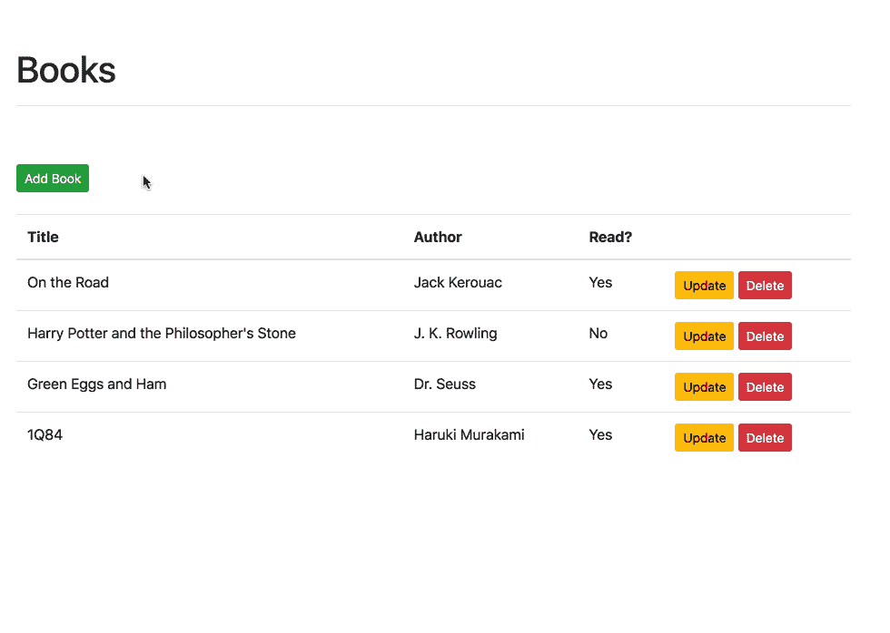
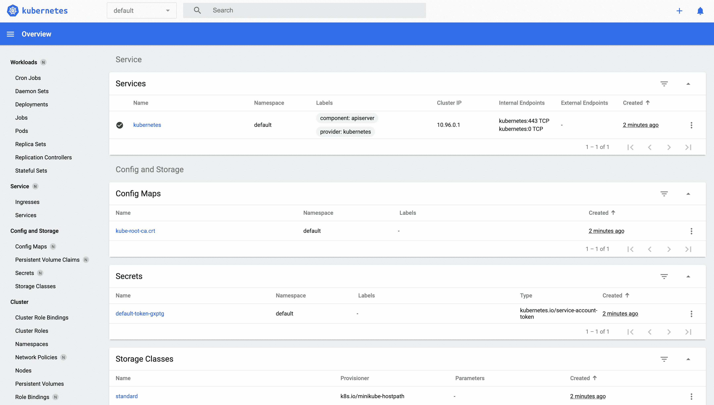
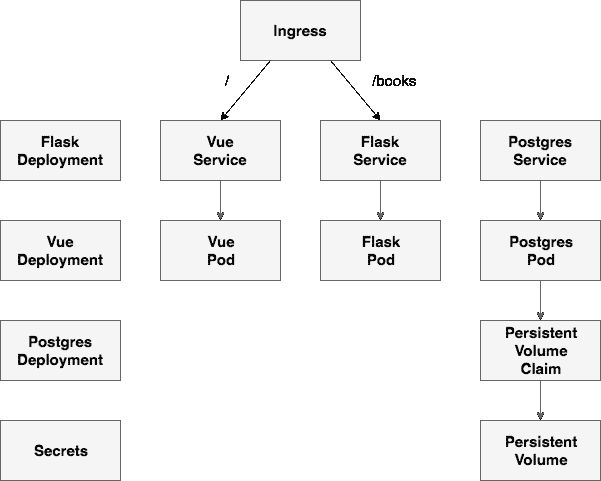
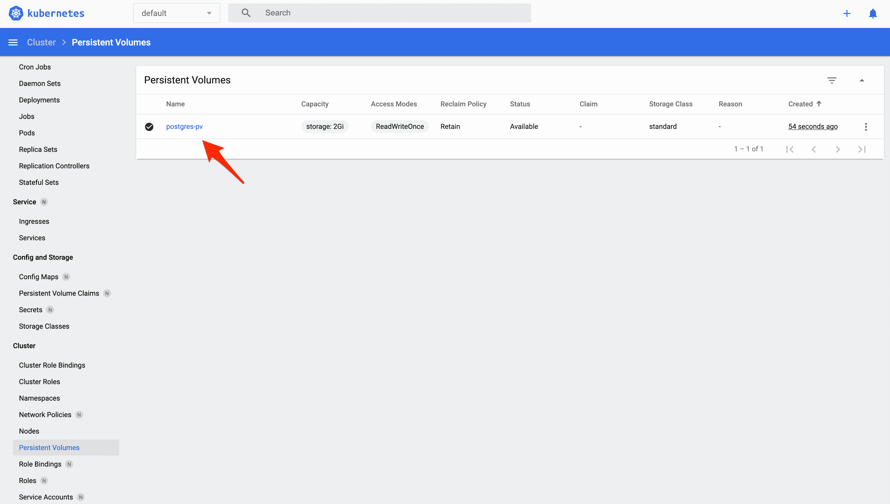
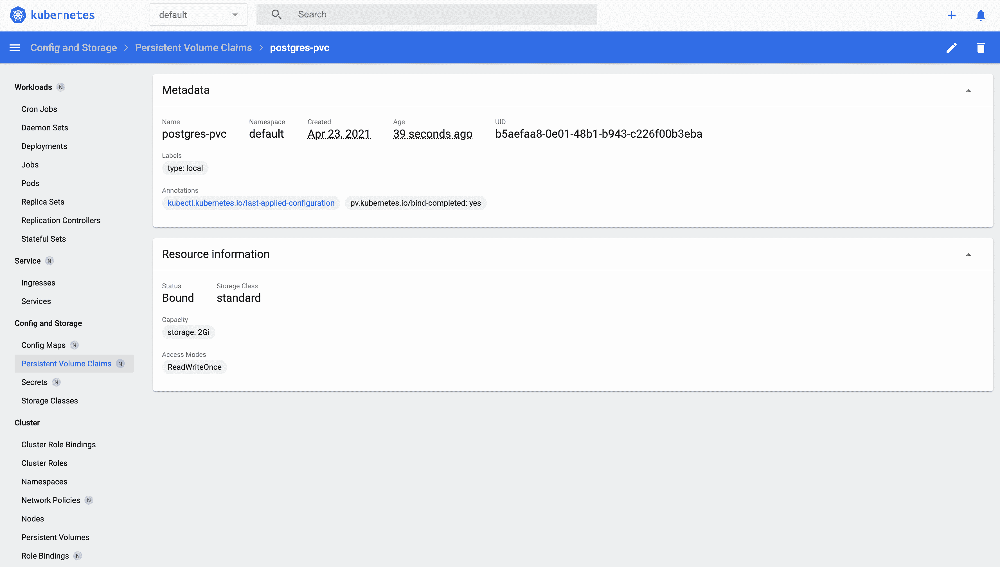
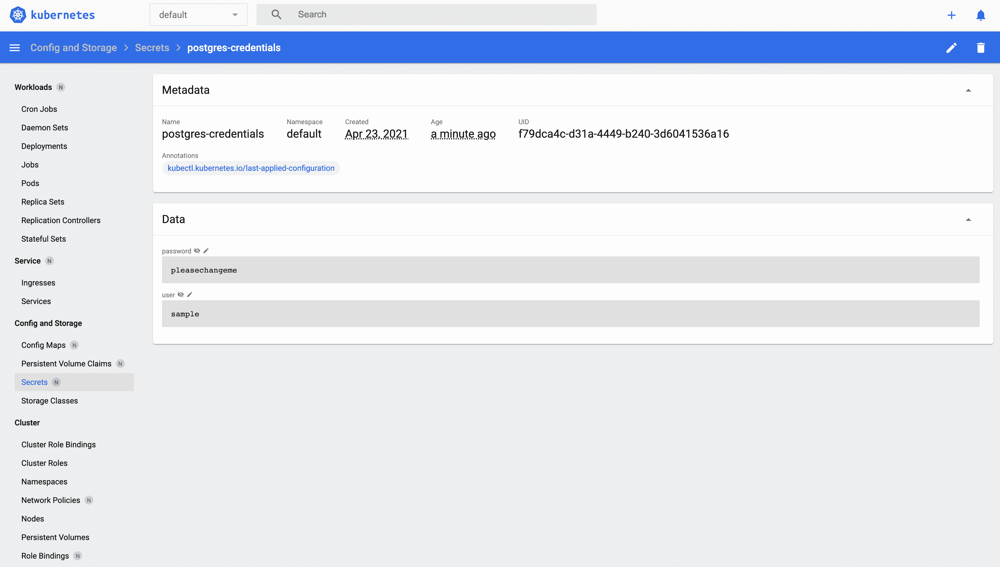
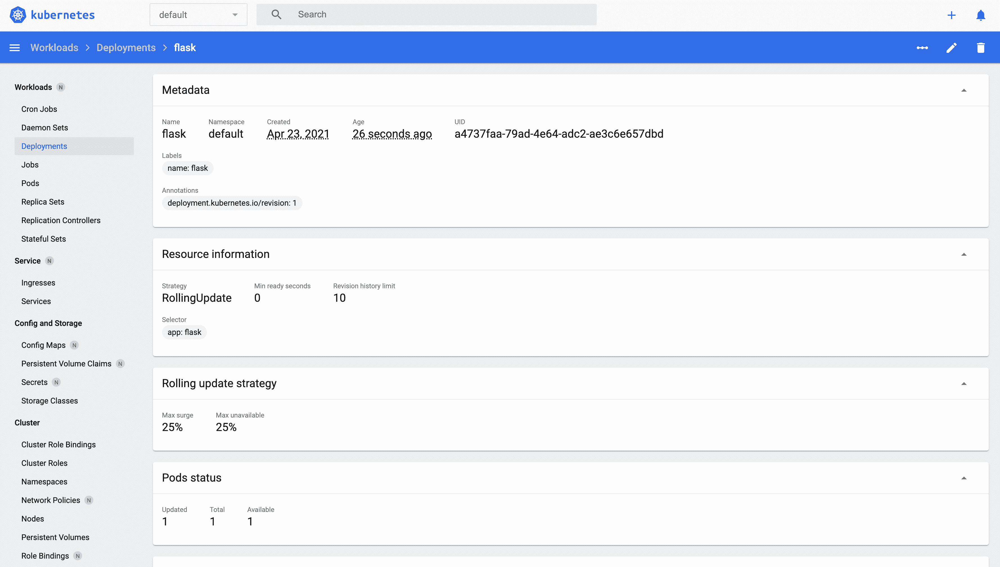
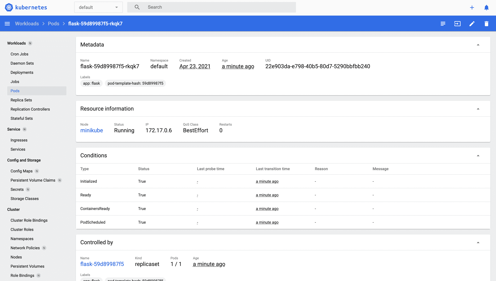
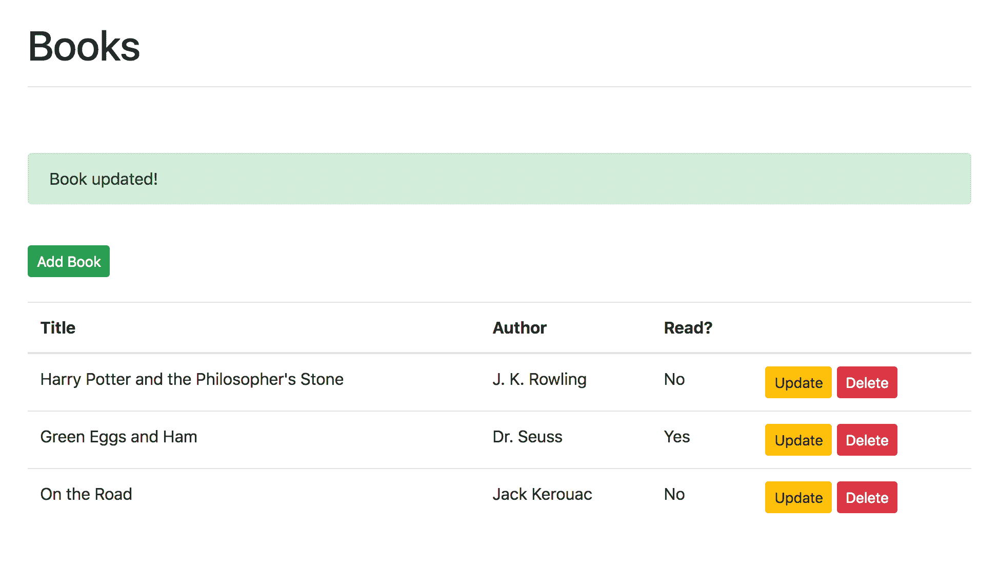

# 在 Kubernetes 上运行烧瓶

> 原文：<https://testdriven.io/blog/running-flask-on-kubernetes/>

在本教程中，我们将首先从总体上了解 Kubernetes 和容器编排，然后我们将逐步详细介绍如何将基于 Flask 的微服务(以及 Postgres 和 Vue.js)部署到 Kubernetes 集群。

> 这是一个中级教程。它假定你有烧瓶和 Docker 的基本工作知识。查看[使用 Python、Flask 和 Docker](/courses/tdd-flask/) 进行测试驱动开发课程，了解关于这些工具的更多信息。

依赖关系:

*   kubernetes 1 . 21 . 0 版
*   minikube 1 . 19 . 0 版
*   文档 v20.10.5
*   坞站-复合 v1.28.5

## 目标

本教程结束时，您将能够:

1.  解释什么是容器编排，以及为什么需要使用编排工具
2.  讨论使用 Kubernetes 相对于其他编排工具(如 Docker Swarm 和弹性容器服务(ECS ))的利弊
3.  解释以下 Kubernetes 原语:节点、Pod、服务、标签、部署、入口和卷
4.  使用 Docker Compose 在本地构建基于 Python 的微服务
5.  将 Kubernetes 集群配置为使用 Minikube 在本地运行
6.  设置一个卷来保存 Kubernetes 集群中的 Postgres 数据
7.  使用 Kubernetes 的秘密来管理敏感信息
8.  在 Kubernetes 上运行 Flask，Gunicorn，Postgres 和 Vue
9.  通过入口将烧瓶和 Vue 暴露给外部用户

## 什么是容器编排？

当您从在单台机器上部署容器转移到在多台机器上部署容器时，您将需要一个编排工具来管理(并自动化)容器在整个系统中的安排、协调和可用性。

编排工具有助于:

1.  跨服务器容器通信
2.  水平缩放
3.  服务发现
4.  负载平衡
5.  安全性/TLS
6.  零停机部署
7.  卷回
8.  记录
9.  监视

这就是 Kubernetes 与其他一些编排工具的契合之处，比如 T2、Docker Swarm、T4、ECS、Mesos 和 Nomad。

你应该用哪一个？

*   如果您需要管理大型、复杂的集群，请使用 Kubernetes
*   如果您刚刚起步和/或需要管理中小型集群，请使用 *Docker Swarm*
*   如果您已经在使用一些 AWS 服务，请使用 *ECS*

| 工具 | 赞成的意见 | 骗局 |
| --- | --- | --- |
| 库伯内特斯 | 大型社区，灵活，大多数功能，时尚 | 复杂的设置、高学习曲线、hip |
| 码头工人群 | 易于设置，非常适合小型集群 | 受 Docker API 的限制 |
| 精英公司 | 全面管理的服务，与 AWS 集成 | 供应商锁定 |

市场上还有许多由 Kubernetes 管理的服务:

1.  [谷歌 Kubernetes 引擎](https://cloud.google.com/kubernetes-engine/) (GKE)
2.  [弹性 Kubernetes 服务](https://aws.amazon.com/eks/) (EKS)
3.  Azure Kubernetes 服务公司
4.  [数字海洋 Kubernetes](https://www.digitalocean.com/products/kubernetes/)

> 更多信息，请查看[选择正确的容器化和集群管理工具](https://blog.kublr.com/choosing-the-right-containerization-and-cluster-management-tool-fdfcec5700df)博文。

## 不可思议的概念

在开始之前，让我们先来看看一些您必须使用的来自 [Kubernetes API](https://kubernetes.io/docs/concepts/overview/kubernetes-api/) 的基本构件:

1.  一个 **[节点](https://kubernetes.io/docs/concepts/architecture/nodes/)** 是一个用于运行 Kubernetes 的工作机。每个节点都由 Kubernetes 主节点管理。
2.  一个 **[Pod](https://kubernetes.io/docs/concepts/workloads/pods/pod/)** 是在一个节点上运行的一组逻辑紧密耦合的应用程序容器。Pod 中的容器部署在一起并共享资源(如数据量和网络地址)。多个单元可以在一个节点上运行。
3.  一个 **[服务](https://kubernetes.io/docs/concepts/services-networking/service/)** 是执行类似功能的一组逻辑单元。它支持负载平衡和服务发现。它是豆荚上的一个抽象层；豆荚是短暂的，而服务是持久的。
4.  **[部署](https://kubernetes.io/docs/concepts/workloads/controllers/deployment/)** 用于描述 Kubernetes 的期望状态。它们规定了如何创建、部署和复制 pod。
5.  **[标签](https://kubernetes.io/docs/concepts/overview/working-with-objects/labels/)** 是附属于资源(如 pod)的键/值对，用于组织相关资源。你可以把它们想象成 CSS 选择器。例如:
    *   *环境* - `dev`，`test`，`prod`
    *   *App 版本* - `beta`，`1.2.1`
    *   *类型* - `client`，`server`，`db`
6.  **[Ingress](https://kubernetes.io/docs/concepts/services-networking/ingress/)** 是一组路由规则，用于根据请求主机或路径控制外部对服务的访问。
7.  **[卷](https://kubernetes.io/docs/concepts/storage/volumes/)** 用于保存容器寿命之外的数据。它们对于像 Redis 和 Postgres 这样的有状态应用程序尤其重要。
    *   一个 *[持久卷](https://kubernetes.io/docs/concepts/storage/persistent-volumes/)* 定义一个独立于正常 Pod 生命周期的存储卷。它是在它所在的特定舱之外被管理的。
    *   *[持久卷声明](https://kubernetes.io/docs/concepts/storage/persistent-volumes/#persistentvolumeclaims)* 是用户使用持久卷的请求。

> 更多信息，请查看[学习 Kubernetes 基础知识](https://kubernetes.io/docs/tutorials/kubernetes-basics/)教程以及来自[Kubernetes](https://mherman.org/presentations/flask-kubernetes)演讲的 [Kubernetes 概念](https://mherman.org/presentations/flask-kubernetes/#38)幻灯片。

## 项目设置

克隆出[flask-vue-kubernetes](https://github.com/testdrivenio/flask-vue-kubernetes)repo，然后构建映像并旋转容器:

```
`$ git clone https://github.com/testdrivenio/flask-vue-kubernetes
$ cd flask-vue-kubernetes
$ docker-compose up -d --build` 
```

创建并植入数据库`books`表:

```
`$ docker-compose exec server python manage.py recreate_db
$ docker-compose exec server python manage.py seed_db` 
```

在您选择的浏览器中测试以下服务器端端点。

[http://localhost:5001/books/ping](http://localhost:5001/books/ping)

```
`{ "container_id":  "dee114fa81ea", "message":  "pong!", "status":  "success" }` 
```

> `container_id`是应用程序运行所在的 Docker 容器的 id。

```
`$ docker ps --filter name=flask-vue-kubernetes_server --format "{{.ID}}"

dee114fa81ea` 
```

[http://localhost:5001/books](http://localhost:5001/books):

```
`{ "books":  [{ "author":  "J. K. Rowling", "id":  2, "read":  false, "title":  "Harry Potter and the Philosopher's Stone" },  { "author":  "Dr. Seuss", "id":  3, "read":  true, "title":  "Green Eggs and Ham" },  { "author":  "Jack Kerouac", "id":  1, "read":  false, "title":  "On the Road" }], "container_id":  "dee114fa81ea", "status":  "success" }` 
```

导航到 [http://localhost:8080](http://localhost:8080) 。确保基本 CRUD 功能按预期工作:



在继续之前，快速浏览一下代码:

```
`├── .gitignore
├── README.md
├── deploy.sh
├── docker-compose.yml
├── kubernetes
│   ├── flask-deployment.yml
│   ├── flask-service.yml
│   ├── minikube-ingress.yml
│   ├── persistent-volume-claim.yml
│   ├── persistent-volume.yml
│   ├── postgres-deployment.yml
│   ├── postgres-service.yml
│   ├── secret.yml
│   ├── vue-deployment.yml
│   └── vue-service.yml
└── services
    ├── client
    │   ├── .babelrc
    │   ├── .editorconfig
    │   ├── .eslintignore
    │   ├── .eslintrc.js
    │   ├── .postcssrc.js
    │   ├── Dockerfile
    │   ├── Dockerfile-minikube
    │   ├── README.md
    │   ├── build
    │   ├── config
    │   │   ├── dev.env.js
    │   │   ├── index.js
    │   │   └── prod.env.js
    │   ├── index.html
    │   ├── package-lock.json
    │   ├── package.json
    │   ├── src
    │   │   ├── App.vue
    │   │   ├── assets
    │   │   │   └── logo.png
    │   │   ├── components
    │   │   │   ├── Alert.vue
    │   │   │   ├── Books.vue
    │   │   │   ├── HelloWorld.vue
    │   │   │   └── Ping.vue
    │   │   ├── main.js
    │   │   └── router
    │   │       └── index.js
    │   └── static
    │       └── .gitkeep
    ├── db
    │   ├── create.sql
    │   └── Dockerfile
    └── server
        ├── .dockerignore
        ├── Dockerfile
        ├── entrypoint.sh
        ├── manage.py
        ├── project
        │   ├── __init__.py
        │   ├── api
        │   │   ├── __init__.py
        │   │   ├── books.py
        │   │   └── models.py
        │   └── config.py
        └── requirements.txt` 
```

> 想学习如何构建这个项目吗？查看[用 Flask 和 Vue.js 开发单页应用](https://testdriven.io/blog/developing-a-single-page-app-with-flask-and-vuejs)的博文。

## 迷你库贝

Minikube 是一个允许开发者在本地使用和运行 Kubernetes 集群的工具。这是快速启动和运行集群的好方法，这样您就可以开始与 Kubernetes API 进行交互。

遵循官方的[入门](https://minikube.sigs.k8s.io/docs/start/)指南，安装 Minikube 以及:

1.  一个[虚拟机管理程序](https://en.wikipedia.org/wiki/Hypervisor)(像 [VirtualBox](https://www.virtualbox.org/wiki/Downloads) 或 [HyperKit](https://github.com/moby/hyperkit) )来管理虚拟机
2.  在 Kubernetes 上部署和管理应用程序

如果你用的是 Mac，我们建议用 [Homebrew](https://brew.sh/) 安装 Kubectl 和 Minikube:

```
`$ brew update
$ brew install kubectl
$ brew install minikube` 
```

然后，启动组合仪表并拉起 Minikube [仪表盘](https://kubernetes.io/docs/tasks/access-application-cluster/web-ui-dashboard/):

```
`$ minikube config set vm-driver hyperkit
$ minikube start
$ minikube dashboard` 
```



> 值得注意的是，配置文件将位于 *~/中。kube* 目录，而所有的虚拟机位将在 *~/中。minikube* 目录。

现在我们可以开始通过 Kubernetes API 创建对象了。

如果你遇到了 Minikube 的问题，通常最好是完全删除它并重新开始。

例如:

```
`$ minikube stop; minikube delete
$ rm /usr/local/bin/minikube
$ rm -rf ~/.minikube
# re-download minikube
$ minikube start` 
```

## 创建对象

要在 Kubernetes 中创建新的[对象](https://kubernetes.io/docs/concepts/overview/working-with-objects/kubernetes-objects/)，您必须提供一个描述其期望状态的“规范”。

示例:

```
`apiVersion:  apps/v1 kind:  Deployment metadata: name:  flask spec: replicas:  1 template: metadata: labels: app:  flask spec: containers: -  name:  flask image:  mjhea0/flask-kubernetes:latest ports: -  containerPort:  5000` 
```

必填字段:

1.  `apiVersion` - [【立方 API】](https://kubernetes.io/docs/reference/#api-reference)版本
2.  `kind` -您想要创建的对象的类型
3.  `metadata` -关于物体的信息，以便可以唯一识别
4.  `spec` -目标的期望状态

在上面的例子中，这个规范将为 Flask 应用程序创建一个新的部署，带有一个副本(Pod)。注意`containers`部分。这里，我们指定了 Docker 映像以及应用程序将运行的容器端口。

为了运行我们的应用程序，我们需要设置以下对象:



## 卷

同样，由于容器是短暂的，我们需要配置一个卷，通过一个 [PersistentVolume](https://kubernetes.io/docs/concepts/storage/persistent-volumes/#persistent-volumes) 和一个 [PersistentVolumeClaim](https://kubernetes.io/docs/concepts/storage/persistent-volumes/#persistentvolumeclaims) 来存储 Pod 外部的 Postgres 数据。

注意*kubernetes/persistent-volume . yml*中的 YAML 文件:

```
`apiVersion:  v1 kind:  PersistentVolume metadata: name:  postgres-pv labels: type:  local spec: capacity: storage:  2Gi storageClassName:  standard accessModes: -  ReadWriteOnce hostPath: path:  "/data/postgres-pv"` 
```

此配置将在节点内的“/data/postgres-pv”处创建一个[主机路径](https://kubernetes.io/docs/concepts/storage/volumes/#hostpath)持久卷。卷的大小为 2gb，访问模式为 [ReadWriteOnce](https://kubernetes.io/docs/concepts/storage/persistent-volumes/#access-modes) ，这意味着卷可以通过单个节点以读写方式装载。

> 值得注意的是，Kubernetes 只支持在单节点集群上使用 hostPath。

创建卷:

```
`$ kubectl apply -f ./kubernetes/persistent-volume.yml` 
```

查看详细信息:

您应该看到:

```
`NAME         CAPACITY  ACCESS MODES  RECLAIM POLICY  STATUS     CLAIM   STORAGECLASS   REASON  AGE
postgres-pv  2Gi       RWO           Retain          Available          standard               14s` 
```

您还应该在仪表板中看到该对象:



*立方/持久-体积索赔. yml* :

```
`apiVersion:  v1 kind:  PersistentVolumeClaim metadata: name:  postgres-pvc labels: type:  local spec: accessModes: -  ReadWriteOnce resources: requests: storage:  2Gi volumeName:  postgres-pv storageClassName:  standard` 
```

创建体积索赔:

```
`$ kubectl apply -f ./kubernetes/persistent-volume-claim.yml` 
```

查看详细信息:

```
`$ kubectl get pvc

NAME           STATUS   VOLUME        CAPACITY   ACCESS MODES   STORAGECLASS   AGE
postgres-pvc   Bound    postgres-pv   2Gi        RWO            standard       15s` 
```



## 秘密

[秘密](https://kubernetes.io/docs/concepts/configuration/secret/)用于处理敏感信息，如密码、API 令牌和 SSH 密钥。我们将设置一个秘密来存储我们的 Postgres 数据库凭证。

*立方/秘密。yml* :

```
`apiVersion:  v1 kind:  Secret metadata: name:  postgres-credentials type:  Opaque data: user:  c2FtcGxl password:  cGxlYXNlY2hhbmdlbWU=` 
```

`user`和`password`字段是 base64 编码的字符串([安全性通过模糊性](https://en.wikipedia.org/wiki/Security_through_obscurity)):

```
`$ echo -n "pleasechangeme" | base64
cGxlYXNlY2hhbmdlbWU=

$ echo -n "sample" | base64
c2FtcGxl` 
```

> 请记住，任何有权访问群集的用户都能够以纯文本形式读取这些值。如果你想加密传输中的和静止的秘密，看看[保险库](https://testdriven.io/managing-secrets-with-vault-and-consul)。

添加机密对象:

```
`$ kubectl apply -f ./kubernetes/secret.yml` 
```



## Postgres

在集群中设置了卷和数据库凭证后，我们现在可以配置 Postgres 数据库本身。

*kubrintes/posters 部署. yml* :

```
`apiVersion:  apps/v1 kind:  Deployment metadata: name:  postgres labels: name:  database spec: replicas:  1 selector: matchLabels: service:  postgres template: metadata: labels: service:  postgres spec: containers: -  name:  postgres image:  postgres:13-alpine env: -  name:  POSTGRES_USER valueFrom: secretKeyRef: name:  postgres-credentials key:  user -  name:  POSTGRES_PASSWORD valueFrom: secretKeyRef: name:  postgres-credentials key:  password volumeMounts: -  name:  postgres-volume-mount mountPath:  /var/lib/postgresql/data volumes: -  name:  postgres-volume-mount persistentVolumeClaim: claimName:  postgres-pvc restartPolicy:  Always` 
```

这里发生了什么事？

1.  `metadata`
    *   `name`字段定义了部署名称- `postgres`
    *   `labels`为部署定义标签- `name: database`
2.  `spec`
    *   `replicas`定义要运行的 pod 数量- `1`
    *   `selector`定义部署如何找到要管理的单元
    *   `template`
        *   `metadata`
            *   `labels`指出哪些标签应该分配给 Pod - `service: postgres`
        *   `spec`
            *   `containers`定义与每个 Pod 相关的容器
            *   `volumes`定义体积索赔- `postgres-volume-mount`
            *   `restartPolicy`定义了[重启策略](https://kubernetes.io/docs/concepts/workloads/pods/pod-lifecycle/) - `Always`

进一步，Pod 名称为`postgres`，图像为`postgres:13-alpine`，将从 Docker Hub 中拉取。来自秘密对象的数据库凭证也被传入。

最后，在应用时，卷声明将被安装到 Pod 中。声明被装载到“/var/lib/PostgreSQL/data”——默认位置——而数据将存储在持久卷“/data/postgres-pv”中。

创建部署:

```
`$ kubectl create -f ./kubernetes/postgres-deployment.yml` 
```

状态:

```
`$ kubectl get deployments

NAME       READY   UP-TO-DATE   AVAILABLE   AGE
postgres   1/1     1            1           12s` 
```

*立方/研究生服务. yml* :

```
`apiVersion:  v1 kind:  Service metadata: name:  postgres labels: service:  postgres spec: selector: service:  postgres type:  ClusterIP ports: -  port:  5432` 
```

这里发生了什么事？

1.  `metadata`
    *   `name`字段定义了服务名- `postgres`
    *   `labels`定义服务的标签- `name: database`
2.  `spec`
    *   `selector`定义服务适用的 Pod 标签和值- `service: postgres`
    *   `type`定义了`ClusterIP`服务的[类型](https://kubernetes.io/docs/concepts/services-networking/service/#publishing-services-service-types)
    *   `ports`
        *   `port`定义暴露给集群的端口

> 花点时间回到部署规范。服务中的`selector`如何与部署相关联？

由于[服务类型](https://kubernetes.io/docs/concepts/services-networking/service/#publishing-services-service-types)是`ClusterIP`，它没有对外公开，所以它是*唯一的*，可以被其他对象从集群内部访问。

创建服务:

```
`$ kubectl create -f ./kubernetes/postgres-service.yml` 
```

使用 Pod 名称创建`books`数据库:

```
`$ kubectl get pods

NAME                        READY   STATUS    RESTARTS   AGE
postgres-95566f9-xs2cf   1/1     Running   0          93s

$ kubectl exec postgres-95566f9-xs2cf --stdin --tty -- createdb -U sample books` 
```

验证创建:

```
`$ kubectl exec postgres-95566f9-xs2cf --stdin --tty -- psql -U sample

psql (13.2)
Type "help" for help.

sample=# \l
                                 List of databases
   Name    |  Owner   | Encoding |  Collate   |   Ctype    |   Access privileges
-----------+----------+----------+------------+------------+-----------------------
 books     | sample   | UTF8     | en_US.utf8 | en_US.utf8 |
 postgres  | postgres | UTF8     | en_US.utf8 | en_US.utf8 |
 sample    | postgres | UTF8     | en_US.utf8 | en_US.utf8 |
 template0 | postgres | UTF8     | en_US.utf8 | en_US.utf8 | =c/postgres          +
           |          |          |            |            | postgres=CTc/postgres
 template1 | postgres | UTF8     | en_US.utf8 | en_US.utf8 | =c/postgres          +
           |          |          |            |            | postgres=CTc/postgres
(5 rows)

sample=#` 
```

您也可以通过以下方式获取 Pod 名称:

```
`$ kubectl get pod -l service=postgres -o jsonpath="{.items[0].metadata.name}"` 
```

将值赋给变量，然后创建数据库:

```
`$ POD_NAME=$(kubectl get pod -l service=postgres -o jsonpath="{.items[0].metadata.name}")
$ kubectl exec $POD_NAME --stdin --tty -- createdb -U sample books` 
```

## 瓶

花点时间回顾一下 Flask 项目结构以及*docker 文件*和 *entrypoint.sh* 文件:

1.  "服务/服务器"
2.  *服务/服务器/Dockerfile*
3.  *服务/服务器/入口点. sh*

*立方/flask 部署. yml* :

```
`apiVersion:  apps/v1 kind:  Deployment metadata: name:  flask labels: name:  flask spec: replicas:  1 selector: matchLabels: app:  flask template: metadata: labels: app:  flask spec: containers: -  name:  flask image:  mjhea0/flask-kubernetes:latest env: -  name:  FLASK_ENV value:  "development" -  name:  APP_SETTINGS value:  "project.config.DevelopmentConfig" -  name:  POSTGRES_USER valueFrom: secretKeyRef: name:  postgres-credentials key:  user -  name:  POSTGRES_PASSWORD valueFrom: secretKeyRef: name:  postgres-credentials key:  password restartPolicy:  Always` 
```

这应该类似于 Postgres 部署规范。最大的不同是，你可以在 [Docker Hub](https://hub.docker.com/) 、`mjhea0/flask-kubernetes`上使用我预先构建和推送的图像，或者构建和推送你自己的图像。

例如:

```
`$ docker build -t <YOUR_DOCKER_HUB_NAME>/flask-kubernetes ./services/server
$ docker push <YOUR_DOCKER_HUB_NAME>/flask-kubernetes` 
```

如果您使用自己的名称，请确保在*kubernetes/flashboard-deploy . yml*中将`mjhea0`替换为您的 Docker Hub 名称。

> 或者，如果不想将映像推送到 Docker 注册表，在本地构建映像后，可以将`image-pull-policy`标志设置为`Never`以始终使用本地映像。

创建部署:

```
`$ kubectl create -f ./kubernetes/flask-deployment.yml` 
```



这将立即旋转一个新的 Pod:



*久效磷/flask-service.yml* :

```
`apiVersion:  v1 kind:  Service metadata: name:  flask labels: service:  flask spec: selector: app:  flask ports: -  port:  5000 targetPort:  5000` 
```

> 好奇`targetPort`和`port`有什么关系？查看官方[服务](https://kubernetes.io/docs/concepts/services-networking/service/#defining-a-service)指南。

创建服务:

```
`$ kubectl create -f ./kubernetes/flask-service.yml` 
```

确保 Pod 与服务相关联:


应用迁移并为数据库设定种子:

```
`$ kubectl get pods

NAME                        READY     STATUS    RESTARTS   AGE
flask-66988cb97d-n88b4      1/1       Running   0          21m
postgres-95566f9-xs2cf      1/1       Running   0          36m` 
```

```
`$ kubectl exec flask-66988cb97d-n88b4 --stdin --tty -- python manage.py recreate_db
$ kubectl exec flask-66988cb97d-n88b4 --stdin --tty -- python manage.py seed_db` 
```

验证:

```
`$ kubectl exec postgres-95566f9-xs2cf --stdin --tty -- psql -U sample

psql (13.2)
Type "help" for help.

sample=# \c books
You are now connected to database "books" as user "sample".

books=# select * from books;

 id |                  title                   |    author     | read
----+------------------------------------------+---------------+------
  1 | On the Road                              | Jack Kerouac  | t
  2 | Harry Potter and the Philosopher's Stone | J. K. Rowling | f
  3 | Green Eggs and Ham                       | Dr. Seuss     | t
(3 rows)` 
```

## 进入

要使流量能够访问集群内部的 Flask API，您可以使用节点端口、负载平衡器或入口:

1.  一个[节点端口](https://kubernetes.io/docs/concepts/services-networking/service/#nodeport)在节点上的一个开放端口上公开一个服务。
2.  顾名思义，[负载平衡器](https://kubernetes.io/docs/concepts/services-networking/service/#loadbalancer)创建一个指向集群中服务的外部负载平衡器。
3.  与前两种方法不同，[入口](https://kubernetes.io/docs/concepts/services-networking/ingress/)不是一种服务；相反，它位于服务之上，作为集群的入口点。

> 要了解更多信息，请查看官方的[出版服务](https://kubernetes.io/docs/concepts/services-networking/service/#publishing-services-service-types)指南。

*kubernetes/minikube-ingress . yml*:

```
`apiVersion:  networking.k8s.io/v1 kind:  Ingress metadata: name:  minikube-ingress annotations: spec: rules: -  host:  hello.world http: paths: -  path:  / pathType:  Prefix backend: service: name:  vue port: number:  8080 -  path:  /books pathType:  Prefix backend: service: name:  flask port: number:  5000` 
```

这里，我们定义了以下 HTTP 规则:

1.  `/` -将请求路由到 Vue 服务(我们仍然需要设置它)
2.  `/books` -将请求路由到 Flask 服务

启用入口[插件](https://github.com/kubernetes/minikube/tree/master/deploy/addons/ingress):

```
`$ minikube addons enable ingress` 
```

创建入口对象:

```
`$ kubectl apply -f ./kubernetes/minikube-ingress.yml` 
```

> 如果您看到一个`Internal error occurred: failed calling webhook "validate.nginx.ingress.kubernetes.io"`错误，尝试移除`ValidatingWebhookConfiguration`:
> 
> ```
> $ kubectl delete -A ValidatingWebhookConfiguration ingress-nginx-admission 
> ```
> 
> 有关更多信息，请查看此[堆栈溢出线程](https://stackoverflow.com/questions/61616203/nginx-ingress-controller-failed-calling-webhook/61681896#61681896)。

接下来，您需要更新您的 */etc/hosts* 文件，以便将请求从我们定义的主机`hello.world`路由到 Minikube 实例。

向 */etc/hosts* 添加一个条目:

```
`$ echo "$(minikube ip) hello.world" | sudo tee -a /etc/hosts` 
```

尝试一下:

[http://hello.world/books/ping](http://hello.world/books/ping):

```
`{ "container_id":  "flask-66988cb97d-n88b4", "message":"pong!",  "status": "success" }` 
```

[http://hello.world/books](http://hello.world/books):

```
`{ "books":  [{ "author":  "Jack Kerouac", "id":  1, "read":  true, "title":  "On the Road" },  { "author":  "J. K. Rowling", "id":  2, "read":  false, "title":  "Harry Potter and the Philosopher's Stone" },  { "author":  "Dr. Seuss", "id":  3, "read":  true, "title":  "Green Eggs and Ham" }], "container_id":  "flask-66988cb97d-n88b4", "status":  "success" }` 
```

## 某视频剪辑软件

继续，查看 Vue 项目以及相关的 docker 文件:

1.  "服务/客户"
2.  */服务/客户端/Dockerfile*
3.  */服务/客户端/Dockerfile-minikube*

*立方/视图部署. yml* :

```
`apiVersion:  apps/v1 kind:  Deployment metadata: name:  vue labels: name:  vue spec: replicas:  1 selector: matchLabels: app:  vue template: metadata: labels: app:  vue spec: containers: -  name:  vue image:  mjhea0/vue-kubernetes:latest restartPolicy:  Always` 
```

同样，要么使用我的映像，要么构建您自己的映像并推送到 Docker Hub:

```
`$ docker build -t <YOUR_DOCKERHUB_NAME>/vue-kubernetes ./services/client \
    -f ./services/client/Dockerfile-minikube
$ docker push <YOUR_DOCKERHUB_NAME>/vue-kubernetes` 
```

创建部署:

```
`$ kubectl create -f ./kubernetes/vue-deployment.yml` 
```

验证 Pod 是否已随部署一起创建:

```
`$ kubectl get deployments vue

NAME   READY   UP-TO-DATE   AVAILABLE   AGE
vue    1/1     1            1           40s

$ kubectl get pods

NAME                        READY   STATUS    RESTARTS   AGE
flask-66988cb97d-n88b4      1/1     Running   0          37m
postgres-95566f9-xs2cf      1/1     Running   0          71m
vue-cd9d7d445-xl7wd         1/1     Running   0          2m32s` 
```

> 如何在仪表板中验证 Pod 和部署是否已成功创建？

*立方/视图服务. yml* :

```
`apiVersion:  v1 kind:  Service metadata: name:  vue labels: service:  vue name:  vue spec: selector: app:  vue ports: -  port:  8080 targetPort:  8080` 
```

创建服务:

```
`$ kubectl create -f ./kubernetes/vue-service.yml` 
```

确保[http://hello.world/](http://hello.world/)按预期工作。



## 缩放比例

Kubernetes 使其易于扩展，当流量负载变得超过单个单元的处理能力时，可以根据需要添加额外的单元。

例如，让我们向集群添加另一个 Flask Pod:

```
`$ kubectl scale deployment flask --replicas=2` 
```

确认:

```
`$ kubectl get deployments flask

NAME    READY   UP-TO-DATE   AVAILABLE   AGE
flask   2/2     2            2           11m` 
```

```
`$ kubectl get pods -o wide

NAME                     READY   STATUS    RESTARTS   AGE     IP            NODE       NOMINATED NODE   READINESS GATES
flask-66988cb97d-hqpbh   1/1     Running   0          27s     172.17.0.10   minikube   <none>           <none>
flask-66988cb97d-n88b4   1/1     Running   0          39m     172.17.0.7    minikube   <none>           <none>
postgres-95566f9-xs2cf   1/1     Running   0          74m     172.17.0.6    minikube   <none>           <none>
vue-cd9d7d445-xl7wd      1/1     Running   0          5m18s   172.17.0.9    minikube   <none>           <none>` 
```

向服务提出一些请求:

```
`$ for ((i=1;i<=10;i++)); do curl http://hello.world/books/ping; done` 
```

您应该看到不同的`container_id`被返回，表明请求通过两个副本之间的循环算法被适当地路由:

```
`{"container_id":"flask-66988cb97d-n88b4","message":"pong!","status":"success"}
{"container_id":"flask-66988cb97d-hqpbh","message":"pong!","status":"success"}
{"container_id":"flask-66988cb97d-hqpbh","message":"pong!","status":"success"}
{"container_id":"flask-66988cb97d-n88b4","message":"pong!","status":"success"}
{"container_id":"flask-66988cb97d-n88b4","message":"pong!","status":"success"}
{"container_id":"flask-66988cb97d-hqpbh","message":"pong!","status":"success"}
{"container_id":"flask-66988cb97d-n88b4","message":"pong!","status":"success"}
{"container_id":"flask-66988cb97d-hqpbh","message":"pong!","status":"success"}
{"container_id":"flask-66988cb97d-n88b4","message":"pong!","status":"success"}
{"container_id":"flask-66988cb97d-hqpbh","message":"pong!","status":"success"}` 
```

如果在流量冲击集群时缩减规模，会发生什么情况？打开两个终端窗口，并在上进行测试。您应该会看到流量被适当地重新路由。再试一次，但这次要放大。

## 有用的命令

| 命令 | 说明 |
| --- | --- |
| `minikube start` | 启动本地 Kubernetes 集群 |
| `minikube ip` | 显示集群的 IP 地址 |
| `minikube dashboard` | 在浏览器中打开 Kubernetes 仪表板 |
| `kubectl version` | 显示 Kubectl 版本 |
| `kubectl cluster-info` | 显示集群信息 |
| `kubectl get nodes` | 列出节点 |
| `kubectl get pods` | 列出了窗格 |
| `kubectl get deployments` | 列出部署 |
| `kubectl get services` | 列出服务 |
| `minikube stop` | 停止本地 Kubernetes 集群 |
| `minikube delete` | 删除本地 Kubernetes 集群 |

> 查看 [Kubernetes 备忘单](https://github.com/dennyzhang/cheatsheet-kubernetes-A4)了解更多命令。

## 自动化脚本

准备好把所有东西放在一起了吗？

看看项目根目录中的 *deploy.sh* 脚本。这个脚本:

1.  创建一个持久卷和一个持久卷声明
2.  通过 Kubernetes Secrets 添加数据库凭证
3.  创建 Postgres 部署和服务
4.  创建 Flask 部署和服务
5.  启用入口
6.  应用了入口规则
7.  创建 Vue 部署和服务

```
`#!/bin/bash

echo "Creating the volume..."

kubectl apply -f ./kubernetes/persistent-volume.yml
kubectl apply -f ./kubernetes/persistent-volume-claim.yml

echo "Creating the database credentials..."

kubectl apply -f ./kubernetes/secret.yml

echo "Creating the postgres deployment and service..."

kubectl create -f ./kubernetes/postgres-deployment.yml
kubectl create -f ./kubernetes/postgres-service.yml
POD_NAME=$(kubectl get pod -l service=postgres -o jsonpath="{.items[0].metadata.name}")
kubectl exec $POD_NAME --stdin --tty -- createdb -U sample books

echo "Creating the flask deployment and service..."

kubectl create -f ./kubernetes/flask-deployment.yml
kubectl create -f ./kubernetes/flask-service.yml
FLASK_POD_NAME=$(kubectl get pod -l app=flask -o jsonpath="{.items[0].metadata.name}")
kubectl exec $FLASK_POD_NAME --stdin --tty -- python manage.py recreate_db
kubectl exec $FLASK_POD_NAME --stdin --tty -- python manage.py seed_db

echo "Adding the ingress..."

minikube addons enable ingress
kubectl delete -A ValidatingWebhookConfiguration ingress-nginx-admission
kubectl apply -f ./kubernetes/minikube-ingress.yml

echo "Creating the vue deployment and service..."

kubectl create -f ./kubernetes/vue-deployment.yml
kubectl create -f ./kubernetes/vue-service.yml` 
```

试试吧！

完成后，创建`books`数据库，应用迁移，并播种数据库:

```
`$ POD_NAME=$(kubectl get pod -l service=postgres -o jsonpath="{.items[0].metadata.name}")
$ kubectl exec $POD_NAME --stdin --tty -- createdb -U sample books

$ FLASK_POD_NAME=$(kubectl get pod -l app=flask -o jsonpath="{.items[0].metadata.name}")
$ kubectl exec $FLASK_POD_NAME --stdin --tty -- python manage.py recreate_db
$ kubectl exec $FLASK_POD_NAME --stdin --tty -- python manage.py seed_db` 
```

更新 */etc/hosts* ，然后在浏览器中测试出来。

## 结论

在本教程中，我们了解了如何在 Kubernetes 上运行基于 Flask 的微服务。

至此，您应该对 Kubernetes 的工作原理有了基本的了解，并且能够部署一个运行应用程序的集群。

其他资源:

1.  [学习立方基础](https://kubernetes.io/docs/tutorials/kubernetes-basics/)
2.  [配置最佳实践](https://kubernetes.io/docs/concepts/configuration/overview/)
3.  [用 Kubernetes 刻度烧瓶](https://mherman.org/presentations/flask-kubernetes)
4.  [在 Docker Swarm 上运行烧瓶](https://testdriven.io/running-flask-on-docker-swarm)(比较和对比 Docker Swarm 与 Kubernetes 上的运行烧瓶)
5.  [使用 Kubernetes 将 Node 应用部署到 Google Cloud】](https://testdriven.io/deploying-a-node-app-to-google-cloud-with-kubernetes)

您可以在 GitHub 上的[flask-vue-kubernetes](https://github.com/testdrivenio/flask-vue-kubernetes)repo 中找到代码。