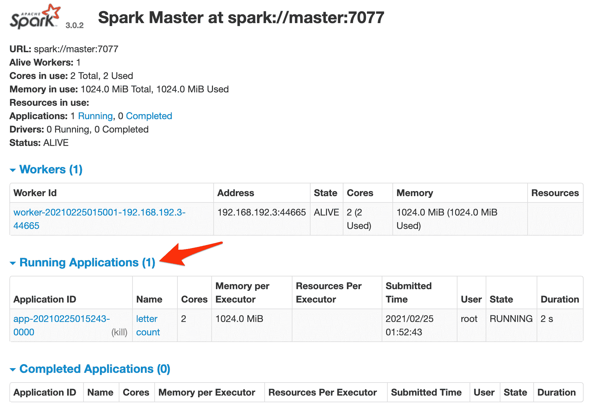
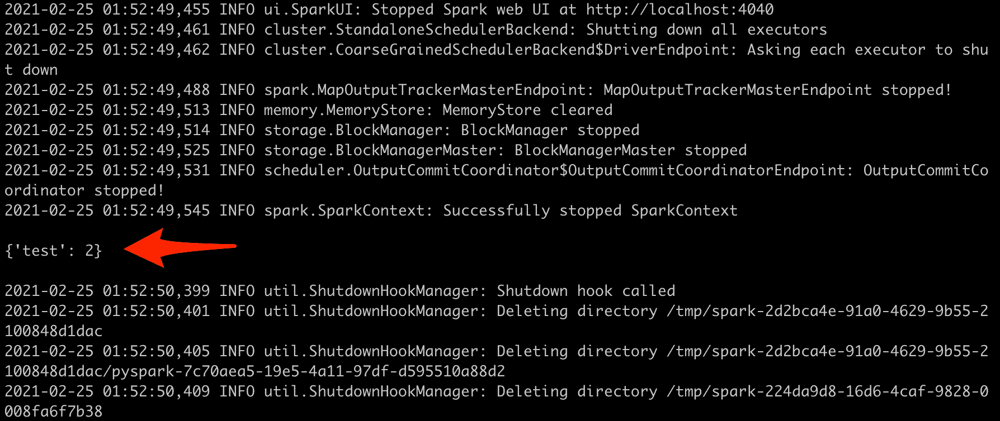
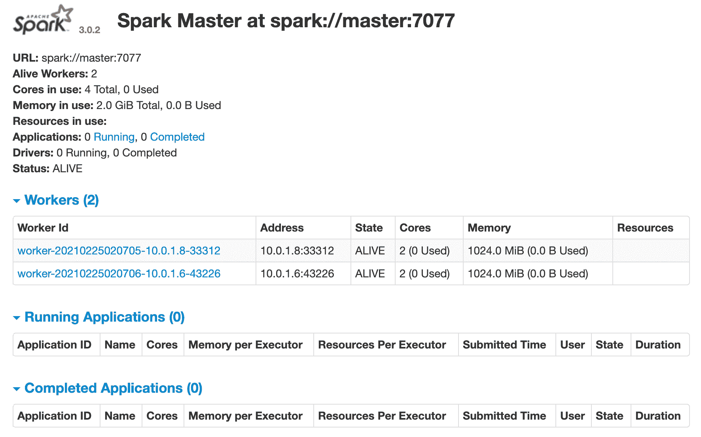
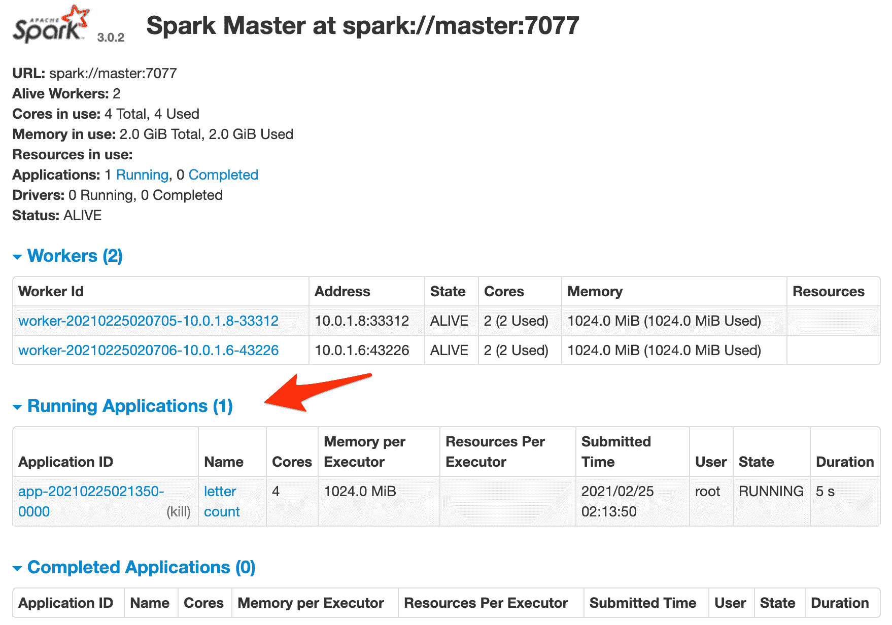

# 与 Docker Swarm 一起在数字海洋上运行火花

> 原文：<https://testdriven.io/blog/running-spark-with-docker-swarm-on-digitalocean/>

让我们看看如何将用于大规模数据处理的开源集群计算框架 Apache Spark 部署到 T2 数字海洋(DigitalOcean)上的 Docker Swarm 集群。我们还将了解如何根据需要自动配置(和取消配置)机器，以降低成本。

## 项目设置

克隆项目回购:

```
`$ git clone https://github.com/testdrivenio/spark-docker-swarm
$ cd spark-docker-swarm` 
```

然后，从 [Docker Hub](https://hub.docker.com/r/mjhea0/spark/) 中拉出预建的`spark`图像:

```
`$ docker pull mjhea0/spark:3.0.2` 
```

> Spark 版本 2.0.1，2.3.3，2.4.1 也有[可用](https://hub.docker.com/r/mjhea0/spark/tags)。

该图像大小约为 800MB，因此下载可能需要几分钟时间，这取决于您的连接速度。在等待它完成时，请随意查看用于构建该图像的 [Dockerfile](https://github.com/testdrivenio/spark-docker-swarm/blob/master/Dockerfile) 以及 [count.py](https://github.com/testdrivenio/spark-docker-swarm/blob/master/count.py) ，我们将通过 Spark 运行它。

一旦提取，将`SPARK_PUBLIC_DNS`环境变量设置为`localhost`或 Docker 机器的 IP 地址:

```
`$ export EXTERNAL_IP=localhost` 
```

> `SPARK_PUBLIC_DNS`设置 Spark 主机和工作机的公共 DNS 名称。

点燃容器:

```
`$ docker-compose up -d --build` 
```

这将旋转火花主人和一个工人。在浏览器中导航到 Spark master 的 web UI，网址为 [http://localhost:8080](http://localhost:8080) :

[](/static/images/blog/spark-docker-swarm/web_ui_1.png)

要启动 Spark 工作，我们需要:

1.  获取`master`服务的容器 ID，并将其分配给一个名为`CONTAINER_ID`的环境变量
2.  将 *count.py* 文件复制到`master`容器中的“/tmp”目录
3.  运行作业！

尝试一下:

```
`# get container id, assign to env variable
$ export CONTAINER_ID=$(docker ps --filter name=master --format "{{.ID}}")

# copy count.py
$ docker cp count.py $CONTAINER_ID:/tmp

# run spark
$ docker exec $CONTAINER_ID \
  bin/spark-submit \
    --master spark://master:7077 \
    --class endpoint \
    /tmp/count.py` 
```

跳回 Spark master 的 web UI。您应该会看到一个正在运行的作业:

[](/static/images/blog/spark-docker-swarm/web_ui_2.png)

在终端中，您应该会看到输出的火花日志。如果一切顺利，来自 *counts.py* 的`get_counts()`函数的输出应该是:

[](/static/images/blog/spark-docker-swarm/output_1.png)

有了这个，让我们来旋转一个蜂群吧！

## 码头工人群

首先，你需要[注册](https://m.do.co/c/d8f211a4b4c2)一个数字海洋账户(如果你还没有的话)，然后[生成](https://www.digitalocean.com/docs/apis-clis/api/create-personal-access-token/)一个访问令牌，这样你就可以访问[数字海洋 API](https://developers.digitalocean.com/documentation/v2/) 。

将令牌添加到您的环境中:

```
`$ export DIGITAL_OCEAN_ACCESS_TOKEN=[your_digital_ocean_token]` 
```

旋转三个数字海洋液滴:

```
`$ for i in 1 2 3; do
    docker-machine create \
      --driver digitalocean \
      --digitalocean-access-token $DIGITAL_OCEAN_ACCESS_TOKEN \
      --engine-install-url "https://releases.rancher.com/install-docker/19.03.9.sh" \
      node-$i;
  done` 
```

在`node-1`初始化[群模式](https://docs.docker.com/engine/swarm/):

```
`$ docker-machine ssh node-1 \
  -- docker swarm init \
  --advertise-addr $(docker-machine ip node-1)` 
```

从上一个命令的输出中获取 join 令牌，然后将剩余的节点作为 workers 添加到群中:

```
`$ for i in 2 3; do
    docker-machine ssh node-$i \
      -- docker swarm join --token YOUR_JOIN_TOKEN;
  done` 
```

耗尽蜂群管理器:

```
`$ docker-machine ssh node-1 -- docker node update --availability drain node-1` 
```

> 清空群管理器使其不能运行任何容器是一个好的做法。

将 Docker 守护进程指向`node-1`，更新`EXTERNAL_IP`环境变量，并部署堆栈:

```
`$ eval $(docker-machine env node-1)
$ export EXTERNAL_IP=$(docker-machine ip node-2)
$ docker stack deploy --compose-file=docker-compose.yml spark` 
```

添加另一个工作节点:

```
`$ docker service scale spark_worker=2` 
```

查看堆栈:

您应该会看到类似如下的内容:

```
`ID             NAME             IMAGE                NODE      DESIRED STATE   CURRENT STATE
uoz26a2zhpoh   spark_master.1   mjhea0/spark:3.0.2   node-3    Running         Running 23 seconds ago
ek7j1imsgvjy   spark_worker.1   mjhea0/spark:3.0.2   node-2    Running         Running 21 seconds ago
l7jz5s29rqrc   spark_worker.2   mjhea0/spark:3.0.2   node-3    Running         Running 24 seconds ago` 
```

将 Docker 守护进程指向 Spark master 所在的节点:

```
`$ NODE=$(docker service ps --format "{{.Node}}" spark_master)
$ eval $(docker-machine env $NODE)` 
```

获取 IP:

```
`$ docker-machine ip $NODE` 
```

确保 Spark master 的 web UI 在[http://YOUR _ MACHINE _ IP:8080](http://YOUR_MACHINE_IP:8080)打开。您还应该看到两个工人:

[](/static/images/blog/spark-docker-swarm/web_ui_3.png)

获取 Spark master 的容器 ID，并将其设置为环境变量:

```
`$ export CONTAINER_ID=$(docker ps --filter name=master --format "{{.ID}}")` 
```

复制文件:

```
`$ docker cp count.py $CONTAINER_ID:/tmp` 
```

测试:

```
`$ docker exec $CONTAINER_ID \
  bin/spark-submit \
    --master spark://master:7077 \
    --class endpoint \
    /tmp/count.py` 
```

同样，您应该在 Spark master 的 web UI 中看到作业运行，同时在终端中看到输出的 Spark 日志。

[](/static/images/blog/spark-docker-swarm/web_ui_4.png)

作业完成后关闭节点:

```
`$ docker-machine rm node-1 node-2 node-3 -y` 
```

## 自动化脚本

为了降低成本，您可以按需增加和配置资源——因此您只需为您使用的资源付费。

让我们编写几个脚本，它们将:

1.  用 Docker 机器提供液滴
2.  配置 Docker 群组模式
3.  向群集添加节点
4.  展开火花
5.  进行火花作业
6.  完成后，旋转水滴

*create.sh* :

```
`#!/bin/bash

echo "Spinning up three droplets..."

for i in 1 2 3; do
  docker-machine create \
    --driver digitalocean \
    --digitalocean-access-token $DIGITAL_OCEAN_ACCESS_TOKEN \
    --engine-install-url "https://releases.rancher.com/install-docker/19.03.9.sh" \
    node-$i;
done

echo "Initializing Swarm mode..."

docker-machine ssh node-1 -- docker swarm init --advertise-addr $(docker-machine ip node-1)

docker-machine ssh node-1 -- docker node update --availability drain node-1

echo "Adding the nodes to the Swarm..."

TOKEN=`docker-machine ssh node-1 docker swarm join-token worker | grep token | awk '{ print $5 }'`

docker-machine ssh node-2 "docker swarm join --token ${TOKEN}  $(docker-machine ip node-1):2377"
docker-machine ssh node-3 "docker swarm join --token ${TOKEN}  $(docker-machine ip node-1):2377"

echo "Deploying Spark..."

eval $(docker-machine env node-1)
export EXTERNAL_IP=$(docker-machine ip node-2)
docker stack deploy --compose-file=docker-compose.yml spark
docker service scale spark_worker=2

echo "Get address..."

NODE=$(docker service ps --format "{{.Node}}" spark_master)
docker-machine ip $NODE` 
```

*run.sh* :

```
`#!/bin/sh

echo "Getting container ID of the Spark master..."

eval $(docker-machine env node-1)
NODE=$(docker service ps --format "{{.Node}}" spark_master)
eval $(docker-machine env $NODE)
CONTAINER_ID=$(docker ps --filter name=master --format "{{.ID}}")

echo "Copying count.py script to the Spark master..."

docker cp count.py $CONTAINER_ID:/tmp

echo "Running Spark job..."

docker exec $CONTAINER_ID \
  bin/spark-submit \
    --master spark://master:7077 \
    --class endpoint \
    /tmp/count.py` 
```

*destroy.sh* :

```
`#!/bin/bash

docker-machine rm node-1 node-2 node-3 -y` 
```

测试一下！

* * *

代码可以在 [spark-docker-swarm](https://github.com/testdrivenio/spark-docker-swarm) repo 中找到。干杯！