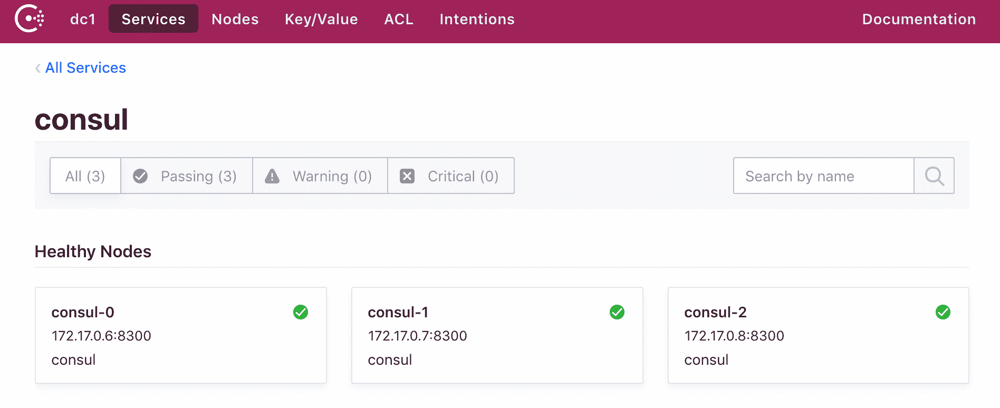
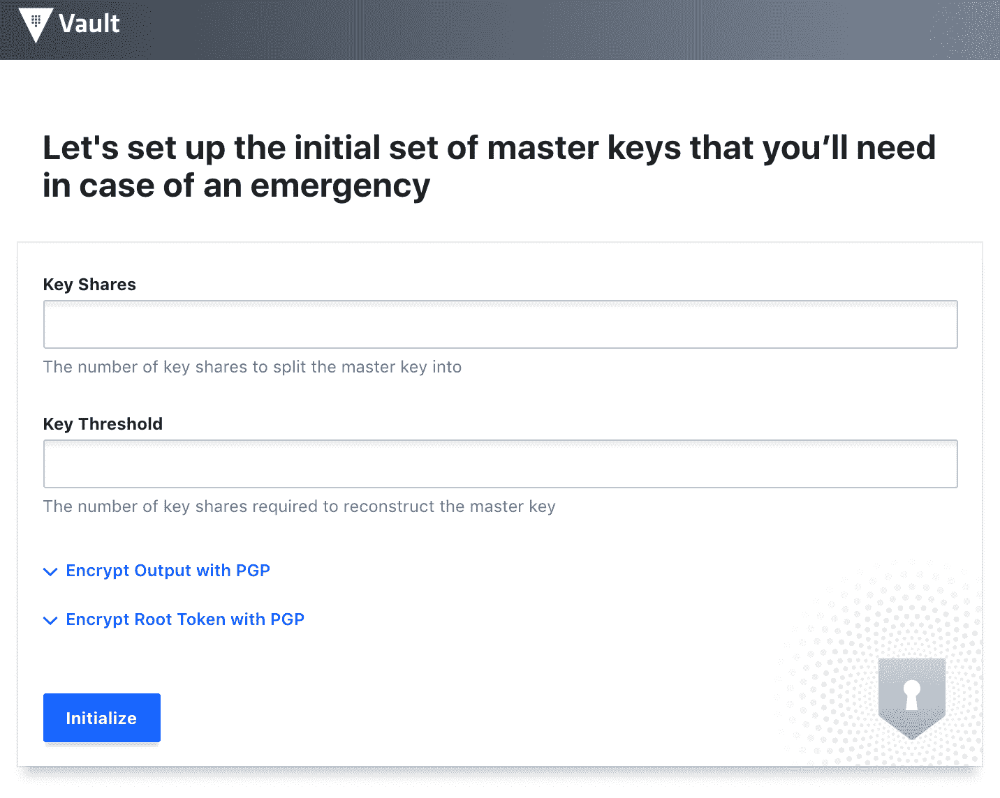
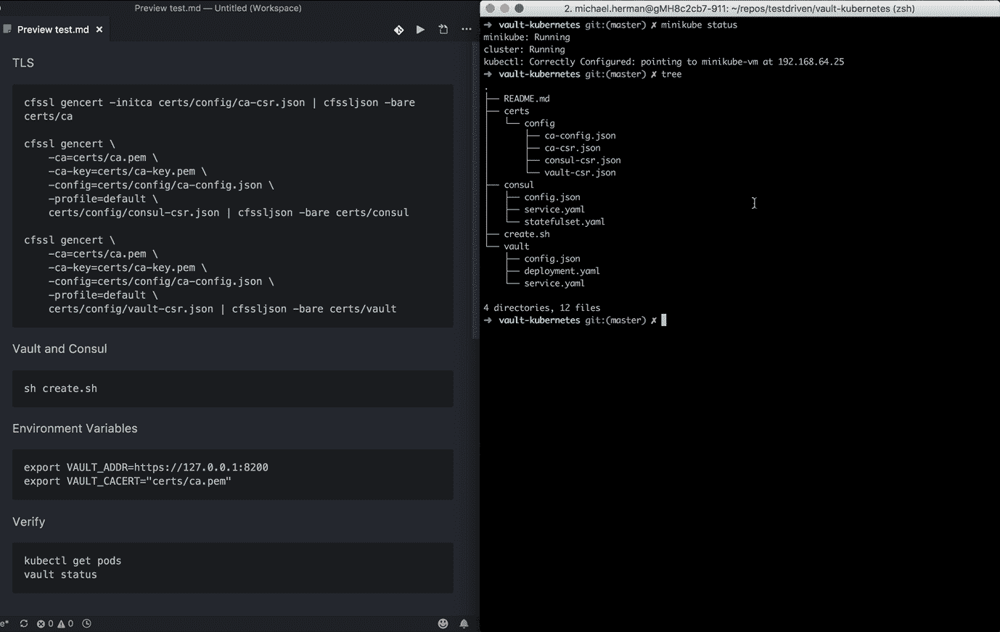

# 在库伯内特经营金库和领事

> 原文：<https://testdriven.io/blog/running-vault-and-consul-on-kubernetes/>

在下面的教程中，我们将带您在 Kubernetes 上使用 TLS 配置一个高度可用的 Hashicorp Vault 和 Consul 集群。

*主要依赖:*

*   保险库版本 1.7.1
*   领事 v1.9.5
*   kubernetes 1 . 21 . 0 版

> 这是一个中级教程。它假设你有金库，领事，码头工人和 Kubernetes 的基本工作知识。

## 迷你库贝

Minikube 是一个用于在本地运行单节点 Kubernetes 集群的工具。它旨在快速启动并运行一个集群，这样您就可以开始在本地与 Kubernetes API 进行交互。

遵循官方的[入门](https://minikube.sigs.k8s.io/docs/start/)指南，安装 Minikube 以及:

1.  一个[虚拟机管理程序](https://en.wikipedia.org/wiki/Hypervisor)(像 [VirtualBox](https://www.virtualbox.org/wiki/Downloads) 或 [HyperKit](https://github.com/moby/hyperkit) )来管理虚拟机
2.  在 Kubernetes 上部署和管理应用程序

> 如果你用的是 Mac，我们建议用 [Homebrew](https://brew.sh/) 安装 Kubectl 和 Minikube:
> 
> ```
> `$ brew update
> $ brew install kubectl
> $ brew install minikube` 
> ```

然后，启动组合仪表并拉起 Minikube [仪表盘](https://kubernetes.io/docs/tasks/access-application-cluster/web-ui-dashboard/):

```
`$ minikube config set vm-driver hyperkit
$ minikube start
$ minikube dashboard` 
```

至此，我们将把注意力转向配置 TLS。

## TLS 证书

TLS 将用于保护每个 Consul 成员之间的 RPC 通信。为此，我们将通过 CloudFlare 的 [SSL 工具包](https://github.com/cloudflare/cfssl) ( `cfssl`和`cfssljson`)创建一个证书颁发机构(CA)来签署证书，并向节点分发密钥。

如果你还没有安装 [Go](https://golang.org/doc/install) 就开始安装吧。

> 再说一遍，如果你用的是 Mac，安装 Go 最快的方法就是用自制软件:
> 
> ```
> `$ brew update
> $ brew install go` 
> ```

安装后，创建一个工作区，配置 [GOPATH](https://github.com/golang/go/wiki/GOPATH) 并将工作区的 bin 文件夹添加到您的系统路径:

```
`$ mkdir $HOME/go
$ export GOPATH=$HOME/go
$ export PATH=$PATH:$GOPATH/bin` 
```

接下来，安装 SSL 工具包:

```
`$ go get -u github.com/cloudflare/cfssl/cmd/cfssl
$ go get -u github.com/cloudflare/cfssl/cmd/cfssljson` 
```

创建名为“vault-consul-kubernetes”的新项目目录，并添加以下文件和文件夹:

```
`├── certs
│   ├── config
│   │   ├── ca-config.json
│   │   ├── ca-csr.json
│   │   ├── consul-csr.json
│   │   └── vault-csr.json
├── consul
└── vault` 
```

*ca-config.json* :

```
`{ "signing":  { "default":  { "expiry":  "87600h" }, "profiles":  { "default":  { "usages":  [ "signing", "key encipherment", "server auth", "client auth" ], "expiry":  "8760h" } } } }` 
```

*ca-csr.json*

```
`{ "hosts":  [ "cluster.local" ], "key":  { "algo":  "rsa", "size":  2048 }, "names":  [ { "C":  "US", "ST":  "Colorado", "L":  "Denver" } ] }` 
```

*领事-csr.json* :

```
`{ "CN":  "server.dc1.cluster.local", "hosts":  [ "server.dc1.cluster.local", "127.0.0.1" ], "key":  { "algo":  "rsa", "size":  2048 }, "names":  [ { "C":  "US", "ST":  "Colorado", "L":  "Denver" } ] }` 
```

【t0-CSR . JSON】：

```
`{ "hosts":  [ "vault", "127.0.0.1" ], "key":  { "algo":  "rsa", "size":  2048 }, "names":  [ { "C":  "US", "ST":  "Colorado", "L":  "Denver" } ] }` 
```

> 有关这些文件的信息，请查看《带 TLS 加密的安全咨询代理通信指南》。

创建证书颁发机构:

```
`$ cfssl gencert -initca certs/config/ca-csr.json | cfssljson -bare certs/ca` 
```

然后，为 Consul 创建一个私钥和一个 TLS 证书:

```
`$ cfssl gencert \
    -ca=certs/ca.pem \
    -ca-key=certs/ca-key.pem \
    -config=certs/config/ca-config.json \
    -profile=default \
    certs/config/consul-csr.json | cfssljson -bare certs/consul` 
```

对 Vault 执行相同的操作:

```
`$ cfssl gencert \
    -ca=certs/ca.pem \
    -ca-key=certs/ca-key.pem \
    -config=certs/config/ca-config.json \
    -profile=default \
    certs/config/vault-csr.json | cfssljson -bare certs/vault` 
```

现在，您应该会在“certs”目录中看到以下 PEM 文件:

*   ca-key.pem
*   ca.csr
*   ca.pem
*   领事钥匙. pem
*   领事. csr
*   领事. pem
*   vault-key.pem
*   vault.csr
*   vault.pem

## 领事

### 八卦加密密钥

Consul 使用[八卦协议](https://www.consul.io/docs/architecture/gossip)来广播加密信息，并发现加入集群的新成员。这需要一个共享密钥。要生成，首先[安装 Consul 客户端](https://www.consul.io/docs/install/index.html) (Mac 用户要用 Brew 来做这个- `brew install consul`)，然后生成一个密钥并存储在一个环境变量中:

```
`$ export GOSSIP_ENCRYPTION_KEY=$(consul keygen)` 
```

将密钥与 TLS 证书一起秘密存储:

```
`$ kubectl create secret generic consul \
  --from-literal="gossip-encryption-key=${GOSSIP_ENCRYPTION_KEY}" \
  --from-file=certs/ca.pem \
  --from-file=certs/consul.pem \
  --from-file=certs/consul-key.pem` 
```

验证:

```
`$ kubectl describe secrets consul` 
```

您应该看到:

```
`Name:         consul
Namespace:    default
Labels:       <none>
Annotations:  <none>

Type:  Opaque

Data
====
consul.pem:             1359 bytes
gossip-encryption-key:  44 bytes
ca.pem:                 1168 bytes
consul-key.pem:         1679 bytes` 
```

### 配置

向“consul”添加一个名为 *config.json* 的新文件:

```
`{ "ca_file":  "/etc/tls/ca.pem", "cert_file":  "/etc/tls/consul.pem", "key_file":  "/etc/tls/consul-key.pem", "verify_incoming":  true, "verify_outgoing":  true, "verify_server_hostname":  true, "ports":  { "https":  8443 } }` 
```

通过将`verify_incoming`、`verify_outgoing`和`verify_server_hostname`设置为`true`，所有的 RPC 调用都必须被加密。

> 请务必查看咨询文档中的 [RPC 加密与 TLS](https://www.consul.io/docs/security/encryption#rpc-encryption-with-tls) 指南，以了解有关这些选项的更多信息。

将此配置保存在配置映射中:

```
`$ kubectl create configmap consul --from-file=consul/config.json
$ kubectl describe configmap consul` 
```

### 服务

定义一个[无头服务](https://kubernetes.io/docs/concepts/services-networking/service/#headless-services)——一个没有集群 IP-in*consul/Service . YAML*的服务，在内部公开每个 Consul 成员:

```
`apiVersion:  v1 kind:  Service metadata: name:  consul labels: name:  consul spec: clusterIP:  None ports: -  name:  http port:  8500 targetPort:  8500 -  name:  https port:  8443 targetPort:  8443 -  name:  rpc port:  8400 targetPort:  8400 -  name:  serflan-tcp protocol:  "TCP" port:  8301 targetPort:  8301 -  name:  serflan-udp protocol:  "UDP" port:  8301 targetPort:  8301 -  name:  serfwan-tcp protocol:  "TCP" port:  8302 targetPort:  8302 -  name:  serfwan-udp protocol:  "UDP" port:  8302 targetPort:  8302 -  name:  server port:  8300 targetPort:  8300 -  name:  consuldns port:  8600 targetPort:  8600 selector: app:  consul` 
```

创建服务:

```
`$ kubectl create -f consul/service.yaml
$ kubectl get service consul` 
```

> 请确保在 StatefulSet 之前创建服务，因为由 StatefulSet 创建的 pod 将立即开始进行 DNS 查找以查找其他成员。

### 状态集

领事/statefulset.yaml :

```
`apiVersion:  apps/v1 kind:  StatefulSet metadata: name:  consul spec: serviceName:  consul replicas:  3 selector: matchLabels: app:  consul template: metadata: labels: app:  consul spec: securityContext: fsGroup:  1000 containers: -  name:  consul image:  "consul:1.4.0" env: -  name:  POD_IP valueFrom: fieldRef: fieldPath:  status.podIP -  name:  GOSSIP_ENCRYPTION_KEY valueFrom: secretKeyRef: name:  consul key:  gossip-encryption-key -  name:  NAMESPACE valueFrom: fieldRef: fieldPath:  metadata.namespace args: -  "agent" -  "-advertise=$(POD_IP)" -  "-bind=0.0.0.0" -  "-bootstrap-expect=3" -  "-retry-join=consul-0.consul.$(NAMESPACE).svc.cluster.local" -  "-retry-join=consul-1.consul.$(NAMESPACE).svc.cluster.local" -  "-retry-join=consul-2.consul.$(NAMESPACE).svc.cluster.local" -  "-client=0.0.0.0" -  "-config-file=/consul/myconfig/config.json" -  "-datacenter=dc1" -  "-data-dir=/consul/data" -  "-domain=cluster.local" -  "-encrypt=$(GOSSIP_ENCRYPTION_KEY)" -  "-server" -  "-ui" -  "-disable-host-node-id" volumeMounts: -  name:  config mountPath:  /consul/myconfig -  name:  tls mountPath:  /etc/tls lifecycle: preStop: exec: command: -  /bin/sh -  -c -  consul leave ports: -  containerPort:  8500 name:  ui-port -  containerPort:  8400 name:  alt-port -  containerPort:  53 name:  udp-port -  containerPort:  8443 name:  https-port -  containerPort:  8080 name:  http-port -  containerPort:  8301 name:  serflan -  containerPort:  8302 name:  serfwan -  containerPort:  8600 name:  consuldns -  containerPort:  8300 name:  server volumes: -  name:  config configMap: name:  consul -  name:  tls secret: secretName:  consul` 
```

部署三节点咨询集群:

```
`$ kubectl create -f consul/statefulset.yaml` 
```

验证 pod 已启动并正在运行:

```
`$ kubectl get pods

NAME       READY     STATUS    RESTARTS   AGE
consul-0   1/1       Running   0          17s
consul-1   1/1       Running   0          7s
consul-2   1/1       Running   0          6s` 
```

查看每个单元的日志，确保其中一个单元被选为领导者:

```
`$ kubectl logs consul-0
$ kubectl logs consul-1
$ kubectl logs consul-2` 
```

示例日志:

```
`2021/04/27 21:24:36 [INFO] raft: Election won. Tally: 2
2021/04/27 21:24:36 [INFO] raft: Node at 172.17.0.7:8300 [Leader] entering Leader state
2021/04/27 21:24:36 [INFO] raft: Added peer a3ee83a0-e39b-f58b-e2d4-35a3689ff3d9, starting replication
2021/04/27 21:24:36 [INFO] consul: cluster leadership acquired
2021/04/27 21:24:36 [INFO] consul: New leader elected: consul-2
2021/04/27 21:24:36 [INFO] raft: Added peer f91746e3-881c-aebb-f8c5-b34bf37d3529, starting replication
2021/04/27 21:24:36 [WARN] raft: AppendEntries to {Voter a3ee83a0-e39b-f58b-e2d4-35a3689ff3d9 172.17.0.6:8300} rejected, sending older logs (next: 1)
2021/04/27 21:24:36 [INFO] raft: pipelining replication to peer {Voter a3ee83a0-e39b-f58b-e2d4-35a3689ff3d9 172.17.0.6:8300}
2021/04/27 21:24:36 [WARN] raft: AppendEntries to {Voter f91746e3-881c-aebb-f8c5-b34bf37d3529 172.17.0.5:8300} rejected, sending older logs (next: 1)
2021/04/27 21:24:36 [INFO] raft: pipelining replication to peer {Voter f91746e3-881c-aebb-f8c5-b34bf37d3529 172.17.0.5:8300}
2021/04/27 21:24:36 [INFO] consul: member 'consul-2' joined, marking health alive
2021/04/27 21:24:36 [INFO] consul: member 'consul-1' joined, marking health alive
2021/04/27 21:24:36 [INFO] consul: member 'consul-0' joined, marking health alive
2021/04/27 21:24:36 [INFO] agent: Synced node info` 
```

将端口转发到本地机器:

```
`$ kubectl port-forward consul-1 8500:8500` 
```

然后，在新的终端窗口中，确保所有成员都处于活动状态:

```
`$ consul members

Node      Address          Status  Type    Build  Protocol  DC   Segment
consul-0  172.17.0.6:8301  alive   server  1.4.0  2         dc1  <all>
consul-1  172.17.0.7:8301  alive   server  1.4.0  2         dc1  <all>
consul-2  172.17.0.8:8301  alive   server  1.4.0  2         dc1  <all>` 
```

最后，您应该能够访问位于 [http://localhost:8500](http://localhost:8500) 的 web 界面。



## 跳跃

接下来，让我们将 Vault 配置为在 Kubernetes 上运行。

### 秘密

将我们创建的保管库 TLS 证书存储在一个秘密位置:

```
`$ kubectl create secret generic vault \
    --from-file=certs/ca.pem \
    --from-file=certs/vault.pem \
    --from-file=certs/vault-key.pem

$ kubectl describe secrets vault` 
```

### 配置图

为 Vault 配置添加一个名为 *vault/config.json* 的新文件:

```
`{ "listener":  { "tcp":{ "address":  "127.0.0.1:8200", "tls_disable":  0, "tls_cert_file":  "/etc/tls/vault.pem", "tls_key_file":  "/etc/tls/vault-key.pem" } }, "storage":  { "consul":  { "address":  "consul:8500", "path":  "vault/", "disable_registration":  "true", "ha_enabled":  "true" } }, "ui":  true }` 
```

在这里，我们将 Vault 配置为使用 [Consul 后端](https://www.vaultproject.io/docs/configuration/storage/consul.html)(支持高可用性)，为 Vault 定义了 [TCP 监听器](https://www.vaultproject.io/docs/configuration/listener/tcp.html)，[启用了 TLS](https://www.vaultproject.io/docs/configuration/listener/tcp.html#tls_disable) ，添加了到 [TLS 证书](https://www.vaultproject.io/docs/configuration/listener/tcp.html#tls_cert_file)和[私钥](https://www.vaultproject.io/docs/configuration/listener/tcp.html#tls_key_file)的路径，并启用了 [Vault UI](https://www.vaultproject.io/docs/configuration/ui/index.html) 。查看[文档](https://www.vaultproject.io/docs/configuration/index.html)了解更多关于配置保险库的信息。

将此配置保存在配置映射中:

```
`$ kubectl create configmap vault --from-file=vault/config.json
$ kubectl describe configmap vault` 
```

### 服务

*vault/service.yaml* :

```
`apiVersion:  v1 kind:  Service metadata: name:  vault labels: app:  vault spec: type:  ClusterIP ports: -  port:  8200 targetPort:  8200 protocol:  TCP name:  vault selector: app:  vault` 
```

创建:

```
`$ kubectl create -f vault/service.yaml
$ kubectl get service vault` 
```

### 部署

*vault/deployment.yaml* :

```
`apiVersion:  apps/v1 kind:  Deployment metadata: name:  vault labels: app:  vault spec: replicas:  1 selector: matchLabels: app:  vault template: metadata: labels: app:  vault spec: containers: -  name:  vault command:  ["vault",  "server",  "-config",  "/vault/config/config.json"] image:  "vault:0.11.5" imagePullPolicy:  IfNotPresent securityContext: capabilities: add: -  IPC_LOCK volumeMounts: -  name:  configurations mountPath:  /vault/config/config.json subPath:  config.json -  name:  vault mountPath:  /etc/tls -  name:  consul-vault-agent image:  "consul:1.4.0" env: -  name:  GOSSIP_ENCRYPTION_KEY valueFrom: secretKeyRef: name:  consul key:  gossip-encryption-key -  name:  NAMESPACE valueFrom: fieldRef: fieldPath:  metadata.namespace args: -  "agent" -  "-retry-join=consul-0.consul.$(NAMESPACE).svc.cluster.local" -  "-retry-join=consul-1.consul.$(NAMESPACE).svc.cluster.local" -  "-retry-join=consul-2.consul.$(NAMESPACE).svc.cluster.local" -  "-encrypt=$(GOSSIP_ENCRYPTION_KEY)" -  "-config-file=/consul/myconfig/config.json" -  "-domain=cluster.local" -  "-datacenter=dc1" -  "-disable-host-node-id" -  "-node=vault-1" volumeMounts: -  name:  config mountPath:  /consul/myconfig -  name:  tls mountPath:  /etc/tls volumes: -  name:  configurations configMap: name:  vault -  name:  config configMap: name:  consul -  name:  tls secret: secretName:  consul -  name:  vault secret: secretName:  vault` 
```

部署保管库:

```
`$ kubectl apply -f vault/deployment.yaml` 
```

要进行测试，请获取 Pod 名称，然后转发端口:

```
`$ kubectl get pods

NAME                     READY     STATUS    RESTARTS   AGE
consul-0                 1/1       Running   0          35m
consul-1                 1/1       Running   0          35m
consul-2                 1/1       Running   0          35m
vault-64754b559d-dw459   2/2       Running   0          7m

$ kubectl port-forward vault-64754b559d-dw459 8200:8200` 
```

确保可以在 [https://localhost:8200](https://localhost:8200) 查看 UI。



## 快速试验

在端口转发仍然打开的情况下，在新的终端窗口中，导航到项目目录并设置`VAULT_ADDR`和`VAULT_CACERT`环境变量:

```
`$ export VAULT_ADDR=https://127.0.0.1:8200
$ export VAULT_CACERT="certs/ca.pem"` 
```

[在本地安装保险库客户端](https://www.vaultproject.io/docs/install/)，如果您还没有的话，然后用一个密钥初始化保险库:

```
`$ vault operator init -key-shares=1 -key-threshold=1` 
```

记下解封密钥和初始根令牌。

```
`Unseal Key 1: iejZsVPrDFPbQL+JUW5HGMub9tlAwSSr7bR5NuAX9pg=

Initial Root Token: 85kVUa6mxr2VFawubh1YFG6t

Vault initialized with 1 key shares and a key threshold of 1. Please securely
distribute the key shares printed above. When the Vault is re-sealed,
restarted, or stopped, you must supply at least 1 of these keys to unseal it
before it can start servicing requests.

Vault does not store the generated master key. Without at least 1 key to
reconstruct the master key, Vault will remain permanently sealed!

It is possible to generate new unseal keys, provided you have a quorum of
existing unseal keys shares. See "vault operator rekey" for more information.` 
```

虚构的

```
`$ vault operator unseal

Unseal Key (will be hidden):

Key                    Value
---                    -----
Seal Type              shamir
Initialized            true
Sealed                 false
Total Shares           1
Threshold              1
Version                0.11.5
Cluster Name           vault-cluster-2c64d090
Cluster ID             42db2c78-938b-fe5c-aa15-f70be43a5cb4
HA Enabled             true
HA Cluster             n/a
HA Mode                standby
Active Node Address    <none>` 
```

使用根令牌进行身份验证:

```
`$ vault login

Token (will be hidden):

Success! You are now authenticated. The token information displayed below
is already stored in the token helper. You do NOT need to run "vault login"
again. Future Vault requests will automatically use this token.

Key                  Value
---                  -----
token                85kVUa6mxr2VFawubh1YFG6t
token_accessor       8hGliUJJeM8iijbiSzqiH49o
token_duration       ∞
token_renewable      false
token_policies       ["root"]
identity_policies    []
policies             ["root"]` 
```

创建新的秘密:

```
`$ vault kv put secret/precious foo=bar

Success! Data written to: secret/precious` 
```

阅读:

```
`$ vault kv get secret/precious

=== Data ===
Key    Value
---    -----
foo    bar` 
```

完成后关闭集群。

## 自动化脚本

最后，让我们创建一个快速脚本来自动化资源调配过程:

1.  生成八卦加密密钥
2.  创建一个秘密来存储 Gossip 密钥和 TLS 证书
3.  将咨询配置存储在配置映射中
4.  创建咨询服务和状态集
5.  创建一个密码来存储保管库 TLS 证书
6.  将存储库配置存储在配置映射中
7.  创建 Vault 服务和部署
8.  将端口转发添加到端口 8200 的存储区

将名为 *create.sh* 的新文件添加到项目根目录:

```
`#!/bin/bash

echo "Generating the Gossip encryption key..."

export GOSSIP_ENCRYPTION_KEY=$(consul keygen)

echo "Creating the Consul Secret to store the Gossip key and the TLS certificates..."

kubectl create secret generic consul \
  --from-literal="gossip-encryption-key=${GOSSIP_ENCRYPTION_KEY}" \
  --from-file=certs/ca.pem \
  --from-file=certs/consul.pem \
  --from-file=certs/consul-key.pem

echo "Storing the Consul config in a ConfigMap..."

kubectl create configmap consul --from-file=consul/config.json

echo "Creating the Consul Service..."

kubectl create -f consul/service.yaml

echo "Creating the Consul StatefulSet..."

kubectl create -f consul/statefulset.yaml

echo "Creating a Secret to store the Vault TLS certificates..."

kubectl create secret generic vault \
    --from-file=certs/ca.pem \
    --from-file=certs/vault.pem \
    --from-file=certs/vault-key.pem

echo "Storing the Vault config in a ConfigMap..."

kubectl create configmap vault --from-file=vault/config.json

echo "Creating the Vault Service..."

kubectl create -f vault/service.yaml

echo "Creating the Vault Deployment..."

kubectl apply -f vault/deployment.yaml

echo "All done! Forwarding port 8200..."

POD=$(kubectl get pods -o=name | grep vault | sed "s/^.\{4\}//")

while true; do
  STATUS=$(kubectl get pods ${POD} -o jsonpath="{.status.phase}")
  if [ "$STATUS" == "Running" ]; then
    break
  else
    echo "Pod status is: ${STATUS}"
    sleep 5
  fi
done

kubectl port-forward $POD 8200:8200` 
```

在测试之前，确保 Minikube 启动并创建 TLS 证书。

在新的终端窗口中，导航到项目目录并运行:

```
`$ export VAULT_ADDR=https://127.0.0.1:8200
$ export VAULT_CACERT="certs/ca.pem"` 
```

检查状态:



* * *

你可以在[金库-领事-kubernetes](https://github.com/testdrivenio/vault-consul-kubernetes) 回购中找到最终代码。