# 使用 Django 设置条带连接

> 原文：<https://testdriven.io/blog/setting-up-stripe-connect-with-django/>

[Stripe Connect](https://stripe.com/connect) 是一项旨在代表他人处理和管理支付的服务。它被需要向多方支付的市场和[平台](https://en.wikipedia.org/wiki/Platform_economy)(如优步、Shopify、Kickstarter 和 Airbnb)使用。我们在 [TestDriven.io](https://testdriven.io/) 使用它来驱动我们的支付平台，这样我们就可以轻松地向内容创作者和分支机构支付费用。

本教程着眼于如何将 Stripe Connect 集成到 Django 应用程序中。

> 这是一个中级教程。它假设你熟悉[条纹](https://stripe.com/)和[姜戈](https://www.djangoproject.com/)。查看[姜戈条纹教程](https://testdriven.io/blog/django-stripe-tutorial/)帖子了解更多信息。

## 学习目标

学完本教程后，您应该能够:

1.  解释什么是条带连接，以及为什么您可能需要使用它
2.  描述条带连接帐户类型之间的相似性和差异
3.  将 Stripe Connect 集成到现有的 Django 应用程序中
4.  使用类似 Oauth 的流程将 Stripe 帐户链接到 Django 应用程序
5.  解释直接费用和目的地费用的区别

## 条带连接帐户

使用 Stripe Connect，您首先需要决定您希望在您的平台上使用的用户帐户的类型:

1.  [标准](https://stripe.com/docs/connect/standard-accounts)
2.  [快递](https://stripe.com/docs/connect/express-accounts)
3.  [自定义](https://stripe.com/docs/connect/custom-accounts)

> “平台”是指你的市场网络应用，而“用户”是指通过你的平台销售商品或服务而获得报酬的人。

对于标准帐户和快速帐户，您平台上的用户将经历一个类似 OAuth 的流程，他们将被发送到 Stripe，创建或链接他们的 Stripe 帐户，然后被重定向回您的平台。这可能具有相当大的破坏性。用户还需要维护两个帐户——一个用于您的平台，一个用于 Stripe——这并不理想。如果你希望每个月都有大量的用户，这可能是行不通的。另一方面，如果你刚刚开始并想快速上手，坚持使用标准账户。从那里开始。如果您发现您需要对入职体验进行更多的控制，以使其更加无缝，那么您可能需要切换到与 Express 或 Custom 帐户集成。

除了 UX，对于快递和定制账户，你(平台)最终要对欺诈负责，并且必须处理有争议的交易。

> 作为参考， [TestDriven.io](https://testdriven.io/) 平台使用标准账户和快捷账户，具体取决于交易类型和参与方数量。

在选择要合作的客户类型时，问问自己:

1.  入职体验需要多无缝？
2.  谁应该处理欺诈和支付纠纷？

在本教程中，我们将坚持使用标准帐户。更多信息，请查看 Stripe 的[选择方法](https://stripe.com/docs/connect/accounts#choosing-an-approach)和[最佳实践](https://stripe.com/docs/connect/best-practices)指南。

## 工作流程

同样，对于标准(和快速)账户，用户通过类似于 OAuth 的流程来连接他们的 Stripe 账户:

1.  平台上经过身份验证的用户单击一个链接，将他们带到条带化
2.  然后，他们通过登录现有帐户或创建新帐户来连接条带帐户
3.  连接后，用户会通过授权码被重定向回您的平台
4.  然后，您请求使用该代码进行条带化，以便获得处理支付所需的信息

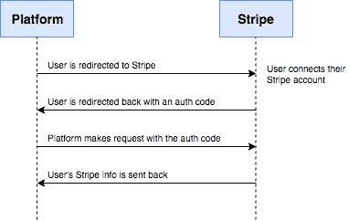

## 初始设置

首先，克隆出[django-stripe-connect](https://github.com/testdrivenio/django-stripe-connect)repo，然后检查主分支的 [v1](https://github.com/testdrivenio/django-stripe-connect/releases/tag/v1) 标记:

```py
`$ git clone https://github.com/testdrivenio/django-stripe-connect --branch v1 --single-branch
$ cd django-stripe-connect
$ git checkout tags/v1 -b master` 
```

创建虚拟环境并安装依赖项:

```py
`$ pipenv shell
$ pipenv install` 
```

应用迁移，创建超级用户，并将设备添加到数据库:

```py
`$ python manage.py migrate
$ python manage.py createsuperuser
$ python manage.py loaddata fixtures/users.json
$ python manage.py loaddata fixtures/courses.json` 
```

运行服务器:

```py
`$ python manage.py runserver` 
```

在 [http://localhost:8000/](http://localhost:8000/) 您应该看到:

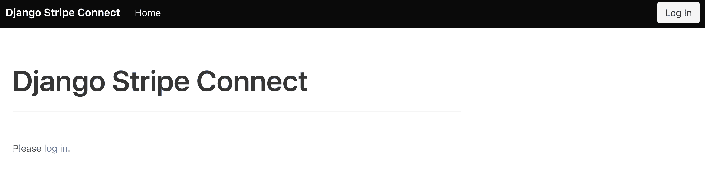

确保您能够以超级用户身份登录:

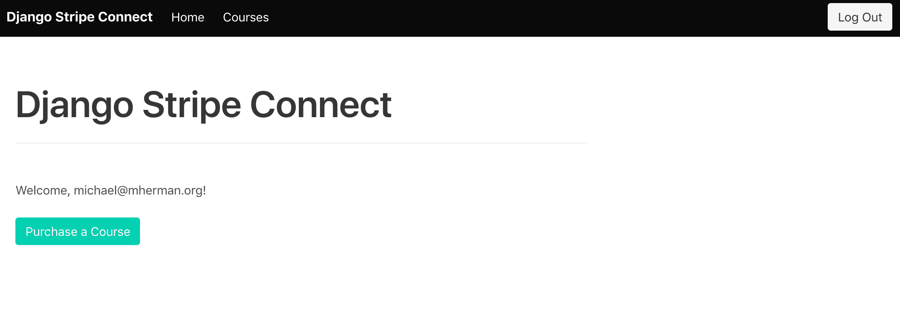

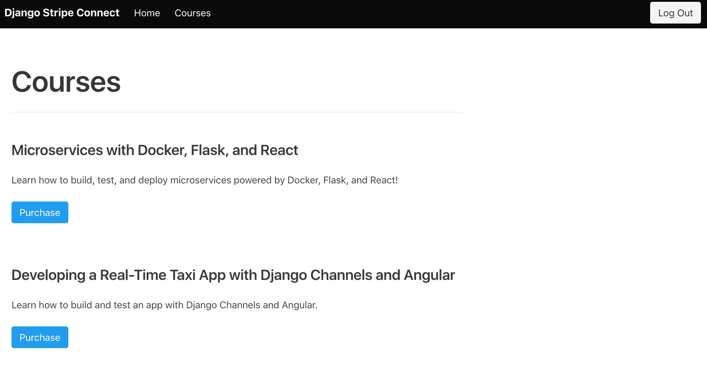

尝试以买家和卖家的双重身份登录。

买家:

卖家:

本质上，这个示例应用程序类似于 [TestDriven.io](https://testdriven.io/) 平台——用户可以创建和销售课程。 [CustomUser 模型](https://docs.djangoproject.com/en/2.0/topics/auth/customizing/)扩展了内置的[用户](https://docs.djangoproject.com/en/2.1/ref/contrib/auth/#django.contrib.auth.models.User)模型，创建了卖家和买家。卖家可以买卖课程，而买家只能购买课程。添加新用户时，默认情况下他们是买家。超级用户可以更改用户的状态。

在继续之前，快速浏览一下项目结构:

```py
`├── Pipfile
├── Pipfile.lock
├── apps
│   ├── courses
│   │   ├── __init__.py
│   │   ├── admin.py
│   │   ├── apps.py
│   │   ├── migrations
│   │   ├── models.py
│   │   ├── tests.py
│   │   ├── urls.py
│   │   └── views.py
│   └── users
│       ├── __init__.py
│       ├── admin.py
│       ├── apps.py
│       ├── forms.py
│       ├── managers.py
│       ├── migrations
│       ├── models.py
│       ├── signals.py
│       ├── tests.py
│       └── views.py
├── fixtures
│   ├── courses.json
│   └── users.json
├── manage.py
├── my_project
│   ├── __init__.py
│   ├── settings.py
│   ├── urls.py
│   └── wsgi.py
├── static
│   └── bulma.min.css
└── templates
    ├── _base.html
    ├── courses
    │   ├── course_detail.html
    │   └── course_list.html
    ├── home.html
    ├── login.html
    └── nav.html` 
```

## 配置条带

[Stripe Checkout](https://stripe.com/payments/checkout) 已经预配置好，还有 [Stripe Python 库](https://github.com/stripe/stripe-python)。为了处理支付，创建一个 Stripe 帐户(如果您还没有)，并将您的测试机密和测试可发布密钥添加到 *settings.py* 文件的底部:

```py
`STRIPE_PUBLISHABLE_KEY = '<your test publishable key here>'
STRIPE_SECRET_KEY = '<your test secret key here>'` 
```

确保您可以处理费用。首先，使用买家帐户登录:

然后，购买课程:

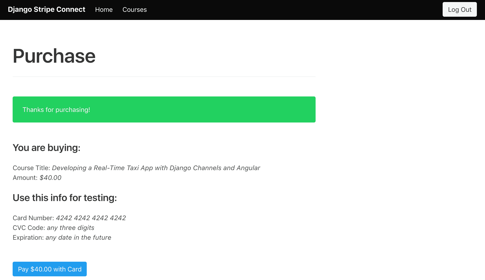

您应该会在“支付”下的 Stripe 仪表盘上看到费用:

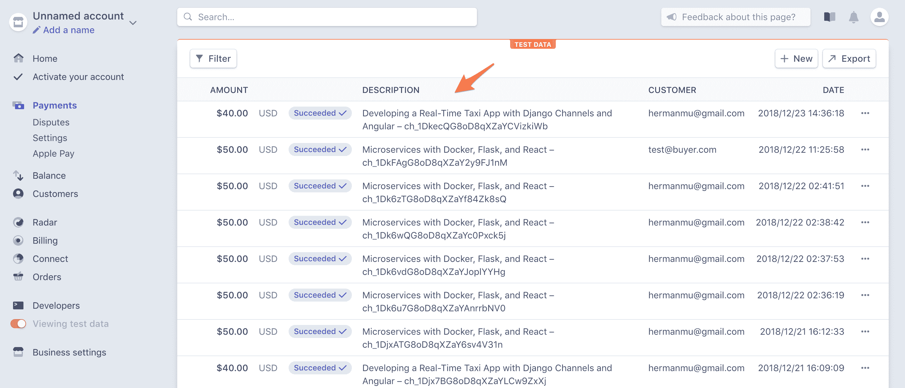

> 需要帮助吗？参考 [Django 条纹教程](https://testdriven.io/blog/django-stripe-tutorial)博文中的[添加条纹](https://testdriven.io/blog/django-stripe-tutorial/#add-stripe)部分。

要[使用 Stripe Connect 注册您的平台](https://stripe.com/docs/connect/quickstart#register-platform)，请点击 Stripe 仪表盘左侧栏中的“Connect ”:

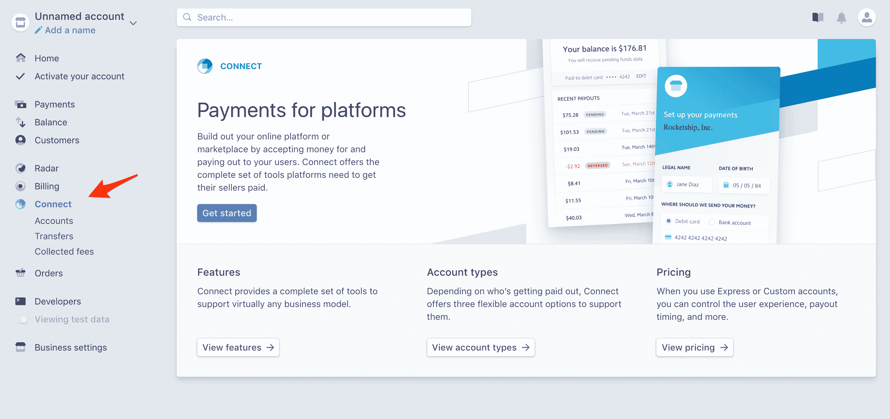

然后，单击“开始”按钮。注册后，点击“设置”链接，获取您的测试客户端 ID:

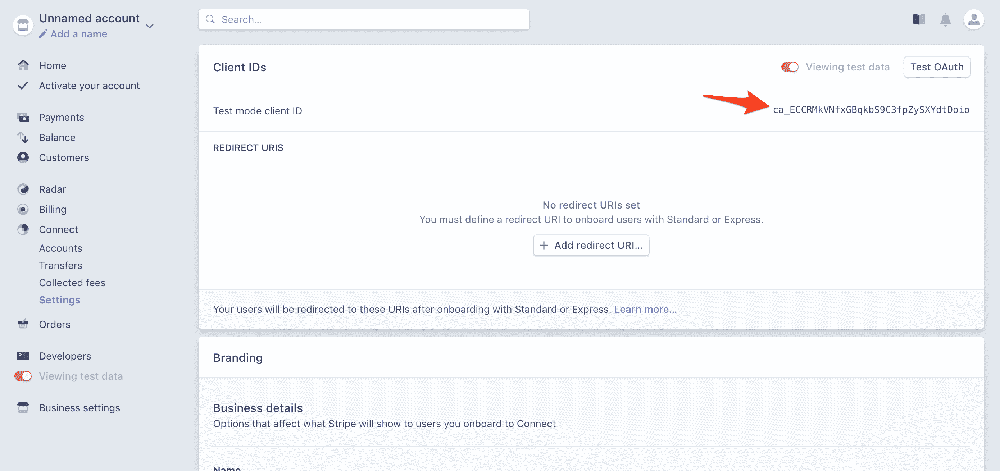

将此添加到 *settings.py* 的底部:

```py
`STRIPE_CONNECT_CLIENT_ID = '<your test connect client id here>'` 
```

回到仪表板，使用`http://localhost:8000/users/oauth/callback`作为重定向 URI。也可以随时更新“品牌”部分:

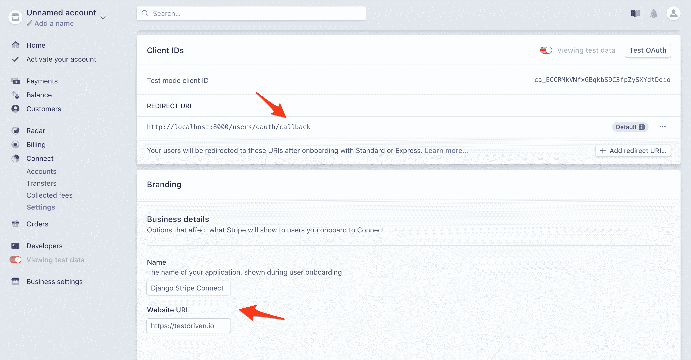

## 连接帐户

接下来，让我们在主页上添加一个“连接 Stripe 帐户”按钮的链接，该链接将用户发送到 Stripe，以便他们可以链接他们的帐户。

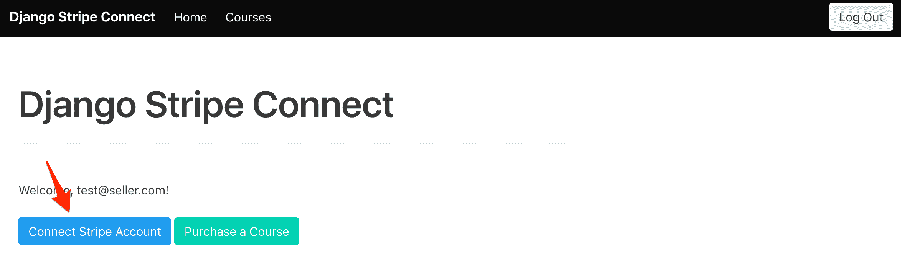

### 重定向至条带

将视图添加到 *apps/users/views.py* :

```py
`import urllib

from django.urls import reverse
from django.http import HttpResponseRedirect
from django.views import View
from django.conf import settings
from django.shortcuts import redirect

class StripeAuthorizeView(View):

    def get(self, request):
        if not self.request.user.is_authenticated:
            return HttpResponseRedirect(reverse('login'))
        url = 'https://connect.stripe.com/oauth/authorize'
        params = {
            'response_type': 'code',
            'scope': 'read_write',
            'client_id': settings.STRIPE_CONNECT_CLIENT_ID,
            'redirect_uri': f'http://localhost:8000/users/oauth/callback'
        }
        url = f'{url}?{urllib.parse.urlencode(params)}'
        return redirect(url)` 
```

如果用户通过了身份验证，我们[从`response_type`、`scope`、`client_id`和`redirect_uri`创建 OAuth 链接](https://stripe.com/docs/connect/standard-accounts#integrating-oauth)，然后通过[授权 URL](https://stripe.com/docs/connect/oauth-reference#get-authorize) 将它们重定向到 Stripe。

> `scope`可以是`read_only`或者`read_write`:
> 
> 1.  当平台只需要*视图*访问时，使用`read_only`。
> 2.  当平台需要*查看*、*创建*、*修改*权限时，使用`read_write`来代表关联账户进行收费。
> 
> 如需了解更多信息，请查看[平台在连接条纹账户时会获得哪些权限？](https://support.stripe.com/questions/what-permissions-do-platforms-get-when-i-connect-my-stripe-account)

更新 *my_project/urls.py* 中的项目级 URL:

```py
`urlpatterns = [
    path('', TemplateView.as_view(template_name='home.html'), name='home'),
    path('login/', LoginView.as_view(template_name='login.html'), name='login'),
    path('logout/', LogoutView.as_view(), {'next_page': settings.LOGOUT_REDIRECT_URL}, name='logout'),
    path('courses/', include('apps.courses.urls')),
    path('users/', include('apps.users.urls')),
    path('admin/', admin.site.urls),
]` 
```

然后，通过向“应用/用户”添加一个 *urls.py* 文件来添加应用级 URL:

```py
`from django.urls import path

from .views import StripeAuthorizeView

urlpatterns = [
  path('authorize/', StripeAuthorizeView.as_view(), name='authorize'),
]` 
```

将`href`添加到*home.html*模板中的“连接条纹账户”按钮:

```py
`<a href="" class="button is-info">Connect Stripe Account</a>` 
```

要进行测试，运行 Django 服务器，然后使用卖家帐户登录:

当您点按“连接条带帐户”时，请确保您被重定向到条带:

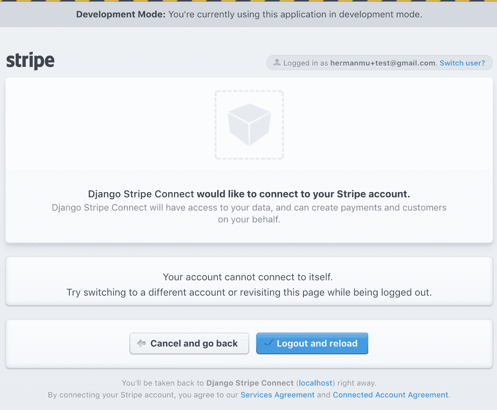

暂时不要做任何事情，因为我们仍然需要设置重定向视图。

### 重定向回来

向 *apps/users/views.py* 添加新视图

```py
`class StripeAuthorizeCallbackView(View):

    def get(self, request):
        code = request.GET.get('code')
        if code:
            data = {
                'client_secret': settings.STRIPE_SECRET_KEY,
                'grant_type': 'authorization_code',
                'client_id': settings.STRIPE_CONNECT_CLIENT_ID,
                'code': code
            }
            url = 'https://connect.stripe.com/oauth/token'
            resp = requests.post(url, params=data)
            print(resp.json())
        url = reverse('home')
        response = redirect(url)
        return response` 
```

连接 Stripe 账户后，用户被[重定向回](https://stripe.com/docs/connect/standard-accounts#redirected)平台，在那里我们将使用提供的授权码[调用](https://stripe.com/docs/connect/standard-accounts#token-request)访问[令牌 URL](https://stripe.com/docs/connect/oauth-reference#post-token) 来获得用户的 Stripe 凭证。

安装请求库:

```py
`$ pipenv install requests==2.21.0` 
```

将导入添加到 *apps/users/views.py* :

将回调 URL 添加到 *apps/users/urls.py*

```py
`from django.urls import path

from .views import StripeAuthorizeView, StripeAuthorizeCallbackView

urlpatterns = [
  path('authorize/', StripeAuthorizeView.as_view(), name='authorize'),
  path('oauth/callback/', StripeAuthorizeCallbackView.as_view(), name='authorize_callback'),
]` 
```

接下来，创建一个用于测试目的的新 Stripe 帐户，您将使用它来[连接到平台帐户](https://stripe.com/docs/connect/standard-accounts#connect-users)。完成后，您可以测试完整的 OAuth 过程:

1.  在匿名或私人浏览器窗口中导航至 [http://localhost:8000/](http://localhost:8000/)
2.  用`[[email protected]](/cdn-cgi/l/email-protection)` / `justatest`登录平台
3.  单击“连接条带帐户”
4.  使用新的条带帐户登录
5.  点击“连接我的 Stripe 账户”按钮，这将把你重新定向到 Django 应用程序

在您的终端中，您应该会看到来自`print(resp.json())`的输出:

```py
`{
  'access_token': 'sk_test_nKM42TMNPm6M3c98U07abQss',
  'livemode': False,
  'refresh_token': 'rt_5QhvTKUgPuFF1EIRsHV4b4DtTxDZgMQiQRvOoMewQptbyfRc',
  'token_type': 'bearer',
  'stripe_publishable_key': 'pk_test_8iD6CpftCZLTp40k1pAl22hp',
  'stripe_user_id': 'acct_i3qMgnSiH35BL8aU',
  'scope': 'read_write'
}` 
```

我们现在可以将`access_token`和`stripe_user_id`添加到`Seller`模型中:

```py
`class StripeAuthorizeCallbackView(View):

    def get(self, request):
        code = request.GET.get('code')
        if code:
            data = {
                'client_secret': settings.STRIPE_SECRET_KEY,
                'grant_type': 'authorization_code',
                'client_id': settings.STRIPE_CONNECT_CLIENT_ID,
                'code': code
            }
            url = 'https://connect.stripe.com/oauth/token'
            resp = requests.post(url, params=data)
            # add stripe info to the seller
            stripe_user_id = resp.json()['stripe_user_id']
            stripe_access_token = resp.json()['access_token']
            seller = Seller.objects.filter(user_id=self.request.user.id).first()
            seller.stripe_access_token = stripe_access_token
            seller.stripe_user_id = stripe_user_id
            seller.save()
        url = reverse('home')
        response = redirect(url)
        return response` 
```

将导入添加到顶部:

```py
`from .models import Seller` 
```

> 您可能还想保存`refresh_token`，以便请求新的`access_token`。

概括地说，在用户连接 Stripe 帐户后，您会获得一个临时授权码，用于请求用户的访问令牌和 id，然后分别用于连接到 Stripe 和代表用户处理支付。

再测试一次。完成后，注销，以超级用户身份重新登录，并验证 Django admin 中的卖家是否已更新:

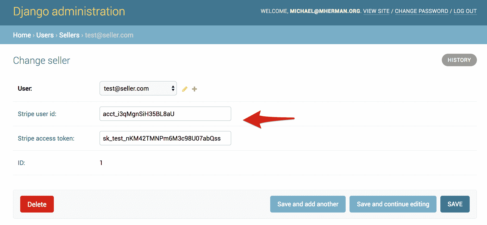

最后，如果用户已经连接了他们的条带帐户，则隐藏主页模板中的“连接条带帐户”按钮:

```py
`
  <a href="" class="button is-info">Connect Stripe Account</a>
` 
```

这样，我们就可以把注意力转向采购方面了。

## 购买课程

首先，你需要决定如何处理这笔费用:

1.  [直接充电](https://stripe.com/docs/connect/direct-charges)
2.  [目的地费用](https://stripe.com/docs/connect/destination-charges)
3.  [分开充电和转移](https://stripe.com/docs/connect/charges-transfers)

在本教程中，我们将研究前两种方法。请记住，账户类型和支付方式决定了负债:

| 账户类型 | 支付方式 | 责任 |
| --- | --- | --- |
| 标准 | 直接的 | 用户 |
| 标准 | 目的地 | 平台 |
| 表达 | 直接的 | 用户 |
| 表达 | 目的地 | 平台 |
| 表达 | 分开收费和转账 | 平台 |
| 习俗 | 直接的 | 用户 |
| 习俗 | 目的地 | 平台 |
| 习俗 | 分开收费和转账 | 平台 |

这也有例外，所以请务必阅读[选择方法](https://stripe.com/docs/connect/charges#choosing-approach)指南，了解这三种方法之间差异的更多信息。

> [TestDriven.io](https://testdriven.io/) 使用目的地收费，因为所有收费和客户都是平台“拥有”的，而不是关联账户。

### 直接的

如果您希望由连接的 Stripe 帐户而不是平台帐户处理付款，请使用直接收费。

在 *apps/courses/views.py* 中更新`CourseChargeView`如下:

```py
`class CourseChargeView(View):

    def post(self, request, *args, **kwargs):
        stripe.api_key = settings.STRIPE_SECRET_KEY
        json_data = json.loads(request.body)
        course = Course.objects.filter(id=json_data['course_id']).first()
        try:
            charge = stripe.Charge.create(
                amount=json_data['amount'],
                currency='usd',
                source=json_data['token'],
                description=json_data['description'],
                stripe_account=course.seller.stripe_user_id,
            )
            if charge:
                return JsonResponse({'status': 'success'}, status=202)
        except stripe.error.StripeError as e:
            return JsonResponse({'status': 'error'}, status=500)` 
```

试试这个。

您是否注意到该费用仅显示在关联帐户的仪表板上？通过直接收费，客户在技术上是从与关联账户相关的企业购买，而不是从平台购买。关联账户负责支付 Stripe 费用以及任何潜在的退款或退款。如果您需要检查费用，您可以从 API 中检索它。

也可以对一个[客户对象](https://stripe.com/docs/sources/customers)收费。想想你想让客户住在哪里——平台账户、关联账户，还是两者兼而有之？

```py
`class CourseChargeView(View):

    def post(self, request, *args, **kwargs):
        stripe.api_key = settings.STRIPE_SECRET_KEY
        json_data = json.loads(request.body)
        course = Course.objects.filter(id=json_data['course_id']).first()
        try:
            customer = stripe.Customer.create(
                email=self.request.user.email,
                source=json_data['token'],
                stripe_account=course.seller.stripe_user_id,
            )
            charge = stripe.Charge.create(
                amount=json_data['amount'],
                currency='usd',
                customer=customer.id,
                description=json_data['description'],
                stripe_account=course.seller.stripe_user_id,
            )
            if charge:
                return JsonResponse({'status': 'success'}, status=202)
        except stripe.error.StripeError as e:
            return JsonResponse({'status': 'error'}, status=500)` 
```

在本例中，在关联帐户上创建客户，然后使用该客户 id 来处理费用。

如果该客户已经存在于关联账户中，该怎么办？

```py
`class CourseChargeView(View):

    def post(self, request, *args, **kwargs):
        stripe.api_key = settings.STRIPE_SECRET_KEY
        json_data = json.loads(request.body)
        course = Course.objects.filter(id=json_data['course_id']).first()
        try:
            customer = get_or_create_customer(
                self.request.user.email,
                json_data['token'],
                course.seller.stripe_access_token,
                course.seller.stripe_user_id,
            )
            charge = stripe.Charge.create(
                amount=json_data['amount'],
                currency='usd',
                customer=customer.id,
                description=json_data['description'],
                stripe_account=course.seller.stripe_user_id,
            )
            if charge:
                return JsonResponse({'status': 'success'}, status=202)
        except stripe.error.StripeError as e:
            return JsonResponse({'status': 'error'}, status=500)

# helpers

def get_or_create_customer(email, token, stripe_access_token, stripe_account):
    stripe.api_key = stripe_access_token
    connected_customers = stripe.Customer.list()
    for customer in connected_customers:
        if customer.email == email:
            print(f'{email} found')
            return customer
    print(f'{email} created')
    return stripe.Customer.create(
        email=email,
        source=token,
        stripe_account=stripe_account,
    )` 
```

测试一下，确保只有在客户对象不存在的情况下才创建它。

如果您想在两个帐户之间“共享”客户，该怎么办？在这种情况下，您可能希望将客户信息存储在平台帐户上，以便在不涉及关联帐户时可以直接向该客户收费，然后在涉及关联帐户时使用相同的客户对象来处理收费。如果没有必要，没有必要创建客户两次。在您的上实现此功能。更多信息请参考[共享客户](https://stripe.com/docs/connect/shared-customers)指南。

在进入下一个方法之前，让我们快速看一下平台如何在每笔交易中[收取便利费](https://stripe.com/docs/connect/direct-charges#collecting-fees):

```py
`class CourseChargeView(View):

    def post(self, request, *args, **kwargs):
        stripe.api_key = settings.STRIPE_SECRET_KEY
        json_data = json.loads(request.body)
        course = Course.objects.filter(id=json_data['course_id']).first()
        fee_percentage = .01 * int(course.fee)
        try:
            customer = get_or_create_customer(
                self.request.user.email,
                json_data['token'],
                course.seller.stripe_access_token,
                course.seller.stripe_user_id,
            )
            charge = stripe.Charge.create(
                amount=json_data['amount'],
                currency='usd',
                customer=customer.id,
                description=json_data['description'],
                application_fee=int(json_data['amount'] * fee_percentage),
                stripe_account=course.seller.stripe_user_id,
            )
            if charge:
                return JsonResponse({'status': 'success'}, status=202)
        except stripe.error.StripeError as e:
            return JsonResponse({'status': 'error'}, status=500)` 
```

现在，在费用处理后，您应该会在平台帐户上看到收取的费用:

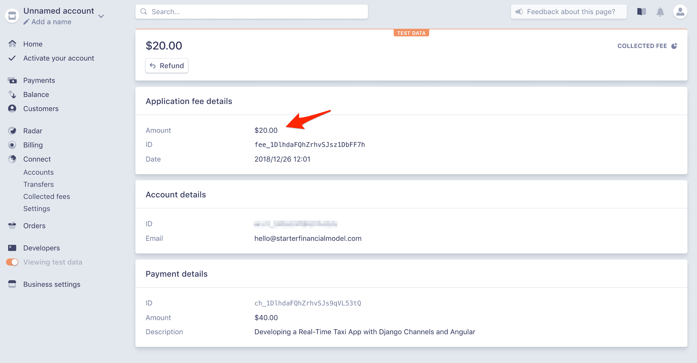

### 目的地

[目的地收费](https://stripe.com/docs/connect/destination-charges)当你(平台)想要维持对客户的所有权时效果最好。通过这种方法，平台帐户向客户收费，并负责支付 Stripe 费用以及任何潜在的退款或退款。

```py
`class CourseChargeView(View):

    def post(self, request, *args, **kwargs):
        stripe.api_key = settings.STRIPE_SECRET_KEY
        json_data = json.loads(request.body)
        course = Course.objects.filter(id=json_data['course_id']).first()
        fee_percentage = .01 * int(course.fee)
        try:
            customer = get_or_create_customer(
                self.request.user.email,
                json_data['token'],
            )
            charge = stripe.Charge.create(
                amount=json_data['amount'],
                currency='usd',
                customer=customer.id,
                description=json_data['description'],
                destination={
                    'amount': int(json_data['amount'] - (json_data['amount'] * fee_percentage)),
                    'account': course.seller.stripe_user_id,
                },
            )
            if charge:
                return JsonResponse({'status': 'success'}, status=202)
        except stripe.error.StripeError as e:
            return JsonResponse({'status': 'error'}, status=500)

# helpers

def get_or_create_customer(email, token):
    stripe.api_key = settings.STRIPE_SECRET_KEY
    connected_customers = stripe.Customer.list()
    for customer in connected_customers:
        if customer.email == email:
            print(f'{email} found')
            return customer
    print(f'{email} created')
    return stripe.Customer.create(
        email=email,
        source=token,
    )` 
```

测试一下。这应该会在平台上创建一个客户和费用。您还应该看到向关联帐户的转账:

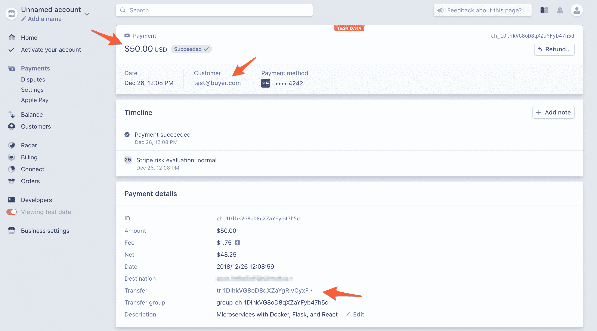

## 结论

本教程将带您完成设置 Stripe Connect 以代表他人安全管理支付的过程。

您现在应该能够:

1.  解释什么是条带连接，以及为什么您可能需要使用它
2.  描述条带连接帐户类型之间的相似性和差异
3.  将 Stripe Connect 集成到现有的 Django 应用程序中
4.  使用类似 Oauth 的流程将 Stripe 帐户链接到 Django 应用程序
5.  解释直接费用和目的地费用的区别

寻找一些挑战？

1.  添加注册表单和用户帐户页面
2.  销售完成后，异步向买方和卖方发送电子邮件
3.  尝试自定义帐户，以便为最终用户提供无缝的条带连接集成
4.  处理订阅
5.  为买方添加销售仪表板页面

你可以在 GitHub 上的[django-stripe-connect](https://github.com/testdrivenio/django-stripe-connect)repo 中找到最终代码。干杯！