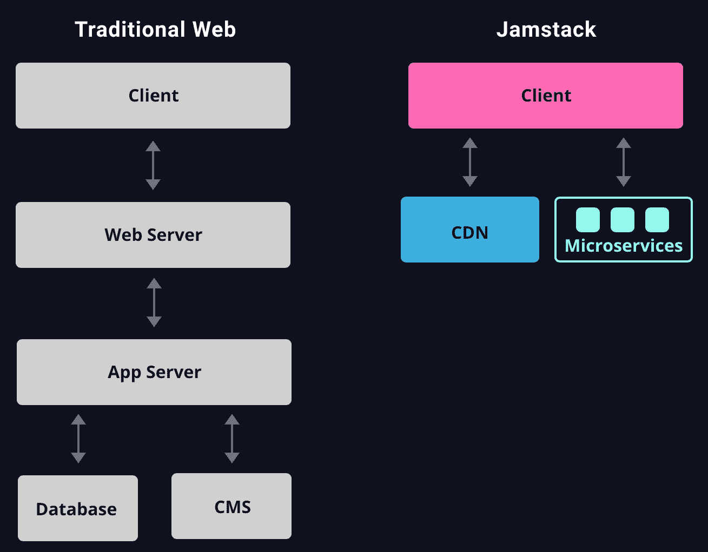
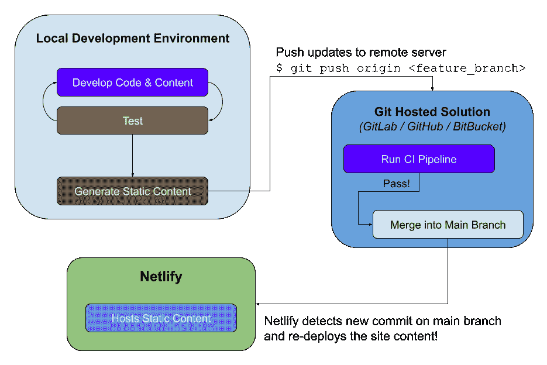
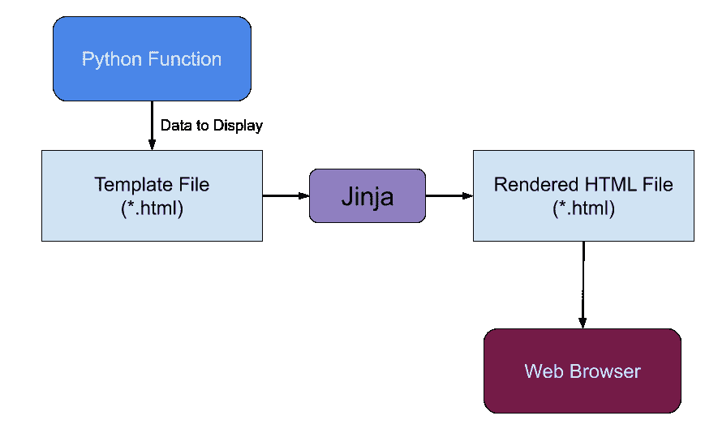
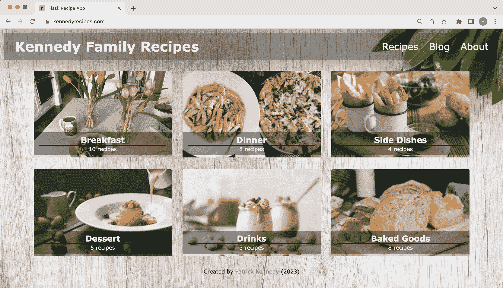
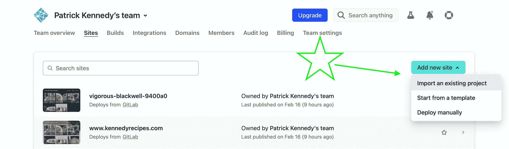
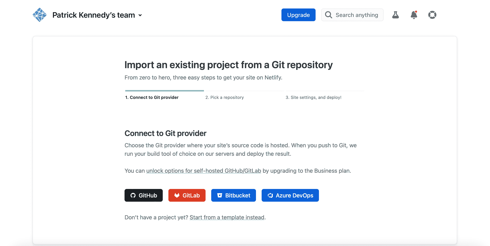
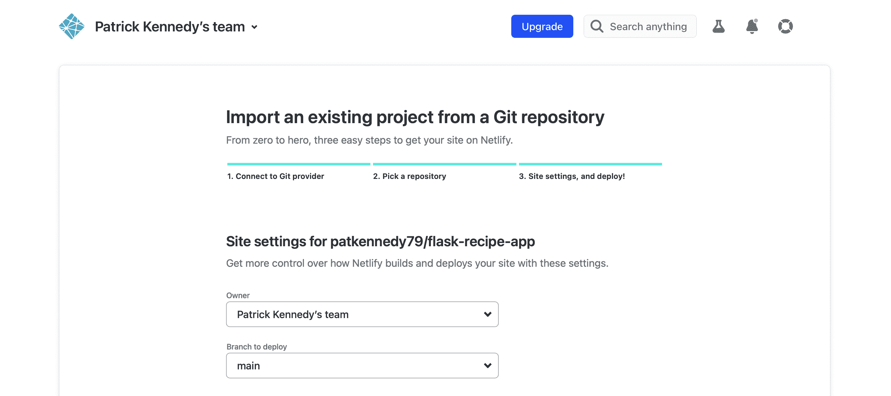
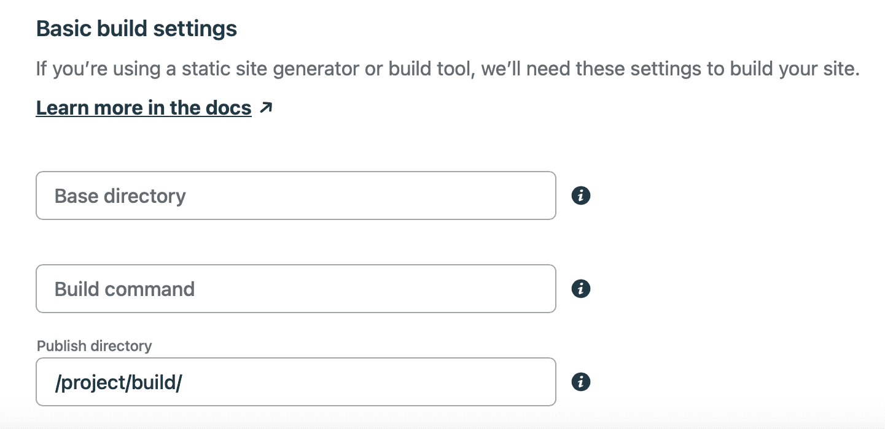
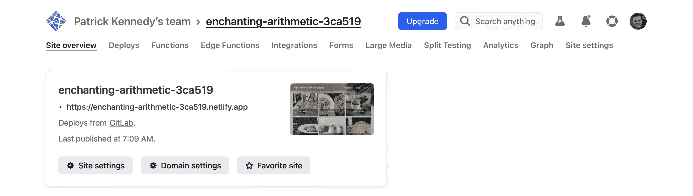

# 使用 Flask 生成静态站点并将其部署到 Netlify

> 原文：<https://testdriven.io/blog/static-site-flask-and-netlify/>

本教程着眼于如何利用 Python 的 [JAMstack](https://jamstack.org/) 和 [Flask](https://flask.palletsprojects.com/en/2.2.x/) 。你将学习如何用 Flask 通过[freeze-Flask](https://pythonhosted.org/Frozen-Flask/)生成一个静态站点，并将其部署到 [Netlify](https://www.netlify.com) 。我们还将看看如何用 [pytest](https://docs.pytest.org/en/stable/) 测试静态站点。

> 本教程假设你有使用 Flask 的经验。如果你有兴趣学习更多关于 Flask 的知识，请查看我的课程，学习如何构建、测试和部署 Flask 应用程序:[用 Python 和 Flask 开发 Web 应用程序](/courses/learn-flask/)。

在本教程中创建的网站可以在:[https://www.kennedyrecipes.com](https://www.kennedyrecipes.com)找到

## 静态与动态网站

静态网站旨在通过为每个用户显示相同的内容来提供信息。与此同时，动态网站提供不同的内容，并通过支持用户互动来实现**功能**。

以下是这些差异的总结:

| 描述 | 静态站点 | 动态网站 |
| --- | --- | --- |
| 向用户显示内容？ | ✅ | ✅ |
| 允许用户交互(表单)？ | ❌ | ✅ |
| 客户端文件(HTML，CSS)？ | ✅ | ✅ |
| 服务器端代码(Python 等。)? | ❌ | ✅ |
| 无服务器托管(Netlify 等。)? | ✅ | ❌ |
| 需要 web 服务器资源？ | ❌ | ✅ |

> “无服务器托管”类别旨在表明静态网站可以使用无服务器解决方案(例如，Netlify、Cloudflare、GitHub Pages 等)轻松部署。).动态网站也可以使用无服务器解决方案(如 AWS Lambda)托管，但这是一个复杂得多的过程。

静态网站为访问网站的每个用户显示相同的固定内容。通常，静态网站是用 HTML、CSS 和 JavaScript 编写的。

另一方面，动态网站可以向每个用户显示不同的内容，并提供用户交互(登录/注销、创建和修改数据库中的项目等)。).动态网站比静态网站复杂得多，因为它们需要服务器端资源和应用程序代码来处理请求。需要维护应用程序代码(崩溃修复、安全更新、语言升级等)。)也是。

**为什么要开发静态网站？**

如果你正在创建一个旨在提供信息的网站，静态网站是一个很好的选择。静态网站比动态网站更容易创建和维护，只要你了解它们的局限性。

### JAMstack

JAMstack 是一个 web 架构，专注于两个关键概念:预渲染内容和解耦服务。

> *   **JAM**——JavaScript、API 和标记
> *   **栈** -技术层

预呈现内容意味着前端内容(HTML、CSS、JavaScript 和其他静态文件)被构建到静态站点中。这个过程的优点是静态内容可以从一个 [CDN](https://en.wikipedia.org/wiki/Content_delivery_network) (内容交付网络)快速提供给网络浏览器。

> 在本教程中，我们将使用 Netlify 来部署静态站点。多亏了广泛的 CDN，Netlify 能以闪电般的速度为网站提供服务。

分离服务意味着利用提供服务和产品的令人难以置信的 API 集。API 可用于:

1.  认证和授权( [Okta](https://www.okta.com/) )
2.  支付([条纹](https://stripe.com/))
3.  表单([表单狂欢](https://formspree.io/))
4.  搜索( [Algolia](https://www.algolia.com/) )
5.  注释( [Disqus](https://disqus.com/) )

> 更多 API 服务，请查看[令人敬畏的静态网站服务](https://github.com/agarrharr/awesome-static-website-services)。

与传统的 web 应用相比，JAMstack 应用的层数更少:



> 来源:JAMstack.org

使用 JAMstack(相对于传统方法)的一个关键原因是尽可能“无服务器”,依靠托管解决方案(Netlify)和外部服务(API)。

JAMstack 是建筑的绝佳架构选择:

1.  依赖外部服务(API)的客户端应用
2.  为用户提供信息的静态站点

当构建侧重于服务器端应用的数据库驱动的应用时，传统的 web 应用是一个很好的方法。

### 可供选择的事物

**内容管理系统(CMS)解决方案**

CMS 解决方案用于管理和部署网站。WordPress 是最流行的 CMS 工具，很多产品都是使用 WordPress 开发的。

如今，建立网站有很多复杂的选择，包括:

1.  [WordPress](https://wordpress.com)
2.  [Wix](https://www.wix.com)
3.  [平方空间](https://www.squarespace.com)
4.  [蓝主机](https://www.bluehost.com)
5.  [GoDaddy](https://www.godaddy.com)
6.  [Weebly](https://www.weebly.com)
7.  [Netlify CMS](https://www.netlifycms.org)
8.  [鹞鹰](https://wagtail.io/)

这些选项中的大部分都允许在不编写任何代码的情况下创建网站。这些选项是快速开发显示内容的网站(如博客)的绝佳选择。

> 我目前正在使用 WordPress 创建我的个人博客网站:[https://www.patricksoftwareblog.com](https://www.patricksoftwareblog.com)。

Lektor 是一个流行的用 Python 编写的 CMS 解决方案，尽管它也有很多静态站点生成器的特性。

> 莱克特是由阿明·罗纳彻创造的，他也是烧瓶的创造者！

**静态现场发电机**

静态站点生成器通过解析用 markdown 语言(通常是 [Markdown](https://en.wikipedia.org/wiki/Markdown) 或 [reStructuredText](https://en.wikipedia.org/wiki/ReStructuredText) )创建的内容，创建静态文件(HTML、CSS 和 JavaScript)来发布网站。

杰基尔、[十一](https://www.11ty.dev/)、[盖茨比](https://www.gatsbyjs.com/)和[雨果](https://gohugo.io/)是最受欢迎的静态站点生成器。

还有几个基于 Python 的选项。

Pelican 是用 Python 编写的最流行的静态站点生成器之一。它有一些强大的功能:

1.  内容是用 Markdown 或 reStructuredText 编写的
2.  用于生成静态内容的 CLI(命令行界面)工具
3.  快速开发网页的主题
4.  以多种语言出版

带有[冷冻瓶](https://pythonhosted.org/Frozen-Flask/)的瓶子(我们将在本教程中使用)也可以被认为是一个静态站点生成器。这种方法的优点是能够利用 Flask 的现有开发过程来开发静态站点。此外，在使用 Flask 和 freeze-Flask 时，**测试**静态站点的能力是一个很大的优势，因为在开发静态站点时测试经常被忽略。

> 本教程中的方法不是“纯”静态站点生成器，因为内容是在 HTML 文件中创建的。为了使这种方法成为“纯”静态站点生成器，您可以利用 [Flask-FlatPages](https://flask-flatpages.readthedocs.io/en/latest/) 在 Markdown 中创建内容。

如果你更熟悉 Django，[Django-distilt](https://github.com/meeb/django-distill)是 Django 应用程序的静态站点生成器。

## 为什么对静态站点使用 Flask？

如果您已经习惯使用 Python 和 Flask 开发应用程序，那么您可以继续使用相同的工具和工作流来开发静态站点。换句话说，没有必要学习任何新的工具或语言。

使用 Flask，您可以继续使用以下工具和流程:

1.  用于生成 HTML 代码的 Jinja 模板(包括模板继承)
2.  组织项目的蓝图
3.  进行更改时，开发服务器可以热重装(不需要任何复杂的编译步骤)
4.  使用 pytest 进行测试

此外，如果您决定在未来将您的网站扩展为一个需要后端数据库的完整 web 应用程序，因为您是从 Flask 开始的，所以您不需要重新编写应用程序。你只需要:

1.  移除冷冻烧瓶
2.  与数据库接口
3.  [部署以呈现](/blog/flask-render-deployment/)(或类似的托管解决方案)

## 工作流程

下图说明了使用 Flask 开发静态站点并将其部署到 Netlify 的典型工作流:



让我们深入了解这个工作流程的细节...

## 烧瓶项目

虽然这个 Flask 项目将生成静态文件，但它仍然使用 Flask 应用程序的最佳实践:

1.  [应用工厂](https://flask.palletsprojects.com/en/2.2.x/patterns/appfactories/)
2.  [蓝图](https://flask.palletsprojects.com/en/2.2.x/blueprints/)
3.  [金贾模板](https://flask.palletsprojects.com/en/2.2.x/templating/)
4.  [测试](/blog/flask-pytest/)(使用 [pytest](https://docs.pytest.org/en/stable/)

另外，[冻瓶](https://pythonhosted.org/Frozen-Flask/)包用于生成静态内容。

> 本教程中创建的项目的源代码可以在 GitLab 上找到: [Flask Recipe App](https://gitlab.com/patkennedy79/flask-recipe-app) 。

### 项目结构

项目的文件夹结构是 Flask 项目的典型结构:

```py
`├── project
│   ├── build           # Static files are created here by Frozen-Flask!
│   ├── blog            # Blueprint for blog posts
│   │   └── templates   # Templates specific to the blog blueprint
│   ├── recipes         # Blueprint for recipes
│   │   └── templates   # Templates specific to the recipes blueprint
│   ├── static
│   │   ├── css         # CSS files for styling the pages
│   │   └── img         # Images displayed in recipes and blog posts
│   └── templates       # Base templates
├── tests
│   └── functional      # Test files
└── venv` 
```

要突出显示的关键文件夹是“project/build”文件夹，它将由带有静态文件的 freeze-Flask 包生成。

首先，从[这个](https://gitlab.com/patkennedy79/flask-recipe-app) GitLab 仓库中下载源代码:

```py
`$ git clone https://gitlab.com/patkennedy79/flask-recipe-app.git` 
```

创建新的虚拟环境:

```py
`$ cd flask-recipe-app
$ python3 -m venv venv` 
```

激活虚拟环境:

```py
`$ source venv/bin/activate` 
```

安装 requirements.txt 中指定的 Python 包:

```py
`(venv)$ pip install -r requirements.txt` 
```

> 你可以随意把 virtualenv 和 pip 换成诗歌[或](https://python-poetry.org) [Pipenv](https://github.com/pypa/pipenv) 。更多信息，请查看[现代 Python 环境](/blog/python-environments/)。

### 配方路线

在`recipes`蓝图中定义了网站上显示的配方路线。

> 蓝图允许你干净地将你的 Flask 项目的源代码组织成不同的组件。每个蓝图都应该封装应用程序中的重要功能。

例如，使用以下变量和视图函数在*project/recipes/routes . py*中定义早餐食谱:

```py
`from . import recipes_blueprint
from flask import render_template, abort

breakfast_recipes_names = ['pancakes', 'acai_bowl', 'honey_bran_muffins', 'breakfast_scramble',
                           'pumpkin_donuts', 'waffles', 'omelette']

@recipes_blueprint.route('/breakfast/')
def breakfast_recipes():
   return render_template('recipes/breakfast.html')

@recipes_blueprint.route('/breakfast/<recipe_name>/')
def breakfast_recipe(recipe_name):
   if recipe_name not in breakfast_recipes_names:
       abort(404)

   return render_template(f'recipes/{recipe_name}.html')` 
```

`breakfast_recipes()`视图功能呈现显示所有早餐食谱的模板。

`breakfast_recipe(recipe_name)`视图功能呈现指定的早餐食谱。如果指定了无效的配方标题，则返回 404(未找到)错误。

这一组相同的查看功能用于每种配方类型:

*   早餐
*   主餐
*   正菜外的附加菜
*   甜点
*   八面玲珑的男人/果汁
*   烘焙食品

### Jinja 模板

Flask 附带了开箱即用的 [Jinja](https://flask.palletsprojects.com/en/2.2.x/templating/) 模板引擎，我们将使用它来生成我们的 HTML 文件。

模板文件包含变量和/或表达式，当模板被*渲染*时，这些变量和/或表达式被替换为值:



模板继承允许模板文件继承其他模板。您可以创建一个基础模板来定义网站的布局。由于子模板将使用这种布局，它们可以只关注内容。

基础模板在*project/templates/base . html*中定义:

```py
`<!DOCTYPE html>
<html lang="en">
    <head>
        <!-- Required meta tags -->
        <meta charset="utf-8">
        <meta name="viewport" content="width=device-width, initial-scale=1, shrink-to-fit=no">
        <title>Flask Recipe App</title>

        <!-- Local CSS file for styling the application-->
        <link rel="stylesheet" href="{{ url_for('static', filename='css/base_style.css') }}">
        <link rel="shortcut icon" href="{{ url_for('static', filename='img/favicon.ico') }}" type="image/x-icon">

        <!-- Additional Styling -->
        
        
    </head>

    <body>
        <header>
            <h1>Kennedy Family Recipes</h1>
            <nav>
                <ul>
                    <li class="nav__item"><a href="{{ url_for('recipes.recipes') }}" class="nav__link">Recipes</a></li>
                    <li class="nav__item"><a href="{{ url_for('blog.blog') }}" class="nav__link">Blog</a></li>
                    <li class="nav__item"><a href="{{ url_for('blog.about') }}" class="nav__link">About</a></li>
                </ul>
            </nav>
        </header>

        <main class="content">
            <!-- child template -->
            
            
        </main>

        <footer>
            <p>Created by <a href="https://www.patricksoftwareblog.com/">Patrick Kennedy</a> (2023)</p>
        </footer>
    </body>
</html>` 
```

基础模板定义了导航栏(`<header>`标签)和页脚(`<footer>`标签)。要显示的内容在`<main>`标签中指定，但是该内容应该由子模板填充。

例如，用于显示早餐食谱列表的模板(在*project/recipes/templates/recipes/breakfast . html*中定义)在基础模板上展开，以显示所有的早餐食谱:

```py
`


<div class="recipe-container">

    <div class="card">
        <a href="{{ url_for('recipes.breakfast_recipe', recipe_name='pancakes') }}">
            
            <div class="card__body">
                <h2>Pancakes</h2>
                <p class="recipe-badge dairy-free-badge">Dairy-Free</p>
                <p class="recipe-badge soy-free-badge">Soy-Free</p>
            </div>
        </a>
    </div>

    <div class="card">
        <a href="{{ url_for('recipes.breakfast_recipe', recipe_name='honey_bran_muffins') }}">
            
            <div class="card__body">
                <h2>Honey Bran Muffins</h2>
                <p class="recipe-badge dairy-free-badge">Dairy-Free</p>
                <p class="recipe-badge soy-free-badge">Soy-Free</p>
            </div>
        </a>
    </div>

    ...
</div>
` 
```

### 测试

pytest 是 Python 的一个测试框架，用于编写、组织和运行测试用例。在建立了基本的测试结构之后，pytest 使得编写测试变得容易，并且为运行测试提供了很大的灵活性。

测试文件在*测试/功能/* 目录中指定。例如，早餐食谱的测试在*tests/functional/test _ recipes . py*中指定:

```py
`"""
This file (test_recipes.py) contains the functional tests for the `recipes` blueprint.
"""
from project.recipes.routes import breakfast_recipes_names

def test_get_breakfast_recipes(test_client):
    """
 GIVEN a Flask application configured for testing
 WHEN the '/breakfast/' page is requested (GET)
 THEN check the response is valid
 """
    recipes = [b'Pancakes', b'Honey Bran Muffins', b'Acai Bowl',
               b'Breakfast Scramble', b'Pumpkin Donuts', b'Waffles',
               b'Omelette']
    response = test_client.get('/breakfast/')
    assert response.status_code == 200
    for recipe in recipes:
        assert recipe in response.data

def test_get_individual_breakfast_recipes(test_client):
    """
 GIVEN a Flask application configured for testing
 WHEN the '/breakfast/<recipe_name>' page is requested (GET)
 THEN check the response is valid
 """
    for recipe_name in breakfast_recipes_names:
        response = test_client.get(f'/breakfast/{recipe_name}/')
        assert response.status_code == 200
        assert str.encode(recipe_name) in response.data` 
```

这些是高层次的检查，以确保预期的页面正确呈现。

这些测试功能中的每一个都使用在*测试/conftest.py* 中定义的`test_client`夹具:

```py
`import pytest
from project import create_app

@pytest.fixture(scope='module')
def test_client():
    flask_app = create_app()

    # Create a test client using the Flask application configured for testing
    with flask_app.test_client() as testing_client:
        yield testing_client  # this is where the testing happens!` 
```

测试应该从顶级目录运行:

他们应该通过:

```py
`================================ test session starts =================================
platform darwin -- Python 3.11.0, pytest-7.2.1, pluggy-1.0.0
plugins: cov-4.0.0
collected 18 items

tests/functional/test_blog.py ....                                               [22%]
tests/functional/test_recipes.py ..............                                 [100%]
================================ 18 passed in 0.33s ==================================` 
```

## 冷冻烧瓶

到目前为止，Flask 应用程序看起来像一个典型的 web 应用程序。这就是[冷冻瓶](https://pythonhosted.org/Frozen-Flask/)发挥作用的地方。我们可以自动生成静态文件和 URL。

回想一下到目前为止的项目。我们为什么需要创建 URL？

1.  在*项目/静态*中找到静态文件
2.  在*项目/recipes/routes.py 中找到的路线*

freeze-Flask 将自动生成静态文件的所有 URL。例如:

1.  `static/css/base_style.css`
2.  `static/img/acai_bowl.jpg`

记下*项目/配方/路线. py* :

```py
`@recipes_blueprint.route('/')
def recipes():
    return render_template('recipes/recipes.html')

@recipes_blueprint.route('/breakfast/')
def breakfast_recipes():
    return render_template('recipes/breakfast.html')

@recipes_blueprint.route('/breakfast/<recipe_name>/')
def breakfast_recipe(recipe_name):
    if recipe_name not in breakfast_recipe_names:
        abort(404)

    return render_template(f'recipes/{recipe_name}.html')` 
```

freezed-Flask 将自动为 GET routes 生成 URL，URL 中没有可变部分。在我们的例子中，它将为`/`和`/breakfast/`生成 URL。

`'/breakfast/<recipe_name>/`怎么样？来自`url_for()`的任何链接也将被发现，这应该涵盖一切。

> 例如，*breakfast.html*模板包含每种早餐食谱的`url_for()`调用。

### 发展

在开发过程中，我们希望能够在本地计算机上测试路线，就像任何 Flask 应用程序一样。

*app.py* 文件用于运行 Flask 开发服务器:

```py
`from flask_frozen import Freezer
from project import create_app

# Call the application factory function to construct a Flask application
# instance using the development configuration
app = create_app()

# Create an instance of Freezer for generating the static files from
# the Flask application routes ('/', '/breakfast', etc.)
freezer = Freezer(app)

if __name__ == '__main__':
    # Run the development server that generates the static files
    # using Frozen-Flask
    freezer.run(debug=True)` 
```

该文件首先调用应用程序工厂函数，创建 Flask 应用程序。接下来，创建一个`Freezer`(来自 freeze-Flask)实例。最后，运行来自 freeze-Flask 的开发服务器:

启动开发服务器就像任何其他 Flask 应用程序一样:

```py
`(venv)$ flask --app app --debug run` 
```

现在您可以导航到 [http://127.0.0.1:5000/](http://127.0.0.1:5000/) :



### 构建脚本

一旦您准备好部署静态文件，您需要**构建**文件来生成包含应用程序内容的静态文件。顶层文件夹中的 *build.py* 脚本运行 Freezer-Flask 生成静态文件:

```py
`from flask_frozen import Freezer
from project import create_app

# Call the application factory function to construct a Flask application
# instance using the development configuration
app = create_app()

# Create an instance of Freezer for generating the static files from
# the Flask application routes ('/', '/breakfast', etc.)
freezer = Freezer(app)

if __name__ == '__main__':
    # Generate the static files using Frozen-Flask
    freezer.freeze()` 
```

运行脚本:

该脚本基于 Flask 应用程序中的路径生成所有静态文件，并将它们写入“项目/构建”文件夹:

```py
`(venv)$ tree -L 3 project/build
project/build
├── breakfast
│   ├── acai_bowl
│   │   └── index.html
│   ├── breakfast_scramble
│   │   └── index.html
│   ├── index.html
│   └── waffles
│       └── index.html
├── index.html
└── static
    ├── css
    │   ├── base_style.css
    │   └── recipe_style.css
    └── img` 
```

这个文件夹就是我们要部署到 Netlify 的！

## 部署到网络

### 什么是 Netlify？

[Netlify](https://www.netlify.com) 是一项简化托管前端 web 应用的服务。

Netlify 提供前端 web 应用程序的免费托管，他们还提供为您的应用程序购买自定义域名的能力。我特别喜欢他们的服务，因为他们为 HTTPS 提供所有的托管解决方案。

在我们进入这些步骤之前，您需要确保在 Netlify 上创建一个帐户。前往[https://www.netlify.com](https://www.netlify.com)，点击“注册”创建一个新账户(这是免费的，不需要信用卡)。

> Netlify 的一些替代方案有: [Cloudflare](https://www.cloudflare.com) ， [GitHub Pages](https://pages.github.com) ，is[GitLab Pages](https://docs.gitlab.com/ee/user/project/pages/)。

### 安装ˌ使成形

登录 Netlify 后，转到您的帐户页面，点击“添加新网站”，然后点击“导入现有项目”:



现在，您可以选择 git 托管解决方案(GitLab、GitHub、BitBucket、Azure DevOps)来存储您的 git 存储库:



如果您以前没有将 Netlify 连接到您的 git 托管服务，将有一个额外的步骤允许 Netlify 访问您的 git 存储库。接下来，选择您想要托管的 git 存储库。

现在，您可以选择谁是项目的所有者，以及您希望从哪个分支部署构建(我选择“main”分支，因为这是我为这个项目构建的稳定分支):



> 如果您对将 git 存储库中的默认分支从`master`更改为`main`的步骤感兴趣，请参考这篇非常有用的博文:[将您的 Git 默认分支从 master 重命名为 main(带有 GitLab 截图)](https://boleary.dev/blog/2020-06-11-change-your-default-branch.html)。

继续向下滚动，您现在可以选择运行哪个命令来构建您的应用程序，以及应该从哪里部署代码:



由于部署了一组静态文件(HTML、CSS、JavaScript ),因此只需将“发布目录”指定为静态文件组的路径: */project/build/*

使用此配置集，单击“部署站点”按钮。

Netlify 需要一些时间(< 1 分钟)来部署站点:



您应该会看到该站点的预览，并确认该站点已部署。

点击链接(如[https://enchanting-arithmetic-3ca519.netlify.app/](https://enchanting-arithmetic-3ca519.netlify.app/))查看网站！

现在，您可以从任何连接到互联网的设备上查看该 web 应用程序！


### 工作流程

与许多流程一样，配置步骤有点复杂，但现在 Netlify 会注意到您的存储库(在 GitLab、GitHub 或 BitBucket 上)的“主”分支上的任何新提交，并使用新提交重新部署您的网站。请记住:Netlify 将发布“项目/构建”文件夹中的文件，因此请确保在提交更改之前始终构建静态站点:

回顾一下，下图说明了使用 Flask 开发静态站点并将其部署到 Netlify 的典型工作流:


### Netlify 的其他功能

Netlify 还提供了几个工具，用于向应用程序添加类似服务器的功能，而实际上并不需要服务器端的应用程序。例如:

1.  [网络功能](https://www.netlify.com/products/functions/)
2.  [网络生活形式](https://docs.netlify.com/forms/setup/)

## 结论

本教程展示了如何创建一个 Flask 应用程序，然后使用 freeze-Flask 为所有指定的路由生成静态文件。然后静态文件被发布到 Netlify 以部署静态站点。

如果您熟悉 Flask 应用程序的开发，那么这个过程是开发可以轻松部署到 web 上的静态站点的好方法。

> 如果你有兴趣学习更多关于 Flask 的知识，请查看我的课程，学习如何构建、测试和部署 Flask 应用程序:[用 Python 和 Flask 开发 Web 应用程序](/courses/learn-flask/)。