# 在亚马逊 S3 上存储 Django 静态和媒体文件

> 原文：<https://testdriven.io/blog/storing-django-static-and-media-files-on-amazon-s3/>

亚马逊的[简单存储系统](https://aws.amazon.com/s3/) (S3)提供了一种简单、经济的方式来存储静态文件。本教程展示了如何配置 Django，通过一个亚马逊 S3 桶来加载和提供静态的和用户上传的媒体文件，公共的和私有的。

*主要依赖关系*:

1.  django 4 . 1 . 5 版
2.  文档 v20.10.22
3.  python 3 . 11 . 1 版

> 更喜欢使用数字海洋空间？查看在数字海洋空间上存储 Django 静态和媒体文件的[。](/blog/django-digitalocean-spaces/)

## S3 水桶

开始之前，你需要一个 [AWS](https://docs.aws.amazon.com/ses/latest/DeveloperGuide/sign-up-for-aws.html) 账户。如果你是 AWS 新手，亚马逊提供了一个带有 5GB S3 存储的[免费层](https://aws.amazon.com/free/)。

要创建一个 [S3 存储桶](https://docs.aws.amazon.com/AmazonS3/latest/dev/UsingBucket.html)，导航到 [S3 页面](https://console.aws.amazon.com/s3)并点击“创建存储桶”:

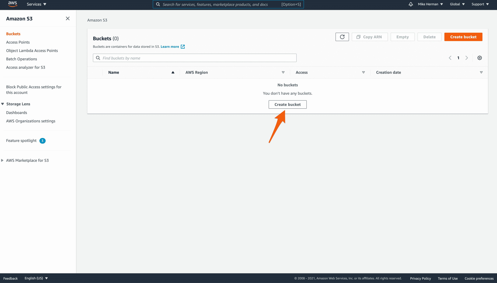

给 bucket 起一个[唯一的、符合 DNS 的名字](https://docs.aws.amazon.com/AmazonS3/latest/dev/BucketRestrictions.html)，并选择一个[地区](https://docs.aws.amazon.com/general/latest/gr/rande.html#s3_region):

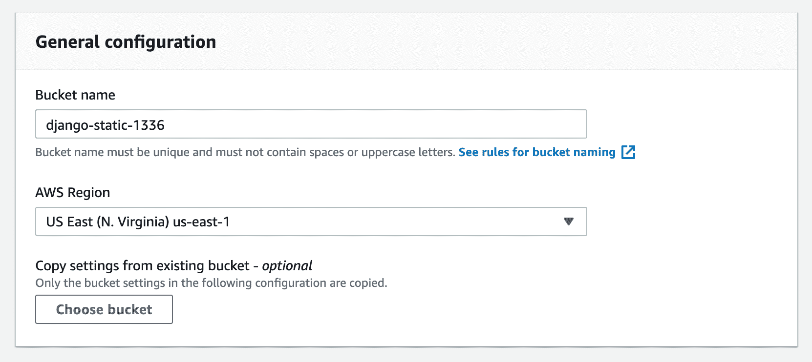

在“对象所有权”下，选择“启用 ACL”。

关闭“阻止所有公共访问”:

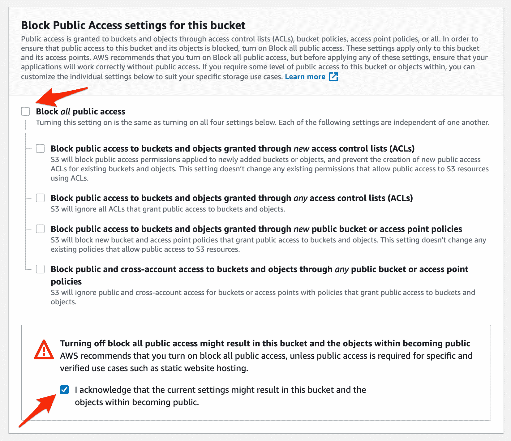

创建存储桶。现在，您应该可以在 S3 主页上看到您的存储桶了:

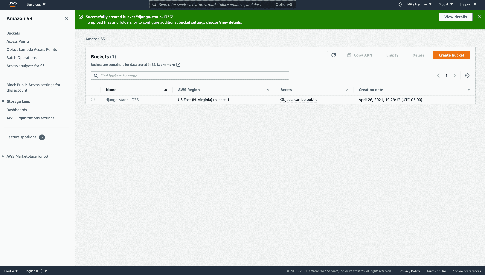

## IAM 访问

尽管您可以使用 AWS root 用户，但出于安全考虑，最好创建一个 IAM 用户，该用户只能访问 S3 或特定的 S3 存储桶。此外，通过建立一个组，分配(和删除)对 bucket 的访问变得更加容易。因此，我们将首先建立一个具有有限[权限](https://docs.aws.amazon.com/AmazonS3/latest/dev/s3-access-control.html)的组，然后创建一个用户并将该用户分配到该组。

### IAM 集团

在 [AWS 控制台](https://console.aws.amazon.com/)中，导航至主 [IAM 页面](https://console.aws.amazon.com/iamv2/home)，点击侧边栏上的“用户组”。然后，单击“创建组”按钮。为该组提供一个名称，然后搜索并选择内置策略“AmazonS3FullAccess”:

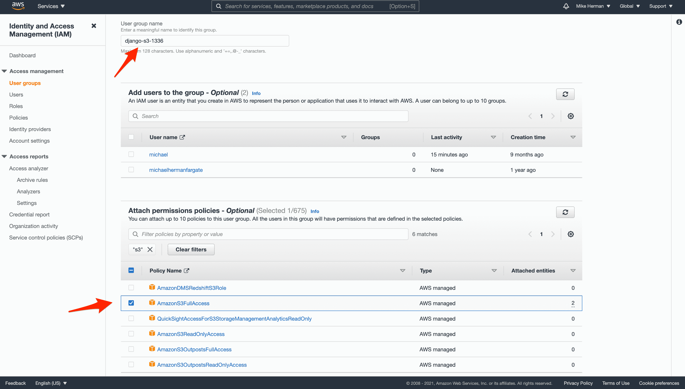

点击“创建群组”完成群组设置:

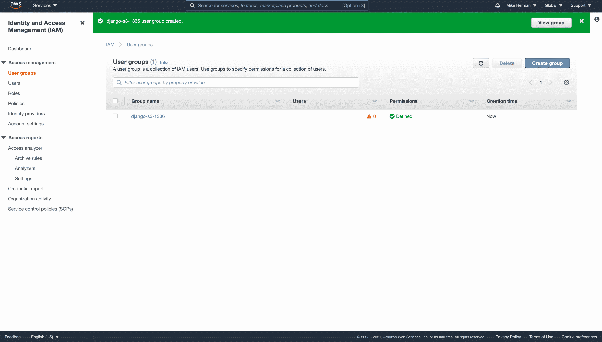

> 如果您想对我们刚刚创建的特定存储桶进一步限制访问，请创建一个具有以下权限的新策略:
> 
> ```
> {
>     "Version": "2012-10-17",
>     "Statement": [
>         {
>             "Effect": "Allow",
>             "Action": "s3:*",
>             "Resource": [
>                 "arn:aws:s3:::your-bucket-name",
>                 "arn:aws:s3:::your-bucket-name/*"
>             ]
>         }
>     ]
> } 
> ```
> 
> 一定要用实际名称替换`your-bucket-name`。然后，从组中分离“AmazonS3FullAccess”策略，并附加新策略。

### IAM 用户

回到主 [IAM 页面](https://console.aws.amazon.com/iamv2/home)，点击“用户”，然后点击“添加用户”。定义用户名，然后单击“下一步”按钮。

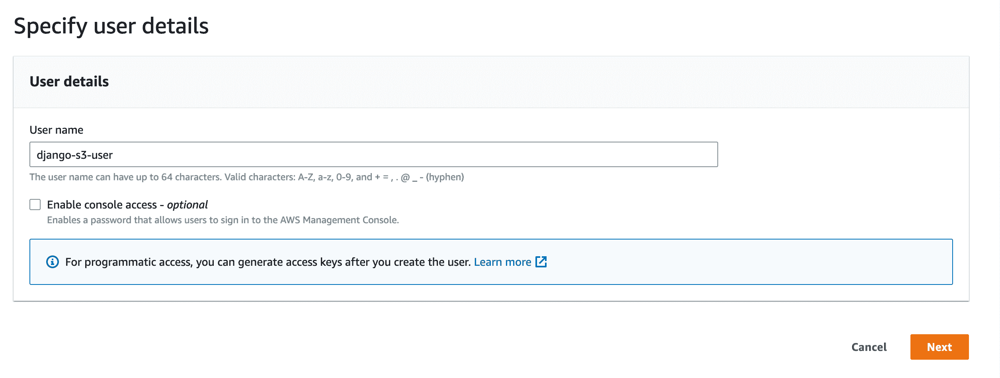

在“权限”步骤中，选择我们刚刚创建的组:

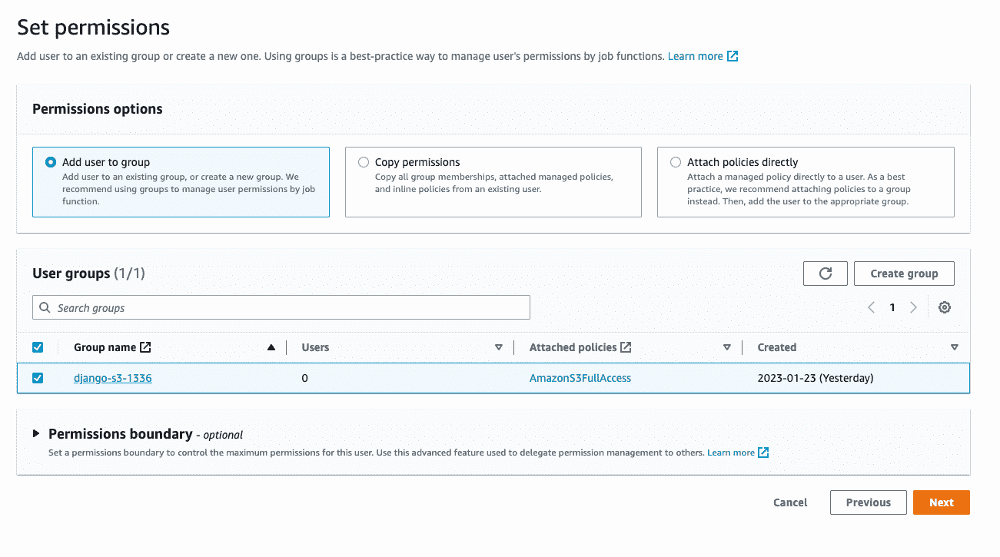

单击“创建用户”创建新用户。

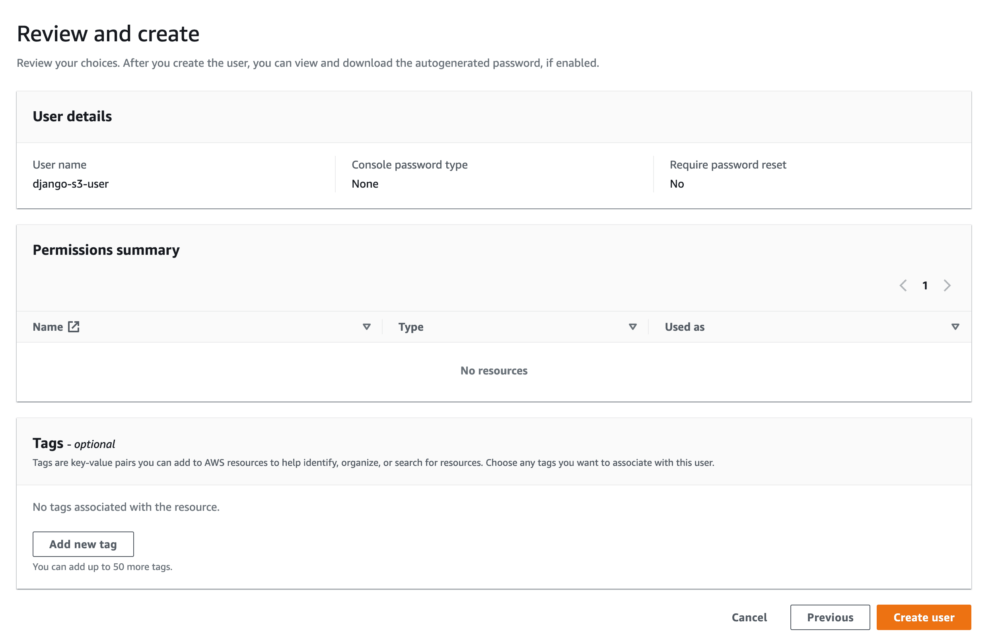

现在，单击用户名查看用户详细信息。单击“安全凭证”选项卡，然后单击“创建访问密钥”。选择“本地代码”并单击下一步按钮。

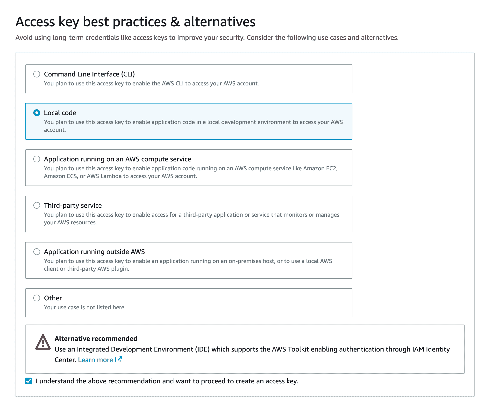

之后，点击“创建访问密钥”按钮并记下密钥。

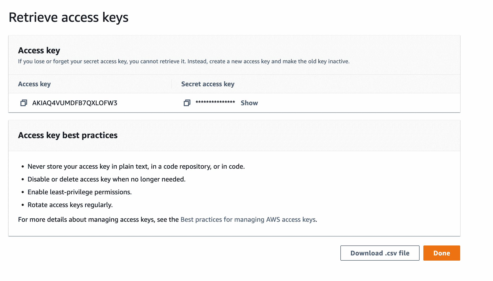

## Django 项目

克隆下 [django-docker-s3](https://github.com/testdrivenio/django-docker-s3) repo，然后检查[基地](https://github.com/testdrivenio/django-docker-s3/tree/base)分支:

```
`$ git clone https://github.com/testdrivenio/django-docker-s3 --branch base --single-branch
$ cd django-docker-s3` 
```

从项目根目录，创建映像并启动 Docker 容器:

```
`$ docker-compose up -d --build` 
```

构建完成后，收集静态文件:

```
`$ docker-compose exec web python manage.py collectstatic` 
```

然后，导航到 [http://localhost:1337](http://localhost:1337) :


您应该能够上传一张图片，然后在[http://localhost:1337/media files/IMAGE _ FILE _ NAME](http://localhost:1337/mediafiles/IMAGE_FILE_NAME)查看该图片。

> 公共与私有的单选按钮不起作用。我们将在本教程的后面添加这个功能。暂时忽略它们。

在继续之前，快速浏览一下项目结构:

```
`├── .gitignore
├── LICENSE
├── README.md
├── app
│   ├── Dockerfile
│   ├── hello_django
│   │   ├── __init__.py
│   │   ├── asgi.py
│   │   ├── settings.py
│   │   ├── urls.py
│   │   └── wsgi.py
│   ├── manage.py
│   ├── mediafiles
│   ├── requirements.txt
│   ├── static
│   │   └── bulma.min.css
│   ├── staticfiles
│   └── upload
│       ├── __init__.py
│       ├── admin.py
│       ├── apps.py
│       ├── migrations
│       │   └── __init__.py
│       ├── models.py
│       ├── templates
│       │   └── upload.html
│       ├── tests.py
│       └── views.py
├── docker-compose.yml
└── nginx
    ├── Dockerfile
    └── nginx.conf` 
```

> 想学习如何构建这个项目吗？查看关于 Django 与 Postgres、Gunicorn 和 Nginx 的文章。

## Django 仓库

接下来，安装[django-stores](https://django-storages.readthedocs.io)，使用 S3 作为主要的 Django 存储后端，以及 [boto3](https://boto3.readthedocs.io/) ，与 AWS API 交互。

更新需求文件:

```
`boto3==1.26.59
Django==4.1.5
django-storages==1.13.2
gunicorn==20.1.0` 
```

将`storages`添加到*设置. py* 中的`INSTALLED_APPS`中:

```
`INSTALLED_APPS = [
    'django.contrib.admin',
    'django.contrib.auth',
    'django.contrib.contenttypes',
    'django.contrib.sessions',
    'django.contrib.messages',
    'django.contrib.staticfiles',
    'upload',
    'storages',
]` 
```

更新图像并旋转新容器:

```
`$ docker-compose up -d --build` 
```

## 静态文件

接下来，我们需要更新对 *settings.py* 中静态文件的处理:

```
`STATIC_URL = '/staticfiles/'
STATIC_ROOT = os.path.join(BASE_DIR, 'staticfiles')
STATICFILES_DIRS = (os.path.join(BASE_DIR, 'static'),)

MEDIA_URL = '/mediafiles/'
MEDIA_ROOT = os.path.join(BASE_DIR, 'mediafiles')` 
```

用以下内容替换这些设置:

```
`USE_S3 = os.getenv('USE_S3') == 'TRUE'

if USE_S3:
    # aws settings
    AWS_ACCESS_KEY_ID = os.getenv('AWS_ACCESS_KEY_ID')
    AWS_SECRET_ACCESS_KEY = os.getenv('AWS_SECRET_ACCESS_KEY')
    AWS_STORAGE_BUCKET_NAME = os.getenv('AWS_STORAGE_BUCKET_NAME')
    AWS_DEFAULT_ACL = 'public-read'
    AWS_S3_CUSTOM_DOMAIN = f'{AWS_STORAGE_BUCKET_NAME}.s3.amazonaws.com'
    AWS_S3_OBJECT_PARAMETERS = {'CacheControl': 'max-age=86400'}
    # s3 static settings
    AWS_LOCATION = 'static'
    STATIC_URL = f'https://{AWS_S3_CUSTOM_DOMAIN}/{AWS_LOCATION}/'
    STATICFILES_STORAGE = 'storages.backends.s3boto3.S3Boto3Storage'
else:
    STATIC_URL = '/staticfiles/'
    STATIC_ROOT = os.path.join(BASE_DIR, 'staticfiles')

STATICFILES_DIRS = (os.path.join(BASE_DIR, 'static'),)

MEDIA_URL = '/mediafiles/'
MEDIA_ROOT = os.path.join(BASE_DIR, 'mediafiles')` 
```

注意`USE_S3`和`STATICFILES_STORAGE`:

1.  `USE_S3`环境变量用于打开(值为`TRUE`)和关闭(值为`FALSE`)S3 存储。因此，您可以配置两个 Docker 合成文件:一个用于关闭 S3 的开发，另一个用于打开 S3 的生产。
2.  `STATICFILES_STORAGE` [设置](https://django-storages.readthedocs.io/en/latest/backends/amazon-S3.html?highlight=STATICFILES_STORAGE)配置 Django 在运行`collectstatic`命令时自动将静态文件添加到 S3 桶中。

> 查看官方 django-storages 文档,了解关于上述设置和配置的更多信息。

向 *docker-compose.yml* 文件中的`web`服务添加适当的环境变量:

```
`web: build:  ./app command:  bash -c 'while !</dev/tcp/db/5432; do sleep 1; done; gunicorn hello_django.wsgi:application --bind 0.0.0.0:8000' volumes: -  ./app/:/usr/src/app/ -  static_volume:/usr/src/app/staticfiles -  media_volume:/usr/src/app/mediafiles expose: -  8000 environment: -  SECRET_KEY=please_change_me -  SQL_ENGINE=django.db.backends.postgresql -  SQL_DATABASE=postgres -  SQL_USER=postgres -  SQL_PASSWORD=postgres -  SQL_HOST=db -  SQL_PORT=5432 -  DATABASE=postgres -  USE_S3=TRUE -  AWS_ACCESS_KEY_ID=UPDATE_ME -  AWS_SECRET_ACCESS_KEY=UPDATE_ME -  AWS_STORAGE_BUCKET_NAME=UPDATE_ME depends_on: -  db` 
```

> 不要忘记用您刚刚创建的用户密钥和`AWS_STORAGE_BUCKET_NAME`一起更新`AWS_ACCESS_KEY_ID`和`AWS_SECRET_ACCESS_KEY`。

要测试、重新构建和运行容器:

```
`$ docker-compose down -v
$ docker-compose up -d --build` 
```

收集静态文件:

```
`$ docker-compose exec web python manage.py collectstatic` 
```

由于文件正在被上传到 S3 存储桶，所以这将花费比以前更长的时间。

[http://localhost:1337](http://localhost:1337) 应该仍能正确渲染:


查看页面源代码以确保 CSS 样式表是从 S3 存储桶中提取的:

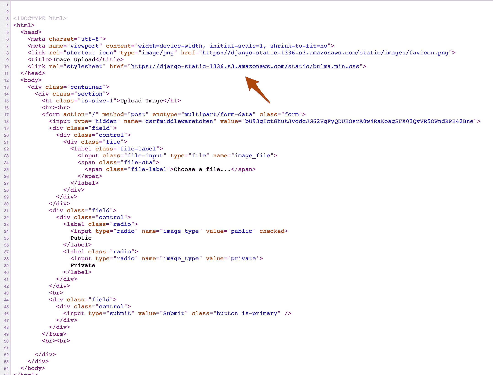

验证可以在 AWS 控制台上的 S3 存储桶的“static”子文件夹中看到静态文件:

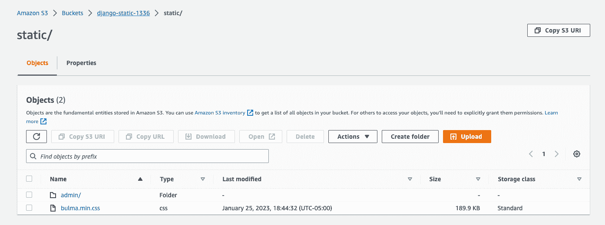

> 媒体上传仍然会触及本地文件系统，因为我们只为静态文件配置了 S3。我们将很快处理媒体上传。

最后，将`USE_S3`的值更新为`FALSE`并重新构建映像，以确保 Django 使用本地文件系统来存储静态文件。完成后，将`USE_S3`变回`TRUE`。

为了防止用户覆盖现有的静态文件，媒体文件上传应该放在桶中不同的子文件夹中。我们将通过为每种类型的存储创建自定义存储类来解决这个问题。

将名为 *storage_backends.py* 的新文件添加到“app/hello_django”文件夹中:

```
`from django.conf import settings
from storages.backends.s3boto3 import S3Boto3Storage

class StaticStorage(S3Boto3Storage):
    location = 'static'
    default_acl = 'public-read'

class PublicMediaStorage(S3Boto3Storage):
    location = 'media'
    default_acl = 'public-read'
    file_overwrite = False` 
```

对 *settings.py* 进行以下更改:

```
`USE_S3 = os.getenv('USE_S3') == 'TRUE'

if USE_S3:
    # aws settings
    AWS_ACCESS_KEY_ID = os.getenv('AWS_ACCESS_KEY_ID')
    AWS_SECRET_ACCESS_KEY = os.getenv('AWS_SECRET_ACCESS_KEY')
    AWS_STORAGE_BUCKET_NAME = os.getenv('AWS_STORAGE_BUCKET_NAME')
    AWS_DEFAULT_ACL = None
    AWS_S3_CUSTOM_DOMAIN = f'{AWS_STORAGE_BUCKET_NAME}.s3.amazonaws.com'
    AWS_S3_OBJECT_PARAMETERS = {'CacheControl': 'max-age=86400'}
    # s3 static settings
    STATIC_LOCATION = 'static'
    STATIC_URL = f'https://{AWS_S3_CUSTOM_DOMAIN}/{STATIC_LOCATION}/'
    STATICFILES_STORAGE = 'hello_django.storage_backends.StaticStorage'
    # s3 public media settings
    PUBLIC_MEDIA_LOCATION = 'media'
    MEDIA_URL = f'https://{AWS_S3_CUSTOM_DOMAIN}/{PUBLIC_MEDIA_LOCATION}/'
    DEFAULT_FILE_STORAGE = 'hello_django.storage_backends.PublicMediaStorage'
else:
    STATIC_URL = '/staticfiles/'
    STATIC_ROOT = os.path.join(BASE_DIR, 'staticfiles')
    MEDIA_URL = '/mediafiles/'
    MEDIA_ROOT = os.path.join(BASE_DIR, 'mediafiles')

STATICFILES_DIRS = (os.path.join(BASE_DIR, 'static'),)` 
```

随着`DEFAULT_FILE_STORAGE` [设置](https://django-storages.readthedocs.io/en/latest/backends/amazon-S3.html?highlight=DEFAULT_FILE_STORAGE)现在被设置，所有的[文件域](https://docs.djangoproject.com/en/4.1/ref/models/fields/#filefield)将它们的内容上传到 S3 桶。继续之前，请检查其余设置。

接下来，让我们对`upload`应用程序做一些修改。

*app/upload/models.py* :

```
`from django.db import models

class Upload(models.Model):
    uploaded_at = models.DateTimeField(auto_now_add=True)
    file = models.FileField()` 
```

*app/upload/views.py* :

```
`from django.conf import settings
from django.core.files.storage import FileSystemStorage
from django.shortcuts import render

from .models import Upload

def image_upload(request):
    if request.method == 'POST':
        image_file = request.FILES['image_file']
        image_type = request.POST['image_type']
        if settings.USE_S3:
            upload = Upload(file=image_file)
            upload.save()
            image_url = upload.file.url
        else:
            fs = FileSystemStorage()
            filename = fs.save(image_file.name, image_file)
            image_url = fs.url(filename)
        return render(request, 'upload.html', {
            'image_url': image_url
        })
    return render(request, 'upload.html')` 
```

创建新的迁移文件，然后构建新的映像:

```
`$ docker-compose exec web python manage.py makemigrations
$ docker-compose down -v
$ docker-compose up -d --build
$ docker-compose exec web python manage.py migrate` 
```

测试一下！在 [http://localhost:1337](http://localhost:1337) 上传一张图片。图像应该上传到 S3(媒体子文件夹)和`image_url`应该包括 S3 的网址:

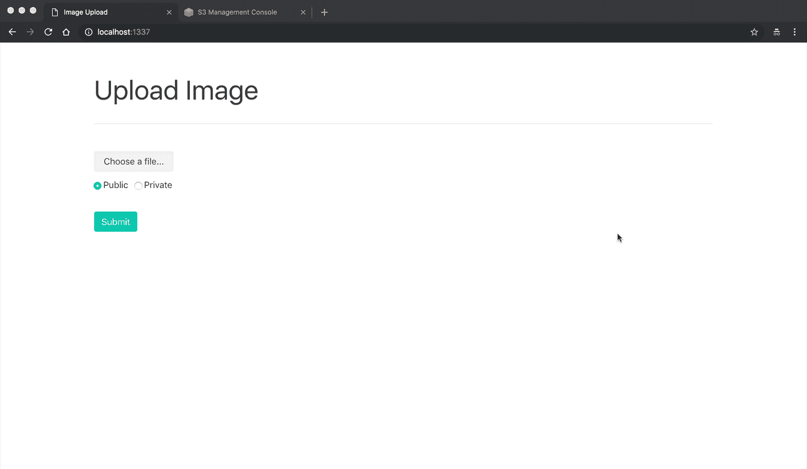

向 *storage_backends.py* 添加一个新类:

```
`class PrivateMediaStorage(S3Boto3Storage):
    location = 'private'
    default_acl = 'private'
    file_overwrite = False
    custom_domain = False` 
```

添加适当的设置:

```
`USE_S3 = os.getenv('USE_S3') == 'TRUE'

if USE_S3:
    # aws settings
    AWS_ACCESS_KEY_ID = os.getenv('AWS_ACCESS_KEY_ID')
    AWS_SECRET_ACCESS_KEY = os.getenv('AWS_SECRET_ACCESS_KEY')
    AWS_STORAGE_BUCKET_NAME = os.getenv('AWS_STORAGE_BUCKET_NAME')
    AWS_DEFAULT_ACL = None
    AWS_S3_CUSTOM_DOMAIN = f'{AWS_STORAGE_BUCKET_NAME}.s3.amazonaws.com'
    AWS_S3_OBJECT_PARAMETERS = {'CacheControl': 'max-age=86400'}
    # s3 static settings
    STATIC_LOCATION = 'static'
    STATIC_URL = f'https://{AWS_S3_CUSTOM_DOMAIN}/{STATIC_LOCATION}/'
    STATICFILES_STORAGE = 'hello_django.storage_backends.StaticStorage'
    # s3 public media settings
    PUBLIC_MEDIA_LOCATION = 'media'
    MEDIA_URL = f'https://{AWS_S3_CUSTOM_DOMAIN}/{PUBLIC_MEDIA_LOCATION}/'
    DEFAULT_FILE_STORAGE = 'hello_django.storage_backends.PublicMediaStorage'
    # s3 private media settings
    PRIVATE_MEDIA_LOCATION = 'private'
    PRIVATE_FILE_STORAGE = 'hello_django.storage_backends.PrivateMediaStorage'
else:
    STATIC_URL = '/staticfiles/'
    STATIC_ROOT = os.path.join(BASE_DIR, 'staticfiles')
    MEDIA_URL = '/mediafiles/'
    MEDIA_ROOT = os.path.join(BASE_DIR, 'mediafiles')

STATICFILES_DIRS = (os.path.join(BASE_DIR, 'static'),)` 
```

在 *app/upload/models.py* 中创建新模型:

```
`from django.db import models

from hello_django.storage_backends import PublicMediaStorage, PrivateMediaStorage

class Upload(models.Model):
    uploaded_at = models.DateTimeField(auto_now_add=True)
    file = models.FileField(storage=PublicMediaStorage())

class UploadPrivate(models.Model):
    uploaded_at = models.DateTimeField(auto_now_add=True)
    file = models.FileField(storage=PrivateMediaStorage())` 
```

然后，更新视图:

```
`from django.conf import settings
from django.core.files.storage import FileSystemStorage
from django.shortcuts import render

from .models import Upload, UploadPrivate

def image_upload(request):
    if request.method == 'POST':
        image_file = request.FILES['image_file']
        image_type = request.POST['image_type']
        if settings.USE_S3:
            if image_type == 'private':
                upload = UploadPrivate(file=image_file)
            else:
                upload = Upload(file=image_file)
            upload.save()
            image_url = upload.file.url
        else:
            fs = FileSystemStorage()
            filename = fs.save(image_file.name, image_file)
            image_url = fs.url(filename)
        return render(request, 'upload.html', {
            'image_url': image_url
        })
    return render(request, 'upload.html')` 
```

同样，创建迁移文件，重新构建映像，并启动新容器:

```
`$ docker-compose exec web python manage.py makemigrations
$ docker-compose down -v
$ docker-compose up -d --build
$ docker-compose exec web python manage.py migrate` 
```

为了测试，在 [http://localhost:1337](http://localhost:1337) 上传一个私有镜像。像公共图像一样，图像应该上传到 S3(到私有子文件夹)，并且`image_url`应该包括 S3 URL 以及以下查询字符串参数:

1.  AWSAccessKeyId
2.  签名
3.  期满

本质上，我们创建了一个临时的、已签名的 URL，用户可以在特定的时间段内访问它。没有参数，您将无法直接访问它。


## 结论

本教程向您展示了如何在 Amazon S3 上创建一个 bucket，配置一个 IAM 用户和组，并设置 Django 来上传和服务静态文件和来自 S3 的媒体上传。

通过使用 S3，您可以:

1.  增加静态文件和媒体文件的可用空间
2.  减轻您自己的服务器的压力，因为它不再需要提供文件
3.  可以限制对特定文件的访问
4.  可以利用 [CloudFront](https://aws.amazon.com/cloudfront/) CDN

如果我们遗漏了什么，或者您有任何其他提示和技巧，请告诉我们。你可以在 [django-docker-s3](https://github.com/testdrivenio/django-docker-s3) repo 中找到最终代码。