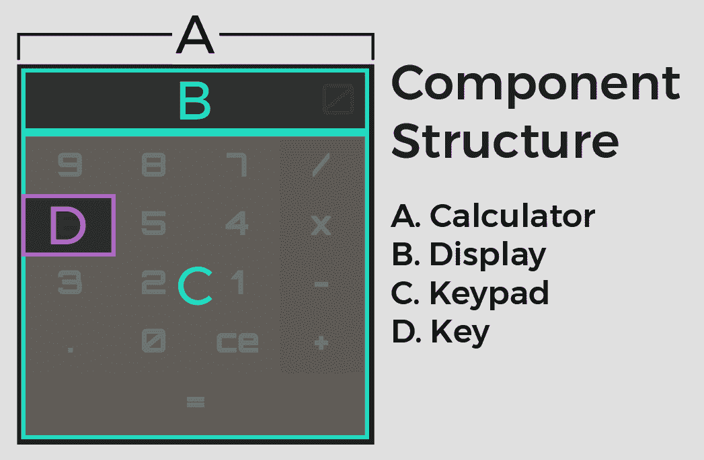
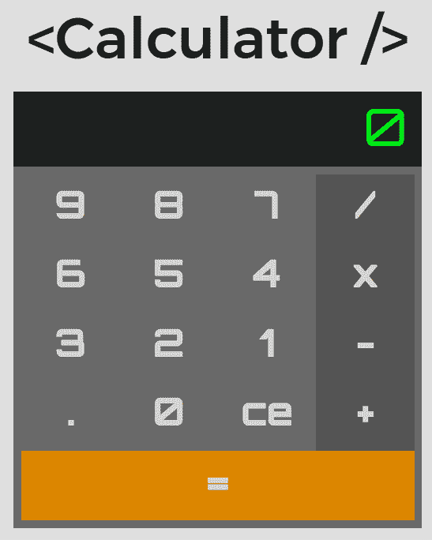
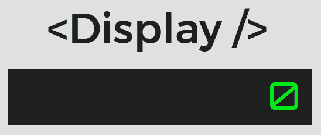
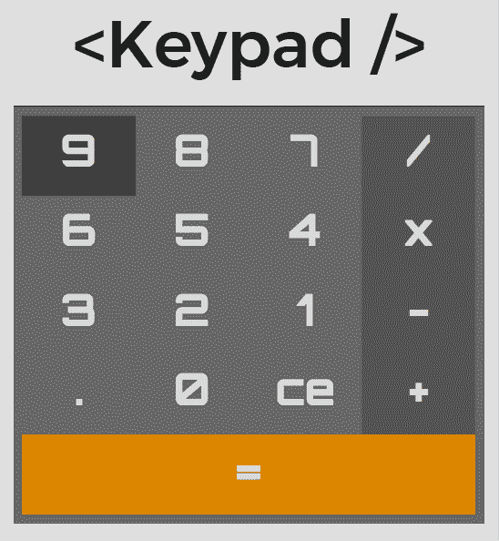
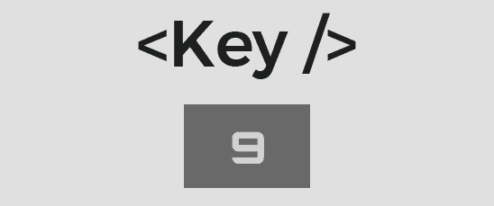
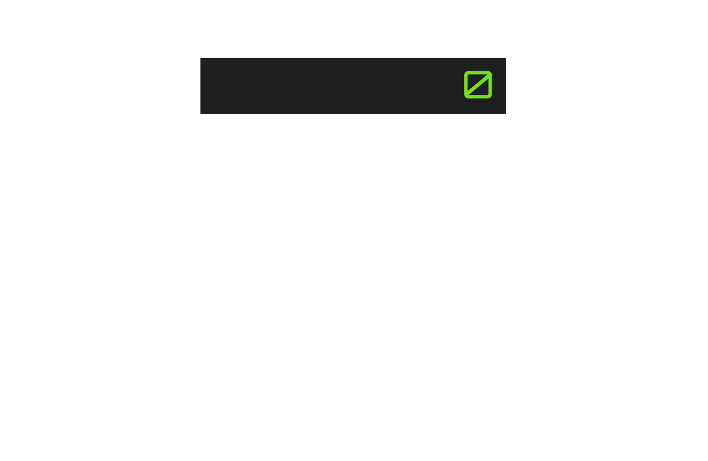

# 使用 React、Jest 和 Enzyme 的测试驱动开发——第 1 部分

> 原文：<https://testdriven.io/blog/tdd-with-react-jest-and-enzyme-part-one/>

在这篇文章中，我们将使用测试驱动开发(TDD)结合 Jest 和 Enzyme 开发一个 React 应用程序。完成后，您将能够:

*   使用 TDD 开发一个 React 应用程序
*   用酶和 Jest 测试 React 应用程序
*   编写和使用 CSS 变量进行重用和响应性设计
*   创建一个可重用的 React 组件，根据所提供的道具以不同的方式呈现和运行
*   使用 React 属性类型对组件属性进行类型检查
*   从响应式设计的角度看应用程序
*   使用灵活框模块创建灵活布局

> 这篇文章假设你至少有 React 的基本知识。如果你完全是 React 新手，建议你完成 React 官方[简介](https://reactjs.org/tutorial/tutorial.html)教程。

**零件:**

*   *Part 1* (本帖！):在第一部分，我们将建立整个项目，然后用测试驱动开发来开发 UI。
*   *[第二部分](/blog/tdd-with-react-jest-and-enzyme-part-two)* :在这一部分，我们将在开始添加基本的计算器功能之前，通过添加数字和操作键来完成 UI。

**我们将使用:**

1.  React v17.02
2.  节点 v14.16.1

> 其他依赖版本[此处](https://github.com/calebpollman/react-calculator/blob/master/package.json)。

## 项目概述

我们将构建一个由四个 UI 组件组成的基本计算器应用程序。每个组件都有一组独立的测试，保存在相应的测试文件中。

### 什么是测试驱动开发？

测试驱动开发(TDD)是一种利用短开发周期重复的开发方法，称为红色 - 绿色 - 重构。

**流程**:

1.  添加测试
2.  运行所有测试，查看新测试是否失败(红色)
3.  编写通过测试的代码(绿色)
4.  运行所有测试
5.  重构
6.  重复

**优点**:

1.  实施前设计
2.  有助于防止未来的退化和错误
3.  增加代码按预期工作的信心

**缺点**:

1.  需要更长的开发时间(但从长远来看可以节省时间)
2.  测试边缘案例很难
3.  嘲笑、假装和磕碰都更加困难

### 设计过程

想想你对基本计算器的了解...

**从视觉角度来看**，一个基本的计算器:

1.  可以用每个键(操作键)进行四种运算:加、减、乘、除
2.  有 12 个更新显示的键:`0`到`9`(数字键)、`.`(小数)和`ce`(退格键)
3.  有一个`=`(等于)键。

**从功能角度来看**:

1.  单击数字键时，计算器会更新显示以反映新的显示值。
2.  单击操作键时，计算器将所选操作符和当前显示值保存到存储器中，然后更新显示。
3.  当点击提交(或“等于”)键时，计算器获取存储的值、存储的操作符以及显示器的当前值，并基于上述输入创建输出。
4.  最后，根据我们上面确定的内容，我们知道我们将有三种类型的按键和三种不同的功能，分别对应于这些按键类型:

    | 键类型 | 函数名 | 功能描述 |
    | --- | --- | --- |
    | 数字键 | `updateDisplay` | 更新显示值并将其呈现给 DOM |
    | 操作员键 | `setOperator` | 将选择的运算符保存到组件状态对象 |
    | 提交密钥 | `callOperator` | 处理数学运算 |

**我们会有这些变量**:

1.  `displayValue` -要显示的输入或计算值。
2.  `numbers` -用于数字键的字符串值数组。
3.  `operators` -用于操作键的字符串值数组。
4.  `selectedOperator` -保存在存储器中的选定操作。
5.  `storedValue` -保存在存储器中的输入或计算值。

至此，我们现在可以考虑我们的 React 组件了。将有四个与计算器相关的组件:



### 计算器组件



这是我们应用程序的主要 UI 状态组件。它呈现了`Display`和`Keypad`组件，包含了所有的应用程序功能以及应用程序的状态。

### 显示组件



这是一个无状态组件，它接收一个单独的属性`displayValue`。

### 键盘组件



这也是一个无状态组件，包含所有的键。它接收以下道具:

1.  `callOperator`
2.  `numbers`
3.  `operators`
4.  `setOperator`
5.  `updateDisplay`

### 关键组分



最后一个组件也是无状态的，它接收以下属性:

1.  `keyAction` -与按键类型相关的功能。
2.  `keyType` -用于确定`Key`将拥有哪些 CSS 规则的字符串。
3.  `keyValue` -用于确定要传递给`keyAction`函数的值的字符串。

## 入门指南

### 项目设置

从克隆初始项目存储库开始:

```py
`$ git clone -b init [[email protected]](/cdn-cgi/l/email-protection):calebpollman/react-calculator.git
$ cd react-calculator
$ npm install
$ npm start` 
```

> 使用非常有用的 [Create React App](https://github.com/facebook/create-react-app) 生成器*初始化项目回购。*

一个新的浏览器标签应该打开到 [http://localhost:3000](http://localhost:3000) ，DOM 的唯一内容是`Hello World!`。一旦完成就杀死服务器。

> 因为我们使用 TDD 来开发 UI，所以对视图的更改会很慢。我们将专注于预先编写测试，UI 将在整个后期逐步完成。

### 测试配置

对于测试，我们将使用 Create React 应用程序附带的全功能测试解决方案 [Jest](https://facebook.github.io/jest/) ，以及 React 的一组强大测试实用程序 [Enzyme](https://github.com/airbnb/enzyme) 。

添加酶:

对于 react 应用版本 15.5 或更高版本，Enzyme 需要 [react-test-renderer](https://reactjs.org/docs/test-renderer.html) :

```py
`$ npm i -D react-test-renderer @wojtekmaj/enzyme-adapter-react-17` 
```

在“src”目录下添加一个名为 *setupTests.js* 的新文件:

```py
`import  {  configure  }  from  'enzyme'; import  Adapter  from  '@wojtekmaj/enzyme-adapter-react-17'; configure({  adapter:  new  Adapter()  });` 
```

Create React App 在每次测试前都会运行 *setupTests.js* 文件，所以它会执行并正确配置 Enzyme。

## 配置字体和初始 CSS

### 导入应用程序字体

对于我们的应用程序字体，我们将使用`Orbitron`，这是一种为显示器设计的字体，类似于您在技术先进的未来看到的东西，如果未来是 1983 年的话。我们需要两个权重，`regular` (400)和`bold` (700)，我们将从 [Google Fonts](https://fonts.google.com/specimen/Orbitron?selection.family=Orbitron) 加载字体。导航到“公共”目录中的*index.html*，并在 HTML 的`head`中添加`link`元素:

```py
`<!DOCTYPE html>
<html lang="en">
  <head>
    <meta charset="utf-8">
    <meta name="viewport" content="width=device-width, initial-scale=1, shrink-to-fit=no">
    <meta name="theme-color" content="#000000">
    <link href="https://fonts.googleapis.com/css?family=Orbitron:400,700" rel="stylesheet">
    <link rel="shortcut icon" href="%PUBLIC_URL%/favicon.png">
    <title>Calcultronic 5000</title>
  </head>
  <body>
    <noscript>
      You need to enable JavaScript to run this app.
    </noscript>
    <div id="root"></div>
  </body>
</html>` 
```

### 编写 CSS 变量

接下来，我们将编写第一个变量和一个基本的 [CSS 重置](https://meyerweb.com/eric/tools/css/reset/)。因为我们希望变量对应用程序全局可用，所以我们将从`:root`范围定义它们。定义变量的语法是使用[自定义属性符号](https://developer.mozilla.org/en-US/docs/Web/CSS/--* "Custom Properties")，每个符号都以`--`开头，后跟变量名。让我们为应用程序字体编写一个变量，并根据需要继续更新变量。

导航到 *index.css* 文件并添加以下内容:

```py
`/*
app variables
*/ :root  { /* font */ --main-font:  'Orbitron',  sans-serif; } /*
app CSS reset
*/ body,  div,  p  { margin:  0; padding:  0; }` 
```

然后我们需要将 CSS 导入到我们的应用程序中。在 *index.js* 中更新文件顶部的导入语句:

```py
`import React from 'react';
import ReactDOM from 'react-dom';
import './index.css';

ReactDOM.render(
  <div>Hello World!</div>,
  document.getElementById('root')
);` 
```

## 应用程序组件

### 浅层渲染测试

我们将开始构建每个组件，首先添加一个相应的测试文件，然后使用 Enzyme 进行浅层渲染测试。

浅层呈现测试有助于将组件作为一个单元进行测试，并避免间接测试子组件的行为。你可以在[酵素文档](http://airbnb.io/enzyme/docs/api/shallow.html)中找到更多关于浅层渲染的信息。

### 编写`App`浅渲染测试

首先为`App`组件添加第一个失败的测试(红色)，然后编写代码让它通过(绿色)。首先，在“src/components/App”中添加一个名为 *App.spec.js* 的新 spec 文件，并添加一个浅层渲染测试:

```py
`import  React  from  'react'; import  {  shallow  }  from  'enzyme'; import  App  from  './App'; describe('App',  ()  =>  { it('should render a <div />',  ()  =>  { const  wrapper  =  shallow(<App  />); expect(wrapper.find('div').length).toEqual(1); }); });` 
```

运行测试:

一旦测试运行程序启动并运行，您的终端应该如下所示:

```py
 `FAIL  src/components/App/App.spec.js
  App
    ✕ should render a <div /> (58ms)

  ● App › should render a <div />

    ReactShallowRenderer render(): Shallow rendering works only with custom components,
    but the provided element type was `object`.

       5 | describe('App', () => {
       6 |   it('should render a <div />', () => {
    >  7 |     const wrapper = shallow(<App />);
         |                     ^
       8 |     expect(wrapper.find('div').length).toEqual(1);
       9 |   });
      10 | });

      at ReactShallowRenderer.render (node_modules/react-test-renderer/cjs/react-test-renderer-shallow.development.js:786:15)
      at fn (node_modules/enzyme-adapter-react-16/src/ReactSixteenAdapter.js:668:53)
      at withSetStateAllowed (node_modules/enzyme-adapter-utils/src/Utils.js:99:18)
      at Object.render (node_modules/enzyme-adapter-react-16/src/ReactSixteenAdapter.js:668:18)
      at new ShallowWrapper (node_modules/enzyme/src/ShallowWrapper.js:397:22)
      at shallow (node_modules/enzyme/src/shallow.js:10:10)
      at Object.<anonymous> (src/components/App/App.spec.js:7:21)

  console.error node_modules/react/cjs/react.development.js:167
    Warning: React.createElement: type is invalid -- expected a string (for built-in components)
    or a class/function (for composite components) but got: object. You likely forgot to export your
    component from the file it's defined in, or you might have mixed up default and named imports.

    Check your code at App.spec.js:7.

Test Suites: 1 failed, 1 total
Tests:       1 failed, 1 total
Snapshots:   0 total
Time:        1.999s, estimated 2s
Ran all test suites.` 
```

测试失败，因为`App`组件尚未写入。

### 创建应用程序组件

继续通过创建`App`组件来通过测试。导航到 *App.jsx* 并添加以下代码:

```py
`import React from 'react';

const App = () => <div className="app-container" />;

export default App;` 
```

运行测试:

第一个测试现在应该通过了:

```py
 `PASS  src/components/App/App.spec.js
  App
    ✓ should render a <div /> (9ms)

Test Suites: 1 passed, 1 total
Tests:       1 passed, 1 total
Snapshots:   0 total
Time:        2.369s
Ran all test suites related to changed files.` 
```

> 您可能已经注意到，如果您没有退出测试运行程序，它仍然在命令行上运行。只要它在运行，它就会继续监视项目，并在文件发生变化时运行测试。您可以在继续学习本教程时让它运行，也可以退出并在空闲时运行它。

### 添加应用 CSS

现在我们的第一个测试已经通过了，让我们给`App`组件添加一些样式。由于它是应用程序其余部分的包装器，我们将使用它来设置应用程序的窗口大小，并使用`flexbox`模块将`App`的内容(即`Calculator`组件)水平和垂直居中。

导航到“src/components/App”目录中的 *App.css* 并添加以下类:

```py
`.app-container  { height:  100vh; width:  100vw; align-items:  center; display:  flex; justify-content:  center; }` 
```

> 关于这些 CSS 属性:
> 
> *   `height: 100vh;`将应用高度设置为浏览器窗口视图高度的 100%。
> *   `width: 100vw;`将应用程序宽度设置为浏览器窗口视图宽度的 100%。
> *   如果`display`属性被设置为`flex`，那么`align-items: center;`垂直对齐 flex-container 内部的内容。
> *   `display: flex;`设置`App`类使用`flexbox`模块。
> *   如果`display`属性设置为`flex`，则`justify-content: center;`水平对齐 flex-container 内的内容。

将 CSS 导入到`App`:

```py
`import  React  from  'react'; import  './App.css'; const  App  =  ()  =>  <div  className="app-container"  />; export  default  App;` 
```

将`App`导入 *index.js* :

```py
`import  React  from  'react'; import  ReactDOM  from  'react-dom'; import  App  from  './components/App/App'; import  './index.css'; ReactDOM.render( <App  />, document.getElementById('root') );` 
```

## 计算器组件

### 检查应用程序中的计算器

因为`App`组件将包含`Calculator`组件，所以让我们编写一个测试来检查`App`中是否存在`Calculator`组件。这个测试将使用`containsMatchingElement`，一个酶[方法](http://airbnb.io/enzyme/docs/api/ShallowWrapper/containsMatchingElement.html)，根据 React 元素是否匹配渲染树中的元素返回`true`或`false`。

我们还应该重构文件以使用`beforeEach`，这是 Jest 中的一个设置方法，用于减少测试中的样板文件。顾名思义，任何放在`beforeEach`中的代码都会在每个`it`块之前执行。我们将在`beforeEach`之外创建`wrapper`对象，使其可以被测试访问。

添加测试并重构 *App.spec.js* ，确保导入文件顶部的`Calculator`组件:

```py
`import  React  from  'react'; import  {  shallow  }  from  'enzyme'; import  App  from  './App'; import  Calculator  from  '../Calculator/Calculator'; describe('App',  ()  =>  { let  wrapper; beforeEach(()  =>  wrapper  =  shallow(<App  />)); it('should render a <div />',  ()  =>  { expect(wrapper.find('div').length).toEqual(1); }); it('should render the Calculator Component',  ()  =>  { expect(wrapper.containsMatchingElement(<Calculator  />)).toEqual(true); }); });` 
```

该测试将失败，因为`Calculator`组件不存在:

```py
 `FAIL  src/components/App/App.spec.js
  App
    ✓ should render a <div /> (9ms)
    ✕ should render the Calculator Component (7ms)

  ● App › should render the Calculator Component

    expect(received).toEqual(expected) // deep equality

    Expected: true
    Received: false

      13 |
      14 |   it('should render the Calculator Component', () => {
    > 15 |     expect(wrapper.containsMatchingElement(<Calculator />)).toEqual(true);
         |                                                             ^
      16 |   });
      17 | });
      18 |

      at Object.<anonymous> (src/components/App/App.spec.js:15:61)

  console.error node_modules/react/cjs/react.development.js:167
    Warning: React.createElement: type is invalid -- expected a string (for built-in components)
    or a class/function (for composite components) but got: object. You likely forgot to export your
    component from the file it's defined in, or you might have mixed up default and named imports.

    Check your code at App.spec.js:15.

Test Suites: 1 failed, 1 total
Tests:       1 failed, 1 passed, 2 total
Snapshots:   0 total
Time:        2.803s
Ran all test suites related to changed files.` 
```

### 写计算器浅渲染测试

在我们编写通过`App › should render the Calculator Component`测试的`Calculator`组件之前，添加`Calculator`测试文件，并在新的测试文件中设置一个浅层渲染测试，就像我们对`App`组件所做的那样。

创建 *Calculator.spec.js* ，将浅层渲染测试和`beforeEach`设置方法添加到文件中:

```py
`import  React  from  'react'; import  {  shallow  }  from  'enzyme'; import  Calculator  from  './Calculator'; describe('Calculator',  ()  =>  { let  wrapper; beforeEach(()  =>  wrapper  =  shallow(<Calculator  />)); it('should render a <div />',  ()  =>  { expect(wrapper.find('div').length).toEqual(1); }); });` 
```

该测试将立即失败。

### 创建计算器组件

我们的应用程序主要由*无状态的*组件组成，但是`Calculator`将是*有状态的*，所以我们可以利用 React 的内部应用程序状态。

> *有状态的*组件是基于类的，允许我们设置可变的组件状态变量，这些变量可以作为`props`传递给子组件。

导航到 *Calculator.jsx* 并定义初始状态变量和方法，这些在文章的[设计过程](#project-overview)部分已经讨论过了:

```py
`import React, { Component } from 'react';

class Calculator extends Component {
  state = {
    // value to be displayed in <Display />
    displayValue: '0',
    // values to be displayed in number <Keys />
    numbers: [],
    // values to be displayed in operator <Keys />
    operators: [],
    // operator selected for math operation
    selectedOperator: '',
    // stored value to use for math operation
    storedValue: '',
  }

  callOperator = () => {
    console.log('call operation');
  }

  setOperator = () => {
    console.log('set operation');
  }

  updateDisplay = () => {
    console.log('update display');
  }

  render = () => {
    return (
      <div className="calculator-container" />
    );
  }
}

export default Calculator;` 
```

这通过了`Calculator › should render a <div />`测试，但没有通过`App › should render the Calculator Component`。为什么？因为`App`组件还没有更新为包含`Calculator`组件。让我们现在做那件事。

在 *App.jsx* 中，将代码更新如下:

```py
`import  React  from  'react'; import  Calculator  from  '../Calculator/Calculator'; import  './App.css'; const  App  =  ()  =>  ( <div  className="app-container"> <Calculator  /> </div> ); export  default  App;` 
```

随着`Calculator`组件的创建，所有测试现在都通过了:

```py
 `PASS  src/components/Calculator/Calculator.spec.js
 PASS  src/components/App/App.spec.js

Test Suites: 2 passed, 2 total
Tests:       3 passed, 3 total
Snapshots:   0 total
Time:        2.5s
Ran all test suites related to changed files.` 
```

### 为应用程序添加快照测试

虽然快照并不是 TDD 的一部分，因为它们是在组件被写入之后*被写入的(想想“绿色 - 绿色 - 重构”而不是“红色 - 绿色 - 重构”)，但是它们是值得包含在内的，因为它们会迅速提醒您所呈现组件的任何意外变化。最好在*完成组件编写后再添加它们*。*

来自 [Jest 文档](https://facebook.github.io/jest/docs/en/snapshot-testing.html):

> 一个典型的移动应用程序快照测试用例呈现一个 UI 组件，截取一个屏幕截图，然后将其与测试中存储的参考图像进行比较。如果两个图像不匹配，测试将失败:要么是意外的更改，要么是屏幕截图需要更新到 UI 组件的新版本。

您将需要为 [Jest 版本 24 或更高版本](https://github.com/facebook/jest/issues/7802)使用快照序列化程序。我们将使用[酶转 json](https://github.com/adriantoine/enzyme-to-json) :

```py
`$ npm i -D enzyme-to-json` 
```

导航到 *App.spec.js* 并将`toMatchSnapshot`添加为文件中的第一个测试，就在`beforeEach`之后:

```py
`... describe('App',  ()  =>  { let  wrapper; beforeEach(()  =>  wrapper  =  shallow(<App  />)); it('should render correctly',  ()  =>  expect(wrapper).toMatchSnapshot()); ... });` 
```

> 当我们完成每个组件的 UI 时，我们将添加一个快照测试作为每个`spec`文件中的第一个测试。这创建了一个模式，将出现在每个`spec`文件中的通用测试(快照、浅层渲染)放置在组件特定测试之上。

新的快照测试立即通过，并且它将继续通过*,直到*在那个组件中有一个 UI 变化。这也为`App`组件创建了一个“__snapshots__”目录以及一个名为 *App.spec.js.snap* 的文件。

```py
 `PASS  src/components/Calculator/Calculator.spec.js
 PASS  src/components/App/App.spec.js
 › 1 snapshot written.

Snapshot Summary
 › 1 snapshot written from 1 test suite.

Test Suites: 2 passed, 2 total
Tests:       4 passed, 4 total
Snapshots:   1 written, 1 total
Time:        1.642s, estimated 2s
Ran all test suites.` 
```

现在我们可以添加`Calculator`样式了。

### 添加计算器 CSS

首先用与`Calculator`相关的变量更新 CSS 变量，并添加一个媒体查询。由于应用程序的最小视觉设计，我们只使用一个媒体查询来更新字体大小，并为平板电脑或更小的设备删除`Calculator`组件周围的边距。

导航到 *index.css* 并更新文件，如下所示:

```py
`/*
app variables
*/ :root  { /* background colors */ --calculator-background-color:  #696969; /* font */ --main-font:  'Orbitron',  sans-serif; /* calculator dimensions */ --calculator-height:  72%; --calculator-width:  36%; } /*
media query for tablet or smaller screen
*/ @media  screen  and  (max-width:  1024px)  { :root  { /* calculator dimensions */ --calculator-height:  100%; --calculator-width:  100%; } } /*
app CSS reset
*/ body,  div,  p  { margin:  0; padding:  0; }` 
```

接下来更新 *Calculator.css* 中的组件 CSS:

```py
`.calculator-container  { background-color:  var(--calculator-background-color); height:  var(--calculator-height); width:  var(--calculator-width); }` 
```

然后将 CSS 文件导入到 *Calculator.jsx* 的顶部:

```py
`import './Calculator.css';` 
```

我们现在有了第一个呈现到 DOM 的组件！通过运行应用程序启动浏览器:

然后打开你的浏览器(如果还没有自动打开的话)到 [http://localhost:3000](http://localhost:3000) 。DOM 应该与这个截图匹配:


> 现在是停下来回顾我们迄今所做的一切的好时机。也尝试一下 CSS。

## 显示组件

### 检查计算器中的显示

因为`Calculator`组件将包含`Display`和`Keypad`组件，下一步是编写一个测试来检查`Display`组件在`Calculator`中的存在。

将测试添加到 *Calculator.spec.js* :

```py
`it('should render the Display Component',  ()  =>  { expect(wrapper.containsMatchingElement(<Display  />)).toEqual(true); });` 
```

确保导入文件顶部的`Display`组件:

```py
`import  Display  from  '../Display/Display';` 
```

与之前的`containsMatchingElement`测试一样，它将失败，因为`Display`组件不存在。

在我们编写`Display`组件之前，添加`Display`测试文件，并在新的测试文件中设置一个浅层渲染测试，就像我们对`Calculator`组件所做的那样。

创建，然后导航到 *Display.spec.js* ，添加浅层渲染测试以及`beforeEach`设置方法:

```py
`import  React  from  'react'; import  {shallow}  from  'enzyme'; import  Display  from  './Display'; describe('Display',  ()  =>  { let  wrapper; beforeEach(()  =>  wrapper  =  shallow(<Display  />)); it('should render a <div />',  ()  =>  { expect(wrapper.find('div').length).toEqual(1); }); });` 
```

这也将失败，因为`Display`组件仍然不存在。

在 *Display.jsx* 中添加组件，并在文件顶部导入`prop-types`:

```py
`import React from 'react';
import PropTypes from 'prop-types';

const Display = ({ displayValue }) => <div className="display-container" />;

Display.propTypes = { displayValue: PropTypes.string.isRequired };

export default Display;` 
```

> [prop-types](https://github.com/facebook/prop-types) 允许我们记录传递给组件的预期属性类型，并在开发过程中，如果传递给组件的类型与包含在`ComponentName.propTypes`对象中的 props 不匹配，抛出警告。

将组件添加到 *Display.jsx* 将通过`Display`浅层渲染测试，但带有一个`prop-type`警告。尽管如此,`Calculator › should render the Display component`测试仍然会失败:

```py
 `PASS  src/components/App/App.spec.js
 PASS  src/components/Display/Display.spec.js
  ● Console

    console.error node_modules/prop-types/checkPropTypes.js:20
      Warning: Failed prop type: The prop `displayValue` is marked as required in `Display`,
      but its value is `undefined`.
          in Display (at Display.spec.js:8)

 FAIL  src/components/Calculator/Calculator.spec.js
  ● Console

    console.error node_modules/prop-types/checkPropTypes.js:20
      Warning: Failed prop type: The prop `displayValue` is marked as required in `Display`,
      but its value is `undefined`.
          in Display (at Calculator.spec.js:16)

  ● Calculator › should render the Display Component

    expect(received).toEqual(expected) // deep equality

    Expected: true
    Received: false

      14 |
      15 |   it('should render the Display Component', () => {
    > 16 |     expect(wrapper.containsMatchingElement(<Display />)).toEqual(true);
         |                                                          ^
      17 |   });
      18 | });
      19 |

      at Object.<anonymous> (src/components/Calculator/Calculator.spec.js:16:58)

Test Suites: 1 failed, 2 passed, 3 total
Tests:       1 failed, 5 passed, 6 total
Snapshots:   1 passed, 1 total
Time:        2.583s` 
```

我们需要在 *Calculator.jsx* 中导入并添加`Display`组件，然后更新渲染方法，以便我们将`displayValue`道具传递给`Display`:

```py
`import React, { Component } from 'react';
import Display from '../Display/Display';
import './Calculator.css';

class Calculator extends Component {
  ...
  render = () => {
    // unpack the component state by using Object Destructuring
    const { displayValue } = this.state;

    return (
      <div className="calculator-container">
        <Display displayValue={displayValue} />
      </div>
    );
  }
}
...` 
```

在 *Display.spec.js* 中，使用空字符串作为值，将`displayValue`属性添加到`beforeEach`块中:

```py
`... describe('Display',  ()  =>  { let  wrapper; beforeEach(()  =>  wrapper  =  shallow(<Display  displayValue={''}  />)); ... }); ...` 
```

然后更新`Calculator › should render the Display component`测试，以说明`Display`中所需的道具。我们可以通过对`wrapper`对象使用`instance`方法来访问`Calculator`的状态变量和方法。

在 *Calculator.spec.js* 中更新测试:

```py
`it('should render the Display Component',  ()  =>  { expect(wrapper.containsMatchingElement( <Display  displayValue={wrapper.instance().state.displayValue}  /> )).toEqual(true); });` 
```

所有测试都应该通过！

```py
 `PASS  src/components/Calculator/Calculator.spec.js
 PASS  src/components/Display/Display.spec.js
 PASS  src/components/App/App.spec.js

Test Suites: 3 passed, 3 total
Tests:       6 passed, 6 total
Snapshots:   1 passed, 1 total
Time:        1.964s, estimated 2s
Ran all test suites.` 
```

### 显示渲染显示值

接下来，让我们测试实际`displayValue`的渲染，这样我们的计算器就会显示一些东西。

首先在 *Display.spec.js* 中编写一个测试:

```py
`it('renders the value of displayValue',  ()  =>  { wrapper.setProps({  displayValue:  'test'  }); expect(wrapper.text()).toEqual('test'); });` 
```

我们将再次在控制台中进行失败的测试:

```py
 `PASS  src/components/App/App.spec.js
 PASS  src/components/Calculator/Calculator.spec.js
 FAIL  src/components/Display/Display.spec.js
  ● Display › renders the value of displayValue

    expect(received).toEqual(expected) // deep equality

    Expected: "test"
    Received: ""

      14 |   it('renders the value of displayValue', () => {
      15 |     wrapper.setProps({ displayValue: 'test' });
    > 16 |     expect(wrapper.text()).toEqual('test');
         |                            ^
      17 |   });
      18 | });
      19 |

      at Object.<anonymous> (src/components/Display/Display.spec.js:16:28)

Test Suites: 1 failed, 2 passed, 3 total
Tests:       1 failed, 6 passed, 7 total
Snapshots:   1 passed, 1 total
Time:        2.489s
Ran all test suites.` 
```

我们需要重构 *Display.jsx* 来呈现`displayValue`的值。让我们也添加一些`className`到我们的 HTML 元素中，为添加样式做准备:

```py
`...
const Display = ({ displayValue }) => (
  <div className="display-container">
    <p className="display-value">
      {displayValue}
    </p>
  </div>
);
...` 
```

> 注意，我们使用括号来扩展 arrow 函数的隐式返回功能。

测试和测试套件都应该是绿色的！

### 为显示添加快照测试

完成我们的组件后，我们可以导航到 *Display.spec.js* 并将`toMatchSnapshot`添加为文件中的第一个测试，就在`beforeEach`之后:

```py
`... describe('Display',  ()  =>  { ... it('should render correctly',  ()  =>  expect(wrapper).toMatchSnapshot()); ... });` 
```

### 添加显示 CSS

按照我们在前面的组件中使用的添加 CSS 的相同模式，首先更新 *index.css* 中的变量和媒体查询:

```py
`/*
app variables
*/ :root  { /* background colors */ --display-background-color:  #1d1f1f; /* font */ --main-font:  'Orbitron',  sans-serif; /* font colors */ --display-text-color:  #23e000; /* font sizes */ --display-text-size:  4em; /* font weights */ --display-text-weight:  400; /* calculator dimensions */ --calculator-height:  72%; --calculator-width:  36%; /* display dimensions */ --display-height:  24%; --display-width:  92%; } /*
media query for tablet or smaller screen
*/ @media  screen  and  (max-width:  1024px)  { :root  { /* font sizes */ --display-text-size:  10em; /* calculator dimensions */ --calculator-height:  100%; --calculator-width:  100%; } } /*
app CSS reset
*/ body,  div,  p  { margin:  0; padding:  0; }` 
```

然后在 *Display.css* 中添加组件 CSS:

```py
`.display-container  { align-items:  center; background:  var(--display-background-color); display:  flex; height:  var(--display-height); padding:  0  4%; width:  var(--display-width); } .display-value  { color:  var(--display-text-color); font-size:  var(--display-text-size); font-family:  var(--main-font); font-weight:  var(--display-text-weight); margin-left:  auto; overflow:  hidden; }` 
```

> 关于这些 CSS 属性:
> 
> *   `margin-left: auto;`将元素推到容器的右边缘。
> *   `overflow: hidden;`指定如果 HTML 大于容器，溢出将被隐藏。

并将 CSS 文件导入到 *Display.jsx* :

```py
`import React from 'react';
import PropTypes from 'prop-types';
import './Display.css';
...` 
```

现在我们已经完成了`Display`的 CSS，让我们启动浏览器，看看输出！

输出应该与该屏幕截图相匹配:



`Display`组件现在呈现在浏览器中，我们准备继续测试和编写`Keypad`组件。

## 键盘组件

### 添加键盘组件和测试

现在我们已经构建好了`Display`组件，我们需要将`Keypad`组件添加到`Calculator`中。我们将从在`Calculator`组件测试中测试它开始。

在 *Calculator.spec.js* 中重构`Calculator › should render the Display component`测试:

```py
`it('should render the Display and Keypad Components', () => {
  expect(wrapper.containsAllMatchingElements([
    <Display displayValue={wrapper.instance().state.displayValue} />,
    <Keypad
      callOperator={wrapper.instance().callOperator}
      numbers={wrapper.instance().state.numbers}
      operators={wrapper.instance().state.operators}
      setOperator={wrapper.instance().setOperator}
      updateDisplay={wrapper.instance().updateDisplay}
    />
  ])).toEqual(true);
});` 
```

> `containsAllMatchingElements`获取一个元素数组，如果在 DOM 树中找到了所有元素，则返回`true`。

确保在`Keypad`组件中导入:

```py
`import  Keypad  from  '../Keypad/Keypad';` 
```

我们的新测试失败了！`Keypad`组件尚不存在。

在我们添加组件之前，遵循我们对`Display`组件使用的模式:

1.  在“src/components/Keypad”中创建规格文件 *Keypad.spec.js*
2.  添加`Keypad`浅渲染测试

```py
`import React from 'react';
import { shallow } from 'enzyme';
import Keypad from './Keypad';

describe('Keypad', () => {
  let wrapper;

  beforeEach(() => {
    wrapper = shallow(
      <Keypad
        callOperator={jest.fn()}
        numbers={[]}
        operators={[]}
        setOperator={jest.fn()}
        updateDisplay={jest.fn()}
      />
    );
  });

  it('should render a <div />', () => {
    expect(wrapper.find('div').length).toEqual(1);
  });
});` 
```

> 因为我们直接从它的文件中呈现`Keypad`，所以它不能访问`Calculator`方法。代替这些方法，我们使用`jest.fn()`，一个创建模拟函数的 Jest 函数。更多信息[这里](https://facebook.github.io/jest/docs/en/mock-functions.html)。

如果您检查控制台，您应该看到两个测试套件失败。现在将 JSX 添加到 *Keypad.jsx* :

```py
`import React from 'react';
import PropTypes from 'prop-types';

const Keypad = ({ callOperator, numbers, operators, setOperator, updateDisplay }) =>
  <div className="keypad-container" />;

Keypad.propTypes = {
  callOperator: PropTypes.func.isRequired,
  numbers: PropTypes.array.isRequired,
  operators: PropTypes.array.isRequired,
  setOperator: PropTypes.func.isRequired,
  updateDisplay: PropTypes.func.isRequired,
}

export default Keypad;` 
```

导入 *Calculator.jsx* 中的`Keypad`:

```py
`import  Keypad  from  '../Keypad/Keypad';` 
```

然后，将`Keypad`添加到`render`方法中，确保从`this.state`解包`numbers`和`operators`的值，并将所有需要的道具传递给`Keypad`:

```py
`render = () => {
  // unpack the component state by using Object Destructuring
  const { displayValue, numbers, operators } = this.state;

  return (
    <div className="calculator-container">
      <Display displayValue={displayValue} />
      <Keypad
        callOperator={this.callOperator}
        numbers={numbers}
        operators={operators}
        setOperator={this.setOperator}
        updateDisplay={this.updateDisplay}
      />
    </div>
  );
}` 
```

所有测试都应该通过。

### 计算器快照

添加`Calculator`快照，现在我们已经完成了组件的 UI，就在 *Calculator.spec.js* 中的`beforeEach`下面:

```py
`it('should render correctly',  ()  =>  expect(wrapper).toMatchSnapshot());` 
```

```py
 `PASS  src/components/App/App.spec.js
 PASS  src/components/Keypad/Keypad.spec.js
 PASS  src/components/Display/Display.spec.js
 PASS  src/components/Calculator/Calculator.spec.js
 › 1 snapshot written.

Snapshot Summary
 › 1 snapshot written from 1 test suite.

Test Suites: 4 passed, 4 total
Tests:       10 passed, 10 total
Snapshots:   1 written, 2 passed, 3 total
Time:        2.726s
Ran all test suites related to changed files.` 
```

## 下次

我们将在这里休息一下，在下一部分继续，从测试包含在`Keypad`中的`numbers`和`operators`数组中的值的呈现开始。然后我们将继续测试`Key`组件，继续应用程序事件和功能测试，然后做一些最终的重构。

如果你想跳过前面，你可以从 GitHub 上的 [react-calculator](https://www.github.com/calebpollman/react-calculator) repo 获取最终代码。

干杯！

> part 2[可用](/blog/tdd-with-react-jest-and-enzyme-part-two)！