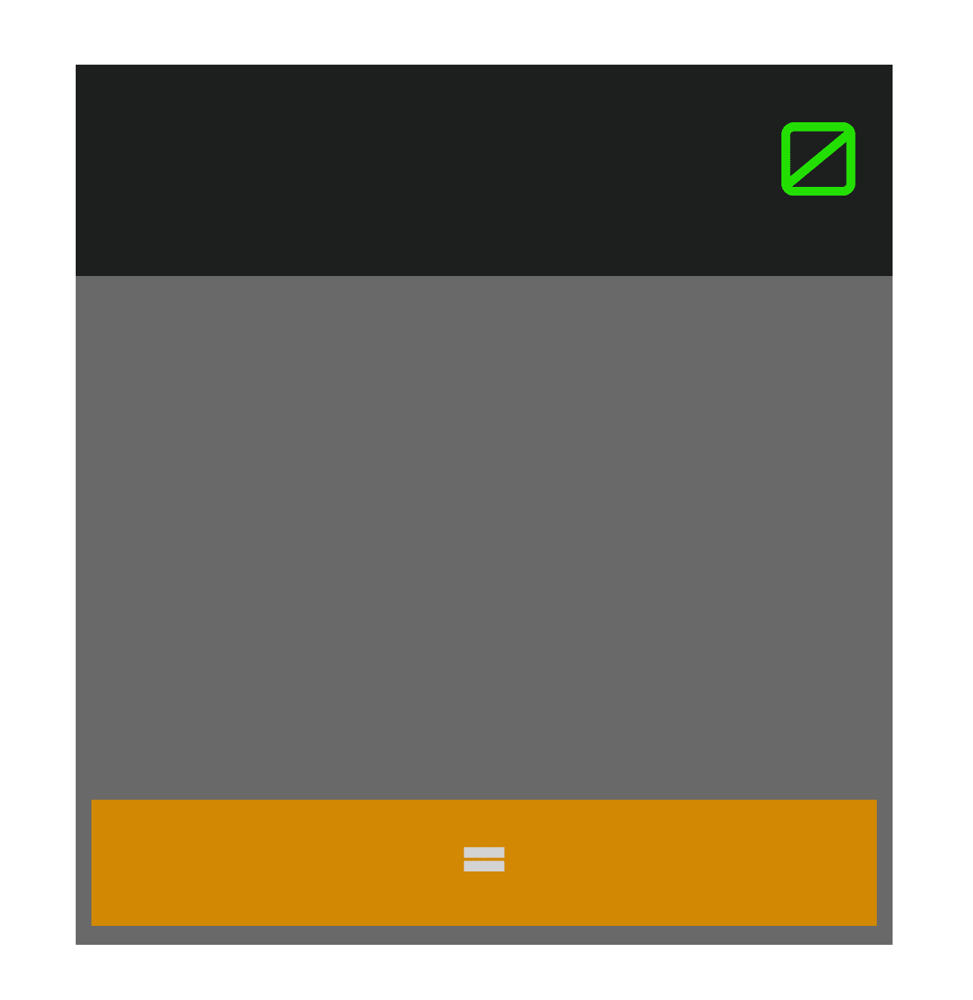
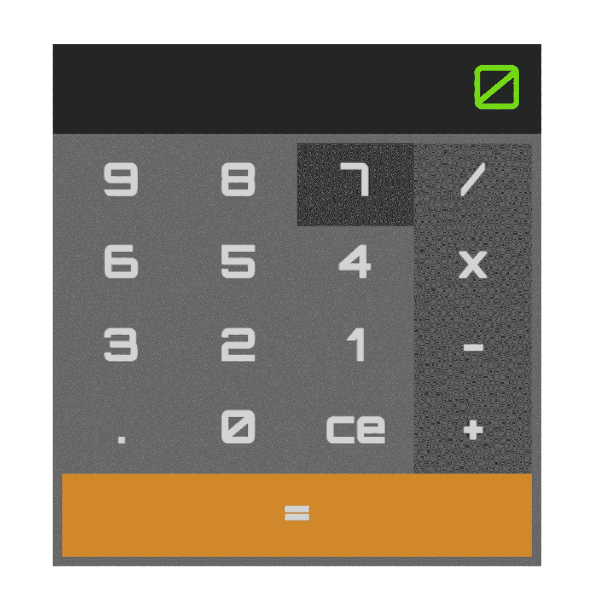
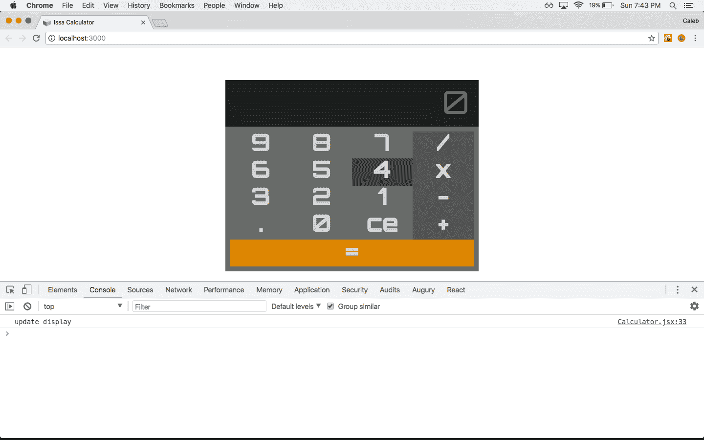
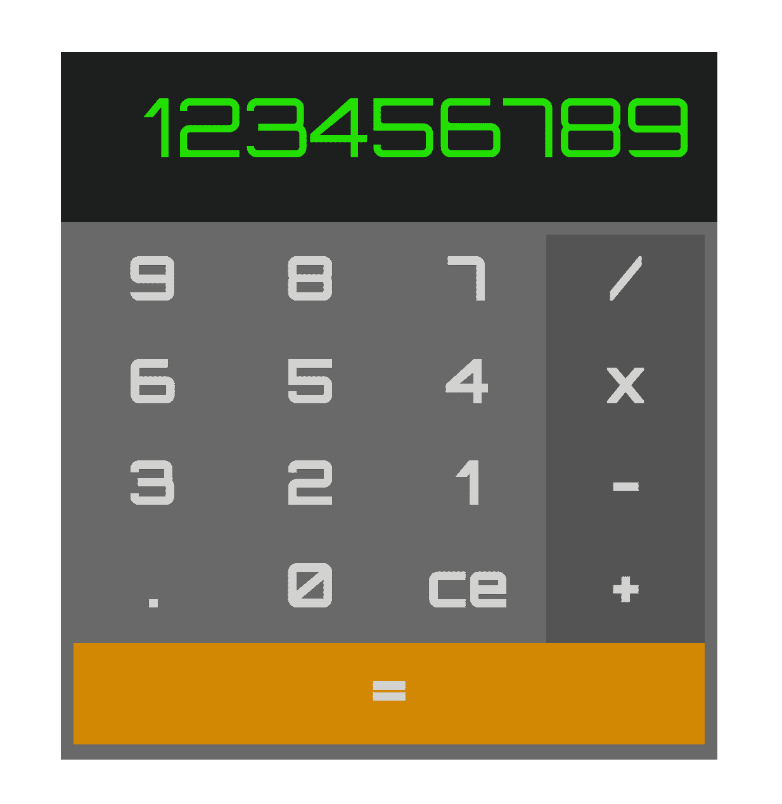
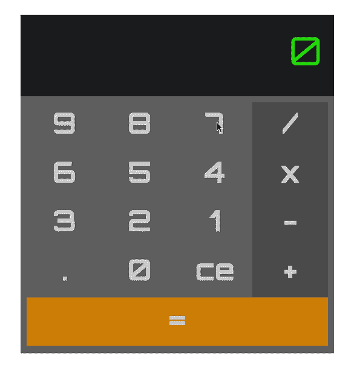
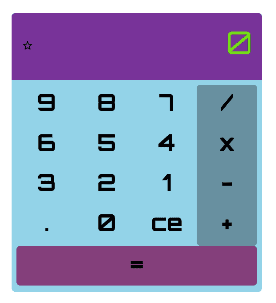

# 使用 React、Jest 和 Enzyme 的测试驱动开发——第 2 部分

> 原文：<https://testdriven.io/blog/tdd-with-react-jest-and-enzyme-part-two/>

> 这是使用 React、Jest 和 Enzyme 的**测试驱动开发的第二部分。你可以在这里找到第一部。**

上一次，我们从项目概述开始，其中包括对测试驱动开发(TDD)的简要说明、应用程序设计过程以及应用程序组件的高级概要。从那里我们继续项目设置，开始编写我们的(失败)测试，然后是通过这些测试的代码，最终以我们的`Calculator`快照结束。至此，我们已经完成了`Calculator`和`Display`组件的 UI，并且已经开始了`Keypad`组件的工作。

**零件:**

*   *[第 1 部分](/blog/tdd-with-react-jest-and-enzyme-part-one)* :在第一部分，我们将建立整个项目，然后用测试驱动开发来开发 UI。
*   *第二部*(本帖！):在这一部分中，我们将在开始添加基本的计算器功能之前，通过添加数字和操作键来结束 UI。


让我们通过测试`numbers`和`operators`的`Keypad`渲染，回到红色、绿色、重构的循环中来！

## 键盘组件

### 测试数字和运算符在键盘中的呈现

按照我们测试`Display`组件中`displayValue`道具的渲染的相同方式，让我们为`Keypad`组件中的`numbers`和`operators`道具编写渲染测试。

在 *Keypad.spec.js* 中，从`numbers`测试开始:

```py
`it('renders the values of numbers',  ()  =>  { wrapper.setProps({numbers:  ['0',  '1',  '2']}); expect(wrapper.find('.numbers-container').text()).toEqual('012'); });` 
```

然后更新 *Keypad.jsx* ，通过添加一个`map`函数来遍历`numbers`数组以及一个容器`div`元素来容纳我们的新元素，从而通过测试:

```py
`...
const Keypad = ({
  callOperator,
  numbers,
  operators,
  setOperator,
  updateDisplay,
}) => {
  const numberKeys = numbers.map(number => <p key={number}>{number}</p>);

  return (
    <div className="keypad-container">
      <div className="numbers-container">
        {numberKeys}
      </div>
    </div>
  );
}
...` 
```

现在`Keypad › should render a <div />`应该断开，因为有不止一个`div`。

更新 *Keypad.spec.js* 中的测试:

```py
`it('should render 2 <div />\'s',  ()  =>  { expect(wrapper.find('div').length).toEqual(2); });` 
```

全部通过！在 *Keypad.spec.js* 中对`operators`遵循相同的模式:

```py
`it('renders the values of operators',  ()  =>  { wrapper.setProps({operators:  ['+',  '-',  '*',  '/']}); expect(wrapper.find('.operators-container').text()).toEqual('+-*/'); });` 
```

然后在 *Keypad.jsx* 中，用我们对`numbers`所做的同样方式更新组件:

```py
`...
const Keypad = ({
  callOperator,
  numbers,
  operators,
  setOperator,
  updateDisplay,
}) => {
  const numberKeys = numbers.map(number => <p key={number}>{number}</p>);

  const operatorKeys = operators.map(operator => <p key={operator}>{operator}</p>);

  return (
    <div className="keypad-container">
      <div className="numbers-container">
        {numberKeys}
      </div>
      <div className="operators-container">
        {operatorKeys}
      </div>
    </div>
  );
}
...` 
```

这个现在应该破`Keypad › should render 2 <div />'s`。更新 *Keypad.spec.js* 中的测试:

```py
`it('should render 3 <div />\'s',  ()  =>  { expect(wrapper.find('div').length).toEqual(3); });` 
```

测试是绿色的！

### 添加键盘 CSS

现在添加 CSS 变量和组件 CSS。导航到 *index.css* 并对`:root`范围进行更新:

```py
`/*
app variables
*/ :root  { /* background colors */ --calculator-background-color:  #696969; --display-background-color:  #1d1f1f; /* font */ --main-font:  'Orbitron',  sans-serif; /* font colors */ --display-text-color:  #23e000; /* font sizes */ --display-text-size:  4em; /* font weights */ --display-text-weight:  400; /* calculator dimensions */ --calculator-height:  72%; --calculator-width:  36%; /* display dimensions */ --display-height:  24%; --display-width:  92%; /* keypad dimensions */ --keypad-height:  72%; --keypad-width:  96%; } /*
media query for tablet or smaller screen
*/ @media  screen  and  (max-width:  1024px)  { :root  { /* font sizes */ --display-text-size:  6em; /* calculator dimensions */ --calculator-height:  100%; --calculator-width:  100%; } }` 
```

将以下内容添加到 *Keypad.css* :

```py
`.keypad-container  { display:  flex; flex-direction:  row; flex-wrap:  wrap; height:  var(--keypad-height); padding:  2%; width:  var(--keypad-width); } .numbers-container  { display:  flex; flex-direction:  row; flex-wrap:  wrap; height:  80%; width:  75%; } .operators-container  { display:  flex; flex-direction:  column; height:  80%; width:  25%; } .submit-container  { height:  20%; width:  100%; }` 
```

> 关于这些 CSS 属性:
> 
> *   `flex-direction: row;`将`flex-container`中内容的布局设置为`row`(这是`display: flex`的默认方向)。
> *   `flex-wrap: wrap;`通知`flex-container`将超过`flex-container`宽度的内容打包到`flex-container`中。
> *   `flex-direction: column;`将`flex-container`中内容的布局设置为`column`。

最后，将 *Keypad.css* 导入到 *Keypad.jsx* 中:

```py
`import React from 'react';
import PropTypes from 'prop-types';
import './Keypad.css';
...` 
```

启动应用程序:

浏览器现在应该看起来像这样:


## 关键组分

### 检查键盘中的钥匙

按照我们对`Calculator`、`Display`和`Keypad`组件使用的相同的浅层渲染测试模式，我们现在将检查`Keypad`中是否存在`Key`组件。

将以下测试添加到 *Keypad.spec.js* :

```py
`it('should render an instance of the Key component',  ()  =>  { expect(wrapper.find('Key').length).toEqual(1); });` 
```

> 您可能已经注意到，在之前的测试中，我们在检查子组件时使用了`containsMatchingElement`。因为我们将渲染 17 个不同的`Key`元素，每个元素都有不同的`keyAction`、`keyType`和`keyValue`，使用`containsMatchingElement`对这个例子不起作用。相反，我们将使用`find`方法检查元素的存在，然后检查结果数组的长度。

在“src/components/Key”中为`Key`组件创建测试套件文件，然后在 *Key.spec.js* 中为`Key`添加浅层渲染测试:

```py
`import React from 'react';
import { shallow } from 'enzyme';
import Key from './Key';

describe('Key', () => {
  let wrapper;

  beforeEach(() => {
    wrapper = shallow(
      <Key
        keyAction={jest.fn()}
        keyType={''}
        keyValue={''}
      />
    );
  });

  it('should render a <div />', () => {
    expect(wrapper.find('div').length).toEqual(1);
  });
});` 
```

将组件添加到 *Key.jsx* :

```py
`import React from 'react';
import PropTypes from 'prop-types';

const Key = ({ keyAction, keyType, keyValue }) => <div className="key-container" />;

Key.propTypes = {
  keyAction: PropTypes.func.isRequired,
  keyType: PropTypes.string.isRequired,
  keyValue: PropTypes.string.isRequired,
}

export default Key;` 
```

`Keypad › should render an instance of the Key component`应该还是失败了。

```py
 `PASS  src/components/Display/Display.spec.js
 PASS  src/components/Calculator/Calculator.spec.js
 PASS  src/components/App/App.spec.js
 FAIL  src/components/Keypad/Keypad.spec.js
  ● Keypad › should render an instance of the Key component

    expect(received).toEqual(expected) // deep equality

    Expected: 1
    Received: 0

      33 |
      34 |   it('should render an instance of the Key component', () => {
    > 35 |     expect(wrapper.find('Key').length).toEqual(1);
         |                                        ^
      36 |   });
      37 | });
      38 |

      at Object.<anonymous> (src/components/Keypad/Keypad.spec.js:35:40)

 PASS  src/components/Key/Key.spec.js

Test Suites: 1 failed, 4 passed, 5 total
Tests:       1 failed, 13 passed, 14 total
Snapshots:   3 passed, 3 total
Time:        3.069s
Ran all test suites related to changed files.` 
```

导入 *Keypad.jsx* 中的`Key`组件，更新`return`语句:

```py
`...
import Key from '../Key/Key';
import './Keypad.css';

const Keypad = ({
  callOperator,
  numbers,
  operators,
  setOperator,
  updateDisplay,
}) => {
  ...
  return (
    <div className="keypad-container">
      <div className="numbers-container">
        {numberKeys}
      </div>
      <div className="operators-container">
        {operatorKeys}
      </div>
      <Key
        keyAction={callOperator}
        keyType=""
        keyValue=""
      />
    </div>
  );
}
...` 
```

测试应该会通过。

### 键呈现键值

接下来，向 *Key.spec.jsx* 添加一个新的测试，检查`keyValue`的值是否存在:

```py
`it('should render the value of keyValue',  ()  =>  { wrapper.setProps({  keyValue:  'test'  }); expect(wrapper.text()).toEqual('test'); });` 
```

重构 *Key.jsx* 中的`Key`组件:

```py
`const Key = ({ keyAction, keyType, keyValue }) => (
  <div className="key-container">
    <p className="key-value">
      {keyValue}
    </p>
  </div>
);` 
```

全部通过！

### 添加关键 CSS

这是更新 CSS 变量和添加`Key` CSS 的好地方。导航到 *index.css* 并进行以下更新:

```py
`:root  { /* background colors */ --action-key-color:  #545454; --action-key-color-hover:  #2a2a2a; --calculator-background-color:  #696969; --display-background-color:  #1d1f1f; --number-key-color:  #696969; --number-key-color-hover:  #3f3f3f; --submit-key-color:  #d18800; --submit-key-color-hover:  #aa6e00; ... /* font colors */ --display-text-color:  #23e000; --key-text-color:  #d3d3d3; /* font sizes */ --display-text-size:  4em; --key-text-size:  3em; /* font weights */ --display-text-weight:  400; --key-text-weight:  700; ... } ... @media  screen  and  (max-width:  1024px)  { :root  { /* font sizes */ --display-text-size:  10em; --key-text-size:  6em; ... } }` 
```

完整的 *index.css* 文件现在应该是这样的:

```py
`/*
app variables
*/ :root  { /* background colors */ --action-key-color:  #545454; --action-key-color-hover:  #2a2a2a; --calculator-background-color:  #696969; --display-background-color:  #1d1f1f; --number-key-color:  #696969; --number-key-color-hover:  #3f3f3f; --submit-key-color:  #d18800; --submit-key-color-hover:  #aa6e00; /* font */ --main-font:  'Orbitron',  sans-serif; /* font colors */ --display-text-color:  #23e000; --key-text-color:  #d3d3d3; /* font sizes */ --display-text-size:  4em; --key-text-size:  3em; /* font weights */ --display-text-weight:  400; --key-text-weight:  700; /* calculator dimensions */ --calculator-height:  72%; --calculator-width:  36%; /* display dimensions */ --display-height:  24%; --display-width:  92%; /* keypad dimensions */ --keypad-height:  72%; --keypad-width:  96%; } /*
media query for tablet or smaller screen
*/ @media  screen  and  (max-width:  1024px)  { :root  { /* font sizes */ --display-text-size:  10em; --key-text-size:  6em; /* calculator dimensions */ --calculator-height:  100%; --calculator-width:  100%; } } /*
app CSS reset
*/ body,  div,  p  { margin:  0; padding:  0; }` 
```

然后在 *Key.css* 中添加组件 CSS:

```py
`.key-container  { align-items:  center; display:  flex; height:  25%; justify-content:  center; transition:  background-color  0.3s  linear; } .key-container:hover  { cursor:  pointer; } .operator-key  { background-color:  var(--action-key-color); width:  100%; } .operator-key:hover  { background-color:  var(--action-key-color-hover); } .number-key  { background-color:  var(--number-key-color); width:  calc(100%/3); } .number-key:hover  { background-color:  var(--number-key-color-hover); } .submit-key  { background-color:  var(--submit-key-color); height:  100%; width:  100%; } .submit-key:hover  { background-color:  var(--submit-key-color-hover); } .key-value  { color:  var(--key-text-color); font-family:  var(--main-font); font-size:  var(--key-text-size); font-weight:  var(--key-text-weight); }` 
```

> 属性用来给我们的`hover`效果一个非悬停和悬停背景色之间的平滑动画。第一个参数(`background-color`)定义了要过渡的属性，第二个参数(`0.3s`)指定了以秒为单位的过渡长度，第三个参数(`linear`)是过渡动画的样式。

最后，导入 CSS 并在 *Key.jsx* 中进行上述更新:

```py
`import React from 'react';
import PropTypes from 'prop-types';
import './Key.css';

const Key = ({ keyAction, keyType, keyValue }) => (
  <div className={`key-container ${keyType}`}>
    <p className="key-value">
      {keyValue}
    </p>
  </div>
);
...` 
```

### 为键添加快照测试

组件 UI 完成后，我们可以添加快照测试。在 *Key.spec.js* 中的测试顶部，添加:

```py
`it('should render correctly',  ()  =>  expect(wrapper).toMatchSnapshot());` 
```

> 同样，该测试将立即通过，并且将继续通过，直到对`Key`组件 UI 进行了更改。

### 重构键盘以使用数字、运算符和提交键

因为我们想要为`numbers`和`operators`数组的每个索引以及`submit`键呈现一个`Key`组件，所以重构 *Keypad.spec.js* 中的`Keypad › should render an instance of the Key component`测试:

```py
`it('should render an instance of the Key component for each index of numbers, operators, and the submit Key',  ()  =>  { const  numbers  =  ['0',  '1']; const  operators  =  ['+',  '-']; const  submit  =  1; const  keyTotal  =  numbers.length  +  operators.length  +  submit; wrapper.setProps({  numbers,  operators  }); expect(wrapper.find('Key').length).toEqual(keyTotal); });` 
```

重构 *Keypad.jsx* 的`return`语句中的地图函数和`Key`组件:

```py
`...
const Keypad = ({
  callOperator,
  numbers,
  operators,
  setOperator,
  updateDisplay,
}) => {
  const numberKeys = numbers.map(number => (
    <Key
      key={number}
      keyAction={updateDisplay}
      keyType="number-key"
      keyValue={number}
    />)
  );

  const operatorKeys = operators.map(operator => (
    <Key
      key={operator}
      keyAction={setOperator}
      keyType="operator-key"
      keyValue={operator}
    />)
  );

  return (
    <div className="keypad-container">
      <div className="numbers-container">
        {numberKeys}
      </div>
      <div className="operators-container">
        {operatorKeys}
      </div>
      <div className="submit-container">
        <Key
          keyAction={callOperator}
          keyType="submit-key"
          keyValue="="
        />
      </div>
    </div>
  );
}
...` 
```

重构之后，`Keypad › should render the Key component for each index of numbers, operators, and the submit Key`通过了，但是下面的测试失败了:

1.  `Keypad › renders the values of numbers`
2.  `Keypad › renders the values of operators`

如果您检查测试运行程序，`Keypad › renders the values of operators`失败应该是这样的:

```py
`● Keypad › renders the values of operators

  expect(received).toEqual(expected) // deep equality

  Expected: "+-*/"
  Received: "<Key /><Key /><Key /><Key />"` 
```

这是因为`shallow`渲染方法只深入一层，并返回浅渲染的组件内容，而不是子组件的实际渲染内容。换句话说，当这些测试使用`find`时，返回的内容只是`Key`元素，而不是`Key`中的*实际*内容。对于这个功能，我们可以使用 Enzyme `mount`，它可以进行完整的 DOM 渲染，并允许我们获取子元素的文本值。我们将把这些测试移到它们自己的`describe`语句中，以防止对`shallow`的不必要调用。

> 作为编写渲染测试的规则:
> 
> 1.  总是从`shallow`(浅渲染)开始
> 2.  当您想要测试以下任一项时，使用`mount`:
>     *   `componentDidMount`或`componentDidUpdate`
>     *   DOM 呈现、组件生命周期和子组件的行为

另外，`Keypad › should render 3 <div />'s`失败是因为我们添加了另一个容器`div`。

更新 *Keypad.spec.js* 这样:

```py
`import React from 'react';
import { mount, shallow } from 'enzyme';
import Keypad from './Keypad';
import Key from '../Key/Key';

describe('Keypad', () => {
  let wrapper;

  beforeEach(() => {
    wrapper = shallow(
      <Keypad
        callOperator={jest.fn()}
        numbers={[]}
        operators={[]}
        setOperator={jest.fn()}
        updateDisplay={jest.fn()}
      />
    );
  });

  it('should render 4 <div />\'s', () => {
    expect(wrapper.find('div').length).toEqual(4);
  });

  it('should render an instance of the Key component for each index of numbers, operators, and the submit Key', () => {
    const numbers = ['0', '1'];
    const operators = ['+', '-'];
    const submit = 1;
    const keyTotal = numbers.length + operators.length + submit;
    wrapper.setProps({ numbers, operators });
    expect(wrapper.find('Key').length).toEqual(keyTotal);
  });
});

describe('mounted Keypad', () => {
  let wrapper;

  beforeEach(() => {
    wrapper = mount(
      <Keypad
        callOperator={jest.fn()}
        numbers={[]}
        operators={[]}
        setOperator={jest.fn()}
        updateDisplay={jest.fn()}
      />
    );
  });

  it('renders the values of numbers to the DOM', () => {
    wrapper.setProps({ numbers: ['0', '1', '2'] })
    expect(wrapper.find('.numbers-container').text()).toEqual('012');
  });

  it('renders the values of operators to the DOM', () => {
    wrapper.setProps({ operators: ['+', '-', '*', '/'] });
    expect(wrapper.find('.operators-container').text()).toEqual('+-*/');
  });
});` 
```

测试应该会通过。运行应用程序。您应该看到:



### 添加键盘快照

现在已经完成了`Keypad`组件的 UI，将快照测试添加到 *Keypad.spec.js* :

```py
`it('should render correctly',  ()  =>  expect(wrapper).toMatchSnapshot());` 
```

同样，快照测试将立即通过。

### 重构计算器状态

将数字和运算符值添加到 *Calculator.jsx* 中的状态对象:

```py
`... class  Calculator  extends  Component  { state  =  { //  value  to  be  displayed  in  <Display  /> displayValue:  '0', //  values  to  be  displayed  in  number  <Keys  /> numbers:  ['9',  '8',  '7',  '6',  '5',  '4',  '3',  '2',  '1',  '.',  '0','ce'], //  values  to  be  displayed  in  operator  <Keys  /> operators:  ['/',  'x',  '-',  '+'], //  operator  selected  for  math  operation selectedOperator:  '', //  stored  value  to  use  for  math  operation storedValue:  '', } ... } ...` 
```

更改之后，`Calculator`快照中断，因为我们对`Calculator`的 UI 进行了更改。我们需要更新快照。这可以通过在任务运行程序中输入`u`或者在从命令行调用测试运行程序时传递`--updateSnapshot`标志来实现:

```py
`$ npm test --updateSnapshot` 
```

运行应用程序:



我们已经完成了 UI 的开发和组件渲染测试的编写。现在我们已经准备好给我们的计算器添加功能了。

## 应用功能

在本节中，我们将使用 TDD 来编写我们的应用程序函数，`updateDisplay`、`setOperator`和`callOperator`，利用红色 - 绿色 - 重构循环来创建失败的测试，然后编写相应的代码来使它们通过。我们将从测试不同计算器方法的`click`事件开始。

## 单击事件测试

对于每个 calculator 方法，我们将编写测试来检查当相应的键类型被单击时对各个方法的调用。

这些测试将进入它们自己的`describe`块，因为我们需要使用`mount`而不是`shallow`，因为我们正在测试子组件的行为。测试包括:

1.  使用 Jest `spyOn`方法为我们正在测试的计算器方法创建一个`spy`
2.  调用`forceUpdate`在测试中重新渲染`instance`
3.  使用 Enzyme 的`simulate`方法对相应的`Key`创建事件

在 *Calculator.spec.js* 中添加以下内容:

```py
`describe('mounted Calculator',  ()  =>  { let  wrapper; beforeEach(()  =>  wrapper  =  mount(<Calculator  />)); it('calls updateDisplay when a number key is clicked',  ()  =>  { const  spy  =  jest.spyOn(wrapper.instance(),  'updateDisplay'); wrapper.instance().forceUpdate(); expect(spy).toHaveBeenCalledTimes(0); wrapper.find('.number-key').first().simulate('click'); expect(spy).toHaveBeenCalledTimes(1); }); it('calls setOperator when an operator key is clicked',  ()  =>  { const  spy  =  jest.spyOn(wrapper.instance(),  'setOperator'); wrapper.instance().forceUpdate(); expect(spy).toHaveBeenCalledTimes(0); wrapper.find('.operator-key').first().simulate('click'); expect(spy).toHaveBeenCalledTimes(1); }); it('calls callOperator when the submit key is clicked',  ()  =>  { const  spy  =  jest.spyOn(wrapper.instance(),  'callOperator'); wrapper.instance().forceUpdate(); expect(spy).toHaveBeenCalledTimes(0); wrapper.find('.submit-key').simulate('click'); expect(spy).toHaveBeenCalledTimes(1); }); });` 
```

不要忘记导入`mount`:

```py
`import  {  mount,  shallow  }  from  'enzyme';` 
```

现在重构 *Key.jsx* 来对`click`事件执行计算器方法:

```py
`...
const Key = ({ keyAction, keyType, keyValue }) => (
  <div
    className={`key-container ${keyType}`}
    onClick={() => keyAction(keyValue)}
  >
    <p className="key-value">
      {keyValue}
    </p>
  </div>
);
...` 
```

测试将通过，但是`Key`快照失败。通过在测试运行程序中输入`u`或从命令行 run 更新`Key`快照:

```py
`$ npm test --updateSnapshot` 
```

现在`onClick`处理程序已经添加到了`Key`中，运行应用程序，然后跳回浏览器并打开 JavaScript 控制台。点击一个数字键。`click`事件的输出应该是这样的:



现在我们已经为功能测试做好了准备！

## 更新显示测试

`updateDisplay`方法将接受一个字符串参数`value`，并更新`state`对象中的`displayValue`。当`displayValue`被更新时，React 将重新渲染`Display`组件，并将`displayValue`的新值作为显示文本。

我们需要在我们的`Calculator`测试文件中为`updateDisplay`添加一个新的`describe`块，然后为`updateDisplay`方法添加我们的测试。在测试中，将从`wrapper.instance()`对象中调用`updateDisplay`,并根据`state`对象测试结果。

导航到 *Calculator.spec.js* ，声明`describe`块，并在其中添加测试:

```py
`describe('updateDisplay',  ()  =>  { let  wrapper; beforeEach(()  =>  wrapper  =  shallow(<Calculator  />)); it('updates displayValue',  ()  =>  { wrapper.instance().updateDisplay('5'); expect(wrapper.state('displayValue')).toEqual('5'); }); it('concatenates displayValue',  ()  =>  { wrapper.instance().updateDisplay('5'); wrapper.instance().updateDisplay('0'); expect(wrapper.state('displayValue')).toEqual('50'); }); it('removes leading "0" from displayValue',  ()  =>  { wrapper.instance().updateDisplay('0'); expect(wrapper.state('displayValue')).toEqual('0'); wrapper.instance().updateDisplay('5'); expect(wrapper.state('displayValue')).toEqual('5'); }); it('prevents multiple leading "0"s from displayValue',  ()  =>  { wrapper.instance().updateDisplay('0'); wrapper.instance().updateDisplay('0'); expect(wrapper.state('displayValue')).toEqual('0'); }); it('removes last char of displayValue',  ()  =>  { wrapper.instance().updateDisplay('5'); wrapper.instance().updateDisplay('0'); wrapper.instance().updateDisplay('ce'); expect(wrapper.state('displayValue')).toEqual('5'); }); it('prevents multiple instances of "." in displayValue',  ()  =>  { wrapper.instance().updateDisplay('.'); wrapper.instance().updateDisplay('.'); expect(wrapper.state('displayValue')).toEqual('.'); }); it('will set displayValue to "0" if displayValue is equal to an empty string',  ()  =>  { wrapper.instance().updateDisplay('ce'); expect(wrapper.state('displayValue')).toEqual('0'); }); });` 
```

现在，导航到 *Calculator.jsx* 并更新`updateDisplay`:

```py
`... class  Calculator  extends  Component  { ... updateDisplay  =  value  =>  { let  {  displayValue  }  =  this.state; //  prevent  multiple  occurences  of  '.' if  (value  ===  '.'  &&  displayValue.includes('.'))  value  =  ''; if  (value  ===  'ce')  { //  deletes  last  char  in  displayValue displayValue  =  displayValue.substr(0,  displayValue.length  -  1); //  set  displayValue  to  '0'  if  displayValue  is  empty  string if  (displayValue  ===  '')  displayValue  =  '0'; }  else  { //  replace  displayValue  with  value  if  displayValue  equal  to  '0' //  else  concatenate  displayValue  and  value displayValue  ===  '0'  ?  displayValue  =  value  :  displayValue  +=  value; } this.setState({  displayValue  }); } ... } ...` 
```

> 您必须小心 React 基于类的组件中声明方法时使用的语法。当使用 es5 对象方法语法时，默认情况下方法不绑定到类，绑定必须在`constructor`方法中显式声明。例如，如果您忘记绑定`this.handleClick`并将其传递给一个`onClick`处理程序，当函数被实际调用时，`this`将成为`undefined`。在本文中，我们使用 es6 中引入的胖箭头方法语法，它为我们处理方法绑定，并允许我们在初始化组件状态时省略`constructor`方法。
> 
> es5 示例:
> 
> ```py
> class Calculator extends Component {
>   constructor(props) {
>     this.state = {
>       displayValue: '0',
>     }
> 
>     // explicit binding
>     this.updateDisplay = this.updateDisplay.bind(this);
>   }
> 
>   updateDisplay(value) {
>     this.setState({ displayValue: value });
>   }
> } 
> ```
> 
> es6 或更高版本示例:
> 
> ```py
> class Calculator extends Component {
>   state = {
>     displayValue: '0',
>   }
> 
>   updateDisplay = value => this.setState({ displayValue: value });
> } 
> ```
> 
> 有关绑定的更多信息，请参考 [React 文档](https://reactjs.org/docs/handling-events.html)。

所有测试现在都应该通过了，导航到浏览器并单击数字键以查看显示更新。



现在转到`setOperator`方法！

## 设置操作员测试

`setOperator`方法将接受一个字符串参数`value`，它将更新`state`对象中的`displayValue`、`selectedOperator`和`storedValue`。

同样，在我们的`Calculator`测试文件中为`setOperator`添加一个`describe`块，然后为`setOperator`方法添加测试。像以前一样，`setOperator`将从`wrapper.instance()`对象中被调用，结果将对照`state`对象进行测试。

导航到 *Calculator.spec.js* ，添加`describe`块以及测试:

```py
`describe('setOperator',  ()  =>  { let  wrapper; beforeEach(()  =>  wrapper  =  shallow(<Calculator  />)); it('updates the value of selectedOperator',  ()  =>  { wrapper.instance().setOperator('+'); expect(wrapper.state('selectedOperator')).toEqual('+'); wrapper.instance().setOperator('/'); expect(wrapper.state('selectedOperator')).toEqual('/'); }); it('updates the value of storedValue to the value of displayValue',  ()  =>  { wrapper.setState({  displayValue:  '5'  }); wrapper.instance().setOperator('+'); expect(wrapper.state('storedValue')).toEqual('5'); }); it('updates the value of displayValue to "0"',  ()  =>  { wrapper.setState({  displayValue:  '5'  }); wrapper.instance().setOperator('+'); expect(wrapper.state('displayValue')).toEqual('0'); }); it('selectedOperator is not an empty string, does not update storedValue',  ()  =>  { wrapper.setState({  displayValue:  '5'  }); wrapper.instance().setOperator('+'); expect(wrapper.state('storedValue')).toEqual('5'); wrapper.instance().setOperator('-'); expect(wrapper.state('storedValue')).toEqual('5'); }); });` 
```

导航到 *Calculator.jsx* 。更新`setOperator`方法:

```py
`... class  Calculator  extends  Component  { ... setOperator  =  value  =>  { let  {  displayValue,  selectedOperator,  storedValue  }  =  this.state; //  check  if  a  value  is  already  present  for  selectedOperator if  (selectedOperator  ===  '')  { //  update  storedValue  to  the  value  of  displayValue storedValue  =  displayValue; //  reset  the  value  of  displayValue  to  '0' displayValue  =  '0'; //  update  the  value  of  selectedOperator  to  the  given  value selectedOperator  =  value; }  else  { //  if  selectedOperator  is  not  an  empty  string //  update  the  value  of  selectedOperator  to  the  given  value selectedOperator  =  value; } this.setState({  displayValue,  selectedOperator,  storedValue  }); } ... } export  default  Calculator;` 
```

同样，所有的测试现在都是绿色的。继续前进到`callOperator`。

## 呼叫接线员测试

`callOperator`方法没有参数。它更新`state`对象中的`displayValue`、`selectedOperator`和`storedValue`。

同样，在我们的`Calculator`测试文件中，我们需要一个`callOperator`的`describe`块。然后，我们将在里面添加我们对`callOperator`方法的测试。和上面的部分一样，`callOperator`将从`wrapper.instance()`对象中被调用，结果将根据`state`对象进行测试。

导航到 *Calculator.spec.js* ，并在文件底部添加新的`describe`块:

```py
`describe('callOperator',  ()  =>  { let  wrapper; beforeEach(()  =>  wrapper  =  shallow(<Calculator  />)); it('updates displayValue to the sum of storedValue and displayValue',  ()  =>  { wrapper.setState({  storedValue:  '3'  }); wrapper.setState({  displayValue:  '2'  }); wrapper.setState({  selectedOperator:  '+'  }); wrapper.instance().callOperator(); expect(wrapper.state('displayValue')).toEqual('5'); }); it('updates displayValue to the difference of storedValue and displayValue',  ()  =>  { wrapper.setState({  storedValue:  '3'  }); wrapper.setState({  displayValue:  '2'  }); wrapper.setState({  selectedOperator:  '-'  }); wrapper.instance().callOperator(); expect(wrapper.state('displayValue')).toEqual('1'); }); it('updates displayValue to the product of storedValue and displayValue',  ()  =>  { wrapper.setState({  storedValue:  '3'  }); wrapper.setState({  displayValue:  '2'  }); wrapper.setState({  selectedOperator:  'x'  }); wrapper.instance().callOperator(); expect(wrapper.state('displayValue')).toEqual('6'); }); it('updates displayValue to the quotient of storedValue and displayValue',  ()  =>  { wrapper.setState({  storedValue:  '3'  }); wrapper.setState({  displayValue:  '2'  }); wrapper.setState({  selectedOperator:  '/'  }); wrapper.instance().callOperator(); expect(wrapper.state('displayValue')).toEqual('1.5'); }); it('updates displayValue to "0" if operation results in "NaN"',  ()  =>  { wrapper.setState({  storedValue:  '3'  }); wrapper.setState({  displayValue:  'string'  }); wrapper.setState({  selectedOperator:  '/'  }); wrapper.instance().callOperator(); expect(wrapper.state('displayValue')).toEqual('0'); }); it('updates displayValue to "0" if operation results in "Infinity"',  ()  =>  { wrapper.setState({  storedValue:  '7'  }); wrapper.setState({  displayValue:  '0'  }); wrapper.setState({  selectedOperator:  '/'  }); wrapper.instance().callOperator(); expect(wrapper.state('displayValue')).toEqual('0'); }); it('updates displayValue to "0" if selectedOperator does not match cases',  ()  =>  { wrapper.setState({  storedValue:  '7'  }); wrapper.setState({  displayValue:  '10'  }); wrapper.setState({  selectedOperator:  'string'  }); wrapper.instance().callOperator(); expect(wrapper.state('displayValue')).toEqual('0'); }); it('updates displayValue to "0" if called with no value for storedValue or selectedOperator',  ()  =>  { wrapper.setState({  storedValue:  ''  }); wrapper.setState({  displayValue:  '10'  }); wrapper.setState({  selectedOperator:  ''  }); wrapper.instance().callOperator(); expect(wrapper.state('displayValue')).toEqual('0'); }); });` 
```

导航到 *Calculator.jsx* ，然后更新`callOperator`方法:

```py
`class  Calculator  extends  Component  { ... callOperator  =  ()  =>  { let  {  displayValue,  selectedOperator,  storedValue  }  =  this.state; //  temp  variable  for  updating  state  storedValue const  updateStoredValue  =  displayValue; //  parse  strings  for  operations displayValue  =  parseInt(displayValue,  10); storedValue  =  parseInt(storedValue,  10); //  performs  selected  operation switch  (selectedOperator)  { case  '+': displayValue  =  storedValue  +  displayValue; break; case  '-': displayValue  =  storedValue  -  displayValue; break; case  'x': displayValue  =  storedValue  *  displayValue; break; case  '/': displayValue  =  storedValue  /  displayValue; break; default: //  set  displayValue  to  zero  if  no  case  matches displayValue  =  '0'; } //  converts  displayValue  to  a  string displayValue  =  displayValue.toString(); //  reset  selectedOperator selectedOperator  =  ''; //  check  for  'NaN'  or  'Infinity',  if  true  set  displayValue  to  '0' if  (displayValue  ===  'NaN'  ||  displayValue  ===  'Infinity')  displayValue  =  '0'; this.setState({  displayValue,  selectedOperator,  storedValue:  updateStoredValue  }); } ... } export  default  Calculator;` 
```

计算器现在功能齐全了！



所有测试都应该通过！

```py
 `PASS  src/components/App/App.spec.js
 PASS  src/components/Keypad/Keypad.spec.js
 PASS  src/components/Key/Key.spec.js
 PASS  src/components/Calculator/Calculator.spec.js
 PASS  src/components/Display/Display.spec.js

Test Suites: 5 passed, 5 total
Tests:       39 passed, 39 total
Snapshots:   5 passed, 5 total
Time:        2.603s
Ran all test suites.` 
```

## 最后的想法

此时，我们有:

1.  使用测试驱动的开发，以及 Enzyme 和 Jest 来构建我们的应用程序和编写我们的测试。
2.  使用 CSS 变量，允许变量重用和重新分配，以响应设计。
3.  编写了一个可重用的 React 组件，我们可以用单独的函数和多种风格来呈现它。
4.  在整个应用程序中使用 React 的 PropTypes 进行类型检查。

后续步骤:

如果你玩计算器，你可能会注意到一个奇怪的现象，即`.`键并不像预期的那样工作。你知道该怎么做:先写一个测试，调试，然后写代码通过测试。

你可能遇到的另一个怪癖是，如果你在一个操作之后点击一个键(不管是哪个键)，如果我们试图模仿使用一个普通计算器的体验，`displayValue`不会像我们预期的那样更新。将这个计算器与另一个计算器进行比较，隔离体验中的差异，为新的结果编写一些测试，并更新计算器的功能以使测试变为绿色。

尝试使用 CSS:



完成以上步骤后，下一步可能是为应用程序添加一个加载转换或键盘事件的事件监听器，以获得更好的用户体验。如果你对如何设置后者感到好奇，你可以在 GitHub 上的 [react-calculator](https://www.github.com/calebpollman/react-calculator) repo 的`master`分支中找到完整的应用程序。

希望你喜欢这篇文章！