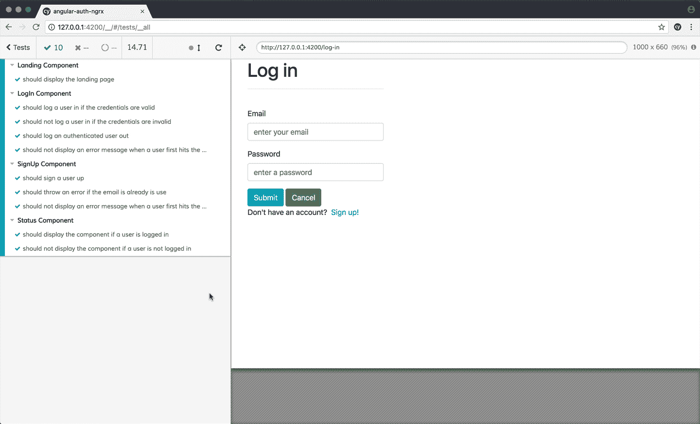
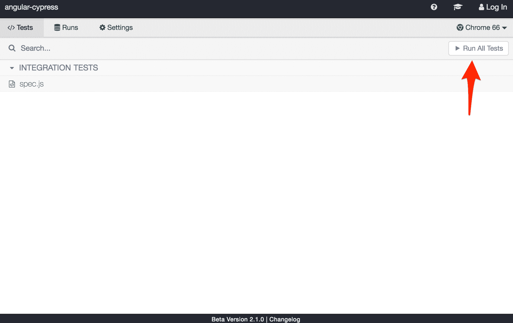
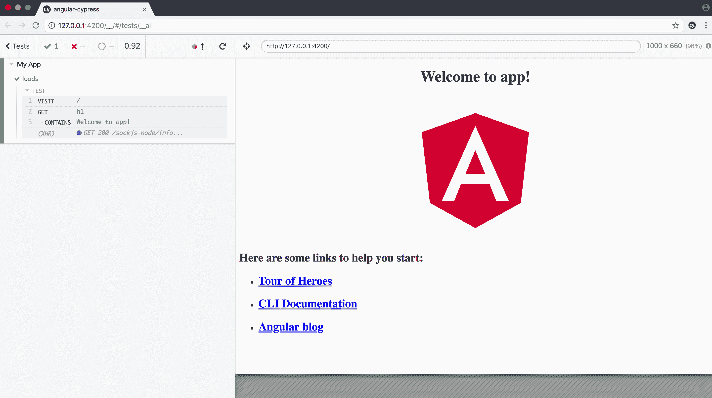
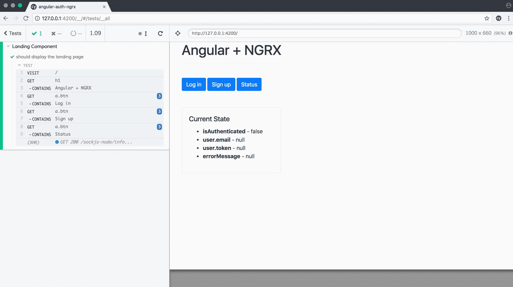
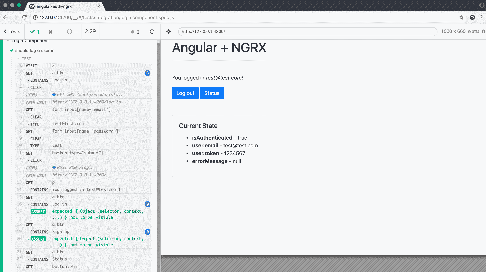
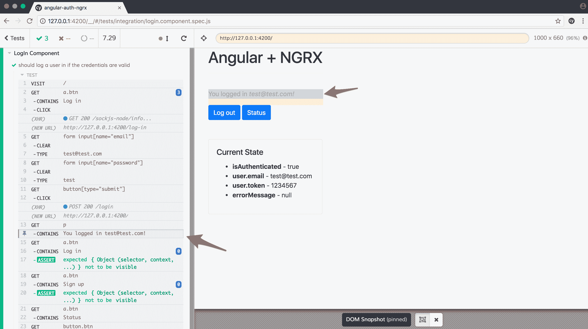
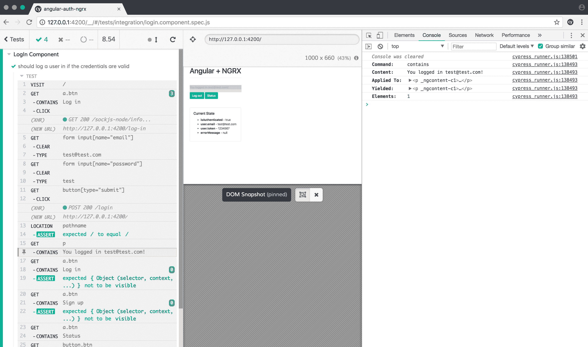
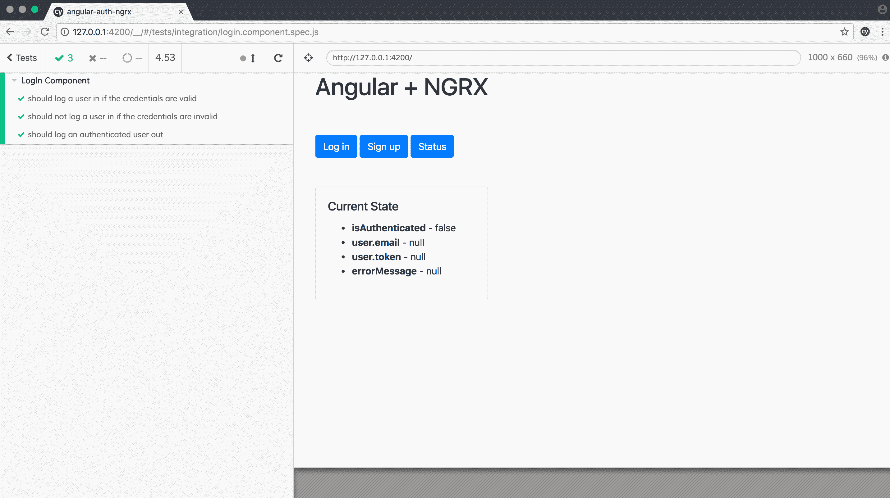
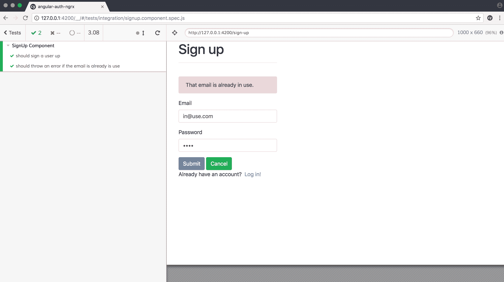
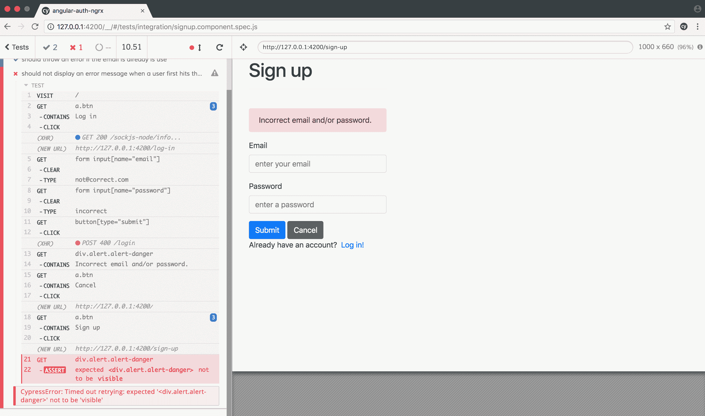

# 用 Cypress 和 Docker 测试角度

> 原文：<https://testdriven.io/blog/testing-angular-with-cypress-and-docker/>

Cypress 是一个强大的测试框架，它使得编写端到端的测试变得很快，只需要很少的设置。

这篇文章详细介绍了如何使用 Cypress 和 Docker 为 Angular 应用程序添加端到端(E2E)测试。我们将着眼于向一个新的和现有的 Angular 项目添加测试，以及将 Cypress 合并到您与 Docker 的持续集成流程中。



*依赖关系:*

*   cypress 2 . 1 . 0 版
*   Angular CLI 版本 1.7.3 (Angular 版本 5.2.0)
*   坞站 v18.03.1-ce
*   节点 v10.0.0

## 目标

本教程结束时，您将能够...

1.  将 Cypress 添加到新的和现有的角度项目中
2.  使用端到端测试测试 Angular 应用程序
3.  设置 Cypress 从 Docker 容器运行
4.  将 Cypress 集成到一个持续的集成过程中

## 新角度项目

这一部分着眼于如何将 Cypress 添加到新的 Angular 项目中。

如果您还没有安装 [Angular CLI](https://cli.angular.io/) ,则从全局安装开始，然后创建一个新的 Angular 项目:

```py
`$ npm install -g @angular/[[email protected]](/cdn-cgi/l/email-protection)
$ ng new angular-cypress
$ cd angular-cypress` 
```

运行服务器:

在浏览器中导航至 [http://localhost:4200](http://localhost:4200) 。您应该看到“欢迎使用应用程序！”带棱角标志的信息。完成后杀死服务器。

然后，安装 Cypress:

打开 Cypress 测试运行器:

```py
`$ ./node_modules/.bin/cypress open` 
```

由于这是我们第一次运行测试运行程序，Cypress 将自动搭建一个文件夹结构:

```py
`└─── cypress
    ├── fixtures
    │   └── example.json
    ├── integration
    │   └── example_spec.js
    ├── plugins
    │   └── index.js
    └── support
        ├── commands.js
        └── index.js` 
```

它还将向项目根添加一个空的 *cypress.json* 配置文件。

> 查看官方 Cypress [文档](https://docs.cypress.io)中的[编写和组织测试](https://docs.cypress.io/guides/core-concepts/writing-and-organizing-tests.html)，以获得关于上述文件夹结构的更多信息。

值得注意的是，此时我们已经可以开始编写和运行测试了。Cypress 附带了启动和运行所需的一切，无需任何配置！

最后，移除示例规范文件-*cypress/integration/example _ spec . js*。在它的位置，添加一个 *spec.js* 文件:

```py
`describe('My App',  ()  =>  { it('loads',  ()  =>  { cy.visit('/'); cy.get('h1').contains('Welcome to app!'); }); });` 
```

> Cypress 对 TypeScript 有[支持](https://docs.cypress.io/guides/tooling/typescript-support.html)，但是我遇到了许多类型定义冲突。截至发稿时，GitHub 上有一个[公开](https://github.com/Microsoft/TypeScript/issues/22331)问题来解决这个问题。

这是一个基本的测试规范文件，它打开主页面并确认页面加载，并且有一个带有`Welcome to app!`文本的`H1`标签。

命令:

1.  `visit()`访问提供的网址。
2.  `get()`通过选择器查询元素。
3.  `contains()`获取包含文本的元素。这也是一个[内置的](https://docs.cypress.io/guides/core-concepts/introduction-to-cypress.html#Default-Assertions)断言。

> 关于这些命令的更多信息，请查看 Cypress [API](https://docs.cypress.io/api/table-of-contents) 。

赛普拉斯在引擎盖下用一把[摩卡](https://mochajs.org/)的叉子作为它的测试者，还有[柴](https://www.chaijs.com/)作为断言，[西农](https://sinonjs.org/)作为嘲讽和揶揄。因此，如果你过去用过摩卡或茉莉，你应该会觉得`describe`和`it`块很熟悉。

通过更新项目根目录中的 *cypress.json* 文件，设置`baseUrl`并关闭视频录制:

```py
`{ "baseUrl":  "http://127.0.0.1:4200", "videoRecording":  "false" }` 
```

然后 Cypress 会在`cy.visit()`中的 URL 前面加上`baseUrl`。

在一个终端窗口运行 Angular 应用程序:

然后，在另一个终端窗口中打开测试运行程序:

```py
`$ ./node_modules/.bin/cypress open` 
```

测试在一个[电子](https://electronjs.org/)应用程序中运行，该应用程序将你的测试与被测应用程序并排显示。单击“运行所有测试”按钮开始新的测试运行:



Cypress 将推出一个新的用户界面，它将完成规格文件中的每一步:



在运行器激活的情况下，Cypress 会监视您的代码，并且会在发生更改时重新运行测试。试试吧！对*src/app/app . component . html*模板中的`<h1></h1>`元素进行快速更改，以观察测试的中断。

恢复您刚才所做的更改，以便再次通过测试，然后在继续之前停止测试运行程序和 Angular development server。

## CI 的 Docker

让我们将 Docker 添加到组合中，以简化持续集成环境的测试——如 [Jenkins](https://jenkins.io/) 、 [Travis CI](https://travis-ci.org/) 或 [Circle](https://circleci.com/) 。在这些环境中，我们希望在一个容器中提供 Angular 应用程序，在另一个容器中运行 Cypress 测试。

添加一个 *Dockerfile* :

```py
`#########################
### build environment ###
#########################

# base image
FROM node:9.6.1 as builder

# install chrome for protractor tests
RUN wget -q -O - https://dl-ssl.google.com/linux/linux_signing_key.pub | apt-key add -
RUN sh -c 'echo "deb [arch=amd64] http://dl.google.com/linux/chrome/deb/ stable main" >> /etc/apt/sources.list.d/google.list'
RUN apt-get update && apt-get install -yq google-chrome-stable

# set working directory
RUN mkdir /usr/src/app
WORKDIR /usr/src/app

# add `/usr/src/app/node_modules/.bin` to $PATH
ENV PATH /usr/src/app/node_modules/.bin:$PATH

# install and cache app dependencies
COPY package.json /usr/src/app/package.json
RUN npm install
RUN npm install -g @angular/[[email protected]](/cdn-cgi/l/email-protection) --unsafe

# add app
COPY . /usr/src/app

# run tests
RUN ng test --watch=false

# generate build
RUN npm run build

##################
### production ###
##################

# base image
FROM nginx:1.13.9-alpine

# copy artifact build from the 'build environment'
COPY --from=builder /usr/src/app/dist /usr/share/nginx/html

# expose port 80
EXPOSE 80

# run nginx
CMD ["nginx", "-g", "daemon off;"]` 
```

在这里，使用 Docker [多级构建](https://docs.docker.com/develop/develop-images/multistage-build/)，我们创建了一个用于构建 Angular 应用程序的临时映像。角度构建过程完成后，静态文件被复制到生产映像，临时映像被丢弃。

> 有关这方面的更多信息，请查看[dockering an Angular App](https://mherman.org/blog/2018/02/26/dockerizing-an-angular-app)的博文。

下一步，添加一个*坞站-复合. yml* 文件:

```py
`version:  '3.6' services: angular: build: context:  . dockerfile:  Dockerfile ports: -  '80:80'` 
```

构建映像并旋转容器:

```py
`$ docker-compose up -d --build` 
```

一旦启动，确保应用程序在 [http://localhost](http://localhost) 上运行。

同样，我们将在一个单独的容器中运行 Cypress 测试，所以添加一个名为 *Dockerfile-cypress* 的新 Dockerfile:

```py
`# base image
FROM  cypress/browsers:chrome65-ff57 # set working directory
RUN  mkdir  /usr/src/app WORKDIR  /usr/src/app # install cypress
RUN  npm  install  cypress@2.1.0 # copy cypress files and folders
COPY  cypress  /usr/src/app/cypress COPY  cypress.json  /usr/src/app/cypress.json # confirm the cypress install
RUN  ./node_modules/.bin/cypress  verify` 
```

> 查看官方 [Cypress Docker Images](https://github.com/cypress-io/cypress-docker-images) repo，了解更多关于可用基本图像的信息。

像这样更新 *docker-compose.yml* 文件:

```py
`version:  '3.6' services: angular: build: context:  . dockerfile:  Dockerfile ports: -  '80:80' cypress: build: context:  . dockerfile:  Dockerfile-cypress depends_on: -  angular network_mode:  'host'` 
```

注意[网络模式](https://docs.docker.com/compose/compose-file/#network_mode)。通过将其设置为`host`，Cypress 容器将能够从主机访问 localhost。查看[这个](https://stackoverflow.com/questions/24319662/from-inside-of-a-docker-container-how-do-i-connect-to-the-localhost-of-the-mach)堆栈溢出问题了解更多信息。

现在，当我们运行测试时，我们需要[覆盖 *cypress.json* 文件中设置的`baseURL`:](https://docs.cypress.io/guides/references/configuration.html#Overriding-Options)

```py
`$ docker-compose run cypress ./node_modules/.bin/cypress run \
    --config baseUrl=http://127.0.0.1` 
```

> 值得一提的是，您还可以将一个不同的配置文件复制到容器中，该配置文件是特定于使用 Docker 和/或在 CI 环境中运行测试的，如下所示:

```py
`COPY cypress-ci.json /usr/src/app/cypress.json` 
```

测试应该通过:

```py
`(Tests Starting)

My App
  ✓ loads (679ms)

1 passing (792ms)

(Tests Finished)

- Tests:           1
- Passes:          1
- Failures:        0
- Pending:         0
- Duration:        0 seconds
- Screenshots:     0
- Video Recorded:  false
- Cypress Version: 2.1.0

(All Done)` 
```

把容器拿下来:

## 特拉维斯·CI

接下来，让我们使用 Travis CI 进行持续集成。向项目根目录添加一个 *.travis.yml* 文件:

```py
`language:  node_js node_js: -  10 services: -  docker env: global: -  DOCKER_COMPOSE_VERSION=1.21.1 before_install: -  sudo rm /usr/local/bin/docker-compose -  curl -L https://github.com/docker/compose/releases/download/${DOCKER_COMPOSE_VERSION}/docker-compose-`uname -s`-`uname -m` > docker-compose -  chmod +x docker-compose -  sudo mv docker-compose /usr/local/bin before_script: -  sleep 3 -  docker-compose up -d --build script: -  docker-compose run cypress ./node_modules/.bin/cypress run --config baseUrl=http://127.0.0.1 after_script: -  docker-compose down` 
```

如果你想测试一下，在 GitHub 上创建一个新的 repo，[为这个 repo 启用](https://docs.travis-ci.com/user/getting-started) Travis，然后推上你的代码。

至此，让我们继续向现有的 Angular 项目添加 Cypress 测试。

## 现有角度项目

在这一节中，我们将把 Cypress 添加到 Angular 项目中，该项目已经构建了基于令牌的认证。app 本身来自 Angular 中的[认证与 NGRX](http://mherman.org/blog/2018/04/17/authentication-in-angular-with-ngrx) 博文。代码中有一个小错误，我们将用 Cypress 来充实它。

首先克隆项目并安装依赖项:

```py
`$ git clone https://github.com/mjhea0/angular-auth-ngrx
$ cd angular-auth-ngrx
$ npm install` 
```

该应用程序需要具有以下路由的后端:

| 统一资源定位器 | HTTP 动词 | 行动 |
| --- | --- | --- |
| http://localhost:1337/register | 邮政 | 注册新用户 |
| http://localhost:1337/login | 邮政 | 让用户登录 |
| http://本地主机:1337/status | 得到 | 获取用户状态 |

我们将使用一个生成伪令牌的伪后端来测试前端的功能。在新的终端窗口中克隆 repo，安装依赖项，启动应用程序:

```py
`$ git clone https://github.com/testdrivenio/fake-token-api
$ cd fake-token-api
$ npm install
$ npm start` 
```

旋转角度应用程序:

导航到 [http://localhost:4200](http://localhost:4200) 。确保您可以注册并使用以下凭据登录:

让开发服务器保持运行。

## 添加柏树

安装 Cypress 并在新的终端窗口中打开测试运行程序:

移除示例规范文件并更新 *cypress.json* :

```py
`{ "baseUrl":  "http://127.0.0.1:4200", "videoRecording":  false }` 
```

让我们编写一些测试来确保:

1.  主页面加载
2.  用户可以注册
3.  用户可以登录
4.  只有经过认证的用户才能查看`/status`路线

我们将按组件对其进行分类:

1.  登陆
2.  注册
3.  签约雇用
4.  状态

### 测试:着陆组件

添加一个新的规格文件-*landing . component . spec . js*:

```py
`describe('Landing Component',  ()  =>  { it('should display the landing page',  ()  =>  { cy .visit('/') .get('h1').contains('Angular + NGRX') .get('a.btn').contains('Log in') .get('a.btn').contains('Sign up') .get('a.btn').contains('Status'); }); });` 
```

这里没有什么新东西，所以继续运行测试:



### 测试:登录组件

再次添加一个新的规范文件-*log in . component . spec . js*:

```py
`describe('LogIn Component',  ()  =>  { it('should log a user in',  ()  =>  { cy .visit('/') .get('a.btn').contains('Log in').click() .get('form input[name="email"]').clear().type('[[email protected]](/cdn-cgi/l/email-protection)') .get('form input[name="password"]').clear().type('test') .get('button[type="submit"]').click() .get('p').contains('You logged in [[email protected]](/cdn-cgi/l/email-protection)!') .get('a.btn').contains('Log in').should('not.be.visible') .get('a.btn').contains('Sign up').should('not.be.visible') .get('a.btn').contains('Status') .get('button.btn').contains('Log out'); }); });` 
```

在这个测试中，我们导航到主页，单击 Log in 按钮，提交带有正确凭证的表单，然后确认登录成功。

运行测试！



尝试将鼠标悬停在 UI 左侧的一个测试步骤上——它将显示该步骤的 DOM 快照。默认情况下，Cypress 会保存 50 张快照。例如，将鼠标悬停在`CONTAINS You logged in [[email protected]](/cdn-cgi/l/email-protection)!`步骤上。请注意，该元素现在是如何在右侧的应用程序中突出显示的:



您也可以打开开发人员工具来获取有关该步骤的更多信息:



最后，您可以使用调试器来停止正在运行的测试，检查变量的状态，进行更改，然后重新运行测试。

这些特性使得调试失败的测试变得容易。

接下来，让我们确保如果凭据不正确，用户不会登录。像这样更新规范:

```py
`describe('LogIn Component',  ()  =>  { it('should log a user in if the credentials are valid',  ()  =>  { cy .visit('/') .get('a.btn').contains('Log in').click() .get('form input[name="email"]').clear().type('[[email protected]](/cdn-cgi/l/email-protection)') .get('form input[name="password"]').clear().type('test') .get('button[type="submit"]').click(); cy .get('p').contains('You logged in [[email protected]](/cdn-cgi/l/email-protection)!') .get('a.btn').contains('Log in').should('not.be.visible') .get('a.btn').contains('Sign up').should('not.be.visible') .get('a.btn').contains('Status') .get('button.btn').contains('Log out'); }); it('should not log a user in if the credentials are invalid',  ()  =>  { cy .visit('/') .get('a.btn').contains('Log in').click() .get('form input[name="email"]').clear().type('[[email protected]](/cdn-cgi/l/email-protection)') .get('form input[name="password"]').clear().type('incorrect') .get('button[type="submit"]').click(); cy .get('p') .contains('You logged in [[email protected]](/cdn-cgi/l/email-protection)!') .should('not.be.visible'); cy .get('div.alert.alert-danger') .contains('Incorrect email and/or password.'); }); });` 
```

测试应该会通过。为了保持代码简洁，我们可以创建自己的[定制命令](https://docs.cypress.io/api/cypress-api/custom-commands.html)让用户登录。简而言之，Cypress 命令允许您创建自己的可重用动作。

更新*cypress/support/commands . js*:

```py
`Cypress.Commands.add('login',  (email,  password)  =>  { cy .visit('/') .get('a.btn').contains('Log in').click() .get('form input[name="email"]').clear().type(email) .get('form input[name="password"]').clear().type(password) .get('button[type="submit"]').click(); });` 
```

然后更新规格:

```py
`describe('LogIn Component',  ()  =>  { it('should log a user in if the credentials are valid',  ()  =>  { cy .login('[[email protected]](/cdn-cgi/l/email-protection)',  'test'); cy .location('pathname').should('eq',  '/') .get('p').contains('You logged in [[email protected]](/cdn-cgi/l/email-protection)!') .get('a.btn').contains('Log in').should('not.be.visible') .get('a.btn').contains('Sign up').should('not.be.visible') .get('a.btn').contains('Status') .get('button.btn').contains('Log out'); }); it('should not log a user in if the credentials are invalid',  ()  =>  { cy .login('[[email protected]](/cdn-cgi/l/email-protection)',  'incorrect'); cy .get('p') .contains('You logged in [[email protected]](/cdn-cgi/l/email-protection)!') .should('not.be.visible'); cy .location('pathname').should('eq',  '/log-in') .get('div.alert.alert-danger') .contains('Incorrect email and/or password.'); }); });` 
```

确保测试仍然通过。您是否注意到我们添加了一个带有`location()`的附加断言，以确保用户在成功登录后被正确重定向？

让我们再添加一个退出测试:

```py
`it('should log an authenticated user out',  ()  =>  { cy .login('[[email protected]](/cdn-cgi/l/email-protection)',  'test'); cy .get('p').contains('You logged in [[email protected]](/cdn-cgi/l/email-protection)!') .get('button.btn').contains('Log out').click() cy .location('pathname').should('eq',  '/') .get('h1').contains('Angular + NGRX') .get('a.btn').contains('Log in') .get('a.btn').contains('Sign up') .get('a.btn').contains('Status'); });` 
```



### 测试:注册组件

测试这个组件与登录组件非常相似。首先创建一个新的规范文件-*sign up . component . spec . js*。

测试:

```py
`describe('SignUp Component',  ()  =>  { it('should sign a user up',  ()  =>  { cy .signup('[[email protected]](/cdn-cgi/l/email-protection)',  'test'); cy .location('pathname').should('eq',  '/') .get('p').contains('You logged in [[email protected]](/cdn-cgi/l/email-protection)!') .get('a.btn').contains('Log in').should('not.be.visible') .get('a.btn').contains('Sign up').should('not.be.visible') .get('a.btn').contains('Status') .get('button.btn').contains('Log out'); }); it('should throw an error if the email is already is use',  ()  =>  { cy .signup('[[email protected]](/cdn-cgi/l/email-protection)',  'test'); cy .get('p') .contains('You logged in [[email protected]](/cdn-cgi/l/email-protection)!') .should('not.be.visible'); cy .location('pathname').should('eq',  '/sign-up') .get('div.alert.alert-danger') .contains('That email is already in use.'); }); });` 
```

添加命令:

```py
`Cypress.Commands.add('login',  (email,  password)  =>  { cy .visit('/') .get('a.btn').contains('Log in').click() .get('form input[name="email"]').clear().type(email) .get('form input[name="password"]').clear().type(password) .get('button[type="submit"]').click(); }); Cypress.Commands.add('signup',  (email,  password)  =>  { cy .visit('/') .get('a.btn').contains('Sign up').click() .get('form input[name="email"]').clear().type(email) .get('form input[name="password"]').clear().type(password) .get('button[type="submit"]').click(); });` 
```

确保测试通过:



在继续之前的最后一件事，让我们确保注册表单的状态在初始加载时是正确的。

添加以下测试:

```py
`it('should not display an error message when a user first hits the component',  ()  =>  { cy .login('[[email protected]](/cdn-cgi/l/email-protection)',  'incorrect') .get('div.alert.alert-danger') .contains('Incorrect email and/or password.') .get('a.btn').contains('Cancel').click() .get('a.btn').contains('Sign up').click(); cy .get('div.alert.alert-danger') .should('not.be.visible'); });` 
```

该测试应该会失败:



向登录规范添加一个类似的测试:

```py
`it('should not display an error message when a user first hits the component',  ()  =>  { cy .signup('[[email protected]](/cdn-cgi/l/email-protection)',  'test') .get('div.alert.alert-danger') .contains('That email is already in use.') .get('a.btn').contains('Cancel').click() .get('a.btn').contains('Log in').click(); cy .get('div.alert.alert-danger') .should('not.be.visible'); });` 
```

它也应该失败。因此，我们在代码中发现了一个错误:消息状态没有在组件 init 上被清除。您可以自己解决这个问题，或者注释掉失败的断言。

### 测试:状态组件

添加 spec-*status . component . spec . js*:

```py
`describe('Status Component',  ()  =>  { it('should display the component if a user is logged in',  ()  =>  { cy .login('[[email protected]](/cdn-cgi/l/email-protection)',  'test'); cy .location('pathname').should('eq',  '/') .get('p').contains('You logged in [[email protected]](/cdn-cgi/l/email-protection)!') .get('a.btn').contains('Status').click(); cy .location('pathname').should('eq',  '/status') .get('h1').contains('Status Works!') .get('a.btn').contains('Home'); }); it('should not display the component if a user is not logged in',  ()  =>  { cy .visit('/') .get('a.btn').contains('Status').click(); cy .location('pathname').should('eq',  '/log-in') .get('h1').contains('Status Works!').should('not.be.visible'); }); });` 
```

确保所有测试都通过:


## 结论

就是这样！

Cypress 是一个强大的端到端测试工具。有了它，您可以在下载后几分钟内使用熟悉的断言库开始编写测试。测试在电子应用中实时运行，这使得调试失败的断言变得容易。这个项目背后有一个强大的社区，并且[文档](https://docs.cypress.io)非常优秀！

从以下回复中获取最终代码:

1.  [角柏](https://github.com/testdrivenio/angular-cypress)
2.  [角度认证 ngrx](https://github.com/mjhea0/angular-auth-ngrx)