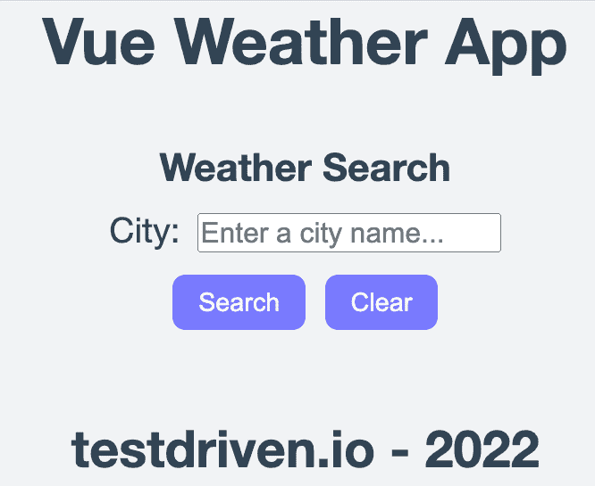
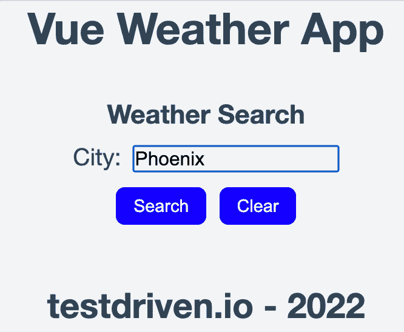
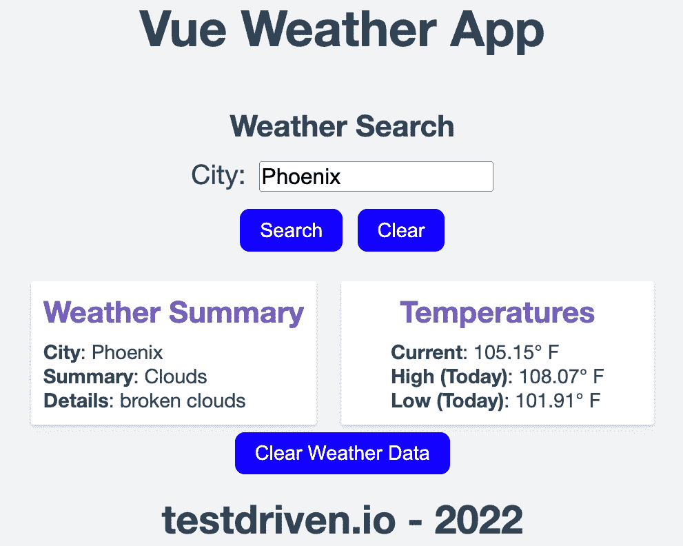
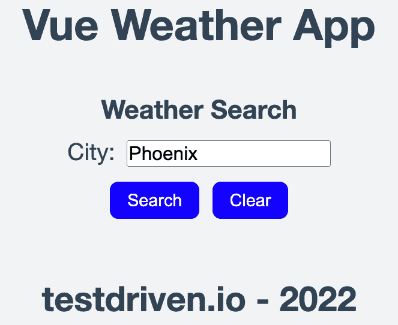
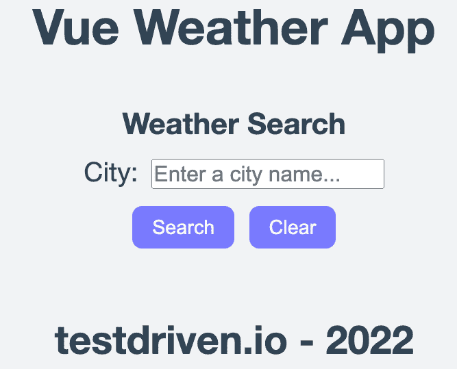

# Vue 组件单元测试指南

> 原文：<https://testdriven.io/blog/vue-unit-testing/>

这篇文章是单元测试组件的指南。

我们将首先看看为什么单元测试对于创建可维护的软件是重要的，以及你应该测试什么。然后，我们将详细介绍如何:

1.  为 Vue 组件创建并运行单元测试
2.  测试 Vue 组件的不同方面
3.  使用模拟来测试异步功能
4.  检查单元测试的代码覆盖率
5.  构建您的单元测试文件

> 如果你有兴趣了解更多关于 Vue 的知识，可以看看我的课程:[通过构建和部署 CRUD 应用](/courses/learn-vue/)来学习 Vue。

*依赖关系*:

本文中使用的 Vue Weather App 项目的源代码(以及详细的安装说明)可以在 GitLab 上找到: [Vue Weather App](https://gitlab.com/patkennedy79/vue-weather-app) 。

* * *

这是测试 Vue 应用的两部分系列的第一部分:

1.  [单元测试 Vue 组件指南](/blog/vue-unit-testing/)(本文！)
2.  [测试 Vue 中的 Pinia 数据存储](/blog/vue-pinia-testing/)

## 目标

完成本文后，您应该能够:

1.  解释为什么单元测试很重要
2.  描述你应该(和不应该)单元测试什么
3.  为 Vue 组件开发单元测试套件
4.  为 Vue 项目运行单元测试
5.  利用单元测试套件中的`beforeEach()`和`afterEach()`函数
6.  编写单元测试来测试 Vue 组件的实现细节
7.  编写单元测试来测试 Vue 组件的行为方面(点击事件等)。)
8.  解释嘲讽如何帮助简化单元测试
9.  编写模拟库和测试异步函数的单元测试
10.  检查单元测试的代码覆盖率
11.  为测试 Vue 组件开发一个结构良好的单元测试文件

## 为什么要进行单元测试？

总的来说，测试有助于确保你的应用程序能像最终用户期望的那样工作。

具有高测试覆盖率的软件项目从来都不是完美的，但是它是软件质量的一个很好的初始指示器。此外，可测试的代码通常是一个好的软件架构的标志，这就是高级开发人员在整个开发生命周期中考虑测试的原因。

测试可以分为三个层次:

1.  单位
2.  综合
3.  端到端

单元测试测试独立于依赖项的单个代码单元的功能。它们是防止代码库中出现错误和不一致的第一道防线。单元测试是测试驱动开发过程的基础部分。

单元测试提高了代码的可维护性。

可维护性指的是对您的代码或将来需要更新您的代码的其他开发人员进行错误修复或增强。

单元测试应该与[持续集成](https://en.wikipedia.org/wiki/Continuous_integration) (CI)过程相结合，以确保您的单元测试不断地被执行，最好是在每次提交到您的存储库时。一套可靠的单元测试对于在最终用户在生产中遇到缺陷之前，在开发过程的早期快速捕捉缺陷是至关重要的。

## 测试什么

你应该测试什么？或者，更重要的是:你不应该测试什么？

对于单元测试，有三种类型的测试需要考虑:

1.  **实现细节**:组件用来根据给定的输入产生结果的底层业务逻辑
2.  **公共接口/设计合同**:特定的输入(或道具，在这种情况下)产生特定的结果
3.  **副作用**:“如果这样，那就那样”；例如，当点击一个按钮时，会发生一些事情

既然你不能测试所有的东西，你应该关注什么？

重点测试最终用户将与之交互的输入和输出。你的产品的用户体验是最重要的！

1.  **输入**:数据、道具、用户交互、生命周期方法、数据存储([皮尼亚](https://pinia.vuejs.org/) / [Vuex](https://vuex.vuejs.org/) )、路线参数、查询字符串
2.  **输出**:渲染输出、事件、数据结果、数据存储(Pinia/Vuex)更新、调度

通过集中测试软件模块的输入/输出(例如，Vue 组件)，您正在测试最终用户将体验的关键方面。

软件模块中可能有其他复杂的内部逻辑，需要进行单元测试，但是这些类型的测试很可能需要在代码重构期间进行更新。

## 应用概述

在讨论如何对 Vue 组件进行单元测试之前，我想简单介绍一下我们将要测试的 Vue 天气应用。

在克隆存储库之后，安装依赖项，并添加 API 密钥。

> 查看项目的[自述文件](https://gitlab.com/patkennedy79/vue-weather-app/-/blob/main/README.md)以获得更多关于从 Open Weather 创建和添加 API 密钥的信息。

完成后，可以通过启动开发服务器在本地计算机上运行 Vue Weather 应用程序:

应用程序构建完成后，您将看到类似于以下内容的成功消息:

```
`vite v2.9.14 dev server running at:

 > Local: http://localhost:3000/
 > Network: use `--host` to expose

 ready in 543ms.` 
```

此时，开发服务器将启动并运行。你可以通过在你最喜欢的网络浏览器中导航到 [http://localhost:3000](http://localhost:3000) 来查看 Vue 应用。第一次加载 app 时，没有数据显示；您将会看到一个输入字段，用于输入您想要获取天气信息的城市:



如果没有输入任何数据，“搜索”和“清除”按钮都将被禁用。

一旦您开始输入一个城市的数据(一旦添加了第一个字符)，“搜索”和“清除”按钮都将被启用:



如果您在输入有效城市后点击“搜索”，将显示该城市的天气数据:



此时，单击“清除天气数据”按钮将会清除天气数据:



但是，输入的城市将保留在输入字段中。

如果您现在单击“清除”,输入字段将被清除,“搜索”和“清除”按钮将再次被禁用:



如果输入无效城市会怎样？如果你在“清除天气数据”前点击“清除”会怎样？你还能找到 app 的哪些状态？

## Vue 中的单元测试

因为组件是 Vue(实际上是任何 [SPA](https://en.wikipedia.org/wiki/Single-page_application) 框架)的组成部分，所以它们是整个应用程序中最关键的部分。所以，把分配给你的大部分测试时间花在编写测试应用组件的单元测试上。

根据我对 Vue 组件进行单元测试的经验，我发现测试工具和框架——Vite 和 Vitest——满足了良好测试环境的关键方面:

*   编写测试既简单又有趣
*   测试可以快速编写
*   可以用一个命令来执行测试
*   测试运行迅速

希望你会发现对你的 Vue 组件进行单元测试是一种愉快的经历，因为我认为这是鼓励更多测试的关键。

我们将使用两种工具对 Vue 组件进行单元测试:

1.  [Vitest](https://vitest.dev) -单元测试框架
2.  Vue 测试工具-Vue 的单元测试工具库

Vitest 是一个单元测试框架，其目标是与框架无关的，因此它可以用于测试 Vue、React、Svelte、Lit 和其他项目。Vitest 被配置为与 Vite 一起运行，这导致了**快速的**测试执行。

> 如果您熟悉 Jest，切换到使用 Vitest 非常简单，因为 Vitest 的 API 与 Jest 兼容。

为 Vue 组件编写单元测试时，Vitest 和 Vue 测试实用程序提供了以下功能:

**Vitest**

*   运行测试和检查测试覆盖率的命令行工具
*   直观地查看测试结果和覆盖率结果的用户界面
*   编写单元测试的函数(`it`，`describe`)
*   对照期望值进行检查的功能(`expect`、`toMatch`、`toContain`等)。)
*   嘲讽(`mockResolvedValue`，`mockRejectedValue`)
*   设置(`beforeEach`、`beforeAll` ) /拆卸(`afterEach`、【T3”)

**vista 测试有用**

*   安装组件(`mount`、`shallowMount`)
*   设置道具数据(`setProps`)
*   寻找用于测试的 HTML 组件(`findAll('h2')`)
*   清除所有承诺的实用程序(`flushPromises()`)
*   触发点击事件的实用程序(`trigger`)
*   检查发出事件的实用程序(`emitted`)

> Vitest 提供了编写单元测试的通用功能，而 Vue Test Utils 提供了特定于 Vue 的测试工具。

### 单元测试概述

首先，让我们讨论一下 Vue 中单元测试的命名约定。单元测试文件应该采用以下格式:

> 根据 [Vue 风格指南](https://v2.vuejs.org/v2/style-guide/?redirect=true#Multi-word-component-names-essential)，组件名应该是多个单词(`WeatherHeader`而不是仅仅`Header`)，以防止与 HTML 元素冲突。

通常，Vue 项目中的每个组件都应该有一个单元测试文件。在每个单元测试文件中，可以有单个单元测试套件或多个单元测试套件。

单元测试文件应该放在*组件*文件夹( *src/components/__tests__* )的子文件夹中:

```
`$ tree -d -L 2
.
├── node_modules
├── public
├── src
    ├── assets
    └── components
        └── __tests__` 
```

### 运行测试

Vitest 可用于运行单元测试，如下所示:

```
`$ npm run test:unit

✓ src/components/__tests__/WeatherFooter.spec.js (1)
✓ src/components/__tests__/WeatherHeader.spec.js (1)
✓ src/components/__tests__/WeatherResult.spec.js (3)
✓ src/components/__tests__/WeatherBanner.spec.js (5)
✓ src/components/__tests__/WeatherSearch.spec.js (5)
✓ src/components/__tests__/App.spec.js (7)

Test Files  6 passed (6)
    Tests  22 passed (22)
     Time  2.38s (in thread 640ms, 371.13%)` 
```

> 通过`npm`为你的 Vue 项目运行的所有可用命令都在 *package.json* 的`scripts`字段中定义。

Vitest 的默认配置是在[监视模式](https://vitest.dev/guide/features.html#watch-mode)下运行测试，这意味着每次保存到一个适用的文件时，测试套件都会被重新执行。要更改此配置，使 Vitest 只运行一次(没有“监视模式”)，请更新 *package.json* 中的`test:unit`配置，以包含`run`参数:

```
`"test:unit":  "vitest run --environment jsdom",` 
```

## 例子

使用 [Vue 天气应用](https://gitlab.com/patkennedy79/vue-weather-app)，让我们看一些测试 Vue 组件的例子。

### 示例 1 -单元测试介绍

让我们直接看一个 Vue 中单元测试文件的例子！第一个单元测试文件位于*src/components/_ _ tests _ _/weather header . spec . js*中，它测试`WeatherHeader`组件:

```
`import  {  describe,  it,  expect  }  from  'vitest' import  {  shallowMount  }  from  '@vue/test-utils' import  WeatherHeader  from  '../WeatherHeader.vue' describe('WeatherHeader.vue Test',  ()  =>  { it('renders message when component is created',  ()  =>  { // render the component const  wrapper  =  shallowMount(WeatherHeader,  { propsData:  { title:  'Vue Project' } }) // check that the title is rendered expect(wrapper.text()).toMatch('Vue Project') }) })` 
```

#### 增加

该文件中的第一行从 Vitest 中导入该文件中使用的测试函数。

> 如果你想让 Vitest API 全球可用(比如 Jest 是如何工作的)，那么在 *vite.config.js* 中的`defineConfig()`函数中添加`test: {globals: true}`。更多详情，请查看 Vitest [文档](https://vitest.dev/config/#globals)。

该文件的第二行从 Vue Test Utils 库中导入了一个名为`shallowMount`的函数。“安装”的概念意味着加载单个组件，以便能够对其进行测试。在 Vue 测试工具中有两种方法:

*   `shallowMount()` -为 Vue 组件创建一个`wrapper`，但是带有存根子组件
*   `mount()` -为 Vue 组件创建一个`wrapper`，包括安装任何子组件

因为我们的重点是测试单个组件(`WeatherHeader`组件)，所以我们将使用`shallowMount()`。

> `shallowMount()`更适合单独测试单个组件，因为子组件被剔除了。这是**单元**测试的理想情况。
> 
> 此外，使用`shallowMount()`来测试一个有很多子组件的组件可以改善单元测试的执行时间，因为渲染子组件没有成本(就时间而言)。
> 
> 当你想要测试子组件的行为时,`mount()`是有用的。

第三行导入将要测试的 Vue 组件， *WeatherHeader.vue* 。

#### 描述块

在`import`语句之后，有一个定义单元测试套件的`describe`块。

在一个单元测试文件中，可以有多个定义不同单元测试套件的`describe`块。类似地，每个`describe`块可以包含多个单元测试，其中每个单元测试由一个`it`块定义。

我认为这种区别是:

*   块单元测试套件
*   `it`块-单个单元测试功能

使用 Vitest 进行单元测试的好处是有几个内置的鼓励添加注释的方法。例如，`describe`的第一个参数应该清楚地解释哪个 Vue 组件正在被测试:

```
`describe('WeatherHeader.vue Test',  ()  =>  {  ...  })` 
```

对于每个`it`块，第一个参数是测试函数的描述，它应该是这个特定测试正在做什么的简短描述。在上面的例子中，`it`块测试组件“在创建组件时呈现消息”。

#### 预计

至于实际的单元测试，第一步是安装 Vue 组件，以便可以对其进行测试:

```
`// render the component const  wrapper  =  shallowMount(WeatherHeader,  { propsData:  { title:  'Vue Project' } })` 
```

`shallowMount`函数返回一个`wrapper`对象，它包含已安装的组件和测试该组件的方法。`wrapper`对象允许我们测试 Vue 组件生成的 HTML 的所有方面以及 Vue 组件的所有属性(比如数据)。

此外，传递到`WeatherHeader`组件中的 props 作为第二个参数传递给`shallowMount()`。

单元测试中执行的实际检查是:

```
`// check that the title is rendered expect(wrapper.text()).toMatch('Vue Project')` 
```

这一行使用`wrapper`检查组件生成的标题是否为‘Vue Project’。由于该检查进行字符串比较，所以建议使用`toMatch()`。

#### 测试助手

虽然单元测试文件中对组件`WeatherHeader`的检查只是检查字符串值，但是 Vitest 中有很多选项可以用来执行检查:

*   布尔值:
    *   `toBeTruthy()` -检查变量/语句是否为真
    *   `toBeFalsy()` -检查变量/语句是否为假
*   已定义:
    *   `toBeNull()` -检查变量是否只匹配空值
    *   `toBeUndefined()` -检查变量是否未定义
    *   `toBeDefined()` -检查变量是否已定义
*   数字:
    *   `toBeGreaterThan()` -检查数字是否大于指定值
    *   `toBeGreaterThanOrEqual()` -检查数字是否大于或等于指定值
    *   `toBeLessThan()` -检查数字是否小于指定值
    *   `toBeLessThanOrEqual()` -检查数字是否小于或等于指定值
    *   `toBe()`和`toEqual()` -检查数字是否与指定的值相同(这些函数对于数字是等效的)
    *   `toBeCloseTo()` -检查一个数字是否等于小容差内指定的值(对浮点数有用)
*   字符串:
    *   `toMatch()` -检查一个字符串是否等于指定的值(Regex 可以用作指定的值！)
*   数组:
    *   `toContain()` -检查数组是否包含指定的值

此外，`not`限定符可以用于大多数检查:

```
`expect(wrapper.text()).not.toMatch('Node Project')` 
```

有关可用检查的完整列表，请查看 [Vitest API 参考](https://vitest.dev/api/#expect)。

### 示例 2 -测试初始条件

这个例子展示了如何测试`WeatherResult`组件的初始条件(或状态)。

下面是单元测试文件的概要(在*src/components/_ _ tests _ _/weather result . spec . js*中定义):

```
`import  {  describe,  it,  expect,  beforeEach,  afterEach  }  from  'vitest' import  {  shallowMount,  flushPromises  }  from  '@vue/test-utils' import  WeatherResult  from  '@/components/WeatherResult.vue' describe('WeatherResult.vue Implementation Test',  ()  =>  { let  wrapper  =  null // SETUP - run before to each unit test beforeEach(()  =>  { // render the component wrapper  =  shallowMount(WeatherResult,  { propsData:  { city:  '', weatherSummary:  '', weatherDescription:  '', currentTemperature:  0.0, lowTemperature:  0.0, highTemperature:  0.0 } }) }) // TEARDOWN - run after to each unit test afterEach(()  =>  { wrapper.unmount() }) it('initializes with correct elements',  ()  =>  {  ...  }) it('processes valid props data',  async  ()  =>  {  ...  }) it('emits a custom event when the Clear Weather Data button is clicked',  ()  =>  {  ...  }) })` 
```

单元测试文件利用`shallowMount()`函数来呈现`WeatherResult`组件，因为这个组件是作为一个独立的组件来测试的。

#### 每个块之前和每个块之后

在单元测试套件中(在`describe`块中定义)，定义了两个新函数:

*   `beforeEach()` -在执行**之前被称为**的本单元测试套件内的每个**单元测试**
*   `afterEach()`——在执行完本单元测试套件内的**个**单元测试后，称为

 **`beforeEach()`函数用于在运行每个单元测试之前设置一致的状态。这个概念对于确保运行单元测试的顺序不会影响单元测试的整体结果非常重要。

在这个例子中，`beforeEach()`函数使用一组默认的属性数据来呈现组件:

```
`// SETUP - run before to each unit test beforeEach(()  =>  { // render the component wrapper  =  shallowMount(WeatherResult,  { propsData:  { city:  '', weatherSummary:  '', weatherDescription:  '', currentTemperature:  0.0, lowTemperature:  0.0, highTemperature:  0.0 } }) })` 
```

`afterEach()`函数用于清除单元测试期间执行的任何处理。

在这个例子中，`afterEach()`函数卸载单元测试中使用的`wrapper`，这样`wrapper`可以在`beforeEach()`中为下一个单元测试重新初始化:

```
`// TEARDOWN - run after to each unit test afterEach(()  =>  { wrapper.unmount() })` 
```

如果希望运行在整个单元测试套件运行之前或之后执行的代码，可以使用:

```
`beforeAll(()  =>  { /* Runs before all tests */ }) afterAll(()  =>  { /* Runs after all tests */ })` 
```

#### 预计

第一个单元测试检查`WeatherResult`组件的初始状态:

```
`it('initializes with correct elements',  ()  =>  { // check that the heading text is rendered expect(wrapper.findAll('h2').length).toEqual(2) expect(wrapper.findAll('h2').at(0).text()).toMatch('Weather Summary') expect(wrapper.findAll('h2').at(1).text()).toMatch('Temperatures') // check that 6 fields of data for the temperature are displayed expect(wrapper.findAll('p').length).toEqual(6) expect(wrapper.findAll('p').at(0).text()).toMatch('City:') expect(wrapper.findAll('p').at(1).text()).toMatch('Summary:') expect(wrapper.findAll('p').at(2).text()).toMatch('Details:') expect(wrapper.findAll('p').at(3).text()).toMatch('Current: 0° F') expect(wrapper.findAll('p').at(4).text()).toMatch('High (Today): 0° F') expect(wrapper.findAll('p').at(5).text()).toMatch('Low (Today): 0° F') })` 
```

检查:

1.  `expect` s 的第一部分检查两个标题(定义为`h2`元素)是否符合预期。
2.  `expect` s 的第二部分检查六个数据字段(定义为`p`元素)是否符合预期。

### 示例 3 -测试道具

第二个单元测试检查作为正确数据传入的有效数据是否被`WeatherResult`组件正确处理:

```
`it('processes valid props data',  async  ()  =>  { // Update the props passed in to the WeatherResult component wrapper.setProps({ city:  'Chicago', weatherSummary:  'Cloudy', weatherDescription:  'Cloudy with a chance of rain', currentTemperature:  45.1, lowTemperature:  42.0, highTemperature:  47.7 }) // Wait until the DOM updates await  flushPromises() // check that the prop data is stored as expected within the component expect(wrapper.vm.city).toMatch('Chicago') expect(wrapper.vm.weatherSummary).toMatch('Cloudy') expect(wrapper.vm.weatherDescription).toMatch('Cloudy with a chance of rain') expect(wrapper.vm.currentTemperature).toEqual(45.1) expect(wrapper.vm.lowTemperature).toBeCloseTo(42.0) expect(wrapper.vm.highTemperature).toBe(47.7) // check that the heading text is rendered expect(wrapper.findAll('h2').length).toEqual(2) expect(wrapper.findAll('h2').at(0).text()).toMatch('Weather Summary') expect(wrapper.findAll('h2').at(1).text()).toMatch('Temperatures') // check that 6 fields of data for the temperature are displayed expect(wrapper.findAll('p').length).toEqual(6) expect(wrapper.findAll('p').at(0).text()).toMatch('City: Chicago') expect(wrapper.findAll('p').at(1).text()).toMatch('Summary: Cloudy') expect(wrapper.findAll('p').at(2).text()).toMatch('Details: Cloudy with a chance of rain') expect(wrapper.findAll('p').at(3).text()).toMatch('Current: 45.1° F') expect(wrapper.findAll('p').at(4).text()).toMatch('High (Today): 47.7° F') expect(wrapper.findAll('p').at(5).text()).toMatch('Low (Today): 42° F') })` 
```

由于`beforeEach()`函数提供了一组默认的属性数据，我们需要使用`setProps()`函数覆盖属性数据。

为了确保 prop 数据在`WeatherResult`中引起预期的更新，测试需要等待所有的 DOM 更新生效:

```
`// Wait until the DOM updates await  flushPromises()` 
```

> 注意:只有用`async`定义函数时，才能使用`await`！

检查:

1.  随着道具数据的更新，我们可以通过检查数据元素(使用`wrapper.vm`)来检查道具数据是否正确地存储在`WeatherResult`组件中。
2.  `expect` s 的第二部分检查两个标题(定义为`h2`元素)是否符合预期。
3.  最后一组`expect`检查 prop 数据是否用于按预期设置六个数据字段(定义为`p`元素)。

### 示例 4 -测试用户输入(点击事件)

第三个单元测试检查当用户点击“清除天气数据”按钮时，`WeatherResult`组件发出了`clear-weather-data`事件:

```
`it('emits a custom event when the Clear Weather Data button is clicked',  ()  =>  { // trigger an event when the 'Clear Weather Data' button is clicked wrapper.findAll('button').at(0).trigger('click') // check that 1 occurrence of the event has been emitted expect(wrapper.emitted('clear-weather-data')).toBeTruthy() expect(wrapper.emitted('clear-weather-data').length).toBe(1) })` 
```

要触发点击事件，必须在`wrapper`中找到`button`元素，然后调用`trigger`函数来触发点击事件。

单击按钮后，单元测试会检查是否只发出了一个定制事件(名称为`clear-weather-data`)。

## 嘲弄的例子

在`App`组件中，当用户搜索一个城市的天气时，HTTP GET 调用 [Open Weather](https://openweathermap.org) 通过名为 [Axios](https://github.com/axios/axios) 的第三方库检索数据:

```
`const  searchCity  =  (inputCity)  =>  { // GET request for user data axios.get('http://api.openweathermap.org/data/2.5/weather?q='  +  inputCity  +  '&units=imperial&APPID='  +  openweathermapApiKey.value) .then((response)  =>  { // handle success console.log(response) weatherData.value.city  =  response.data.name weatherData.value.weatherSummary  =  response.data.weather[0].main weatherData.value.weatherDescription  =  response.data.weather[0].description weatherData.value.currentTemperature  =  response.data.main.temp weatherData.value.lowTemperature  =  response.data.main.temp_min weatherData.value.highTemperature  =  response.data.main.temp_max validWeatherData.value  =  true }) .catch((error)  =>  { // handle error messageType.value  =  'Error' messageToDisplay.value  =  'ERROR! Unable to retrieve weather data for '  +  inputCity  +  '!' console.log(error.message) resetData() }) .finally((response)  =>  { // always executed console.log('HTTP GET Finished!') }) }` 
```

当考虑如何测试 HTTP GET 调用时，两个场景浮现在脑海中，每个场景都测试实际 API 调用的副作用:

*   HTTP GET 响应成功(*快乐之路*)
*   HTTP GET 响应失败(*异常路径*)

当测试利用外部 API 的代码时，通常更容易的方法是不进行实际的调用，而是用一个模拟来代替调用。不过，这种方法有利也有弊。

**优点:**

1.  这些测试不依赖于网络请求
2.  如果 API 下降，它们也不会中断
3.  他们会跑得更快

**缺点:**

1.  每当 API 模式改变时，您都需要更新测试
2.  在微服务架构中，很难跟上 API 的变化
3.  模仿是一个很难理解的概念，它们会给你的测试套件增加很多混乱

> 在某些时候，您应该检查完全集成，以确保 API 响应的形式没有改变。

由于这篇文章关注的是单元测试，我们将**模仿**Axios 库。

模仿提供了一种模仿软件模块预期行为的方法。虽然嘲讽可以用在生产代码中(非常危险！)，它通常在开发和测试期间使用。

从外部 API 加载数据需要时间。虽然在这个应用程序中从 Open Weather 加载数据通常不到一两秒钟，但其他外部 API 可能会更耗时。此外，我们需要一种方法来轻松检查 HTTP GET 请求是否失败。因此，我们将添加模拟来指定 GET 请求将如何响应。

### 示例 5 -测试异步代码(成功案例)

组件的单元测试位于*src/components/_ _ tests _ _/app . spec . js*文件中。

首先，我们需要`import`Axios 库:

```
`import  {  describe,  it,  expect,  beforeEach,  afterEach,  vi  }  from  'vitest' import  {  shallowMount,  mount,  flushPromises  }  from  '@vue/test-utils' import  App  from  '../../App.vue' import  axios  from  'axios'` 
```

但是，我们不想像在源代码中那样使用实际的 Axios 库( *App.vue* )。相反，我们想创建一个 Axios 库的**模拟**，这样我们就不会实际调用外部 API:

```
`// Mock the axios library vi.mock("axios",  ()  =>  { return  { default:  { get:  vi.fn(), }, }; });` 
```

这个代码块告诉 Vitest 应该模拟`axios`库中的`get()`方法。

在单元测试文件(*src/components/_ _ tests _ _/app . spec . js*)中，对于`App`组件，我们是:

1.  模拟成功的 HTTP GET 请求
2.  模拟失败的 HTTP GET 请求

首先，让我们处理 HTTP GET 请求成功的名义情况。

```
`describe('Implementation Test for App.vue with Successful HTTP GET',  ()  =>  { let  wrapper  =  null beforeEach(()  =>  { const  responseGet  =  {  data: { name:  'Chicago', weather:  [ { main:  'Cloudy', description:  'Cloudy with a chance of rain' } ], main:  { temp:  56.3, temp_min:  53.8, temp_max:  58.6 } } } // Set the mock call to GET to return a successful GET response axios.get.mockResolvedValue(responseGet) // render the component wrapper  =  shallowMount(App) }) afterEach(()  =>  { axios.get.mockReset() wrapper.unmount() }) ... })` 
```

#### 每个块之前和每个块之后

在`beforeEach()`函数中，我们设置当`axios.get()`被调用时应该发生的响应。响应是预先录制的天气数据，看起来类似于我们从开放天气中获得的数据，如果我们实际上发出请求的话。这一节的重点是:

```
`// Set the mock call to GET to return a successful GET response axios.get.mockResolvedValue(responseGet)` 
```

这一行是关键，因为它让 Vitest 知道，当在`App`组件中调用`axios.get()`时，它应该返回`responseGet`数组，而不是实际使用 Axios 进行 HTTP GET 调用。

单元测试套件的下一部分定义了`afterEach()`函数:

```
`afterEach(()  =>  { axios.get.mockReset() wrapper.unmount() })` 
```

在每个单元测试执行后调用的`afterEach()`函数清除单元测试执行期间创建的`axios.get()`的模拟。这种方法是一种很好的实践，可以在运行一个测试之后清理掉所有的模拟，这样任何后续的测试都可以从一个已知的状态开始。

#### 预计

现在我们可以定义单元测试了:

```
`it('does load the weather data when a successful HTTP GET occurs',  async  ()  =>  { wrapper.vm.searchCity('Chicago') // Wait until the DOM updates await  flushPromises() expect(axios.get).toHaveBeenCalledTimes(1) expect(axios.get).toBeCalledWith(expect.stringMatching(/Chicago/)) // check that the user data is properly set expect(wrapper.vm.weatherData.city).toMatch('Chicago') expect(wrapper.vm.weatherData.weatherSummary).toMatch('Cloudy') expect(wrapper.vm.weatherData.weatherDescription).toMatch('Cloudy with a chance of rain') expect(wrapper.vm.weatherData.currentTemperature).toEqual(56.3) expect(wrapper.vm.weatherData.lowTemperature).toEqual(53.8) expect(wrapper.vm.weatherData.highTemperature).toEqual(58.6) expect(wrapper.vm.validWeatherData).toBe(true) })` 
```

因为我们已经经历了定义模拟和呈现组件的步骤(通过`shallowMount()`),所以这个单元测试可以集中在执行检查上。

单元测试通过调用`searchCity()`函数开始:

```
`wrapper.vm.searchCity('Chicago')` 
```

为了确保`searchCity()`函数在`App`组件中引起预期的更新，测试需要等待所有的承诺被解析，并且等待 DOM 更新生效:

```
`// Wait until all Promises are resolved and the DOM updates await  flushPromises()` 
```

我们检查了`axios.get()`只被调用了一次，并且 HTTP GET 调用包含了正确的城市名:

```
`expect(axios.get).toHaveBeenCalledTimes(1) expect(axios.get).toBeCalledWith(expect.stringMatching(/Chicago/))` 
```

为了非常彻底，天气数据还检查了在这个单元测试中呈现的`App`组件的实例，以确保它与从`axios.get()`的模拟返回的预先封装的数据相匹配:

```
`// check that the user data is properly set expect(wrapper.vm.weatherData.city).toMatch('Chicago') expect(wrapper.vm.weatherData.weatherSummary).toMatch('Cloudy') expect(wrapper.vm.weatherData.weatherDescription).toMatch('Cloudy with a chance of rain') expect(wrapper.vm.weatherData.currentTemperature).toEqual(56.3) expect(wrapper.vm.weatherData.lowTemperature).toEqual(53.8) expect(wrapper.vm.weatherData.highTemperature).toEqual(58.6) expect(wrapper.vm.validWeatherData).toBe(true)` 
```

### 示例 6 -测试异步代码(失败案例)

虽然测试事情是否按预期进行很好，但是检查我们的软件如何对负面情况做出反应也很重要。记住这一点，让我们创建第二个单元测试套件来检查失败的 HTTP GET 请求:

```
`describe('Implementation Test for App.vue with Failed HTTP GET',  ()  =>  {  ...  })` 
```

> 在一个单元测试文件( *.spec.js* )中包含多个单元测试套件没有任何问题。
> 
> 因为模拟是在`beforeEach()`函数中创建的，所以对于成功和失败的 HTTP GET 响应，需要有不同的`beforeEach()`实现的独立单元测试套件。

#### 每个块之前和每个块之后

这个单元测试套件中的`beforeEach()`函数非常不同:

```
`beforeEach(()  =>  { // Set the mock call to GET to return a failed GET request axios.get.mockRejectedValue(new  Error('BAD REQUEST')) // Render the component wrapper  =  shallowMount(App) })` 
```

我们现在返回的不是从`axios.get()`调用返回的响应，而是一个失败的`Promise`对象，其响应为“错误请求”。

这个单元测试套件的`afterEach()`函数与另一个单元测试套件相同:

```
`afterEach(()  =>  { axios.get.mockReset() wrapper.unmount() })` 
```

#### 预计

下面是测试失败的 HTTP GET 请求的单元测试函数:

```
`it('does not load the weather data when a failed HTTP GET occurs',  async  ()  =>  { wrapper.vm.searchCity('Chicago') expect(axios.get).toHaveBeenCalledTimes(1) expect(axios.get).toBeCalledWith(expect.stringMatching(/Chicago/)) // Wait until the DOM updates await  flushPromises() // Check that there is no user data loaded when the GET request fails expect(wrapper.vm.weatherData.city).toMatch(/^$/) expect(wrapper.vm.weatherData.weatherSummary).toMatch(/^$/) expect(wrapper.vm.weatherData.weatherDescription).toMatch(/^$/) expect(wrapper.vm.weatherData.currentTemperature).toEqual(0) expect(wrapper.vm.weatherData.lowTemperature).toEqual(0) expect(wrapper.vm.weatherData.highTemperature).toEqual(0) expect(wrapper.vm.validWeatherData).toBe(false) // check that the banner message indicates failure expect(wrapper.vm.messageToDisplay).toMatch('ERROR! Unable to retrieve weather data for Chicago!') expect(wrapper.vm.messageType).toMatch('Error') })` 
```

就像在前面的单元测试套件中一样，我们检查只有一个`axios.get()`实例被调用，然后检查没有天气数据被加载到`App`组件中。

## 代码覆盖率

在开发单元测试时，了解实际测试了多少源代码是件好事。这个概念被称为代码覆盖率。

> 我需要非常明确的是，拥有一组覆盖 100%源代码的单元测试并不意味着代码得到了正确的测试。
> 
> 这个度量意味着有很多单元测试，并且在开发单元测试上投入了大量的精力。单元测试的质量仍然需要通过代码检查来检查。
> 
> 另一个极端是最小集合(或者没有！)是一个非常糟糕的指标。

Vitest 通过使用`--coverage`标志来提供代码覆盖率。

为了方便地运行带有覆盖率结果的 Vitest，我喜欢在 *package.json* 的`script`部分包含以下项目:

```
`{ "name":  "vue-weather-app", "version":  "1.0.0", "scripts":  { ... "test:unit":  "vitest run --environment jsdom", "test:coverage":  "vitest run --environment jsdom --coverage", "test:ui":  "vitest --environment jsdom --coverage --ui" }, ... }` 
```

运行`npm run test:unit`时，执行单元测试:

```
`$ npm run test:unit
...
 ✓ src/components/__tests__/WeatherBanner.spec.js (5)
 ✓ src/components/__tests__/WeatherSearch.spec.js (5)
 ✓ src/components/__tests__/WeatherFooter.spec.js (1)
 ✓ src/components/__tests__/WeatherHeader.spec.js (1)
 ✓ src/components/__tests__/WeatherResult.spec.js (3)
 ✓ src/components/__tests__/App.spec.js (7)

Test Files  6 passed (6)
     Tests  22 passed (22)
      Time  2.81s (in thread 536ms, 524.89%)` 
```

当`npm run test:coverage`运行时，执行单元测试并报告覆盖率:

```
`$ npm run test:coverage
...
Test Files  6 passed (6)
     Tests  22 passed (22)
      Time  3.38s (in thread 660ms, 512.10%)

--------------------|---------|----------|---------|---------|-------------------
File                | % Stmts | % Branch | % Funcs | % Lines | Uncovered Line #s
--------------------|---------|----------|---------|---------|-------------------
All files           |   99.15 |    96.55 |     100 |   99.15 |
 src                |   97.31 |    85.71 |     100 |   97.31 |
  App.vue           |   97.31 |    85.71 |     100 |   97.31 | 60-63
 src/components     |     100 |      100 |     100 |     100 |
  WeatherBanner.vue |     100 |      100 |     100 |     100 |
  WeatherFooter.vue |     100 |      100 |     100 |     100 |
  WeatherHeader.vue |     100 |      100 |     100 |     100 |
  WeatherResult.vue |     100 |      100 |     100 |     100 |
  WeatherSearch.vue |     100 |      100 |     100 |     100 |
--------------------|---------|----------|---------|---------|-------------------` 
```

`npm run test:ui`将在您的默认 web 浏览器中加载测试和覆盖结果，这可以方便地直观地看到测试覆盖缺失的地方。

## 单元测试结构

在浏览了许多不同的单元测试文件之后，我推荐 Vue 组件的单元测试文件采用以下结构:

```
`import  {  describe,  it,  expect,  beforeEach,  afterEach,  vi  }  from  'vitest' import  {  shallowMount  }  from  '@vue/test-utils' import  App  from  '@/App.vue'  // Import Vue component to test import  axios  from  'axios'  // Import libraries to mock // Mock the axios library vi.mock("axios",  ()  =>  { return  { default:  { get:  vi.fn(), }, }; }); describe('Tests for the ... Component',  ()  =>  { let  wrapper  =  null beforeEach(()  =>  { // set any initial data and create the mocks of libraries // render the component wrapper  =  shallowMount(App) }) afterEach(()  =>  { axios.get.mockReset() wrapper.unmount() }) it('check successful events',  ()  =>  {  ...  }) it('check failure events',  ()  =>  {  ...  }) })` 
```

关键项目:

*   每个单元测试套件都有一组相关的单元测试
*   利用`beforeEach()`和`afterEach()`函数创建独立的单元测试函数
*   创建测试过的 Vue 组件中使用的任何库的模拟
*   在`beforeEach()`函数中呈现组件，并在单元测试函数中更新属性数据
*   利用`shallowMount()`而不是`mount()`来集中测试单个组件

## 结论

本文提供了单元测试 Vue 组件的指南，重点关注:

1.  为什么应该编写单元测试
2.  你应该(和不应该)单元测试什么
3.  如何编写单元测试

简单地说，当考虑测试什么时，重点测试输入和输出(实际结果)，而不是底层的业务逻辑(结果是如何产生的)。记住这一点，花一两分钟时间再次回顾示例，记下测试的输入和输出。

> 同样，如果你有兴趣了解更多关于 Vue 的知识，可以看看我的课程:[通过构建和部署 CRUD 应用](/courses/learn-vue/)来学习 Vue。

* * *

这是测试 Vue 应用的两部分系列的第一部分:

1.  [单元测试 Vue 组件指南](/blog/vue-unit-testing/)(本文！)
2.  [测试 Vue 中的 Pinia 数据存储](/blog/vue-pinia-testing/)**