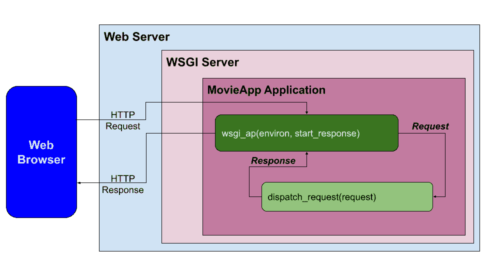
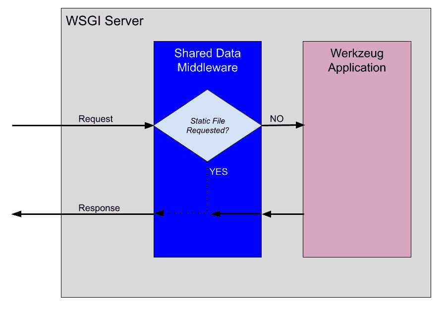
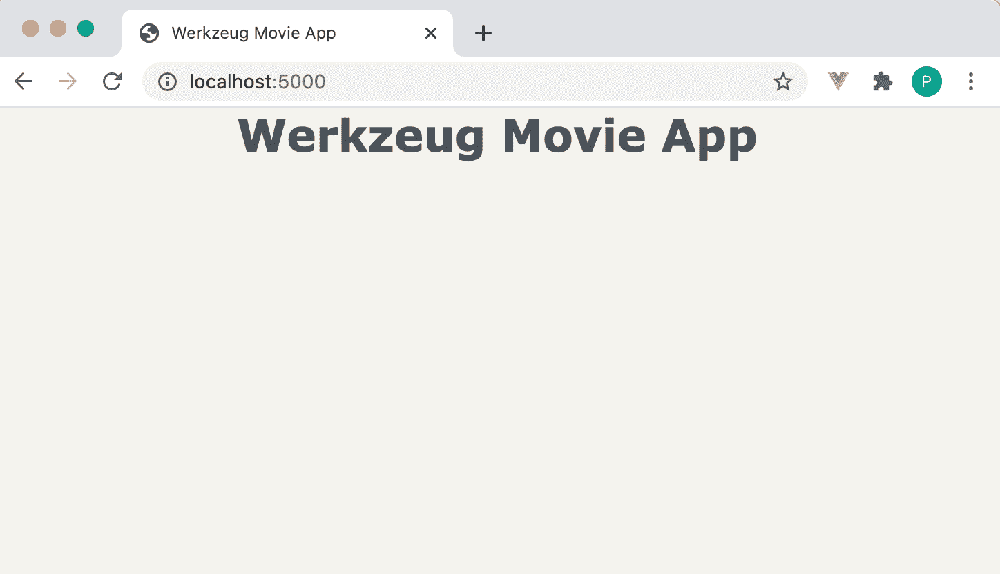
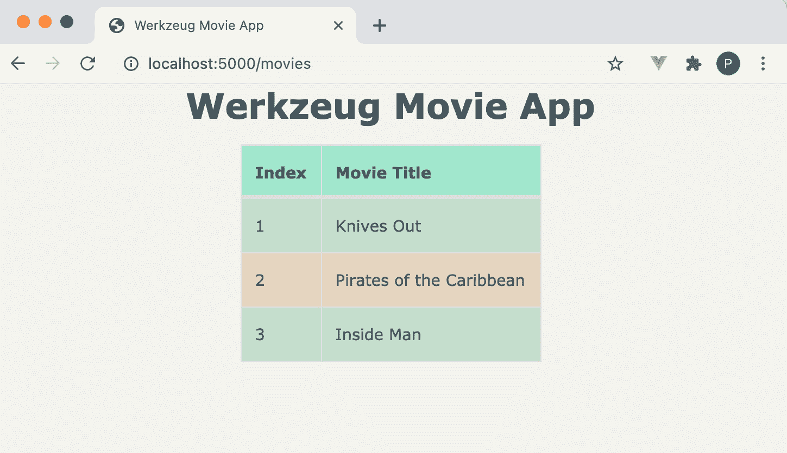
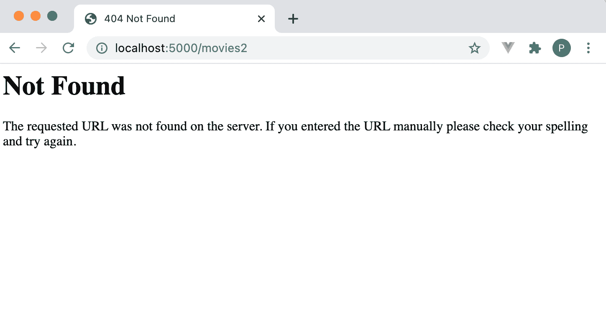
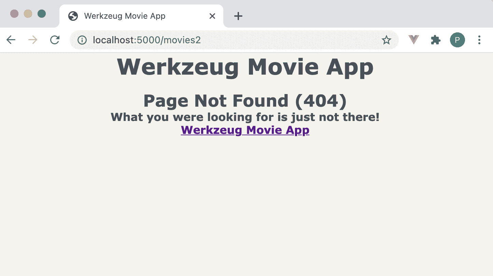
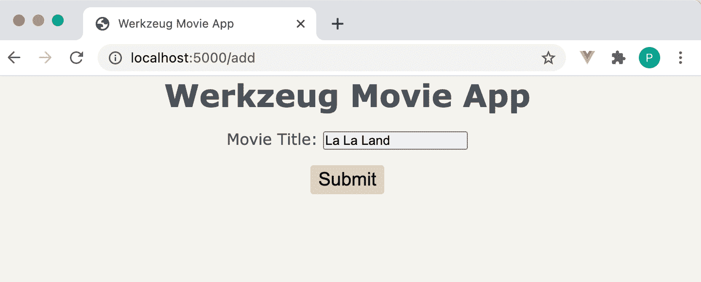
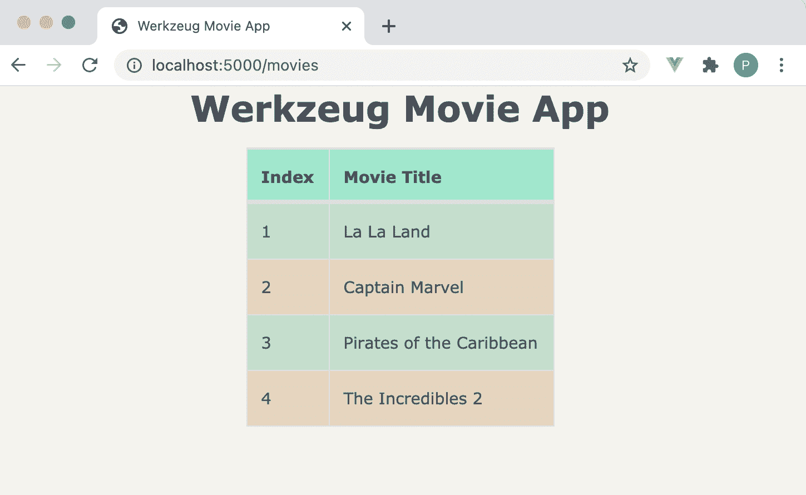

# 什么是工具？

> 原文：<https://testdriven.io/blog/what-is-werkzeug/>

这篇文章解释了什么是 Werkzeug T1，以及 T2 Flask T3 如何使用它来实现核心的 HTTP 功能。在这个过程中，您将使用 Werkzeug 开发自己的 WSGI 兼容应用程序，以创建类似 Flask 的 web 框架！

> 本文假设您之前有使用 Flask 的经验。如果您有兴趣了解有关 Flask 的更多信息，请查看我关于如何构建、测试和部署 Flask 应用程序的课程:
> 
> [用 Python 和 Flask 开发 Web 应用](/courses/learn-flask/)

## 烧瓶相关性

您可能已经注意到了，但是每次安装 Flask 时，您也会安装以下依赖项:

1.  [点击](https://click.palletsprojects.com/)
2.  其危险性
3.  [金佳](https://jinja.palletsprojects.com//)
4.  [MarkupSafe](https://markupsafe.palletsprojects.com/)
5.  工具

Flask 是所有这些东西的包装。

```
`$ pip install Flask
$ pip freeze

click==7.1.2
Flask==1.1.2
itsdangerous==1.1.0
Jinja2==2.11.3
MarkupSafe==1.1.1
Werkzeug==1.0.1  # !!!` 
```

## 什么是工具？

Werkzeug 是一个库集合，可用于在 Python 中创建 WSGI (Web 服务器网关接口)兼容的 Web 应用程序。

> WSGI (Web 服务器网关接口)服务器是 Python web 应用程序所必需的，因为 Web 服务器不能直接与 Python 通信。WSGI 是 web 服务器和基于 Python 的 web 应用程序之间的接口。

换句话说，Werkzeug 提供了一组实用程序来创建可以与 WSGI 服务器对话的 Python 应用程序，如 [Gunicorn](https://gunicorn.org) 。

> 想了解更多关于 WSGI 的知识吗？
> 
> 看看[‘Python 中的 Gunicorn 是什么？’](https://www.quora.com/What-is-Gunicorn-in-Python/answer/Michael-Herman-3)看看[构建 Python Web 框架](https://testdriven.io/courses/python-web-framework/wsgi/)课程。

Werkzeug 提供以下功能(*哪个烧瓶使用*):

1.  请求处理
2.  响应处理
3.  URL 路由
4.  中间件
5.  HTTP 实用程序
6.  异常处理

它还提供了一个具有热重装功能的基本开发服务器。

让我们深入一个使用 Werkzeug 构建 web 应用程序的例子。我们还将看看 Flask 如何实现类似的功能。

## Hello World 应用程序

作为对 Werkzeug 的介绍，让我们首先使用 Werkzeug 提供的一些关键功能创建一个“Hello World”应用程序。

> 您可以在 GitLab 上找到本文讨论的项目的源代码:[https://gitlab.com/patkennedy79/werkzeug_movie_app](https://gitlab.com/patkennedy79/werkzeug_movie_app)。

### 装置

首先创建一个新项目:

```
`$ mkdir werkzeug_movie_app
$ cd werkzeug_movie_app
$ python3 -m venv venv
$ source venv/bin/activate
(venv)$` 
```

安装工具，Jinja，和[redis py](https://redis-py.readthedocs.io/):

```
`(venv)$ pip install Werkzeug Jinja2 redis
(venv)$ pip freeze > requirements.txt` 
```

[Redis](https://redis.io) 将作为存储电影数据的数据存储解决方案。

### 应用

Werkzeug 是用于构建兼容 WSGI 的 web 应用程序的库集合。它没有提供像 [`Flask`](https://github.com/pallets/flask/blob/1.1.2/src/flask/app.py#L103) 这样的高级类来搭建完整的 web 应用程序。相反，您需要自己从 Werkzeug 的库中创建应用程序。

在项目的顶层文件夹中创建一个新的 *app.py* 文件:

```
`from werkzeug.wrappers import Request, Response

class MovieApp(object):
    """Implements a WSGI application for managing your favorite movies."""
    def __init__(self):
        pass

    def dispatch_request(self, request):
        """Dispatches the request."""
        return Response('Hello World!')

    def wsgi_app(self, environ, start_response):
        """WSGI application that processes requests and returns responses."""
        request = Request(environ)
        response = self.dispatch_request(request)
        return response(environ, start_response)

    def __call__(self, environ, start_response):
        """The WSGI server calls this method as the WSGI application."""
        return self.wsgi_app(environ, start_response)

def create_app():
    """Application factory function that returns an instance of MovieApp."""
    app = MovieApp()
    return app` 
```

`MovieApp`类实现了一个兼容 WSGI 的 web 应用程序，该应用程序处理来自不同用户的请求，并向用户返回响应。下面是这个类如何与 WSGI 服务器交互的流程:



当一个请求进来时，它在`wsgi_app()`中被处理:

```
`def wsgi_app(self, environ, start_response):
    """WSGI application that processes requests and returns responses."""
    request = Request(environ)
    response = self.dispatch_request(request)
    return response(environ, start_response)` 
```

环境(`environ`)在`Request`类中被自动处理以创建一个`request`对象。然后`request`在`dispatch_request()`进行处理。对于这个初始示例，`dispatch_request()`返回一个响应“Hello World！”。然后从`wsgi_app()`返回响应。

> 烧瓶比较:
> 
> `MovieApp`是 [`Flask`](https://github.com/pallets/flask/blob/1.1.2/src/flask/app.py#L103) 类的简化版。
> 
> 在`Flask`类中， [`wsgi_app()`](https://github.com/pallets/flask/blob/1.1.2/src/flask/app.py#L2417) 是与 WSGI 服务器接口的实际 WSGI 应用程序。此外， [`dispatch_request()`](https://github.com/pallets/flask/blob/1.1.2/src/flask/app.py#L1914) 和 [`full_dispatch_request()`](https://github.com/pallets/flask/blob/1.1.2/src/flask/app.py#L1938) 用于执行请求分派，将 URL 匹配到适用的视图函数并处理异常。

### 开发服务器

将以下代码添加到 *app.py* 的底部，以运行 Werkzeug 开发服务器:

```
`if __name__ == '__main__':
    # Run the Werkzeug development server to serve the WSGI application (MovieApp)
    from werkzeug.serving import run_simple
    app = create_app()
    run_simple('127.0.0.1', 5000, app, use_debugger=True, use_reloader=True)` 
```

运行应用程序:

导航到 [http://localhost:5000](http://localhost:5000) 查看“Hello World！”消息。

> 烧瓶比较:
> 
> 在`Flask`类中，有一个等价的利用 Werkzeug 开发服务器的 [`run()`](https://github.com/pallets/flask/blob/1.1.2/src/flask/app.py#L889) 方法。

## 用于服务静态文件的中间件

在 web 应用程序中，中间件是一个软件组件，可以添加到请求/响应处理管道中以执行特定的功能。

web 服务器/应用程序要执行的一个重要功能是提供静态文件(CSS、JavaScript 和图像文件)。Werkzeug 为这个功能提供了一个名为 [`SharedDataMiddleware`](https://github.com/pallets/werkzeug/blob/1.0.1/src/werkzeug/middleware/shared_data.py#L32) 的中间件。

`SharedDataMiddleware`非常适合与 Werkzeug 开发服务器一起工作来提供静态文件。

> 对于生产环境，您可能希望将 Werkzeug 开发服务器和`SharedDataMiddleware`切换为 web 服务器，如 [Nginx](https://www.nginx.com) 和 WSGI 服务器，如 Gunicorn。

要使用`SharedDataMiddleware`，首先将一个名为“static”的新文件夹添加到带有“css”和“img”文件夹的项目中:

```
`├── app.py
├── requirements.txt
└── static
    ├── css
    └── img` 
```

在“static/img”文件夹内，添加来自[https://git lab . com/patkennedy 79/werkzeug _ movie _ app/-/blob/main/static/img/Flask . png](https://gitlab.com/patkennedy79/werkzeug_movie_app/-/blob/main/static/img/flask.png)的烧瓶标志。保存为 flask.png 的*。*

 *接下来，扩展应用程序工厂功能:

```
`def create_app():
    """Application factory function that returns an instance of MovieApp."""
    app = MovieApp()
    app.wsgi_app = SharedDataMiddleware(app.wsgi_app, {
        '/static': os.path.join(os.path.dirname(__file__), 'static')
    })
    return app` 
```

更新顶部的导入:

```
`import os

from werkzeug.middleware.shared_data import SharedDataMiddleware
from werkzeug.wrappers import Request, Response` 
```

现在，当 Werkzeug 应用程序(`app`)处理一个请求时，它将首先被路由到`SharedDataMiddleware`以确定是否请求了一个静态文件:



如果请求静态文件，`SharedDataMiddleware`将生成静态文件的响应。否则，请求将被传递到 Werkzeug 应用程序，在`wsgi_app()`中进行处理。

要查看`SharedDataMiddleware`的运行，运行服务器并导航到[http://localhost:5000/static/img/flask . png](http://localhost:5000/static/img/flask.png)查看 Flask 徽标。

要获得 Werkzeug 提供的中间件解决方案的完整列表，请查看[中间件](https://werkzeug.palletsprojects.com/en/1.0.x/middleware/)文档。

> 烧瓶比较:
> 
> 烧瓶不使用`SharedDataMiddleware`。它采用不同的方法来提供静态文件。默认情况下，如果静态文件夹[存在](https://github.com/pallets/flask/blob/1.1.2/src/flask/app.py#L597)，Flask 会自动[添加一个新的 URL 规则](https://github.com/pallets/flask/blob/1.1.2/src/flask/app.py#L601)来提供静态文件。
> 
> 为了说明这个概念，在 Flask 应用程序的顶层项目中运行`flask routes`,您将看到:
> 
> ```
> (venv)$ flask routes
> 
> Endpoint     Methods  Rule
> -----------  -------  -----------------------
> index        GET      /
> static       GET      /static/<path:filename> 
> ```

## 模板

正如 Flask 项目中通常所做的那样，我们将使用 Jinja 作为我们应用程序的模板引擎。

首先向项目中添加一个名为“templates”的新文件夹:

```
`├── app.py
├── requirements.txt
├── static
│   ├── css
│   └── img
│       └── flask.png
└── templates` 
```

为了利用 Jinja，扩展`MovieApp`类的构造函数:

```
`def __init__(self):
    """Initializes the Jinja templating engine to render from the 'templates' folder."""
    template_path = os.path.join(os.path.dirname(__file__), 'templates')
    self.jinja_env = Environment(loader=FileSystemLoader(template_path),
                                 autoescape=True)` 
```

添加导入:

```
`from jinja2 import Environment, FileSystemLoader` 
```

> 烧瓶比较:
> 
> Flask 也利用 Jinja [`Environment`](https://github.com/pallets/flask/blob/1.1.2/src/flask/templating.py#L36) 来创建模板引擎。

在`MovieApp`类中，添加一个新的`render_template()`方法:

```
`def render_template(self, template_name, **context):
    """Renders the specified template file using the Jinja templating engine."""
    template = self.jinja_env.get_template(template_name)
    return Response(template.render(context), mimetype='text/html')` 
```

该方法将`template_name`和任何变量传递给模板引擎(`**context`)。然后它使用 Jinja 的`render()`方法生成一个`Response`。

> 烧瓶比较:
> 
> `render_template()`函数看起来不眼熟吗？烧瓶[风味](https://github.com/pallets/flask/blob/1.1.2/src/flask/templating.py#L125)是烧瓶中使用最多的功能之一。

要查看`render_template()`的运行情况，请更新`dispatch_request()`以呈现模板:

```
`def dispatch_request(self, request):
    """Dispatches the request."""
    return self.render_template('base.html')` 
```

对应用程序的所有请求现在都将呈现*模板/base.html* 模板。

```
`<!DOCTYPE html>
<html lang="en">
<head>
    <meta charset="UTF-8">
    <title>Werkzeug Movie App</title>

    <!-- CSS file for styling the application -->
    <link rel="stylesheet" href="/static/css/style.css" type="text/css">
</head>
<body>
    <h1>Werkzeug Movie App</h1>
    
    
</body>
</html>` 
```

确保将此模板添加到“templates”文件夹中，并保存一份[https://git lab . com/patkennedy 79/werkzeug _ movie _ app/-/blob/main/static/CSS/style . CSS](https://gitlab.com/patkennedy79/werkzeug_movie_app/-/blob/main/static/css/style.css)到 *static/css/style.css* 的副本。

运行服务器。导航到 [http://localhost:5000](http://localhost:5000) 。您现在应该看到:



## 按指定路线发送

路由意味着将 URL 与适当的视图功能相匹配。Werkzeug 提供了一个 [`Map`](https://werkzeug.palletsprojects.com/en/1.0.x/routing/#werkzeug.routing.Map) 类，允许你使用 [`Rule`](https://werkzeug.palletsprojects.com/en/1.0.x/routing/#werkzeug.routing.Rule) 对象匹配 URL 来查看函数。

让我们在`MovieApp`构造函数中创建`Map`对象来说明这是如何工作的:

```
`def __init__(self):
    """Initializes the Jinja templating engine to render from the 'templates' folder."""
    template_path = os.path.join(os.path.dirname(__file__), 'templates')
    self.jinja_env = Environment(loader=FileSystemLoader(template_path),
                                 autoescape=True)
    self.url_map = Map([
        Rule('/', endpoint='index'),
        Rule('/movies', endpoint='movies'),
    ])` 
```

不要忘记重要的一点:

```
`from werkzeug.routing import Map, Rule` 
```

每个`Rule`对象定义一个 URL 和一个视图函数(`endpoint`)，如果 URL 匹配，则调用该函数:

```
 `self.url_map = Map([
        Rule('/', endpoint='index'),
        Rule('/movies', endpoint='movies'),
    ])` 
```

比如请求主页('/')时，要调用`index`视图函数。

> 烧瓶比较:
> 
> Flask 的一个令人惊奇的特性是 [`@route`装饰器](https://github.com/pallets/flask/blob/1.1.2/src/flask/app.py#L1288)，它被用来给一个视图函数分配一个 URL。这个装饰器[为 Flask 应用程序更新了`url_map`](https://github.com/pallets/flask/blob/1.1.2/src/flask/app.py#L1278) ，类似于我们上面定义的手工编码的`url_map`。

为了利用 URL 映射，需要更新`dispatch_request()`:

```
`def dispatch_request(self, request):
    """Dispatches the request."""
    adapter = self.url_map.bind_to_environ(request.environ)
    try:
        endpoint, values = adapter.match()
        return getattr(self, endpoint)(request, **values)
    except HTTPException as e:
        return e` 
```

现在，当一个请求进入`dispatch_request()`时，`url_map`将被用来尝试`match()`一个条目的 URL。如果请求的 URL 包含在`url_map`中，那么将调用适用的查看功能(`endpoint`)。如果在`url_map`中没有找到该 URL，则引发异常。

> 异常处理将很快被介绍！

添加导入:

```
`from werkzeug.exceptions import HTTPException` 
```

我们已经在`url_map`中指定了两个视图函数，所以现在让我们在`MovieApp`类中创建它们:

```
`def index(self, request):
    return self.render_template('base.html')

def movies(self, request):
    return self.render_template('movies.html')` 
```

虽然 *templates/base.html* 已在前一部分创建，但现在需要创建 *templates/movies.html* :

```
`


<div class="table-container">
    <table>
        <!-- Table Header -->
        <thead>
            <tr>
                <th>Index</th>
                <th>Movie Title</th>
            </tr>
        </thead>

        <!-- Table Elements (Rows) -->
        <tbody>
            <tr>
                <td>1</td>
                <td>Knives Out</td>
            </tr>
            <tr>
                <td>2</td>
                <td>Pirates of the Caribbean</td>
            </tr>
            <tr>
                <td>3</td>
                <td>Inside Man</td>
            </tr>
        </tbody>
    </table>
</div>
` 
```

这个模板文件利用模板继承来使用*base.html*作为父模板。它生成一个包含三部电影的表格。

[http://localhost:5000](http://localhost:5000) 看起来应该是一样的:


但是，如果您导航到[http://localhost:5000/movies](http://localhost:5000/movies)，您现在会看到电影列表:



## 异常处理

尝试导航到[http://localhost:5000/movies 2](http://localhost:5000/movies2):



当在`url_map`中没有找到 URL 时，返回的页面是默认的错误页面:

```
`def dispatch_request(self, request):
    """Dispatches the request."""
    adapter = self.url_map.bind_to_environ(request.environ)
    try:
        endpoint, values = adapter.match()
        return getattr(self, endpoint)(request, **values)
    except HTTPException as e:
        return e` 
```

此外，您应该在控制台中看到以下内容:

```
`127.0.0.1 - - [07/Mar/2021 12:13:17] "GET /movies2 HTTP/1.1" 404 -` 
```

让我们通过展开`dispatch_request()`来创建一个定制的错误页面:

```
`def dispatch_request(self, request):
    """Dispatches the request."""
    adapter = self.url_map.bind_to_environ(request.environ)
    try:
        endpoint, values = adapter.match()
        return getattr(self, endpoint)(request, **values)
    except NotFound:
        return self.error_404()
    except HTTPException as e:
        return e` 
```

更新导入:

```
`from werkzeug.exceptions import HTTPException, NotFound` 
```

现在，当在`url_map`中没有找到 URL 时，将通过调用`error_404()`来处理它。在`MovieApp`类中创建这个新方法:

```
`def error_404(self):
    response = self.render_template("404.html")
    response.status_code = 404
    return response` 
```

创建*模板/404.html* :

```
`


<div class="error-description">
    <h2>Page Not Found (404)</h2>
    <h4>What you were looking for is just not there!</h4>
    <h4><a href="/">Werkzeug Movie App</a></h4>
</div>
` 
```

现在，当您导航到[http://localhost:5000/movies 2](http://localhost:5000/movies2)时，您应该会看到一条友好的消息:



> 烧瓶比较:
> 
> 当`Flask`类中的`full_dispatch_request()`检测到异常时，会在 [`handle_user_exceptions()`](https://github.com/pallets/flask/blob/1.1.2/src/flask/app.py#L1781) 中优雅地处理。Flask 还允许为所有 HTTP 错误代码定制错误页面。

## 请求处理

在本节中，我们将向应用程序添加一个表单，允许用户输入他们最喜欢的电影。

### 雷迪斯

如前所述，我们将使用 Redis(一种内存中的数据结构存储)来保存电影，因为它的读/写速度快，易于设置。

[安装](https://redis.io/download)并运行 Redis。

> 启动和运行 Redis 的最快方法是使用 Docker:
> 
> ```
> $ docker run --name some-redis -d -p 6379:6379 redis 
> ```
> 
> 要检查 Redis 容器是否正在运行:
> 
> 要停止正在运行的 Redis 容器:
> 
> ```
> $ docker stop some-redis  # Use name of Docker container
> ```
> 
> 如果您不是 Docker 用户，请查看以下资源:

为了利用 Redis，首先更新`MovieApp`构造函数来创建`StrictRedis`的实例:

```
`def __init__(self, config):  # Updated!!
    """Initializes the Jinja templating engine to render from the 'templates' folder,
 defines the mapping of URLs to view methods, and initializes the Redis interface."""
    template_path = os.path.join(os.path.dirname(__file__), 'templates')
    self.jinja_env = Environment(loader=FileSystemLoader(template_path),
                                 autoescape=True)
    self.url_map = Map([
        Rule('/', endpoint='index'),
        Rule('/movies', endpoint='movies'),
    ])
    self.redis = StrictRedis(config['redis_host'], config['redis_port'],
                             decode_responses=True)  # New!!` 
```

此外，构造函数(`__init__()`)还有一个额外的参数(`config`)，用于创建`StrictRedis`的实例。

导入:

```
`from redis import StrictRedis` 
```

传递给构造函数的配置参数需要在应用程序工厂函数中指定:

```
`def create_app():
    """Application factory function that returns an instance of MovieApp."""
    app = MovieApp({'redis_host': 'localhost', 'redis_port': 6379})
    app.wsgi_app = SharedDataMiddleware(app.wsgi_app, {
        '/static': os.path.join(os.path.dirname(__file__), 'static')
    })
    return app` 
```

## 表单处理

为了允许用户向 Redis 存储器添加电影，我们需要在`url_map`中添加一个新的查看功能:

```
`def __init__(self, config):
    """Initializes the Jinja templating engine to render from the 'templates' folder,
 defines the mapping of URLs to view methods, and initializes the Redis interface."""

    ...

    self.url_map = Map([
        Rule('/', endpoint='index', methods=['GET']),
        Rule('/movies', endpoint='movies', methods=['GET']),
        Rule('/add', endpoint='add_movie', methods=['GET', 'POST']),  # !!!
    ])

    ...` 
```

`url_map`中的`Rule`条目已经扩展为指定每个 URL 允许的 HTTP 方法。此外，还添加了“/add”URL:

```
`Rule('/add', endpoint='add_movie', methods=['GET', 'POST']),` 
```

如果用 GET 或 POST 方法请求“/add”URL，那么将调用`add_movie()`视图函数。

接下来，我们需要在`MovieApp`类中创建`add_movie()`视图函数:

```
`def add_movie(self, request):
    """Adds a movie to the list of favorite movies."""
    if request.method == 'POST':
        movie_title = request.form['title']
        self.redis.lpush('movies', movie_title)
        return redirect('/movies')
    return self.render_template('add_movie.html')` 
```

导入:

```
`from werkzeug.utils import redirect` 
```

如果对'/add '发出 GET 请求，那么`add_movie()`将呈现*模板/add_movie.html* 文件。如果向“/add”发出 POST 请求，那么表单数据将存储在 Redis 存储器的`movies`列表中，用户将被重定向到电影列表。

创建*模板/add_movie.html* 模板文件:

```
`


<div class="form-container">
    <form method="post">
        <div class="field">
            <label for="movieTitle">Movie Title:</label>
            <input type="text" id="movieTitle" name="title"/>
        </div>
        <div class="field">
            <button type="submit">Submit</button>
        </div>
    </form>
</div>
` 
```

### 显示电影

因为我们现在将电影存储在 Redis 中，所以需要更新`movie()`视图函数来读取 Redis 中的`movies`列表:

```
`def movies(self, request):
    """Displays the list of favorite movies."""
    movies = self.redis.lrange('movies', 0, -1)
    return self.render_template('movies.html', movies=movies)` 
```

电影列表将被传递到 *templates/movies.html* 模板文件，该文件需要更新以遍历该列表来创建电影表:

```
`


<div class="table-container">
    <table>
        <!-- Table Header -->
        <thead>
            <tr>
                <th>Index</th>
                <th>Movie Title</th>
            </tr>
        </thead>

        <!-- Table Elements (Rows) -->
        <tbody>
            
            <tr>
                <td>{{ loop.index }}</td>
                <td>{{ movie }}</td>
            </tr>
            
        </tbody>
    </table>
</div>
` 
```

要查看表单处理的效果，首先导航到[http://localhost:5000/add](http://localhost:5000/add)并添加一个新电影:



提交表单后，您应该会被自动重定向到电影列表(可能包括以前添加的电影):



就是这样！

## 为什么不用 Werkzeug 代替 Flask？

Werkzeug 提供了 Flask 中的许多关键功能，但是 Flask 增加了许多强大的特性，例如:

1.  会议
2.  应用程序和请求上下文
3.  蓝图
4.  请求回调函数
5.  公用事业:
    1.  `@route`装饰工
    2.  `url_for()`功能
6.  CLI 命令
7.  异常处理
8.  测试客户端
9.  烧瓶外壳
10.  记录
11.  信号
12.  扩展ˌ扩张

与任何 web 框架一样——不要重新发明轮子！Flask 是 web 开发的一个更好的选择(与 Werkzeug 相比),因为它有丰富的特性集和大量的扩展。

## 结论

本文通过展示如何使用 Werkzeug 构建一个简单的 web 应用程序，概述了 Werkzeug，它是 Flask 的关键组件之一。虽然理解 Flask 中底层库的工作方式很重要，但是使用 Werkzeug 创建 web 应用程序的复杂性应该说明使用 Flask 开发 web 应用程序是多么容易！

此外，如果您有兴趣了解如何测试 Werkzeug 应用程序，请查看 Werkzeug 电影应用程序的测试:[https://git lab . com/patkennedy 79/Werkzeug _ Movie _ App/-/tree/main/tests](https://gitlab.com/patkennedy79/werkzeug_movie_app/-/tree/main/tests)。

如果你想了解更多关于 Flask 的知识，一定要看看我的课程- [用 Python 和 Flask 开发 Web 应用](/courses/learn-flask/)。

干杯！*